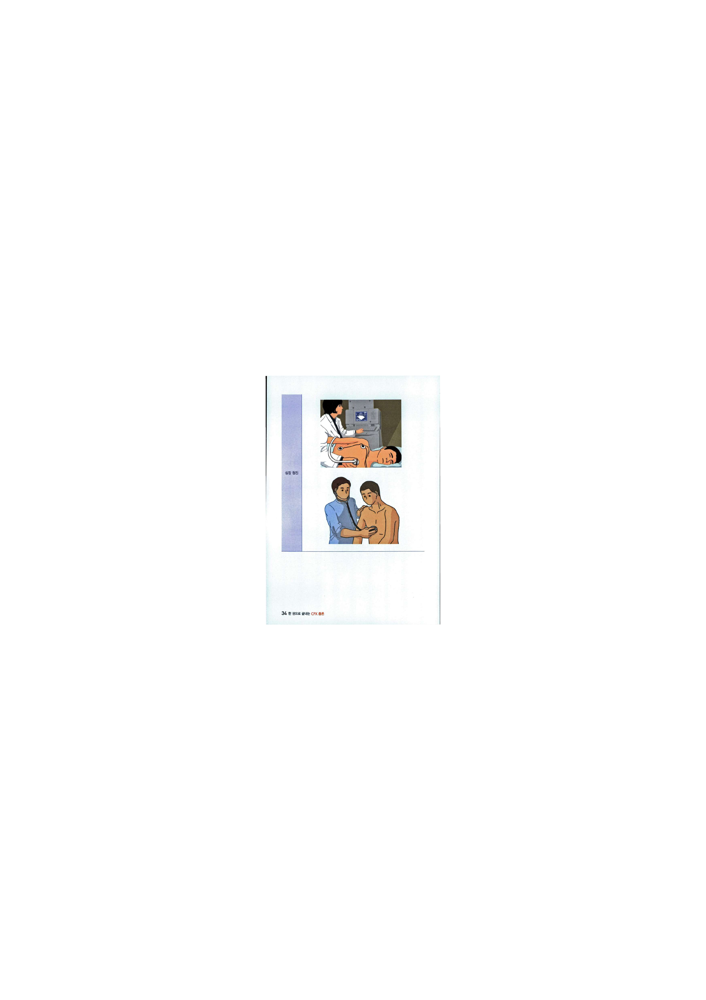
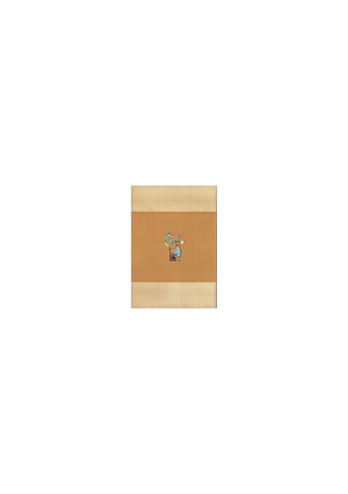

# CPX 총론 - 전체 추출본

> 생성 목적: CPX 환자 시뮬레이터의 평가 기준, 검색(RAG), 모듈별 체크리스트의 원천 데이터.
> 추출 방식: PDF 내장 텍스트/OCR 레이어를 페이지 단위로 추출. 표·도식은 읽기 순서가 일부 흐트러질 수 있어 항상 `source_pdf_page`로 원본과 대조한다.
> 원본 파일: `CPX 총론.pdf` / PDF 페이지 수: 466

## 사용 규칙
- 각 `## PDF page N` 블록은 원본 PDF의 물리 페이지 N에 대응한다.
- 임상평현별 모듈은 `docs/modules/`와 `data/modules/`에 분리되어 있다.
- 실제 평가 구현에는 `data/global_evaluation_rubric.json`과 대상 모듈 JSON을 함께 사용한다.

## PDF page 1

<!-- source_pdf_page: 1 -->
W
 권으로 圏내는
CPXi
경희대학교 의과대학 박민규, 박홍균 외
서울대학교 의과대학 장석진, 정성혜 외
연세대학교 의과대학 김유진, 박준영 외
8§& 8
한 끝 CPX의 C)LD COEX CAFE의 CPX 접근 전략이 나 체크리스트가 실기시험
준비에 많은 도움이 되고, 구성이 가장 잘 되어 있어 CPX의 기본이 됩니다.
에*^ 5
각 항목별 주 호소(chief complaint)에 맞게 진단 알고리즘을 추가하여 체계적인
접근이 가능하도록 하였습니다.

---

## PDF page 2

<!-- source_pdf_page: 2 -->
W
 권으로 圏내는
( K
M
L
E
B
H
i r m
전국 23개
의과대학 think-tank들과
전공의 선생님들 집필 참여!
자세한 내용구성을 통한 이해력 상승!
핵심 최신 교과서 분석과 최근 트렌드를 대비한 심화 지식 준비!
의사국가고시와 실제 진료 현장에 훌륭하게 대처할 수 있도록 구성!
•구성(전 15권)
k
^
소화기
산과
순환기
부인과
호흡기
소아과 총론
신장, 류마티스
소아과 각론
감염
정신과
내분비, 알레르기
마이너과
혈액, 종양
예방의학
외과 총론/각론
도서명: 한 권으로 끝내는 KMLE 매뉴얼
엮은이: 전국 23개 의과대학 thick-tank,
전공의, 임상강사
► Chief Complaint 분류된 내용
m
q
 u
n
n
l
■■圓
►
국시 출제 경향에 맞춘 문제 ► 체크리스트를 통한중요내용 정리
►정확한 사진과, 자료
사슬알균성인두염
비대상성 간경변증
• 바이러스성인두염에비해 급격한
복수,황달,간성혼수,상부위장관
발생, 고열
출혈 등의 합병증이 나타남

---

## PDF page 3

<!-- source_pdf_page: 3 -->
W
s 으로
 圏내는
c p x t a m
완전7 t f S
한 끝 CPX의 OLD COEX CAFE의 CPX 접근 전략이나 체크리스트가 실기시험
준비에 많은 도움이 되고, 구성이 가장 잘 되어 있어 CPX의 기본이 됩니다.
에당^
각 항목별 주 호소(chief complaint)에 맞게 진단 알고리즘을 추가하여 체계적인
접근이 가능하도록 하였습니다.

---

## PDF page 4

<!-- source_pdf_page: 4 -->
CPX 는 의사고시를 준비히는
여러분들이 반드시 거쳐 가야 할 관문 중 하나입니다.
의사 국가고시 실기 시험은 최근 의료 환경과 의학 교육의 변화를 반영하고자
진료 중심의 문항 및 시험 시간 확대 등 큰 변화가 있었던 제86회 국가고시(2021년
하반기 시행)를 기점으로 변화가 이어져오고 있습니다.
첫 번째, 기존의 공개 항목(진료 문항 54개, 수기 문항 32개)에서 임상표현 48개,
기본진료 술기 9개로 변경되었습니다. 또한, 기존의 술기 항목 7개가 진료로 흡수되
었습니다. 임상표현 48개를 수행할 시에 병력 청취, 신체 진찰, 환자 교육과 더불어
각 임상표현에 해당하는 술기를 수행해야 합니다.
두 번째，각 방의 시험 시간은 12분이며, 시험은 총 10개의 방(진료 문항 9개,
기본 술기 문항 1개)으로 이루어져 있습니다. 1〜9번 방은 진료 문항이며, 10번 방
은 기본 진료 술기 문항입니다. 응시자는 각자 배정받은 번호에 해당되는 방에서부
터 시험을 시작하여 방 순서대로 시험을 치루게 됩니다. 가령, 5번을 배정받은 경우
진료 문항 5개를 수행하고, 10번째 방에서 기본 진료 술기를 수행한 후 나머지 진료
문항 4개를 수행하게 됩니다.
세 번째, 사이 시험이 없어졌습니다. 기존의 시험에서는 10분 간의 CPX 후 5분간
해당 진료에 관한 사이 시험을 치러야 했습니다.
네 번째, 1분의 상황 숙지 시간에는 A4 용지가 지급되지 않아 필기를 할 수 없게
되었습니다. 1분간 문 앞에 적힌 상황 지침을 읽고 종이 울리면 방으로 들어가서
시험을 시작하게 됩니다.
이러한 변화에 발맞추어 본 개정판에서는 임상표현 48개 항목들의 진단 알고리즘
추가 및 임상 증례들의 최신 검사와 치료들을 수록하였습니다.
시험장에 들어가기 전, 주 호소를 파악 후 1분의 상황 숙지 시간 동안 해당 주 호소의

---

## PDF page 5

<!-- source_pdf_page: 5 -->
진단 알고리즘을 머리속으로 그리고 검사와 치료를 연상한다면 시험장에서 당황하지
않고 진단과 치료를 할 수 있도록 많은 정보를 담았습니다.
시험 변경 방식에 대한 보다 자세한 사항은 p. 10의 ‘CPX 시험 방식과 팁’에 실어
놓았으며, P. 66에 ‘한 끝만 아는 7가지 공통 립’을 정리해 두었으니 참고 바랍니다.
CPX 준비를 앞둔 학생 선생님들의 마음을 알고 있기에 최대한 도움이 될 수 있도
록 고민하며 집필하였습니다. 이 책이 앞으로 의사로서 나아가는 첫 발디딤에 있어
좋은 보템이 되기를 바랍니다. 이 책과 함께 충분한 연습을 하신다면 좋은 결과가
따를 것으로 생각합니다.
끝으로 이 책이 출간되기까지 책 작업에 함께 해주신 경희대학교 의과대학, 서울
대학교 의과대학, 연세대학교 의과대학, 인하대학교 의과대학, 일일이 나열할 수는
없지만, 이 책이 완성되기까지 조언을 아끼지 않았던 전국 의과대학 관련 선생님들
께 이 지면을 통해 진심으로 감사의 글 드립니다.
CPX 집필진을 대표하여
[지금까지 각 의과대학별 원고 집필진과 개정작업에 참여하신 선생님들]
경희대학교 의과대학
윤세규, 이인아, 홍서원, 김대규, 문성현, 박홍식, 김선영, 김지유, 박성주，하성호, 이지현
이현지. 송민성, 강동윤, 박지원, 이영재. 이승재, 손현민, 김찬영, 박민규, 박홍균
서울대학교 의과대학
허기영, 이지원, 권진아, 장석진, 정성헤
연세대학교 의과대학
안재범, 김제민, 김다찬. 옥태동, 김유진, 박준영, 조우종, 조원정, 박보겸

---

## PDF page 6

<!-- source_pdf_page: 6 -->
이 책의 장점
이 책은 선생 님들의 효율적 인 학습을 돕고자 CPX 48개 항목들을 계통별로 분류하
였습니다. 계통별로 주요 병력 청취 질문들과 신체 검진 항목들이 비슷하기 때문입니
다. 책 구성은 총론과 증례 파트로 구분되어 있습니다.
총론 파트에서는 각 주제별로 1) 진단 계획 및 검사와 치료 2) SP와의 면담에 도움
이 될 기본 진찰 사항 그리고 3) 참고 내용에 관한 내용 및 해당 주 호소에 대한 진단
알고리즘이 추가되 었습니다.
주제별로 연습하실 때, 총론 부분을 통해 기본 지식과 면담 흐름을 익히신 후 증례
집을 통해 연습하시면 좋은 결과를 얻으실 수 있을 것입니다. 여기에 별책 부록으로
되어 있는 채점표를 활용하신다면 내가 놓친 부분들이 어떤 것들인지 파악하는데 도
움되실 것입니다.
처음부터 CPX를 잘하는 사람은 없습니다. CPX 공부를 시작하는 초반에는 매우 낯
설고, 내가 잘하고 있는지 확신이 서지 않을 때도 분명 있을 것입니다. 하지만 이 책
을 활용하며 한 주제씩 연습합니다 보면 어느새 능숙한 학생 의사가 된 자신을 만날
것이니 너무 걱정하지 마십시오. 모든 예비의사 선생님들을 응원합니다.
질병별 진단/치료 계획 정리
각 단원의 주제에 맞게 질병의
계통 및 원인과 질병명 및 이
에 따른 진단법과 검사, 치료
방법에 대해 나열한 뒤, 이를
바탕으로 기본 진찰 사항인 병
력 청취 방법(+부분이 항목에
필요한 신체 진찰)에 대해 자
세하게 나열하였습니다.

---

## PDF page 7

<!-- source_pdf_page: 7 -->
임상술기
48개 임상표현에 동반되어 출제될 것으
로 예상되는 술기들을 항목별로 정리하
였습니다.
예상
金기
1. 항문 직장 진찰 : 종양으로 인한 복통이 아닌지 감별하기 위해 항문 직장 진찰을
시행해 봅니다.
2. 설명동의서 받기 : 급성 췌장염. 췌장 농양 등을 감별하기 위해 복부 CT룰 할 따
조영저廣 쓰므로 설명동의서를 받습니다.
병력 청취/신체 검진/환자 교육
진단 키워드에 따른 신체 검진을 한 눈
에 알아볼 수 있도록 정리하였고, 반드
시 시행해야 하는 신체 검진에는 (★)를
표시해 두었습니다. 학생 선생님들이
어려워하는 환자 교육 파트를 새롭게
정리하여 환자가 알아이= 할 내용을 교
육하는데 필요한 사항을 자세하게 기록
해 두어 공부하는데 수월할 수 있게 해
놓았습니다. 덤으로 진단에 따른 진단
계획을 요약 정 리해서 설명하였습니다.
f
V
S3B a«9«
~：'^ -
0 ' % WU aa B8H9U&T
Co ' Biawi 脚 aoftjufi?-심v지2SM요?
e».. ' oraoisoea성oias2W8?3ifc*iB#S2awa7
a
»sawois» 분 suff>
7t« S
져 抽 W UStf * Wifi?
Hraai iwp/swt/
OM « B!I*
waa.
im'i
®W«J
W80BSO »IB ■!«•«!
3. «■ - * «w *a 구bu M t««i w «!
• fvMW"WI
« *. SSM»tf #
Afcupldefanoioma)
2나 WWW 가나asJBHWa?/을*!
j 출KB이 S0MSWH7U유
*«s 어
면
기
剛
asfwa?
；
 kks
auvsa nu «m
MW! twra-
[iRJl 수#®적/W W]/Solder anoiopj/CaDul medusw
l»t!l w>i»ti * sioiazMwi 3*씩
iUUI Oil •Sa/O, «lll Irtl/MWili™ dullf»BS>
i«oi si«*cunati,D»o«a.
' Hnoei 现 •«車살0
A'
때고m/구억e/tfw 변
이
 XMA?
;
iwsB«ae
~
JW에*기
-K«»*WB«flUO «W«8tta!PlS7
• ISia-aoai S*r,tw»8*wu2>
f : iWK； 砂
持
 &UST
Eiaa B>)2육
: t . ■ om fjaa^a Bi»e?/suM3E e^iua?
« ：

뼈,糊예™삐7
85 ；
 ^ 1 0 . « « > « « .
>
이WWBg*여！삐너삐脚
« . «amB BM t,« BB ^
Q M IBa-Wli 6«o. ^
스:...-.;
.
........
aMBMci.
«
«« *S! 91101 SIMS? IWiClt s*asn NiAD]
세
이어 wa시니요■>
i®
A) ^ WftS! a&4WfciWI5tafiBWfi7.점거나 na«?!8식*•이®!시나a?
jito 그 awwwsa ««b M wm » seou
max SKti w» «» wmbbwi aetia
isasim g «n
V
'
.......
人 소
J
주 호소 별 알고리즘
주 호소(chief complaint) 에 맞게 1분
상황 숙지 시간 동안 떠올려야 할 진단
알고리즘을 추가하여 체계적인 접근이
71능하도록 하였습니다.
상북부*증
r/o "W 4%
oi»(n 적 oi ®jLtir
Parietal
Visceral
i
'---]
i
；
 I
식도위
간담해
식도위
간담
식도/위궤양
급성 담낭염
식도/위궤양
간농양
외상
급성 췌장염
Obstmciion
담석중
비뇨생식
Ectopic pregnan
Ovarian loislon
Rtz-Hugh-Cuttis
syndrome
Ureier awne, AP
싱장협판
(Functional,
Hernia,—)
실전 모의 증례
최신 CPX의 증례 파트를 통해 시험의
유형을 파악할 수 있으며, 증례마다 상황
지침에 따른 해설이 있어 케이스를 좀
더 쉽고, 정확하게 이해할 수 있습니다.
U«
WMl.twra 사
«» urn ♦»+S4.W.MI1.
:
nisa*! Ke*a*>w» <

---

## PDF page 8

<!-- source_pdf_page: 8 -->
■ 이 책의 차레
----------------------------
CPX 시험방식과팁 ..........................................
10
CPX 접근
전략
병력청취
........................................................... 12
신체 검진
............................... ; .........................
14
환자교육
..........................................................
16
환자/의사 관계• 신체진찰태도 ....................
18
PPI 요약
..........................................................
19
약자풀이
........................................................... 23
Physical examination
................................. 25
한 끝만 아는7가지공통팁 ............................ 66
----------------------------
01• 급성 복통....................................................... 68
소화기
02. 소화불량/만성 복통 .................................... 78
ᄋ3. 토혈
............................................................... 86
04. 혈변
............................................................... 92
05. 구토 ............................................................... 98
06. 배변 이상(변비/ 설사) .................................... 104
07•황달
................................................................114
----------------------------
08. 7|슴 *증 ...................................................
122
순환기
09■실신
...........................................................
128
10. 두근거림
..................................................
134
11. 고혈압
......................................................
142
12. 이상지질혈증
..........................................
148
-----------------------------
13. 기침
...........................................................
156
호흡기
14. 콧물/코막힘
...........................................
162
15. 객혈
..........................................................
170
16. 호흡곤란
..................................................
176
-----------------------------
17• 소변량 변화(다뇨증/ 핍뇨) ........................
184
신장/비뇨
18■붉은색소변 ................................................
194
19. 배뇨 이상/소변찔끔증
..........................
202

---

## PDF page 9

<!-- source_pdf_page: 9 -->
20. 발열..................................................................212
전신
21. 쉽게 멍이 둘.............................................
220
22. 피로............................................................
228
23. 체중 감소 .................................................
236
24. 체중증가/비만.........................................
244
-------------------------------
25. 관절 통증/부기............................................
252
관절/ 근골격/피부
26. 목통증/허리통증 ............................................
262
27. 피부 발진 .................................................
273
-------------------------------
28■
 기분변화 ...................................................
282
정신/신경
29. 불안...............................................................
288
30•수면장애.................................................. .
294
31. 기억력 저하 .......................................................
302
32. 어지럼.........................................................
312
33. 두통............................................................
320
34•경련............................................................
328
35. 근력/감각 이상..........................................
334
36. 의식장애.....................................................
344
37■떨림/운동이상..........................................
352
-------------------------------
38. 유방통/유방덩이........................................
362
산부/ 여성/소아
39. 질분비물/질출혈 ........................................
372
40■월경이상/월경통......................................
384
41•산전진찰 .................................................
394
42• 성장/발달지연 ..............................................
403
43. 예방접종
.................................................
416
-------------------------------
44• 음주/금연상담 ..............................................
426
상 담
45• 물질오남용 .............................................
436
46. 나쁜 소식 전하기 ..............................................
442
47■
 가정폭력/성폭력 ..............................
449
48. 자살 .........................................................
458

---

## PDF page 10

<!-- source_pdf_page: 10 -->
IS
V 1 '
f
,■
'广,
:
l i W
l l i ®
.ᅳ
鱗她纖#;齡« * 會i i g i g i i
靡
霄

하… ^ ^ ^
4C:rv시시 으
스
'
^ §lg g §l$ *g m g
m&> ^
 이
*®•* -
■사

---

## PDF page 11

<!-- source_pdf_page: 11 -->
^^^많^^^향월!^텔!^우^ 념향려흡^ 붉！
향9활놓!표^ 월y|f|j^j|표냉월!
CPX 접근 전략
노
.2
c p x 시험 방식과 팁
병력 청취
신체검진
환자 교육
환자/의사 관계. 신체 진찰 태도
ppi 요약
약자 풀이
Physical examination
ᄉ
 곡
/룹
룔
특
를
농
^
■
■

 iufe j놔Jilniil

---

## PDF page 12

<!-- source_pdf_page: 12 -->
CPX 시험 방식과 팁
1)CPX9 + OSCE 1 문항
* 시험의 세부 내용은 변경될 수 있습니다.
개정 시험(2021 년도 하반기 시행)부터 CPX 9문항, OSCE 1문항으로 시험을 보게
됩니다. 10문항 모두 12분으로 시간이 통일되었습니다.
CPX의 경우 9문항 중 대부분은 기존과 같이 병력 청취, 신체 진찰, 환자 교육만
수행하면 됩니다. 하지만 일부 문항은 소위 하이브리드 형으로 관련 술기를 추가
적으로 수행하도록 지시문에 주어질 수 있습니다. 예상컨대 국시원에서는 2021
년 시험 결과를 토대로 하이브리드 형 문항의 비중을 점진적으로 확대할 것으로
보입니다.
OSCE의 경우 응급 처치，상처 관리, 채혈 및 혈관 확보의 3가지 항목 중 1가지를
시험 보게 됩니다. 이때 각 항목에 해당하는 2〜3가지 술기를 차례대로 수행하도
록 지시문에 주어집니다. 가령, 응급 처치 항목을 시험 보는 경우 기본 심폐소생
법, 심장전기충격요법, 기관삽관법을 주어진 상황 지침에 따라 모두 수행해야 합
니다.
시험 순서의 경우 조 편성에 따라 처음에 CPX를 칠 수도 있고, ᄋSCE를 칠 수도
있습니다. 이러한 구조에서 중요한 것은 한 고사장에서 잘 하지 못했더라도 침착
하게 다음 시험에 임하는 것입니다. 실기 시험은 붙기만 하면 된다는 것을 꼭 기
억하십시오. 한 방에서 실수해도 나머지 방에서 잘하면 됩니다.
2)
시간 안배
개정 시험부터 시간 안배의 중요성이 커졌습니다. 시간은 늘면서 해야 하는 것은
많아졌기 때문에 시간 맞추는 연습을 많이 하셔야 합니다.
특히 술기를 빠르게 하는 연습을 하셔야 합니다.

---

## PDF page 13

<!-- source_pdf_page: 13 -->
CPX 9문항은 기존과 형식이 같으면서 오히려 시간이 12분으로 늘었기 때문에
여유가 있을 것입니다. 병력 청취 - 신체 진찰 ᅳ 환자 교육을 6_4ᅳ2(분)로 수행
하는 것을 권장합니다.
병력 청취 _ 신체 진찰 - 환자 교육 - 술기를 5ᅳ2-2-3(분)으로 수행하는 것이
바람직할 것으로 보입니다. 쉽지 않겠지만, 연습을 통해 시간을 줄이셔야 합니다.
OSCE의 경우에도 2〜3개의 술기를 12분 안에 수행해야 하므로 시간이 넉넉하지
않습니다. 그 중에서도 특히 상처 관리 항목이 학생들이 느끼기에 시간이 가장
부족했습니다.
3) 상황 지침과 연상 연습
■ 시험실에 들어가기 전에 상황 지침을 확인할 시간을 부여받게 됩니다. 상황 지침
에는 CPX 주제, 환자의 활력 징후(혈압，맥박，호흡수, 체온)와 시험실에서 수행
해야 할 항목들(병력 청취, 신체 검진, 환자 교육) 또는 시험에 참고할 수 있는 상
황 설명이 있는 경우가 대부분입니다. 신체 진찰 또는 하이브리드 술기 유무를
잘 확인하고 들어가야 합니다.
2021년부터는 고사장에서 메모지를 배부하지 않으므로 상황 지침을 눈으로 보면
서 감별 진단 및 관련된 문진과 신체 진찰을 머릿속에 생각하고 들어가야 합니
다. 이를 위해 어떤 임상 표현형에 대한 감별 진단을 1분 안에 머릿속으로 떠올
리는 연습을 하는 것을 추천합니다.
이때 수록한 진단 알고리즘을 머리속으로 떠올려 체계적으로 원인을 감별해 나
가며, 가장 71능성 높은 질환으로 접근해야 합니다. 해당 시험은 진단의 정확성
보다 감별 진단 및 접근이 중요하다는 것을 잊지 마시기 바랍니다.

---

## PDF page 14

<!-- source_pdf_page: 14 -->
병력 청취
CPX 학습을 할 때 주된 내용은 병력 청취에 대한 학습이 될 것입니다.
병력 청취는 주제별로 발생할 수 있는 질병들에 대해서 정확히 알아야 하기 때문에
상당히 부담이 되는 부분입니다. 하지만 주제별로 공통적으로 문진해야 할 항목들
이 있으므로 그 항목들에 대해서 넘버링을 만들어 두고 암기한 뒤, 세부적인 항목
을 따로 학습한다면 효율적으로 학습을 할 수 있을 것입니다.
본 교재에서는 공통적으로 문진할 항목들을 오른쪽 페이지와 같이 정리하였습니다.
• 주제별로 학습을 할 때, Character 위주로 학습하는 것이 중요합니다.
Character는 질병의 특성을 가장 잘 반영하는 내용이고, 주제마다 차이가 큰 편이
기 때문에 주제별로 발생할 수 있는 질병을 학습하면서 Character를 생각해 두는
것이 좋습니다. 그 다음으로는 Associated Sx.을 확인하여 질병마다 함께 발생할
수 있는 동반 증상을 확인하고，감별해야 할 질병에서 놓치지 않아야 할 것들을
물어볼 수 있도록 하시기 바랍니다. 그 외의 항목들은 거의 공통적으로 물어보게
되므로 연습을 충분히 하다 보면 자연스럽게 익숙해질 가능성이 높게 될 것입
니다.
• 다만 상담 항목에 대해서는 이 넘버링을 적용하기 어려우므로, 그 주제들은 따로
학습하시는 것이 좋겠습니다. 상담에서는 환자와의 공감대 형성과 환자 교육이
중요한 비중을 차지하므로, 너무 병력 청취에 몰두하여 다른 항목들을 놓치는 일
이 없도록 해야겠습니다.

---

## PDF page 15

<!-- source_pdf_page: 15 -->
넘버링
약자 풀이
의미
목적
0
Onset
증상의 발생 시점
급성/만성 확인
L
Location
증상의 ^■생 위치
문제가 되는 장기 확인
D
Duration
증상의 지속 시간
원인 감별에 도움
Co
Course
증상의 경과 과정
원인 감별에도움
Ex
Experience
이전 증상 발생 여부
원인 감별에 도움
C
Character
증상의 특성(색, 양, 세기, 냄새, 강도 뻗침 등)
질병의 원인을 확인
A
Associated Sx.
계통적 문진
놓칠 수 있는 다른 문제 확인
원인 확인에 대한 근거
F
Factor
악화/^화인자
원인 확인에 대한 근거
환자 교육에 도움
E
Event
이전 건강 검진 / 입원 여부
원인 확인에 대한 근거
오 I
외상력
외상 발생여부
외상에 의한 질병 발생 확인
고!*
과거력
고혈압, 당뇨• 고지혈증, 만성 간질환, 결핵
기저 질환
위험인자확인
61：
T
약물 투약력
현재 투여 중인 약물
약물과 질병의 연관성 확인
Ah
사회력
술. 담배, 커피. 운동. 식습관. 직업 등
위험 인자 확인
가
가족력
가족 중 유사 증상 여부
위험인자 확인
0다
여성력
생리력 문진
원인 감별에 ^움
P/E
Physical
examination
General, HEENT, Chest,
Abdomen, Extremity
원인 감별에 도움
원인 확인에 대한 근거
M
 교육
환자가 알아야 할 내용을 교육
환자와의 rapport 형성

---

## PDF page 16

<!-- source_pdf_page: 16 -->
신체 검진
신체 검진은 크게 앉은 자세, 선 자세, 누운 자세에서 수행하는 것으로 나누어 생각
할 수 있으며, 부위도 얼굴(눈, 코, 귀, 입), 목, 가슴，배, 팔, 다리, 생식기 등으로
다양합니다.
신체 검진은 익숙해지지 않으면 시간이 많이 걸릴 수 있으므로 같은 자세 • 부위별로 수
행해야 할 신체 검진을 묶어서 효율적으로 수행할 수 있도록 하는 것이 중요합니다.
부위별로 수행해야 할 신체 검진들은 다음과 같습니다.
눈
결막 시진, 안저검人 KCSF 검사 적을 증례들만)
코
비경
귀
이경, Dix hallpike test (설명하면 결과지를 줌)
입
구강 시진，탈수 정도 확인，인후 비대 확인
•목
[갑상샘] 변비/설사/두근거림/호흡곤란
체중감소/체중증가
경정맥 시진/경동맥 촉진
[경부림프절촉진] 기침/콧물/객혈& 만성복통/토혈/혈변
구토/ 변비/횡•달 & 감염/목운동 검사
가슴
[흉부 진찰(시-촉-타-청)] 호흡기 증례(기침/콧물/객혈/호흡곤란)
앞뒤 모두 시행
배
복부 진찰(시-청- 타-촉)
등
CVAT. ^통점 확인
항문’
생식기
：
 j-. .二 ；
_y ^
[직장수지검사] 항문, 직장의 병변 확인
벽 보고 돌아 누워 주세요«
[골반 진찰] 자궁 내 덩이. 염증 확인，천장 보고 누워 다리를 받침대 위에 올려 주세요
[외성기 진찰]

---

## PDF page 17

<!-- source_pdf_page: 17 -->
팔
운동, ^각，DTR
[Hoffmann 검사]
한 손으로 환자 손잡고 다른 손으로 환자 중지 끝 부분을 아래서 위로 튕김,
(+) 시 척수손상 의심
^■수정도 확인
Flapping tremor
다리
운동, 감각, DTR : 어지럼, 두통, 경련, 감각 이상
다리^목 부종 확인
Homan's sign : 호흡곤란，흉통
Babinski test ：
 어지럼, 두통, 경련, 감각 이상, 의식장애
SLR, Patrick test
신경학적
검진
[뇌신경검人H 人I야검人h EOM, 안면근육검人h 청력검사
[수막 자극 징후] Kemig, Brudzinski
[소뇌기능검새 Rapid alternative movement
Finger-to nose
Tandem gait
[Romberg test] Proprioception 검시*
(소뇌가 정상이라는 가정하에 하는 것，전정기관 문제)
기타
MMSE

---

## PDF page 18

<!-- source_pdf_page: 18 -->
환자 교육
환자 교육은 CPX에서 빠뜨리기 쉬운 부분입니다.
실제 시험에서 병력 청취와 신체 진찰에 몰두한 나머지 시간이 부족하여 환자 교육
을 충분히 하지 못하고 급하게 마무리 짓곤 하는데, 이 경우 상당한 점수 손실을
야기할 수 있습니다.
환자 교육은 2분 전 방송이 나오면 반드시 시행하시기 바랍니다. 환자 교육은 공식
적인 기준은 없으나 다음과 같은 내용을 정리해서 자연스럽게 할 수 있도록 하면
될 것입니다.
진단
현재 환지에서 의심되는 진단
검사
어떤 검사를 수행할 것이며, 수행하는 간단한 이유
계획
검사 이후 어떤 조치를 취할 것인지
주의점
환자의 생활 습관 등에서 교정해야 할 점
질문
궁금한 것이 있는지
질병별로 대체로 공통적인 항목이 많기 때문에 생활 습관 교정과 같은 부분은 미리
자연스럽게 입에 붙여 두시는 것이 좋습니다.
가령, 운동과 같은 항목은 “주 5회 하루 30분 이상, 땀이 약간 날 정도의 운동을 하
는 것이 도움이 됩니다”와 같이 미리미리 멘트를 만들어 두고 연습하는 것이 좋겠
습니다.
병력 청취처럼 세세하게 할 필요까지는 없어 보이지만 막상 하다 보면 말이 잘 나오
지 않으므로 미리미리 연습해 두는 것이 중요하겠습니다.

---

## PDF page 19

<!-- source_pdf_page: 19 -->
자주 말하게 되는 환자 교육 멘트를 몇 가지 정리해 보았습니다.
주제별로 환자 교육 내용을 정리해 두었으므로 그것과 함께 공부하시기 바랍니다.
환자 교육은 평소에 충분히 연습을 하지 않으면 환자 앞에서 머뭇머뭇하게 될 수
있으므로 매 연습 때 빠뜨리지 않고 꼭 연습을 해 주시기 바랍니다.
운동
주 5회 하루 30분 이상, 땀이 약간 날 정도의 운동을 하는 것이 도움이 됩니다.
일주일에 한 번 등산을 가는 것보다 날마다 계단오르기를 하는 것이 훨씬 더 도움이
됩니다.
식습관
매일 충분히 수분 섭취를 하며, 영양소 균형에 맞게 골고루 음식을 섭취하는 것이 좋습
니다.
오후 6시 이후에는 음식을 먹지 않는 것이 좋으며, 가공식품을 피하고 섬유소가 풍부
한 채소를 충분히 드시기 바랍니다.
홉연
담배는 각종 암 및 심혈관 질환의 위험 인자이며, 불임과도 관련이 있으므로 조속히
담배를 끊는 것이 필요합니다.
음주
과도한 음주는 간에 무리를 줄 수 있0 口 무 술은 하루에 2~3잔을 넘기지 않도록 술을
줄이는 것이 필요합니다.
위생
식사 전이나 밖에 나갔다 들어왔을 때 손을 씻는 것은 건강 관리에 많은 도움이 됩
니다.
응급^ #
현재 혈압이 매우 낮아 체내에 출혈이 의심됩니다. 수액 투여 등 조치를 하여 활력 징
후를 안정화시킨 뒤 추가 검사를 진행해야 할 필요가 있습니다.
입원이 필요할 가능성도 있으며, 지금 조치를 취하지 않으면 치명적인 상황이 발생
할 수 있습니다.

---

## PDF page 20

<!-- source_pdf_page: 20 -->
환자/의사 관계. 신체 진찰 태도
국시원에서 발표한 환자/의사 관계 및 신체 진찰 태도 평가 기준은 다음과 같습니다.
환자/의사 관계 (PPI) 채점 항목
번호
평가내용
가중치
1
내 이야기를 효율적으로 물어보고 잘 들어주었다.
아주 우수
O.A.
미흡
개방형/폐쇄형 질문, 호응, 대답 여유, 확인, 쉬운 용어,
분리 질문, 경청 자세, 면담 주제 협상
2
나의 생각과 배경을 효과적으로 알아냈다.
아주 우수
O 人
ᄀ
r
:
미흡
생각/걱정 질문, 기분/정서 표현 격려，나의 기대 파악.
일상 생활 영향 파악, 나의 입장/배경/처지 등에 관심
3
내가 이해하기 쉽게 설명하였다.
^卜주우수
o 人
미흡■
쉬운 용어, 필요한 정보« 내 의견과 선택권 고려,
기억하기 쉽게 설명, 이해 점검 및 질문 기회，근거았는 설명
4
나와 좋은 유대 관계를 형성하려고 했다.
아주 우수
우수
미흡
편하게 시작, 공감과 지지, 무비판적 수용, 진정성/솔직함，

편안한 분위기, 신뢰, 자신감, 존중
5
면담을 체계적으로 이끌어 나갔다.
이주 우수
个
미흡
논리/체계적 순서. 적절한 시간 배분, 주기적 요약/면담 방
향 제시，내 생각에 따라 질문 이어가기
6
신체 진찰 태도가 좋았다.
아주 우수
o 人
T—T
미흡
손 위생, 人I전 설명, 가려주기, 환자 안전과 불편함 배려

---

## PDF page 21

<!-- source_pdf_page: 21 -->
PPI 요약
PPKpatient-physician interaction) 사례 모음
최근 cpx 문항에서 갈수록 중요하게 다루어지는 부분은 PPI(환자"의사 관계)입니
다. 최근 ppi 배점도 증가하는 추세지만 매우 주관적이고 개개인에 따라, 증례에
따라 크게 달라지기에 어렵게 다가오는 경우가 많습니다. 특히 사람 사이의 상호
작용이기에 같은 멘트더라도 시선 처리, 타이밍, 목소리의 톤 등 비언어적인 요소
에 따라서 자연스러운 ppi가 될 수도, 어색하거나 사무적인 ppi가 될 수 있습니다.
시험에서는 주 호소를 이미 숙지한 상태로 들어간다고 가정하고 ppi를 평가하기에
환자의 중증도, 질환 종류에 따라 다양하게 멘트들을 활용하는 것이 필요합니다.
그렇기에 동기들과 연습하면서 서로 지속적인 피드백을 통해 비언어적 요소들을 관
찰하고, 수정하는 것이 큰 도움이 될 것입니다.
그러나 CPX 질문 문항과 술기 문항이 우선이고, 익숙해질수록 PPI에 신경을 쓸 여
력이 많이 생길 수 있으니 자연스럽게 몸에 배도록 연습하는 마인드로 접근하는
것이 좋습니다.
주요 채점 부분별 Tip
• PPI 항목 중 ‘나와 좋은 유대 관계를 형성하려고 했다’에는 자기 소개, 일상 대화,
존중, 자신감, 신뢰감 둥이 포함됩니다. 예를 들어, 무미건조한 형식적인 태도로
환자를 대하면 존중 항목에서 점수가 감점될 수 있습니다. 심지어 이런 상황에서
무의미한 질문까지 반복하면 의사에 대한 신뢰감 역시 떨어질 수 있습니다.
• 다음으로 PPI 항목 중 ‘나의 말을 잘 들어 주었다’에는 경청하는 태도, 시선 처리,
환자의 말 가로채지 않기 등이 포함됩니다. 여기서 시선 처리 e.g., 눈 맞춤의 경
우 진료 중인 의사의 자신감과 함께 현재 환자 본인이 존중받고 있음을 평가할 수
있는 항목이므로 중요합니다. 실제 국가고시 실기 .모의 환자로 활동했던 분들의
피드백에 의하면 눈 맞춤 항목이 중요한 것은 맞지만，진료 시간 내내 크으와 눈을

---

## PDF page 22

<!-- source_pdf_page: 22 -->
맞추는 행위는 환자에게 무언의 압박을 주기 때문에 환자에게 부담이 될 수 있으
므로 많은 연습을 통해 나만의 적정선을 찾는 것이 필요합니다.
• PPI 항목 중 ‘효율적으로 잘 물어보았다’에는 개방형 질문 유무, 중간 요약 등이
포함됩니다. 해를 거듭할수록 impression을 명확하게 잡기 어려운 문항이 국시에
많이 출제되면서 개방형 질문에 잘 대답하지 않는 모의 환자도 늘고 있습니다. 그
러나 CPX 주제에 따라 개방형 질문이 필수인 항목이 있으므로 총론과 증례를 통
한 충분한 연습이 중요합니다. 또한, 진료 시간 내 반드시 중간 요약은 필수적이
기에 신체 진찰 이전 혹은 공통 파트(과/ 가/ 약/ 사/외 / 가/ 여) 직전에 최소 3〜4
가지 항목은 언급할 필요가 있습니다.
• PPI 항목 중 ‘나의 입장을 이해하려고 노력하였다’에는 공감 표현, 나의 입장 파악
등이 포함됩니다. 모의 환자 역할을 하는 사람 중에는 연기를 전공한 사람도 있기
에 형식적 혹은 가식적인 공감은 오히려 부정적인 평가를 받을 수 있습니다. 실제
환자가 아니기에 진심 어린 공감을 하기 쉽지 않지만, 대비하지 않았을 경우 ‘나쁜
소식 전하기’와 같은 주제에서 당황할 수 있으므로 본인만의 리액션 방법 혹은 멘
트들을 정리하고, 익숙해지도록 많은 연습이 필요합니다.
• 마지막으로 PPI 항목 중 ‘환자가 이해하기 쉽게 설명하였다’에는 간단명료함, 진료
내용에 대한 환자의 이해도 점검, 질문 기회, 쉬운 용어 사용 등이 포함됩니다. 임
상 과목을 공부하면서 수많은 의학 용어를 약자로 배우는데, 진료 과정 중 의료인
이 아니면 알기 어려운 약자를 쓰면 진료에 대한 환자의 이해도와 치료에 대한 순
옹도 역시 낮아질 수 있으므로 주의할 필요가 있습니다. 한 끝 총론에 정리된 약
자의 한글 용어 정도는 필수적으로 숙지할 필요가 있습니다. 또한, 해부 구조를
비유하여 표현하거나(물풍선 등), 직접 그림을 그리거나 혹은 치료 계획을 작성하
고 보여주며 설명하는 방법도 효과적입니다,
• 다음 표는 증례에서 등장하는 공통적이고 흔한 상황들과 이에 추천되는 PPI 멘트
들입니다. 연습할 때 활용해 보시면 좋겠습니다.

---

## PDF page 23

<!-- source_pdf_page: 23 -->
면담 시작 시
오시느라 힘들지는 않으셨어요?
많이 기다리지 않으셨나요?
날씨가 더운데/추운데 혹은 좋은데/나쁜데 오시느라 고생 많으셨습니다.
주 호소 경청 직후
많이 힘드셨겠어요■
 일상 생활에 지장이 많이 가지는 않나요?
증상에 대한 몇 가지 질문 드려보고 원인 파악해서 최대한 빨리 불편하신
점 해결해 드리도록 하겠습니다.
말하기 부담스러운
내용 말한 직후
(여성력，폭력，우울 등)
이야기를 꺼내기 부담스러우셨을 텐데. 말씀해 주셔서 정말 감사합니다.
환자분과 진료실 내에서 나누는 대화는 비밀 보장이 되니까 편하게 말씀해
^ 세요、
여성력 관련 질문 전
해당 증상의 원인이 여성력과도 관련이 있을 수 있어서 관련하여 질문 드
려도 될까요?
과거력 특이 사항
있는 경우
많이 놀라셨겠어요• 지금은 괜찮으신가요?
(사망한 경우) 상심이 크셨겠어요
본인도 비슷한 질환이 아닐까 걱정이 많으시겠어요ᅵ
치료 관련
비협조적인 경우(입원 등)
환자분의 그런 마음은 이해가 되지만. [위험 경과]가 생길까 걱정이 많이 됩
니다. 다시금 고려해 주시겠어요?
누락된 사항을
다시 물어보는 경우
중요한 부분을 혹시라도 놓쳤을까 하여 질문 몇 가지 드려볼께요.
그 외 팁들
기본적으로 PPI는 반사적으로 나오는 것이 중요합니다. 관련 상황이 나오면 바로 나
올 수 있도록 연습하는 것을 추천합니다.
• 표현형의 중증도에 따라서 목소리 톤을 바꾸는 것도 좋습니다.
• 신체 진찰을 하면서(방해되지 않는 선에서) 질문을 하는 것도 PPI와 시간 절약에
도움이 됩니다. 예를 들어 복부 진찰을 하면서 관련 증상을 묻거나, 목 주변 진찰
을 하면서 갑상샘 질환 관련 문항들을 묻는 방법도 좋습니다.
• PPI는 제3자 입장의 시선이 정말 큰 도움이 됩니다. 적극적인 상호 피드백을 통해
본인에게 맞는 스타일을 익히는 것이 좋습니다.

---

## PDF page 24

<!-- source_pdf_page: 24 -->
추가 제언
[45. 물질오남용](p.436)은 유일하게 환자가 치료를 원하지 않는 경우로 제시할 수 있
습니다.
이 경우 전형적인 상담 플로우로 진행할 경우 SP가 비협조적인 태도를 보여 PPI 형
성 및 면담 진행에 차질이 생기는 경우가 있어 어려움을 느낀 사례가 있었습니다.
이런 경우 교육 순서를 앞으로 가져오는 방법을 사용해보는 것을 추천드립니다.
이 방법을 사용하면 SP에게 답변을 성실하게 해줄 동기를 부여하고，의사의 전문성
이 강조되어 보이며，이후의 면담 흐름이 협조적으로 진행되는 데 큰 도움이 됩니
다. 다음 요약한 예시를 참고 바랍니다.
[물질 복용 상황]
문잔 직후 해당 약물에 대한 설명 및 위험성 교육，문진 이유에 대한 설명한 이후
[의존성] 문진 재개(편집자 참고 : 총론 P. 437 상담 플로우 참고)
문진 단계
접근 전략
활용 가능한 예시
물질 복용 상황
첫 질문인 익물 종류를 질문하고, 바로 PPI 멘트 활용해 보기
(약물 복용의 목적 중 m/c를 상정하여 질문하기)
m 아편계 진통제: 최근에 수술 받으셨나 봐요?
각성제: 최근 할 일이 많으신가 봐요?
다이어트제 ：
 최근에 다이어트 하시나 봐요?
약물 설명 및
위험성 교육
약물의 위험성 안내 및 처방이 어렵다는 사실을 안내하기
ED 아편계 진통제 : 아편계 진통제는 의존성이 매우 크고, 부작용이 큰 약으로. 원칙
상 수술 직후 수 일 혹은 말기 암 환자의 통증 조절 등의 상황 외에는 원칙 상
처방이 불가능합니다.
각성제 : 각성 효고ᅡ를 많이 보고 계신 것 같다가도 장기 복용 시 환시나 정신증의
위험성이 나타나는 경우가 많고. 심한 의존성이 있어 환자분께 처방할 경우 해
가 될 수 있습니다.
문진의 필요성
설명
이후 진행할 상담이 환자에게 대안 제시를 위한 목적임을 설명하기
환자분에게 적절한 약물을 처방하고 필요한 부분에 대해 치료해 드리기 위해서
문진 및 신체 진찰이 필요합니다. 혹시 괜찮으실까요?
이후 면담은 정상적으로 진행

---

## PDF page 25

<!-- source_pdf_page: 25 -->
ABGA
Arterial Blood Gas Analysis
동맥 혈액 가스 분석검사
ASO
Anti Streptolysin 0
항연쇄상구균 용혈소
AXR
-
단순 복부 방사선 촬영
BPPV
benign paroxysmal positional vertigo
성돌발체위현기증
CBC
complete blood count
전체 혈구검사
chest CT
-
흉부 전산화단층 촬영
CRP
c-reactive protein
■응성단백시험
CT
computed tomography
컴퓨터 ^층촬영(술)
CXR
chest X-ray
기슴)(선
DRE
digital rectal examination
직장손가락검사
EGD
-
상부 위장관 내시경검사
ELISA
enzyme-linked Immunosorbent assay
효소결합면 역흡착측정법
ERCP
endoscopic retrograde cholangiopan
creatography
내시경 역행쓸개이자조영(술)
내시경역행담췌관조영(술)
ESR
erythrocyte sedimentation rate
적혈구 침강 속도 혈침 속도
hCG
human chorionic gonadotropin
시람 융모생식샘 자극호르몬
ICS
inhaled corticosteroid
흡입용 스테로이드
ig
Immunoglobulin
면역글로불린
KUB
-
X선 검사 : 콩팥요관방광 단순촬영술

---

## PDF page 26

<!-- source_pdf_page: 26 -->
LFT
liver function test
간기능 혈액검사
LTT
lactose tolerance test
젖당부하검사
MRI
magentic resonance imaging
자기공명영상
PBS
peripheral blood smear
말초혈액펴바른표본
PCR
polymerase chain reaction
중합효소 연쇄 반응. 중합 연쇄 반응
PET
positron emission tomography
양전자 방출 단층 촬영
PFT
p니Imonary function test
폐기능검사
PSA
prostate specific antigen
전립샘 특이 항원
PSVT
paroxysmal supraventricular tachycardia
돌발심실상빈맥
SPECT
-
심근관류 단일광자 단층 촬영
TFT
-
^■상샘기능검사
TRUS
digital rectal examination
직장경유 초음파 촬영

---

## PDF page 27

<!-- source_pdf_page: 27 -->
mm
a
Physical
examination
*11)
'*4紀
,
세
傲
a .
부
P h y s ic a l e x a m in a t io n
-M
장
P h y s ic a l e x a m in a t io n
호흡기
P h y s ic a l e x a m in a t io n
전
신
P h y s ic a l e x a m in a t io n
관
절
P h y s ic a l e x a m in a t io n
신
경
P h y s ic a l e x a m in a t io n
유
빙•
P h y s ic a l e x a m in a t io n

---

## PDF page 28

<!-- source_pdf_page: 28 -->
부 Physical exam ination
자세 설정
① 베개를 베고 천장을 보고 놈도록 한다.
② 환자의 손은 옆구리에 붙이도록 하고 다리는 구부려서 복부에 힘이 들어가지 않게 한다.
③ 환자에게 양해를 구하고 복부를 칼돌기 (xiphoid prcess)부터 두덩 결합(symphysis pubis)
까지 충분히 노출한다.
④ 의사는 환자의 오른편에 서도록 한다.
진찰 : 복부 진찰은 시 - 청 - 타-촉진의 순으로 이뤄진다.
① 시진 : 복부를 시진하여 함몰 부위나 외상, 점상 출혈 등이 없는지 확인한다. 기침을 하게
하여 배에 덩이가 돌출되었는지, 모양이 비대칭적인지 등을 확인한다. 청진기가 차가울 수
있으니 꼭 따뜻하게 손으로 비벼서 하도록 한다.
② 청진 : 복부를 4분면으로 나눠서 각각을 청진하고 심와부도 청진한다. 청진기가 배에 닿으
면 차가울 수 있으니 꼭 미리 양해를 구하고 손으로 청진기를 따뜻하게 해 둔다.
• 장음이 잘 들리지 않을 경우 4구역에서 2〜3분 이상 듣는다.
• 혈압이 높을 경우, 명치 부위와 우상복부, 좌상복부에 청진기를 대어 bruit 들리는지 확인
• 우상복부(간), 좌상복부(지라)에 대고 환자의 들숨, 날숨 동안 마찰음이 들리는지 확인
(염증 의심)
[Midline]
Urinary bladder / Urethra(female)
Right Upper Quadrant
Left Upper Quadrant
P y l o r o u s
S t o m a c h
D u o d e n u m
S p l e e n
L i v e r
L e f t k i d n e y a n d a d r e n a l
R i g h t k i d n e y a n d
g l a n d
a d r e n a l g l a n d
S p l e n i c f l e x u r e o f c o l o n
H e p a t i c f l e x u r e o f c o l o n
B o d y o f t h e p a n c r e a s
H e a d o f t h e p a n c r e a s
Right Lower Quadrant
Left Lower Quadrant
C e c u m / A p p e n d i x
S i g m o i d c o l o n
R i g h t o v a r y a n d f a l l o p i a n
L e f t o v a r y a n d f a l l o p i a n
t u b e ( f e m a l e )
t u b e ( f e m a l e )
R i g h t u r e t e r a n d
L e f t u r e t e r a n d
l o w e r k i d n e y p o l e
l o w e r k i d n e y p o l e
R i g h t s p e r m a t i c c o r d ( m a l e )
L e f t s p e r m a t i c c o r d ( m a l e )

---

## PDF page 29

<!-- source_pdf_page: 29 -->
③
타진 : 타진을 하기 전에 환자에게 통증이 있는 곳을 먼저 물어보고 그곳을 마지막에
타진하도록 한다. 왼손의 가운데 손가락을 복부에 댄 후 오른쪽 가운데 손가락으로 왼쪽
손가락의 두 번째 마디를 수직으로 두드려 타진을 한다. 타진으로 hepatomegaly, sple
nomegaly, ascites 등을 확인할 수 있다. 우상복부에서 빗장 중간선을 따라 타진을 해 가며
간의 변연을 확인하고, 간비대가 있는지를 볼 수 있다.
• 아픈 부위를 가리키도록 한 후 복부를 두드려 보겠다고 말한다.
• 간의 크기 확인(midclavicular line) ：
 유두부터 배꼽 아래 부분까지 연속하여 타진한다.
ta- ■명상대 ylcli는 y|\>■도 EPil-iH^IcK
[간 타진]
오른쪽 midclavicular line을 따라 유두부터 배꼽 아래선까지 타진하여 간의 경계를 확인한다.
[복수 타진 방법]
• Shifting dullness
복수를 확인하는 방법 : 복부 중앙에서 여러 방향으로 타진하여 가스 팽만음-둔탁음
경계를 그린 후 환자를 좌우로 비스듬히 놈게 하고 타진하여 경계 이동이 있는지 확인

---

## PDF page 30

<!-- source_pdf_page: 30 -->
• Fluid wave
환자에게 양손을 세워 복부 중앙선을 세게
누르게 한 상태에서 의사는 손가락 끝으로
환자의 한쪽 옆구리를 가볍게 두드리고,
다른 손은 반대쪽옆구리에 대고 액체 파동
이 있는지 확인
• CVA tenderness(왼손 바닥 대고 오른손
두드림)
Costophrenic angle에 손바닥을 대고 주
먹으로 두드려준다. 신장의 위치가 어디인
지 정확하게 알기 어려우므로 양쪽을 한번
씩만 치는 것이 아니라 연속적으로 위에서
내려가며 여러 번 쳐 준다.
④ 촉진 : 마찬가지로 아픈 곳이 있다면 마지막에 촉진을 한다. 두 손을 겹쳐서 촉진을 하게
되는데, 이 또한 4분면을 나눠서 하되, 얄은 촉진/깊은 촉진을 나눠서 2번(!) 하도록 한
다. Abdominal mass, tenderness나 rebound tenderness, muscle guarding 등의 소견을
확인하도록 한다.
[Light Palpation]
[Deep Palpation]

---

## PDF page 31

<!-- source_pdf_page: 31 -->
• 얕은 촉진(한 손) ： spasm, rigidity, 통증, 얄은 덩 이 유무 확인
• 깊은 촉진(두 손) : 덩이의 윤곽，위치, 크기, 굳기, 압통, 박동, 운동성 확인, tenderness
있는 부위(국소 염증 의심)는 rebound tenderness 확인
• 간 : 왼손으로 뒤쪽 받치고，오른손으로 아래에서 위쪽으로 촉진, 심호흡하게 하면서 깊은
숨을 내쉴 때 간의 경계 부위 확인
• 비장 : 오른손으로 뒤쪽 받치고, 왼손으로 촉진
[직장수지검사]
항 ii OSCE °JAi■숭기 “항科例장(digital rectal examination, DRE)" 내4중 창조

---

## PDF page 32

<!-- source_pdf_page: 32 -->
양손 2, 3, 4 손가락으로 환자의 양쪽(양쪽 차이 있는지 느낌) 노동맥을 누르면서
측정한다. 리듬이 규칙적이라면 한 쪽 손에서 15초간 맥박수를 갠 뒤 4를 곱하
여 분당 맥박수를 정한다. 맥박이 빠르거나 불규칙하면 60초 동안 측정한다.
맥박 측정
목진찰
목동맥진찰
(목진찰부터는
누워세
목 진찰을 하겠습니다. 누워주시겠습니까?
목이 잘 보이도록 벽 쪽으로 고개를 살짝 돌려주세요.
EJV, IJV의 박동 시진
• 경정맥암 : 침대를 45° 올리고, 목정맥 박동의 가장 높은 지점으로부터 복장
뼈 상부까지의 거 리 측정(직각자나 카드 이용, cm로 측정)
• 목동맥암 : 2, 3 손가락을 반지연골 위치에서 목빗근 안쪽으로 압력 가함
반드시 좌우 순차적으로!!
• 목동맥 청진 : bell로 청진/좌우 순차적으로!!
목동맥 청진 : 청진기 벨 부위로 목동맥을 청진한다. 이상음이 들릴 시에는 em-
bolism의 위험으로 촉진을 하면 안 된다.

---

## PDF page 33

<!-- source_pdf_page: 33 -->
목동맥 촉진: 반지연골 부근에서 목빗근의 안족으로 목동맥을 찾아 촉진한다.
목정맥진찰
심장 청진
JVP(jugular venous pressure)를 측정해야 할 상황에서는 환자를 눕히고 침대
를 30° 올린 상태를 취한다.
경정맥이 가장 잘 보이는 위치로 각도를 조절한다. 다음으로 환자의 머리는 관
찰하고자 하는 쪽의 반대쪽으로 약간 고개를 돌리게 한 후 해당 경정맥을 시
진한다. 직각자를 이용하여 흉골에서 경정맥의 가장 높은 거리를 재면 그 값
이 JVP이다.
심장 청진은 ■시 - 촉 - 타 - 청진’ 순으로 이뤄진다.
시진 : 심장을 봤을 때 심첨부가 들려있는지 확인하여 좌심 비대가 있는지 본다.
또한 우흉골연에서 박동이 보인다면 우심실의 비대를 의심할 수 있다.
• 윗옷을 을려주세요.
• Apex 박동과 최대 박동 지 점을 찾기
촉진 : 제 3,4 심음과 제 1,2 심음이 촉진으로 느껴지기도 하며，심잡음이 진동
으로 느껴지기도 한다(thrill). 촉진 부위는 우흉골연 제2늑간, 좌흉골연 제
2늑간, 좌흉골연, 심첨부, 심와부이다. 촉진을 할 때에는 숨을 들이쉬었다
내쉬고 참는 것을 반복한다.

---

## PDF page 34

<!-- source_pdf_page: 34 -->
심장 청진
• 손을 대겠습니다.
• 손 따뜻하게 비빈 뒤, 심장 끝에 손을 길게 펴 대고 이상진동, 밀어 올림 등 확인
• 5번째 갈비 사이 빗장뼈 중간 위치에서 2, 3, 4 손가락 끝으로 심장박동
찾기 ᅳ 위치 확인되면 한 손가락만 대고 박동 확인
• 복장뼈 왼쪽 3, 4, 5번째 갈비 사이에 손가락대고 “숨 내쉬고 멈추세요.”
ᅳ 우심실 수축기 박동 위치, 직경, 강도，기간 알아보기
• 왼쪽2번째 갈비사이 손가락 ᅳ 폐동맥 박동 확인(두드러지면 확장, 혈류 증가)
• 오른쪽 2번째 갈비사이 손가락 ᅳ 대동맥 박동 확인(느껴지면 대동맥류)
Aortic
Tricupid or
right ventric 니
Pulm onic
Erb’s p o in t

---

## PDF page 35

<!-- source_pdf_page: 35 -->
심장 청진
타진 : 각 ICS를 타진해가며 심장의 변연을 확인한다.
왼쪽 ᅳ 오른쪽으로/3, 4, 5, 6번째 갈비 사이를 3군데씩 타진(심장
크기 확인)
청진
실제 시험에서 가장 중요한 부분으로 CPX에서 실제 심장 진찰을 할 때에는
시간상 거의 청진만 하게 된다.
청진기의 diaphragm으로 촉진과 마찬가지로 동일한 위치인 우흉골연 2번째
늑간, 좌흉골연 2번째, 3번째, 4번째, 5번째 늑간, 심첨부를 모두 청진하도록
한다.
Aortic regurgitation이 의심될 경우에는 Erb’s area(왼쪽 복장뼈 옆 부위)를 청
진하는데, 이때는 가슴을 앞으로 기울인 다음 숨을 내쉬게 하고, 참게 하여
청진하도록 한다.
추가적으로 심부전이 의심될 경우 환자를 왼쪽으로 놈힌 다음 심첨부를 청진
하여 S3, S4의 심음을 듣도록 한다.
• 왼쪽 2번째 갈비 , 오른쪽 2번째 갈비，4번째 갈비, apex 총 4군데 청 진
왼쪽을 보고 옆으로 누워주세요.
• Bell로 apex 청진 ᅳ 제 3심음, 제 4심음, 승모판 잡음 청진
앉아주세요. 숨을 내쉬고 참아주세요.
• Diaphragm으로 apex, 왼쪽 sternum 경계에서 아래, 위 총 2번 청진
대동맥판 부위
Aortic area
폐동맥판 부위
Pulmonic area
삼천판 부위
Tricuspid area
승모판 부위
Mitral area

---

## PDF page 36

<!-- source_pdf_page: 36 -->
_텍스트 레이어가 비어 있는 시각 자료 페이지._

---

## PDF page 37

<!-- source_pdf_page: 37 -->
호흡기 Physical exam ination
한 손을 이용해 비경의 집게 부분을
잡고 비경을 코구멍에 삽입 후 비
경을 벌린다. 반대 손으로는 펜라
이트로 코 안에 빛을 비추면서 확
인한다. 반대편도 같은 방법으로
양쪽 모두 시행한다.
다음 그림에 표시된 부분이 부비동이고, 양 손의 검지를 이용해서 부비등 부분을
누른다. 어느 정도 힘을 가해서 눌러야 하고，압통의 여부를 확인하며 누른다.
부비동검사
흉부검사의 순서는 ‘시- 촉- 타- 청진’ 순으로 진행한다. 원칙적으로는 전면과
후면을 모두 검사해야 한다. 하지만 짧은 신체 진찰 시간에 있어서 양쪽 모
두 일일이 다 검사하기엔 시간이 부족하므로 흉부 진찰이 정말 중요한 항목
에서만 다 하도록 하자.
• 호흡수 측정 : 맥박 재는듯한 자세/내 시계를 보면서 15초 동안의 호흡수x4
맥박을 재겠습니다. ᅳ 호흡수를 측정한다고 하면 환자가 호흡수와 형태
바꿀 수 있음
• 손톱과 입술 : 청색증/곤봉지
시진 : 환자에게 편안한 자세를 취한 뒤 상의를 걷어달라고 정중하게 요청한
다. 환자가 상의를 걷으면 숨을 깊게 쉬게 한 뒤 관찰한다. 이때 양쪽을 비교
해가며 보는 것이 중요하다.
• 목 시진 : 목근육의 수축, 기관 편위 유무
• 흉부 시진 : 자세, 흉부의 직경, 기형 유무
• 뒤로 돌아서 손을 앞가슴에 모아주세요. (앞 뒤 순서는 상관 없음)
• 윗옷을 올리도록 하겠습니다.
• 숨을 크게 쉬어보세요.

---

## PDF page 38

<!-- source_pdf_page: 38 -->
흉부 진찰
의 엄지를 등 뒤에 대고 감싸는 모양을 취한다. 그 후 환자에게 숨을 들이 마
쉬고 내쉬게 한다. 그 후 양 폐가 늘어나고 줄어드는 정도를 확인하고, 서로
대칭적인지 비교하며 관찰한다. 그 다음은 촉각 진동감을 보는데, [그림 2]
처럼 손을 댄 뒤 “아”라는 소리를 내게 한 뒤 촉각 진동감을 양쪽 대칭성을
확인하며, 3군데 이상 확인하며 듣는다.
[그림 1]
[그림 2]
• 만져보기 : 등을 만져보겠습니다.
아프면 말씀하세요.
손을 따뜻하게 비빈 뒤, 위에서부터 손을 넓게 펴서 꾹꾹 눌러
보기 (4 번)
•흉곽검사 : 10번 갈비 밑에 엄지두고/나머지 손가락으로 허리 감싸고/
주름 생길 정도로 엄지를 모아 줌
숨 쉬어보세요.
ᅳ 흉곽이 벌어지는 정도와 대칭의 정도를 살펌
• 촉각 진탕 : 손등이나 손바닥 등 살 많은 부위를 환자 둥에 대고 “아” 소리
내보세요. _ 촉각 진동감의 감소, 증가 여부 확인
위에서래로 4번，옆구리에서 1번(손 댈 때마다 “아” 해주기)
타진 : 한 쪽 손을 환자의 가슴에 대고 반대 손의 2〜3번째 손가락을 이용해 타
진한다. 이때 위, 중간, 아래 옆 부분 총 6군데 이상을 타진해야 한다. 한 가
지 더 유의해야 할 점은 양측을 비교해 가야 하기 때문에 Ei자 형태나 지그
재그 형태로 타진을 해야 한다.
• 왼손을 갈비뼈에 평행하게/오른손 중지로 왼손 중지 첫 마디를 2번씩 두
드림 ᅳ “리을” 8번, 아래 옆구리 2번

---

## PDF page 39

<!-- source_pdf_page: 39 -->
흉부 진찰
청진 : 청진기가 차가울 수도 있다고 양해를 구한 뒤 타진과 마찬가지로 6군데
a 자 혹은 지그재그 형태로 청진을 한다. 이때 환자에게 숨을 들이마시고 내
쉬어 달라고 부탁을 한 뒤 충분한 시간을 거 쳐 폐음을 듣는다.
• 청진을 할테니 입을 벌리고 숨을 크게 쉬세요.
차가울 수 있습니다.
' “리을” 8번，아래 옆구리 2번 ᅳ 앞으로 돌아주시고, 손을 내 려주세요.
(앞면도 시촉타청 똑같이!)

---

## PDF page 40

<!-- source_pdf_page: 40 -->
전신 Physical exam ination
구강검사
갑상샘
한 손으로는 펜라이트를 켜고, 반대 손으로
설압자를 집어 혀를 누른다. 시야가 확보
되면 혀의 탈수 여부와 구강 궤양, 인두 부
위, 편도 부분을확인한다.
E B 1 갑상샘 촉진 후 경동맥 청진을 하지 않도록 유의합니다. 경동맥 청진 후
이상 없음을 확인한 후에 갑상샘 촉진을 합니다. ᅳ 색전 위험
갑상샘은 시진과 촉진 크게 두 가지로 나뉜다. 시진은 먼저 환자에게 정면을
바라보게 한 뒤 턱을 약간 들어 올리게 한다. 그 후 침을 삼키게 해 양쪽 갑
상샘의 크기, 대칭성, 모양 등을 확인한다.
촉진 같은 경우는 촉진하고자 하는 갑상샘의 반대쪽에서 밀어줘야 한다. 가령
왼쪽 갑상샘을 촉진하고자 한다면 오른쪽 갑상샘을 오른손으로 민 뒤 침을
삼키게 한 뒤 왼손으로 왼쪽 갑상샘을 촉진한다. 반대쪽도 같은 방법으로 촉
진^ 다.

---

## PDF page 41

<!-- source_pdf_page: 41 -->
BSD 환자분 갑상샘에서 만져지는 종괴가 있는지 보기 위해서 갑상샘 촉
진을 시행하려고 합니다. 고개를 숙여주시고, 먼저 오른쪽 갑상샘을
만져볼테니 턱을 오른쪽으로 돌려주시겠어요?(자세 취하고) 침을 삼
켜주세요!
• 환자와 마주본 상태에서 환자의 고개를 flexion시키고, 턱을 오른쪽으로
향하게 한다.
• 후에 larynx를 왼쪽으로 밀면서 내 왼손으로는 환자가 침을 삼킬 때 환자
의 오른쪽 갑상샘을 두 손가락으로 만진다.
②
Posterior에서 접근
B O 목을 뒤로 젖혀 주세요. 침을 삼켜주시겠어요?
• 반지 연골 아래 2, 3손가락 위치시켜 오른쪽 갑상샘을 만질 때 좌측을 밀며
우측을촉진!
'
환자에게 천장을 보라고 지시한 후 아래 눈꺼풀을 아래로 뒤집어 당기며 빈혈,
황달 여부 등을 확인한다.
샘
결^/공막
검사

---

## PDF page 42

<!-- source_pdf_page: 42 -->
경부
림프절
환자에게 측면으로 고개를 돌리고 목을 약간 들어 경부 림프절이 다 노출되는
자세를 취해달라고 양해를 구한다.
제일 먼저 시진을 통해 덩이나 발적 등을 확인한다. 반대쪽도 마찬가지로
시진을 한다. 그 후 손의 검지와 중지로 다음 그림과 같이 림프절을 양쪽을
비교해 가며 촉진한다.
경부 림프절을 먼저 촉진 후 겨드랑 림프절까지 촉진한다.
목에 있는 림프절을 촉진해보도록 하겠습니다.
• 양 손의 2번째 3번째 손가락을 목 림프절을 빠짐 없이 촉진
• 다음 그림에 표시된 부분들을 하나하나 둥글게 누르며 촉진
자, 이제 숨을 크게 들이마쉬세요.
• Supraclavicular LN 촉진
네, 경부 림프절이나 만져지는 덩이는 없네요.

---

## PDF page 43

<!-- source_pdf_page: 43 -->
관절 Physical exam ination
환자를 편안한 자세로 늄게 한다. 그 후 의사는 한 손으로 환자의 무릎을,
다른 한 손으로는 환자의 발을 잡고 무릎이 굽혀지지 않게 한 상태에서
다리를 들어 올린다. 이때 환자가 호소하는 각도로 해석한다. 주로 30〜70°
사이에서 통증이 느껴질 시 추간판탈출증이 의심되고, 그 이상에서 통증이
있을 시 대퇴근，천장관절 (sacroiliac joint)쪽 문제일 가능성이 더 크다.
[Straight leg raising]
^卜지직거상
검사
(SLRT)
[Crossed straight leg raising]
[Dorsiflesion of foot intensifies pain]

---

## PDF page 44

<!-- source_pdf_page: 44 -->
Gaenslen’s
test
먼저 환자를 편하게 눕힌다. 그 후 한쪽 엉덩이와 다리를 침대 바깥으로 뺀
다. 의사는 침대 밖으로 나온 다리를 밑으로 누르고 반대쪽 다리를 무릎과
함께 가슴쪽으로 그림과 같이 굽힌다. 이때 통증을 느끼면 양성이다. 천장
관절 (sacroiliac joint)쪽 문제 일 가능성 이 크다.
먼저 환자를 편하게 놉힌다. 그 후 검사하고자 하는 쪽 다리를 그림과 같이 한
뒤(flexion, abduction, external rotation) 그림과 같이 눌러준 뒤 통증이
유발되는지 보는 검사이다. 이때 동측 전방(무릎 굽힌쪽)쪽에 통증이 올 시
hip joint 문제이고, 반대쪽 후방에 통증이(sacroiliac joint쪽) 올 시 sacro-
iliac joint 문제일 가능성이 크다.
Patrick test
(= FABER
test)
Spurling
test
먼저 의사는 환자의 뒤로 간다. 환자에게 정면을
바라보게 한 뒤 통증이 있는 쪽으로 고개를 돌
리게 한다.
의사는 환자의 머리를 젖히게 한 뒤 지긋이 눌러
준다. 이때 머리를 돌린 쪽의 팔로 통증이 전달
된다면 양성이다. 이 검사는 디스크 탈출이나
추간공협착증에 의해 신경근 압박 소견을 보는
검사로 목디스크 신경학적 검사 중 의미있는
검사이다.

---

## PDF page 45

<!-- source_pdf_page: 45 -->
Lhermitte
sign
O 몸과 어깨를 충분히 이완시켜 주시고
@ 어깨를 고정시키고 머리를 오른쪽，왼쪽으로 돌려주세요(rotation).
© 머리를 아래로 숙여주세요(flexion).
© 머 리를 뒤로 숙여주세요(extension).
© 머리를 왼쪽, 오른쪽으로 기울여 주세요(Lat. flexion).
ᅳ 통증이 있으면 말씀해 주세요.
목운동 검사
(경추의
운동범위)
o
Q
환자를 앉게 한 뒤 전방으로 고개를 숙이게 한다.
이때 가슴, 배 또는 등줄기로 전류가 흐르듯 찌
릿한 통증이 유발되는 경우 양성이다. 이 검사
역시 신경근 압박 여부를 확인하는 검사이다.

---

## PDF page 46

<!-- source_pdf_page: 46 -->
신경 Physical examination
의식장애 문항에서 입실한 후 바로 수행해야 하는 검사이다. Glasgow coma
scale을 이용하여 확인한다. 순서대로 진행하기보다는 세 가지를 동시에 파
악하여 시간을 절약하도록 하자.
의식 확인
1. Eye opening
「자발적으로 눈을 뜨고 있을 경우 : 4점
- “눈 떠보세요” 말에 반응해서 뜰 경우 : 3점
- 통증에 반응해서 눈을 뜰 경우 : 2점
- 반응이 없으면 : 1점
'통증은 다음 그림과 같이 준다.
[Supra orbital]
2.
Verbal response
- 지남력이 온전한 경우(여기가 어디에요? 질문에 바른 대답) : 5점
- 대답은 하지만 혼란스러워하는 경우(confused)
4점
- 전혀 다른 대답을 하는 경우 : 3점
- 대답 없이 이상한 소리를 내는 경우 : 2점
- 반응이 없는 경우 : 1점

---

## PDF page 47

<!-- source_pdf_page: 47 -->
3. Motor response
「지시하는 행동을 수행하는 경우(손 들어보세요) : 6점
- 국소적 인 통증을 주었을 때 반응하는 경우(손으로 자극을 치우려 함) ：
 5점
- 통증에 움츠리는 경우 : 4점
- 제피질 자세(굴곡) : 3점 [그림 1]
- 제뇌 자세(신전) ：
 2점 [그림 2]
- 무반응 1점
[그림 1] 이상굴절반응
의식 확인
[그림 2] 이상신전반응
안구운동검사는 외안신경과 외안근의 장애 여부를 확인하는 검사이다.
검사자는 환자가 고개를 돌리지 않도록 주문하는 것이 중요하다.
한쪽 손을 턱에 대어 고정하는 것도 좋은 방법이다.
그 후 다음 그림과 같은 H 모양의 경로로 손가락을 이동시키며, 안구운동을
관찰하도록 한다.
Decorticate posturing — 제피질경직자세
Flexion
백
^ ^ ^ ^ ^ ^ ^ ^ ^ ^ ^ ^ ^ ^ ^ ^ ^ ^ ^ ^ ^ ^ ^
Plantar flexion
Extension
Flexion
Adduction
Decerebrate posturing — 제뇌경직자세
Extension
Adduction

---

## PDF page 48

<!-- source_pdf_page: 48 -->
k ^
Up
>
G
^■구
Medial ^
a
운동검사
rectus ^
z
e
>
#
Down
、f
안구운동검사는 외안신경과 외안근의 장애 여부를 확인하는 검사이다. 검사
자는 환자가 고개를 돌리지 않도록 주문하는 것이 중요하다. 한쪽 손을 턱
에 대어 고정하는 것도 좋은 방법이다. 그 후 다음 그림과 같은 H 모양의
경로로 손가락을 이동시키며, 안구운동을 관찰하도록 한다.
안구 움직이는 근육들이 정상인지 확인해 보도록 하겠습니다.
Inferior oblique
Superior rectus
, Lateral
rectus
Superior oblique
Inferior rectus
• 환자 앞쪽 50cm 부근에 검 지를 들고 환자분 양쪽 눈을 다 뜨사고 머 리는
움직이지 마시고 제 손을 따라 눈만 움직 여 따라와 주세요.
• 8 방향!!!! 일단 상하좌우 스으윽 움직이기(딱딱말고) 제 손이 겹쳐보이시
나요? 하나로 보이시나요?
네 수고하셨습니다. 안구운동 근육은 정상입니다.
한쪽 눈에 펜라이트를 이용해 빛을 가한 뒤 반대쪽 동공도 같이 대칭적으로
줄어드는지 확인한다.
직접 빛이 들어온 쪽의 동공의 변화를 직접 대광반사, 반대편을 간접 대광반
사라고 한다. 구심성 장애의 경우 직접 반사, 간접 반사가 모두 소실되며,
원심성 장애의 경우 간접 반사만 소실된다.
동공반사
(light reflex)

---

## PDF page 49

<!-- source_pdf_page: 49 -->
동공 빛반사 검사를 시행하겠습니다. 방을 잠시 어듭게 하겠습니다, 환자분께
서는 먼 곳을 주시하여 주시겠습니까? 눈이 부실 수 있습니다.
•
펜라이트를 비스듬하게 비추어서 직접, 간접 반사 확인
동공반사 검사가 끝났습니다. 정상입니다. 방 불을 밝게 두겠습니다.
시야검사에서는 여러 가지 방법이 있으나，임상에서 쉽게 할 수 있는 대면검
사법을 소개하고자 한다.
우선 검사자와 환자는 100cm 정도 거리를 두고 마주 앉아 양 팔을 한 가운데
바깥쪽에 둔다. 환자는 검사하고자 하는 눈의 반대편을 가리고, 검사자도
그와 마주 보는 눈을 가린다.
가리지 않은 눈은 서로 주시하고 있는 상태에서 환자의 귀 바깥쪽으로
3〜40cm 정도 손가락을 위치시킨 후 점점 안쪽으로 손가락을 움직이면서
손가락이 보이면 말하도록 한다.
만약 검사자의 시야에 손가락이 보이는데도 환자가 볼 수 없다면 그 방향의
시야장애를 의심해 볼 수 있다. 이를 환자의 위. ° ᅵ쾌, 좌, 우 네 방향에서
시행한다.
시야검사
(visual field
examination)
시야검사를 하도록 하겠습니다. 환자분께서는 양 옆을 보지 마시고 제 눈만
봐주세요. 제가 어느 쪽 손가락을 드는지 정면만 보시고 해당하는 방향의
손을 들어주세요. 시야는 정상이십니다.

---

## PDF page 50

<!-- source_pdf_page: 50 -->
안면 감각,
운동검사
얼굴의 감각은 삼차신경, 운동은 안면신경이 담당한다.
우선 얼굴의 감각은 촉각, 통각, 온도 감각 중 2가지 이상을 자극해 평가해
야 한다. 양쪽에 대칭적으로 자극을 주면서 이상 감각을 확인해 본다. 다음
으로 안면운동은 이마에 주름잡아보기, 얼굴 찌푸려보기, 활짝 웃어보기,
볼에 바람 넣어보기를 지시하면서 대칭적인지 잘 관찰한다.
얼굴근육의 기능과 얼굴의 감각을 확인해보도록 하겠습니다.
우선 근육의 기능을■ 확안하겠습니다.
• 위를 보고 이마에 주름을 만들어보세요.
• 저처럼 ‘이’ 발음을 해 보세요.
• 눈을 꽉 감아보세요. ᅳ 눈 내가 열어보기
• 턱을 깨물어 보세요. ᅳ 저작근, 측두근 만져보기
• 네, 근육 기능은 정상이십니다.
그럼 감각을 확안해 보겠습니다.
• 제가 얼굴 양쪽을 만질텐데 그 느낌이 다르시면 말씀해 주세요. (휴지)
(이마쪽, 볼쪽, 턱쪽) 만지는 것이 느껴지세요? 양쪽이 같은가요?
• 제가 얼굴 양쪽을 만질텐데 통증이 느껴지면 말씀해 주세요.(이쑤시개)
(이마, 볼，턱) 통증이 느껴지세요? 양쪽이 같은가요?

---

## PDF page 51

<!-- source_pdf_page: 51 -->
청력검사를 하려고 합니다. 환자분은 눈을 감으시고 소리나는 쪽의 손을 올려
주세요.
• 소리굽쇠를 쳐서 Y 모양에서 위의 뿔을 귀 가까이 가져가기
청력검사
[Weber 검새
소리굽쇠를 환자의 이마 중앙부에 댄 다음 진동
시켜 양쪽 귀에서 동일하게 들리는지 확인한
다. 소리가 평소 잘 들리지 않던 귀에서 더 크
게 들린다면 전도성 난청을 의미하고, 정상
귀에서 소리가 더 크게 들린다면 감각신경성
난청을 의미한다.
• (소리굽쇠를 쳐서 손잡이를 정수에 대고)
어디서 들리나요? 양쪽 차이가 있나요?
[Rinne 검사]
소리굽쇠를 진동시켜 소리굽쇠 뒷부분을 귀 뒤 유양돌기에 댄 다음 환자가 더
이상 소리가 느껴지지 않는다고 하면 떼어 앞부분을 귀에 대고 소리가 들리
는 지 확인한다.
정상이나 감각신경 난청은 소리가 더 들리지만 전도성 난청은 소리가 더 들리
지 않는다.
소리 들리시나요? 안 들리게 되면 오른쪽 손을 들어주세요.
(안 들린다고 하면 손잡이를 떼고 뿔 부분을 귀 가까이 대고)
이제는 들리시나요?
청력은 정상이시네요.

---

## PDF page 52

<!-- source_pdf_page: 52 -->
소뇌
기능검사
소뇌 기능검사에는 finger to nose test, rapid alternating movement test,
heel to shin test, tandem gait test 등이 있다.
실제 시험장에서 이를 모두 다 수행하면 시간이 부족할 수 있으므로 이 중 2
가지를 정확하게 수행하도록 하자.
[Finger to nose test]
다음 그림처럼 환자의 집게손가락을 코에 갖다 댄 후 바로 검사자의 집게손가
탁에 가져대도록 한다. 이를 여러 번 반복한다. 이때 검사자는 집게손가락
의 위치를 고정하지 않고 계속 움직여야 한다.
C3BB 환자분 손을 코에 대시구요. 이제 다음엔 제 손에 가져다 붙여 보실게요!
한 번 보여주고 o 양손 @ 왼, 우, 중앙 세 번씩
[Rapid alternating movement test]
step
시행, 料거나
정로바게?
환자는 손을 무릎에 올린 후 손을 뒤집고 다시 원래대로 돌아오는 것을 빠르
게 반복한다. 검사자는 양 손의 움직임이 대칭적인지, 정교하게 조절되는지
등을 ^ 찰한다.
GQB 저를 따라서 이렇게 해보시겠어요?
허벅지를 댄 후 손가락 뒤집기를 반복한다.
본인의 손바닥에 반대편 손바닥을 댄 후 뒤집기 반복한다.
엄지손가락에 두 번째부터 나머지 손가락을 빠르게 대는 것을 반복한다.

---

## PDF page 53

<!-- source_pdf_page: 53 -->
[Heel to shin test]
환자를 침대에 늘힌 다음 환자의 한 쪽 발뒤꿈치를 반대편 무릎에 닿도록 한
후 정강뼈의 앞쪽을 따라 발목까지 쓸어내리도록 하고 다시 올려 이를 반복
하게 한다.
운동의 조화가 잘 이루어지는지 관찰한다.
소뇌
기능검사
G 5 9 누워서 다리를 번쩍 들고 무릎에 대주세요. 그리고 정강이를 따라서
발등까지 발을 움직여보시 겠어요? ᅳ 한 번 보여주기
[Tandem gait test]
다음 그림과 같이 한 쪽 발의 발가락 끝에 반대편 발의 발뒤꿈치가 오도록 걷게
시킨 다음 균형이 잘 잡히는지 관찰한다.
[Romberg test]
양발의 앞꿈치와 뒷꿈치를 모두 붙인다.
내가 보호하려는 자세를 취한다. - 넘어질 수도 있으니 손을 몸 주변에
눈을 감게 시킨다.

---

## PDF page 54

<!-- source_pdf_page: 54 -->
수막 자극 징후를 검사하는 방법
• kernig sign, brudzinski test, neck stiffness
수막자극 징후
DDx 두통
뇌수막염
지주막하출혈
금기증:
경추 손상
[Kernig sign]
바로 누운자세에서 엉덩판절을 구부려 다리를 올린 후 다음 그림처럼 무릎을
수동적으로 extension시키려 하면 뇌막이 자극되어 통증이 발생하여 무릎
이 다시 구부러지 려 하는 저항이 생긴다.
이때 kerning sign 양성이다.
환자를 supine position으로 눕힌다.
I
팔, 다리의 힘을 빼세요.
i
무릎을 엉덩이에 대하여 90°로 flexion시킨다.
I
Flexion을 유지하면서 발목을 잡고 extension시 킴
I
이때 환자가 다리 통증을 호소(d/t stiffness of hamstring)하고 다리가 다 펴
지지 않으면 meningeal irritaion sign이 있는 것!

---

## PDF page 55

<!-- source_pdf_page: 55 -->
[Brudzinski sign]
«•
바로 누운자세에서 고개를 수동적으로 flexion시키면 뇌막이 자극되어 통증이
발생하고, 엉 덩관절과 무릎관절이 flexion된다.
이때 brudzinski sign 양성이다.
수막자극 징후
DDx 두통
노 I 수막염
지주막하출혈
금기증:
경추 손상
환자를 supine position으로 눕힌다.
다시 한 번 환자분 힘 빼세요.
환자의 목에 양 손을 대고 가슴쪽으로 머리를 숙이게 하면 환자의 hip과 knee
가 flexion됨 —^ meningeal irritaion sign이 있는 것!
[Neck stiffness]
머 리와 다리를 구부리는 신체 진찰을 할텐데 괜찮으세요?
환자를 supine position으로 눕힌다.
팔，다리의 힘을 빼주세요.
혹시 경추외상을 당한 적이 있나요?
한 손은 환자의 머리 뒤에 나머지 한 손은 환자의 목 아래에 두고，환자의 머리
를 가슴에 닿도록 구부린다.

---

## PDF page 56

<!-- source_pdf_page: 56 -->
정신- 신경계 문항에서 가장 중요한 검사이다. 익숙하게 연습하여 실제 시험
장에서 빠르고 정확하게 수행할 수 있도록 하자.
양측을 동시에 검사하여 대칭성을 평가하는 것이 중요하며, dermatome을 통
해 신경의 어느 부분에 이상이 있을지 예측하는 것 또한 필요하다.
)
[감각검사]
중요한 포인트는 여러 감각을 검사해야 한다는 것과 양측을 비교해가며 대칭
성을 확인하는 것이다.
：

시험장에는 통각(이쑤시개), 온도 감각(해머의 뒷면), 촉각(면봉), 진동 감각
(소리굽쇠)을 확인할 수 있는 다양한 도구들이 마련되어 있다.
이 중 적어도 2가지 이상을 이용해 양측의 감각을 동시에 검사해야 한다.
상지를 먼저 검사한 후 하지를 검사한다.
• 통각 : 옷을 걷어 올리도록 한 후 모의진료실에 마련되어 있는 이쑤시개를
이용하여 양팔의 위, 아래, 바깥쪽, 안쪽 그리고 손등과 손바닥을 자극하
며 감각이 잘 느껴지는지 묻는다(반드시 양팔을 동시에 대칭적으로 검사한
다!). 말초신경 손상이 의심되는 환자에서는 dermatome을 유의해서 검사
상하지 운동
하도록 하자.
감각검사
• 촉각 : 면봉을 이용하여 통각과 마찬가지로 수행한다.
• 온도 감각 : hammer의 뒷부분을 이용해 차가운 감각이 느껴지는지 묻는다.
• 진동 감각 : 환자의 눈을 감게 한 후 소리굽쇠를 진동시켜 뒷부분을 검사하
고자 하는 부위에 대어본다. 원칙적으로는 양측을 동시에 검사해야 하지만
실제 시험장에서는 매우 번거로우므로 한 쪽씩, 두 곳 정도 검사하면 된다.
• 위치 감각 : 환자의 눈을 감게 한 후 검사하고자 하는 부위를 움직이면서 움
직 이는 느낌 이 나는지 묻는다.
[운동검사- 상지(어깨, 팔꿈치, 팔목)]
양손을 앞으로 나란히 하고 손가락을 붙여 손바닥을 위로 향하게 드세요.

---

## PDF page 57

<!-- source_pdf_page: 57 -->
상하지 운동
감각검사
손은 그대로 두고 눈을 감아보세요.
힘을 빼고 움직이지 마세요. ᅳ 손목과 팔꿈치 잡고 왔다갔다.
제가 팔꿈치를 필테니 환자분도 그 반대로 굽혀주세요.
제가 팔꿈치를 굽힐테니 환자분은 그 반대로 펴주세요.
제가 팔목을 필테니 굽혀주세요. ᅳ 안，밖
팔을 좌우로 나란히 하게 올려주세요.
위에서 힘을 줄테니 자세를 유지해 주세요.
[운동검사 - 하지] ^ 洲경사는 濟
(에서 경사하 정이 편*
상지검사와 마찬가지로 다양한 근육의 flextion과 extension을 평가한다.
제가 양쪽 허벅지를 누르고 있을테니 올리려고 노력해 보세요.
(반대로도 수행) - hip flexion, extension
제가 두 다리를 벌리려고 할테니 환자분은 반대로 버티어 보세요.
ᅳ(반대로도 수행) _ hip adduction, abduction
제가 발목을 잡고 있을테니 축구공 차듯이 앞으로 힘껏 차보세요.
(반대로도 수행) - leg flexion, extension
(발목을 고정하고) 제가 발등을 꼭 누르고 있을테니 환자분께서는 힘껏 위로
올려보세요.
• ankle dorsiflexion, plantarflexion
• 다리를 들어 무릎을 굽히게 하고 무릎을 펴보세요.
i
Tibia 앞에 손대고 눌러 다리暑 펴게 하고 무릎을 굽혀보세요.
i
무릎 아래 손대로 눌러 반대쪽 다리도 똑같이 해볼게요.

---

## PDF page 58

<!-- source_pdf_page: 58 -->
DTR
(Deep
tendon
reflex)
심부건반시는 중추신경 계통의 문제가 있을 경우 항진된다.
반면 말초신경 문제에서는 저하되거나 소실된다.
검사하고자 하는 tendon의 위치를 정확하게 알고 환자에게 올바른 자세를
취하게 한 다음 hammei•를 이용해 짧고 빠르게 손목의 스냅을 이용하여
친다.
보통 시간 관계 상 상지는 biceps, 하지는 patellar 정도만 검사하고 넘어가게
된다.
[Biceps reflex]
처음 신체 검진을 연습할 때 가장 생소
하고 잘 되지 않는 것 중 하나이다.
오른쪽 그림처럼 검사하고자 하는 팔
반대쪽 손으로 팔꿈치 바깥을 지탱하
고 biceps tendon을 찾아 엄지로 누
론다.
남은 손은 hammer를 이용해 tendon을
누르고 있는 엄지를 치면 건반사가
나타난다.
[Triceps reflex]
실제 시험장에서는 거의 하지 않게 되지
만 그래도 알아 두자.
팔을 오른쪽 그림처럼 90° 구부리게 한
후 triceps의 tendon을 찾아 엄지로
누르면서 팔을 잡는다.
반대 손으로 hammer를 들고 엄지를 내
리치 면 건반사가 나타난다.

---

## PDF page 59

<!-- source_pdf_page: 59 -->
DTR
(Deep
tendon
reflex)
[Patellar reflex]
-
환자를 앉게 한 후 한 손으로 허벅지를 눌러 고정한 상태에서 반대 손은 ham-
mer를 들고 patellar tendon을 치 면 건반사가 나타난다.
[Achilles tendon reflex]
역시 실제 cpx에서는 거의 하지 않게 되지만 알아두자.
다음 그림과 같이 앉아 있는 환자의 발을 밀어올려 들고 achilles tendon을 치
면 건반사가 나타난다. 이때 hammer의 뾰족한 부분이 아닌 넓은 부분으로
친다.

---

## PDF page 60

<!-- source_pdf_page: 60 -->
손저 림을 주소로 내원한 환자 중 dermatome(엄지〜넷째 손가락의 절반)을 따
라 감각 이상이 있는 경우 median nerve의 손상을 의심하고 감별하기 위해
다음 검사들을 진행해 보아야 한다.
[Tinel test]
환자의 손을 가볍게 잡고 median nerve가 주행하는 손목 가운데 부분을 가볍
게 두드리듯 쳤을 때 감각 이상이나 통증이 유발되면 tinel test 양성이다.
Median
nerve exam
(손목 터널
증후군)
[Phalen’s test]
다음 그림과 같이 손목을 90°로 꺾어 손등이 맞닿도록 한 후 1분 정도 자세를
유지하게 한다.
이때 손의 감각 이상이나 통증, 운동 이상이 동반된다면. phalen’s test 양성
이다.

---

## PDF page 61

<!-- source_pdf_page: 61 -->
[Flapping tremor: 간성 뇌증의 특징적인 신체 소견】
이는 환자의 팔을 앞으로 뻗게 한 후 손등쪽으로 손바닥을 젖힐 때 빠르고 불
수의적으로 손목의 굴곡- 신전 운동이 반복되는 양상으로 나타난다.
신부전, 울혈성 심부전，저산소혈증，호흡부전, 전두엽 종양，저칼륨혈증에서
도 관찰될 수 있다.
기타
[Dix Hallpike test]
환자는 다리를 편 상태로 앉은 자세，고개를 45° 검사자 쪽으로 돌린다.
환자 머 리를 받친 채로 빠르게 눕힌다(table보다 300 아래).
Nystagmus 있는지 10초 정도 기다린다(latency).
결과 ：
 upbeating —^ i/1 posterior semicircular canal
downbeating —^ c/1 anterior semicircular canal
o
Gravity
Utriculus
Psterior-
„
,
canal
Particles
ampulla
O
Gravity
授
肖
Utriculus ^
Superior
canal
Psterior-
canal
ampulla
Posterior
canal
Particles
Vantage
point

---

## PDF page 62

<!-- source_pdf_page: 62 -->
병적반사는 정상적인 사람에서는 나타나지 않는 반사로 이는 추체외로의
장애를 의미한다. 의식장애 환자나 운동，감각 이상을 호소하는 환자에서
증상이 중추신경 계통 때문인지 감별하기 위해
•한다.
[Hoffmann’s sign]
검사자는 한 손으로 환자의 손을 잡아
쥐고 다른 손으로 환자의 중지의 끝
부분을 아래에서 위로 튕긴다.
이때 환자의 다른 손가락들이 구부러
지면서 움찔하는 반응을 보일 경우
Hoffmann’s sign 양성이며, 척수 손
상을 의심하게 한다.
병적반사
[Babinski’s sign]
해머 손잡이 부분으로 발바닥 calcaneus부터 lateral border를 따라 그림과 같
이 긁어준다.
• Upper motor neuron 이상
[Estersor plantar response]
(Babinski's sign)
[Ankle clonus]
검사자는 환자의 무릎을 구부리고 한 손
으로 무릎 밑을 받쳐준 다음 다른 손
으로 발의 끝 부분을 갑작스럽게 위로
올린다.
이때 2회 이상 떨림이 보이면 ankle clo
nus 양성이다.
......
-•-1'—

---

## PDF page 63

<!-- source_pdf_page: 63 -->
유방 Physical examination
환자에게 허리까지 탈의하도록 한 후 유방과 유두를 시진(4가지 자세)
• 편하게 앉은 자세/팔을 머리 위 /허리에 손/앞으로 기댄 자세
- 유방이 큰 여성이 기댄 자세를 취하면 유방에 파인 부분이 있는지 확인 가능
• 피부 변화, 염증, 분비물, 유두의 크기/ 형태, 궤양, 비대칭, 윤곽, 덩이，함몰
등 양쪽을 비교
R
앉아서
양쪽 겨드랑이 시진
• 발적, 감염，비정상적인 색소 침착 등
양쪽 겨드랑이 촉진
• 검사자의 오른손으로 환자의 오른손목
이나 오른손을 받혀 환자가 온전히 힘을
텔 수 있도록 하고 왼손 세 손가락을 모
아 구부린 후 긁어내듯이 촉진(반대쪽도
마찬가지로 촉진)
쇄골 상부 림프절 촉진

---

## PDF page 64

<!-- source_pdf_page: 64 -->
[유방의 외측 촉진] (오른쪽, 왼쪽도 마찬가지로)
오른손을 손을 머리 위로 하고 어깨를 진찰대에 붙인 후 오른쪽 다리를 왼쪽
으로 꼬게 해 유방조직을 평평하게 한다.
검지, 중지, 식지 가운데 세 손가락을 사용하여 유방 전체를 촉진한다(유두에
서 바깥쪽으로 원형 /아래 위로 지그재그).
조직의 경도/ 압통, 덩이의 위치/ 크기/ 모양/ 경도/ 경계/ 압통/유동성 확인
누워서
[유방의 내측 촉진] (오른쪽, 왼쪽도 마찬가지로)
환자의 어깨를 진찰대에 붙인 상태에서
오른손을 목 옆에 올리고 팔꿈치를 어
깨 높이까지 올리게 한 후 다리를 피게
한다.
검지, 중지, 식지 가운데 세 손가락을 사
용하여 유방 전체를 촉진한다.
- 유두에서 바깥쪽으로 or
원형 /아래 위로 지그재그

---

## PDF page 65

<!-- source_pdf_page: 65 -->
[유방의 덩이 촉진]
superficial/middle/deep(가볍 게 /중간 정도 힘 /센 힘)
누워서
얄게
중간
깊게
양쪽 유두의 분비물 확인 ■
• 분비물이 나올 경우 상하좌우 4가지 방향으로 짜본다.
• 분비물의 색, 분비물이 나오는 유관의 수 확인
주의
유방 진찰 시 반대쪽 유방은 천으로 덮어 가려준다.

---

## PDF page 66

<!-- source_pdf_page: 66 -->
_텍스트 레이어가 비어 있는 시각 자료 페이지._

---

## PDF page 67

<!-- source_pdf_page: 67 -->
CPX 총론편
소화기
순환기
호흡기
신장/비뇨
전신
관절/근골격/피부
정신/신경
산부/여성/소아
상담

---

## PDF page 68

<!-- source_pdf_page: 68 -->
한 끝만 아는 7가지 공통
정리
O 경한 질환부터 위중한 질환 순으로!
기본적으로는 가장 의심되는 질환부터 언급하는 것이 좋지만, 암처럼 중한 질환
을 처음에 제시하면 sp가 놀랄 수 있으므로 경한 질환부터 위중한 질환 순으로
말하는 것이 라포 형성에 도움이 될 수 있습니다.
@ SP가 누워 있올경우
SP가 처음부터 누워 있는 증례의 경우 당황하지 않고 들어가자마자 의자를 SP
곁으로 끌어서 SP 눈높이에 맞게 앉고 손을 닦으며 차분하게 진료를 합니다.
@ VAS 점수
VAS 점수로 통증을 0〜10점으로 정도로 확인할 때, 10점은 가장 아플 때지만
“죽을 만큼 아플 때”로 강조해서 물어봐야 정확합니다.
B 출혈 관련 증례
출혈과 관련된 증례의 경우 응급 여부 판별이 중요합니다. 반드시 전신 증상(탈
수, 빈혈로 인한 어지러음)을 물어보고, 평소 출혈 경향 및 아스피린 등 “(환자
설명용) 피를 묽게 하는 약” 복용 여부도 확인합니다. 또한 환자에게 피로 인한
공포감을 안심시켜 주어야 합니다.
@ 어려운의학용어조심하기
sp 환자들에게 설명하거나 교육 시 의학 용어를 쉽게 설명하도록 합니다. 검사
물질(ex. 메타네프린)에 대한 설명을 하기 보다 환자가 이해하기 쉽게 “피검사”,
“소변검사” 등으로 간략하고 쉽게 설명합니다.
因 신체진찰 시 주의사항
흥부 및 복부 신체 진찰 시 꼭 SP 환자분께 상의를 위로 올려도 되는지 여晉고,
맨살 위에 진찰하도록 합니다. 실제로 연습 때 항상 옷 위로 진찰하다가 시험장
에서도 똑같이 옷 위로 진찰하지 않도록 주의합니다.
B 지시문파악
지시문에서 신체 진찰 필요 여부 및 활력 징후를 반드시 잘 확인하도록 합니다.

---

## PDF page 69

<!-- source_pdf_page: 69 -->
소화기
급성 복통
소호h불량/만성 복통
토혈
혈변
구토
배변 이상(변비/설사)
황달

---

## PDF page 70

<!-- source_pdf_page: 70 -->
급성 복통(Acute abdominal pain)
쎄 행 코•{트
복통의 경우 급성/만성 통증으로 구분 후 통증을 호소하는 부위에 따라 우선적으
디
^
로 감별해야 하지만, 소화기 질환분만아니라 반드시 비뇨생식계 질환과 여성의
v 3 ^
경우 산과적 질환도 감별해야 합니다.
비뇨생식계가 의심될 경우에는 CVA tenderness 신체 검진과 산과적 질환 의심 시 산과 문진을
잊지 말아이^ 합니다.
황달의 경우 감별해야 하는 요인과 신체 진찰이 많아 시간이 부족할 수 있어 주의해야
합니다.
간혹 문진 전부터 진통제를 요구할 수 있는데，이때는 당황하지 말고 진통제를 먼저 투여 시 정확
한 진단이 어려울 수 있음을 설명하고 양해를 구한 후 진통제를 드리겠다고 단호하되 차분한 어
조로 설명해야 합니다.
마지막으로 복부신체 진찰 시 복부에 힘이 들어가지 않도록 다리를 굽히는 것을 잊지 말아야 합니다.
i
질병별
진단 /
치료
계획
정리
계통
원인
질병
진단 키워드
검사/치료
상
보
위/
위염
(gastritis)
/
위궤양
(gastric ulcer)
[병력] 식후 심해지는 통증.
명치 부분이 0信,
메스꺼움, 구토，

속쓰림，흑색변(궤양)
[검진] 복부 ^통
[검사] 위내시경.
요소^ 숨검사,
신속요소분해효소검사
[치료] 양성자펌프억제제，
제산제, H. py/ori(위나
선균) 제균 치료*
위점^■보호제
부
십이지장
소화 천공 궤양*
(peptic ulcer
perforation)
[병력] 위궤양 증상 +
두근거림/어지럼
[검진] 전반적 복부 압통/
반발 ^통
[검새 흉부 X-ray. 복부 CT
[치료] 응급개복수술
십이지장궤양
(duodenal ulcer)
[병력] 위염과 비슷한데
공복시통증
[검진] 복부 ^통
[검사] 위내시경
[치료] 양성자펌프억제제,
제산제 등 위염과 동일

---

## PDF page 71

<!-- source_pdf_page: 71 -->
상
부
췌장
급성 췌장염*
(acute
pancreatitis)
[병력] 전날과음 후 극심한
찌르는 듯한 통증 발생,
몸을 앞으로 굽히면
나아짐. 음식 섭취 후
악호!■, 구역, 구토
[검진] 극심한 복부 압통
[검사] 혈중 amylase.
Lipase, 복부 CT
[치료] 전해질 교정 및
수분 공급,
진통제 (morphine),
코위관 삽입
계
급성 담낭염*
(acute cholecystitis)
/ 담석증(cholelithiasis) ★
/ 담관염 (cholangitis)*
[병력] RUQ pain, 황달(담관
염). 발열, 간헐적 통증
[검진] RUQ 압통 +
Murphy’s sign
[검人 H 복부 CT, 복부초음파.
간기능검人卜
[치료] 담낭절제술, 항생제
간
급성간염
(acute
hepatitis)
[병력] 황달, 우늑골하불쾌함,
메스꺼움, 피로
관절통. 근육통
[검진] 간비대
[검人!■] 복부초음파.
간기능검사
[치료] 황달 부분 참조
대동맥
복부 대동맥류
파열
[병력] 호흡곤란/
극심한 찢어자는 통증
[검진] 복부의 박동성 종괴
[검새 ^ ^ CT
[치료] 응급개복수술
충수
급성충수염*
(acute
appendicitis)
[병력] 명치 부분에서 RLQ로
옮겨가는 통증. 구역,
구토 식욕 저하
[검진] RLQ 압통.
Rovsing's sign.
Obturator sign.
Psoas sign
[검人 H 복부초음파.
복부 CT
[치료] 충수절제술, 항생제
하
복
부
장
크론병
(crohm
disease)
[병력] 혈변, 설사. 체중 감소
^•문 통증
[검진] 직장수지검人KHI서
혈변
[검사] 대장내시경
[치료] 설파살라진,
스테로이드,
Infliximab,
충분한 영양공급
^■폐색증
(ileus)
[병력] 이전 복부 수술력,
배꼽 주위 통증
[검진] 장음 항진
[검사] 복부 X-ray
[치료] 코위관 삽입
비뇨
기계
요관 결석*
(ureter stone)
[병력] 옆구리 통증, 배뇨통,
혈뇨. 간헐적
[검진] CVAT
[검사] 소변검사, KUB,
골반 CT
[치료] 수액 치료,
초음파쇄석술, 수술

---

## PDF page 72

<!-- source_pdf_page: 72 -->
비뇨
기계
급성 신우신염
(acute
pyelonephritis)
[병력] 혈뇨_ 발열,
옆구리 통증
[검진] CVAT
[검사] 소변검사,
소변배양검사
[치료] 항생제
하
M
x e 외임신
(ectopic
pregnancy)
[병력] 젊은 여성,
임신
성,
생리 주기 변화{무월경)
[검진] 골반 진찰
[검人 F] 골반초음파검사.
urine hCG
[치료] 메토트렉세이트,
복강경술
부
여성
^■소 꼬임
(ovarian torsion)
[병력] 여성, 구토•
극심한 통증
[검진] 골반 진찰
[검人H 질경유초음파0VUS)
[치료] 복강경술
골반염증 질환
(PID)
[병력] 발열, 질분비물,
산부인과 수술
[검진] 골반 진찰
[검사] 소변검사. 복부 CT.
질분비물 배양, CBC
[치료] 항생제 (ceftriaxone)
증례별
알고리즘
식도/위궤양
외상
급성^^염
급성 췌장염
식도/위궤양
Obstruction
간농양
담석증
Obstruction
(Functional,
Hernia, …)
Mesenteric
ischemia
IBD

---

## PDF page 73

<!-- source_pdf_page: 73 -->
장천공
Appendicitis
Diverticulitis
AGE
^ 술후유착
Hernia
Neoplasm
초기 appendicitis/
diverticulitis
Mesenteric adenitis
Mesenteric ischemia
fl 기본진찰사항
a 병력청취
0
언제부터 배가 아프기 시작했나요?
[갑세 갑자기 or 서서히 아프기 시작하셨나요?
[ 상황] 어떤 상황에서 아프기 시작했는지? ᅳ 생리, 음식 섭취, 성관계, 불안/스트레스
L
어느 곳이 아프신가요?
[ 이동] 아픈부위가이동하나요?
[ R
e f f e r e d p a i n ]
다른 부위에 통증은 없나요?/통증이 어디로 퍼지나요?
D
[지속 시간]
복통이 얼마나 지속되나요?
[ 빈도]
(며칠 지속되었을 경우) 하루에얼마나 지주 아프세요?
[주기]
통증이규칙적으로 있나요?
C
o
통증이 점점 심해지나요?
E x
이전에도 복통이 있었던 적이 있었나요?

---

## PDF page 74

<!-- source_pdf_page: 74 -->
C
[양상] 통증의 양상은 어떤가요? (쥐어찌듯이, 타는듯이, 베이듯이 등)
ᅳ 구체적으로 말씀해 주시겠어요?
[정되 안 아플 때 0점. 가장 아플 때를 10점이라 하면 어느 정도인가요?
A
[전신] 발열/오한/피로/체중 변호ᅡ/식은땀
[소화기] 식욕감소/구역질/구토/변비/설人^토혈/흑색변/혈변/지방변/복부팽만감/
복부 종괴/황달
主产는1 있는
: ->^1, 복수, 1채색/대병색 변하
[순환기/호흡기]
가슴통증/호흡곤란/기침이 있나요?
[부인과] 질출혈/질분비물(양의 변화, 색의 변화. 냄새 변화)
[비뇨기] 배뇨통/소변색 변화/혈뇨/빈뇨
F
[식사] 식사 후 통증이 심해지나요?/공복 시 통증이 심해지나요?
[음주] 음주후통증이심해지나요?
[자세] 자세에 따라서 통증이 변화하나요? (췌장염
앞으로 숙이면 나아지나요?)
[배뇨/ 배변] 배뇨/배변 등에 의해 통증이 변하나요?
E
[건강 검진] 이전 건강 검진에서 담석이나 요로 결석이 있다는 이야기를 들었나요?
외
[수술] 이전에 복부 수술을 받으신 적 있나요?
[외상] 복부를다친적이있나요?
과
이전에 진단 받은 병이 있나요?
약
현재 복용하시는 약물이 있나요?
(복부 대동맥류 파열 ᅳ 고혈압 시 약 복용은 잘 했는지)
■3- 앙약 환자사 없다고 할 •명우 구해적인
去1•는더i, >1!|소영제 (NSAIP)it- 제
상제 i i 너부| 구해적으i
합니다.
사
二 수/
•. \
•'
술. 담배. 커피는 하시나요?/직업이 어떻게 되시나요?
[스트레스] 스트레스를 많이 받으시는 편인가요?
[식습관, 운동] 최근 드신 음식 중 복통의 원인이 될 만한 것01 있을까요?
평소 기름진 음식을 많이 드세요?
규칙적으로 식사 하시나요?
ii-J w 竹 복4 °^t5- 흐! 합니1+.
가
가족 중에 소화기 질환/암을 앓으신 분이 있나요?

---

## PDF page 75

<!-- source_pdf_page: 75 -->
여
[산과] 유산하시거나 분만하신적이있나요?
[월경] 월경은 규칙적으로 하시나요?/생리 주7 1는 얼마인가요?/월경량은 적당한가요?/
월경통은 심하신가요?
[성관계] 이건 누구에게나 하는 질문이니 당황하지 마시고요
최근 성관계 경험이 있으신가요?/임신 가능성이 있나요?
P/E
이제 신체 진찰을 하도록 할텐데요，괜찮으신가요?
[앉아세 1 ■
 눈 : 결막(빈혈)，공막(황달)
2. 입 : 혀(탈쉬
離 순환기/호흡기 의심 시
[목적 설명] 윗배가 아프신 분들 중 사실은 가슴이 아픈데 배가 아픈 것
처럼 느낄 수 있습니다. ᅳ 심장 청진，폐 청진
3. CVAT*
뒤로 돌아주세요. 반드시 양쪽 다 확인，양쪽을 한 번씩만 치는 것이 아니라
연속적으로 위에서 내려가며 여러 번 쳐준다.
4. 피부 : 손등 피부 긴장도, 하지 부종(pitting edema)
[누워세 5. 복부*
[시진] 아픈 부위를 가리켜보세요.기침해 보세요■
(기침 시 통증, 팽만, 수술 흔적 확인)
[청진] 차가우실 수 있어요(5구역, 3초씩).
[타진] (아픈 부위 반대편부터 시작) 4군데，한 군데당 2번씩
# 황달 있거나 간질환 의심 시 : 간, 비장 타진/복수(shifting dullness)
[촉진] (아픈 부위 마지막) Superficial 4군데, Deep 4군데
통증 있으면 반동압통 확인
翁 황달 있거나 간질환 의심 시 : 간 촉진，비장 촉진
[특이검사*] U pper: murphy, courvoisier(무통성 담낭이 만져짐)
Lo w er: psoas, obturator
i향’ 시*순이 없■명우 hourphy Si3n^ 우Ai 적으i 士»•지망, appendicitis -)AJ 시
psoas, rovsing, obturator signi 去卜도^ 합니1그卜
.
6. DRE : 직장수지검사
ᅳ 협조해 주셔서 감사합니다. 불편한 것은 없으신가요?
鑛 많이 아파했을 경우 : 자세히 보고 정확히 진찰하려다 보니 신체 검진에서 불편을
드린 것 같습니다.

---

## PDF page 76

<!-- source_pdf_page: 76 -->
STEP
공감
갑자기 배가 아파서 많이 놀라셨을 것 같습니다.
추정
진단
지금까지의 문진과 신체 검진 소견을 종합해 보았을 때 o o o 로 미루어 보아 A질환이
가장의심됩니다.
감별
진단
하지만 상(하)복부 통증은 다양한 원인에 의해 유발될 수 있어서 그 외에 B질환，C질환도
완전히 배제할 수 없습니다.
검사
따라서 정확한 진단을 위해 복부 X-ray와 CT, 위내시경검사가 필요할 것으로 보입니다.
괜찮으신가요?
치료
만약 a 질환이 확진되면 치료를 위해 금식 or 약물 치료 or 수술적 치료가 필요할 수 있습
니다.
예후
지금부터 잘 치료를 받으시면 호전되실 수 있습니다.
증상이 있을 때 병원에 잘 오셨습니다
교육
j'；
. 놓德용
수술이 필요할지 모르니 지금부터 금식하셔야 합니다.
약을 규칙적으로 복용하고, 생활 습관을 교정하는 것이 치료에 가장 중요합니다.
술 • 담배는 A질환을 악화시킬 수 있기 때문에 반드시 끊어야 합니다.
또한 규칙적으로 식人B 하고 기름진 음식을 줄이는 것만으로도 A질환이 잘 조절될 수 있습
니다.
배가 더 아프거나 다른 증상이 발생할 경우 언제든지 내원하세요
질문
마지막으로 혹시 궁금한 점이 있으신가요?
•S-
앙약 ^
l | 요구한cl■평, 제니I 으liH ^liV- 너
수 i (으므1 우h! 专 찾r 冬 진론제 드비JK
고 •.HHl 구합니다.

---

## PDF page 77

<!-- source_pdf_page: 77 -->
기본적 진단 계획
① 혈액검사 : CBC, LFT, am ylase/lipase, 전해질검사, 소변 hCG, ESR, CRP,
분비물 배양
② 영상검사 : 복부 초음파검사，복부 X-ray(erect, supine)
③ GERD, peptic ulcer ：
 위내시경
④ 요로 결석 : KUB, 소변검사
❖ 치료 계획
① Ectopic preg. ：
 laparoscopic salpingectomy, Methotrexate
② 요석 : 기대요법，체외충격파쇄석술(ESWL, Extracorporeal shock wave litho
tripsy)
③ PID ：
 3세대 cepha + doxycycline
④ 기타 : appendectom y, cholecystectomy
❖ 환자 안내/생활 습관 교육*
① 정확한 진단/치료 위해 입원이 필요할 수 있음을 설명
② 원인에 따른 치료 원칙 설명(특히 수술하는 경우 잘 설명)
③ 가임기 여성의 경우 급성 복통의 원인이 소화기계 또는 생식기계 등으로 다양할 수
있음을 설명하고 응급 상황인 경우 수술이 필요함을 교육함
④ 흡연은 자궁 외 임신의 위험 인자로 금연 교육이 필요, 골반 내 감염도 자궁 외
임신율을 높이므로 안전한 성관계 가질 것을 교육해야 함
⑤ 자궁 외 임신의 가장 흔한 합병증으로 지속적 자궁 외 임신이 가능하므로 복부
통증, 무월경，질출혈 지속 시 다시 내원할 것 교육
⑥ 급성 췌장염 : 금식，수액, NG tube(ileus 있으면), 진통제 (morphine 계열)
[ keyw ord ]
❖ 수술이 필요할 수 있으니 금식도 교육합니다.

---

## PDF page 78

<!-- source_pdf_page: 78 -->
참고자료
소화기학강의록
빼빼빼I
[ P s o a s 징휘
오른쪽 허벅지를 폄(신전)할 때 통증이 있음
(충수돌기가 후복막에 위치한 경우)
ᅳ 급성 충수돌기염
[ O
b
t u
r a
t o
r 징후】
오른쪽 허벅지를 안쪽 돌림(내회전)시킬 때
통증이 있음(충수돌기가 골반쪽에 있을 때)
ᅳ 급성 충수돌기염
[Rovsing 징휘
왼쪽 아랫배를 촉진했을 때
오른쪽 아랫배에 통증이 발생
- 급성 충수돌기염
[ M
c B
u
r n e
y 징휘
오른쪽 아랫배(ASIS와 배꼽의
중간)의 통증
ᅳ 급성 충수돌기염
[ M
u
r p
h
y
 징휘
오른쪽 윗배의 갈비뼈 아래 경계 부위를
가볍게 누른 상태에서 숨을 깊게 들이
마시면 갑자기 통증이 유발
ᅳ 급성 담낭염
우상복^
• 간, 담도계 질환
.췌장염
•폐렴
우하복부 통증
•충수돌기염
• 장폐쇄
•게실염
•자궁외임신
• 난소，나팔관 질환
• 자궁내^■증
•요로결석
좌상복부 통증
I • 위염, 위궤양
•췌장염
•비장 질환
^_
I • 심근경색,폐렴
좌하복부 통증
•게실염
• 장폐쇄(대장)
•자궁외임신
• 난소•나팔관 질환
<■ᅳᅳ
•자궁내막증
• 요로결석

---

## PDF page 79

<!-- source_pdf_page: 79 -->
나aj •으I 요점정ei

---

## PDF page 80

<!-- source_pdf_page: 80 -->
02
소화불량/만성 복통
(Dyspepsia/Chronic abdominal pain)
命
때：
소화불량의 경우 기질성, 기능성，내분비적 질환으로 진단의 범위를좁혀가며 감
별 진단하는 것이 좋습니다. 동시에 복통을 호소하는 경우에는좀 더 감별 진단
의 범위를 줄여갈수 있습니다. 특히 위와관련된 경우 커피，NSAIDs, 항생제 복
용 과거력을 물어보는 것이 좋습니다. 평소의 식습관도 소화불량과 밀접한 관련이 있으므로 물어
보아야 합니다. 또한공복 시 또는 식후에 소화불량이 심해지는지를 물어본다면 좀더 진단의 범
위를좁혀 갈수 있을 것입니다.
소화불량의 경우과거 소화기 병력을 확인하는 것이 매우 중요합니다. 또한그동안 건강 검진에
서 상부 위장관내시경，대장내시경을 받은 적이 있는지，이상 소견이 없었는지 역시 확인해야 합
니다. 원인 질환을 감별하기 어렵다면 기본으로 기능성 소화불량의 가능성을 염두하는 것이 좋습
니다. 소화불량 항목은 생각보다 신체 진찰이 적 어 시간이 남는 항목입 니 다. 남는 시간에 환자에
게 공감을 잘쌓고 생활습관에 대한교육을 해주는 것이 좋을 듯합니다. 금주，금연 분만 아니라
카페인의 경우 위산분비를 촉진하고 식도조임근을 이완시키기 때문에 커피를 줄이는 것에 대한
교육도 필요합니다.
■ 질병별 진단 / 치료 계획정리
계통
원인
ᅳ
 '
행
진단 키워ᄐ
검사/치료
邏
미란
/
궤양
위식도역류병
(GERD)
[병력] 명치 부위에 타는 듯한 통증,
식후/누울 때 악화, 제산제
복용•시^화
[검진] 특이 소견 없음
[검사] 위내시경,
24시간 식도 pH검사
[치료] 양성자펌프억저闪ᅵ, 제산제,
생활습관^정
위
/
소장
위염*
/위궤양*
/십이지장궤양*
[병력] 속쓰림, 식후에 악화(위궤양),
공복 시 악화(십이지장궤양),
명치부 통증
[검진] 상복부압통 있을 수 있음
[검人H 위내시경, 요소날숨검사,
신속요소분해효소검 人卜
[치료] 양성자펌프억제제, 제산제,
H. pylori 제균 치료
종양
위암*
(gastric cancer)
[병력] 체중 감소, 소화불량. 흑색변,
이전 위내시경에서 궤양 소견
[검진] 특이 소견 없음
[검人F] 위내시경. 복부 CT
[치료] 위절제술. 내시경점막밑박리,
힝암 치료

---

## PDF page 81

<!-- source_pdf_page: 81 -->
마비
당뇨병 위마비
(diabetic
gastroparesis)
[병력] 오래된 당뇨 병력/
복부 팽만감/음식 구토/
^■복부 불편감/식후 속쓰림
[검진] 특이소견 없음
[검人 H 혈중포도당, 당화혈색소*
위배출검사
[치료] 당뇨 조절.
Metodopramide, Cisapride
간
담
췌
담
담석증*
(cholelithiasis)
만성 담낭염 ★
(chronic chole cystitis)
[병력] 담석 진단, RUQ 통증, 오심.
[검진] RUQ 압통 있을 수
[검人 H 상복부초음파, LFT
[치료] 쓸개절제술
췌
만성 췌장염
(chronic
pancreatitis)
[병력] 심와부 통증. 제산제 복용 후
에도 완화 안됨,
음주 후 악화, 지방변
[검진] 심와부 통증. 등으로 뻗치는
통증
[검사] 복부초음파, 복부 CT, 복부
MRI, 내시경역행담췌^조영
[치료] 췌장효소 보충, 금주/금연,
식이 조절(과식. 고지방식
자제), 통증 조절
간
만성간염
(chronic
hepatitis)
[병력] 피로，식욕 저하, 구역, 구토，

근육통. 소변색 진해짐, 황달
[검진] 간비대될 수 있으나 확인은
어렵다.
[검사] HBsAg, anti-HAV,
anti-HCV, LFT
[치료] 항바이러스제.
보존적 치료
기타
시』- .
.
젖당불내성*
(lactose
intolerance)
[병력] 우유 마시면 속이 불편함,
묽은변
[검진] 이상 소견 없음
[검人 F] 수소날숨검사,
젖당부하검사
[치료] 유당회피요법
과민대장증후군*
(IBS)
[병력] 젊은 여성/만성적 복통/
배변 후 완화/배변습관 및
양상 변화/복부 팽만/잦은
트림 및 방귀/소화불량/
스트레스 시 ^■화
[검진] 경미한 복통
[검사] 대변검人h 대장내시경. CBC
[치료] 심리적 안정.
적당한 운동과^ 식.
식습관 교정(고섬유, low
FODMAP. 술/커피 줄이기),
진경제，왼하제
기능 소화불량女
(functional
dyspepsia)
[병력] 상복부 통증/쓰림, 식후
충만감, 조기 포만감，불규칙한
식습관 및 생활 습관/
스트레스/내시경 정상
[검진] 대체로 정상. 상복부 압통
[검사] 원칙적으로 필요 없으나 위내
시경, 신속요소분해효소검人卜
등으로 다른 질환 감별
[치료] 양성자펌프억제제(궤양형).
운동 촉진 약물(운동장애형)

---

## PDF page 82

<!-- source_pdf_page: 82 -->
증례별 알고리즘
소화불량
r/o 가슴 4주* d o 급세 钱
약물 부작용
Aspirin, NSAID, 제산제
항생제，Steroid
마시0! 내시경/ i | ! P 상사?
^»T
혈병/흑색병? 獅앙?
1_..-
■

ᄀ
-------
Malignancy
IBD
배?
Heartburn?
^뇨?
, I
식도/위
위식도역류
위궤양
위마비
담석중
만성 담낭염
만성 췌장염
¥ 운?
기란! 응식?
I
간담췌
만성 간염
HBV, HCV(접종?)
Autoimmune
성사7병비?
소장/대장
수술후유착
Lactose intolerance
SIBO
스트례스•에 의해 °ta-?
I>efecation^i 의해 %a-?
I
Functional
Organic
기능성 소화불량
IBS

---

## PDF page 83

<!-- source_pdf_page: 83 -->
I 기본진찰사항
D 병력청취
0
언제부터 속이 쓰렸나요? ᅳ 소화가 안됐나요?
갑자기 그러신 건가요?/아니면 서서히 속쓰림이 나타났나요?
하루 중 언제 주로 그런 것 같으세요?
L
(복통이 있다면) 위치는 어디인가요? ᅳ 어디인지 짚어주실 수 있으신가요?
D
증상은 얼마나 지속되나요?/하루에 몇 번이나 증상을 느끼시나요?
■
■
■
ᅳ
^
■
 -
Co
점점 심해지나요?
Ex
이전에도 비슷한 증상이 있으셨나요?/당시 치료는 받으셨나요?
C
[양상] 속이어떻게 불편하신가요?
(타는듯/속이 더부룩/가스차는느낌/소화가안됨/통증)
[정되 증상이 얼마나 심하신가요? (일상 생활에 지장을 받으시나요? / NRS)
A
[전신] 발열/오한/피로/체중감소(악성종양감별)
[소화기] 식욕 저하/구역/구토/설人卜/변비/혈변/흑색변/복통/속쓰림/복부 팽만/삼킬
때 어려움{연하곤란)이 있나요?
[GERD] 신물 올라옴/기침/가슴이타는 듯한통증이있나요?
[간담췌] 황달이있나요?
m 황달이 있는 경우: 가려움. 복수，소변색/대변색 변화
[IBS] 배변 습관의변화가 있나요?
F
[악화/완화 인자] open question
[위염/위궤양] 식사하기 전과 후 중에 더 속쓰림이 심해지는 상황이 있나요?
[젖당불내성] 우유나 기름진 음식을먹으면더 속이쓰린가요?
[IBS] 대변을 보고 나면 속쓰림이 완화되나요?
[스트레스] 최근에 스트레스를 받는 일이 있었나요?
E
이전에 건강 검진 받은 적 있으세요?
위내시경，대장내시경 받으셨나요?
결과는 어땠나요?
간염 예방접종은 다 맞으셨나요?
^ 우) / 시며 시행 녀부5> ■명고)*도 받드시 물도i 합니마.

---

## PDF page 84

<!-- source_pdf_page: 84 -->
외
수술을 받으신 적 있나요?/배를 다치신 적 있나요?
과
고혈압/당뇨/고지혈증/간질환 있으신가요?/위염이나 위궤양을 진단 받은 적 있으신가요?
약
복용 중인 약물이 있나요? (아스피린, NSAID, 제산제, 항생제, 스테로이드)
成 시잡이 t l i ■년우
제 (NSAII>)5> ^9^) 복4 녀부! 詩니타.
사
직업이 어떻게 되세요? ᅳ 스트레스를 많이 받으시나요?
음주는 하세요?/흡연은 하시나요?/커피는 하루에 몇 잔 정도 드시나요?
[식습관] 평소 식사는 규칙적으로 하세요?/맵거나 자극적인 음식을 좋아하시나요?
[운동] 운동은 규칙적으로 하시나요?/일주일에 몇 번 정도 하세요?
가
가족 중에 위암이나 위궤양 등을 진단받은 분이 있으신가요?
여
실례지만 마지막 월경 시작일이 언제인가요?/월경 주기? / 월경통/월경량 심한 편?
임신 가능성이 있나요?
WV' 현|
^爾
, 눅 i?5修^^델
m
m
龜
.:領
P/E
이제 신체 진찰을 하도록 할텐데요* 괜찮으신가요?
[앉아세
1. 눈 : 결막(빈혈),공막(황달)
2. 입인두 : 위산 역류
3. 목* : 림프절 촉진(supraclavicular lymph node까지 촉진)
4. CVAT : 뒤로 돌아주세요_
반드시 양쪽 다 확인, 양쪽을 한번씩만 치는 것이 아니라 연속적으로
위에서 내려가며 여러 번 쳐준다.
[누워세 5•복부*
시진 수술 흔적, 팽만/청진 5구역. 3초간/타진 4군데 이상/촉진 얄, 깊 촉진
參 황달 있거나 간질환 의심 시 : 간. 비장 타진 및 촉진
[특이검사*] M니rphy’s sign
6. DRE : 직장수지검人유
ᅳ 협조해 주셔서 감사합니다. 불편한 것은 없으신가요?

---

## PDF page 85

<!-- source_pdf_page: 85 -->
STEP
공감
소화불량 or 속쓰림 때문에 많이 힘드셨을 것 같습니다.
추정
진단
지금까지의 문진과 신체 검진 소견을 종합해 보았을 때 위궤양이 가장 의심됩니다.
감별
진단
그러나 최근 체중이 감소하고 식욕 변화도 있으면서 평소 음주와 흡연력도 있으셔서 위암의
가능성을 배재할 수는 없습니다.
검사
원^;1i
이런 경우 위내시경검사로 위에 어떤 기질적 문제가 있는지 확인하는 것이 필요합니다.
검사를 진행해도 괜찮을까요?
검사를 위해 지금부터 금식을 하셔야 합니다.
치료
만약 위궤양으로 진단되면 위산 분비를 억제하는 약을 드리고 제균 치료를 시행해 볼 수 있
습니다. 만일 위암으로 진단되면 수술이나 항암 치료 등이 필요할 수 있습니다.
예후
.
..
하지만 아직 검사를 진행한 것이 아니기 때문에 너무 걱정하지는 마세요
이렇게 증상이 빨리 나타났을 때 병원에 오신 것은 정말 잘하신 것입니다.
교육
지금은 증상이 심하지 않지만 집에 가셔서 음식을 삼키기 힘들어지거나, 어지럽고, 피를 토
하거나 변에 피가 묻어나오거나 검은 변을 보는 경우에는 즉시 병원을 방문해 주세요•
그리고 생활 속에서 맵거나 자극적인 음식들은 피해주시고, 적절하게 운동을 해 주시고 금연
과 금주를 해주신다면 증상 완화에 더 도움이 되실 것입니다.
질문
마지막으로 혹시 궁금한 점이 있으신가요?
❖ 기본적 진단 계획*
① 복부 X -ray, 복부 C T
② 위식도내시경 - 45세 이상
- 악성 경고 증상 +
만성 증상에 변화 +
환자가 악성 종양에 대해 걱정할 때
③ 궤양 : 요소날숨검사，신속요소분해효소검사(위내시경 시 같이 시행)
④ G ER D ：
 24시간 식도 p H 검사•

---

## PDF page 86

<!-- source_pdf_page: 86 -->
❖ 치료 계획
위식도역류
양성자펌프억제제, 제산제，생활 습관 교정
위^■관
위궤양
양성자펌프억제제，H. pylori 제균 치료，제산제
십이지장궤양
양성자펌프억제제，H. pylori 제균 치료，제산제
위암
위절제술，내시경적 점막하절제술, 항암 치료
담석증/만성 담낭염
금식 유지，항생제，수액
간담췌
만성 췌장염
금식 유자 췌장효소 보충, 혈당 조절
간염
항바이러스제，보존적 치료
기능성 소화불량
심리적 안정，적절한 운동과 휴식
기타
과민대^■증후군
심리적 안정
^•뇨성 마비
^■뇨 조절
젖^■불내성
유당 회피
❖ 환자 안내/생활습관 교육
① 생활 습관 개선의 중요성 : 술/담배 제한, 적절한 유산소 운동，체중 조절，식습
관 개선(규칙적 식습관，지방이 적고 섬유소가 많은 음식)，스트레스 관리，카페인
제한
② 당뇨가 조절되지 않고 있는 경우 당뇨가 소화불량의 원인일 수 있음을 설명하고 엄
격한조절 강조
③ 기질적 문제가 의심되는 경우 복부 CT 등 추가적 인 검사가 필요할 수 있음을 강조
[ keyword^
• 소화불량 증례는 생활 습관 교정이 중요합니다. 술/담배 뿐만 아니라 커피도 위산 분
비를 촉진시 키니 제한이 필요하다고 교육합니 다.

---

## PDF page 87

<!-- source_pdf_page: 87 -->
나口J•으I 요점정리

---

## PDF page 88

<!-- source_pdf_page: 88 -->
03
토혈로내원 시 가장 먼저 기침 유발인지 확인 후 객혈과감별합니다.
이후에 색깔, 거품 여부, 음식 여부, 기침 유발 여부 등을 바탕으로 문진이 필요합
니다. 또한 토혈의 경우응급 상황일 수도 있으므로 토혈의 양과옴급증상에 해
당하는 어지럼증, 호흡곤란, 소변량 감소 등을 물어보고 해당 증상을 호소하는 경우 수액을 달아
준다는 언급을 한다면 의사-환자관계에서 좋은 점수를 얻을수 있을 것입니다.
토혈 증례에서는 말로리-바이스 증후군과 감별하는 것이 중요하므로 음주력을 물어보는 것을
잊지 마세요. 상하부 위장관출혈에서는 변색깔이 중요한 감별점이 됩니다. 또한출혈과 관련된
경우 출혈 경향성과 관련 약물(NSAHX 항응고제)도 잊지 말고 물어보세요.
토혈이나 객혈, 혈뇨 등 피가 나올 수 있는 상황들에 대해서는 환자들이 많이 놀라고 당9 하는 기
색을 보이는데, 이를 잘 이해하고 진정시켜 주는 태도 또한 의사-환자 관계에 중요합니다. 신체
검진에선 식도정맥류 출혈 감별을 위한 간질환 관련 신체 검진을 배먹지 않는 것이 중요합니다.
Flapping tremor나 Shifting dullness처 럼 특징적 인 신체 검 진을 충분히 연습해 두면 도움이 될 것
입니다. 흉부 진찰시 가슴까지 웃을올려 거미혈관종을■
 확인하는 것도 중요합니다.
토혈 (Hematemesis)
소화기
喔 질병별 진단/치료 계획 정리
계통
원인
질병
. ■

ᅵ'
' '
진단 키워드
a 사/치료
麵
於-1
響飄 i
-
역류 식도염
(reflux
esophagitis)
[병력] 소량의 피，
신물이 올라옴, 속쓰림
[검진] 특이 소견 없음
[검사] 위내시경,
24시간 식도 pH 검사
[치료] 양성자펌프억제제,
제산제, 생활 습관 교정
식도암
[병력] 담배를 많이 핌, 나이 많음，
[검사] 위내시경,
-
(esophageal
연하곤란，체중 ^ 소
흉부 C1
Al
cancer)
[검진] 특이 소견 없음
[치료] 수술. 방사선치료
도
식도정맥류*
[병력] 많은 양의 토혈.
간경변 증상(황달, 복부 팽만),
간염/간경변 진단
[검人 H 위내시경, 간기능검사
[치료] 수액 정주,
내시경정 맥류결찰술.
간
(esophageal
[검진] Palmar erythema, 복수,
털리프레신,
varix)
Flapping tremor,
소^ᅡ토스타틴.
編
- ᅳ-
Spider angioma.
Caput medusae
베타차단제(예방 목적)

---

## PDF page 89

<!-- source_pdf_page: 89 -->
음주
말로리-바이스
^ 후군*
(mallory-weiss
syndrome)
[병력] 음주 후 구토하던 중 토혈
[검진] 특이 소견 없음
[검사] 위내시경
[치뢰 수액 정주 및 안정
J y . T
：
'%^)$,
위
롭
병
||해|
-
위궤양'^
/
십이지장궤양*
[병력] 식전/후속쓰림,
많은 양의 토혈, 소화불량
[검진] 상복부압통
[검사] 위내시경,
신속요소분해효소검사
[치료] (대량토혈) 내시경지혈술.
양성자펌프억제제게y/o 厂/
제균 치료，제산제, 교육
-
소화성 궤양
천공
[병력] 식전/후 속쓰림, 다량 토혈,
소화불량+ 발열, 오한,
심한 복통
[검진] 복부 전체 압통/반발 압통
[검사] 흉부 X-ray, 복부 CT
[치료] 응급개복수술
-
위암*
[병력] 체중감소•소화불량,
속쓰림(증상^ 을^ 도)
[검진] 특이소견 없을 수 았음
[검사] 위내시경, 복부 CT
[치료] 위절제술.
내시경점막밑박리, 항암 치료
혈액
-
^고장애
[병력] 출혈 경향，
아스피린 등 약제 복용력
-
증례별 알고리즘
r /o 기}형，우각/h마/ 비0«!두
1
Ip)- LH평 Y tH%| y»Lj-
코H사 CH0, ^ CL?
1…ᅵ_
 一
_
(_
ᅵᅵ.ᅵ
ᅵ
...
흑!수/<>i? ol벅0| 체? 백 하?
흑시며?
1
시벨IH H H K
Coagulopathy
니Gl bleeding
NSAID
r ᅳ
Aspirin, Antiplatelet
Varix
Ulcer
P 빼빼PHPi 1 r,：
 W—
i
| Cancer
Warfarin, NOAC
Reflux esophagitis
Peptic ulcer
Mallory-Weiss tear

---

## PDF page 90

<!-- source_pdf_page: 90 -->
喔 기본진찰사항
0 병력청취
0
언제 피를 토하셨나요?/갑자기 발생했나요?/어떤 상황에서 피를 토했나요?
L
D
몇 번이나 피를 토하셨나요?
Co
피의 양이 점점 늘어나나요? ᅳ 심해지고 있나요?
Ex
이전에도 이런 증상이 있으셨나요? 그때는 치료를 받으셨나요?
C
[객혈과 감별] 거품이 있었나요?/기침하다가 토하진 않았나요?/가래가 섞여 있었나요?/
코나 입에서 피가 나오진 않았나요?/음식물이 섞여 있었나요?/
출혈량이 얼마나 되나요? (소주잔 또는 종이컵 기준)
색깔은 어떤가요? (선홍색/검붉은색)/피떡이 있었나요?
A
[전신] 발열/오한/피로/체중 감소(식도암, 위암 감별)
[과다출혈] 어지럼증/호흡곤란/소변량감소가있나요?
[출혈 경향] 코피, 출혈 후 잘 안 멎음, 멍이 잘 듦/생리량이 많아졌나요?
[소화기] 식욕 저하/구역감/설人卜/변비/흑색변/혈변/명치 통증/소화불량이 있나요?
[역류 식도염/ 식도암] 신물 올라옴/속쓰림/연하곤란이 있나요?
[식도정맥류 파열] 황달/복부 팽만/소변색이 진해졌나요?/대변색 변화가 있나요?
[말로리 - 바0 1스]
토하7 1 전에 과음하셨나요?
F
[익화]
통증이있다면식사와 관련있나요?
E
이전에 건강 검진 해 보셨나요?/위내시경도 하셨나요?
외
복부 수술 받으신 적 있나요?/복부를 다친 적이 있나요?
과
이전에 진단 받은 병이 있나요? (소화기 질환)
약
복용 중인 약물이 있나요? (아스피린, 항혈소판제, NSAID)
人^
술, 담배, 커피는 하시나요?/직업이 어떻게 되시나요?
[식습관] 평소 식사는 규칙적으로 하세요?/맵거나 자극적인 음식을 좋아하시나요?
[운동] 운동은 규칙적으로 하시나요?/일주일에 몇 번 정도 하세요?

---

## PDF page 91

<!-- source_pdf_page: 91 -->
하지만 그 외에 역류식도염，위궤양 등을 배제할 수 없습니다.
따라서 정확한 진단을 위해 위내시경검사가 필요하고, 전체혈구검사, 전해질검사 등 혈액
검人卜가 필요할 것으로 보입니다. 괜찮으신가요?
가
가족 중 간질환이 있는 분 있나요?
가족 중 소화기계 관련 질환 있으신 분 있었나요?
여
[월경력] LMP/규칙적/주기/생리량/생리통/임신가능성
P/E
이제 신체 진찰을 하도록 할텐데요, 괜찮으신가요?
[출혈시
혈압, 맥박 보고 응급인지 확인하는게 먼저!
[앉아세
1. 눈 : 결막(빈혈), 공막(황달)
.
2. 코★ ：
 비경 이용하여 비강 내 출혈 확인
3. 입★ : 혀 탈수 소견, 구강 내 출혈, 인두에 피떡 확인
야
人1少卜! 衬으1
확인합니다.
4. 목 : 경부 림프절 촉진 魯 가슴 시진(spider angioma)
5. 손(피뷔* : 피부 긴장도, Palmar erythema, Flapping tremor
[누워세
6. 복부(간)*
[시진] 수술 흔적/복부 팽만/Spider angioma/Caput medusae
[청진] 차가우실 수 있어요75구역. 3초씩
[타진] 타진 4군데/간，비장 타진/복수(shifting dullness)
[촉진] Superficial 4군데, Deep 4군데,
통증 있으면 반동 압통도/간，비장 촉진
7. DRE : 직장수지검사
[임상 술기] 모형이준비되어 있음
술기
|
1. 혈압 측정
2. 정맥주사
3. 안전 수혈술기
- 협조해 주셔서 감사합니다. 불편한 것은 없으신가요?
IQ 환자교육
공감
갑자기 피를 토하셔서 많이 놀랐을 것 같습니다.
추정
지금까지의 문진과 신체 검진 소견을 종합해 보았을 때 현재 말로리-바이스 증후군이 가장
진단
의심됩니다.
별
단
감
진

---

## PDF page 92

<!-- source_pdf_page: 92 -->
치료
만약 말로리-바이스 증후군이 확진되면 치료를 위해 금식과 수액 치료가 필요하고, 출혈이
심한 경우 내시경적 치료가 필요할 수 있습니다.
만약 식도정맥류 출혈이 확인되면 정도에 따라 내시경정맥류결찰술을 시행할 수 있고, 간경
변에 대한 관리가 지속적으로 필요합니다.
예후
지금부터 잘 치료를 받으시면 호전되실 수 있습니다. 증상이 있을 때 병원에 잘 오셨습니다.
...............
교육
위내시경을 시행하기 위해서 8시간 이상 금식하셔야 합니다.
출혈이 심하면 어지럼/호흡곤란 등이 발생할 수 있는데. 그럴 경우 응급 상황이니 병원으로
바로 내원하시길 바랍니다. 술을 드시면 상태가 점점 악화될 것이고 재발할 수 있기 때문
에 반드시 금주하셔야 합니다.
간경변이 잘 조절되지 않으면 식도정맥류 출혈이 재발할 수 있습니다. 그런 경우 혈관조영술
을 통한 시술이 필요할 수 있습니다.
질문
마지막으로 혹시 궁금한 점이 있으신가요?
%변 fs! 시칭 车 니
증
세
 시 ■타 Aj-iwiu w피-fl i £ i 교육^ 반.
■3- •타내시•년 «i
며牛 내시병 저 8시상 는! 꿰
 교육합니1ᅡ
❖ 기본적 진단 계획
① 혈액검사 ：
 CBC, 전해질, LFT, 혈액응고검사
② 위식도내시경, 요소날숨검사, Chest X-ray, 복부 X-ray, 혈관조영술
❖ 치료 계획
① 출혈 : 수액 치료(심하면 수혈)
② 내시경적 지혈술, 금식
③ 소화성 궤양 : PPI, H. pylori 치료
④ 식도정맥류 출혈 : 내시경정맥류결찰술，band ligation, 예방적 베타 차단제
⑤ 말로리-바이스 증후군 : Bed rest, 수액, 항구토제, 자발적 지혈
환자 안내/생활 습관 교육
① 피와관련되었기에 환자 공포감 안심시켜 주기 + 환자 약제 질문(+ 출혈 경향)
② 환자 상태 안정시키기 위해 수액 공급 및 수혈의 필요성 설명하기

---

## PDF page 93

<!-- source_pdf_page: 93 -->
③ 진단 위해 상부 위장관내시경검사 필요하고 지혈 치료할 수 있음을 설명하기
④ 내시경적 지혈 외에도 혈관조영술, 외과적 치료가 필요할수 있음을환자에게 설명
⑤ 말로리-바이스 증후군 같은 경우 안정 취하고 먹는 것 금함
⑥ 모든 상부 위장관 출혈 환자에서 가능한 빨리 상부 위장관내시경 시행하기
정맥류
간 증상. 간 P/E
식도
MWS
과음
GERD
속쓰림, 신물
식도암
체중 감소 연하곤란, 담배
위궤양
속쓰림，식후 명치 통증 T
위
십이지장궤양
복통, 식후 명치 통증 丄
천공
발열, 오한. 복부 전체 DT/RT
위암
체중 감소, 소화불량
^고장애
출혈 경향, 항응고제, NSAIDs

---

## PDF page 94

<!-- source_pdf_page: 94 -->
혈변 (Hematochezia)
출혈과관련된 경우 웅급 여부를 판별하는 것이 중요합니다.
I / J N

출혈이 심하여 빈혈 소견을 보이는 경우 수액 공급이나 수혈이 필요함을 설명하
는 것이 중요합니다. 출혈량이 많은 경우 환자를 안심시켜 주는 것도 매우 중요
합니다.
출혈 기간과 출혈량, 색깔을 참고하여 출혈의 부위와 질흰을 감별할 수 있으므로 혈변의 양상을
자세히 물어보세요. 고령의 경우 악성 질환을 감별해야 하므로 체중 변화, 변 긁기의 변화 등을
물어보는 것도 중요합니다. 즉，혈변의 양으로 내부 소화관/항문 질환을 구분하고，소장 및 대장
의 위치에 따라 감별하도록 하고, 반드시 변의 양상에서 IBD 감별을 위해 점액변 여부도 물어야
합니다.
상대적으로 젊은 환자, 점액변을 동반한 혈변의 경우 염증성 장질환을 의심해 볼 수 있습니다.
또한항문 질환과 감별하기 위해서는 힘을주었을 때 덩이 여부, 출혈량, 변비 등을 물어 볼 수
있습니다. 치핵이 의심되며，기저에 변비가 있는 경우에는 생활습관교정이 중요합니다.
식습관과 운동 습관, 배변 습관 둥에 대해서 구체적으로 교육해주면 좋을 것 같습니다. 간혹 진
단명이 명확한 경우추가적인 검사나 대략적인 치료 방법에 대해 환자가질문하는 경우가 있기
때문에 대표적 인 질환에 대한 진단과 치료는 숙지하는 것이 좋습니다.
활！ 질병별진단/치료계획 정리
%
계통
질병
: ' :
... .
진단 키워드
검사/치료
1
^아 폴립
(juvenile polyp)
[병력] 학동전기 소아, 무통성 선흥색 혈변
[검진] 이상 소견 없음
[검사] 대장내시경
[치료] 내시경적 폴립절제술
대장
질환
메켈 게실
(meckel
diverticulm)
[병력] 무통성대량 혈변
[검진] 이상 소견 없음
[검人H 99m-Tc 적혈구 스캔.
대장내시경
[치료] 수액 공급, 게실절제술
결장암 ★
/
직장암 ★
[병력] 많은 양의 혈변, 흑색변,
변 굵기 변화，변비, 체중 감소
[검진] 복부 종괴，DRE 상 종괴
[검사] 대장내시경, 복부 CT.
복부 MRI
[치료] 대장절제술, 방사선 치료, 수술

---

## PDF page 95

<!-- source_pdf_page: 95 -->
게실 ^혈ᄍ
(diverticular
bleeding)
[병력] 발열, 복통, 변비,
대변에 피가 섞임
[검진] 복부 압통(RLQ)
[검사] 대장내시경. 복부 CT
[치뢰 경과 관찰，수액요법, 항생제,
금식 ᅳ 출혈 계속되면 소작술
또는 혈관조영술
허혈 결장염
(ischemic
colitis)
[병력] 기저 심장 질환，고혈압, 복통
[검진] 복부 압통(좌측)
[검새 대장내시경，
^■순 복부 ^A ᅡ선 촬영
[치료] ^액 공급
항생제, 금식
대장
질환
감염성 대장염
[병력] 발열, 설人h 심한 복통，

상한 음식
[검진] 복부^통
[검사] 대장내시경，대변배양검사，

^■순복부 방사선 촬영
[치료] 수액 공급
항생제，금식
염증 장질환*
(IBD)
[병력] 혈변，심한 복통，탈수,
체중^■소
[검진] 복부 압통，
장음 ^■소,
DRE 혈변
[검人KI 대장내시경, 대장조영술,
복부 CT
[치료] 설파살라진,
스테로이드，
Infliximab,
충분한 영양공급
치핵*
/
^문 열창*
[병력] 휴지에 묻어나오는 정도의 피，

^■문 통증，변비
[검진] DRE 소견에서 항문 치핵/열상
[검사] 대장내시경
[치료] 보존적 치료,
치핵절제술，
좌욕 치료(배변 직후
물 40c/5〜10min/하루
3~4 번)
소화성 궤양 질환
[병력] 식전，식후 속쓰림，소화불량,
상복부압통
[치료] PPI, NSAID 중단，

H. pylori 제균，
^ 주，금연

---

## PDF page 96

<!-- source_pdf_page: 96 -->
증례별 알고리즘
혈변
황수 / 양? 이번01 체? 빼 누4?
__________I__________
EPV 나의 장 IH^I 않거나
3l| 니■ 엇이 "XK주 드는?
I
미O l|0 | 내시경경사?
_
_
I
Coagulopathy
H€Kvia.toch€2ia?
NSAID
Aspirin, Antiplatelet
Warfarin, NOAC
간질환에 의한응고장애
LGI bleeding
纖^. I
tlPY 병에 석여 나•오나•요?
병UI? 성사구 가t 병?
I
Melena?
Varix
Ulcer
치핵
Anal fissure
Anorectal abscess/
fistula
게실 출혈
혈관형성이상
Meckel 게실
감염성 장염
허혈성 장염
^ 4 선 장염
IBD

---

## PDF page 97

<!-- source_pdf_page: 97 -->
■ 기본진찰사항
0 병력청취
0
언제부터 혈변을 보셨나요?
L
-
D
얼마나 자주 혈변을 보셨나요?
Co
혈변이 점점 심해지나요?
Ex
이전에도 이런 증상이 있으셨나요?
C
출혈량이 얼마나 되나요? (변기에 가득 고임/뚝뚝 떨어짐/휴지에 묻는 정도)
색깔은 어떤가요? (선홍색/검붉은색)
변의 양상 : 변이 끈적끈적한가요? (점액성)
일상 생활에 지장이 있나요?
A
[전신] 발열/오한/피로/체중 변화
[과다 출혈] 어지럼/호흡곤란/두근거림/목마름/소변량 감소가 있나요?
[출혈 경향] 멍이 잘 드나요?/양치하다 피가 났나요?/생리량이 많아졌나요?
[소화기] 식욕 저하/구역/구토/설人^ 변비/복통/토혈/흑색변
[결장/ 직장암] 복부 종고1/변굵기 변호ᅡ/뒤무직이 있나요?
[치핵/항문 열창] 배변 시 항문 통증/튀어나오는 덩이가 있나요?
[간질환] 황달이있나요?
® 황달이 있는 경우 : 가려움, 복수, 소변색/대변색 변화
F
-
E
이전에 건강 검진 해보셨나요?/대장내시경도 하셨나요?
외
복부나 항문 수술을 받으신 적 있나요?
복부나 항문을 다친 적 있나요?
과
이전에 고혈압/ 당뇨/간질환 진단받은 적 있나요? .
협심증같은 심장 질환을 진단받은 적 있나요?
약
복용 중인 약물이 있나요? (아스피린, 항혈소판제, NSAID)
사
술. 담배. 커피는 하시나요? /직업이 어떻게 되시나요?
[식습관] 평소 식사는 규칙적으로 하세요? /기름지고 X R 적인 음식을 좋아하시나요?
[운동] 운동은 규칙적으로 하시나요? /일주일에 몇 번 정도 하세요?

---

## PDF page 98

<!-- source_pdf_page: 98 -->
가
가족 중 비슷한 증상 있는 분 있나요?
가족 중 소화기계 관련 질환 있으신 분 있었나요?
가족 중 대장암을 잃으신 분 있었나요?
여
[월경력]
LMP/규칙적/주기/생리량/생리통/임신 가능성
P/E
이제 신체 진찰을 하도록 할텐데요 괜찮으신가요?
[출혈지
혈압, 맥박 보고 응급인지 확인하는게 먼저!
[앉아세
1• 눈 : 결막(빈혈)，공막(황달)
2. 입 ：
 혀(탈수)
3. 목 : 경부 림프절 촉진(대장암 전이)
4. 피부* : 피부 긴장도(탈수)
[누워세 5. 복부* ：
 시진 수술 흔적, 팽만/청진 5구역 3초간/타진 4군데 이상/
촉진 얄, 깊 촉진
« 황달 있거나 간질환 의심 시 : 간, 비장 타진 및 촉진
술기
[임상 술기] 모형이준비되어 있음
1. 항문 직장 진찰
2. 혈압 측정
3. 정맥주사
4. 안전 수혈 술7 1
ᅳ 협조해 주셔서 감사합니다. 불편한 것은 없으신가요?
공감
변에서 피가 나와서 많이 놀라셨을 것 같습니다.
추정
진단
지금까지의 문진과 신체 검진 소견을 종합해 보았을 때 현재 A질환이 가장 의심됩니다.
감별
진단
하지만 그 외에 B질환，C질환도 완전히 배제할 수 없습니다.
(대장암 가능성 반드시 설명!!)
검사
따라서 정확한 진단을 위해 대장내시경, 복부 CT，전체혈구검사가 필요할 것으로 보입
니다.
대장내시경은 금식과 관장약 복용 등 준비가 필요한 검사입니다. 준비 과정이 힘들고 검사
가 불편할 수 있지만 진단을 위해 꼭 필요한 검사입니다. 괜찮으신가요?
치료
만약 검사로 A질환이 확진되면 치료를 위해 금식 or 익물 치료 or 수술적 치료가 필요할 수
있습니다.

---

## PDF page 99

<!-- source_pdf_page: 99 -->
예후
지금부터 잘 치료를 받으시면 호전되실 수 있습니다.
증상이 있을 때 병원에 잘 오셨습니다.
교육
출혈이 심하면 어지럼/호흡곤란 등이 발생할 수 있는데, 그럴 경우 응급 상황이니 바로 내원
하시길 바랍니다.
질문
마지막으로 혹시 궁금한 점이 있으신가요?
❖ 기본적 진단 계획
① 대장내시경，위내시경, 혈관조영술
② 혈액검사 ：
 CBC, electrolyte, LFT, BUN/Cr, 혈액응고검사
③ 영상검사 : 복부 X-ray, 복부 CT
❖ 치료 계획
① IV line 확보，수액 공급, 산소 공급, 내시경적 지혈술, 혈관내색전술, 동반된 응고
이상 교정
② 대장암/직장암 ：
 수술적 절제 및 항암 치료
③ IBD ：
 스테로이드 등 약물 치료, 충분한 영양 공급，합병증 발생 시 수술적 치료
④ Ischemic colitis ：
 금식(보존적 치료), 기저 질환 관리
❖ 환자 안내/생활 습관 교육
①
안심
KF "Ehh LVit-
EjMl Whi) ?승 1 人
i:l>•드베습니Cp 1
쌓도 1 합니cV.
② 출혈이 심하여 빈혈 소견을 보이는 경우 수액 공급이나 수혈이 필요함을 설명*
③ 양성 질환인 경우 올바른 배변 습관 및 식습관 개선이 중요함을 설명
- 변기에 오래 앉아 있지 말고 섬유소가 많이 들어 있는 음식을 섭취
④ 나이가 있거나 담배를 많이 피는 등 위험인자가 있는 경우 대장내시경을 통해서
기질성 질환의 감별이 필요함을 설명
⑤ 치료받지 않을 경우 생길 수 있는 재출혈 가능성과 기저 질환 악화서1 대해 설명
⑥ 국가암검진 프로그램 중 대장암은 만 50세 이상 남녀 대상 매년 분변 잠혈검사를
시행하고，이상 시 대장내시경검사를 하니 정기 검진 권유

---

## PDF page 100

<!-- source_pdf_page: 100 -->
105
구토 (Vomiting)
소화기
S
H
I
사형
2°t-
구토의 경우 식사와 관계 여부를 확인하기 위해 당시 상황을 묻는 open question
으로 시작하는 것이 립입니다. 또한 구토의 양상(C) character, 즉 양/색/냄새에
대해 자세히 물어보는 것이 중요합니다. 색깔과 동반된 증상을 토대로 구토의
원인을 감별할 수 있습니다.
구토는 크게 소화기계와 신경계로 나누어 생각할수 있습니다. 뒤에 나오는 어지럼 감별 진단에
해당하는 BPPV, 뇌수막염, 뇌출혈 등을 물어보는 것을 잊는 경우가 많으므로 구토와 어지럼을
연결해서 기억해 두면 좋습니다. 젊은 여성은 임신(입덧)을 따로 감별하는 것이 필요합니다.
급성 구토와 함께 설사, 복통을 호소하며 주위 비슷한 증상을 호소하는 사람이 있다면 식중독을
가장 먼저 고려해야합니다. 식중독이 의심되는 경우 원인이 될만한 음식물에 대해 자세히 문진
하고, 식사와증상 발생 사이의 잠복 시간을 확인하여 원인균을 추정하고 이에 맞는 치료 전략을
세워야 합니다. 환자가 탈수 증상을 보일 경우 수액 치료를 치료받아야 함을 설명하는 것이 좋습
니다.
CPX 항목 중 모의 환자분들이 누워서 시작하는 증례가 있는데, 구토도 이 중 하나입니다. 누워
있어 당황할 수 있는데 문 들어가자마자 의자를 끌어서 환자분 눈높이에 맞게 앉고 손 닦으면서
진료시작하면 됩니다.
구토의 색을물을 때는 혈성/녹색/하양/ 노랑(비담즙)의 색을꼼꼼히 묻고, 음식물이 섞여 있는지,
사출성인지도 파악합니다. 장폐색의 여부 감별 위해 수술 및 입원을 반드시 물어야 합니다.
■

질병별
진단 /
치료
계획
정리 ;
계통원인
질병
진단 키워드
검사/치료I
소아
협^■증
[병력] 생후 2~3주, 분출성. 담즙 없는
구토, 토하고자꾸 먹으려 함
[검진] 소아라 검진 못할듯
[검人 H 복부초음파
[치료] 전해질 교정, 날문근절개술
^중첩증
[병력] 생후 3~12개월, 복통,
복부에서 올리브 종괴 만져짐,
딸기잼 같은 분변
[검진] 소아라 검진 못할듯
[검人 H 복부초음파
[치료] 공기정복술, 바륨정복술,
응급^술

---

## PDF page 101

<!-- source_pdf_page: 101 -->
신경
양성돌발체위
현기증
(BPPV)
[병력] 어지럼증, 메스꺼움
[검진] Dix-Hallpike test(어지럼 참조)
[검사] Dix-Hallpike test
[치료] 에플리 수기
(Epley maneuver)
노!수막염
[병력] 두통, 발열, 경부 강직
[검진] 수막자극 징후 양성
[검사] 뇌 CT, 뇌척수액 천자
[치료] Cefotaxime+Vancomycin 등
뇌출혈/
거미막밑출혈
[병력] 두통, 의식 저하，극심한 두통,
두부외상, 고혈압, 심혈관계 질환
[검진] 수막자극 징후<+),
국소신경학적 이상
[검새 뇌 CT, 뇌척수액 천자
[치뢰 개두술 및 혈종제거술
정신신경성 폭식증/
신경성 식욕부진
[병력] 고의성, 토한 흔적, 젊은 여성
[치료] 인지 행동 치료，
^우울제 (SSRI)
감염
식중독* /
급성 위장염 ★
(acute
gastroenteritis)
[병력] 발a 북，쌀ᅡ, 탈수 斜,
상한 음식물을 먹은 병력,
같이 먹은 시람 함께
[검진] 복부 검진에서 장음 항진，

복부^통
[검사] CBC, 전해질검人卜,
대변배양검사
[치료] 경험적 항생제, 수액 공급
급성 담낭염
[병력] 복통, 소화불량, 식후 악화, 발열
[검진] 복부 검진에서 복통,
Murphy’s sign
[검사] 복부 CT, 복부초음파. LFT
[치료] 담낭절제술, 항생제,
경피적 담낭배액술
염증
/
폐쇄
위염, 위궤양.
십이지장궤양^
[병력] 속쓰림，복통, 신물 올라옴,
흑색변(위궤양), 식후 악화
(위궤양)/식전(십이지장)
[검진] 복부 검진에서 복통
[검人H 위내시경, 요소날숨검사,
신^ 요소^해효소검사
[치료] 양성자펌프억제제. 제산제,
위점^보호제
위암*
[병력] 빈혈 증상, 체중 감소, 흑색변
[검진] 복부 검진에서 복통, 림프절(+)
[검사] 위내시경
[치뢰 위절제술,
내시경적 점막하절제#
^폐색증*
(ileus)
[병력] 식후 복통. 복부 수술
[검진] 복부 검진에서 장음 항진 없음
[검새 복부 엑스레이
[치료] 코위관 십입, 전해질 교정, 수술
임신
임신
[병력] 최근 생리 없음
[검진] 골반 진찰
[검사] urine hCG
[치료 R [전상담
신장
^독증
[병력] 만성 신부전 병력, 피로• 거품뇨
[검진] 특이사항 없음
[검사] serum BUN/Cr,
신장초음파. 소변검사
[치료] 신대체요법, 신장 이식

---

## PDF page 102

<!-- source_pdf_page: 102 -->
증례별 알고리즘
구역/^구토
. . .ᅳ
J
소화기
신경계
Obstruction
위
위출구 폐쇄
당뇨병성 위마비
위암
特로 인한 CNX 제
소장
SMA syndrome
Intestinal obstruction
Pseudo-obstruction
대장
Colon obstruction
Ogilvie syndrome
Colorectal cancer
감염/염증
감염
Viral AGE
식중독
Hepatitis
염증
Peritonitis
Pancreatitis
Biliary disease
두통
감염
Meningitis
뇌압 증가
외상
Hydrocephalus
Neoplasm
Chronic SDH
기타
Migraine
현훈
^ 추신경
Cerebellar
infarction
신경
Vestibular
neuritis
Meniere
disease
BPPV
기타
약물
알코올, 아편
Reye syndrome
임신
Hyperemesis
gravidarum
Acute fatty liver
of pregnancy
내분비
갑상샘저하증
Adrenal
insufficiency
심장
Acute MI
기본 진찰 사항
병력 청취
0
언제부터 구토를 시작하셨나요?
갑자기 시작했나요? /서서히?
어떤 상황에서 구토를 하였나요? -► 식사와 관련이 있는지 ^는 것임

---

## PDF page 103

<!-- source_pdf_page: 103 -->
D
구토를 몇 번 정도 하셨나요?
Co
구토를 하는 게 점점 더 심해지시나요?
Ex
이전에도 이런 증상이 있으셨나요?
항구토제나 제산제를 드셨었나요?
C
[양상] 양/색낄(담즙，피 동반?) /음식물섞여 나왔나요?
[정도] 일상 생활에많이불편하셨나요?
A
[전신] 발열/오한/ 식은땀/ 피로/체중 변화
[탈수] 목마름/호흡곤란/두근거림/소변량감소가있나요?
[신경계] 어지럼/ 이명/두통/경부 강직/보행장애/팔다리 힘빠짐이 있었나요?
[소화기] 식욕저하/ 설人卜/ 혈변/흑색변/지방변/
복통{구토 후 복통 변화, 식전 식후 복통 변화)/속쓰림/연하곤란이 있었나요?
[비뇨기] 소변색변화/거품뇨
[피뷔
피부발진
[신경성 폭식증/신경성 식욕부진] 고의적으로 구토하시나요?
人人무의 체형에 대해 어떻게 생각하시나요?
F
[식중독]
어제 드신 음식은 무엇인가요? ᅳ 최근에 먹은 음식 종류 묻기
같이 식사하신 분들도 똑같이 구토를 하시나요?
초1근에 과식/과음 하셨나요?
최근에 여행을 다녀오셨나요?
스트레스를 많이 받으시나요?
E
이전에 복부 수술 받은 적 있나요?/두부외상이 있었나요?
외
복부 수술을 받으신 적 있나요?/복부를 .다친 적 있나요?
과
이전에 진단 받은 병이 있나요? (고혈압/당뇨/ 간질환)
ot
현재 복용 중인 익물이 있나요?
人卜
술은 드시나요?/흡연은 하시나요?/직업은 어떻게 되시나요?
[식습관]
평소 식습관은 어떠신가요?/맵고 자극적인 음식을 주로 드시나요?
가
'유寧♦ 每• 分•翔
가족 중에 혹은 같이 음식을 먹은 人^람들도 똑같은 증상을 호소하나요?
가족 중에 소화기 질환을 앓고 계신 분이 있나요?
01
[월경력] LMP/규칙적/주기/생리량/ 생리통/임신 가능성!

---

## PDF page 104

<!-- source_pdf_page: 104 -->
이제 신체 진칠을 하도록 할텐데요_ 괜찮으신가요?
[앉아세 1. 눈: 결막 (빈혈)/공박t 황달)
2. 입 : 혀 (탈수)/일부러 구토한 흔적(치아, 손등 확인)
3. 목 : 경부 림프절 촉진
P/E
4. 피부 : 발진. 피부 긴장도
소화기계 의심 시 [누워세 5. 복부* : 시- 청- 타-촉
신경계 의심 시
[앉아세 6. 뇌신경검人K동공 반사. 안구 운동, 얼굴 감각, 얼굴 운동)
7. 팔다리 신경학적 검진 : 운동. 감각，DTR
[누워세 8. 수막 자극징후
[임상 술기]
모형이준비되어 있음
|기
1. 정맥주사
- 협조해 주셔서 감사합니다. 불편한 것은 없으신가요?
고가
o
 口
토하는 것 때문에 많이 힘드셨을 것 같습니다.
추정
진단
김ᄋᄋ님의 경우 전날 먹은 음식을 다 토하고，녹색 담즙이 나온 점, 신체 진찰 상 복부 압
통과 반발 압통, 복벽 강직 소견, 그리고 2개월 전에 복부 수술을 받은 것을 종합했을 때
급성 장폐색이 가장 의심이 됩니다.
감별
진단
하지만 구토를 일으키는 원인으로 식중독이나 소화궤양 등의 질횐을 완전히 배제할 수 없습
니다.
검사
따라서 정확한 진단을 위해 복부 X-ray. 전체혈구검人h 전해질검사 등이 필요합니다. 괜찮으
신가요?
치료
정확한 진단이 나오기 전까지는 입원을 하고 금식하시면 증상이 좀 나아질 것입니다.
영상검사와 혈액검사 결과에 따라 수술이 필요할 수도 있는 상황입니다. 이해되셨나요?
예후
襄
隱
아직 정확히 진단된 것은 아니기 때문에 너무 걱정하지 마시기 바랍니다. 지금부터 잘 치료
를 받으시면 호전되실 수 있습니다. 증상이 있을 때 병원에 잘 오셨습니다.
교육
혹시라도 어지럽거나 목이 몹시 마른다거나 소변량이 줄어드는 경우 탈수 증상이므로 수액
치료가 필요합니다. 이런 증상이 생기면 바로 말씀해 주시기 바랍니다. 앞으로도 식중독
예방을 위해 식사 전에는 항상 손을 씻고, 위험한 음식물은 가려 먹는 것이 좋습니다.
항구토제는 일시적으로 증상을 완화할 뿐이므로 가급적 사용하지 않는 것이 좋습니다.
질문
마지막으로 혹시 궁금한 점이 있으신가요?

---

## PDF page 105

<!-- source_pdf_page: 105 -->
❖ 기본적 진단 계획
① 혈액검사 : CBC, 전해질, ESR, CRP, serum BUN/Cr
② 임신반응검사
③ 영상검사 : 복부 X-ray, 복부 CT, 상부 위장관내시경, 대장내시경, Brain MRI
④ 요소날숨검사
❖ 치료 계획
① 경구 수액요법
② 소화불량，속쓰림 : H2-blocker, Proton pum p inhibitor
③ 임신 초기 구토 : 아침 음식 섭취량 소량으로, 정서적 지지
④ 식중독 ：
 수액 치료, 금식，항생제
⑤ 장폐쇄 : 코위관으로 감압, 금식 , 입 원，수술
❖ 환자 안내/생활 습관 교육
① 안심시키기 : 특별한 합병증 없이 치유되는 경우가 대부분
② 탈수 증상 시 입원 후 수액 치료를 받고 금식을 하여 치료를 받아이: 함에 대해 설명
③ 신경학적 문제로 발생한 응급 상황 시 입원 후 조치가 필요함에 대해서 설명*
④ 음식물을 먹기 전에 손을 항상 씻고, 위험한 음식물을 가려 먹으라는 위생 교육
⑤ 필요 시 항구토제 시용 가능하지만 가급적 사용하지 않도록 교육
⑥ 구토 유발 요인 : 고지방식 피하기, 소화 안 되는 음식 피하기
⑦ 항구토제 부작용 : 변비，설사, 피로，두통

---

## PDF page 106

<!-- source_pdf_page: 106 -->
906
때 해 2o{S
배변 이상은 과거 나뉘어 있던 ‘변비’와 ‘설사’가 합쳐진 항목입니다.
병력 청취와 신체 진찰항목은 비슷한 면이 있지만, 감별 진단목록이 완전 다르
기 때문에 환자의 주소를 듣고 나누어 생각해야 합니다. 두 항목 모두 변의 양
상을 자세히 물어보는 것이 중요하니 이런 질문을 묶어서 익히고 질문하는 연습을 해보는 것이
좋습니다. 또한 설사와 변비 증례에서 모두 내분비 질환(부신 및 갑상샘 질환)을 감별하는 것을
잊지 말아야 합니다.
변비의 경우 물어볼 것과 교육할 것이 많으므로 시간 배분을 잘 하는 것이 중요합니다.
수분 섭취, 식습관，운동 여부, 약제 사용은 잊기 쉽지만 매우 중요한 항목이니 잊지 마세요. 변비
는 기질적 원인이 있는지 단순히 생활습관 때문에 발생한 것인지 감별하여 향후 진단검사와 생
활습관 교육 또는 치료을 적절히 안내하는 것이 중요합니다. 또한 변비약을 장기간 복용하면 배
변 반사신경이 둔화되므로 변비가 더 악화됨을 교육하는 것이 중요합니다. 중년 여성에서 잔변
감，질쪽으로 밀려나오는 느낌 등의 증상을 호소하는 경우 직장류를 의심해 골반 내진을 시행해
야합니다.
설사의 경우 기능성인지 기질성인지 감별하는 것이 중요합니다.
혈변, 심한 체중 감소가동반되는 경우 대장내시경의 필요성에 대해 설명하고, 설사량이 많은
경우 탈수로 인한 응급상황이 생길 수 있음을 교육하는 것이 중요합니다. 급성 설A te 감염성과
비감염성으로 나뉘고，며칠 전 날 것 등 위험한음식을 먹은 병력이 있는 경우 식중독을 의심해
볼수 있습니다. 이때는 교육에서 항생제가 필요할 수 있다는 것과 지사제의 남용을 자제하는 것
을 곡 언급해 주는 것이 좋습니 다.
설사, 구토와 같이 체액이 소실되거나 어지럼, 실신과 같이 체액 부족으로증상이 나타날수 있는
모듈의 경우 탈수 정도를 반드시 평가해야 하며, 수액 공급을 고려해야 합니다.
여유가된다면 직업을‘회사과장’처럼 구체적으로 언급한 경우 “젊은 나이에 벌써 과장님이시네
요”, “회사 때문에 스트레스가 많겠어요” 등 PPI도 신경 씨 볼 수 있겠습니다.

---

## PDF page 107

<!-- source_pdf_page: 107 -->
I
 질병별 진단/ 치료 계획 정리
변비 (Constipation)
계통
질병
진단 키워드
검사/치료
기능성 변비*
(functional
constipation)
[병력] 젊은 여자. 평소 건강,
만성적, 저섬유성 식人卜.
수분이적은식人卜
[검진] DRE(항문 열상)
[검人 H 단순 복부 방사선 촬영.
대장통과시간, 항문압 축정
[치료] 섬유소_ 수분 섭취증가,
규칙적 식人 h 적절한 운동.
배변습관 교정
갑상샘저하증
(hypothyroidisum)
[병력] 추위불내성, 하지 부종. 피로_
식욕 저하Oil 도불구하고
체중증가
[검진] 갑상샘 종대. 점액 부종
[검새 TFT
[치료] 갑상샘호르몬
(levothyroxine)
결장암* / 직장암*
[병력] 혈변, 체중 감소_
대변 가늘어짐, 피로
[검진] DRE 상 종괴 촉지,
점액변. 혈변
[검人 H 대장내시경, 항문경유초음파,
복부 CT/MRI
[치료] 수술, 항암 치료，
방사선 치료
변비
과민
대장증후군*
(IBS)
[병력] 복부 팽만. 배변 후 복통 호전,
변비와 설사를 반복.
점액질 변. 잦은 트림. 방귀,
소화불량
[검진] 경미한 복통
[검人H 대변검人h 대장내시경, CBC
[치료] 심리적 안정,
적당한 운동과 휴식,
진경제. 완하제
약물 유발 변비
[병력] 아편제제, 철, 항콜린제,
^■고혈^■제
[검진] 이상 소견 없음
[검새 ^음
[치료] 익물 중단
신경 이상에 의한
변비
[병력] 치매, 파킨슨병, 척추외상
[검진] 신경학적 이상 소견(+)
[검사] 의심되는 신경계 질환 검사
[치료] 변비약
직^■류
(rectocele)
[병력:! 진변감. 질쪽으로 밀려나오는
느낌
[검진] 골반 내진 상힘을 줬을 때
질쪽으로 덩이가 내려옴
[검사] 배변조영술, 대장내시경
[치료] 케겔 운동, 페서리(pessary),
적 치료

---

## PDF page 108

<!-- source_pdf_page: 108 -->
설人 KDiarrhea)
계통
원인
질병
진단 키워드
검사/치료
기
능
성
운동
이상
갑상샘항진증
(hyperthy
roidism)
[병력] 더위불내성.
체중 감소^ 심계 항진
[검진] 갑상샘 비대，갑상샘기능검人卜
[검새 TFT
[치료] Propylthiouracil,
Methimazole
과민
대장증후군*
(IBS)
[병력] 복부 팽만, 배변 후 호전, 점액질
변. 짖은트림, 방귀. 소화불량,
맵고짠음식, 기름진음식,
人 e 레人시 익화
[검진] 경미한 복통
[검새 대변검人h 대장내시경, CBC
[치료] 심리적 안정, 적당한 운동과
휴식, 식습관 교정, 진경제,
완하제
익물 유발 설사
[병력] 항생제(거짓막대장염).
제산제. 삼투성 하제(변비약)
[검진] 이상 소견 없음
[검人H 대변검사, 대변 C. difficile
검사
[치료] 익물 중단 및 교체
성
젖당불내성*
(lactose
intolerance)
[병력] 우유 마시면 속이 불편함，

묽은변
[검진] 이상 소견 없음
[검人H 수소날숨검사. 젖당부하검사
[치료] 유당회피요법
기
성
(혈변
점액변
발열)
홉수
장애
단^■증^ ^
(short bowel
syndrome)
[병력] 이전 장절제 과거력
[병력] 이상 소견 없음
[검人 H 복부초음파,
^■순복부방^ᅡ선 촬영
[치료] TPN. 지사제. Cholestyramine
김영
식중독* /
급성 위징염*
(acute
gastroenteritis)
[병력] 음식물 섭취 후 72시간 이내.
구토 복통, 발열, 탈수. 급성 설사
[검진] 복부 압통,
탈수소견(맥박수 증가)
[검人H 대변검人K 대변배양검人卜
[치료] 수액 공급,
항생제 人용(일부)
기타
염증성 ^■질환*
(IBD)
[병력] DRE 혈변, 심한 복통, 탈수,
체중^소
[검진] 복부 압통, 장음 감소
[검人H 대장내시경, 대장조영술,
복부 CT
[치료] 설파살라진, 스테로이드，

Infliximab, 충분한 영양공급
결장암/
직장암
[병력] 체중 감소• 혈변，고령, 변비
동반 가능, DRE 상 종괴(+)
[검진] 직장수지검사 상 종괴 가능
[검人H 대장내시경, 복부 CT.
복부 MRI
[치료] 수술，방사선 치로 힝암제
허혈 결장염
(ischemic
colitis)
[병력] 갑작스런 복통과 혈변,
기저 질환
[검진] 복부 ^통
[검사] 대장내시경,
^■순복부^^ᅡ선 촬영
[치료] 수액 공급, 항생제, 금식

---

## PDF page 109

<!-- source_pdf_page: 109 -->
대^■항문
Obstruction
cancer,
old infection,
Hx of surgery
Anorectal disease
hemorrhoid
anal fissure
Fecal impaction
기질성
'내과
갑상샘저히증
전해질이상
고칼슘증
저칼륨증
신경과
말초신경이상
선천거대결장
^추신경이상
외상
다발경화증
파킨슨병
1Z1.ᅵᅳ..
기능성
대장 질환
IBS
골반저근 협동장애
대장무력증
IBD
UC
Crohn’s disease
■ᄀ
기타
생활습관
약물
저칼로리
아편제계
저섬유
철분제
수분 섭취부족
알루미늄
운동량 감소
항고혈압제
항콜린제
설사
3ii/daa, 1이정daa?씨사4 거르정 나아지지 않나요?
r/o 병실공 ：
 “본잇의 의21
-rt|M0| 대병물 tHI £1
% 경우가 있니요?”
약물 부작용
Lixative, 항생제,아편 중단
*2^ o|LH
Acute
4주 이상
Chronic
! X
1
하科?
스트례스?
비:감염
Functional
돼중상소? 발0!? %따가11S?
형병? Tenesmus?
organic
Viral
Bacterial toxin
(5. aureus, ETEC-)
EHEC
Salmonella
Shigella
아메바, 기생충
IBD
Colonic
ischemia
부분 장폐색
IBS
불내증
자일리톨낌
I
;
감염
급성 감염 원인
거짓막장염
면역저하상태
HIV infection
면역억제제복용
X
비감염
_ _ _ I_
1
위장관질환
과거력관련
IBD
흡수장예지방변)
산생#
' 대장암(점액변)
Carcinoid
(물설사)
DM
Hyperthy
roidism
담낭절제술
방사선 치료

---

## PDF page 110

<!-- source_pdf_page: 110 -->
ᅳ 기본진찰사항 ■
D 병력청취
변비 (Constipation)
설사 (Diarrhea)
0
언제부터 변비/설사가 시작되었나요?/갑자기 생겼나요?/아니면 계속 있었나요?
L
-
D
일주일에 변을 몇 번 보나요?
변 볼 때마다 변비가 있나요? (설시와 교대로)
하루에 변을 몇 번 보나요?
Co
점점 더 심해지나요?/증상이 좋아졌다 나빠졌다 하나요?
Ex
예전에도 변비/설사가 있었나요?
변비약/지사제를 복용한 적이 있었나요?/얼마나 오래 복용하셨나요?/효과가 있던가요?
C
[양상] 변굵기/딱딱/색깔/변을 볼 때힘
을 과하게 주시나요?/손가락으로
변을 긁어내시나요?/변을 볼 때 항
문이 막힌 느낌이 있나요?/배변 후
에도 변이 남은 것 같은 느낌?
[배변 습관] 평소 배변 습관은 어떠신가요?
(앉아 있는 시간，집에서만 배
변, 오래 참는지>/화장실에서
핸드폰, 신문을 보시나요?
[정되 일상 생활에 불편을 많이 끼치나요?
[양상]
설사의 양/ 냄새/변이 물처럼 나오나요?
- 수양성(장염,식중독)/변이 끈적끈적 하
나요?
- 점액성(IBD)/기름 같은게 떠 있나요?
- 지방변(지방흡수장애)
[정도] 일상 생활에지장이있나요?
A
[전신] 피로/체중변화(악성종양)
[소화기] 식욕저하/구역 /구토/설人卜/혈
변(피의 양)/흑색변/복통{통증의
양상, 배변 후 나아지는지)/복부
팽만감/복부 종괴
[결장/ 직장암] 최근배변습관변화
[항문] 항문통증/항문덩이
[폐쇄] 구역/구토/가스배출이안되나요?
[갑상샘저하] 추위불내성/피부푸석푸석
[정신] 우울/수면장애(환자의주관적증상
일 수도 있으니 정신과적 질환!)
[전신] 발열/오한/피로/식은땀/체중 변화
[탈쉬 두근거림/호흡곤란/어지럼/소변량
감소(응급인지 알기 위해 필요)
[소화기] 식욕 저하/구역/구토/변비/혈
변(피의 양)/흑색변/복통(통증의
양상. 배변 후 나아지는지)/변실
금(본인 의지와 상관없이 속옷에
대변이 묻어 있을 때가 있나요?)
/뒤무직(배변 후에도 변이 남은 것
같은 느낌이 드나요?)
[항문] 항문통증
[갑상샘항진] 더위불내성
[정신] 스트레스/우울/불안

---

## PDF page 111

<!-- source_pdf_page: 111 -->
F
최근 스트레스 받는 일이 있나요?
최근 드신 음식이 무엇인가요? (언제, 어떤
음식)/평소 안 드시던 음식을 드셨나요?
우유를 먹으면 더 심해지나요? (우유 꼭 언급)
최근 여행을 다녀오셨나요?
최근 스트레스 받는 일이 있나요?
E
이전 건강 검진 받은 적 있으세요? /위내시경，대장내시경은 받으셨나요? /결고[는 어땠나요?
외
복부/항문/척추 다친 적 있나요?
복부/항문 수술하신 적 있나요?
복부를 다친 적 있나요?
복부를 수술하신 적 있나요?
과
이전에 진단받은 병이 있나요? (고혈압/당뇨/간질환/그 외 소화기 질환)
약
현재 복용하시는 약이 있나요?
(Opioid/철분제/항콜린제/항고혈압제)
현재 복용하시는 약이 있나요?
(항생제/제산제/삼투성 하제)
사
술，담배, 커피는 하시나요?/직업이 어떻게 되시나요?
[식습관] 평소 식습관에 대해 말씀해 주세요*
- 맵거나 기름진 음식을 자주 드시나요?/식이섬유나 채소류는 많이 드시나요?
- 물은 얼마나 드시나요?
[운동] 하루에운동은얼마나하시나요?
가
가족 중에 대장암이나 변비를 가진 분이
계신^ᅡ
^ ?
가족 중에 현재 설사를 하는 분이 있나요?
가족 중에 대장암을 앓으신 분이 있나요?
여
[월경력] 규칙적/생리주기/생리량/생리통
P/E
이제 신체 진찰을 하도록 할텐데요* 괜찮으신가요?
[앉아세
1. 눈 : 결막(빈혈)
2. 구강 ：
 ^■수
3. 목* : 갑상샘 촉진/경부 림프절 촉진(암，감염성 질환)
4. 피부 : 피부 긴장도/하지 부종
[누워세 5. 복부* ：
 시진 수술 흔적，팽만/청진 5구역 3초간/타진 4군데 이상/
촉진 얕. 깊 촉진 ® 시간적 여유 있을 때 : 간, U |장 타진 및 촉진
^ 삭:세 앙서 징창 시 복부 A)^| ^
 시
으i 장础시J 녀부, 約으i in 녀부| |卜洲야 합니타.
시정7소니1서는 아드증
수 있습니ch
[임상술기] 모형이준비되어있음
1. 항문 직장 진찰
1. 정맥^사
술기
ᅳ 협조해 주셔서 감人I합니다. 불편한 것은 없으신가요?
f
 병yJ/설사• %네 모두 PRE! 시행해야 去卜고 영병，^2), ^ 녀부! th!士H야 합니머
PRE 모당1 U t 며우 마드f
내=h

---

## PDF page 112

<!-- source_pdf_page: 112 -->
STEP
변비 (Constipation)
오랫동안 변비 때문에 많이 고생하셨을 것
^ 습니다.
지금까지의 문진과 신체 진찰들을 바탕으로
현재 기능성 변비가 가장 의심됩니다.
만 그 외에 7 1질적 원인에 의한 변비도 완
전히 배제할 수 없습니다(암의 가능성 높다
면^심스럽게 언급).
따라서 정확한 진단을 위해 복부 X-ray，

대장내시경 검사, 갑상샘기능검사가 필요
할 것으로 보입니다. 괜찮으신가요?
만약 검사로 기능성 변비로 확진되면 치료를
위해 생활 습관 개선이 가장 중요합니다.
지금부터 치료를 잘 받으시면 호전되실 수 있
[변비약 위험성] 정확한 진단이 되기 전까
지 변비약의 사용에 있어 주의해 주셔야
합니다. 변비약의 경우에는 너무 많이 복
용할 경우 오히려 이차성 변비가 생길 수
있기 때문에 증상이 심할 때만 짧은 기간
복용해 주시기 바랍니다.
[생활 습관 개선] ᄋᄋᄋ님의경우에변비
가 심하시기 때문에 식생활의 개선 및 운
동이 필요해 보입니다. 규칙적인 식人! *
하시고, 채소류를 많이 섭취하시고, 물을
충분히 마시세요. 또 하루 30분 정도의
유산소 운동도 변비를 치료하는데 도움이
될 수 있습니다.
[배변 습관] 또한변을 볼 때에너무 힘을
주지 마시고, 아침 후 15~20분 정도를
변보는 것에만 집중하고 발뒤꿈치를 드는
자세를 취하면 변비 개선에 도움이 되리
라 생각합니다.
마지막으로 혹시 궁금한 점이 있으신가요?
설사(Diarrhea)
설사 때문에 많이 힘드셨을 것 같습니다.
지금까지의 문진과 신체 진찰들을 바탕으로
현재 A질환이 가장 의심됩니다.___________
하지만 그 외에 B질환, C질환도 완전히 배제
할 수 없습니다.
따라서 정확한 진단을 위해 대장내시경검사.
대변검人F가 필요할 것으로 보입니다. 괜찮으
신^ᅡ요?___________________________________
만약 검사로 A질환이 확진되면 치료를 위해
금식 아 항생제 or 익물 치료 등이 필요할
수 ^ 습니다._______________________________
나다. 증상이 있을 때 병원에 잘 오셨습니다.
[지사제 위험성] 지사제는 자주 人I용하면 오
히려 악영향이 있을 수 있기 때문에 정말
필요할 때만 쓰시는 것을 권장드립니다.
[응급] 검사 결과가 나올 때까지 □[음 편하게
가지시고 집에 돌아가셔서도 설사를 또 하
시다가 가슴이 두근거리고 어지럽고 숨쉬
기 힘든 증상이 나타나거나 입술이나 혓바닥
이 마른다면 탈수 증상이 심하다는 뜻이므
로 바로 병원에 오셔서 수액 치료를 받으셔
야 합니다. 그 외에도 고열이 나거나 변에서
피가 섞여 나오거나 복통이 너무 심한 경우
에도 병원으로 바로 오시기 바랍니다.
[과민대장증후군] 평소에맵거나 짠 음식，기
름진 음식. 카페인은 장을 자극해서 설人®
유발하므로 삼가해 주시고, 술은 음식물이
장을 빠르게 지나가게 해서 설사를 유발하
므로 이 또한 줄여주시는게 좋습니다.
[젖당불내증] 평소에 우유 섭취를 자제하면
증상 완화에 도움이 되실 것입니다.
공
,
I
별
단
감
진
3A
0
1
문

---

## PDF page 113

<!-- source_pdf_page: 113 -->
변비 (Constipation)
❖ 기본적 진단 계획
① 직장항문기능검사: 대장 통과 시간 측정, 직장항문내압검사, 배변조영술
② 혈액검사 : CBC, 전해질, TFT
③ 대장내시경, 대장조영술, 복부 X-ray，복부 CT, 골반 MRI
❖ 치료 계획
① 식습관 개선 : 충분한 수분 섭취，고섬유식이，규칙적인 식사
② 배변 훈련，심할 경우 하제(장기간 복용은 금지)
③ 약물 치료 : bulking agent, softner(Mgᄋ), osmotic(lactulose)
❖ 환자 안내/생활 습관 교육
① 안심시키기* : 변비는 기질적이 원인이 없는 경우가 90%이다. 대부분 수분 섭취,
운동, 섬유소 섭취로호전될 수 있다.
② 생활 습관 개선* ：
 섬유질 섭취 적고 운동량 부족 시 변비 뿐 아니라 게실 질환，
대장암，치핵, 치열의 위험을 높임 ᅳ 금연/ 금주, 스트레스
관리, 충분한 수분 섭취，섬유소 섭취, 규칙적 운동
③ 배변 습관 개선 : 오래 화장실에 앉아 있지 마세요. 아침 식사 후 15〜20분 가량 힘
주지 않고 변을 보는 것에 집중하고 배변 시 뒤꿈치를 드는 자세
를 하면 배변에 도움이 됩니다.
④ 변비약 위험성 : 장기간 사용 시 정상적인 배변 위한 반사신경을 둔화시켜 수분과
전해질 손실 합병증，과민성 대장염 등의 장 질환 및 대장 점막 착
색 등 합병증 및 변비 악화 가능
⑤ 변비 합병증 : 치료하지 않을 시 치질, 치열，장폐색 등이 발생할 수 있음
j keyw ord ]
❖ 환자 교육이 중요한 증례입니다. 일찍 병원에 잘 오셨다고 칭찬하며，교육을 시작하면
환자 com pliance를 높이는데 도움이 됩니다.

---

## PDF page 114

<!-- source_pdf_page: 114 -->
설人 KDiarrhea)
❖ 기본적 진단 계획
① 혈액검사 ：
 CBC, electrolyte, TFT, 혈액 배양
② 대변검사 : 대변 배양, 대변 WBC
③ 영상검사 : 복부X-ray, 복부초음파，복부 CT, 대장내시경
❖ 치료 계획
수액 공급 및 전해질 교정(공통적)
기
능
성
운동
갑상샘항진증
과민대장증후군
거짓막대장염
호르몬
안심시키기, 자극성 음식 회피 및 유제품 제한/ loperamide
항생제 중단하고 vancomycin으로 변경
젖^■불내성
유당 회피
기
질
성
흡수
단장증후군
TPN(완전정맥영양) , 지사제. Cholestyramine
감염
식중독
급성 위장염(AGE)
수액 공급, 항생제(지사제 금기)
기타
염증성 장질환(ᅵBD)
결장암/직장암
입원，bed rest, sulfasalazine, m esalazine, steroid
수술，방사선 치료, 항암제
❖ 환자 안내 / 생활 습관 교육
① 요리하거나 음식물을 먹기 전에는 반드시 손을 씻고, 음식물을 제대로 데워서 먹어
야^ ^ ^ ^
② 탈수가 심한 경우 병원에서 수액 치료를 받고 충분한 휴식을 취하면 호전됨을 안내
③ 지사제의 남용은 좋지 못하므로 꼭 필요한 경우에만 사용할 것임을 강조
④ 영양 공급 충분히 하되，카페인, 알코올, 유제품 피하기
⑤ 원인 물질이 있는 경우 원인 물질 회피
⑥ 기질적 질환{혈변，심한 체중 감소)이 의심되는 경우 대장내시경의 필요성에 대해서
설명
⑦ 급성 설사의 경우 대부분 자연 호전
ᅳ But, 3일 이상 지속，고열(>38.9°C)，혈변, 심한 복통，탈수 있으면 즉시 내원
(응급)

---

## PDF page 115

<!-- source_pdf_page: 115 -->
厂변비 keyw ord j
급성
^■폐색
A
/ N
/ V
, 수술, E K t y m
p a n i c )
대장암
고령, 체중 감소，혈변, D R E (혈변)
기능성 변비
젊음, 평소 건강, 저섬유식, 수분 섭취 丄
기능성
I B S
설사와 번갈아, 배변 후 복통 호전
약물
항고혈압, 항콜린, 철. 아편
^■성
치핵/치열
휴지에 피
소화기
직장류
잔변감, 골반 내진
I B D
젊음, 체중 감소, D , 혈변, 복통
내분비
h y p o T
갑상샘 증상
[설사 keyword]
급성
식중독
탈수，발열，
N
/ V
, 복통. 특이 음식
허혈성 대장염
고령, 급성 복통, 혈변, 기저 질환
과민대장증^군
스트레스 악화, 배변 후 복통 호전
기능성
젖^■불내성
o
 o

" 1 1 1
약물 유발
항생제, 변비약
^■성
염증성 ^질환
젊음, 체중 감소, 혈변, 심한 복통
소화기
대장암
고령, 체중 감소. 변비. 혈변
단장증후군
장절제
내분비
T T
T T 증상

---

## PDF page 116

<!-- source_pdf_page: 116 -->
G07
!
황달의 경우시간이부족한증례임으로 시간배분에주의해야 합니다.
P

가성 황달을 먼저 감별 후 간，담췌를 나누어서 접근하는 것이 중요한 감별 포인
트입 니 다. 간독성을 일으키는 약물과 술을 피하는 것과 간염 예방접종을 교육하
는 것도중요합니다.
민물게장/날 음식 섭취, 여행, 단체 생활，위험한 성관계에 대한 것도 다른 소화기 항목과의 차별
점이므로 잊지 말고물어보세요. 음주력, 지방변，복통，당뇨병 병력 등은 췌장염과 밀접한 관계가
있습니다. 몸은 노렇•지만공막이 하얀 경우에는 가성 황달을 의심해 볼수 있습니다.
황달증례는 물어볼 것도 많고 원인을 찾기 어려운 경우가 많습니다. 실제 시험장에서 황달 증례
가 나온다면 진단을 맞추는 것도 중요하지만 배먹지 말고 꼼꼼히 문진을 하는 것이 더 필요할 것
니다.
급성 간염의 경우 휴식, 영양공급과 같은 보존적 치료로 증상이 호전될 수 있음을 환자에게 설명
하고, 원인 감별을 위한 혈청학적 검사 및 영상검사가 필요함을 알려야 할 것입니다. 또한 A 형 간
염과 같은 법정 감염병이 발견되는 경우 국가에 신고해야 할 의무가 있음을 알려야 합니다.
ERCP의 경우 절대 익숙한 약자를 말하지 않고, 환자에게 "내시경 역행담췌관조영술”이라 풀어서
말하고> 교육에서 간단하게 설명하도록 합니다.
|
질병별진단/치료계획
정리
계통
질병
진단 키워드
검사/치료
간
•
닭
；^ 凝梦
급성
바이러스 간염*

( v i r a l
h e p a t i t i s )
[ 병력] 오염된음식물섭취,
여행력 ( A 형)，
위험한 성접촉,
혈액 접촉 ( B 형)
[ 검진] 우상복부 압통, 간비대,
관절통，근육통, 피로• 미열
[ 검사]
L F T , a n t i - H
A
V
 I g M
,
H B s A g , a n t i - H
B
c I g M
,
a n t i - H
C
V

[ 치료] 수액 정주/ 영양공급,
간이식(전격 간부전)
독성 간염*

(약물，독)
[ 병력] 여러 약물, 건강식품，한약
[ 검사]
L F T
[ 치료] 간이식，원인 익물 복용 중단
황달(Jaundice)

---

## PDF page 117

<!-- source_pdf_page: 117 -->
간
월^ k . 拳
^•코올성 간염 ★
/
간경호ᅡ증
 ★
/
간암*
[ 병력] 토혈, 피로，복수, 이전 간염
감염력, 술을 많이 口병,
체중 감소/ RUQ pain (간암)
[ 검진] 복부 비대. 복수, Spider
angioma. Flapping tremor
[ 검사] LFT(PT,Bil,A lb), 복부 CT,
혈액검사(albumin, PT)
[ 치료] 간이식, 락툴로스,복수 조절
(Spironolactone, Furosemide)
(알코올성) 금주，영양공급,
Glucocorticoid
(간경호I증) 원인 질환 치료. 합병증
치료^ 간이식，합병증 없으
면 6개월마다 초음파
(복수) 저염식,이뇨제
( 간암) 간절제술,경피적에탄올
주입술. 항암 치료
윌슨병
(Wilson’s
disease)
[ 병력] 어린 나이 황달,
신경학적 이상, 가족력
[ 검진] K-F ring이 눈에서 관찰
[ 검사] 혈중셀룰로플라스민,
24시간소변 구리 배출
[ 치료] 트리엔틴(1 차) , 페니실라민(2
차) , 간이식(3차)，구리 섭취
제한( 버섯, 초콜릿, 조개. 호
두, 밤, 갑각류, 건조과일. 간)
길버트 증후군*

(Gilbert’s
syndrome)
[ 병력] 가족성 황달, 스트레스, 감염,
운동, 피로 금식 후 심해짐
[ 검진] 별다른 이상 소견없음
[ 검사] LFT
[ 치료] 안심시키기,유발 요인(금식，

스트레스^ 심한 운동, 과음) 관리
■
—
,ᅵ
ᅵ

ᅵ
ᅵ
— — :ᅵ
이
;ᅵ
급성 담낭염
[ 병력] 발열，오한,복부 통증(RUQ)
[ 검진] Murphy’s sign
[ 검사] LFT, 복부초음파，복부 CT
[ 치료] 항생제, 담낭절제술,
경피적 담낭배액술
^ 관염*
[ 병력] 발열, 오한,복부통증(RUQ),
민물고기 (간흡충증)
[ 검사] LFT, 복부초음파, 복부 MRI
내시경역행담췌관조영 (ERCP)
[ 치료] 항생제，내시경/경피적 담관
배액술, 담낭절제술
^ 관암 ★
/
췌W
 암*
[ 병력] 체중감소
[ 검진] RUQ 무통성담낭 촉진
(Courvᄋ
 isie r’s sign)
[ 검사] 내시경역행담춰F란조영
(ERCP), 복부 CT, 복부 MRI
[ 치료] 수술적절제, 항암 치료
만성 췌장염
[ 병력] 음주, 담석, 소화불량, 복통
(앞으로 숙이면 완화) .
지방변. 당뇨병 병력
[ 검진] 특이 사항없음
[ 검사] 복부 CT, 복부초음파,
serum am ylase/lipase
[ 치료] 금주, 진통제, 당뇨 조절,
췌장효소 공급

---

## PDF page 118

<!-- source_pdf_page: 118 -->
혈액
용혈성 질환
[ 병력] 호흡곤란, 어지럼, 쉽게 멍듦，

빈혈력 ᅳ 수혈력 물어보기
[ 검진] 결막 창백,비장 종대
[ 검사]
C B C . L F T , 말초혈액도말검사
[ 치료] 비장절제술,스테로이드 등
기타
감염 단핵구증
( i n f e c t i o u s
m o n o n u c l e o s i s )
[ 병력] 인후통,전신의림프절 종대
[ 검진] 인두부 발적,간비종대
[ 검사] 이종친화항체검사,
앱스타인-바바이러스 특이힘체
검사, L F T
[ 치료] 경과 관찰, 대증 치료
( A
c e t a m
i n o p h e n , N S A I D )
가성 황달
[ 병력] 얼굴과손만노래짐
[ 검진] 공막황달없음
[검새
L F T
[ 치료] 없음
간담췌
O
b s t r u c t i v e
결석
GB stone
Intrahepatic stone
암
암
이자팽대부 주위암 등
협착 및 염증
담관협착
쓸개관염
만성 췌장염
H
e p a t o c e l l u l a r
간염
독성 간염
지^^그염
바이러스/ 세균/
^누메바 감염
간경변
유전질환
Criggler-Najjar
Gilbert 등
C
h o l e s t a s i s
패혈증
TPN
혈액
용혈성 질환
혈구 이상
면역학적 이상
TTP/HUS 등

---

## PDF page 119

<!-- source_pdf_page: 119 -->
■
 기본진찰사항
o 병력청취
0
언제부터 몸이 노래지기 시작하셨나요?
L
어디어디 노란가요? ᅳ눈 양손 전신
처음 노래진 부위가 어디죠?
노란 부위가 점점 퍼지기 시작했나요? (공막에서 시직해서 양 손바닥, 가슴으로 퍼짐)
D
-
Co
점점 심해지나요?
E x
이전에도 이런 증상이 있으셨나요?/당시 치료를 받았었나요?
C
정확히 어떤 노란색인지?/녹색에 가까운 노란색인가요?
최근에 녹황색 채소(당근, 호박，오렌지)를 많이 드셨나요?
A
[ 전신] 발열/ 오한/ 피로/ 체중변화/ 부종이있나요?
관절통/근육통이 있었나요? ( v i r a l , t o x i c h e p a t i t i s )
[ 탈수] 어지럼증/ 호흡곤란/ 소변량감소가있었나요?
[출혈 경향] 쉽게 멍이 드나요?/코피나 잇몸에 피가 쉽게 나나요?
[소화기] 식욕 저하/ 구역/ 구토/ 설사/ 변비/ 토혈/ 흑색변/ 혈변/ 지방변/ 복통/소화불량이
있^ ᅡ요
?
[황달 증상] 몸이 가려운가요?/소변색이 진해졌나요?/대변색이 변했나요? (회색변) /
배가 부풀어 오르나요? (복수)
F
술, 약, 스트레스, 금식, 운동 시 노래지는게 더 심한가요? (길버트 증후군)
최근에 감기 증상이 있으셨나요? (길버트 증후군)
최근에 여행 다녀오신 적이 있으셨나요? ( A 형 간염)
평소 드시지 않던 음식을 드셨나요?/최근에 날 것 섭취한 적 있나요?
생선회，민물고기，해산물 먹은 적 있나요? ( A 형 간염, 기생충)
실례지만 성관계 상대가 여러 명인가요? (B형 간염)
E
이전에 건강 검진 받은 적 있나요?
/ A 형, 時 간염 예방접종은 하셨나요?
이전에 수혈 받은 적 있나요?/어떤 이유로 수혈을 받았나요? (용혈성 질환)
외
이전에 복부 수술 받으신 적 있나요?/이전에 복부를 다친 적이 있나요?
과
간질환/ 고혈압/당뇨를 앓고 계신가요?
약
복용 중인 약물이 있나요?
E D 건강보조식품, 한약, 약초 등

---

## PDF page 120

<!-- source_pdf_page: 120 -->
人
^
술은 드시나요?/흡연은 하시나요?/직업이 어떻게 되시나요?
[ 식습관] 평소 식습관이어떻게되시나요?
가
가족 중 비슷한 증상 있는 분 있나요?/가족 중 간질환, 암, 용혈 질환 등을 앓으신 분 있나요?
여
생리량 변화 등
P
/ E
낫시 ;i p
이제 신체 진찰을 하도록 할텐데요^ 괜찮으신가요?
[앉아세
1 . 눈*
 : 결막(빈혈) , 공막(황달)
2 . 입 ：
 혀(탈수)
3 . 목 : 경부 림프절 촉진(암, 감염성 질환)
4 . 흉부 ：
 시진( s p i d e r a n g i o m
a )
5 . ■손<피부) * ：
 피부 긴장도, P a l m
a r e r y t h e m
a , F l a p p i n g t r e m
o r *
^
 환아으
 1 손두이
 위i

앞으도
 행 冬

뒤i
 9 0 ° 밖M
l 하고, 으
1사사 主요아으
1
손
t
 ?으도 ° !니

있는지
 t h
! 합니다.
6 . ^ᅡ지
 : 부종
[누워세
7 . 복부(간) *
[ 시진] 수술 흔적/복부 팽만/
S
p i d e r a n g i o
m
a
/ C
a
p u
t m
e d u s a e
[청진] 차가우실 수 있어요7
5 구역, 3 초씩
[ 타진] 타진 4 군데/ 간, 비장 타진/ 복수( s h i f t i n g d u l l n e s s )
^
 복수
 人써 칭창i
 창고하녀
복수
 너부I
 흐
h
! 하는
^
 합니어
[촉진]
S u p e r f i c i a l 4 군데，
D e e p 4 군데, 통증 있으면 반동 압통도/ 간, 비장 촉진
[특이검새★

M
u r p h y , c o u r v o i s i e r ( 무통성 담낭이 만져짐)
^
 C
o u r v o i s i e r ■경사축
 去
H 녀, •.당S
H
 앙펴期 t i 는
 정 확인했습니타"가고
转빠
.
ᅳ 협조해 주셔서 감사합니다. 불편한 것은 없으신가요?
S 환자교육
공감
눈과 얼굴이 노래져서 많이 놀라셨을 것 같습니다.
추정
진단
지금까지의 문진과 신체 검진 소견을 종합해 보았을 때 ᄋᄋᄋ로 미루어 보아, 양ᄋᄋ님의
경우 급성 바이러스 간염이 의심됩니다.
감별
진단
하지만 황달의 원인으로 다른 종류의 간염이나 담도 질환을 완전히 배제할 수 없습니다.

---

## PDF page 121

<!-- source_pdf_page: 121 -->
:
검사
따라서 정확한 진단을 위해 간기능검사, 간초음파. 간염 바이러스 검사가 필요할 것으로
보입니다. 괜찮으신가요?
치료
만약 급성 바이러스 간염이 확진되면 환자분이 불편해하시는 증상에 맞게 치료가 이루어질
것입니다.
황달로 인한 가려움 때문에 힘드시다면 담즙을 배출해주는 콜레스티라민을 처방해 드리겠습
니다. 또 종류에 따라 항바이러스제로 치료 가능한 경우가 있습니다.
예후
자금부터 잘 치료를 받으시면 호전되실 수 있습니다. 증상이 있을 때 병원에 잘 오셨습니다.
■S': ■
-
1;
교육
[생활 습관 개선]
정확한 진단이 되기 전까지 우선 간독성을 일으키는 약물(한약이나 약초
다린 물)은 피하는 게 좋고. 술은 먹지 않는 것이 치료에 도움이 됩니다.
[간염 예방접종의 필요성]
B 형 간염 예방접종은 하셨다고 하셨는데, A 형 간염 예방주사도
추가적으로 접종하는 것이 필요합니다.
질문
i» * ;
's i
■
마지막으로 혹시 궁금한 점이 있으신가요?
❖ 기본적 진단 계획
① 혈액검사 ：
 LFT(AST, ALT, ALP, GGT, PT, Alb, Protein, bilirubin), CBC
② Viral marker ：
 and-HAV IgM, HBsAg, anti-HBc IgM, anti-HCV
③ 영상검사 : 간초음파, 복부 CT, 복부 MRI
❖ 치료 계획
① 안정, 수액요법，항바이러스제
② A형 간염 : 입원 치료，항바이러스제는불필요(회복속도높이거나만성화줄이지 x)
❖ 환자 안내/생활 습관 교육
① 황달로 인한 소양감을 줄이기 위해서 담즙을 배출하는 콜레스티라민이라는 약을
처방해주어 증상을 완화할 수 있다.
② 간독성을 일으키는 약물, 음주를 피하고, 간염 예방접종의 중요성 강조*
- A형 간염 : (음식 접촉) 보존적 치료로 완치 가능, 한 번 치료 시 재발 x
- B, C형 간염 : (피 접촉) 만성화 가능, 간경화증이나 간암으로 진행 가능
i i 식풍i 항부1 먹지 Ifc i 2육합니다. 망약 寸영으1 •명우 1■
炉d 잡영여으1 는1•에 신
고할 으|무나 ii-H- 교혀}네•.

---

## PDF page 122

<!-- source_pdf_page: 122 -->
③ 황달 원인에는 감염성 질환, 담도 폐쇄성 질환, 용혈성 질환 등 다양한 원인 있을
수 있다는 것 교육하고, 추가적 검사 및 원인 질환에 대한 치료 필요함을 말한다.
④ A형 간염 및 B형 간염 예방접종 여부를 확인 후 예방접종도 오늘 내원하였으니
하고 가시라고 권고하기
⑤ 간은 충분히 쉬면 좋아지는 장기라고 안심시키기
벨
니■口
J ■으I 요정정£ 1

---

## PDF page 123

<!-- source_pdf_page: 123 -->
순환기
가슴 통증
실신
두근거림
고혈압
이상지질혈증

---

## PDF page 124

<!-- source_pdf_page: 124 -->
1 08
가슴 통증(Chest pain)
靈ᅳ暮
순환기
시형^년 코맹트
Sb
가슴통증의 경우 심혈관, 비심혈관계로 나누어서 생각하는 것이 중요합니다.
심혈관계에 해당하는 케이스의 경우 통증이 얼마나 지속되는지 물어보고, 어떤
상황에서 통증이 더 심해지는지 묻는다면 협심증과심근경색을 어느 정도 구별
할 수 있을 것입 니다. 비심혈관계에 해당하는 경우 폐, 소화기, 신경, 근골격, 정신과 관련되 었는
지 감별 진단하는것이 중요합니다.
젊은 남성이 갑자기 발생한 호흡곤란과 통증을 호소한다면 기흉을 가장 먼저 의심해 보고 키와
■몸무게를 물어보는 것도 도움이 될 수 있습니다. 그 외에도 자세나 호흡에 따라 통증이 달라지는
지 물어본다면 좀 더 감별을 잘 할 수 있습니다. 그리고 가슴 통증의 원인이 다양하므로 항상 심
근경색을 의미하지 않음을 교육하는 것도 의사■환자 관계를쌓는데에 도음이 됩니다.
개방형 질문에 비협조적이더라도 개방형 질문을 적절히 시용하는지에 대한 평가항목이 있으므
로 모든 것을 폐쇄형으로 물어보지 않아야합니다. 또한 심혈관계 위험 인자(흡연，고혈압, 당뇨,
운동) 4 가지를 반드시 묻도록합니다.
■

질병별
진단 /
치료
계획
정리
ᅳ
계통원인
질병
진단■ 기우
J 드
검사/치료
[ 병력] 3 0 분 이하 통증，
[ 검人H 심전도운동부하심전도*
m
^■정
찬바람/운동 시 악화,
심^ 효소검人卜
,
심
협심증*
쥐어짜는 통증.
심근관류 단일광자 컴퓨터 단층
허
혈
( s t a b l e
a n g i n a )
고혈압/ 고지혈증/흡연
[ 검진] 특이 소견 없음
촬영 ( S P E C T )
[ 치료] 아스피린, N i t r o g l y c e r i n ,
베타 차단제, 지질강하제
혈
관
불^■정
협심증*

( u n s t a b l e
a n g i n a )
[ 병력] 협심증 증상 +
 쉬는 중에도 발생
/이전보다 악화
[ 검사] 심전도* 심근효소검사, 심근관류
단일광자 컴퓨터 단층 촬영
_ 讓
讀
H
i
[ 검진] 특이 소견 없음
( S P E C T )
[ 치료] 아스피린, 클로피도그텔，
N
i t r o g l y c e r i n , 베타 차단제,
관상동맥 재개통술( c o r o n a r y
r e v a s c u l a r i z a t i o n )

---

## PDF page 125

<!-- source_pdf_page: 125 -->
허
S
심근경색증*
( a c u t e
m y o c a r d i a l
i n f a r c t i o n )
[ 병력] 3 0 분 이상 지속, 팔/어깨로 방사,
쥐어짜는 통증,
고혈압/ 고지혈증/흡연력
[ 검진] 특이 소견 없음
[ 검사] 심전도 심근효소검사，관상동맥조영
[ 치료] 고용량 아스피린,
클로피도그텔, N
i t r o g l y c e r i n ,
베타 차단제, 관상동맥재개통술
심
혈
변형협심증
( v a r i a n t
a n g i n a )
[ 병력] 비교적 젊은 나이, 주로 새벽이나
이른 이침에 갑작스러운 흉통,
운동이 아닌 음주 등이 유발 요인
[ 검진] 특이 소견 없음
[ 검사] 심전도 심근효소검人h
관상동맥조영
[ 치료] 칼슘 통로차단제 N
i t r o g l y c e r i n
관
비
허
혈
심장막염 ★

( p e r ic a r d it is )
[ 병력] 찌르는 듯한 통증, 앞으로 숙0 ᅵ면
덜 아픔{숨쉴 때 익화) ,
감기 걸렸던 병력
[ 검진] 심음 청진 시 들리는 □ᅡ찰음
[ 검사] 심초음파, 심전도• 흉부 X
- r a y
[치료] 원인에 따른 치료*
N S A I D , 아스피린,
심장막 천ᄌ K p e r i c a r d i o c e n t e s i s )
대동맥
박리*
( a o r t i c
d i s s e c t i o n )
[ 병력] 갑자기 찢어지는 듯한 통증,
등으로 방사. 심한 호흡곤란,
^■판증후군
[ 검진] 상/하지 혈압차，복부대동맥 잡음
[ 검사] 흉부 X - r a y ,
흉부 전산화^■층 촬영 ( C T )
[치료] 응급 개흉 수술. 베타 차단제
( E s m 이이, P r o p r a n o l o l , L a b e t a l이
)
폐렴
( p n e u m o
n i a )
[ 병력] 찌르는 듯한 통증, 기침/ 가래/
^ 흡곤란/발열
[ 검진] 청진 시 c r a c k l e , 타진 시 탁음
[ 검사] 흉부 X - r a y , 객담배양검사,
전혈구검사, 혈액 배양
[ 치료] 경험적 항생제( C e f t r i x o n e ,
A z i t h r o m
y c i n , L e v o f l o x a c i n ) ,
^액정주
비
식
흉막염
( p l e u r i s y )
[ 병력] 숨을 들이 쉴 때 통증,
기침/ 호흡곤란/발열
[ 검진] 흉수가 았는 경우 청진 시
성음진탕 감소•호흡음 감소
[ 검사] 흉부 X - r a y , 전혈구검사,
기슴막 천자，혈액 배양
[ 치료] 원인 질환 치로 N S A I D ,
A c e t a m
i n o p h e n
관
폐
폐색전증
( p u l m o n a r y
e m b o l i s m )
[ 병력] 이전 수술/ 외상，갑자기 호흡곤란，

흉통, 객혈
[ 검진] 하지 H o m
a n s ’ s i g n 양성,
우심부전 동반 시 목정맥 확장,
지부종도가능
[ 검사] 흉부 전산화 단층촬영( C T ) ,
심전도 심초음파
[ 치료] 저분자량 헤파린,
응급 상황 시 혈전용해제，

하대정맥 필터 ( I V C f i l t e r )
기흉 ★
( p n e u m o t h o
r a x )
[ 병력] 젊은 남성 o r C 0 P D 환자. 갑자기
발생한 호흡곤란. 찌르는 듯한
통증, 숨쉬면 더 힘듦
[ 검진] 타진 과공명음, 성음진탕 감소^
^ 흡음^•소
[ 검사] 흉부 X
- r a y
[ 치료] 산소 마스크，기슴막 천자,
흉관 삽입, 필요 시 흉막유착술

---

## PDF page 126

<!-- source_pdf_page: 126 -->
終^
^ >
비
소
화
기
위식도
역류병ᄍ
( G E R D )
[ 병력] 명치 부위에 타는 듯한 통증，

식후/누울 때 익화. 제산제 복용
[ 검진] 특이 소견 없음
[ 검사] 위내시경. 2 4 시간식도 p H
 검사
[ 치료] 양성자펌프억제제, 제산제,
생활습관 교정
심
혈
소화 궤양
( p e p t i c
u l c e r )
[ 병력] 속쓰림, 공복 o r 식후에 익화,
명치부 통증
[ 검진] 상복부 압통 있을수 있음
[ 검사] 위내시경, 요소날숨검사，

신^요소분해효소검사
[ 치료] 양성자펌프억제제,
H. pylori 제균 치료ᅵ
생활습관 교정
피
부
대^■포진
[ 병력] 노령. 면역 억제 환자, 피부 발진
[검진] 시진 시 편측 가슴에 띠 모양의
포진
[ 검人F ] 특이검사 불필요
[ 치료] 항바이러스제,
통증 조절( N S A I D 등)
기
타
■근
골
갈비연골염
( c o s t o c h o n
d r i t i s )
[ 병력] 갈비뼈 부분을 누르면 압통
[검진] 특이 소견 없음
[검새 흉¥
 X
- r a y
[치뢰 N S A I D
정
신
불안/
[ 병력] 갑작스런 불안과 동반된 신체 증상
호소(가슴 답답，두근거림 등)
[검진] 특이 소견 없음
[ 검人H 심전도 등으로 기질적 질환 배제
[ 치료] 선택세로토닌재흡수억제제( S S R I ) .
인지 행동 치료
허혈성
협심중
심근경색중
기타
심낭염/심근염
대동맥박리
패색전증
기흉
폐렴/흉막염
폐색전증
식도위
GERD
Peptic ulcer
연조직
갈비 연골염
근육통
대^^진
정신과

---

## PDF page 127

<!-- source_pdf_page: 127 -->
I 기본진찰사항
a 병력청취
0
언제부터 가슴 통증이 있었나요?/갑자기 o r 서서히?
주로 어떤 상황에서 가슴이 아픈가요? (운동, 식후, 기침할 때)
L
통증이 있는 부위가 어디인가요? ᅳ 짚어보세요!
통증이 다른 곳으로 뻗치나요? (어깨, 팔, 등)
D
가슴 통증이 얼마나 지속되나요?/가슴 통증이 얼마나 지주 있나요?
C o
통증이 점점 더 심해지나요?
E x
이전에도 이렇게 가슴이 0 ®던 적이 있나요?/당시 치료를 받았었나요?
C
[ 양상] 어떻게가슴이0 |픈지 구체적으로 말씀해 주실 수 있나요?
ᅳ 통증이 쥐어짜듯이/ 찌르듯이/찢어지듯이 아픈가요?
가슴을 누르면 아픈가요? (근골격계 질환 감별하기 위해! ! )
[ 정도] 가장 안 아픈 것이 ◦점，가장 아픈 것이 1 0 점이라고 했을 때，통증이 몇 점 정도인가요?
A
[ 전신] 발열/ 오한/ 피로/ 체중변화가있나요?
[순환기】 두근거림이있나요?
[ 대동맥박리] 의식소실/ 어지럼/식은땀이 있나요?/말판증후군을 앓고 계신가요?
[ 호홉기]
기침/ 가래/ 호흡곤란/객혈이 있었나요?
[ 소화기] 식욕 저하/ 구역/ 구토/ 복통/ 속쓰림이있었나요?
[ 대상포진] 피부에발진이생겼나요?
[ 정신과] 불안/ 우울이있나요?
F
[ 악화] 통증이 심해지는 요인이 있나요? (개방형 먼저) ᅳ 식후, 음주/ 운동, 찬바람/숨을
깊이 들이쉬거나 기침 후에 가슴 통증이 악화되나요? (가슴막염, 심장막염)
[완화] 통증을 완화시켜 주는 요인이 있나요? (개방형 먼저) ᅳ 휴식/ 음식, 제산제/앞으로
숙이면 통증이 완화되나요? (심장막염)
E
이전 건강 검진에서 이상 소견이 있었나요?
외
최근에 흉부 외상을 당한 적이 있나요? (외상성 기흉)
최근에 수술을 받은 적이 있나요?/입원 치료를 받은 적이 있나요?
최근에 오랫동안 누워서 지낸 적이 있나요? (폐색전증)
과
앓고 계신 질환이 있으신가요?
(고혈압/ 당뇨/ 고지혈증/ 결핵/심혈관 질환/ 폐질환/소화기 질환)

---

## PDF page 128

<!-- source_pdf_page: 128 -->
약
복용 중인 약물이 있나요? ( 진통제, 제산제)
사
술은 드세요?
/ 담배하시나요?/커피는 드시나요?/직업이 어떻게 되시나요?
[식습관] 평소 식사는 규칙적으로 하세요?/기름지고 자극적인 음식을 좋아하시나요?
[운동] 운동은 규칙적으로 하시나요?/일주일에 몇 번 정도 하세요?
가
가족 중 심혈관 질환 앓으신 분 있나요?
여
-
P / E
,
-a
\
이제 신체 진찰을 하도록 힐■텐데요* 괜찮으신가요?
[앉아세
1 • 눈 : 결막(빈혈)
2 . 목*
 ：
 경동맥 청진
3 . 맥박*
 : 좌우 손목 맥박 측정
4 . 가슴★
 : 시진(발진 여부) / 촉진(통증 부위 눌러보기)/심음 청진(최소 5 군데) /
호흡기계 시- 청- 타-촉
5 . 하지 ：
 부종
[누워세
6 . 목*
 : 경정맥 시진 翁 소화기 질환 의심 시 복부 시- 청- 타-촉
ᅳ 협조해 주셔서 감사합니다. 불편한 것은 없으신가요?
고가
o
 □
가슴이 아프셔서 많이 걱정되셨을 것 같습니다.
추정
진단
지금까지의 문진과 신체 검진 소견을 종합해 보았을 때. 현재 안정형 협심증이 가장 의심됩
니다.
감별
진단
하지만 가슴 통증은 다양한 원인에 의해 유발될 수 있어 그 외에 다른 종류의 협심증이나
B 질환, C 질환. 호흡기 질환도 완전히 배제할 수 없습니다.
검사
따라서 정확한 진단을 위해 심전도검사, 운동부하심전도. 심근효소검사가 필요할 것으로
보입니다.
[불안정 협심증] 혈관에 카테터를 넣어 검사하는 관상동맥조영술을 시행해야 합니다.
괜찮으신^ ᅡ요
?
치료
만약 검사로 안정형 협심증이 확진되면 치료를 위해 아스피린과 스타틴을 꾸준히 복용해야
하며, 가슴이 0 |플 때마다 혀밑에 니트로글리세린을 투여하는 것이 필요할 수 있습니다.
9
 검사나 치료를 거부할 때 : 치료하지 않으면 급사할 수 있는 질환입니다.
반드시 정확한 진단과 치료가 필요합니다.
예후
지금부터 잘 치료를 받으시면 호전되실 수 있습니다. 증상이 있을 때 병원에 잘 오셨습니다.

---

## PDF page 129

<!-- source_pdf_page: 129 -->
[ 안심시키기]
기슴 통증은 항상 심근경색을 의미하지는 않습니다.
[생활 습관 교정] 체중 조절, 식습관 조절. 금연 및 금주, 운동( 3 회/ 주, 3 0 분 이상) . 혈압 조절
응급
통증이 지금보다 더 자주 나타나고 심해지거나, 쉬어도 좋아지지 않으면 즉시 병원으로 와
주시기 바랍니다.
질문
마지막으로 혹시 궁금한 점이 있으신가요?
❖ 기본적 진단 계획
① 허혈성 심질환 : EKG, 운동 부하 EKG 심근효소검사(myoglobin, troponin,
CK-MD)
② 호흡기 질환 : 흉부 X-ray, ABGA
③ 소화기 질환 : 상부 위장관내시경검사, 24시간 식도 pH 검사，요소날숨검사
❖ 치료 계획
① 허혈성 심질환 : NTG, 재관류 치료
② 호톱기 질환 : 산소 공급, chest tube insertion, 휴식
③ 소화기 질환 : 생활 습관 교정(식사 후 늘지 않기，탄산음료/커피 줄이기),
PPI, 제신:제 M
❖ 환자 안내/생활 습관 교육
① 허혈성 심혈관 질환 : 응급 상황이며, 바로 조치가 필요할 수 있고，치료 이후에도
심혈관 질환의 위험 인자에 대한 관리가 필요함을 교육(운동，금연, 체중 조절, 육
류 섭취 감소)
② 소화기 질환 : 위에 자극을 줄 수 있는 음식들을 먹지 않도록 노력하고，잘 때 머리
부분을 높여서 역류 증상이 발생하지 않도록 생활 습관 교육
③ 공통 : 가슴 통증은 항상 심근경색을 의미하지 않으며, 치료 후 호전 가능하나, 치
료를 안 할 경우 급사 위험이 있으니 지속될 경우 즉시 응급실 경유하여 입원 교육
[ keyw ord |
❖ 우선적으로 가슴 통증이 항상 심근경색은 아님을 설명하며 안심시킨 후 공통적으로 생
활 습관 교육(금주/ 금연/ 식습관/운동/체중 감량)을 시행합니다. 만약 통증의 빈도
및 강도가 증가하고，쉬어도 통증이 생길 경우엔 반드시 내원하도록 안내합니다.

---

## PDF page 130

<!-- source_pdf_page: 130 -->
실신 (Syncope)
___________________
一

…
시형^

실신은 뇌혈류량 감소로 인한 일시적 의식소실을 의미하는 것으로 정말로 의식
을잃었는지，쓰러질 것 같은느낌이 있었는지 확인하는 작업이 선행되어야합
( 3 ©
니다. 병력 청취에선 의식소실 전, 중，후로 나누어서 생각하는 것이 좋습니다.
전조 증상은 있었는지, 실신 전에는 어떠한 증상이 있었는지，실신 중에는 어떤 모습이었는지，

경련 발작이 있었는지(있었다면 경련 cpx), 그리고 실신 후에는 어떠한증상이 있었는지 물어보
는 것이 도음이 됩니다. 또한 말초신경，심장, 뇌, 내분비 등의 원인으로 나누어 어떠한상황에서
쓰러졌는지 자세하게 물으면 감별 범위를좁혀갈 수 있습니다.
실신의 원인에 따라 실신이 일어나는 상황을 피하도록 교육하고, 필요 시 두부 보호가 필요하다
는 것을주지시키는 것도 중요합니다. 많이 놀라진 않았는지, 몸 다친 곳은 없는지 걱정 및 공감
하면서 진료를 보면 한층 더 좋은 분위기 속에서 CPX를 마칠 수 있을 것입니다. 실신 관련 상황
을 물어 볼 때에는 환자가 알아듣기 쉬운 용어로 질문하는 것이 좋습니다.
신체 진찰에서 실신 시 발생할 수 있는 외상을 꼭 확인해줘야 하며，뇌 관련 문제가 있을수 있으
므로 간단히 할 수 있는 뇌신경검사인 light reflex와 안구운동검사 등을 해야 합니다.
|
질병별
진단 /
치료
계획정리
계통
질병
L _ l _
M
—
a 사/치료
혈관미주신경
실신*

( v a s o v a g a l
s y n c o p e )
[ 병력] 오래 서 있거나，매우 덥거나
혼잡한 환경에 오래 있거나,
음주，피로» 통증, 공복，심한
기침 등의 스트레스 상황에
서 전구증상^고실신
[검새 심전도, 기립경사검시( H
e a d - u p
t i l t t e s t ) 등으로 다른 질환 배제
[ 치료] 실신 상황 회피，베타 차단제，
S S R I ,
M
i d o d r i n e , 혈관수축제
자율
신경이상
기립
저혈압*
( o r t h o s t a t i c
h y p o t e n s i o n )
[ 병력] 눕거나 앉은 자세에서
갑자기 일어설 때 실신
(심한 탈수나 출혈 등 혈량
저하증이 동반되어 나타날
수 있음)，당뇨 합병증
[ 검사] 누운상태혈입에 비해 일어선 직후3 분
이내 측정한 혈압이 2 0 / 1 0 이상감소
[ 치료] 움직이기 전에 다리 먼저 움직이고
천천히 일어나기，원인 약제 조절,
충분한 수분 섭취, M
i d o d r i n e
배뇨 실신
( m
i c t u r i t i o n
s y n c o p e )
[ 병력] 배뇨 중이나 배뇨 직후 실신
(주로 한방중 잠에서 깨서
소변볼 때 실신)
[ 검사]
—
[ 치료] 일어나기 전 잠시 앉아 있기, 앉아서
소변 보기, 자기 전 소변 보기

---

## PDF page 131

<!-- source_pdf_page: 131 -->
순환기
심근경색증
(Ml)
[ 병력] 전형적 흉통, 호흡곤란
[ 검진] 심잡음{S3)/경정맥 확장,
흉부 청진 상수포음
[ 검人
F ] 심전도* 심근효소검사,
관상동맥조영
[치뢰 관상동맥재개통술(coronary
revascularization),
Nitroglycerin, 아스피린，

클로피도그텔, 베타 차단제
비대심근병증
(hypertrophic
cardiomyopathy)
[ 병력] 젊은 나이, 운동 시 호흡곤란,
운동^ i다가 실신，
가족 중급사 병력
[ 검진] Valsalva 시 증가하는
수축기 심^음
[ 검人
H 심전도, 심초음파
[ 치료] 베타 차단제，non-DHP CCB,
격렬한 운동 금지, 고위험군은 ICD,
익물 치료 안 되면 수술
부정맥
(arrhythmia)
[ 병력] 두근거림 후 실신(서맥 후
실신도 고려해야 함)
[ 검진] 맥박 이상
[ 검人
H 심전도，Holter monitoring
[ 치료] 베타 차단제. 칼슘 통로차단제
빈혈
[ 병력] 피로* 어지럼, 호흡곤란,
위절제#
 병력
[ 검진] 결막 창백
[ 검사] CBC, Peripheral blood smear,
Ferritin
[ 치료] 원인에 따른 치료
대동맥박리
[ 병력] 찢어지는듯한극심한흉통，

의식 소실，어지럼, 호흡곤란
[ 검사] 흉부 CT, 흉부 ) (-ray
[ 치료] 응급 개흉 수술, 베타 차단제
뇌
지주막하출혈
(subarachnoid
hemorrhage)
[ 병력] 고혈압, 극심한 두통, 구토•
의식^
^
[ 검진] 수막 자극 징후( + )
[ 검사] Brain CT, CSF tapping,
뇌혈영
[치료] 뇌동맥류결칠술, 산소 공급，
혈압 조절，뇌부종 오면 VP shunt
일과성
허혈 발작*

(TIA)
[ 병력] 편마비，안면마비，저림,
언어장애 등이 24시간
이내에 발생 후 회복
[ 검사] 뇌 CT/M RI, 원인 알기 위한 EKG,
심
파
[치료] 항혈소판제, 항응고제，목동맥내막
절제술, 원인 질혼! (고혈압, 고콜레스
터B 혈증, 당뇨 등) 치료，혈전 위험
인자 교정
내분비
저혈당 쇼크
(hypoglycemic
shock)
[ 병력] 당뇨병 병력, 인슐린 투여,
두근거림, 떨림,
식은땀 등의 증상 동반
[ 검사] 혈당, 전해질검人h 요중 케톤
[ 치료] 사탕 주人, 5% 덱人 e 로人 용액
정신
^ 황장애/
과다환기^후군
[ 병력] 실신 전에 불안하거나 숨을
헐떡임
[ 검사] -
[치료] 인지 행동 치료，SSRI

---

## PDF page 132

<!-- source_pdf_page: 132 -->
증례별 알고리즘
실신
I
C
a r d i a c
C
e r e b r o v a s c u l a r
P
e r i p h e r a l v a s c u l a r
부정맥
허혈성
신경성
빈맥, 서맥
Vertebrobasilar insuff
Vasovagal syncope
심박출량 감소
TIA
상황실신( 기침/배뇨 등)
판막 질환( A S 등)
Moyamoya
기립저혈압
HCMP
출혈성
Alpha blocker 등 사용
SAH
빈혈，^수 …
ICH
|
 기본진찰사항
醒
^
為
S
i
t
2
論
1 1 ᄂ5
 i
 노 i
a 병력청취
0
언제 실신하셨나요? (의삭을 잃었었나요)/실신 시에 어떤 상황이었나요?/자세는 어땠나요?
L
어디에서 실신하셨나요?/쓰러지면서 다치신 곳이 있나요?
D
얼마 동안 의식을 잃으셨나요?
C o
-
E x
이전에도 실신하신 적이 있나요?/얼마나 자주 있나요?
c
목격자가 있나요? ᅳ 어떤 모습으로 기절했나요? (경련 R
/ ᄋ)/실신했을 때 팔다리를 떨진
않았나요?
/ 눈이나 고개가 한 쪽으로 돌아가지는 않았나요?
/
혀를 깨물었나요?/실례지만 대소변을 지리진 않았나요?
A
[전조 증상]
눈앞 캄캄/ 메스꺼움/ 식은땀/어지럼이 있었나요?
[ 순환기]
가슴 통증/ 두근거림/ 호흡곤란이있었나요?
[ 뇌출혈/ ᄁ
A
] 심한 두통/ 구토/ 말어눌/팔다리 힘이 빠졌나요?
[ 저혈량증] 최근 심한 출혈(토혈, 혈변, 흑색변，많은 생리) / 탈쉬설사，구토)가 있었나요?
[공황장애, 과다환기증후군]
실신 전에 불안/숨헐떡임이 있었나요?
[실신 후]
심한 두통/ 피로/손발저림이 있었나요?

---

## PDF page 133

<!-- source_pdf_page: 133 -->
F
[ 원인]
오래 서 있기/ 소변, 대변/ 기침/ 음식(아나필락시스) 먹고 쓰러졌나요?
/
더울 때 더 심해지나요?/평소에 앉았다가 일어설 때 어지럼을 느낀 적이 있나요?
[완화]
앉거나 누우면 호전되었나요?
E
이전 건강 검진에서 이상 소견은 없었나요?
외
최근에 머리를 다친 적이 있나요?
수술을 받은 적이 있나요?
과
앓고 계신 질환이 있나요? (고혈압/당뇨 ᅳ 인슐린 치료 여부 묻기/ 심질환)
(의심 人I) 정신건강의학과 진료를 받은 적이 있으신가요?
약
현재 복용하시는 익물이 있나요? (고혈압, 전립선약 ᅳ 실신 유발 가능)
ᅳ 있다면 언제부터 익을 드시기 시작하셨나요?
人
^
술을 드시나요?/담배를 피시나요?/직업이 어떻게 되시나요?
ᅳ 최근 스트레스를 많이 받으셨나요?
가
가족 중 비슷한 증상 있으신 분 있었나요?
가족 중 심혈관 질환이나 뇌졸중을 알으신 분 있나요?
여
-
P
/ E
일반적인 경우
소화기 실혈이 의심될 경우
이제 신체 진찰을 하도록 할텐데요，괜찮으신가요?
-
■
[앉아세
1 . 두부외상 여부 확인
2 . 눈 : 결막(빈혈)
3 . 입 : 혀(탈수)
4 . 목 : 경동맥 청진
5 . 뇌신경검사 : 동공 반사, 안구 움직임.
얼굴 감각, 얼굴 운동
m
 순환기 의심 시 맥박 측정, 심음 청진
[침대에 앉아세
6 . 팔다리 : 감각/ 근력/
D T R
[누워세
7 . 수막 지극 징후
•
 순환기 의심 시 경정맥 시진
[앉아세
1 . 두부외상여부 확인
2 . 눈 : 결막(빈혈) , 공막(황달)
3 . 입 ：
 혀(탈수)
4 . 뇌신경검사 ：
 동공 반사, 안구 움직임
5 . 피부 : 손등 피부 긴장도
[누워세
6 . 복부 시- 청- 타-촉
7 . 수막 자극 징후
•
 시간 여유 있으면 팔다리 감각/ 근력/
D T R 간단하게 시행
술기
[임상 술기]
모형이준비되어 있음
1 ■혈압 측정
ᅳ 협조해 주셔서 감사합니다. 불편한 것은 없으신가요?

---

## PDF page 134

<!-- source_pdf_page: 134 -->
STEP B 환자교육
공감
갑자기 쓰러지셔서 많이 걱정이 되셨을 것 같습니다.
추정
진단
지금까지의 문진과 신체 검진 소견을 종합해 보았을 때 현재 혈관미주신경 실신이 가장
의심됩니다.
기전
설명
이 질환은 자율신경 이상으로 발생하는 질환입니다.
감별
진단
하지만 그 외에 기립성 저혈압, 부정맥 등도 완전히 배제할 수 없습니다.
검사
따라서 정확한 진단을 위해 기립경사검사와 심전도검사가 필요할 것으로 보입니다.
괜찮으신가요?
치료
만약 검사로 혈관미주신경 실신이 확진된다면 특별한 치료 없이 우선 지켜 볼 수 있습니다.
예후
[혈관미주신경 실신]
이 질환은 대부분 자연적으로 호전됩니다. 하지만 지속적으로 실신이
발생할 경우 익물 치료가 필요할 수 있습니다.
[다른 질환]
지금부터 잘 치료를 받으시면 호전되실 수 있습니다. 증상이 있을 때 병원에 잘
오셨습니다.
교육
[혈관미주신경 실신]
덥거나 人
®
 많은 곳 피하고, 피로하거나 스트레스 받지 않도록 주의
전조 증상이 있을 때 머리를 낮추고 편안한 장소에 앉아서 휴식 취하기
[기립성 저혈압]
일어날 때는 먼저 다리를 움직이고 나서 천천히 단계적으로 일어나기
[ 저혈당]
당뇨약 적절하게 복용하도록 교육，저혈당 대비하여 人^탕
 먹을 것
주변 人[람에게 실신에 대해 알리고 조치를 알려주세R
 ᅳ 기도 확보，옷 느슨하게 하기
질문
마지막으로 혹시 궁금한 점이 있으신가요?
❖ 기본적 진단 계획
① 기립성 저혈압: 자세에 따른 혈압 변화 측정
② 미주신경성 실신 : Head-up tilt test
③ 심장인성 실신 : EKG, 심초음파，24시간 holter 검사
④ 저혈당 : 혈당검사, 혈중 insulin, C-peptide, 전해질검사, 소변검사
⑤ 뇌출혈, 뇌경색, TIA : 뇌 CT, 뇌 MRI, 뇌척수액검사

---

## PDF page 135

<!-- source_pdf_page: 135 -->
❖ 치료 계획
① 약물 치료 : Beta blocker, SSRI
② 약물 치료로 호전 없을 경우 : Pacemaker
❖ 환자 안내/생활 습관 교육
① 실신이 일어나는 상황 피하도록 교육, 환자 질환을 주변 사람에게 설명하고 필요
시 두부 보호가 필요하다는 것 주지, 필요 시 두부 보호구 착용
② 탈수를 유발하는 술을 멀리하고 물을 자주 마시기
③ 주변 사람에게 교육 : 실신 발생 시 수평으로 눕히고 머리는 한쪽으로 돌려 흡인
막고 기도 유지，목이나 허리를 강하게 조이는 옷/벨트 풀기, 환자의 입에 아무 것
도 넣지 말고 위약감이 사라질 때까지 눕히기
④ 실신 전조 증상이 느껴질 경우 안전한 장소에서 휴식 및 안정을 취하게 교육
keyw ord
• 원인 감별 전까지는 침상 안정을 교육하고, 이동 시 보호자와 동반하도록 교육합니다.
실신 유발 상황 회피 및 교육으로 미주신경성(덥거나 사람 많은 곳) / 기립성(일어날 때
천천히) / 저혈당(당뇨약 규칙적 복용 및 사탕 지참) 등 원인에 맞게 설명합니다.
자율신경
미주신경
오래 서 있음, 전구 증상
기립성
일어날 때 실신
M
l
흉통，심잡음, 경정맥 확장
순환
부정맥
두근거림，맥박 이상
H
C
M
P
젊음，운동 시 호흡곤란，가족 급사
뇌
T I A
편마비, 언어장애 등이 발생 후 2 4 h r 내 회복
내분비
저혈당
당뇨, 두근, 식은땀
정신
^ 황/과다 환기
불안/숨헐떡

---

## PDF page 136

<!-- source_pdf_page: 136 -->
^ ^ 5 2 ° i ' S
-
두근거림의 경우는심장, 혈액, 내분비, 정신 등으로 나누어 생각하는 것이 좋습
:
니다. 그중심징의 전기생리적 원인으로유발된 경우두근거림이 얼마니•지속되
O
G

었는지，규칙적이었는지, 갑자기 시작하였는지 등을 물어보는 것이 좋습니다.
기질적인 원인 뿐만 아니라 스트레스, 과로 등으로 인해 조기 수축되는 경우도 있다는 것을 설명
하여 환자를 안심시키는 것도 좋습니다. 그리고 의심되는 질환에 대해서 대처할 수 있는 방법올
설명해 주면 의사■환자 관계에서 좀 더 점수를 얻을 수 있으므로 잘 정리해 두어야 합니다.
두근거림 케이스에서는 커피에 대한 질문을 꼭 던지도록 하고，환자가 만약 불안해 보이거나 걱
정 많은표정을 짓고 있다면 적절히 환자의 기분에 공감하는 멘트를 건내 보는 것도 좋습니다. 교
육 때에 커피와 스트레스를 줄이도록 교육하는 것도 잊지 말아이: 합니다.
두근거림의 흔한 원인으로 갑상샘 질환이 있는 것을 잊어선 안 되고• 특히 갑상생 진찰 시 갑상샘
부위만 대충 촉진해서는 안 되고, 침을 삼켰을 때의 변화를 살펴보거나 목 주변의 림프절 또한 촉
진하는 습핀을 길러야 할 것입 니 다.
가슴통증증례와마찬가지로 심혈관계 위험 인자(흡연, 고혈압, 당뇨, 운동) 4 가지를 반드시 묻도
록 합니다. 또한 활력 징후에서 맥박을 확인하고, 경동맥 청진 후 갑상샘 촉진 순서로 신체 진찰
을합니다(경동맥 청진 시 이상음이 들릴 경우e m
b o l i s m
 위험으로 촉진을하면 안되니 청진 상 이
상 없음을 먼저 확인합니다) .
■

질병별
진단 /
치료
계획
정리
계통
질병
진단 키워드
검사/치료
1
；1
생리적 빈맥*
[ 병력] 스트레스_ 운동.
커피 많이 口심
[ 검진] 이상소견없음
[ 검사] 심전도
[ 치료] 안심및생활습관교정
심
장
전기
생리
심방세동/
심^
( a t r i a l
t a c h y c a r d i a /
a t r i a l f l u t t e r )
[ 병력] 불규칙한 맥박. 스트레스.
음주 후발생, 심한 경우
호흡곤란, 흉통
[ 검진] 불규칙한심박동
[ 검사] 심전도 홀터 감시, 심초음파
[ 치료] 베타차단제,
칼슘통로차단제,
위험 요인 평가 후 w
a r f a r i n
( C
H
A 2 D S 2- V A S c )

---

## PDF page 137

<!-- source_pdf_page: 137 -->
전기
돌발심실
상빈맥*
( p a r o x y s m a l
s u p r a v e n t r i c u l a r
t a c h y c a r d i a )
[ 병력] 규칙적인 맥박,
갑자기 시작하고 갑자기 종료、
중단후요의
[ 검진] 규칙적으로 빨리 뛰는 심박동
[ 검사] 심전도* 홀터 감시
[치료] 미주신경자극법，
발살바법, A d e n o s i n e 정주
(앞선 방법 실패 시)
심
장
생리
조기심실수축
( p r e m
a t u r e
v e n t r i c u l a r
c o n t r a c t i o n )
[ 병력] 불규칙한 맥박，갑자기 심장이
쿵 내려앉는 느낌, 심한 경우
어지럼, 실신 ( V
T 7 !능성)
[ 검진] 규칙적이다가끔불규칙한
심^•동
[검사] 심전도，홀터 감시
[치료] 베타차단제, 칼슘통로차단제,
구조적 이상 발견 시
R
a d i o f r e q u e n c y a b l a t i o n
구조
판막 질환
( A R , M
R 등)
[ 병력] 어지럼, 실신, 호흡곤란,
흉통，
[ 검진] 심잡음청진
[검사] 심전도, 심초음파
[치료] 이뇨제,원인에따른 치료，

판막치환술
심부전
( h e a r t f a i l u r e )
[ 병력] 호흡곤란, 기침, 하지 부종,
피로
[ 검진] 호흡 수포음,오목 부종
[검人H 심전도，심초음파
[치료]
A
C
E i / A R
B . 베타 차단제,
이뇨제, D
i g o x i n
혈액
빈혈
( a n e m
i a )
[ 병력] 호흡곤란, 피로* 어지럼,
위^#력
[ 검진] 결막칭백
[검사]
C B C , P B S , 혈중 F e r r i t i n
[치료] 철분보충,
코발라민 o r 엽산 보충
저혈^=증
( h y p o v o l e m
i a )
[ 병력] 구토• 설사등병력
[ 검진] 혀탈수 소견,피부 긴장도 저하
[검사] 전해질검사
[치료] 수액 정주
부신
^ 롬친^ 세^종
( p h e o c h r o m
o
c y t o m
a )
[ 병력] 두통, 식은땀, 두근거림，

기립성 저혈압
[ 검진] 복부촉진
[검사]
2 4 시간 소변메타네프린,
복부 C T
[치료] 알파 차단제，베타차단제,
부신절제술
내
1=1
갑
상
^ ■상샘^ • 진증*

( h y p e r t h y r o i d i s m )
[ 병력] 체중 감소^ 더위불내성，

설사, 피로
[ 검진]
G
o i t e r 촉진, 대개 규칙적
빈맥이나 일부 심실세동
수
[ 검사]
T F T . 심전도
[치료] 항갑상샘제, 베타차단제,
방사성
치료
비
이자
저혈당
( h y p o g l y c e m
i a )
[ 병력] 인슐린 복용력, 당뇨병력,
굶음, 어지럼, 식은땀, 실신
[ 검진] 이상소견없음
[ 검사] 혈당검사
[ 치료] 경구당 공급,포도당 용액
정주, 저혈당 증상 있을 때
人!탕이나 주스 먹도록 교육
성호
폐경 전후기
( p e r i m e n o p a u s a l
p e r i o d )
[ 병력] 월경 불규칙적 o r 폐경，

얼굴 화끈거림, 식은땀,
정신적 불안정
[ 검진] 골반진찰
[ 검사] 혈중 F S H , E s t r a d i o l
[ 치료] 호르몬대체요법( H R T ) ,
생활 습관 교정(규칙적 운동)

---

## PDF page 138

<!-- source_pdf_page: 138 -->
정신
불안S 애
/공황장해
[ 병력] 죽을것같은공포감，

예기불안
[ 검진] 이상 소견없음
[ 검사] 심전도 등으로 기질적 질환
감별
[ 치료]
S S R I , 인지 행동 치료
신체화장애
( s o m
a t i z a t i o n
d i s o r d e r )
[ 병력] 수 년간 치료를 요할 정도의
신체적 증상이 반복되었지만
신체 기능 이상은 없음,
의도적 꾀병은 아님
[ 검진] 이상 소견없음
[ 검사] 심전도 등으로 기질적질환
감별
[ 치료] 인지 행동 치료
기타
약물 유발 빈맥
[ 병력] 다이어트약, 혈관확장제,
교감신경자극제 등 약물
보요려
[ 검진] 이상 소견없음
[ 검사] 심전도
[ 치료] 약물 중단및교체
증례별 알고리즘
두근거림
심장
심장 외
부정맥
^■심실성
PAC
PSVT
Afib，Aflutter
심실성
VT. PVC
이상
Valvular
CMP
Ischemia
내분비
샘
Pheo
폐경
저혈당
내과
정신과
Panic attack
Stimulant
Alcohol
BZD^ 단
그외
Anemia
Dehydration
Fever

---

## PDF page 139

<!-- source_pdf_page: 139 -->
_ 기본진찰사항
a 병력청취
------------
0
언제부터 두근거리셨나요?/갑자기 느끼신건가요?/아니면 서서히 나타났나요?
두근거림이 나타날 때가 어떤 특별한 상황이었나요?
L
-
D
두근거림이 한 번에 얼마나 지속되나요?
ᅳ ( 5 분 이상 : A
f i b , 갑상샘항진증, 정신과/
5 분 미만 : P S V T , P V C )
하루에 몇 번이나 그런 증상을 느끼시나요?
C o
두근거리는 증상이 점점 더 심해지는 것 같으세요?
E x
이전에도 이런 적이 있었나요?/몇 번?/치료는 받으셨나요?
C
두근거림이 나타날 때 맥박을 직접 측정해보신 적이 있나요?
두근거림은 규칙적인가요? ᅳ 책상을 손가락으로 두드려보라고 해도 됨
두근거림의 시작과 끝이 갑작스러웠나요? ( P S V T )
두근거림이 멈춘 후 소변이 보고 싶었었나요? ( P S V T 특이적)
심장이 ‘쿵’하고 내려앉는 느낌이 있었나요? ( P V C )
[ 정도] 두근거림으로 인해 일상 생활에 지장을 받나요?
A
[ 전신] 발열/ 오한/체중 변화/피로
[응급] 어지럼/의식을잃고 쓰러진 적 ᅳ 구조적질환 시사
[순환기] 흉통/ 호흡곤란이있나요?
[ 저혈량증] 구토/ 설사/ 토혈/ 혈변/월경과다
[ 갑상샘항진증] 더위를 못참게 되었나요?
[크롬친화세포종] 두통/ 식은땀이있나요?
[ 정신] 불안/죽을것 같은 공포감이있나요?
F
특별히 두근거림을 일으키거나 악화시키는 요인이 있나요?
그러면 두근거림이 생겼을 때 증상을 빨리 사라지게 하는 방법이 있나요?
(숨 참기, 찬물로 세수하기 등)
식사와 연관이 있나요?/공복 때 생겼나요? ( R
/ 0
 저혈당)
운동을 했을 때 더 심해지나요?/자세와 연관이 있나요?
E
이전에 심전도 찍어본 적 있나요?/이전 건강 검진에서 이상 소견은 없었나요?
외
이전에 심장 수술을 받은 적이 있나요?

---

## PDF page 140

<!-- source_pdf_page: 140 -->
과
이전에 부정맥이나 다른 심장 질환을 진단 받은 적 있나요?
/ 고혈압. 당뇨가 있으신가요?
익:
복용 중인 약물이 있나요? (인슐린, 다이어트 약물, 기관지확장제, 항우울제)
사
-
~
직업이 어떻게 되세요? ᅳ 스트레스를 많이 받으시나요?
음주는 하세요?/흡연은 하시나요?/커피는 하루에 몇 잔 정도 드세요?
가
가족 중에 심장 질환을 앓으신 분이 있나요?
고혈압. 당노 갑상샘 질환을 가진 분은 있으신가요?
여
폐경 여부, 생리량 변화, 홍조• 짜증남, 예민
P / E
이제 신체 진찰을 하도록 할텐데요* 괜찮으신가요?
[앉아세
1 . 손목 맥박수 측정★
:
 시계를 보면서 최소 1 5 초 이상 측정하기
2 . 눈 : 결막(빈혈)
3 . 입 ：
 혀(탈수)
4 . 목*
 : 경동맥 청진 후(이상 없을 경우) 갑상샘 촉진(양쪽 정확히 촉진)
5 . 흉부*
 ：
 심음 청진(최소 5 군데) , 호흡기계 시- 촉- 타-청
6 . 사지 : 손떨림. 오목 부종
[누워세
7 . 목*:경정맥 시진
•
 위장관 출혈, 크롬친화세포종 등 의심 시 복부 촉진
ᅳ 협조해 주셔서 감사합니다. 불편한 것은 없으신가요?
Q 환자교육
공감
일상 생활에 지장이 있을 만큼 두근거리는 증상이 있으셔서 불편하고 걱정이 많이 되셨을것
같습니다.
추정
진단
지금까지의 문진과 신체 검진 소견을 종합해 보았을 때 부정맥, 특히 돌발심실상빈맥이란
질환이 가장 의심됩니다
기전
설명
이 질환은 심실의 신호 이상으로 심장이 빨리 뛰는 것입니다.
감별
진단
하지만 부정맥 외에도 갑상샘, 빈혈, 저혈당 등의 원인0
 무도 두근거리는 증상이 생길 수 있
습니다.

---

## PDF page 141

<!-- source_pdf_page: 141 -->
' V" - V \ -
검사
따라서 정확한 진단을 위해 몇 가지 검사가 필요할 것 같습니다.
심전도검사를 우선적으로 해보고 심전도에 이상이 없을 경우 2 4 시간 동안 심전도를 추적할
수 있는 홀터 감시기를 몸에 부착하고 하루 정도 생활하시게 될 것입니다. 또 갑상샘기능
검人h 혈당검人S
 시행하겠습니다.
치료
만약 돌발심실상빈맥으로 확진되면 우선 증상이 생길 때마다 해 볼 수 있는 행동요법을 가르
쳐 드릴 것입니다.
잠시 동안 숨을 참거나 찬물에 얼굴을 담그면 증상 완화에 도움이 될 것입니다. 그래도 증상
이 호전되지 않을 경우엔 추가적인 검人I•나 치료가 필요할 수 있습니다.
예후
처음 들어보는 병이라 놀라셨을 것 같습니다. 지금부터 잘 치료를 받으시면 호전되실 수
있습니다. 증상이 있을 때 병원에 잘 오셨습니다.
교육
그리고 스트레스와 카페인 섭취，그리고 음주는 두근거리는 증상을 악화시킬 수 있습니다.
커피는 하루 한 잔 이하로 줄여주시고, 술 • 담배는 하지 않으시는 것이 더 도움이 되실 것
입니다.
질문
더 궁금한 것이 있으신가요?
❖ 기본적 진단 계획
① 부정맥 : EKG, 24시간 holter monitoring, 심초음파
② 혈액검사 : CBC, TFT, serum glucose
③ 소변 메타네프린
치료 계획
① Atrial fibrillation / flutter ：
 심박수 조절(Beta blocker, CCB), 리듬 조절(Amio-
darone), 항응고 치료 (Warfarin, D O AC), 수술
② PSVT ：
 vagal maneuver(찬물에 얼굴 담그기), IV adenosine,
DC cardioversion
③ PVC ：
 Beta blocker, 구조적 원인 있을 경우 수술(RF ablation)
④ 갑상샘항진증 : PTU, M ethimazole, Beta blocker
⑤ Pheochromocytoma ：
 부신절제술

---

## PDF page 142

<!-- source_pdf_page: 142 -->
❖ 환자 안내/생활습관교육
① 스트레스 또는 과로로 인해 심실이나 심방이 조기수축되면서 두근거리는 경우가
있음을 환자에게 설명하여 두근거림으로 인한 환자의 불안을 안정시킨다.
② 심장 질환의 병력이 있거나 새롭게 심장 질환이 발견되고 이에 관련되어 심계
항진이 발생한 것이라면 전문적인 치료를 받아야 하며，일상 생활 중에 심계항
진을 느끼면 즉시 병원 방문하도록 한다.
③ 커피，술，담배 줄이기
flte y w o r d ~]
• 환자용 부정맥 설명 팁 : “심장은 항상 규칙적으로 뛰고 있는데，이렇게 심장이 규칙적
으로 뛰기 위해서는 심장에서 전기신호가 잘 발생되고 전달되어야 하는데 그렇지 않
은 경우 심장이 불규칙적으로 뛰게 되는데, 이를 부정맥이라고 합니다.”

---

## PDF page 143

<!-- source_pdf_page: 143 -->
나口L l ■으I 요정정E
l

---

## PDF page 144

<!-- source_pdf_page: 144 -->
순환기
시형해^

환자가 건강 검진 결과를 가지고 오는 경우 정확하게 측정하였는지，검사 전 지
a

켜야 할 것들을 잘 지키고 검사를 하였는지 확인하는 것이 우선되어야 합니다.
그 이후에 일차성인지 이차성인지 구별합니다.
이차성 고혈압은 신장, 갑상샘, 부신 등 원인이 다양하므로 감별할수 있는 질문들을 잘 정 리해서
물어보아야 합니다. 교육에선 치료받지 않을 경우의 위험성을 잘 설명하여 치료 순응도를 높일
수 있도록 해야 합니다. 또한 집에서 자주 혈압을 측정하도록 하며，혈압약만으로는 혈압 조절이
충분하지 않을 수 있으므로 생활 습관 개선에 대해 자세하게 교육해야 합니다.
신체 진찰에 배분된 점수보다 병력 청취나 환자 교육에 배분된 점수가 훨씬 높기 때문에 신체
진찰 중 시간이 모자르다면 과감히 근력검사 일부를 생략하나 경동맥 청진과 갑상샘 촉진，복부
진찰 중 신동맥 청진과부신 종괴 촉진은 하고, 생활 습관 교육 및 고혈압 합병증 교육을 자세히
하도록 합니다.
喔
질병별
진단/치료계획
정리
• 고혈압「진료실 혈압 : > 1 4 0 / 9 0 m
m
H
g
L
 가정혈압: 1 3 5 / 8 5 m
m
H
g
• 3 0 세 이전, 갑자기 발생한 고혈압, 잘 조절되던 혈압이 뚜렷한 이유 없이 상승되면 2 차성 고혈압*
 의심
계통원인
질병
진단 키워드
검사/치료
量
일차성
본태 고혈압*

( e s s e n t i a l
h y p e r t e n s i o n )
[ 병력] 비만, 운동 부족
(다른 원인 다 제외)
[검진】 특이소견 없음
[ 검사] -
[치뢰 식이 조절，운동, 고혈압 약제
일시적
백의 고혈압
( w
h i t e c o a t
h y p e r t e n s i o n )
[ 병력] 집에서는 정상, 병원에서만
이상
[ 검진] 특이소견 없음
[검人 H -
[ 치료] 집에서 혈압다시 측정
이
차
성
신장
만성 신부전*

( c h r o n i c
r e n a l f a i l u r e )
[ 병력] 거품뇨• 소변량 감소• 부종
[ 검진] ^ᅡ지
 부종
[ 검사] 신장초음파, s e r u m
 B
U
N
/ C
r ,
소변검사
[ 치료] A
C
E
i / A
R
B
* 신대체요법
11
혈압(Hypertension)

---

## PDF page 145

<!-- source_pdf_page: 145 -->
이
차
성
(나이가
어릴
 때
의심
)
신장
신동맥 협착증
( r e n a l a r t e r y
s t e n o s i s )
[ 병력] 젊은 사람에서 고혈압,
소변량 감소• 신동맥 잡음
[ 검진] 복부 청진 상 신동맥 b r u i t
[ 검人
H 도플러 초음파, 신장 스캔,
P l a s m a r e n i n a c t i v i t y ( P R A ) 측정
[ 치료] A C
E i / A R
B * 풍선혈관성형술
갑
상
샘
갑상샘항진증*
( h y p e r t h y r o i d i s m )
[ 병력] 두근거림, 처중 감소• 발한，

더위불내성
[ 검진] 갑상샘 종대
[ 검사] T F T
[ 치료] 메티마졸，방사성 요오드
부신
일차
^ ■도스테론증*
( p r i m
a r y
a l d o s t e r o n i s m
)
[ 병력] 저칼륨혈증，근력 약화.
경련, 피로，젊은 나이
[ 검진] 특이 소견 없음
[ 검사] P l a s m a r e n i n a c t i v i t y . P l a s m a
a l d o s t e r o n e c o n c e n t r a t i o n ,
전해질검사, 복부 C T
[ 치료] 부신절제술, S
p i r o n o l a c t o n e
쿠싱^후군
( c u s h i n g
s y n d r o m
e )
[ 병력] 중심성 비만, 자색선조，

다모증, 무월경, 멍이 잘듦,
스테로이드 복용력
[ 검진] 병력 상에 있는 것
[ 검사] 혈중 c o r t i s o l .
D e x a m
e t h a s o n e s u p p r e s s i o n
t e s t
[ 치료] 원인에 따른 치료 ᅳ 스테로이드
복용 시 천천히 중단,
은^
#
크롬친화세포종★

( p h e o c h r o m
o
c y t o m
a )
[ 병력] 두통, 발한 증가,
빈맥(발작) , 기립성 저혈압
[ 검진] 특이 소견 없음
[ 검사] 2 4 시간 소변 메타네프린 검사,
복부 C T
[치료] 알파 차단제 ( P h e n o x y b e n z a m i n e )
후 베타 차단제, 부신절제술
기타
폐경에 의한
고혈압
[ 병력] 얼굴 화끈거림, 수면장애.
^■정변화
[ 검진] 특이 소견 없음
[ 검사] 혈중 F S H , 혈중 e s t r a d i이
[ 치료] 안정, 필요 시 호르몬 대체요법
익물에 의한
고혈압
[ 병력] 약물복용력(스테로이드*
N S A I D s , 한약 등)
[ 검진] 특이 소견 없음
[ 검사] -
[치료] 약물 중단
* A C
E i / A R
B : 안지오텐신 전환효소억제제/안지오텐신 수용체억제제

---

## PDF page 146

<!-- source_pdf_page: 146 -->
G 증례별알고리즘
고혈압
혈앙T 0에 어디서
^
 이아 고혈0P
> lo 분 휴식? =HEI / 당배 / 술 / H 후와?
u i^/h 약?
고^
I? ^
 빵
? 부%?
갑상샘항진증
부신
Cushing ^후군
1° Aldosteronism
Pheochromocytoma
신동맥협착
만성 신부전
염분/ 카페인/흡연등
생활^ ^
폐경
OSA
| 기본진찰사항
0 병력청취
0
언제부터 혈압이 높으셨나요?/그때 얼마로 측정되었는지 기억하나요?
L
혈압을 어디에서 측정했나요? ᅳ 병원 진료실, 건강 검진，자택 등
다른 곳에서 2 회 이상 측정해 보았을 때도 모두 혈압이 높게 나왔나요?
D
-
C o
고혈압 측정의 c o u r s e 에대해!
• 1 0 분 이상의 충분한 휴식 후 측정하였나요?
• 혈압 측정 전에 커피나 담배. 음주, 운동을 하지는 않았나요?
E x
이전에 고혈압을 진단받은 적이 있나요?/고혈압약을 드신 적이 있으신가요?
/
드시고 나서 혈압 조절은 잘 됐나요?

---

## PDF page 147

<!-- source_pdf_page: 147 -->
C
-
A
키와 몸무게는 어떻게 도
!시나요?
/ 허리둘레는?/시작할 때 먼저 수면무호흡의 가능성 보기
[수면무호홉] 코골이가 있나요?/낮에 졸리고 피곤한가요?
[표적기관 손상 여부- 뇌/ 눈/ 심/ 신]
어지럼. 두통, 팔다리 힘 빠짐(뇌)/시야 이상. 시력 저하(눈) /
가슴 통증, 두근거림 (심장)/소변량 감소, 거품뇨，부종(신장)이 있나요?
[일차 알도스테론증] 피곤함/ 근무력/ 다음, 다뇨가 있나요? ( h y p o k a l e m
i a 증상)
[크롬친화세포종] 두근거림/ 두통/예전보다 땀이 많이 나나요?
[ 갑상샘항진증]
더위를 못참겠나요?/체중아 줄었나요?
[쿠싱증후군] 체중이 늘었나요?/배에 보라색 선이 생겼나요?
얼굴이 동그래졌다는 느낌이 있나요?
-
이전 건강 검진에서 이상 소견은 없었나요?
외
이전에 수술받은 적 있으신가요?
과
이전에 진단받은 병이 있으신가요? (당뇨，고지혈증, 심혈관 질환)
약
복용 중인 익물이 있나요?/스테로이드를 복용 중이신가요?
人
^
직업이 어떻게 되시나요? ᅳ 스트레스를 많이 받으시나요?
/ 술, 담배，커피는 하시나요?
[ 식습관] 평소에 음식을 짜게 드시는 편인가요?
[운동]
하루에운동은 얼마나 하시나요?
가
가족 중에 고혈압을 가진 분이 계신가요?/심장 질환이나 뇌질환은 어떤가요?
여
폐경 여부 ; 현재 생리는 규칙적으로 하시나요?
P
/ E
이제 신체 진찰을 하도록 할텐데요，괜찮으신가요?
[앉아세
1 ■ 눈 : 결막(빈혈) , 안구 돌출(갑상샘항진증)
2 . 목*
 : 갑상샘 촉진, 경동맥 청진
3 . 가슴*

: 심음 청진(최소 5 군데)
4 . 피부 ：
 손등 피부 긴장도, 하지 부종( p i t t i n g e d e m
a )
[누워세
5 . 복부*
 : 시진，청진(신동맥 잡음)，타진, 촉진(부신 종괴)
술기
[임상 술기]
모형이준비되어 있음
1 •혈압측정
ᅳ 협조해 주셔서 감사합니다. 불편한 것은 없으신가요?

---

## PDF page 148

<!-- source_pdf_page: 148 -->
STEP
공감
혈압이 높게 나와 많이 놀라셨을 것 같습니다.
추정
진단
지금까지의 문진과 신체 검진 소견을 종합해 보았을 때 전ᄋ0 님의 경우 나이가 많지 않기 때
문에 이차적 고혈압이 가장 의심됩니다.
검사
따라서 정확I f 집단을 위해 신장과 내분비계에 이상이 있진 않은지 확인해야 합니다.
검사로는 신장 고^과 호르몬 수치를 보는 혈액검사, 소변검사, 그리고 복부 C T 가 필요할
수 있습니다. 괜찮으신가요?
치료
. . . . . .
이렇게 특정 원인에 의한 고혈압이 확진될 경우 수술로 치료가 가능한 경우가 있습니다.
예후
지금부터 잘 치료를 받으시면 호전되실 수 있습니다.
증상이 있을 때 병원에 잘 오셨습니다.
교육
[생활습관 개선]
치료를 시작한 이후에도 생활 습관 개선은 매우 중요합니다. 짠 음식을 덜 드시고, 규칙적인
유산소 운동, 체중 감량, 금연, 금주, 교육 등의 노력이 부가적으로 필요합니다.
[치료받지 않을 경우 위험성]
고혈압의 경우 간단한 질환으로 생각하실 수 있지만 관리가 제대로 되지 않을 경우에 심근
경색. 심부전, 망막 변호ᅡ
, 신손상 등으로 발전할 수 있기 때문에 지금부터 관리를 하는 것
이 중요합니다.
[현재 혈압 인식 및 목표 혈압 제시]
현재 전ᄋᄋ님의 혈압은 1
5
0
/ 8
0 으로 높은 상태인데, 앞으로 혈압을 1
4
0
/ 9
0
 미만으로 낮
추는 것을 목표로 잡고 치료를 시작하는게 어떨까요?
[지속적 약물 투약 및 자가 혈압 측정의 중요성]
그러기 위해선 오늘 제가 처방해 드리는 고혈압약을 지속적으로 잘 드시고, 다음에 오실 때
까지 혈압이 어떻게 변하는지 보기 위해서 집이나 약국 등에서 직접 혈압을 측정하고 기록
해 보실 수 있으신가요?
질문
마지막으로 혹시 궁금한 점이 있으신가요?

---

## PDF page 149

<!-- source_pdf_page: 149 -->
❖ 기본적 진단 계획
① 혈액검사 : CBC, electrolyte, lipid level, total cholesterol
② Chest X-ray, Abdomen. CT/US, EKG, 심초음파
③ TFT
④ Plasma renin activity/Plasm a aldosterone concentration ratio,
Saline loading test
⑤ Urine VMA, catecholam ine, metanephrine
⑥ Dexamethasone suppression test
⑦ Renal arteriography
치료 계획
① 항고혈압제 : ACEi, ARB, BB，CCB, diuretics
② 생활 습관 개선 : 체중 감량，규칙적 유산소 운동, 짠 음식 덜 먹기
❖ 환자 안내/생활 습관 교육
① 생활습관 교정: 알코올, 카페인, 흡연 제한, 식습관개선(저염식, 저지방식), 체중
감량, 운동(하루 30분 이상, 주 3회 이상, 유산소 운동)
② 치료받지 않은 고혈압의 위험성과 합병증(심근경색, 심부전, 망막 변화, 중추신경
계 장애, 신부전 ᅳ 사망)
③ 본인 혈압 인식시키고, 목표 혈압 제시, 자가 혈압 측정 교육
④ 지속적 약물 복용의 중요성 교육
⑤ 기저 질환 치료로 혈압 조정이 71능함을 설명
⑥ 생활 습관 개선 노력이 중요함을 강조
keyword
• 위험성 설명(심근경색, 심부전, 신부전，망막 질환)/생활 습관/목표 혈압 제시 /자가
측정 교육입니다.
• 생활 습관 개선 없이 혈압약으로만 조절 시 약물 조절 시 다시 돌아봄을 설명하며, 생
활 습관 교육을 강조합니 다.

---

## PDF page 150

<!-- source_pdf_page: 150 -->
이상지질혈증 (Dyslipidemia)
폐 행 a » { s
환자가 검사 결과를 가져온 경우 검사가 제대로 이루어졌는지 확인하는 절차가
/
^
\

꼭 필요합니다. 위험 인자를 잘 확인하여 치료 적응증에 해당하는지 파악하고,
&
그)
치료목표수치를제시해 주는 것도의사ᅳ환자관계에 도음이 됩니다.
이상지질혈증 케이스에서도 고혈압과 마찬가지로 허리둘레를 꼭 물어봐<야 합니다. 지질 수치는
정상수치들과함께 주어지니 외우는 데에 너무 스트레스 받지 않아도 되지만 나중에 필기 준비
할 때는 어차피 외워야 하니 지금 외워두는 것도 좋습니다.
신체 검진 시엔 가족성 고콜레스테롤혈증 특이적인 t e n d o n x a n t h o m a 를 확인하기 위해 아킬레스
건을 검진하는 습관을 들여야 합니다. 교육에선 심혈관 질환의 위험을 주지시키고 정기적인 심혈
관 진찰 및 운동 및 체중 감량의 중요성을 잘 교육하도록 하여야 합니다.
문진 중 잘못된 생활 습관을 중립적으로 듣고, 기 억했다가 나중에 교육할 때 재언급하면서 교육
하는게 좋습니다. 위험 인자 평가시 관상동맥 질환의 가족력의 경우 나이가중요한데, 심근경색
으로 아버지가 몇 세에 사망했는지 물으면 ‘ 5 5 세 이전’이라고 대답할 정도로 잘 숙지하고 있으므
로 잊지 않고 평가해야 합니다. 교육 시 현재 콜레스테롤 수치와목표 수치를 같이 제시해서 구체
적인 교육이 중요합니다.
喔
질병별
진단 /
치료
계획
정리
계통: 원인
질병
진단 키워드
검사/치료
일차성
일차성
고콜레스테롤혈증A
[ 병력] 대人충후군, 건강하지
^은 식습관, 운동 부족,
흡연, 음주
[ 검진] 복부 비만
[ 검사] 간기능검人h 혈당검人卜
,
혈중 B
U
N
/ C
r
[ 치료] 식습관 개선, 체중 감량，

운동요법. 스타틴
가족성
기족성
고콜레스테롤혈증 ' ^
( f a m
i l i a l h y p e r c h o
l e s t e r o l e m
i a )
[ 병력] 젊은 나이, 가족이
고지혈증/심질환
[ 검진] 발목등0 1ᅵ
 황식»종
( x a n t h o m
a ) 확인
[ 검人卜
]
L D L R 분자유전학적 검사
(확진검사)
[ 치료] 식습관 개선, 체중 감량,
운동요법, 스타틴
이차성
약물 유발
고콜레스테롤혈증
[ 병력] 여성호르몬(폐경기 여성) ,
스테로이드, 베타 차단제,
T h i a z i d e
[ 검진] 이상 소견 없음
[ 검사]
-
[ 치료] 약물중단후재검

---

## PDF page 151

<!-- source_pdf_page: 151 -->
신^?군
( n e p h r o t i c
s y n d r o m
e )
[ 병력] 거품뇨, 부종,
소변량 감소• 체중증가
[ 검진] 하지 부종 있을수도
[ 검사] 소변검人^ 혈중 B
U
N
/ C
r .
신장조직검人 K 확진)
[ 치료] 스테로이드, 저염식/
저단백식，혈압 조절
^상샘저하증
( h y p o t h y r o i d i s m
)
[ 병력] 추위불내성, 변비, 체중증가
[ 검진] 갑상샘 종대. 하지 부종
[검새 T F T
[ 치료]
L e v o t h y r o x i n e
이차성
쿠싱^후군
( C
u s h i n g ’ s
s y n d r o m
e )
[ 병력] 자색선조, 월면양 얼굴,
월경 이상, 중심성 비만,
스테로이드 약물 복용
[ 검진] 복부 시진 시 자색선조，

복부 비만
[ 검사]
[치뢰
2 4 h 소변 코티솔 농도,
D
e x a m
e t h a s o n e
s u p p r e s s i o n t e s t
부신절제술, 뇌수술.
스테로이드 천천히 중단
^ ■뇨병*
( D
M
)
[ 병력] 다음, 다뇨，다갈,
체중 감소f 요 단내
[ 검진] 이상 소견 없음
[ 검사]
[ 치료]
혈당검사. 당화혈색소검사，

소변검사
식습관 개선, 운동요법,
혈당강하제
* 일차성 고콜레스테롤혈증은 생활 습관에 의한 이차성 고콜레스테롤혈증으로 분류하기도 하나, 여기서
는 국시원에서 발표한 평기목표에 있는 원인 분류를 따랐습니다.
고지혈증
0^1 경사? Total? LDL? HOI? JQ?
부%? 피로? 추우1?
J
내분비
^상샘저하증
Cushing
DM
부1? 소변양?
I
신장
신^
^
CKD
2 차성
에너지 성추향? 고지박? 고직•수호?
고콩려I스터록 식풍? \K j / 。나j? ny°i / o ^ ?
I
기타
생활 습관( 음주/운동 부족/ 비만/ 흡연)
약물사용
Thiazide / Glucocorticoid /
Estrogen / Beta blocker

---

## PDF page 152

<!-- source_pdf_page: 152 -->
| 기본진찰사항 ■ ■ U
빼빼j BM BB빼B
D 병력청취
0
언제 검사 하셨나요? ᅳ 검사 결과 확인! 총 콜레스테롤/
L D
L 7 H
D
L / T G
 등
L
-
D
-
C o
검사 c o r u s e 에 대해 卜 검사 전 과음/ 과식하셨나요?/공복은 잘 지키셨나요?
E x
이전에 고지혈증을 진단받은 적이 있나요?/고지혈증 약을 드셨었나요?
드시고 나서 조절은 잘 됐나요?
c
-
A
키와 몸무게는 어떻게 되시나요?
/ 허리둘레는요?
ᅳ 시작할 때 먼저 수면무호흡의 가능성 보기
[수면무호홉] 코골이가 있나요?/낮에 졸리고 피곤한가요?
[ 전신] 체중변화/피로가 있나요?
[ 죽상경화증] 흉통/ 호홉곤란/ 어지럼/시야 이상/ 두통/팔다리 힘빠짐이 있나요?
[ 갑상샘저하증] 추위불내성/ 변비/머리가 푸석푸석?
[ 쿠싱증후군]
배에 보라색 선이 생겼나요?/얼굴이 동그래졌다는 느낌이 있나요?
[ 신증후군]
거품뇨/ 부종/소변량 변화가 있나요?
[ 당뇨병]
다음/ 다뇨/ 다갈/요단내가 있나요?
[유전성질환] 눈 혹은 관절 주변노란덩어리가 있나요?
F
-
E
이전 건강 검진에서 이상 소견은 없었나요? (고혈압. 당뇨)
외
-
과
이전에 진단 받은 병이 있나요? (고혈압/ 당뇨/ 간질환)
심혈관 질환을 진단받은 적이 있나요?
약
현재 복용하시는 약물이 있나요? (피임약. 호르몬 대체요법. 스테로이드)
직업이 어떻게 되시나요? ᅳ 스트레스를 많이 받으시나요?
/ 술. 담배, 커피는 하시나요?
[ 식습관]
식사는 규칙적으로 하시나요?/주로 어떤 음식을 드시나요?
(기름쩨 자극적인 음식, 외식)/야식을 자주 드시나요?
[ 운동] 하루에운동은 얼마나 하시나요?

---

## PDF page 153

<!-- source_pdf_page: 153 -->
가족 중에 고지혈증, 심혈관 질환을 가지신 분이 계신가요? (남 <
5
5 세, 여 <
6
5 세)
가
E B (아버지가 심근경색으로 사망) 상심이크셨겠습니다.
당시 아버지 나이를 기억하시나요?
여
폐경 하셨나요?
/ 호ᅡ끈거림/안면홍조가 있나요?
P
/ E
이제 신체 진찰을 하도록 할텐데요, 괜찮으신가요?
[앉아세
1 . 눈*
: 황색판종( x n a t h e l a s m
a ) . 결막( 빈혈) , 공막(황달)
2 . 목* ：
 갑상샘 촉진. 경동맥 청진
3 . 가슴* : 심음 청진(최소 5 군데)
4 . n
| 부* ：
 X
a n t h o m
a 시진(손바닥, 팔꿈치. 발목 등)/하지 오목 부종
[ 누^세
5
. ^ 뷔간)
[ 시진] 수술흔적/복부팽만
[ 청진] 차가우실 수 있어요/
5 구역, 3 초씩
[ 타진]
4 군데 촉진/ 간, 비장 타진, 복수( s h i f t i n g d u l l n e s s )
[ 촉진]
S
u p e r f i c i a l 4 군데, D
e e p 4 군데/ 간, 비장 촉진
ᅳ 협조해 주셔서 감사합니다. 불편한 것은 없으신가요?
_ _ _ _ _ _ _
공감
지질 수치가 높게 나와 걱정이 많이 됐을 것 같습니다.
추정
진단
지금까지의 문진과 신체 검진 소견을 종합해 보았을 때. 현재 일차성 고콜레스테롤혈증이
가장의심됩니다.
감별
진단
하지만 다른 원인에 의해 콜레스테롤이 높아졌을 수 있기 때문에 신장 질환이나 갑상샘
질환. 당뇨병 등도 완전히 배제할 수 없습니다.
검사
따라서 정확한 진단을 위해 간기능검사, 혈당검사. 신장기능검사, 갑상샘기능검사가 필요할
것 같습니다. 괜찮으신가요?
치료
만약 검사로 일차성 고콜레스테롤혈증이 확인되면 치료를 위해 약물 치료와 생활 습관 개선
이 필요합니다.
예후
지금부터 잘 치료를 받으시면 호전되실 수 있습니다. 증상이 있을 때 병원에 잘 오셨습니다.

---

## PDF page 154

<!-- source_pdf_page: 154 -->
교육
고지혈증은 건강한 식습관이 치료에 굉장히 중요합니다. 규칙적으로 식사를 하시되 저지방식
을 하시길 바랍니다. 지나친 당질이나 동물성 기름은 섭취를 자제해 주세요* 또한 심혈관
질환 예방을 위해 규칙적인 유산소 운동과 체중 감량이 꼭 필요합니다.
[홉연 人I] 흡연은 심혈관 질환의 위험을 높이기 때문에 금연하시는 것이 좋겠습니다.
고지혈증은 심혈관 질환의 위험이 높이므로 정기적으로 건강 검진을 받으셔야 합
니다.
질문
마지막으로 혹시 궁금한 점이 있으신가요?
❖ 기본적 진단 계획
① 혈액검사 ：
 Lipid profile(HDL, TG, Total cholesterol), CBC, LFT, TFT, BUN/
Cr
② 혈당검사 : serum glucose
③ 당뇨검사 : fasting glucose, pp2 glucose, H bA lc
④ LDL 수용체 돌연변이 분자유전학적검사
⑤운동부하심전도검사
❖ 치료 계획
① 생활습관 교정
② 약물 치료 : Statin
❖ 환자 안내 /생활 습관 교육
① 건강한 식습관의 중요성 강조 : 저지방식，콜레스테롤 제한, 지나친 당질 섭취 제한
ᅳ 특히 동물성 기름과 버터, 코코넛 기름과 팜유 등의 포화지방식이는 제한할 것
② 고지혈증은 심혈관 질환의 위험이 있으며, 정기적인 심혈관 진찰 및 운동과 체중
감량의 중요성을 강조
③ 가족성 고콜레스테롤혈증은 젊어도 심혈관 질환의 위험이 높기 때문에 엄격한
관리의 필요성 강조
④ 약물 치료 : statin, bile aid binding resin(statin 부작용 : 간수치 상승, 혈당
상승 ᅳ 주기적인 f/u 필요)

---

## PDF page 155

<!-- source_pdf_page: 155 -->
| keyw ord j
• 심 /뇌 혈관 질환 위험성을 강조하며, 정기적인 혈관 검진을 교육합니다. 스타틴 복용
시 주의 사항으로 간독성, 근육통을 설명하고, 자몽 주스와 약물을 같이 먹지 않도록
교육하면 더 좋습니다.
고지혈증 치료제 처방 건강보험 기준〈위험 인자〉
① 흡연
② 고혈압 (BP > 140/90mmHg 또는 항고혈압제 복용)
③ HDL-C<40mg/dL
④ 관상동맥 질환 조기 발병 가족력 (남자 >55세, 여자 으65세)
⑤ 연령 (남자 >45세, 여자 >55세)
순수 고콜레스테롤( L D
L - 콜레스테롤) 혈증
순수 고트리글리세라이드( T G ) 혈증
나 HMG-CoA reductase inhibitor, 담즙산 제거제,
fibrate, niacin, ezetimibe 중 1
① 위험 요인 0〜1개 ：
 LDL >l60mg/dL
② 위험 요인 2개 이상 : LDL >130mg/dL<iJ 때
③ 관상동맥 질환 또는 이 에 준하는 위험 (말초
동맥 질환, 복부대동맥류, 증상 있는 경동맥
질환, 당뇨병) ：
 LDL >100mg/dL
-+ fenofibrate, niacin 중 1개
• 위험 요인이 없으면
TG >500mg/dL일 때
• 위험 요인이 있으면
TG 보200mg/dL일 때

---

## PDF page 156

<!-- source_pdf_page: 156 -->
나밋ᅵ■으| 요정정21

---

## PDF page 157

<!-- source_pdf_page: 157 -->
□
호흡기
호흡곤란

---

## PDF page 158

<!-- source_pdf_page: 158 -->
톨텔^^^^텔텔를톨
호홉기
사하W 2■뿐

기침의 경우급성, 아급성,만성으로나누어 생각하면 기억하기 쉽습니다. 각각
해당하는 질환을 잘 정리해 두어야 합니다.
&
그)
급성 기침의 경우 상기도 감염과 폐렴을, 만성 기침의 경우 폐암，천식, C O P D , 폐
결핵, G
E R D 를 먼저 떠올리도록 하세요. 기침과동반될 수 있는 가래(양, 색，점도, 피 나오는지 여
부) ，콧물/ 코막힘, 열을 질문하는 것을 잊으면 안됩니다. 또한 고혈압을동반한환자라면 기침 유
발 약물( A C E i 혈압약복용 여부)이 있는지 확인하는 것을 잊지 않아야합니다. 흡연력, 나이，악
화 요인은 감별 진단을 하는 중요한 포인트이므로 잘 정 리 해 두어 야 합니 다. 또한 교육 시 천식,
C O P D 환자는 독감，폐렴쌍구균 예방접종하는 것이 필요함을 설명하세요.
기침은 질문할 것들도 많고ᅵ
 흉부 신체 검진에서 시간이 좀 걸리기 때문에 시간 분배에 신경 써야
합니다. 만약 환자가 담배를 피우다가 끊었다면 칭찬해주표 기침이 심한 것 같으면 지금 진료에
대답하기엔 힘들지 않은지 한번 확인해주어 라里를 챙기시길 바랍니다. 환자가 기침 시 휴지를
건네면 라里 형성에 도움이 됩니다.
13
기침 (Cough)
계통
원인
s
o
................ ..................................................................................
진단 키워드
麟

3
1
상
기
도
상기도 감염
( u p p e r r e s p i r a t o r y
i n f e c t i o n )
[ 병력] 인후통, 기침, 가래, 코막힘
[ 검진] 구강 시진에서 목이 부어
있음
[검새 후두경, C B C , C X R
[ 치료] 휴식과 수분 섭취. N S A I D .
^•생제
급성
<

3 주
폐
폐렴*
( p n e u m
o n i a )
[ 병력] 발열, 콧물, 가래，호흡곤란,
객혈
[ 검진] 수포음 청진,
성음진탕 증가，둔탁음
[ 검사] C B C , 가래 배양, C X R
[ 치료] C
i p r o f l o x a c i n /
C e f t r i a x o n e +
A z i t h r o m y c i n
자극
유해 증기/
연기
[ 병력] 유해 증기/연기 노출력
[ 검진] 특이 소견 없음
[ 검사] C X R
[ 치료] 유해물질 회피
0 |급성
감염 후기침*

( p o s t i n f e c t i o u s
c o u g h )
[ 병력] 이전에 감기 걸렸던 증상
[ 검진] 특이 소견 없음
[ 검사] C B C . 가래 배양, C X R
[ 치료] 휴식과수분 섭취.
I p r a t r o p i u m

---

## PDF page 159

<!-- source_pdf_page: 159 -->
상
기
도
후비루 증후군
( p o s t n a s a l d r i p
s y n d r o m
e )
[병력] 코가 뒤로 흐르는 느낌,
목이물감, 인후통
[검진] 구강 시진에서 후비루 확인,
부비동염/알레르기 비염
[검새 부비동 C T , 부비동 X - r a y
[치료] 원인 질환 치료，식염수
세척, 진해제
폐
폐암*
( l u n g c a n c e r )
[병력] 체중 감소, 흡연자, 고령,
객혈
[검진] 흉부 시촉타청
[검사] c h e s t X - r a y ,
고해상도 흉부 C T ,
기관지내시경, P F T
[치료] 수술, 방사선 치료，항암제
찬식 ★
( a s t h m
a )
[병력] 봄/야간 악화, 쌕쌕거림，

알레르기력
[검진] 흉부 청진에서 쌕쌕거림
기능
[검사] 폐기능검사，
c h e s t X - r a y ,
메타콜린유발검人卜,
객담검사,
알레르기 피부단자검사
[치료] I C S + S A B A , L A B A
만성 폐쇄 폐질환*
( c h r o n i c
o b s t r u c t i v e
p u l m
o n a r y
d i s e a s e )
[병력] 고령, 가래，흡연자，
^흡곤란
[검진] 흉부 청진에서 쌕쌕거림
가능
[검사] 폐기능검사, C X R , A B G
A
[치료] S A B A , L A B A , L A M
A ,
^■소 치료
폐결핵*
( p u l m
o n a r y
t u b e r c u l o s i s )
[병력] 체중 감소• 발열. 피로.
야간발한
[검진] 흉부 검진에서 이상 소견
[검人H 투베르쿨린검사,
객담^■산염색
[치료] I s o n i a z i d , R i f a m
p i n ,
P y r a z i n a m
i d e
식도
위식도역류병*
( g a s t r o e s o p h a g e a l
r e f l u x d i s e a s e )
[병력] 속쓰림，신물 역류，

누우면 심해짐
[검진] 흉부 검진에서 이상 소견
[검사] 위내시경，
2 4 시간 식도 내 p H 검사
[치료] 양성자9프억제제, 제산제,
약물
앤지오텐신
전환효소억제제
복용
[병력] 고혈압 약 복용 중(증량,
새로시작)
[검진] 흉부 검진에서 이상 소견
[치료] 약물 변경
심장
울혈 심
( c o n g e s t i v e
h e a r t d i s e a s e )
[병력] 호흡곤란, 기저 심질환.
부종’ 피로
[검진] 경정맥 확장, 다리 부종 가능
[검人 H 심초음파. 심전도
[치뢰 A C E i , B B ,
S p i r o n o l a c t o n e , 이뇨제

---

## PDF page 160

<!-- source_pdf_page: 160 -->
1 ? i j? ^ £ H ?
자극
유해증기
알레르기 항원
환경 변화
< 3 ^
w
i n
급성
증례별 알고리즘
호!판
기침
J -? ° t &
 £ ° J ?
UACS
천식/ COPD
기관지확장중
결핵
^ 1 농양
기본 진잘 사항 스j 느 ' ᅪ _
1
\
__
씨
ᅳ
쑤
ᄃ
*
□0 병력청취
0
언제부터 기침이 시작되었나요? ( 3
~
8 주)
L
어떤 상황에서 기침이 시작되나요?
D
하루에 몇 번 정도 기침을 하시나요?
C
o
;：
증상이 점점 더 심해지나요?
Ex
이전에도 이런 적이 있었나요? ᅳ 치료는?
기침을 어떻게 하시나요?/재채기는 아닌가요?/마른기침 o r 가래(점도> 색깔. 양) o r 피 동반?
STEP

---

## PDF page 161

<!-- source_pdf_page: 161 -->
[ 전신]
발열/ 오한/체중 변호ᅡ/피로가 있나요?
[호홉기 -
 상기도] 콧물/ 코막힘/목 뒤로 코가 흐르는 느낌/ 목아픔/목 이물감이 있나요?
[ 호홉기- 하기도]
흉통/ 쌕쌕거림/ 호흡곤란/야간 발한이 있나요?
[알레르기 비염]
재채기 하나요?
/ 눈，코가 가렵나요?
[ 부비동염] 코 주위 압통/두통이 있나요?/냄새는 잘 맡나요?
[ 순환기]
전신 부종/운동 시 호흡곤란/누웠을 때 호흡곤란이 있나요?
[소화기 ：
 G
E R
D
]
신물/ 속쓰림/ 소화불량/복통이 있나요?
繼繼繼疆圖
F
최근에 감기에 걸리셨나요?
/ 야간/특정 계절/ 찬바람/운동 시에 심해지나요?
누웠을 때 더 심해지나요?/식후에 더 심해지나요?/반려동물을 키우시나요?
E
이전에 예방접종을 맞은 적 있나요?
외
-
과
이전에 진단 받은 병이 있나요? (알레르기, 천식, 아토피 피부염, 알레르기성 비염)
고혈압이 있으신가요?
약
복용 중인 약물이 있나요? (고혈입약 ᅳ A C E i 자세히 물어 볼 것)
사
술은 드시나요?/담배는 태우시나요?
직업이 무엇인가요?/근무 환경은 어떤가요?/집안 환경은 어떤가요? ( 먼지)
식습관이 어떠시나요? ᅳ G
E R D 감별
가
가족 중 알레르기 질환이 있으신 분 계신가요? (천식, 아토피 피부염, 알레르기성 비염)
가족 중 호홉기 질환이 있으신 분 계신가요? (폐렴, C O
P D . 폐암)
여
-
P
/ E
이제 신체 진찰을 하도록 할텐데요« 괜찮으신가요?
[앉아세
1 . 눈 :결막
2 . 입
: 구강 발적, 편도 비대, 후비루, 염증 소견
3 . 코*
: 발적, 염증 소견, 콧물 ᅳ 비경으로 확인
4 . 부비동: 압통 확인 위해 눌러볼것
5 . 목 : 경부 림프절 촉진
6 . 흉부 진찰*

: 흉부 시 -촉ᅳ 타-청 +
 심음청진
7 . 사지
: 곤봉지, 청색증
술기
[임상 술기]
모형이준비되어 있음
1 . 동맥혈 채혈
ᅳ 협조해 주셔서 감사합니다. 불편한 것은 없으신가요?

---

## PDF page 162

<!-- source_pdf_page: 162 -->
S T E P
Q 환자교육
공감
기침이 계속 지속되어 많이 불편하고 걱정이 되셨겠습니다.
추정
진단
지금까지의 문진과 신체 검진 소견을 종합해 보았을 때 0 0 ᄋ로 미루어 보아 현재 폐렴이
가장의심됩니다.
감별
진단
하지만 이 외에도 결핵 등의 호흡기 질환을 완전히 배제할 수는 없습니다.
검사
따라서 정확한 진단을 위해 흉부 X-ray. 피검사, 객담배양검사 등이 필요할 것으로 보입니
다. 괜찮으신가요?
치료
만약 검사로 폐렴이 확진된다면 치료를 위해 항생제 치료가 필요할 것입니다.
혹시라도 숨찬 증상이 심해지면 입원 치료가 필요할 수 있으니 말씀해주세요
예후
지금부터 잘 치료를 받으시면 호전되실 수 있으니 너무 염려하지 마세요*
교육
[기침 기전 설명]
기침은 호흡기도로부터 객담 등의 분비물 또는 이물질을 제거하기 위한 인체의 자연스러운
반사 작용입니다. 그래서 원인이 되는 것을 제거하면 호전될 수 있으므로 너무 염려하지
마세요
[금연 권유]
기침은 담배나 여러 유해 가스로 인해 잘 유발됩니다. 지금 흡연하고 계신데，금연을 해보시
는 것은 어떨까요?
[예방접종 권유(천식, COPD)]
평소 천식/만성 폐쇄 폐질환을 가지고 계셔서 감염에 취약한 군에 속하십니다. 독감과 폐렴
쌍구균 예방접종이 필요할 것이라 생각됩니다.
[환경 관리(알레르기 질환)]
알레르기 질환이 있을 경우 주변 환경을 잘 관리하는 것이 중요합니다. 집안 청소를 자주 하
시고, 이불, 매트리스 커버를 주 1 회 섭씨 55°C 이상 뜨거운 물로 세탁하신 뒤 말려서 사
용하시길 바랍니다. 실내 습도는 40〜50%로 유지하여 집먼지진드기가 번식하지 않도록
해주세a
질문
마지막으로 혹시 궁금한 점이 있으신가요?

---

## PDF page 163

<!-- source_pdf_page: 163 -->
❖ 기본적 진단 계획
① 부비등 방사선 사진, 비경검사
② 호흡기 질환 : Chest X-ray, PFT, 메타콜린 유발검사, 객담배양검사. 객담도말검사
③ GERD ：
 위내시경, 24hr 식도 pH 측정
❖ 치료 계획
① 대증 치료 : 진해거담제，항히스타민제, 비충혈 제거제
② 천식 : ^ 2-agonist，항콜린성제제, theophilline
❖ 환자 안내/생활 습관 교육
① 금연 및 유해 환경(담배연기，화화물질, 강한 냄새)을 피하는 것이 가장 중요함을
강조 ᅳ 금연이 힘들다는 것을 안다고 이야기하며 공감해 주기
② 천식, COPD 환자는 독감 및 폐렴쌍구균 예방접종을 하는 것이 필요함을 설명
③ 알레르기 의심 시 환경 관리의 중요성을 강조
- 집안은 자주 청소를 하되 청소는 먼지가 많이 날리지 않도록 물걸레나 진공청소
기를 이용
- 이불, 매트리스 커버를 주 1회 섭씨 55^ 이상의 뜨거운 물로 세탁한 후 말려서
.
사용한다.
- 실내 습도를 40~50%로 유지하여 집먼지진드기의 번식을 막기
- 카펫，두꺼운 천으로 된 소파나 커튼 등은 사용하지 않고 애완동물 기르지
않도록
- 밖에 나갔다 들어오면 옷을 갈아입기
④ 폐암을 배제할 수 없는 경우, 영상검사와 폐기능검사를 통해 정확한 진단을 하도록
교육
⑤ 고열, 화농성 객담, 호흡곤란 증상 심해지면 입원 치료 필요할 수 있음을 교육
keyw ord
• 금연+대증 치료+ 회피입니다.
• 흡연자는 금연 교육을 반드시 시행하고, 천식 /COPD 증례는 기관지가 약한 편이므로
독감/폐렴 예방접종을 권고합니다.

---

## PDF page 164

<!-- source_pdf_page: 164 -->
콧물/코막힘 (Rhinorrhea/Nasal obstruction)
| U
시민며못물의 경우 알레르기, 감염，비감염으로 나누어서 생각하는 것이 중요합니다.
콧물의 양상과 색깔 등을 파악하고, 어떠한 상황에서 콧물이 심해지는지 확인
하는 것도중요합니다. 신체 진찰 시 원인 질환에 해당하는증상을 보이는지 잘
확인해야하고, 비경이 있는 경우 잊지 않고써야합니다.
문진에서 약물의 경우 A C
E i와 비충혈제거제 복용 여부를 확인하도록 합니다. 또한 부비동 압통
의 경우 문진 상에서는 모른다고 하더라도 신체 진찰 상 카드를 주거나 압통이 있을 수 있으니
반드시 확인하도록합니다.
연습할 때 비경을 쓰는 방법을 알아 두어 시험장에서 당황하지 않도록 연습해 주세요. 알레르기
비염이 원인인 경우 유발 요인 회피가 중요하며, 주변■ 환경을 잘 관리하는 것이 필요함을 교육해
야합니다. 환자에게 너무무리해서 코를풀지 않도록 교육하는 것도 필요합니다. 또한 이경 사용
시 S P 환자가 다치지 않도록 천천히 조심히 시용하도록합니다.
■ 질병별진단/치료계획정리 I
계통
원인
질병
진단 키워드
검사/치료
알레르기
알레르기
비염*

( a l l e r g i c r h i n i t i s )
[ 병력] 맑은 콧물, 재채기.
가려움. 코막힘
[ 검진] 창백하고 부어 있는
비점막
[ 검사] 코내시경, S k i n p r i c k t e s t ,
S e r u m
 s p e c i f i c I g E ,
혈액
구
[ 치료] 회피요법，항히스타민제,
면역요법
코
상기도 감염
( u p p e r r e s p i r a t o r y
i n f e c t i o n )
[ 병력] 인후통, 기침, 가래.
코막힘. 발열
[ 검진] 구강시진에서 목이
부어^
^
[ 검사] 후두경, C B C , C X R
[ 치료] 휴식과 수분 섭취. N S A I D ,
^■생제
누'': V 경
■■:
‘V:
；
감염
부비동염*
( s i n u s i t i s )
[ 병력] 코막힘, 호흡곤란.
후각^ ■퇴, 두통
[ 검진] 부비동 압통
[ 검사] 코내시경. C X R ,
부비동 C T . P N S s e r i e s ,
후각검사
[ 치료]
A
m
o x i c i l l i n , 코세척,
충혈제거제

---

## PDF page 165

<!-- source_pdf_page: 165 -->
혈관 운동
비염*
( v a s o m
o t o r
r h i n i t i s )
[ 병력] 뜨거운 음식 먹을 때
^은 콧물
[ 검진] 이상 소견없음
[ 검사]
P N S s e r i e s , 후각검사,
S k i n p r i c k t e s t
[ 치료] 회피요법, 항히스타민제.
비강 스테로이드
부비동
종양
[ 병력] 한쪽에서만나오는콧물,
혈성. 방사선조사 이력,
코담배
[ 검진] 안면신경감각 이상 등
다양함
[ 검人H 코내시경, 두경부 C T ,
M
R I
[ 치료] 수술, 방사선조사,
항암치료
코
비감염
뇌척수액 콧물
( c e r e b r o s p i n a l
f l u i d r h i n o r r h e a )
[ 병력] 두부외상력.
신경학적 이상 소견
[ 검진] 신경학적 이상 소견
수
[ 검사] 두경부 C T , M
R I
[ 치료]
A
m
o x i c i l l i n , 수술
化
 ^
으
1
약물유발 비염
( d r u g - i n d u c e d
r h i n i t i s )
[ 병력]
A C E i , N S A I D s ,
^ 소혈^수축제
[ 검진] 이상 소견없음
[ 치료] 익물중단및교체
코외상/이물
[ 병력] 코다치거나 이물질
들어간 적
[ 검진] 코외상 확인
[검人 H 두경부 C
T . M
R
I
[치료] 코내시경，수술
약물 유발 비 염
Nasal polyp
Vasomotor rhinitis
CSF leak

---

## PDF page 166

<!-- source_pdf_page: 166 -->
I 기본진찰사항
%
$
a 병력청취
0
언제부터 콧물이 나오기 시작하셨나요?
L
양쪽 코에서 콧물이 나오나요?/아니면 한쪽에서만 나오나요?
D
콧물이 얼마 동안 지속되나요?
하루에 몇 번 정도 콧물이 흐르나요? (횟수와 기간 묻기)
C o
콧물이 나오는게 점점 더 심해지시나요?
E x
이전에도 이런 적이 있나요? ᅳ 치료는?
C
콧물의 양상(수양성/ 점액성)
양, 색, 냄새. 피 섞였는지?
일상 생활에 지장이 있나요?
A
[ 전신]
발열/ 오한/체중 변화/피로가 있나요?
[ 호흡기• 상기도]
기침/ 가래/ 코막힘/인후통 증상이 있나요?
[호흡기- 하기도]
호흡곤란/쌕쌕거림
[후비루증후군]
목 뒤로 콧물이 넘어가나요?
[부비동염]
코 주위 압통/두통이 있나요?/냄새는 잘 맡나요?
[알레르기 비염]
재채기 하나요?
/ 눈, 코가 가렵나요?
[부비동 종양]
안면부의 감각이 떨어지지 않았나요?
F
최근에 감기에 걸리셨나요?
[알레르기 비염]
특정 계절에 심해지나요?/특정한 장소에서 더 심해지나요?
반려동물을 키우시나요?
[혈관 운동성 비염]
찬바람 쐬거나/뜨거운 음식이나 매운 음식 먹을 때 심해지나요?
E
건강 검진?
[ 외상] 머리/ 코외상력/코에 이물질이 들어간 적 있나요?
[ 수술] 머리수술받은적있나요?
.과
이전에 진단받은 병이 있나요? (당뇨. 고혈압, 간염, 결핵)
어릴 때 알레르기 질환(아토피 피부염. 천식)
약
복용 중인 약물이 있나요? ᅳ A C E i , N S A I D s , 피임약. 국소혈관수축제

---

## PDF page 167

<!-- source_pdf_page: 167 -->
사
술, 담배/직업이 어떻게 되시나요?
근무 환경은 어떤가요?/집안 환경은 어떤가요? ( 먼지)
가
가족 중 알레르기/아토피 피부염
여
P
/ E
이제 신체 진찰을 하도록 할텐데요, 괜찮으신가요?
[앉아세
1 . 눈 : A
l l e r g i c s h i n e r (알레르기 비염) , R a c o o n e y e s (외상의 징휘 유무 시진
2 . 입 : 구강 발적，편도 비대, 후비루, 염증 소견
3 . 코★
:

T r a n s v e r s e c r e a s e , n o s e s w
e l l i n g 유무 시진,
콧물 성상 및 비점막 상태, 콧물 흐르는 부위 확인 ᅳ 비경 人!용
4 . 부비동 : 압통 확인
5 . 목 : 경부 림프절 촉진(종양, 감염)
6 . 흉부 진찰★
:
 흉부 시- 촉- 타-청
7 . 사지 : 곤봉자 청색증
술기
急.. ..
[임상 술기]
모형이준비되어 있음
1 . 이경검사
ᅳ 협조해 주셔서 감사합니다. 불편한 것은 없으신가요?
SiiSI 병 ^자교육
공감
그동안 콧물이 많이 흐르셔서 불편하시고 걱정되셨겠습니다.
추정
진단
지금까지의 문진과 신체 검진 소견을 종합해 보았을 때, 현재 알레르기 비염이 가장 의심됩
니다.
감별
진단
하지만 이 외에도 혈관 운동 비염이나 부비동염도 완전히 배제할 수 없습니다.
검사
따라서 정확한 진단을 위해 코내시경과 피부단자검사, 부비동 X
- r a y 가 필요할 것으로 보입
니다. 괜찮으신가요?
치료
만약 검사로 알레르기 비염이 확진되면 치료를 위해 항히스타민제와 비강 내 스테로이드가
필요할 수 있습니다. 그리고 환자분께서 많이 불편하시다면 장기적인 완치 요법인 면역요
법을 시행해 볼 수 있습니다. 어떠신가요?
예후
지금부터 잘 치료를 받으시면 호전되실 수 있습니다. 증상이 있을 때 병원에 잘 오셨습니다.

---

## PDF page 168

<!-- source_pdf_page: 168 -->
[알레르기 비염】
원인을 회피하는 것도 매우 중요합니다. 코막힘이나 콧물을 유발하는 상황을 숙지해 놓았다
가 이를 피하시는 습관을 들이시면 좋습니다.
[환경관리(알레르기질환) ]
알레르기 질환이 있을 경우 주변 환경을 잘 관리하는 것이 중요합니다. 집안 청소를 지주 하
시고. 이불. 매트리스 커버를 주 1 회 섭씨 5 5 1 D 이상 뜨거운 물로 세탁하신 뒤 말려서 사
교육
용하시길 바랍니다. 실내 습도는 4
0
~
5
0 %로 유지하여 집먼지진드기의 번식을 막으셔야
합니다.
[혈관 운동성 비염]
이 질병은 알레르기 비염의 가능성이 제외되면 진단할 수 있습니다. 먼저 콧물을 유발히는
요인들, 추운 곳에 가시거나 뜨거운 음식을 드시는 등의 행동을 회피하시는 것이 좋습니
다. 그리고 증상이 심한 경우에는 국소 항콜린제를 필요시마다 분무할 수 있고 그 외 코막
힘이 심하면 항히스타민제 등 약물 치료를 할 수 있습니다.
질문
마지막으로 혹시 궁금한 점이 있으신가요?
❖ 기본적 진단 계획
① Water’s view X-ray(PNS series), Facial CT
② 비경검사, 비내시경(nasal endoscopy)
③ Skin prick test, RAST(specific IgE)
❖ 치료 계획
① 알레르기 비염 : 회피요법, 항히스타민제, 비강 스테로이드 분무
② 부비동염 : 항생제
③ 혈관 운동성 비염 : 유발시키는 인자 피하기, 비강분무법(항콜린제, 항히스타민제)
/국소 혈관수축제
❖ 환자 안내/생활 습관 교육
① 알레르기 유발 요인 회피(천 덮인 가구, 카펫 집에서 제거, 이불 54°C 이상 주
1〜2회 세탁, 습도 50% 이상 유지, 애완동물 안 키우기, HEPA filter 청소기)
② 금연교육/독감예방접종

---

## PDF page 169

<!-- source_pdf_page: 169 -->
③ 감기인 경우 손위생 철저히 관리하도록 교육하고，중이염, 부비동염, 폐렴 등의 합
병증이 의심될 경우 즉시 재방문 교육
④ 비충혈제거제를 2일 이상 A!용할 경우 완화 후 다시 막히4 악순환이 반복됨을
설명
⑤ 부비동염: 단순 감기와 달리 항생제를 꼭 쓰고, 비충혈제거제를 끊어야 함
| keyw ord j
• 공통적으로 원인 물질 회피, 주변 환경 관리, 손 위생 및 코를 세게 풀지 않도록 교육
합니다.
【알레르기 비염 환경요법】
집먼지 진드기
침구류는 최소한 일주일에 한 번 이상 뜨거운 물로 세척하고, 가능한 한
매트리스, 카펫，천으로 된 소파，인형 등은 피한다. 또한 집안의 습도
를 낮추어 상대 습도를 5 0 %
 이하로 한다.
꽃가루
원인 꽃가루가 날리는 때는 외출을 삼가거나 마스크를 착용해야 한다.
곰팡이
습한 지하실, 실내화초나 목욕탕 등 실내에서 곰팡이가 자랄 수 있는 환
경을 청결하게 해야 하고, 가습기를 사용할 경우 매일 깨끗이 세척해
서 사용해야 한다.
애완동물
애완동물에서 가장 문제가 되는 것은 개와 고양이 등 애완동물의 피부에
서 떨어지는 비듬과 털이며, 소변과 타액도 문제가 된다.
쥐와 토끼도 비 염을 유발할 수 있으므로 실험실에서 일하는 사람들은 가
능한 한 노출되지 않도록 한다.
바퀴벌레
바퀴벌레의 허물, 몸통 가루, 배설물들이 원인이 된다.
바퀴벌레의 퇴치를 위해서는 음식을 열어놓아 두거나 씻지 않은 그릇을
놓아두지 않아야 하며, 흘린 음식은 가능한 빨리 치우고 쓰레기는 뚜
껑이 꼭 닫히는 용기에 저장하는 등 세심하게 위생 관리를 한다.

---

## PDF page 170

<!-- source_pdf_page: 170 -->
[짐■
고] 실제 임상에서 알레르기성 비염의 경우 nasal crease와 allergic shiners를 신체 진찰에서
확인할 수 있습니다.

---

## PDF page 171

<!-- source_pdf_page: 171 -->
나 dli•으ᅵ 요 점 정 a I

---

## PDF page 172

<!-- source_pdf_page: 172 -->
15
객혈 (Hemoptysis)
命
객혈의 경우 출혈의 색깔, 어떠한상황에서 객혈하였는지, 양등은 꼭 확인해야
합니다. 환자가 놀랐을 가능성이 크므로 안심시키는 것도 환자-의사 관계에서
점수를받는 데에 도움이 됩니다.
웅급 상황인지, 출혈 경향이 있는지 확인하고, 대량 객혈이 발생한 경우 옆으로 비스듬히 누워 혈
액이 기도를 막지 않도록 조치함과동시에 최대한 발리 내원하여 지혈 치료를 받도록 교육하여
야 할 것입 니다.
폐결핵，기관지확장증은 자주 나오는 원인이므로 잘 정 리해 두어야 합니다. 결핵과 같은 법정
감염병의 경우 자가 격리가 필요함을 설명하도록 합니다. 감염성의 경우 손위생의 중요성을 잘
교육해야 합니다.
만성 흡연자, 체중 감요 고령 등이 주어지는 경우 가장 의심되는 질환은 폐암입니다. 환자가놀랄
수 있기 때문에 직접적으로 폐암이라고 밀하기보다는 의심되는 질환이 여러 개 있으니 조심스럽
게 얘기를 꺼내는 것이 좋습니다.
영상검사가 필요하고 추가로 조직검사를 진행해야 할 수도 있습니다. 만약 폐암이 아니더라도
흡연은 호흡기 질환의 근원이기 때문에 교육에서 금연을 언급하는 것 역시 중요합니다.
■

질병별진단/치료계획정리
계통
원인
질병
-----------------------------------------
진단 키워드
S 사/치료
상기도(기타)
상기도/
^■순구강 출혈
[ 병력] 양치 중출혈. 소량의 피
[ 검진】 구강人!진에서 피가확인됨
[ 검사] 불필요
[ 치료] 경과관찰
하
기
도
염증
/
감염
만성 기관지염*

( c h r o n i c
b r o n c h i t i s )
[ 병력] 짖은기침, 소량의 피. 가래
[ 검진] 특이 소견 없음
[ 검人H C X R , C B C , 객담배양검사
[ 치료] 항생제, 진히I제.
필요 시 기도확장제
기관지확장증*

( b r o n c h i e c t a s i s )
(대량)
[ 병력] 잦은 상기도 감염의 병력,
가래, 많은 양의 피가 확인
[ 검진] 폐 청진 시 수포음 들릴
수^
^
[ 검人H C X R , 흉부 C T
[ 치료] 기관지동맥색전술,
폐절제술

---

## PDF page 173

<!-- source_pdf_page: 173 -->
[병력] 발열, 기침, 가래, 흉통
[검人HCXR，혈액/객담 배양, CBC
폐렴
(pneumonia)
[검진] 폐 청진 시 수포음,
[치료] 경험적 항생제
타진음 증가,
성음진탕 증가
(Fluoroquinolone,
Azithromycin),
수액공급
염증
/
폐결핵 ★
(pulmonary
tuberculosis)
[병력] 발열, 체중 감소，피로，
[검人H 투베르쿨린검人h 객담 항산염색
/
감염
야간 발한, 이전에 결핵
걸렸던 적 았음. 기침, 가래
[치료] 항결핵제(Isoniazid,
Rifampin, Pyrazinamide,
[검진] 특이 소견 없음
Ethambut 이)
하
폐흡충증 女
(paragonimiasis)
[병력] 민물게장. 꽤많은피,가래
[검사] 효소결합면역흡착분석법
기
[검진] 특이 소견 없음
(ELISA)
도
[치료] 프라지관텔(Praziquantel)
[병력] 갑작스러운 호흡곤란,
[검人F] 흉부전산화단층촬영 (CT),
폐색전증
(pulmonary
embolism)
수술/외상력으로 계속
심전도
혈관
누워^는 병력, 흉통
[검진] 흉부 청진에서 수포음，
CT angiography
[치료] 저분자량 헤파린，
목정맥 ^ 장，
사지 부종도 가능함
응급 상황 시 혈전용해제,
하대정맥 필터(IVC filter)
[병력] 체중 감소，꽤 많은 피，
[검사] 기관지내시경, 경피적 미세침
종양
폐암 ★
오랜 흡연자
흡인술 (Percutaneous
(lung cancer)
[검진] 특이 소견 없음
needle aspiration)
[치료] 폐절제술. 방사선 치료，항암제
. ^ 8
식도정맥류 출혈[병력] 객혈이 아니고 토혈,
[검새 위내시경
소화기
| (esophageal varix
자세한 것은 토혈 참조
[치료] 베타 차단제,
bleeding)
내시경적 지혈술 등
麵
혈액^고장애
[병력] 쉽게 멍이 듦, 출혈 경향,
[검人 H 혈액응고검사
혈액
(hemostatic
^Wl 한 것은
[치료] 질환에 따라 치료
disorder)
접게 멍이 듦’ 참조

---

## PDF page 174

<!-- source_pdf_page: 174 -->
증례별 알고리즘
객혈
목이 강지력거나 -, |5 .|£ 하^서 피■가 L l- ^ L l- fi.? (우각 |청 / 토혈 바OHI)
기청의 OY?
丄
폐외
~
~
I
폐내 출I
L
I
科 주삭?
I
I
현?
I
r ~
)V2H? °l?
잇둥게사?
I
1
|°2 력?
1
1
5빠?
1
심장
혈액
감염
염증
암
기타
LV failure
(MS, CHF)
Anticoagulant
1° coagulopathy
폐렴
폐결핵
폐흡충증
만성 기관지염
기관지확장증
혈관염
폐색전증
AVM
기도이물
외상
| 기본진찰사항
a 병력청취
• ：
ᄋ
언제부터 객혈이 시작됐나요?
1
객혈이 발생할 때의 상황이 어땠나요? (구토* 기침，양치)
D
한번 증상이 나타나면 얼마나 지속되나요?/하루에 몇 번이나 증상을 느끼시나요?
Co
증상이 점점 더 심해지는 것 같으세요?
Ex
이전에도 이런 적이 있었나요? ᅳ 치료는 받으셨나요?
c
■ 1
- .
.
[양/색/양상]
피를 토했을 때 양은 얼마나 되었나요? (종이컵? /스푼?/묻어나온 정도?)
색은 붉은 선홍색이었습니까? / 검붉은색이었습니까?
거품이 섞여 있었습니까?/음식물이 섞여 있었습니까?
[정도] 일상생활에지장이있나요?

---

## PDF page 175

<!-- source_pdf_page: 175 -->
A
[전신] 발열/오한/체중감소(폐암)/피로
[탈수] 대량 객혈로 인해 두근거림/어지럼증/목마름이 있었나요?
[출혈 경향] 양치할 때 잇몸에서 피/쉽게 멍이 듦/피가 나면 잘 멈추지 않는 경우가 있나요?
[호홉기-상기도] 기침/가래(양상: 언제부터. 색, 양)/콧물/인후통
[호흡기-하기도] 호흡곤란(기관지확장증, 폐결핵)/야간발한(결핵)
[순환기] 흉통/어지럼증
F
최근 감기에 걸리셨나요?/어릴 적부터 감기에 잘 걸리시는 편인가요?
민물게장 섭취 여부/악화, 완화 요인
E
이전에 건강 검진/흉부 엑스선 사진 찍은 적이 있나요?
외
[외상] 가슴을다치신적이있나요?
[수술] 최근 수술이나 장기 입원 등 못 움직이는 상황이 있었나요?
과
황興该爾는
과거에 천식이나 결핵, 폐질환을 진단 받은 적이 있나요?
고혈압/당노 A간질환은요?
약
'
복용 중인 약물이 있나요? (아스피린, 와파린)
사
음주는 하세요?/흡연은 하시나요? ᅳ 담배 복용력. 양 자세히 묻기
직업이 어떻게 되세요? ᅳ 스트레스를 많이 받으시나요?/근무 환경은 어떤가요?
가
가족 중에 고혈압, 당V 고지혈증 가진 분이 있나요?
결핵, 폐암 등 기타 기관지, 폐질환을 가진 분이 있나요?
혈액응고 질환을 가지신 분이 있나요?
여
-
P/E
■
이제 신체 진찰을 하도록 할텐데요, 괜찮으신가요?
[앉아세 1. 눈 : 결막(빈혈)
2. 입* : 구강 점막, 잇몸 출혈, 입인두 시진
3. 코* : 코피, 후비 배농, 코점막궤양 ᅳ 비경 시용
4. 목 : 림프절 비대
5. 흉부 진찰★: 시 - 촉- 타-청
6. 사지 : 멍. 점상 출혈 등 피부 병변 확인(출혈 경향)/하지 부종, 곤봉지, 청색증
® 혈액응고 질환 의심 시 누워서 복부 진찰 (간, 비장 비대)
술기
[임상 술기]
모형이준비되어 있음
1. 안전 수혈 술기
- 협조해 주셔서 감사합니다. 불편한 것은 없으신가요?

---

## PDF page 176

<!-- source_pdf_page: 176 -->
STEP Q 환자교육
공감
갑자기 기침에 피가 섞여 나와 많이 놀라셨겠습니다.
추정 진단
/
감별 진단
지금까지의 문진과 신체 검진 소견을 종합해 보았을 때 객혈의 원인이 만성 기관지염과 같은
병 때문일 수도 있겠으나，환자분의 홉연력과 나이를 고려해 보았을 때, 폐암의 가능성도
완전히 배제할 수 없습니다.
검사
따라서 정확한 진단을 위해 혈액검사 후에 흉부 X-ray와 CT를 찍고, 필요 시 기관지내시경
을 시행하도록 하겠습니다. 괜찮으신가요?
예후
지금부터 잘 치료를 받으시면 호전되실 수 있으니 너무 염려하지 마세요*
교육
[응급 상황인 대량 객혈의 위험성]
갑자기 종이컵 한 컵 분량 이상의 피를 토하신 경우
에는 응급 상황일 수 있으니 바로 병원으로 오셔야 합니다(대량 객혈의 치료
: airway protection, decubitus position, intervention - Bronchial artery
embolization, rigid bronchoscopy 등).
[예방접종】 원래 기관지가 약한 편이므로 앞0 무1f 폐렴 예방접종이나 주기적으로 독감 예
방 접종을 하시는 것이 증상 완화에 도움이 될 것입니다.
[금연 권유] 담배를 통해 유해 가스가 폐로 들어가게 되면, 잦은 기침을 유발하여 불편할 뿐
아니라 폐암이나 만성 폐쇄 폐질환과 같은 심각한 폐질환을 일으킬 수 있습니다.
이번 기회에 금연을 하시는 것은 어떨까요?
[결핵의 경우] 법정 감염병에 해당하므로 격리 치료가 꼭 필요합니다.
질문
마지막으로 혹시 궁금한 점이 있으신가요?
치료
검사 이후 결과에 따라 수술이 필요할 수도 있겠습니다.
내과적
치료
정상 X선 사진, 기관지염의 전형적인 병력, 폐암 위험 인자(-) ：
 기관지염 치료
다른 폐질환의 악화를 시사하는 증상 (발열, 오한, 야간 발한. 호홉곤란, 전신 쇠약)
없는 환자에서 경도의 객혈을 보이는 경우 특별한 치료 없이 주의깊게 관찰
기침약(codeine)으로 기참을 부분적으로 억제하되 완전히 기참을 억제하면 안 된다.
치료
중재적
시술
[대량 객혈의 치료] Airway protection. Decubitus position (출혈 보이는 폐가
아래로 오도록), 응급 CBC. IV line. CXR
[기관지내시경]
Balloon tamponade, 기관지 내 전기소작술(레이저)
[기관지동맥색전술] 대량 객혈 환자의일차적치료 방법
[수술적 절제] 국소적 기관지확장증. 동정맥 기형, 대동맥류 누출, Fungal ball 등

---

## PDF page 177

<!-- source_pdf_page: 177 -->
❖ 기본적 진단 계획
① Chest X-ray, Chest CT
② 기관지내시경
③ 혈액검사 : CBC, Electrolyte, LFT, 혈액응고검사
④ Sputum culture, AFB stain, Tuberculin skin test, PFT
❖ 치료 계획
• 안정, 진해제, 지혈제, 원인 질환 치료
① 기관지확장증 : 체위배농，항생제，거담제
② 결핵 : 6개월 항결핵제 요법(2HERZ + 4HER)
❖ 환자 안내/생활 습관 교육
① 금연과 독감 예방접종의 중요성을 설명
② 응급 상황에 대한 교육 : 객혈의 양이 많은 경우(어지럼, 두근거림 등의 증상 시)나
폐색전증은 응급 조치가 필요하므로 병원에서 수액 공급 등 활력 징후를 안정
시키기 위한 조치가 필요함을 설명
XI핵에서 c時 기)*| 시 는| 부■헤 -I 수 없으Ll
아시고, 구려+ 붕버서 ilcH-y-
내원
인■세요.
③ 결핵과 같은 법정 감염병의 경우에는 외부 출입을 자제하며, 격리 치료가 필요할
수 있음을 설명
④ 손위생의 중요성을 강조
⑤ 무리한 운동 당분간 금지, 호흡기 자극할 만한 차71운 공기，매연 피하기
j keyword I
• 반드시 종이컵 반 이상의 객혈의 경우 대량 객혈로 응급 상황이니 즉시 내원하도록 교
육합니 다.

---

## PDF page 178

<!-- source_pdf_page: 178 -->
호홉기
_

T
때해하IE
호흡곤란의 원인을 호흡기, 순환기，내분비, 정신으로 나누어 잘 정리해 두어야 :
f^\
합니다.원인을감별하기 위해서 호흡양상, 흡연력，악화 요인,이전수술 / 외상
:
t y o
여부 등을 꼭 확인해야 합니다.
호흡곤란은응급일 수 있는 케이스입니다. 따라서 진료 시작 전, 진료 받기 너무힘드시지 않은지
여쯤고_ 진료 도중에라도 언제든 힘드시면 말씀해 달라고 한 뒤 진료를 시직■하면 좋습니다.
건강검진에 대해 꼭여줘보고，직업력의 경우에는 가끔 탄광일을 하거나 먼지 많은곳에서 일한
적이 없는지 콕 껍어서 여쭤H}이= 상세히 알려주시는 경우도 있습니다.
갑자기 호흡곤란이 심해지는 경우 응급 상황일 수 있으므로 바로 병원으로 오도록 잘 교육하는 :
것도 중요합니다.
호흡곤란 심한 정도를 문진 시 mMRC 중증도 점수를 파악하도록 합니다.
|1 6
호흡곤란 (Dyspnea)
f l 질병별 진단/ 치료 계획 정리
계통원인
질병
진단 키워드
검사/치료
호
홉
기
찬식 ★
(asthma)
[병력] 봄/야간 악화, 쌕쌕거림，

알레르기력
[검진] 흉부 청진에서 쌕쌕거림
가능
[검人H 폐기능검人h 메타콜린유발검人卜,
객담검사, 알레르기 피부단자
검사
[치료] ICS+SABA. LABA
만성 폐쇄
폐질환*
(chronic obstructive
pulmonary disease)
[병력] 고령. 가래, 흡연자，마른
기침
[검진] 흉부 청진에서 쌕쌕거림
가능
[검人H 폐기능검人h, CXR, ABGA
[치료] SABA, LABA, LAMA,
산소 치료
기흉
(pneumothorax)
[병력] 젊은 남성，갑자기 발생한
호흡곤란，찌르는 듯한
통증, 숨쉬면 더 힘들
[검진] 타진과공명음,
청진^흡음 감소
[검人Kl 흉부 X-ray
[치료] 산소-마스크, 흉관 삽입，

필요 시 흉막유착술

---

## PDF page 179

<!-- source_pdf_page: 179 -->
호
홉
기
기관지^ 장증*
(bronchiectasis)
[병력] 잦은 상기도 감염, 가래,
많은 양의 피가 확인
[검진] 폐 청진 시 수포음 들릴 수
[검새 CXR, 흉부 CT
[치료] 기관지동맥색전술. 폐절제술
폐색전증*
(pulmonary
embolism)
[병력] 이전 수술/외상 병력,
갑작스러운 호흡곤란
[검진] 흉부 청진에서 수포음,
수축기 심^•음, 목정맥
확장, 사지 부종도 가능
[검人F] 흉부전산화단층 촬영(CT),
심전도
[치료] 저분자량 헤파린，
응급 상황 시 혈전용해제,
하대정맥 필터(IVC filter)
폐렴
(pneumonia)
[병력] 발열，기침. 가래, 흉통’
^흡곤란
[검진] 폐 청진 시 수포음,
타진음 증가
[검人H CXR, 혈액/객담 배양, CBC
[치료] 경험적 항测！
(Fluoroquinᄋ-
lone, Azithromycin),
수액 공급
사이질 폐질환
(interstitial lung
disease)
[병력] 만성적인 마른기침,
호흡곤란，피로 객혈
[검진] 청색증. 곤봉자 수포음
[검人H 흉부 CT, 폐기능검사
[치료] 스테로이드, Pirfenidone,
예방접종, 산소 치료
수
환
기
심
장
울혈 심부전*
(congestive
heart failure)
[병력] 호흡곤란, 기저 심질환，

^ 종, 피로
[검진] 경정맥 확장，
다리^종가능
[검사] 심초음파. 심전도
[치료] ACEi, BB. Spironolactone,
이뇨제
S
0H
빈혈
(anemia)
[병력] 피로 어지럼, 위수술력
[검진] 결막 창백
[검사] CBC, PBS, 혈중 Fe/TIBC/
Ferritin
[치료] 철분 보충, 코발아민/비타민 b12
내분비
갑상샘항진증
(hyperthyroidism)
[병력] 체중 감소• 더위불내성,
설사, 피로
[검진] 갑상샘 촉진
[검새 TFT
[치료] Propylthiouracil,
Methimazole,
^사성 요오드 치료
정신
공황장애
(panic disorder)
[병력] 반복적이고 예기치 못한
공황발작, 예기불안,
발작에 대한 근심과
그로 인한 행동 변화
[치료] 벤조디아제핀，베타 차단제,
인지 행동 치료
과다환기증후군
(hyperventilation
syndrome)
[병력] 과도한 호흡, 어지럼, 경련
[검진] 특이 소견 없음
[검사] ABGA, 전해질검시■
[치료] 저농도 이산화탄소 흡입,
심신 안정

---

## PDF page 180

<!-- source_pdf_page: 180 -->
■ 증례별알고리즘 m
m
m
m
m
m
m
m
호흡/ 내분비/
신경/정신
허혈심장병
심부전
빈혈
환기
기흉
Anaphylaxis
가스교환 폐색전증
호흡조절 대사성산증
^황장애
Pleural eff.
천식 / COPD
비만/ 척추측^■증
신경근육 질환
(MG, Guillain-Barre)
폐렴
ILD
갑상샘항진중
■ 기본 진찰 사상
BnaD 병력청취
ᄋ
언제부터 시작됐나요?/갑자기 or 서서히 증상이 나타났나요?
L
소:.?
호흡곤란이 발생할 때의 상황이 어땠나요? (감기, 운동, 잠자다가)
D
한번 증상이 나타나면 얼마나 지속되나요?/하루에 몇 번이나 증상을 느끼시나요?
Co
점점 심해지나요?
Ex
이전에도 이런 적이 있었나요? ᅳ 치료는 받으셨나요?

---

## PDF page 181

<!-- source_pdf_page: 181 -->
!囊.나f 眞
c
[양상] 어떻게 숨이 차시나요?/숨을 내쉬는 것(천식)과 마시는 것(COPD) 중 더 힘든 것이
있^ᅡ요?
[심각도] 증상이 어느 정도로 심한가요?/가만히 있어도 숨이 차나요?/일상 생활에 지장을
주나요?
「mMRC1 ：
 등산하거나 계단 오를 때 숨참
- mMRC2 : 평지를 걸으면 동년배보다 느려짐
- mMRC3 ：
 100m만 걸어도 몇 분만 걸어도 숨이 참
-mMRC4 : 옷을 갈아 입을 때 숨이 참
느 翁
A
'一 / ..
.......... •
[전신] 발열/오한/체중 변화/피로
[호흡기-상기도] 기침/가래/콧물/인후통
[호홉기-하기도] 쌕쌕거림/객혈
[기흉] 흡기시가슴 통증
[심부전] 전신부종/흉통
[갑상샘항진] 더위불내성/설사
[알레르기] 약, 곤충, 음식, 꽃가루 알레르기/두드러기/입술 부종
[정신] 죽을 것 같은 공포감/예71불안/불안/과호흡/스트레스
纖
灣
靖5요愈1令
F
-
纖1 灣
최근 감기에 걸리셨나요?/어릴 적부터 감기에 자주 걸리는 편이었나요?
운동을 하면 더 심해지나요?
[천식] 밤에 더 심해지나요?/날씨가 차고 건조해지면 심해지나요?
[심부전，폐부종] 자세에 따라 호흡곤란의 양상이 변화하나요?/누우면 심해지나요?
어떤 경우에 숨찬 증상이 좋아지나요?
E
이전에 건강 검진/흉부 엑스선 사진 찍은 적이 있나요?
외
[외상] 최근 다친 적이있나요?
[수술] 수술 받은 적 있으서^?/최근에 입원하거나 오랫동안 누워서 지낸 적이 있나요? (PE)
과
과거에 천식이나 결핵，폐질환을 진단 받은 적이 있나요?
심부전이나 기타 심장병은요?
고혈압/당뇨/간질환은요?
약
현재 복용하시는 약물이 있나요? (경구피임약，여성 호르몬제)
사
음주는 하세요?/흡연은 하시나요? ᅳ 담배 복용력, 양 자세히 묻기
직업이 어떻게 되세요? ᅳ 스트레스를 많이 받으시나요?/근무 환경은 어떤가요?
스트레스나 근무 환경이 호흡곤란 증상과 관계된다고 생각호ᅡ시나요?
가
가족 중에 고혈압, 당뇨. 고지혈증 가진 분이 있나요?
결핵，폐암 등 기타 기관지，폐질환을 가진 분은요?

---

## PDF page 182

<!-- source_pdf_page: 182 -->
여
임신 가능성이 있나요?
이제 신체 진찰을 하도록 할텐데요, 괜찮으신가요?
[앉아세 1. 눈: 결막(빈혈)
2. 입 : 구강 점막
3. 목★: 갑상샘, 기관편위(기흉)
4. 흉부 진찰* ：
 시- 촉- 타-청 + 심음 청진
5. 人卜지★: 청색증. 곤봉지，하지 부종
[누워세 • 심부전 의심 시 경정맥 확장 : 침상을 30° 거상시킨 상태에서 확인
• [특이검사]
PE 의심 시 Homan’s sign* (종아리 압통 ) : 무릎 5° 구부리고
발목 dorsiflexion한 상태에서 종아리근육 누를 때 압통 확인
P/E
[임상 술기] 모형이준비되어 있음
술기
1•동맥혈채혈
ᅳ 협조해 주셔서 감사합니다. 불편한 것은 없으신가요?
공감
숨이 찬 증상이 있어 많이 불편하고 걱정이 되셨겠습니다.
추정
진단
지금까지의 문진과 신체 검진 소견을 종합해 보았을 때 환자분의 흡연력으로 미루어 보아
현재 만성 폐쇄 폐질환이 가장 의심됩니다.
감별
진단
하지만 천식이나 사이질 폐질환 등 호흡곤란을 일으킬 수 있는 다른 질환들도 완전히 배제할
수는^습니다.

---

## PDF page 183

<!-- source_pdf_page: 183 -->
검사
따라서 정확한 진단을 위해 흉부 X-ray, 폐기능검사. 그리고 동맥혈 가스 분석 등이 필요할
것으로 보입니다. 괜찮으신가요?
치료
만약 검사를 통해 만성 폐쇄 폐질환이 확진된다면 치료를 위해 기관지확장제 등의 약물
치료로 호흡곤란 증세를 호전시킬 수 있습니다. 산소 치료도 도움이 될 것입니다.
예후
지금부터 잘 치료를 받으시면 호전되실 수 있으니 너무 염려하지 마세요*
교육
[응급]
갑자기 호흡곤란이 심해지는 경우에는 응급 상황일 수 있으니 바로 병원으로 오
셔야 하고, 지속적으로 호흡곤란이 있는 경우에는 장기적인 관리가 필요합니다.
[예방접종]
원래 기관지가 약한 편이므로 앞0 무1? 폐렴 예방접종이나 주기적으로 독감 예
방접종을 하시는 것이 증상 완호WI 도움이 될 것입니다.
[금연 권괴 담배를 통해 유해 가스가 폐로 들어가게 되면 잦은 기침을 유발하여 불편할 뿐
아니라 폐암이나 만성 폐쇄 폐질환과 같은 심각한 폐질환을 일으킬 수 있습니
다. 이번 기회에 금연을 하시는 것은 어떨까요?
질문
마지^•으로:5시 궁금한 점이 있으신가요?
❖ 기본적 진단 계획
① Chest X-ray, ABGA, CBC, PFT, EKG
② 천식 유발검사
❖ 치료 계획
산소/ SABA/금연
천식
ICS+SABA, LABA
COPD
SABA, LABA, LAMA, 산소 치료
기흉
산소 마스크, 흉관 삽입, 필요 시 흉막유착술
기관지확장증
[경증] 거담제/급성 악화) 항생제, 체위배농/[대량 객혈] 기관지동맥색전술
폐색전증
저분자량 헤파린. 응급 시 혈전용해제. 하대정맥 필터
폐렴
경험적 항생제, 수액 공급
ILD
스테로이드^ 예방접종, 산소 치료
심부전
ACEi, BB, spironolactone, 이ix제

---

## PDF page 184

<!-- source_pdf_page: 184 -->
빈혈
철분 보충, 코발아민, 비타민 b12
갑상샘항진증
호르몬 치료
^황장애
Benzodiazepine, BB, 인지 행동
과다환기증후군
저농도 이산화탄소 흡입, 안정
❖ 환자 안내/생활습관 교육
① 원인 설명
② C O P D ：
 금연/ 천식 : 원인 인자 피하기
③ 호흡곤란은 위험할 수 있으므로 감별 진단 필요
(급성 악화 예방 ᅳ 감염 주의，influenza 예방접종 및 감기 조심)
④ 치료를 해도 이미 손상된 폐기능은 회복이 어렵고 손상 속도를 완화시키는 역할
【m-MRC(호흡곤란 심한 정도)】
점수
중증도
증상
0
None
힘든 운동 외에는 호흡곤란 느끼지 않음
1
Mild
경사진 길을 걸어서 올라 가거나 평지에서 빨리 걸을 때 숨찬 경우
2
Moderate
동년배보다 늦게 걷거나 혼자서 걷더라도 중간에 멈추고 쉬어야 함
3
Severe
100m 정도를 걷거나 평지에서 수 분 정도 걸어도 숨이 찬 경우
4
Very severe
옷을 입거나 벗을 때 숨이 찬 경우
j keyword]
• 금연과 약물 치료 및 원인 물질 회피를 공통적으로 교육합니다.

---

## PDF page 185

<!-- source_pdf_page: 185 -->
신장/비
소변량 변호K다뇨증/핍뇨〉
붉은색소변
배뇨이상/소변찔끔증

---

## PDF page 186

<!-- source_pdf_page: 186 -->
17
때해2쁑
소변량변화는과거나뉘어있던‘다뇨증’과"법뇨’가합쳐진항목입니다.물어보
아야 할 요소들과 신체 진찰 항목은 비슷하지만, 감별 진단 목록이 완전히 다르
배뇨 증상을 호소하는 경우는 소변의 양과 빈도, 색깔，거품 유무，혈액 유무 등에 대해서 구체
적으로 질문하는 것이 중요하니 이런 질문들을 묶어서 익히고 질문하는 연습을 해보는게 좋습
니다.
다뇨의 경는 원발 다음증, 중추 요붕증, 신장기 원 요붕증, 당뇨병 에 대해 물어봐야 할 요인들이
많이 있으니 각각에 따른 원인들을 정리해서 외우는 것이 좋습니다. 과거에 정신과 약물에 의해
서 신장기원 요붕증사례가 출제된 적이 있으므k 다뇨를 일으킬 수 있는 약물의 예를 몇 가지 알
아 두고, 해당 약물복용 여부를 확인해 보는 것도 중요합니 다.
다뇨로 인한 탈수가 심한 경우 수액 치료가 필요하다는 것을 잘 설명하고, 배뇨 습관, 생활 습관
교육을 하는 것 또한 잊지 말아이: 합니다.
핍뇨의 경우 크게 신전성/신성/신후성으로 나눠 감별 진단을 해 나가야 합니다. 신전성의 경
우 탈수 증상이 있을 수 있기 때문에 진료 초반 이를 반드시 확인하고, 증상이 있다면 수액 정
주를 언급하는 것이 좋습니다. 핍뇨 증상이 특정 질환에 의해 유발될 수도 있지만, 약제(ACEi,
NSAIDs, 조영제，항생제 등)에 의해 유발되는 경우도 있으므로 투약력을 구체적으로 물어보는
것이 중요합니다. 만약 약물이 원인이라면 약제 변경, 중단을고려해야합니다.
해당 증례와 같이 어느 하나의 진단으로 딱 떨어지지 않을 수도 있으나 답을 맞추는 것이 초점이
아니므로 가능성 이 높은 요인들은 모두 언급해 주는 것이 필요해 보입 니 다. 후에 탈수 증상이 있
을 경우 수액 치료의 필요성, 요독증상이 있을 경우 혈액 투석의 필요성을 언급하면 보다완성도
높은 교육이 될 것입 니다. 남자인 경우에는 전립샘과 연관이 있을 수 있기 때문에 직장수지검사
를 언급하는 것을 잊지 마세요
기 때문에 환자의 주소를듣고 나누어 생각해야 합니다.

---

## PDF page 187

<!-- source_pdf_page: 187 -->
I
 질병별 진단/치료 계획 정리
다뇨증(Polyuria)
계통원인
질병
진단 키워드
검사/치료
정신
원발 다음증*
(primary
polydipsia)
[병력] 수분 과다섭취
[검진] 이상소견 없음
[검人H 전해질검人I; 소변검사
[치료] 수분 섭취 제한
필요 시 입원 치료
신경
^ 추^붕증 ★
(central
diabetes
insipidus)
[병력] 뇌수술력. 시야장애.
두부외상력, 다음, 빈뇨_
야간뇨, 시한증후군
[검진] 탈수징후 있을수있음
[검人H 전해질검사, 소변검사, 뇌 MRI
[치료] 데人1? n 레신,
Chlorpropamide
뇌종양 시신경와Hi적수술(TSA)
비
뇨
기
신장
신장기원요붕증*
(nephrogenic
diabetes insipidus)
[병력] 리륨복용력,
비뇨기 질환 과거력
[검진] 탈수 징후 있을수 있음
[검人H 전해질검人h 소변검사
[치료] Thiazide, Amilᄋride,
Indomethacin, 수분 섭취
만성 신부전*
(chronic
renal failure)
[병력] 고혈압. 당뇨 병력,
피로, 가려움증, ^종
[검진] 별다른 이상소견 없음
[검사] BUN/Cr, 전해질검人h 소변검사
[치료] ACEi, ARB, 혈액 투석,
복막 투석
부
9 ?
요로감염
(urinary tract
infection)
[병력] 배뇨통，질분비물
[검진] 외성기 진찰, 골반 진찰
[검사] 소변검人h 소변배양검人K CBC
[치료] Ciprofloxacin, Ampicillin
폐쇄 후 이뇨
[병력] 도뇨관삽입력
[검진] 별다른 이상소견 없음
[검사] 소변검人h 소변배양검사
[치료] 경과 관찰
내분비
^■뇨병*
(diabetes)
[병력] 다음, 다뇨, 다갈, 체중
감소, 피로. 소변에서
단내, 가족 중 당뇨
[검진] 별다른 이상소견 없음
[검사] 혈중 포도당，당화혈색소*
소변검사
[치료] Metformin 등 혈당강하제，

인슐린 주사, 식이 습관 조절
익물
이뇨제/커피로
인한^ᅡ뇨증
[병력] 이뇨제, 커피, 녹차,
코코아 등
[검진] 별다른 이상소견 없음
[검사] 전해질검사, 소변검사
[치료] 약물복용 중단

---

## PDF page 188

<!-- source_pdf_page: 188 -->
핍뇨(ᄋliguria)
계통
원인
질병
진단 키워드
검사/치료
신
전
성
전신
혈량
혈량저하증에 의한
급성 신손상 ★
(acute kidney failure
due to hypovolemia)
[병력] 설人h 구트 혈변, 흑색변,
어지럼
[검진] 탈수소견(피부 긴장도
저하^)
[검人H 소변검사, 전해질검사,
CBC
[치료] 수액 공급
심부전에 의한
급성 신손상
(acute kidney failure
due to heart failure)
[병력] 호흡곤란, 다리 부종. 피로
[검진] 흉부 청진에서 수포음
들릴 수^ #
[검새 심초음파, 심전도_ CXR
[치료] ACEi, ARB,
Spironolactone, BB
관류
저하
약물 유발
급성 신손상 ★
[병력] ACEi, ARB. NSAID
[검진] 이상 소견 없음
[검사] 소변검사, BUN/Cr.
신^■초음파
[치료] 약물 중단 및 교체,
수액 공급
신
성
감염
人슬알균 감염 후
토리콩팥염 ★
(poststreptococcal
glomerulonephritis)
[병력] 선행하는 발열, 근육통，

인후염’ 혈뇨^ 옆구리 통증
[검진] CVAK+). 하지 오목 부종
[검사] 소변검사, BUN/Cr.
신^■초음파
[치료] 수액 공급, 이뇨제
요로감염
(urinary tract
infection)
[병력] 배뇨통, 질분비물
[검진] 외성기 진찰, 골반 진찰
[검사] 소변검사,
소변배양검사, CBC
[치료] Ciprofloxacin,
Ampicillin
혈^ ^
악성 고혈압
(malignant
hypertension)
[병력] 과도하게 올라간 혈압
[검진] 망막출혈, 유두부종
[검人 H 소변검人 h 심초음파,
신^•초음파
[치료] Nitrate, BB
용혈^독증후군
(hemolytic
uremic
syndrome)
[병력] 소아에서 혈변, 발열，구토»
복통 등 대장염 증상
5~10일 후 발병
[검진] 탈수소견
[검사] 소변검人^ BUN/Cr,
PBS
[치료] 혈액 투석. 수혈
세포
독성
신독성 익제 유발
급성 신손상
[병력] 조영제, Aminoglycoside,
Cisplatin
[검진] 하지 오목부종
[검사] 소변검사, BUN/Cr
[치료] 익물 중단 및 교체,
수액 공급

---

## PDF page 189

<!-- source_pdf_page: 189 -->
신
세포
횡문근융해증
(rhabdomyolysis)
[병력] 과도한 운동，감전, 근육통,
적색뇨
[검진] 이상 소견 없음
[검사] 소변검人h BUN/Cr
[차료] 수액 공급, 이뇨제
성
독성
[병력] 신장 이식 병력
[검人H 소변검사. BUN/Cr,
이식 거부 반응
[검진] 하지 오목부종
신^■초음파
[치료] 면역억제제 강화
양성 전립샘 비대
[병력] 전립샘 비대증, 요도 협착,
[검사] 직장경유초음파촬영，
신
/ 전립샘암
아랫배 통증
신장초음파，PSA
후
폐쇄
(benign prostate
[검진] 방광 부위 통증
[치료] 알파 차단제,
성
hyperplasia/
안드로겐 억제제，
prostate cancer)
도뇨관 삽입,^술
증례별
알고리즘
r/o Frequency? f/ u / n / d ?
I
하| 에 아시는 |의 양?
소병시}이
 t 되렁 열고
 냉새가 없나?
다뇨
T-%? 시야 이상?
머리오1상/ 수술
?
Central
Nephro
고형앙?
(aldosteronism)
1
기타
만성 신우신염
전해질 이상
저 칼름혈증
고칼슘혈증
이뇨제 사용
CKD, TIN
AKI 회복
DM
Mannitol 투여
백식 이

---

## PDF page 190

<!-- source_pdf_page: 190 -->
신장결석
결석
^^광결석
Neoplasm
신장암
신우암
요관암
^광암
Trauma
외상, 수술,
도뇨관 삽입
과거 력
핍뇨
Edema ^는 경우
심장，간. 갑상생도 체크
Volume overload?
Toxin
조영제
NSAID
Aminoglycoside
횡문근융해증
Inflammation
PSGN
Vasculitis
RPGN
Vascular
HUS/TTP
Malignant
hypertension
Hypertensive
Diabetic nephropa
thy
Glomerulonephritis
전신혈량 감소
체액결핍 (출혈)
CHF
Pulmonary
edema
Liver failure
선택적 신장
저하
NSAID
ACE-I/ARB
Cyclosporin
기본 진찰 사항
■
1 0 병력청취
cf뇨증(Polyuria)
핍뇨 (Oliguria)
0
언제부터 소변량이 변했나요?
갑자기 변했나요?/아니면 서서히 변했나요?
L
-
D
하루에 소변을 몇 번이나 보나요? frequency)
Co
점점 더 심해지나요?

---

## PDF page 191

<!-- source_pdf_page: 191 -->
Ex
이전에도 이런 적이 있었나요?
C
[양상] 소변의 양이 종이컵 기준으로 얼마나 되나요?/소변의 색 • 냄새는 어떤가요?/
거품이나 피가 보이나요?
[정되 일상 생활에많이 지장이있으신가요?
A
[전신] 발열/오한/체중 변화/피로/부종
[탈수 증상] 두근거림이 있나요?/어지럼이 있나요?/호흡곤란이 있나요?/갈증이 있나요?
[비뇨기계] FUND-HISR
(빈뇨 Frequency/절박뇨 니rgency/야간뇨 Nocturia/배뇨통 Dysuria/
주저뇨 Hesitancy/가늘어짐 ᅵ
ntermittency/복압 배뇨 Straining/
잔뇨감 Retenti이1)
[원발다음증]
물을 많이 마셔야 한다는 말을 들은 적
이 있나요?/물을 많이 마셔야만 된다는
강박 관념이 혹시 있으신가요?
[중추성 요붕증] 두통/시야장애/근력저하
[당뇨] 다음/다갈
[신전성] 식욕 변호ᅡ/오심/구토/설사/
흑색변/혈변/토혈이 있나요?
[신성] 감기증상/사우나/심한 운동/
근육통?
[요독증증상] 구역/구토/가려움증/
부종이 있나요?
F
하루에 물은 얼마나 드시나요?
E
건강 검진은 해보았나요? ᅳ 당뇨검사
외
[외상] 최근에 머리를 다치신 적은 없으신
가요?
[수술] 뇌수술 받은 적이있나요?
[외상] 요도를 다친 적이 있으신가요?
[수술] 요도 수술 받은 적있으신가요?
요도 카테터를 십입한 적 있으신가요?
최근 조영저S 人[용한 시술을 한 적이
있^ᅡ
^ ?
신장 이식 병력이 있나요?
과
이전에 진단 받은 병이 있나요?
(당뇨, 신질환, 심질환)
이전에 진단 받은 병이 있나요?
ᅳ 당뇨，신질환, 심질환
신경과나 정신과 진료를 받으신 적o 1 있나요?
ᅳ리튬 등의 복용여부
약
..........
복용하시는 약물이 있나요?
(이뇨제/ 리륨/고혈압약)
복용하시는 약물이 있나요?
ᅳ 진통제/고혈입약/항생제/항암제
사
직업이 어떻게 되시나요? /술, 담배 하시나요?/커피나 녹차는 얼마나 드세요?
스트레스?/평소 식습관이 어떻게 되시나요? (짠 음식)

---

## PDF page 192

<!-- source_pdf_page: 192 -->
가족 중에 당뇨병이나 신질환을 가진 분이 계신가요?
생리 주기는 규칙적인가요?/월경량에 변화가 있었나요?
분만하신 적 있나요?/출산 시 출혈이 심했나요? (시한)
圓
y:讓
.
P/E
손씻개
r..:■
.薄펴'
■；；^ g
胃 V ! ' '4
이제 신체 진찰을 하도록 할텐데요，괜찮으신가요?
[앉아세 1• 눈 : 결막(빈혈) 懲 다뇨증일 때 시야검사{중추요붕증)
2. 입 : 구강 점막(탈수) 馨 핍뇨일 때 호흡음 청진，심음 청진
3. CVAT*
[누워세 4. 복부 진찰★ : 시- 청- 타-촉ᅳ종괴 유무, 신동맥 bruit，방광 비대 여부
(suprapubic tenderness)
5. 사지 : 손등 피부 긴장도，하지 오목 부종(pitting edema)
6. DRE : 직장수지검人卜
ᅳ 협조해 주셔서 감사합니다. 불편한 점은 없으신가요?
□ 환자교육
다뇨증{Pdyuria)
핍뇨(Oliguria)
공감
소변량이 많아져서 걱정이 많이 되셨을 텐
데요*
갑자기 소변이 나오지 않아 걱정이 많이 되셨
을 텐데요.
추정
진단
지금까지의 문진과 신체 검진 소견을 종합해
보았을 때 0 0 ◦로 미루어 보아 당뇨에
의한 다뇨증의 가능성이 높아 보입니다.
지금까지의 문진과 신체 검진 소견을 종합해
보았을 때 0 0 0 로 미루어 보아 탈수에 의한
급성 신손상의 가능성이 높아 보입니다.
감별
전단
:
하지만 이 외에도 뇌 이상에 의한 중추요붕
증이나 신장 이상에 의한 신장기원요붕증
등 다른 원인들도 완전히 배제할 수 없습니
다.
하지만 이 외에도 약물에 의한 급성 신손상 등
소변이 안 나오게 될 수 있는 다른 원인들
도 완전히 배제할 수 없습니다.
검사
：
■.；"：. . -；； ■ ■
따라서 정확한 진단을 위해 소변검사와 혈
중포도당검사를 시행하고자 합니다. 그리
고 현재 다뇨로 인해 탈수가 진행되지는
않았는지 혈중전해질 농도도 측정해보려
고 하는데 괜찮으실까요?
따라서 정확한 진단을 위해 소변검사와 신기능
검사를 시행하고자 합니다. 그리고 현재
탈수가 진행되지는 않았는지 혈중전해질
농도도 측정해보려고 하는데 괜찮으실까
요?

---

## PDF page 193

<!-- source_pdf_page: 193 -->
p
•
치료
\ 기니
만약 당뇨병으로 진단이 되게 된다면 약물
치료가 필요합니다. 혈당강하제를 통해
혈당을 조절하실 수 있게 도와드리겠습
니다.
만약 탈수에 의한 급성 신손상으로 진단이 되
게 된다면 가장 먼저 수액 치료를 시행할
것입니다.
예후
지금부터 치료를 잘 받으시면 호전되실 수 있습니다. 증상이 있을 때 병원에 잘 오셨습니다.
7>ti ~ 나:
틀
龜^^튼
틀
^률^^^^
® 헬
교육
缺4. 른촉놓!^!
[탈수 위험성 교육] 만약 정확한 진단이 되
기 전까지 어지럼이나 두근거림 등의 탈
수 증상이 나타나면 즉시 수액 공급이 필
요할 수 있기 때문에 이런 증상에 주의해
주셔야 합니다.
[생활 습관 개선] 현재 다뇨 증상이 심하시
기 때문에 식생활의 개선이 필요해 보입
니다. 저염식과 저단백질식이를 하시고,
이뇨 작용이 있을 수 있는 카페인이나 녹
차는 줄여주세요.
[배뇨습관교육] 또한소변을본이후에
10~1 5분 정도 기다렸다가 다시 한 번
소변을 보러 가는 것(double voiding)도
도움이 될 수 있습니다.
[탈수 위험성교육] 만약 정확한 진단이 되기
전까지 어지럼이나 두근거림 등의 탈수 증
상이 나타나면 즉시 수액 공급이 필요할 수
있기 때문에 이런 증상에 주의해 주셔야 합
니다.
[약물 위험성 교육]
현재 복용하고 계신
0 0 0 약은 신독성이 있는 약입니다. 따라
서 지금 이 익을 중단하고 다른 약으로 교
체하는 것이 필요합니다.
[배뇨 습관 교육] 입원하지않는경우배뇨
일지 작성이 필요할 수 있습니다.
[응급투석경고] 추후에도계속 소변이안
나온다면 응급 혈액 투석이 필요할 수 있
습니다.
마지막으로 혹시 궁금한 점이 있으신가요?
다뇨증 (Polyuria)
❖ 기본적 진단 계획
① 24hr urine collection (24hr 소변량 측정)
② 수분제한검사(water deprivation test), 항이뇨 호르몬 투여 검사
③ DM ：
 공복혈당검사(FBG), 50g OGTT, HblAc
④ 혈액검사 : electrolyte, serum osmol
⑤ 소변검사 ：
 electrolyte, urine osmol, 24hr urine protein 검사
® Brain MRI

---

## PDF page 194

<!-- source_pdf_page: 194 -->
❖ 치료 계획
① 일차성 다음증: 수분 섭취를 줄이도록 노력하고 안심시키기
② Central DI ：
 DDAVP(desmopressin), chlorpropamide
③ Nephrogenic DI ：
 Thiazide, 충분한 수분 섭취 유지，저염식 /저단백식이
❖ 환자 안내/생활 습관 교육
① 탈수가 심한 경우 수액 치료의 필요성에 대해서 설명하고 탈수 예방을 위한 치료가
필^함을 설명
• 탈수 예방법
- 너무 스트레스 많이 받지 않도록 할 것
- 운동하거나. 일상 생활 중에 목이 마르면, 수분 부족하다는 의미이니 물을 충분히 마셔
줄것
- 고(일도 수분 보층에 유용하나, 당 성분0 1 있으므로 과일보다는 생수로 수분 보충!
② 고혈압, 당뇨, 고지혈증이 관리되지 않고 있는 경우 신장 질환이 발생할 수 있음을
설명하고 생활 습관 조절 및 운동을 통한 개선이 필요함을 교육
③ 배뇨일지 작성 및 오줌 누고 15~20분 후 또 한번 오줌 누기(double voiding) 등
배뇨 증상 개선법 교육
④ 커피, 녹차 등 이뇨 작용 있는 기호식품 자제하고, 스트레스도 해소할 수 있도록
간단한 운동 교육
⑤ 체중 변화 없으면 dm 은 배제해야!
⑥ 일차성 다음증 X ：
 갈증 느낄 때 물 마셔도 됨
⑦ 일차성 다음증 O : 물을 많이 마셔야 겠다는 강박관념 에서 벗어나도록 해야!
• 교육 키워드는 탈수 위험성/생활 습관/배뇨 습관 개선입니다.
• 어지러움 및 두근거림이 있을 경우 탈수 증세이니 반드시 수액 공급 필요를 설명하고，

이뇨 작용을 일으키는 커피와 녹차를 줄이도록 교육합니다.

---

## PDF page 195

<!-- source_pdf_page: 195 -->
핍뇨(ᄋliguria)
❖ 기본적 진단 계획
① 혈액검사 ：
 전해질검사，혈중 BUN/Cr, 소변 BUN/Cr, 혈중 PSA
② 소변검사
③ 영상검사' : KUB, 복부 X-ray, 복부초음파검사, cystoscopy, transrectal US
치료 계획
① 수액요법
② 신독성 약물 즉각 중단(NSAID, 항생제 변경)
③ ^급 혈액 투석
❖ 환자 안내 /생활 습관 교육
① 탈수로 인한 핍뇨 시 수액 정주 및 입원 치료가 필요함을 강조
② 입원하지 않는 경우 배뇨일지를 작성하도록 할 것
③ 급성 신손상에 의한 핍뇨 증상이 지속된 경우 투석 치료가 필요할 수 있음을 설명
[ keyword |
❖ 신독성 약물을 피하고，소변이 계속 나오지 않을 경우 투석과 추적 소변 관찰이 필요함
을 잊지 않고 교육합니다.

---

## PDF page 196

<!-- source_pdf_page: 196 -->
폐 행
붉은색 소변은 크게 상부 요로/하부 요로/가성 혈뇨 등으로 나눠 감별해 볼 수
l y f j l ' -
5 te데, 혈뇨의 색깔 및 혈뇨를• 보이는 시점이 중요한• 딘겨가 될 수 있으니 자세
히 문진해야 합니다. 또한 출혈에 의한 탈수 증상 유무와출혈 경향 및 항응고제
복용유무를 확인하여 만약 해당 사항이 있다면'조치를 취하여 주는 것이 필요합니다. 따라서 문
진과 신체 진찰 시 이를 배먹지 않도록유의해야 합니다. DRE 검사를 필수로 하는 증례이니 주의
합니다.
흡연력을지닌 고령의.남성이 무통성 혈뇨로 내원하였을 때 방광암을 가장 먼저 생각할수 있습
니다. 하지만 암을 바로 직접적으로 언급할 경우 환자가놀라며 관계가 어려워질 수 있으니 검사
의 필요성을 언급하며 가능성을 조심스럽고 요령 있게 잘 전달하는 연습을 해야 합니다.
PSGN이 의심되는 경우나, IgA 콩팥병증의 경우 감기 증상이 있었는지에 대한 정보를 얻는 것이
매우 중요합니다.
그 외에도 결석이나 방광암에 의한 혈뇨 증상이 있을 수 있으므로 옆구리 통증，체중 감소와같은
감별 포인트가 될 수 있는 질문을 생각해 보도록 하세요. 또한 횡문근융해증의 경우 미오글로빈
에 의한 붉은색 소변이 보일 수 있으므로 최근에 심한 운동 혹은 사우나를 한적 있는지 원인이 될
수 있는 정보를 얻는 것이 중요합니다.
■ 질병별 진단 / 치료 계획 정리
-：
；；：：；
계통원인
猶
진단 키워드
검사/치료
혈
^ 卜부
요로결석 ★
(urinary stone)
[병력] 옆구리 통증, 간헐적 통증,
물을 많이 먹지 않음, 재발，

이전에 요로 결석 진단
[검진] CVAT(+)
[검사] KUB，골반 CT, 소변검사
[치료] 대기요법,
체외충격파쇄석 (ESWL),
경피적 신쇄석술
뇨
激: 익:
요로
요로감염
(urinary
tract infection)
[병력] 배뇨통, 발열，질분비물,
가려움증
[검진] 골반 진찰
[검人H 소변검사, 소변배양검사,
혈액배양검사
[치료] 항생제 (Fluoroquinolone계
^■생제)

---

## PDF page 197

<!-- source_pdf_page: 197 -->
^■광암*
(bladder
cancer)
[병력] 담배 오래 핑，체중 감소*
잔뇨^•무증상대량 혈뇨
[검진] 이상 소견 없음
[검人H 방광경검人h 소변검사.
신장요관방광단순촬영술
[치료] 요도경유절제술, 방광절제술
하부
ft 무
전립샘염 ★
(prostatitis)
/ 전립샘암*
(prostate
cancer)
[병력] 남성. 잔뇨감, 소변줄기 가늘
어짐, 체중 감소(전립샘암
오래되면), 열감
[검진] DRE에서 전립샘이 커짐
[검人H 소변검사,
직장경유초음파 촬영
[치료] 정맥항생제, 배뇨곤란
지속 시 알파 차단제,
Suprapubic cystostomy
요도 손상
[병력] 외상력, 소변 초반에 혈뇨，

적은양
[검진] 외성기 진찰
[검사] 골반 CT
[치료] 수술
뇨
군
[병력] 마른 여성, 많은 양의 혈뇨
[검진] 이상 소견 없음
[검人 H 소변검人
부 CT
[치료] 체중증량
IgA 신병증 ★
(IgA
nephropathy)
[병력] 상기도 감염 후 2〜3일 내
혈뇨> 통증 ^ 음.
예전에도 혈뇨 있었을 수,
거^ ^
[검진] 이상 소견 없음
[검사] 소변검사. 신장조직검사
[치료] 혈압 조절. 수분/염분 제한
> . .
'
二, 시5S ft 무
사슬알균 감염 후
토리콩딸염女
(PSGN)
[병력] 상기도 감염 후 7~14일 후
혈뇨^ 부종, 체중 증가
[검진] 이상 소견 없음
[검人卜] 소변검사, 신장조직검人卜
[치료] 혈압조잘 수분/염분제한.
항생제. 추적 관찰
：
 '티
급성 신우신염
(acute pyelo
nephritis)
[병력] 고열. 오한, 배뇨통.
혈뇨
[검진] CVAT(+)
[검人 H 소변검人h 신장초음파.
전혈^ 검人^
[치료] 주사 또는 경구 항생제 치료
신장암
(kidney cancer)
[병력] 체중 감소(진행 시).
측복통, 종물
[검진] 이상 소견 없음
[검새 복부 CT, 신장초음파
[치료] 신장절제술
가성
혈뇨
리팜핀 복용
[병력] 결핵약 먹었음
[검진] 이상 소견 없음
[검人卜] 소변검사
[치료] 환자 안심
기타
횡문근융해증
(rhabdomyolysis)
[병력] 과도한 운동, 사우나
[검진] 이상 소견 없음
[검사] 혈중 크레아틴키나아제.
심전도
[치료] 수액 공급, 이뇨제

---

## PDF page 198

<!-- source_pdf_page: 198 -->
고
격한 운동
제
항혈소^ ^
Inflammation
APSGN
IgA nephropathy
MPGN
Autoimmune
Lupus nephritis
ANCA vasculitis
Neoplasm
Inflammation
신우신염
신장결석
Vascular
Nutcracker
Renal a. stenosis
Neoplasm
BPH ^
전립선암
|
 기본진찰사항
B n a a 병력청취
1家 EhK 나평 무조^ (/ H 서3 는I ■명향, 밖부터 T니 1고 사작i>■서)요.
0
언제부터 소변에서 피가 나왔나요?
갑자기 그런건가요?/아니면 계속 이런 일이 있었나요?
L
-
D
하루에 화장실은 몇 번 가세요?/그 중에 피는 몇 번이나 나왔나요?
Co
점점 더 심해지나요?
Ex
이전에도 이런 적이 있나요? ᅳ 치료 받은 적이 있나요?

---

## PDF page 199

<!-- source_pdf_page: 199 -->
C
[잉상] 피의 양이 얼마나 되었나요?
피의 색이 선홍색(하부 요로)이었나요? / 검붉은색(사구체)이었나요?
피가 소변보는 초반에(요로계) 나왔나요?/끝에만(신장 내) 나왔나요?
[그 오ᅵ] 냄새가 나지는 않았나요?/거품이 있었나요?/피가 덩어리져 있었나요?
피딱지는 있었나요? ᅳ clot 나온다면 하부 요로
A
：v；
 으
[전신]
발열/오한/체중 변화/피로 ᅳ APN 등 염증, 방광암 등 종양 감별
[출혈 경향] 멍/양치할 때 잇몸 피/코피가 나셨나요?
[탈수] 두근거림/호흡곤란/어지럼이 있으신가요?
[비뇨기계] FUND-HISR(빈뇨 Frequency/절박뇨 Urgency/야간뇨 Nocturia/
배뇨통 Dysuria/주저뇨 Hesitancy/가늘어짐 Intermittency/복압
배뇨 Straining/잔뇨감 Retention)
[방광염] 치골 상부에 통증이 있나요?
[APN] 옆구리에통증이있나요?
[PSGN] 최근 감기를 심하게 앓으셨나요?/몸이 많이 부으셨나요?
[외음부] 외음부 통증/가려움/요도분비물 등이 있으신가요?
F
f c s s s
[횡문근융해증] 최근에 심한 운동을 하셨나요?/근육통이 있으신가요?
최근에 사우나를 다녀오셨나요?/최근 과음하진 않으셨나요?
:
E
.i.__r.,.:,......; ;
건강 검진 받아보셨나요?
: ■
 " :' ■

외
......
[외상] 최근에하복부를 다친 적있나요?/요도 부분을 다친 적있으세요?
[수술] 수술 받거나 입원한 적있으세요?
과
■
이전에 진단받은 질병이 있나요? ᅳ 고혈압/결핵/신장 질환/요로 결석/혈액응고 질환
약
현재 복용하시는 약물이 있나요? ᅳ 결핵약, 소염제，항고혈압제
사
직업이 어떻게 되시나요? ᅳ 스트레스를 많이 받나요?
술，담배 하시나요?
가
가족 중에 비슷한 증상을 호소하는 분이 있나요?
가족 중에 신장이나 비뇨기계 질환을 가진 분이 있나요?/혈액응고 질환은요?
여
혹시 지금 월경 중인 것은 아닌가요?
월경은 규칙적으로 하세요?/생리량에는 변화가 없나요?
질분비물이 많아졌나요?/성관계 시 통증이 있나요?

---

## PDF page 200

<!-- source_pdf_page: 200 -->
이제 신체 진찰을 하도록 할텐데요^ 괜찮으신가요?
[앉아세 1. 눈: 결막(빈혈)
2. 입 : 구강 점막(출혈 경향)
3■목: 림프절(감염)
4. CVAT*
P/E
[누워세 5. 복부 진찰* : 시-청- 타-촉 ᅳ 종괴 유무, 신동맥 bruit, 방광 비대 여부
(suprapubic tenderness)
6. 사지 : 손등 피부 긴장도 하지 오목 부종{pitting edema)
7. 외성기 진찰
8. DRE ：
 직장수지검人卜
ᅳ 협조해 주셔서 감사합니다. 불편한 점은 없으신가요?
공감
소변에서 피가 나와서 걱정이 많이 되셨을 텐데요*
추정
진단
지금까지 문진과 신체 검진 소견을 종합해 보았을 때 소변에 피가 나오면서 옆구리에도
통증이 있는 것으로 보아 요관에 돌이 생겼을 가능성이 가장 높아 보입니다.
감별
진단
하지만 이 외에도 감염이 원인이 될 수도 있고，과도한 운동이나 사우나 후에도 소변에 피가
나타날 수 있으며，전립샘암이나 방광암의 경우에도 나타날 수 있습니다.
검사
따라서 정확한 진단을 위해 소변검사와 신장，요관，방광 X-ray를 찍어 보고 필요한 경우
골반 CT를 찍어 보도록 하겠습니다(전립샘이 커져 있는 경우 : 또한 소변줄기도 가늘
어졌고, 신체 검진 상 전립샘이 커져 있었기 때문에 전립샘에 대한 추가적인 검사로
직장초음파검사도 필요할 것 같습니다). 괜찮으신가요?
치료
만약 요관에 돌이 확인되면 크기에 따라 몸 밖에서 충격파를 전달하여 돌을 쪼개서 제거하는
등의 시술을 하시게 되실 것입니다.
예후
우선 소변에서 피가 나오셔서 많이 놀라셨을 것 같습니다. 하지만 피가 나오는 것이 꼭 암 같은
심각한 질병을 의미하지는 않습니다. 지금부터 잘 치료를 받으시면 호전되실 수 있습니다.
증상이 있을 때 병원에 잘 오셨습니다.
ᅵ
 교육
[탈수 위험성 교육] 집에 돌아가셔서 소변에 피가 더 많이 나오거나. 어지럽고 두근거리는
등의 탈수 증상이 나타나면 병원으로 즉시 내원해 주셔야 합니다.
[생활 습관 개선] 요로 결석을 예방하기 위해서는 평소에 물을 많이 드시고, 짜게 먹는
식습관을 고쳐야 합니다.
질문
마지막으로 혹시 궁금한 점이 있으신가요?

---

## PDF page 201

<!-- source_pdf_page: 201 -->
❖ 기본적 진단 계획
① 소변검사
② 혈액검사 ：
 BUN/Cr, 혈액응고검사, CBC, 전해질, ASO titer, 보체검사
③ 영상검사 : txansrectal sonography, 방광경검사, 복부초음파검사, IVP
④ 콩팥생검
❖ 치료 계획
① 경과 관찰 : 혈뇨만 있고 신기능 저하가 없는 경미한 단백뇨(<500mg/day)
② 단백뇨 증가 시 : ACEi, steroid
③ 방^ ^ ：
 TURP
④ BPH ：
 a-blocker, TURP
⑤ PSGN ：
 혈압 조절
⑥ 요로결석
- 5mm 이하ᅳ 물 많이 마시기(기대요법)
- 2.5cm 이하 一 체외충격파쇄석술
- 2.5cm 이상ᅳ 경피적 신쇄석술, 수술
■3T 크기니I IX!•라
中
다
WM 이하 시 지셔
-ilcHit-i, 그 •반으1 겨우 소IH t 요45!
성°3 합니다.
식이 충분한 수분 섭취, 구연산 함유 음식 섭취 증가, 칼슘 섭취 제한 필요 X
⑦ 횡문근융해증 : IV 수액 치료，전해질 교정, ARF 시 응급 투석
❖ 환자 안내/생활습관 교육
① 추적 소변검사 필요성 : 3번 이상 현미경적 혈뇨 시 혈뇨로 진단
② 혈압관리 철저히，재발 위험성 경고
③ 횡문근융해증
- 절대 안정，과음/ 운동/ 고열, 노출 피할 것
- 핍뇨/오심 /구토 등 ARF 증상 나타나는지 주의 깊게 관찰
- 악화 시 혈액 투석 등 추가 치료 필요함 설명
④ 요로 결석 : 충분한 수분 섭취, 구연산 섭취, 염분/ 옥살산/단백질 섭취 제한，
칼슘 섭취 제한 x

---

## PDF page 202

<!-- source_pdf_page: 202 -->
keyword
• 어지러움이나 두근거림 등 탈수 증상이 있으면 즉시 내원하도록 안내하고, 식습관 교
육으로 물을 많이 먹고, 짜게 먹지 않고, 고기를 적게 먹도록 교육합니다.
Rhabdo
과도한 운동, 사우나
PSGN
URI 7〜14일 후
IgA
URI 2~3일 후
요로결석
옆구리 통증. 물 섭취 부족
^■광암
담배, 체중 감소, 무통성 대량 혈뇨
전립샘
잔뇨감，가늘어짐

---

## PDF page 203

<!-- source_pdf_page: 203 -->
니요!•으| 요점정리

---

## PDF page 204

<!-- source_pdf_page: 204 -->
19
낳^ 트
배뇨 이상/소변찔끔증
命
과거 ‘배뇨 이상’과 ‘소변찔끔증’으로 나뉘어 있던 임상 표현이 ‘배뇨 이상’으로
합쳐진 파트입니다.
배뇨 이상의 가장 흔한 임상 증상인 빈뇨를 호소하는 환자들에서 소변찔끔증이
함께 나타나는 경우가 많기 때문에 합쳐진 것으로 보입 니다. 주소를 듣고, 소변 볼 때 불편함만
있는지, 소변이 새는 증상도 있는지 파악하는 것이 중요합니다. 배뇨 이상의 경우 불편하다의 의
미가 불분명하기 때문에 ^UND-HIS롤꼼꼼히 물어봐 구체적으로 어떤 것이 불편한지 증상을 명
확히 하는 것이 필요합니ᄊ. 다뇨증으로 착각할수 있는데, 소변 보는 횟수가증가했지만 그만큼
1회 소변량이 감소하는 경우 다뇨가 아니라 배뇨 이상에 해당합니다.
남성의 경우 전립샘 문제를 반드시 확인해야 하므로 직장수지검사가 필수적입니다. 양성 전립샘
비대의 경우 치료 및 관리가 가능한 질병이므로 환자를 안심시키고, 전립샘을 압박하는 자세를
피하고, 커피 둥 이뇨를 촉진하는 음료를 자제시키는 등 생활 습관 교육을 철저히 해야 합니다.
또한고혈압 약을 먹을 때는꼭의사 처방을 받도록 주지시키기 바랍니다. 생식기 감염 소견올 배
제하기 위해서 최근 성관계 여부와 배우자의 증상 유무를 확인할 필요가 있습니다. 위험한 성관
계에 대해 질문을할 경우 위험한 성관계라고 언급하면 부정적 인 느낌을 줄 수 있기 때문에 평소
와 다른 성관계가 있지는 않았는지 표현을 순화해서 물어보는 것이 좋습니다.
여성의 경우남성에 비해 비뇨기계 감염 가능성이 높다는점을■교육해야합니다. 배변이나배뇨
후회음부및 항문세척 시 앞에서 뒤로세척하는습관이 중요하며,성관계 전후에 생식기를청결
하게 하프 부부 관계 직후에는 배뇨하는 습관을 갖도록 해야 합니 다.
소변찔끔증은 어떤 상황에서 소변이 새는 지를 파악하는 것이 가장 기본입니다. 일상 생활에 지
장이 있다고 호소한다면 불편함을 공감해 줌으로써 환자와의 관계를 다질 수 있습니 다.
병력 청취에서 신장, 비뇨기, 부인과 병력 모두를확인하는 것이 필요하고, 교육에서도 케겔 운
동 등 설명할 내용이 많기 때문에 시간이 빠듯합니다. 신체 진찰에서도 골반검사, DRE, CVA Td,
사-환자관계에서 도움이 될 수 있습니다.

---

## PDF page 205

<!-- source_pdf_page: 205 -->
(
 질병별 진단/ 치료 계획 정리
계통원인
질병
진단 키워드
검사/치료
급성 신우신염
[병력] 허리 통증. 발열, 긴급뇨*
[검사] 소변검사•소변배양검人卜
1 신
염증
요절박
[치료] Ciprofloxacin, Ceftriaxone,
장
(acute
pyelonephritis)
[검진] CVAT(+)
Trimethoprim,
Sulfamethoxazole
纖翻
[병력] 여성, 빈뇨, 요절박.
[검사] 소변검사. 소변배양검人卜
염증
방광염*
배^ 통, ^뇨
[치료] Ciprofloxacin, Ceftriaxone,
(cystitis)
[검진] 치골상부압통
Trimethoprim,
Sulfamethoxazole
^■광암
[병력] 무통증 혈뇨, 긴급V
[검사] 요세포검人k 방광경검사,
(bladder
배^ 통, 빈뇨
골반 CT
cancer)
[검진] 골반덩어리 촉지 가능
[치료] 요도경유절제술, 방광절제술
[병력] 여성. 재채기, 기침.
[검사] 소변검人h 요역동학검사,
복압 요실금*
운동 시, 부인과 수술.
Cough stress test，
(stress urinary
분만력, 비만, 자궁탈출증
회음부경유 초음파검사
■방
incontinence)
[치료] 케겔 운동. alpha agonist,
광
수술 치료(Transobturator tape)
/
골
반
절박요실금 ★
[병력] 빈뇨(>8회/ d), 요절박,
[검사] 소변검人h 요역동학검사,
(urge
소변이 마려우면 참지
^■광내^측정술
9
incontinence)
못함, 야뇨• 방광 결석
[치료] 행동 치로 약물 치료(항콜린제)
실
범람 요실금
[병력] 요도 협착, 당뇨신경병,
[검사] 요역동학검사.
금
전립샘 비대증,
직장경유초음파 촬영
(overflow
incontinence)
파킨슨병 등으로 소변을
제대로 보지 못함
[치료] 간헐적 카테터 삽입, 유치 카테터
삽입. 치골 상부 카테터 삽입
[병력] 복압성 +절박성
[검사] 소변검人h 요역동학검人卜.
혼합요실금
^•광내^측정술
[치료] 각각의 요소에 따른 치료
과민^■광*
[병력] 빈V 추운 날씨에서배뇨[검사] 소변검人卜, 요역동학검사
.........
(irritable bladder)
증가, 절박뇨* 야간뇨
[치료] 케겔 운동, 방광 훈련. 항콜린제

---

## PDF page 206

<!-- source_pdf_page: 206 -->
전
립
샘
비대
양성
전립샘 비대*
(benign
prostate
hyperplasia)
[병력] 빈V 요주저, 복압 배노 소변
줄기 가늘어짐, 소변 중간 끊김，

잔!m감. 배뇨 후 요점적, 야간
빈뇨(FUND-HIS)
[검진] DRE 상 커진 전립샘
[검사] 소변검人h PSA,
직장경유초음파 촬영
[치료] 알파차단제,
안드로겐 억제제,
경요도전립샘절제#
염증
전립샘염*
(prostatitis)
[병력] 오한，샅통증，빈뇨• 요절박,
권태감, 근육통，야간뇨
[검진] DRE 상 커진 전립샘
[검人H 소변검人h 직장경유초음파 촬영,
3배분요검사
[치료] 항생제 정주, NSAID, 온열 치료
종양
전립샘암 ★
(prostate
cancer)
[병력] 급성 요폐, 혈뇨, 요실금,
체중감소J 뼈통증(골전이),
신경 증상(척추 전이)
[검진] DRE 상 커진 전립샘(딱딱함)
[검새 PSA, 직장경유초음파 촬영,
직장경유흡인생검, 뼈 스캔,
MRI
[치료] 근치적 전립샘절제술, 방사선
치료« 호르몬 치료« 항암 치료
요
도
염증
요도염 女
(urethritis)
[병력] 배뇨통, 가려움증, 성관계력
[검진] 외성기 진찰, 골반진찰
[검사] 소변검사, 소변배양검사
[치료] Ceftriaxone, Azithromycin
결석
요도 결석
(urethral
stone)
[병력] 배뇨통 혈뇨，
물을 많이 먹지 않음,
이전에 요로 결석 진단
[검사] KUB, 골반 CT, 소변검사
[치료] 대기요법. 체외충격파쇄석
(ESWL). 경피적 신쇄석술
신경
f
신경성 ^■광
(neurogenic
bladder)
[병력] 신경계 질환으로 인한 마비
증상, 요 절박, 빈뇨，야뇨,
배^ 5 란
[검人H 소변검人h 요역동학검사,
방광ft구不영술
[치료] 케겔 운동. 청결간헐 도V
요도 도뇨관 삽입, 항콜린제
^■뇨병
(diabetes)
[병력] 다음, 다뇨，다갈,처f중 감소，

피로 소변에서 단내,
가족중^■뇨
[검진] 별다른이상 소견없음
[검사] 혈중 포도당. 당화혈색소
소변검사
[치료] Metformin 등 혈당강하제,
인슐린주사, 식이 습관조절
기타
약물/^코올
유발요실금
[병력] 약물，알코올 과다，이뇨제
[병력] 소변검사
[검진] 청결 간헐 도뇨, 요도 도뇨관
일시적 요실금
(diappers)
[병력] Delirium. Infection, Atropic urthritis and vaginitis.
Pharmacological cause, Psychological cause. Excessive urine
production. Restricted mobility. Stool impaction

---

## PDF page 207

<!-- source_pdf_page: 207 -->
r 증례별알고리즘
배뇨 이상
Frequency? Urgency? N octuria? Pysuria?
Hesitancy? Interrw lttent? \/Je3k stream ?
^ ■광
i
신장 A요관
신경
그외
APN
DM neuro.
자궁절제술
Ureter
Stroke
분만 손상
stone
Parkinson
자궁탈출증
Ureter
척수손상
stricture
추간판탈출
후복막종양
치매
골반종양
금
Stress
incontinence
Ovei향 ctive
bladder
방광 이후
1
요도염
요실금 외
요도결석
Cystitis
BPH
Interstitial
전립선암
cystitis
전립선염
Bladder
stone
위축성 질염
Bladder
cancer
| 기본진찰사항
a 병력청취
0
언제부터 불편하셨나요?/갑자기 그러신 건가요?/아니면 서서히 증상이 나타났나요?
L
어떤 상황에서 주로 증상이 나타나나요?
‘요실금’ 증상이 있는 경우는 더 자세히 묻기
[복압성] 배에 힘이 가해질 때 새나요? (기침/줄넘기/뛰기/큰소리로 웃기)
[절박성] 갑작스럽게 소변이 마려우며, 참기가 어려우신가요?
소변이 마려우면 참지 못하고 보게 되시나요?
[범람성/신경인성]
소변을 보고 싶은데 보기가 힘드신가요?
D
하루에 몇 번 소변을 보세요?/하루에 몇 번 증상이 나타나나요?
계속 불편하신가요?/아니면 가끔 불편하신가요?
Co
증상이 점점 더 심해지시나요?

---

## PDF page 208

<!-- source_pdf_page: 208 -->
Ex
이전에도 이런 적이 있나요?/치료는 받으셨나요?
C
[양상] 소변의양이종이컵 기준으로 얼마나 되나요?
소변의 색/냄새는 어떤가요?/거품이나 피가 보이나요?
통증이 있다면 양상(찌르듯/화끈거림)
[정되 일상 생활에 많이 지장이 있으신가요?/통증이면 NRS
훈 錢編讀' | if
A
[전신] 발열/오한/체중 변화/피로 ᅳ APN 등 염증, 방광암 등 종양 감별
[비뇨기계] FUND2
-H I2
SR
(빈뇨 Frequency/절박뇨 Urgency/야간뇨 Nocturia/배뇨통 Dysuria/
요점적 Dribbling/주저뇨 Hesitancy/요실금 Incontinence/
가늘어짐 ᅵ
ntermittency/복압 배뇨 Straining/잔뇨감 Retention)
[방광염] 치골 상부에 통증이있나요?
[APN] 옆구리에 통증이있나요?
[외음부] 최근 성관계가 있었나요?/성관계 중에 통증은 없었나요?
외음부의 가려움/통증/분비물이 있나요?
[당뇨] 다음/다뇨/다갈이 있나요?
[중추신경] 두통/人1야장애/복시가있나요?
[말초신경] 하지감각 이상/운동 이상이있나요?
[정신] 우울/수면장애가있나요?
[여성] 아래가 빠지는 듯한 증상이있나요?
F
[악화] 날씨가 추워지면 증상이 심해지나요?
[완화] 증상을 완화시키는 요인이있나요?
소변을 자주 참으시나요?
이전에 건강 검진 받은 적 있으세요? (소변검사/요로 결석/산부인과)
외
[외상] 배나 요도를 다치신 적 있나요?/척추 손상을 입으신 적 있나요?
[수술] 이전에 비뇨기계, 산부인과 수술 받으신 적 있나요?
과
이전에 진단받은 병이 있나요? (고혈압/당뇨/전립샘 질환/방광염/요도염/신경계 질환)
약
복용 중인 약물이 있나요? (진통제, 이뇨제, 항응고제, 항결핵제)
사
술/담배/직업/커피/운동/식이 습관/스트레스
가
가족 중 유사한 증상(BPH, 비뇨기 계통)을 가지신 분 계신가요?
여
[월경력] 규칙적/주기/생리량/생리통/ LMP/임신 가능성이 있나요?
탐폰/질세척을 하시나요?
[피임] 피임약/자궁 내 피임 기구를 人!용하시나요?
[산과력] 분만하신 적이 있나요?/몇 번 하셨나요? / 자연분만이었나요?

---

## PDF page 209

<!-- source_pdf_page: 209 -->
이제 신체 진찰을 하도록 할텐데요 괜찮으신가요?
[앉아세 1. 눈: 결막(빈혈)
• 중추신경계 질환 의심 시 시야검사, 안구 운동검사
2. 입 : 구강 점막 (탈수)
3. CVAT* ：
 반드시 양쪽 다 확인
•
요실금 증상 있을 시 기침시켜 보고 증상이 있는지
[누워세 4. 복부 진찰* ：
 시-청- 타-촉
ᅳ 종괴 유무, 방광 비대 여부(suprapubic tenderness)
5.
사지 : 하지 부종, 피부 긴장도
[침대에 앉아서] 6. 하지 감각/운동/ DTR*
7. DRE : 직장수지검사
ᅳ 협조해 주셔서 감사합니다. 불편한 점은 없으신가요?
Q
교육
배뇨 이상(Dribbling)
소변찔끔증
공감
소변을 볼 때 불편한 증상들이 생겨서 걱정
이 많이 되셨을 텐데요•
소변이 자주 새서 불편하시고 걱정도 많이 되
^을 텐데 R
麵
I I !
추정
진단
广
、

--
지금까지의 문진과 신체 검진 소견을 종합
해 보았을 때 가장 의심되는 질환은 환자
분의 나이 대 남성에게 가장 흔히 발생하
는 양성 전립샘 비대증입니다. 이 질환은
나이가 들면서 전립선이 커지게 되어 불
편한 증상을 일으키게 되는 질환입니다.
지금까지의 문진과 신체 검진 소견을 종합해
보았을 때 가장 의심되는 질환은 환자분의
나이 대 여성에게 흔히 발생하는 절박 요실
금이라는 질환입니다.
감별
진단
하지만 이 외에도 전립샘염 등 빈뇨를 일으
킬 수 있는 다른 원인들도 완전히 배제할
수는^ 습니다.
하지만 이 외에도 복압 요실금, 혼합 요실금,
방광염 등 다른 원인들도 완전히 배제할 수
는 없습니다.
검사
따라서 정확한 진단을 위해 소변검사와 직장
을 통해 전립샘을 보는 초음파 촬영을 시
행하고, 기본적인 혈액검사를 시행하고자
하는데 괜찮으신가요?
따라서 정확한 진단을 위해 소변검사와 소변
배양검人!•. 기본적인 혈액검人e 시행하고,
필요하다면 소변이 어떤 상황에서 새는지
확인할 수 있는 요역동학검사도 시행하려
고 하는데 괜찮으신가요?

---

## PDF page 210

<!-- source_pdf_page: 210 -->
치료
만약 양성 전립샘 비대증으로 진단이 된다면
약물 치료가 필요합니다. 하지만 꾸준한
약물 치료 이후에도 호전이 없으면 수술
도 고려해 볼 수 있습니다.
만약 검사 후에 절박 요실금으로 진단이 된다
면 항콜린제라는 약물을 처방해 드릴 것입
니다. 하지만 약물 치료와 함께 케겔 운동
이라는 골반근육을 강화하는 운동과 생활
습관을 개선하는 것이 가장 중요합니다.
예후
지금부터 치료를 잘 받으시면 호전되실 수 있
습니다. 증상이 있을 때 병원에 잘 오셨습
니다.
소변이 새는 것은 지속적으로 삶의 질에 영향
을 줄 수 있기 때문에 빨리 치료하는 것이
좋습니다. 치료 결과는 대체로 좋으니 너무
염려하지 마시기 바랍니다.
교每/」
[생활습관개선] 너무오래앉아있거나
자전거를 타는 등의 자세는 전립샘을 압
박할 수 있으므로 피해주십시오. 카페인
이 들어간 커피나 탄산음료는 소변을 계
속 보고 싶게 만들 수 있으므로 커피를 끊
는 것도 권고드립니다.
[약물 위험성 교육] 감기약, 이뇨제, 알코
올 섭취 제한
[케겔 운동] 다리는 골반 너비만큼 벌리고 양
손은 골반 위에 올리세요. 숨을 들이 마시
고 멈춘 뒤 질 주위를 10초 동안 당기는 느
깜으로 수축해 주세요 그리고 숨을 천천히
내쉬면서 10~15초 동안 이완해 주세요 이
동작을 30~50회 정도 반복해주면 됩니다.
[방광 훈련] 외출하기 전에 화주}실 다녀오는
습관을 들여주세요•
[요로계 감염증예방] 반복적인요로 감염의
경우 위생 관리가 중요합니다. 2 ~ 3일에
한번 질세정제로 외음부를 잘 씻어주시면
좋습니다. 또한 대소변을 보시고 나서 앞
에서 뒤로 닦아주는 게 좋습니다. 성관계
전후에는 늘 생식기를 청결하게 유지해 주
세요*
[생활 습관 개선] 카페인이 들어간 커피나
탄산음료는 소변을 계속 보고 싶게 만들 수
있으므로 커피를 끊는 것을 권고드립니다.
기침을 유발히는 담배도 끊으시는 것을 권
고드립니다. 또한 규칙적 운동으로 체중을
감량하는 것도 도움이 될 수 있습니다.
[약물 위험성 교육] 감기약, 이뇨제, 알코올
섭취 제한
질문
마지막으로 혹시 궁금한 점이 있으신가요?

---

## PDF page 211

<!-- source_pdf_page: 211 -->
❖ 기본적 진단 계획
① 소변분석검사, 소변배양검사
② KUB, 복부 X-ray
③ 혈액검사 : BUN/Cr, 혈당검사
④ 영상검사 • 복부초음파, VCUG (Voiding cystourethrogram), IW(Intravenous
pyelogram), Cystoscopy, KUB
⑤ 요실금，과민 방광 : 배뇨일지 작성 (3일간 배뇨 시간, 배뇨량, 횟수，수분 섭취량)，

요역동학검사
⑥ 전립샘암 : 혈중 PSA, transrectal US (ultrasonography)
치료 계획
BPH
꾸준한 약물 치료 필요(cx-blocker ：
 terazosin, tamsulosin, doxazosin
/5a-reductase inhibitor: finasteride)
효과 없으면 수술(TURP)
긴장성요실금
케겔 운동
a-adrenergics
전기자극 치료
수술(tension free vaginal taep(TVT), sling operation)
절박성 요실금
행동치료
전기자극 치료
antich이inergics(소변 자주 보는 증상 호전)
과민성 ^■광
행동 치료(케겔 운동, 방광 훈련)
약물 치료 (antich 이 ingergics)
급성^■광염
경험적으로 3일 TMP-SMX
❖ 환자 안내/생활 습관 교육
① 너무 오래 앉아 있지 않도록 하고, 전립샘을 압빅하는 자전거나 오토바이를 삼갈
것 권유
② 중등도 이상의 비만 환자의 경우 체중을 줄이는 것이 도움이 될 수 있고, 격렬한
운동이나 무거운 물건을 드는 것을 삼가는 것이 좋지만 규칙적인 운동이 필요함을
조

---

## PDF page 212

<!-- source_pdf_page: 212 -->
③ 만성적인 기침은 방광 자극 증상을 악화시키므로 금연해야 함을 교육
④ 커피 등 카페인이 들어 있는 음료나 탄산음료를 삼가며，자극적이고 기름진 음식을
먹지 않고, 과일과 채소를 충분히 섭취하고, 과도하게 물을 마시는 경우 수분 섭취
량을 줄이는 것도 도움됨
⑤ 배변이나 배뇨 후 회음부 및 항문 세척 시 앞에서 뒤로 세척하는 습관이 중요하며,
성관계 전후에 생식기를 청결하게 하고 부부관계 직후에는 배뇨하는 습관을 갖도
록(방광염, 요도염)
⑥ 요로계 감염증 예방: 반복되면 질세정제 써야 함
⑦ BPH ：
 꾸준히 약물 치료 해야 하나 효과 없으면 수술할 수도 있음
⑧ 감기약, 이뇨제, 알코올 섭취 제한
⑨ 요실금과 과민 방광 : 행동 치료 중요!(Kegel 운동 꾸준히 하기 ᅳ 항문과 질，요도
를 오므리는 기분으로 하복부에 힘을 주는 움직임), 외출하기 전에 화장실 다녀갈
것!
• 과민성 방광
추위 ᅳ 교감신경 항진 ᅳ 주요 organ 혈류 증가 ᅳ 신장 통한 배설량 증가 ᅳ 소변량 증가
혹한에 노출되면 빈뇨/ 절박뇨/야간뇨가 심해짐
[ keyword j
• 교육 키워드는 생활 습관/ 케겔/약물 제한/ 감염입니다.
• 과도한 수분 섭취 및 방광 자극하는 음식을 피하도록 교육하고, 케겔 운동의 방법을 순
차적으로 설명하고, 감기약 및 이뇨제 약물 제한하며, 성관계 전 후 청결하도록 감염
^육을 합니다.

---

## PDF page 213

<!-- source_pdf_page: 213 -->
.
발열
쉽게 멍이 돎
피로
체중 감소
參
^
#
체중 증가/비만

---

## PDF page 214

<!-- source_pdf_page: 214 -->
발열 (Fever)
전신 ᅵ
시형 해 2-P
발열은 전신 증상이므로 일으킬 수 있는 원인 질환이 다양합니다. 따라서 계통별
로 대표적인 증상을 하나하나 물어 감별해 나가야 합니다. 환자가 어디서 열을
재고 온 건지, 어떻게 전 건지 꼭 확인하기 바랍니다. 집에서 자가 체온 측정을
교육하면 발열의 주기성을 보다 정확히 알 수 있을 것입 니다.
발열의 경우 탈수 증상이 나타날 수 있기 때문에 이를 확인하여 도움을 주도록 하세요. 또한 밭일
을 나갈 때 긴팔 옷, 모기 퇴치제 등 모기를 피할 수 있도록 교육하는 것이 중요합니다.
전신 파트에서는 ‘전신’에 걸친 신체 진찰을 한다고 생각하면 쉽습니 다. 전신 진찰을 한다고 생각
하되，주 호소 및 문진 내용에 따라 적당히 밸 건 배면서 시간 조절을 하면 될 것 같습니다. 쯔쯔가
무시 등 벌레 물림이 의심이 되면 물린 곳은 없는지 꼼꼼히 시진하도록 합니다.
|
 질병별 진단 / 치료 계획 정리
발열은 감별해야 할 질환들이 많으므로 각 계통별로 대표적 인 질병을 담았습니다.
계통
. . .
원인
調
진단 키워드
검사/치료
감
염
인플루엔자*
(influenza)
[병력] 조치원, 고열. 두통.
근육통，전신 쇠약감
[검진] 별다른이상소견없음
[검사] 객담검人h RT-PCR.
인플루엔자 신속항원검사
[치료] ᄋseltamivir,
수분^충
스하
장티^ A *
(typhoid fever)
[병력] 설사. 복통. 구토，

피부 발진(장미진)
[검진] 복부에 붉은색 발진.
복부^■통
[검人H 혈액•대변•소변배양검사
[치료] Ciprofloxacin,
Ceftriaxone,
Cefotaxime
비브리오 위장염
(vibrio
gastroenteritis)
[병력] 해산물섭취력.
피부 수포_
^ 토，
[검진] 다리에 수포성 병변
[검사] 혈액 . 대변 배양.
비브리오균 PCR
[치료] Ceftriaxone+Doxycydine,
필요 시 배농

---

## PDF page 215

<!-- source_pdf_page: 215 -->
감
염
비뇨
급성 신우신염*
(acute
pyelonephritis)
[병력] 옆구리 통증, 빈뇨，

야간뇨，피로
[검진] CVAT(+)
[검사] 소변검人h 소변배양검사
[치료] Ciprofloxacin,
Ceftriaxone,
Ampicillin,
Cefotaxime
신경
뇌수막염
(encephalo
meningitis)
[병력] 심한 두통,구토
팔다리 힘 빠짐
[검진] 수막자극징후(+)
[검사] 뇌척수액검人!; 뇌 CT
[치료] Cefotaxime,
Ceftriaxone+Vancomycin,
Dexamethasone
피부
연조직염*
(cellulitis)
[병력] 주로 다리 피부 병변,
^ 통, 외상력
[검진] 피부의 발적, 압통
[검사】 CBC, 혈액 배양，

피부조직생검
[치료] Cefazolin, 소염제,
경구 스테로이드
기타
쯔쯔^!■무시*
(scrub typhus)
[병력] 피부 병변(가피). 발한，

두통’ 설사
[검진] 겨드랑이 등에 가피 발생，

림프절 종대
[검사] CBC. CXR, LFT,
면역형광검人卜
[치료] Tetracycline,
Doxycydine
말라리아*
(malaria)
[병력] 삼일열/사일열,
위험 지역 거주/여행
[검진] 결막 빈혈，
황달. 비^■종대.
간비대가능
[검사] PBS
[치료] Chloroquine,
Primaquine,
Doxycydine
기
타
약물 유발열*
(drug-induced
fever)
[병력] 약물 섭취외특이 병력
[검진] 특이 병력 없음
[검사] CBC. LFT
[치료] 약물중단
림
(lymphoma)/
백혈병
(leukemia)
[병력] 체중감소，
야간발한.
림프절 종대
[검진] 목림프절 종대
[검사] CBC, CT. 골수검사, PET
[치료] Rituximab,
Prednisolone 등 항암제

---

## PDF page 216

<!-- source_pdf_page: 216 -->
발열
MyaJgia* ar+hrai3 说
—♦ likely vtral
Onset?
Travel history? Contact?
Vaccination?
__________I__________
Non-Obvious
focus
Obvious focus
기
목아픔, c/s/r
소화기
복통, n/v/d
비^^식
f/u/n/d
신경계
두통，구역,
^막자극
비 2i염
I
U^eight loss
B syrwptorw
i
n
PHx, FHx
—
J
— —
종양
약물
자가면역
백혈병/림프종
고형암
Neutropenic
fever
Drug fever
Vaccination
SLE/Sjogren/...
Rheumatic fever
AOSD
Vasculitis
菊池
피부/관절/뼈
봉와직염
화농성 관절염
Osteomyelitis
유방염/유방울혈
문 주위 농양
심장
심내막염
심근염
기타
말라리아
리케차
집밖에서 걸리는 바이러스
여행/ 섹스/ 직장/동물
둥둥

---

## PDF page 217

<!-- source_pdf_page: 217 -->
I 기본진찰사항
a 병력청취
0
언제부터 열이 났나요?/갑자기 or 서서히?
L
몸 어디가 불편하신가요?
D
열이 계속 있었나요?/아니면 열이 있다가 없다가 했나요?/며칠 간격으로 열이 났나요?
Co
—...........
점점 더 심해지나요?
I -
이전에도 열이 났던 적이 있나요? ᅳ 해열제를 드셨나요?/효과는?
C
열을 직접 재보셨나요?/어디에서 재셨나요? ᅳ 몇 도 였나요?
A
[전신] 오한/체중 변화/피로/근육통/전신 쇠약감이 있었나요?
[탈수 증상] 목마름/어지럼증/호흡곤란이 있었나요?
[호흡] 기침/가래/콧물/목아픔/식은땀/야간발한
[소화기] 식욕 저하/오심/구토/설사/변비/복통/황달이 있었나요?
[비뇨기]
FUND 빈뇨/절박뇨/야간뇨/배뇨통/혈뇨/옆구리 통증이 있나요?
[신경] 두통/팔다리 힘빠짐이 있었나요?
[피부/결체조직] 피부 발진/관절통이 있었나요?
F
성관계 상대가 여러 명인가요?/최근에 해외 여행을 갔다오셨나요?
최근에 야외 활동을 하셨나요?/어느 지역에 살고 계신가요?
접촉한 동물이 있나요?/모기나 진드기에 물린 적 있나요?
해산물 등 평소와 다른 음식을 먹었나요?/아픈 人[람과 접촉한 적 있나요?
이전에 건강 검진 받은 적 있나요?/올해 독감 예방접종은 받으셨나요?
외
[수술] 최근에 수술 받으신 적 있나요?
과
고혈압/당뇨/결핵/간질환
약
복용 중인 약물이 있나요?
사
술은 드시나요?/홉연은 하시나요?/직업이 무엇인가요?
가족 중에 비슷한 증상을 앓고 계신 분이 있나요?
여
질분비물/임신하셨을 가능성이 있었나요?

---

## PDF page 218

<!-- source_pdf_page: 218 -->
•발열’의 경우 호소하는 증상 및 의심되는 질환에 따라 할 수 있는 신체 검진이 매우 다양
합니다. 따라서 ★표로 표시된 것을 기본으로 시행하고, 의심 질환에 따라 선택적으로 추
가하여 시간에 맞추어 유동적으로 진행하는 연습을하는 것이 좋습니다. 복부 진찰+DRE
를하게 되는 경우가 많습니다.
P/E
이제 신체 진찰을 하도록 할텐데요■
 괜찮으신가요?
[앉아세
1 • 눈★ : 결막(빈혈), 공막(황달)
2. 입* : 구강 점막(탈수)
3. 목* ：
 경부 림프절 촉진
4. 피부 전체* ：
 발진. 벌레 물린 곳 있는지 탈의하여 꼼꼼히 확인
5. 〈비뇨기 질환 의심 人|> CVAT
6. 〈호홉기 질환 의심 시〉부비동 압통
흉부 진찰 : 흉부 시- 촉- 타-청
[누워세 1. 〈소화기 질환 의심 人1> 복부 진찰 : 복부 시- 청- 타-촉
[침대에 앉아세 8. 〈신경계 질환 의심 시〉
[뇌신경검人H 동공 반사. 안구 운동검사, 운동검사. 감각검사
[팔다리 신경학적 검진] 감각. 운동. DTR
수막 자극 징후(누워서. 구토가 있는 경우)
9. 사지* : 손등 피부 긴장도. 하지 오목 부종{pitting edema)
술기
[임상 술기]
모형이준비되어 있음
1. 혈액 배양을 위한 채혈
- 협조해 주셔서 감사합니다. 불편한 것은 없으신가요?
S 환자교육
공감
지속적으로 열이 떨어지지 않아 걱정이 많이 되셨을 텐데R
...
_ .
추정
진단
지금까지의 문진과 신체 검진 소견을 종합해 보았을 때 가장 의심되는 질환은 A질환입니다.
감별
진단
하지만 이 외에도 B질환, C질환 등 다른 원인들을 완전히 배제할 수는 없습니다.
검사
따라서 정확한 진단을 위해 전체혈구검人h 혈액배양검人卜, 소변검人h 인플루엔자 항원검人卜,
가슴 X-ray 검사 등을 해보도록 하겠습니다.

---

## PDF page 219

<!-- source_pdf_page: 219 -->
치료
만약 검사로 A질환이 확진되면 균배양검사 결과에 따라 항생제 치료 등이 필요할 수 있습
니다.
예후
지금부터 잘 치료를 받으시면 호전되실 수 있습니다. 증상이 있을 때 병원에 잘 오셨습니다.
■ii육
열이 난다고 생각될 때는 체온계를 이용해 집에서 체온을 정확히 측정해 주세요*
[응급] ① 어지럽거나 두근거리거나 입안이 마르는 등의 증상이 나타나면 몸 안에 수분이
부족하다는 뜻이므로 병원으로 다시 내원해 주세요. 필요한 경우 수액 치료를 받
으실 수도 있습니다.
[응급] ② 발열이 심하거나 의식 변화가 있을 때, 누런가래, 피가 섞인 가래가 나올 때, 심한
설사가 있을 때 즉시 내원해 주세요*
[감염병 예방] ① 외출 후 손발을 잘 씻어 주세요•
[응급]
② 전염병 유행지역 방문 시 의사와 상담해 미리 예방접종 해주세요
질문
마지막으로 혹시 궁금한 점이 있으신가요?
❖ 기본적 진단 계획
① 혈액검시* ：
 CBC, LFT
② ITP, TTP ：
 응고 시간 측정(Bleeding time, aPTT, PT), 응고인자검사
③ Cushing ：
 야간 덱사메타손 부하검사
④ Liver disease ：
 간기능검사, 간초음파검사, 복부 CT
⑤ Leukemia ：
 말초혈액도말검사, 골수검사
❖ 치료 계획
① ITP ：
 glucocorticoid —> IV IG(면역 글로불린) —* splenectomy
② TTP ：
 plasmapheresis(혈장분리교환술), 면역억제제, FFP(fresh frozen plasma)
③ 혈우병 : 응고인자 보충(factor 8, 9 concentrate), cryoprecipitate(혈우병 A)
환자 안내/생활 습관 교육(출혈 위험 예방 교육)
① 마일 확률이 높은 경우 일시적으로 그럴 수 있다고 하면서 환자를 안심
② 출혈이 쉽게 일어나고 잘 벚지 않으므로 상처를 입지 않도록 하고, 특히 노인 환자
의 경우 두개강 내 출혈의 위험성이 더 높으므로 주의해야 함을 강조

---

## PDF page 220

<!-- source_pdf_page: 220 -->
③ 심한 두통，시야장애, 혈변, 흑변 등 위급한증상이 보이면 바로 병원 오기
④ 아스피린 및 진통소염제 등의 약제는 혈소판 기능을 저하시키는 부작용이 있어 혈
소판감소증이 있는 환자가 복용하는 경우 출혈 경향을 더욱 증가시킬 수 있으므로
가급적 사용하지 않도록 한다.
⑤ 발치 등의 시술이나 수술 전에는 의사와 반드시 상의
⑥ 전기면도기 이용, 부드러운 칫솔 사용, 과도한 운동이나 야외 활동 금지 등의 생활
^관에 대한^육
| keyworcf]
• 어지러움이나 두근거림 또는 의식 변화 시 반드시 응급실 내원하도록 하며, 감염병 예
방으로 손 위생을 강조합니다.
• 집에 체온계가 있을 경우 정확히 측정하고, 발열의 주기성을 파악하도록 교육합니다.

---

## PDF page 221

<!-- source_pdf_page: 221 -->
나 DJ■으ᅵ 요정정£1

---

## PDF page 222

<!-- source_pdf_page: 222 -->
게 명이 듦(Bruising easily)
때
料
쉽게 멍이 들어 내원하는 경우출혈 경향이 있거나 현재 출혈이 있지는 않은지，

그에 따라 탈수 증상은 없는지 확인해야 합니다. 또한 약제에 의해 응고가 지 연
될 수 있기 때문에 약물 복용력도 성분까지 꼼꼼히 확인해야 합니다.
멍의 크기, 색，누르면 하얗게 소실되는지，통증 등을 자세히 물어보고, 신체 진찰에서도 멍을
자세히 시진하고 촉진하는 것이 필요합니다. 간/비장 진찰도 잊지 말고 시행해야 합니다.
흔히 출제되는 특발혈소판감소자반병의 경우 대개 특별한 치료 없이 호전됨을 알려주어 안심시 켜
주고, 전기면도기 이용, 부드러운 칫솔
• 등의 생활습관에 대한 교육 또한 해주어야합니다.
질병별 진단/ 치료 계획 정리
계통
원인
질병
■
진단 키워드
검사/치료
혈관
결합
조직
이상
쿠싱^후군
(cushing
syndrome)
[병력] 자색선조, Moon face,
Buffalo hump, S!으I
월경 이상. 중심성 비만
[검진] 복부자색선조.
중심성 비만
[검사] 덱사메타손 투여 후 코티솔
농도, 24시간 소변 코티솔
농도. ACTH 농도_ 뇌 MRI
[치료] 스테로이드중단,
TSA 뇌하수체절제술
혈관염
헤노흐-쇤라인
자반병
(henoch-schonlein
purpura)
[병력] 종아리 자색반, 복통, 구토，
관절통, 소아 호발
[검진] 주로종아리 자색반
[검人H CBC, 소변검人f,
필요 시 피부 생검
[차료] 스테로이드
간질환*
(간경화증，

liver cirrhosis)
[병력] 황달. 복수. 음주력，
^■성간염
[검진] 눈, 피부 시진 시 황달.
복부 복수
[검사] LFT, 복부초음파
[치료] 항바이러스제. 인터페론
혈액
^고
장애
비타민 K 결핍
[병력] 출혈 경향
[검진] 피부시진시 자반
[검새 PT. aPTT
[치료] 비타민 K
^■응고제 복용
[병력] 항응고제 복용, 출혈 경향
[검진] 피부시진 시 자반,
구강점막의 출혈
[검새 PT, aPTT
[치료] 와파린 : 비타민 K,
헤파린 : Protamine sulfate

---

## PDF page 223

<!-- source_pdf_page: 223 -->
장애
혈우병
(hemophilia)
[병력] 남아, 어릴 때부터 잦은
코피，관절 부위 통증, 부종
[검진] 관절 부위 통증, 종창
[검人H PT, aPTT, 응고인자검사.
항응고인자검사
[치료] 필요한응고인자투여
특발혈소판감소
자반병 ★
(idiopathic
thrombocytopenic
purpura)
[병력] 피부점상출혈반,
잇몸이나 구강 내 출혈,
이전에 상기도 감염력
[검진] 전신 멍든곳확인
(다른 것 배제)
[검사] CBC. PBS, PT, aPTT.
검사
[치료] 경과 관찰, 필요 시 수혈.
스테로이드, 면역 글로불린,
비장절제술
파종혈관내^고
(disseminated
intravascular
coagulation)
[병력] 감염, 악성 종양 치료•
전신염증력，호흡곤란,
두근거림 등의 쇼크 증상
[검진] 혈압 감소, 빈맥, 빈호흡
[검새 CBC, PT, aPTT,
피브리노겐 검사
[치료]
[출혈 경향] 비타민 KFFP, 수혈
[응고 경향] 항응고제, 항혈소판제
혈액
혈소판
이상
골수 기능 저하
(백혈병，

aplastic
anemia)
[병력] 빈혈, 어지럼，체중 감소,
피로 식욕 부진, 발열
[검진] 목림프절 종대 가능,
빈혈 소견
[검사] CBC, PBS, 골수검人^
염색체검사
[치료] 항암 치료, 방사선 치료,
동종조혈모세포 이식,
이식
본빌레브란드병
(von willebrand
disease)
[병력] 점상 출혈, 잇몸 출혈, 코
피, 과다월경
[검사] CBC, PT, aPTT, vWF
[치료] Desmopressin, vWF
용혈^독증후군
(hemolytic
uremic
syndrome)
[병력] M AHA (microangiopathic
hemolytic anemia : fibrin
혈관벽 침착 ᅳ RBC 걸려
용혈). 핍V 설人卜
[검사] 소변검사, BUN/Cr, PBS
[치료] 보존적 치료, 혈액 투석,
수혈
혈전혈소판감소
자반병*
(thrombotic
thrombocytopenic
purpura)
[병력] 정신 신경 증상. 발열,
신장장애, 점상 출혈,
잇몸 출혈
[검사] CBC, PBS, PT, aPTT,
검사
[치료] Plasmapheresis,
^존적 치료
정상
^■응
외부
충격
외상
[병력] 외상 경험, 출혈반
[검진] X-ray 상골절
[검사] X-ray
[치료] 부목 고정, 드레싱

---

## PDF page 224

<!-- source_pdf_page: 224 -->
Cushing
Vit. C 결핍
노화
선천피부과다탄력중
유전성출혈모세혈관확장증
감염
Henoch-
Schonlein
SLE 등 자가면역
질환
PEX
피부 탄력성 심장 : 심잡음(endocarditis)
눈 결막 시진 복부 ： 자색선조, 간질환, 지라비대
인후 감염

---

## PDF page 225

<!-- source_pdf_page: 225 -->
喔 기본진찰사항
0 병력청취
0
언제부터 멍이 잘 생겼나요?
L
처음 어디에 멍이 생겼나요?
멍이 주로 생기는 부위는 어디인가요? (피부 V S 관절)
지금은 어디에 멍이 있나요?
D
멍이 들면 얼마나 지속되나요?
Co
점점 커지나요? (10분 이상)
개수가 많아지나요?
멍이 점점 더 오래 가나요?
Ex
이전에도 멍이 잘 들었던 적이 있나요?
평소에도 멍이 잘 드시나요?
C
[양상] 색이어떤가요?
크기는 어떤가요?
멍이 총 몇 개인가요?
누르면 하얗게 되나요?
통증, 가려움, 따가움，감각 이상, 열감이 있나요?
부딪히지 않더라도 멍이 생기나요?/부딪히고 어느 정도 지나서 멍이 생기나요?
A
[전신]
발열/오한/체중 변화/피로
[출혈 경향] 코피/잇몸의 피/관절 부위 종창/생리량 과다/혈변/흑색변/토혈
[탈수- 응급] 호흡곤란/식은땀/어지럼/두근거림
[ITP]
최근 감기/기침/가래/콧물/목아픔/객혈의 증상이 있었나요?
DTP] 의식 저하/의식 소실/두통, 시야장애(CNS 증상)가 있었나요?
[HUS] 소변량감소/혈뇨
[혈우병] 혈관절이있나요?
[HSP]
A /N /V /C /D /P/관절통이 있나요?
[LC] 황달/복수/부종이 있나요?
[쿠싱] 자색선조/여드름/월경 이상이 있나요?
F
격한 운동을 많이 하시나요?
E
[건강 검진] 0 1전 건강 검진에서 01상 소견은 없었나요?

---

## PDF page 226

<!-- source_pdf_page: 226 -->
외
[외상] 외상을 입으시거나 어디부딪히신적있으신가요?
[수술] 과거 수술，출산, 발치 시에 지혈이 잘 되었나요?
과
이전에 진단받은 병이 있나요? (간질환，암，빈혈)
약
현재 복용하시는 약물이 있나요? (스테로이드, NSAID, 헤파린, 와파린)
건강식품이나 한약은 드시나요?
사
술, 담배, 커피는 하시나요?
직업이 어떻게 되시나요?
가
가족 중에 혈우병 /혈액암/유사 증상을 가진 분이 계신가요?
여
[월경] 월경은규칙적으로하시나요?
생리 주기는 얼마인가요?
월경량은 적당한가요?
월경통은 심하신가요?
[임신] 임신 ^ 능성이있나요?
유산하신 적이 있나요? (시산 시 DIC 의심)
P/E
이제 신체 진찰을 하도록 할텐데요* 괜찮으신가요?
[앉아세 1. 눈 : 결막(빈혈), 공막(황달)
2. 입 : 혀(탈수), 잇몸{출혈), 인후두(염증)
3. 목 ：
 림프절 비대, buffalo hump
4. 팔다리* : 꼼꼼하게 멍 전부 확인하기 ᅳ 평평 or 융기, 눌러 보기
관절 一 운동성. 눌러 보기
겨드랑이 림프절 비대
9 호흡기 증상이 명확한 경우, 흉부 진찰 : 흉부 시진/촉진/타진/청진
[누워세 5. 복부* : 시(중심성 비만, 자색선조) - 청- 타(간, 비장종대, 복수) - 촉(간, 비장)
6. 사지 : 하지 부종, 피부 긴장도
.
...........세
술기
[임상 술기] 모형이준비되어 있음
1. 안전 수혈 술기
ᅳ 협조해 주셔서 감사합니다. 불편한 점은 없으신가요?

---

## PDF page 227

<!-- source_pdf_page: 227 -->
STEP
공감
쉽게 멍드는 증상이 갑자기 발생하여 많이 걱정이 되셨을 텐데요^
추정
진단
지금까지의 문진과 신체 검진을 종합해 보았을 때 가장 의심되는 질환은 특발혈소판감소자
반병입니다. 이 질환은 혈소판의 기능 이상으로 출혈이 생겨 멍이 쉽게 들 수 있는 질환입
니다.
감별
진단
하지만 이 외에도 혈소판 이상을 일으킬 수 있는 다른 질환도 완전히 배제할 수 없습니다.
검사
따라서 정확한 진단을 위해 기본 혈액검사인 전혈구검사와 혈액응고시간검사，말초혈액도말
검人B 시행하고자 합니다. 괜찮으신가요?
치료
만약 검사 후에도 이 질환으로 진단이 되면 혈소판의 수치에 따라 스테로이드나 면역 글로불
린 등의 치료가 필요할 수 있습니다. 하지만 대부분의 경우에는 감기 증상 후 일시적으로
발생하는 증상이므로 크게 걱정하실 필요는 없습니다.
예후
지금부터 잘 치료를 받으시면 호전되실 수 있습니다. 증상이 있을 때 병원에 잘 오셨습니다.
교육
[출혈 위험 예방 교육]
① 외부 활동 자제, 외상 유발 상황 피하기 ：
 양치질 부드럽게, 코 살짝 풀기, 전기면도기 사
용하기. 격한운동 피하기
② 출혈 심할 때 바로 내원 : 멍이 계속 커짐，코피 안 멎음，토혈/객혈，혈변/흑색변, 어지
럼，^흡곤란
③ 수술이나 발치 필요 시 의사와 반드시 상의
④익물 복용시 주의
질문
마지막으로 혹시 궁금한 점이 있으신가요?
❖ 기본적 진단 계획
① 혈액검사 ：
 CBC, LFT
② ITP, TTP ：
 응고 시간 측정(Bleeding time, aPTT, PT), 응고인자검사
③ Cushing ：
 야간 덱사메타손 부하검사
④ Liver disease ：
 간기능검사，간초음파검사，복부 CT
⑤ Leukemia ：
 말초혈액도말검사，골수검사

---

## PDF page 228

<!-- source_pdf_page: 228 -->
❖ 치료 계획
① ITP ：
 glucocorticoid —► IVIG (면역 글로불린) —*• splenectomy
② TTP ：
 plasmapheresis(혈장분리교환술), 면역억제제, FFP(fresh frozen plasma)
③ 혈우병 : 응고인자 보중(factor 8, 9 concentrate), cryoprecipitate(혈우병 A)
❖ 환자 안내/생활 습관 교육(출혈 위험 예방 교육)
① ITP일 확률이 높은 경우 일시적으로 그럴 수 있다고 하면서 환자를 안심
② 출혈이 쉽게 일어나고 잘 멎지 않으므로 상처를 입지 않도록 하고, 특히 노인 환자
의 경우 두개강 내 출혈의 위험성이 더 높으므로 주의해야 함을 강조
③ 심한 두통, 시야^ 애, 혈변, 흑변 등 위급한 증상이 보이면 바로 병원 오기
④ 아스피린 및 진통소염제 등의 약제는 혈소판 기능을 저하시키는 부작용이 있어 혈
소판감소증이 있는 환자가 복용하는 경우 출혈 경향을 더욱 증가시킬 수 있으므로
가급적 사용하지 않도록 한다.
⑤ 발치 등의 시술이나 수술 전에는 의사와 반드시 상의
⑥ 전기면도기 이용, 부드러운 칫솔 A방, 과도한 운동이나 야외 활동 금지 등의 생활
습관에대한^육
| keyword ；
• 외상 유발 상황을 피하고, 출혈이 심할 경우 즉시 병원에 내원하고, 수술이나 발치 시
의사와 반드시 상의하도록 교육합니다.

---

## PDF page 229

<!-- source_pdf_page: 229 -->
나앙으I 요점정근I

---

## PDF page 230

<!-- source_pdf_page: 230 -->
피로 (Fatigue)
시
민
피로를 유발하는질환에는전신적으로 여러 가지가있어서 감별을위한 질문을
계통별로 해야 하지만, 특별한 기저 질환 없이 유발된 경우도 있습니다.
만성 피로증후군은 증상 8가지 중 4개 이상을 만족하면 진단 내릴 수 있습니다.
하지만 진단을 내리는 것보다 더 중요한 것이 올바른 생활 교육을 하는 것입 니다. 음주를 줄이고
야식을 끊어야 하며, 규칙적 인 운동으로 체중 조절을 해야 합니다. 생활 습관을 교정하였음에도
코골이 증상이 좋아지지 않는다면 CPAP등의 처치가필요할수도 있습니다. 또한카페인 섭취가
수면의 질을 떨어뜨릴 수 있어 감링+ 권유해야합니다. 큰 병이 아니므로 안심시켜 주고, 시간
조절에 유의하셔야 합니다.
정신과 질환에 대해 감별해야 한다는 점을 꼭 기억하고，건강 검진 받은 적 있는지도 꼭 물어봐야
합니다. 원래 시간 빠듯한 모듈이니 시간이 모자라 당황하지 말고，다양한 감별 진단에 대해 골고
루 질문하면 됩니다.
喔 질병별진단/치료계획정리 謹
:
|
 ■
 |
계통원인
질병
진단 키워드
■
肩치료
m
정신과
일과성 피로
[병력] 너무 무리해서피곤한 것，

사회력 중요^ 피로 외 다른
증상 X,
휴식에 의한 완화
[치료] 휴식, 안심시키기,
규칙적 식사, 충분한 수면,
적절한 운동
^ 요^울증
/수면장애*
(해당 항목 참조)
[병력] 우울，식욕 저하,
의욕 저하, 체중 감소^
불면, 만성 피로
[검진] 신체진찰 정상
[검사] Beck의 우울척도검사
[치료] SSRI, 증상이 심한 경우
입원 치료
만성 피로증후군*
(chronic fatigue
syndrome)
(4~8 개)
[병력] (인기다경근두운잠) 전신
근육통, 인^ 통, 운동 후
권태감, 6개월 이상 지속,
다른 문제없음
[검진] 신체진찰 정상
[검人H 다른 검사 진행 후 배제 진단
[치료] 규칙적 식습관, 유산소 운동,
수면 위생, 항우울제,
인지 행동 치료

---

## PDF page 231

<!-- source_pdf_page: 231 -->
내분비
애디슨병
(addisons
disease)
[병력] 메스꺼움, 구토,
체중 감소, 피부 착색
[검진] 입 점막 주위 착색
[검人 F] 혈중 코티솔 농도,
ACTH ^ 도，
ACTH 투여 후 코티솔 농도
검사
[치료] Hydrocortisone,
Prednisone
갑상샘저하증*
(hypothyroidism)
[병력] 추위불내성, 변비,
체중 증가, 피부 푸석
[검진] 갑상샘 종대되어 있을 수도
[검사] 갑상샘기능검사
[치료] Levothyroxine
종양
[병력] 체중 감소* 장기 이상 증상[검사] Tumor marker, PET/CT
[치뢰 수술, 힝암 치료,
^■사선 치료
기
폐결핵*
(tuberculosis)
[병력] 발열，객혈, 파로、체중감소^
야간 발한，이전에 결핵
걸렸던 적 있음
[검진] 특이 소견 없음
[검人H 객담 항산염색,
투베르쿨린 검사
[치료] 항결핵제(Isoniazid,
Rifampin, Pyrazinamide,
Ethambut 이)
순환기
빈혈
(anemia)
[병력] 호흡곤란, 피로 어지럼,
위^ # 력
[검진] 결막 창백
[검새 CBC, PBS.
혈중 Fe/TIBC/Ferritin
[치료] 철분 보충,
코발아민/비타민 b12
울혈 심부전
(chronic heart
failure)
[병력] 호흡곤란，오목 부종，

체중증가
[검진] 경정맥 확장，심잡음
[검人H 심초음파. 심전도
[치료] Nitrate, 이뇨제
소화기
^•성간염
(chronic
hepatitis)
[병력] 황달, 이상한 음식 먹은 것
[검진] 간비대, 황달, 복수
[검人H 간기능검人卜, HBsAg,
anti-HBc, anti-HCV
[치료] 리바비린, 엔테카비어 등

---

## PDF page 232

<!-- source_pdf_page: 232 -->
휴식에 의해
갑상샘기능이상
HPA axis 이상
폐경
감염
만성 간염
HIV
결핵 등
자가면역
SLE
Sjogren
Inflammatory
myopathy
암
세포호흡 저하
빈혈
심부전
^■성 폐질환
대사^ ^
간기능 저하
신부전
불면
기면증
퇴행성
Parkinson
Dementia
중금속 중독
원인불명
만성 피로증후군(6개
월)
특발성 만성 피로
섬유근통
| 기본진찰사항
Biiiia 병력청취
0
언제부터 피로감이 느껴졌나요? (6개월이 지났는지?)
L
어떤 상황에서 피곤하셨나요?
D
하루 종일 피곤한가요? or 간헐적으로 피곤한가요?
아침에 더 피곤한가요?
C ᄋ
점점 더 피로감이 심해지나요?

---

## PDF page 233

<!-- source_pdf_page: 233 -->
E x
이전에도 이런 적이 있었나요?
c
-V-T
[ 양상]
어떤 증상을 피로하다고 하시는건가요?
(수면 부족, 집중력 저하. 팔다리 근력 감소_ 호흡곤란)
[정되
일상생활에지장이있나요?
A
[ 전신]
발열/ 오한/ 체중변화/피로
[만성 피로증후군]
인후통/ 기억력, 집중력장애/ 경부, 액와부 림프절 압통/다발성 관절통,
근육통/새로운 두통/운동 후 심한 권태감/잠자도 피곤하신가요?
[ 우울증]
우울/의욕 저하/수면 변화/ 초조, 불안/체중 o
r 식욕 변화/ 자책감/사고 저하/
자살 人I•고
[수면장애]
잠은 잘 주무시나요?/몇 시부터 몇 시까지 주무시나요?/수면 환경은 적절한가
요?/키와 몸무게가 어떻게 되시나요?
[ 갑상샘]
추위불내성/ 변비가있나요?
[ 결핵]
야간 발한/ 호흡곤란/ 기침/ 가래/인후통이 있나요?
[ 빈혈]
호흡곤란/어지럼이 있나요?
[ C
H
F ]
오목부종/ 체중증가가있나요?
[만성 간염]
황달/ 복수/복부에 만져지는 덩이( 간비대)가 있나요?
F
[ 스트레스]
스트레스를 많이 받으셨나요?
[ 완화]
휴식한 뒤에는 호전이 되나요?/운동한 뒤에 호전되나요?
[ 악화]
피로를 악화시키는 요인0 ᅵ
 있나요?
E
이전에 건강 검진을 받으신 적 있나요? ( 빈혈, 간질환)
외
[수술]
이전에 위절제술을 받으신 적 있나요?
과
진단 받은 질병이 있으신가요? ( H T N . T b , 갑상샘, 간, 우울증, 수면장애)
약
복용 중인 약물이 있나요? (항고혈압제, s •우울제. 약물 남용)
사
술. 담배 하시나요?/커피는 드시나요?
직업이 어떻게 되시나요?/운동은 하시나요?
[ 식습관]
영양 상태는어떠세요?
가
가족분들 중에 암/결핵을 앓으셨던 분이 계신가요?
여
월경과다가 있나요?

---

## PDF page 234

<!-- source_pdf_page: 234 -->
P/E
ᄄ 환자가호소하는증상에 따라 해야할 신체 검진이 달라질 수 있습니다. 비교적 흔하게 발
생하는 갑상샘저하증을 감별하기 위해 목 진찰을 꼭 하고，그 외 흉부나 복부, 사지 진찰
중에서 시간에 맞게 선택적으로 시행하도록 합니다.
이제 신체 진찰을 하도록 할텐데요_ 괜찮으신가요?
[앉아세
1 . 눈 : 결막( 빈혈) , 공막(황달)
2 . 입 : 구강 점믹<색깔 변화)
3 . 목* : 갑상샘, 림프절 비대
4 . 피부 ：
 색 변화, 선조
5 . 흉부 : 심음. 호흡음 청진
[누워세
6 . 복부 ：
 시- 청- 타- 촉( 간비대)
7 . 사지 : 하지 부종/근력 측정
■ 협조해 주셔서 감사합니다. 불편한 점은 없으신가요?
공감
피로한 증상이 시간이 지나도 L f아지지 않아 걱정이 많이 되셨을 텐데요
추정
진단
지금까지의 문진과 신체 검진 소견을 종합해 보았을 때 ᄋᄋᄋ 한 이유로 현재 만성 피로증
후군이 가장 의심됩니다. 이 질환은 신체에 다른 원인 없이 6 개월 이상 지속적으로 피로
할 수 있는 질환입니다.
감별
진단
하지만 이 외에도 B 질환, C 질환 등 다른 기저 질환도 완전히 배제할 수 없습니다.
검사
■濟
: ^향■趣¥
따라서 정확한 진단을 위해 전체혈구검人h 갑상샘기능검人h 간기능검사. 혈중 코티솔 농도
검사, 결핵반응검사, 흉부 엑스레이, 혈중철농도검사를 해보도록 하겠습니다.
치료
만약 검사 후 특별한 기저 질환 없이 피로하다면 항우울제나 인지 행동 치료가 도움이 될 수
있습니다.
예후
지금부터 잘 치료를 받으시면 호전되실 수 있습니다. 증상이 있을 때 병원에 잘 오셨습니다.
교육
[생활 습관 교정] 피로의 가장 중요한 치료는 생활 습관의 교정입니다. 극복 가능한 정도의
적절한 유산소 운동을 하루 3 0 분씩이라도 규칙적으로 하시는 것이 도움이
많이 됩니다.

---

## PDF page 235

<!-- source_pdf_page: 235 -->
[약물 위험성 교육] 약물은 처방해드린 것 이상으로 드시지 마시고. 수면을 방해할 수 있으니
커피도 많이 드시지 마세a

[수면 위생] 수면 환경은 조용하고 쾌적하게 유지해 주시고* 잠이 안 올 때에는 계속 누워 있
기보다 침실 밖으로 나와서 명상을 하거나 따뜻한 물을 한 잔 마셔주세요
질문
마지막으로 혹시 궁금한 점이 있으신가요?
❖ 기본적 진단 계획
① 혈액검시' : CBC, TFT, LFT, fasting serum glucose
② Thyroid scan, 수면다원검사, EKG, BDI(우울증 척도검入！•), Chest X-ray(결핵),
객담도말검사, AFB 검사
❖ 치료 계획
① 인지행동 치료
② 만성 피로증후군 : 항^ • 제, 저용량 부신겉질 호르몬
③ 수면장애 : 수면 환경 개선
❖ 환자 안내/생활 습관 교육
① 환자가 극복 가능한 적절한 유산소성 운동 권장
② 약물 남용 금지하고, 커피도 많이 마시지 말 것
③ 수면장애가 심한 경우 수면다원검사 등 추가적 검사를 받고 수면 위생을 잘 지키도
록 교육
④ 원인이 밝혀지지 않은 경우 추가적인 검사 및 추적 관찰이 필요함을 교육
⑤ 종양과 같은 기질적 원인이 의심되는 경우 그에 대한 검사가 필요함을 교육
厂 keyword ;
m 신체적 원인이 없더라도 정신적 원인이라 강조하지 않습니다.
[참고 멘트] “의학적으로 특별한 이상 소견은 없습니다만, 그렇다고 아무 문제가 없다는
것은 아닙니다. 다른 증상이 나타날 때까지 한동안 지켜보는 기간이 필요합니다. 심리적
인 문제의 경우 저절로 회복되는 것을 기대할 수도 있습니다.”

---

## PDF page 236

<!-- source_pdf_page: 236 -->
참고자료 ) 만성 피로증후군
1) 가장 핵심이 되는 만성 피로와 관련된 증상은 다음과 같이 정의된다.
• 임상적으로 평가되었고，설명이 되지 않는 새로운 피로가 6개월 이상 지속적 혹은 반
복적으로 나타나고
• 현재의 힘든 일 때문에 생긴 피로가 아니어야 하고
• 휴식으로 증상이 호전되지 않아이: 하고
• 만성 피로 때문에 직업, 교육, 사회, 개인 활동이 증상이 나타나기 이전에 비해 실질
적으로 감소해야 한다.
2) 1)의 피로 이외에 [ ᅡ음 증상들 중 4가지 이상이 동시에 6개월 이상 지속되어야 한다.
[oj기 a ■경 근두운장]
①
기억력혹은집중력장애
②인후통
③
경부 혹은 액와부 림프샘 압통
④ 근육통
⑤ 다발성 관절통
⑥ 새로운 두통
⑦ 잠을 자도 상쾌한 느낌이 없음
⑧ 운동 혹은 힘들여 일을 하고 난 후 나타나는 심한 권태감
3) 하지만 위의 증상들이 다음 나열되는 질환에 의한 것이면 만성 피로증후군에 해당되지 않는다.
• 만성 피로를 설명할 수 있는 현재 증상의 모든 기질적 질환 : 갑상샘저하증, 빈혈，각
종 만성 질환, 부신겉질기능저하증，수면무호흡증, 기면발작, 약물 부작용 둥
• 과거에 진단되었지만 회복이 증명되지 않았고, 지속되었을 때 만성 피로를 설명할 수
있는 모든 기질적 질환
• 정신과적인 주요 우울증，양극성 정동성 장에, 조현병(정신분열증), 망41•장애, 치매, 신
경성 식욕부진, 대식증
• 만성 피로가 시작되기 2년 전부터 그 이후에 생긴 알코올 혹은 기타 약물 남용
• 심한 비만(체질량 지수 45 이상)
[네이버 서울대병원 의학정보]

---

## PDF page 237

<!-- source_pdf_page: 237 -->
나Dj•으I 요점 정 a I

---

## PDF page 238

<!-- source_pdf_page: 238 -->
체중 감소(Weight loss)
^
^
5
 2
^

체중 감소의 경우 키, 몸무게, 허리둘레를 정확하게 확인하고, 얼만큼의 기간
동안 몇 k g 가 빠졌는지 확인하는 것이 우선입니다. 그리고 운동량과 식사량의 변
화를 확인하여 의도적으로 식사량을 줄여 체중을줄인 경우나 씹는 데에 장애가
있어 먹지 못한 경우 등을 먼저 감별해야 합니다. 이후 호흡기/ 내분비/소화기로 나누어 생각하프
암의 가능성을 떠올리며 질문하면 좋습니다.
식습관과 평소 운동 습관에 대해 꼼꼼히 물어본 뒤 교육 시간에 개선해야 할 점을 상세하게 알려
주면 환자-의사 관계가 좋아질 것입니다. 신체 검진에서는 환자가 호소하는 증상에 맞게 필요한
신체 검진을 선택적으로 시행해야 합니다.
결핵이 의심될 경우 흉부 진찰을 삐로 하도록 합니다. 교육 시에는 의미 있는 체중 감소를 설명
하고, 체중이 더 빠지기 전에 병원에 잘왔다고 환자에게 안심시킨 후 열량 섭취 부족하지 않도록
하루 3끼 규칙적이고 충분한 식사를 하도록 교육합니다.
8
질병별진단/치료계획정리 !
is
* 의미있는 체중 저하 : 6
~
1
2 개월 시이에 5 %
 이상의 체중 변화나 5 k g 이상 감소/한 달에 2 k g
1 ) 체중 감소가 의미있는지?
2 ) 수의적/ 불수의적?
3 ) 칼로리 섭취가 감소했는지? 먼저 확인
계통
.
,
X l f c i j
X
j y
 7 | O
j c
검사/치료
일차성
일차성 체중감소
[ 병력] 스트레스 해소와 식습관
개선을 통해 체중 증가 필요
[ 치료] 생활습관개선
익물
약물 유발 체중 감소
[ 병력] 설사약등
[ 치료] 약물중단
기
폐결핵*
( t u b e r c u l o s i s )
[ 병력] 발열, 객혈，피로，체중 감소，

야간발한，이전에 결핵
걸렸던 적 있음
[ 검진] 특이 소견 없음
[ 검人H 객담항산염색* 투베르쿨린검사
[ 치료] 항결핵제( I s o n i a z i d ,
R i f a m
p i n , P y r a z i n a m
i d e ,
E t h a m
b u t 이)
만성 폐쇄 폐질환
( c h r o n i c o b s t r u c t i v e
p u l m o n a r y d i s e a s e )
/폐암
[ 병력] 고령，가래，흡연자,
곤란, 객혈
[ 검진] 흉부 청진에서 쌕쌕거림
가능
[ 검사】 폐기능검사, C X R , A
B
G
A

[ 치료] S A B A , L A B A , L A
M
A
,
산소 치료

---

## PDF page 239

<!-- source_pdf_page: 239 -->
내분비
^ ■뇨병*
( d i a b e t e s )
[ 병력] 다음, 다갈, 체중 감소^ 피로，

소변에서 단내，가족 중 당뇨
[ 검진] 별다른 이상 소견 없음
[검人 F ] 혈중 포도당, 당화혈색소,
소변검사
[ 치료] M
e t f o r m
i n 등 혈당깅하제,
인슐린 주사, 식습관 조절
갑상샘항진증*

( h y p e r t h y r o i d i s m
)
[ 병력] 체중 감소 더위불내성, 설사,
피로
[ 검진] 갑상샘 촉진
[검새 T F T
[ 치료]
P
r o p y l t h i o u r a c i l ,
M
e t h i m
a z o l e ,
방사성 9
9 〔 치료
^ 롬친^ 세^종
( p h e o c h r o m
o c y -
t o m
a )
[ 병력] 두통, 안면 홍조，발한,
두근거림, 식은땀,
기립성 저혈압
[ 검진] 복부 촉진
[ 검사] 2 4 시간요중 메타네프린,
복부 C T
[ 치료] P
h e n o x y b e n z a m
i n e ,
P r o p r a n o l o l , 부신절제술
소화기
위암/대장암
[ 병력] 체중 감소, 소화불량,
혈변/ 흑색변，
이전 위내시경에서 궤양
[ 검진] D R E
[검새 위내시경, 복부 C T
[ 치료] 위절제술, 내시경적 점막
하절제술，항암 치료
^은장증후군
( s h o r t b o w
e l
s y n d r o m
e )
[ 병력] 이전 수술로 장 절제함
[ 검진] 이상 소견 없음
[ 검人!■] 복부초음파,
^ ■순복부^■사선 촬영
[ 치료] T P N ，지사제,
C
h o l e s t y r a m
i n e
기타
기생충 감염
[ 병력] 해외여행력，익히지 않은 음식
[ 검진] 이상 소견 없음
[ 검사] 대변검사
[ 치료] 구충제( p r a z i q u a n t e l )
정신
^울증
[ 병력] 우울, 의욕 저하，식욕부진,
수면장애, 죄책감，
집중력 저하, 사고력장애,
정신운동초조
[ 검人卜
]
B e c k 의 우울척도검사
[ 치료] S S R I , T C A , 전기경련요법
신경성 식욕부진*

( a n o r e x i a
n e r v o s a )
[ 병력] 타의로내원,본인이살쪘다고
생각，젊은 여성，생리 불규칙,
^토제 人1용
[ 검진] 구토 흔적 ( R u s s e l ’ s s i g n )
[ 검사] 전해질검사
[ 치료] 영양 공급 및 입원 치료

---

## PDF page 240

<!-- source_pdf_page: 240 -->
증례별 알고리즘
Weight loss
i
5 H I T T 중이려고 하셨나요?
초>근
j ^ ? 지0a 은?
평소? 밖H I ? x i a a o - H , / ^ , ?
얼미•의 ->|\V 우앙 脚처■전가?
결핵
HIV
면역저하상태
COPD
HF
CKD
갑상샘항진증
Pheochro-
mocytoma
갑상샘 비대?
목이나 겨드랑이 림프절
가슴 청진(심폐 기능)
다리오목부종
복부 진찰(시청타촉, 간비종대, 종괴)
DRE(if needed)
Physical
신장/체중 측정 ᅳ BMI 계산
피부, 구강, 혀, 치아 상태 확인
눈(창백? 황달? 돌출?)

---

## PDF page 241

<!-- source_pdf_page: 241 -->
■
 기보지참사하
^ I I_

| _ ! S
 八 I o
D 병력청취
0
언제부터 체중이 빠지기 시작했나요?/체중이 빠진 것을 안게 언제였나요?
체중이 얼마나 줄었나요?
L
-
D
지속적으로 살이 빠지셨나요?/아니면 갑자기 살이 빠진 건가요?
Co
몇 kg에서 몇 kg으로 살이 빠지셨나요?
Ex
이전에도 이렇게 살이 많이 빠진 적이 있나요?
C
현재 키, 몸무게, 허리둘레는 어떻게 되나요?
인위적으로 체중 감소를 위해 운동량/식사량 조절을 하셨나요?
A
[전신]
발열/오한/피로
[흡수 부족]
씹는데장애가 있으신가요?
[위암/ 대장암]
A /N /V/D /C/P/소화불량/속쓰림/ 연하곤란/흑색변/혈변/지방변이있
나요?
[결핵/ 폐암/ COPD]
기침/가래/객혈/호흡곤란/야간 발한이 있나요?
[당뇨]
다음/ 다갈/다뇨가 있나요?
[갑상샘항진증]
더위불내성/두근거림이 있나요?
[크롬친화세포종]
두통/두근거림/발한/기립성 저혈압이 있나요?
[우울증]
우울/불안/의욕저하가있나요?
[신경성 식욕부진]
본인의 체형에 대해 어떻게 생각하시나요?
人A.무 뚱뚱하다고 생각하시나요?
일부로 구토를 한 적이 있나요?
F
[기생충]
해외 여행을 다녀오셨나요?
최근에 스트레스 받는 일이 있나요?
E
이전에 건강 검진 받은 적 있나요? ᅳ 위내시경/대장내시경 받아 보았는지?
외
[수술] 위나 대장 수술을 받으신 적 있나요? (short bowel syndrom)
과
고혈압/ 당뇨/간질환/갑상샘 질환이 있나요?
과거 정신건강의학과 진료를 받은 적이 있나요?

---

## PDF page 242

<!-- source_pdf_page: 242 -->
약
현재 복용하시는 약물이 있나요? ᅳ 항우울제, 다이어트약, 설사약 등
사
직업이 어떻게 되시나요? (직업 활동에 육체적 활동량은 얼마나 되는지 확인)
술은 드시나요?/흡연은 하시나요?
[식습관] 식人!'는규칙적으로하시나요?
식人 t량은 어느 정도 되나요?
외식은 많이 하시나요?
육류와 기름진 음식을 좋아하시나요? (주로 어떤 걸 드시나요?)
[운동] 평소운동은규칙적으로하세요?
가
가족 중에 당뇨나 고혈압을 앓고 계신 분이 있나요?
가족 중 암에 걸리신 분이 있나요?
여
[월경력]
규칙적/생리 주기/생리량/월경통/ LMP는 언제인가요?
[산과력]
임신 가능성이있나요?
P/E
이제 신체 진찰을 하도록 할텐데요* 괜찮으신가요?
가장 먼저 키/ 체중/허리둘레 확인 or 측정*
[앉아세 1• 눈 : 결막(빈혈)，공막(황달)
2. 입★: 구강, 치아(신경성 식욕부진, 토혈 흔적 확인)
3. 목* : 갑상샘 촉진，림프절 비대(암)
4. 흉부 진찰 : 심음，호흡음 청진(결핵, 폐암)
[누워세 5. 복부 진찰★: 시- 청- 타-촉 (간, 비 종대 및 종괴 유무 확인)
6. 사지 : 피부 긴장도(탈수)
축讀變§ 嚷
술기
[임상 술기] 모형이준비되어 있음
1. 항문 직장 진찰
ᅳ 협조해 주셔서 감사합니다. 불편한 점은 없으신가요?

---

## PDF page 243

<!-- source_pdf_page: 243 -->
STEP Q
교육
공감
갑자기 살이 빠지셔서 많이 걱정이 되셨겠어요?
추정
진단
체중이 6개월 동안 평소 체중의 5% 이상 또는 5kg 이상 감소하였기 때문에 의미 있는
체중 감소로 보입니다. 하지만 지금까지의 문진과 신체 검진 소견을 종합해 보았을 때
현재 특정한 기질적 이상 소견이 없는 것으로 보아 일차성 체중 감소가 가장 의심되므로
너무 걱정은 안 하셔도 될 것 같습니다.
감별
진단
하지만 이 외에도 당뇨, 갑상샘항진증, 결핵 등 다양한 체중 감소의 원인들을 완전히 배제할
수
니다.
검사
따라서 공복혈당검사. 갑상샘기능검사. 소변검사. 흉부 X선 검사 등을 시행하고자 합니다. 괜
찮으신^ᅡ요?
치료
만약 이런 검사에서 체중 감소가 기저 질환에 의한 것으로 밝혀질 경우에는 원인 질환 치
료를 통해 체중 조절이 가능합니다.
예후
더 살이 많이 빠지기 전에 병원에 잘 방문해 주셔서 같이 치료해 볼 수 있을 것 같아요.
병원에 잘 오셨습니다.
교육
[생활습관 개선]
기질적인 원인이 없는 체중 감소에서는 특히 스트레스 해소나 식습관 개선을 통한 체중 증가
가 중요합니다. 열량 섭취가 부족하지 않도록 정해진 시간에 하루 3끼 규칙적인 식시를 하
시고, 스트레스를 줄여 나갈 수 있도록 취미 생활을 하거나 적당한 휴식을 취하는 것도 체
중 증가에 도움이 되실 거라고 생각합니다.
[거식증]
심한 체중 감소로는 골다공증, 불임, 근력 약화 등이 유발되어 매우 위험할 수 있습니다. 치
료를 통해 과도하게 살을 찌우는 것이 아니라 정상 체중으로 돌아가는 것이고, 의학적으로
나 정신적으로 꼭 필요한 것이므로 꼭 치료를 받으셔야 합니다.
[당뇨]
합병증이 오지 않도록 치료하는 것이 중요하고, 경구혈당강하제를 人I용해 볼 수 있겠으며,
식습관 개선 등 생활 습관의 변화도 필요합니다.
질문
마지막으로 혹시 궁금한 점이 있으신가요?

---

## PDF page 244

<!-- source_pdf_page: 244 -->
❖ 기본적 진단 계획
① 혈액검사 : CBC, 전해질, TFT, 공복 혈당, H bA lc
② 소변검사 : 24시간 메타네프린, 임신반응검사
③ BDI 우울증 척도검사(신경성 식욕부진은 다른걸 이뇨하고 증상 있으면 진단)
④ 여성 : LH, FSH, 에스트로겐, 프로게스테론
⑤ 대장내시경, 대장조영술
© 객담 AFB 염색
❖ 치료 계획
① 체중 증가，영양 회복(식사 형태 교정)
② 갑상샘 기능 과다 : PTU (propylthiouracil), MTZ (methimazole)
③ 크론병，UC ：
 5-ASA, glucocorticoid, 대장절제술，자극주는 커피 /탄산 피하기
❖ 환자 안내/ 생활 습관 교육
① 불수의적 체중 감소의 경우 환자가 불안해할 수 있으므로 안심시키고 추가적
검사의 필요성 설명
② 당뇨의 경우 합병증 오지 않도록 혈당 관리의 중요성에 대해 설명 (생활 습관 개선
및 약 복용)
③ 신경성 식욕부진의 경우 자신에 대해 잘못된 인상을 가지고 있으면 교정해 주고,
예상되는 몸무게에 20% 이하인 경우나 내과적 문제가 심각한 경우 입원을 권유
k e y w o rd ]
❖ 규칙적 식사와 건강한 방법으로 스트레스를 해소하며, 당뇨가 있을 경우 철저한 혈당
관리를 교육합니다.

---

## PDF page 245

<!-- source_pdf_page: 245 -->
나 Dj■으I 요점정21

---

## PDF page 246

<!-- source_pdf_page: 246 -->
1
U I
쎄 폐 코뺨
체중 증가의 경우 쿠싱증후군，갑상샘저하증 등의 내분비 질환과 심부전, 신증후
군둥의 붓는질환을 나누어 생각하는 것이 감별 진단 시에 편리합니다.
병력 청취 시에 식사의 양분만 아니라 구체적으로 식습관이 어떻게 되는지 자세
히 물어봐야 하고, 운동량도 확인해야합니다. 환자 병력 청취 시에는 올바르지 못한 생활습관이
나오더라도 중립적으로 들은 뒤 교육 시간 때 생활 습관을 교정해 주는 게 좋습니다. 특별한 기저
질환 없이 생활 습관과 관련하여 체중 증가를 보이는 경우 반드시 교육으로 생활 습관을 바로 잡
아야 합니다. 을바른 식습관 및 운동법을 알려줘 생활 습관을 개선하도록 교육해야 합니다. 비만
합병증의 위험성을 알려주면 체중 관리의 필요성이 보다 강조될 것입니다.
교육 내용이 많으므로(운동，식이, 술, 담배) 시간분배에 신경 써 교육 시간을꼭 확보해 두어야
합니다. 약물 복용력의 경우 구체적으로 약을 물어보지 않으면 대답을 해주지 않는 경우가 있으
므로 주의해야 합니다. 먹는 약을 없다고 하지만 스테로이드를 물어보면 슬그머니 약봉지를 꺼내
서 보여주는 경우도 있습니다.
순환기-이상지질혈증 증례와 같이 연습하고, 체중/키/허리를 반드시 확인하도록 합니다• 체중 관
리 어려움에 공감을 표하며 라里를 형성하도록 합니다.
喔 질병별진단/치료계획 정리
계통원인
질병
진단 키워드
검사/치료
.遍
일차성
일차성
체중증가*
[병력] 건강하지 않은 식습관,
운동부족
[검진] 복부 비만
[검人卜] 간기능검人卜, 포도당검사,
BUN/Cr
[치료] 식습관 개선, 운동요법, 스타틴
익물
익물 유발
체중증가*
[병력] 여성 호르몬, 스테로이드,
베타 차단제
[검진] 이상 소견 없음
[치료] 익물 중단 후 재검
내
부
비
부
신
쿠싱증후군★
(cushing
syndrome)
[병력] 자색선조 월면양 얼굴，
월경 이상，중심성 비만,
스테로이드 익물 복용
[검진] 복부 시진 시 자색선조> 복부
비만
[검人H 덱人M 타손 투여 후 코티솔
농도, 24h 소변 코티솔 농도
[치료] 부신절제술, 뇌수술,
스테로이드 중단

---

## PDF page 247

<!-- source_pdf_page: 247 -->
내
분
비
갑
향
샘
갑상샘저하증★
(hypothyroidism)
[병력] 추위불내성，변비, 체중 증가
[검진] 갑상샘 종대, 하지 부종
[검새 TFT
[치료] Levothyroxine
여
성
폐경후증후군
(postmenopausal
syndrome)
[병력] 안면 흥조 예민함，화끈거림
[검진] 골반 진찰
[검사] FSH, Estradiol 검사
[치료] 적절한 운동
다낭난소증후군
(polycystic ovarian
syndrome)
[병력] 다모증，여드름,
무월경〜과다월경
[검진] 골반 진찰
[검새 골반초음파, serum FSH/
LH
[치뢰 체중 감량, 클로미펜,
메트포민
심장
울혈 심부전
(congestive
heart failure)
[병력] 호흡곤란，기저 심질환，

부종, 피로
[검진] 경정맥 확장, 다리 부종 가능
[검人卜] 심초음파, 심전도
[치료] ACEi, BB,
Spironolactone,
이뇨제
신장
만성 신부전
(chronic kidney
disease)
[병력] 고혈압, 당뇨 병력, 피로
가려움증
[검진] 하지 부종
[검사] BUN/Cr, 전해질검사.
소변검사
[치료] ACEi, ARB, 혈액 투석，

복막투석
신^^군
(nephrotic
syndrome)
[병력] 소변량 감소, 거품뇨, 부종
[검사] B니N/Cr, 소변검사
[치료] 스테로이드
간
간경화
(liver cirrhosis)
[병력] 황달, 복수, 음주, 간염 진단
[검진] 복¥에서 ^ ^ 확^
[검人H LFT, 복부초음파
[치료] 인터페론, 항바이러스제,
고단백식이
정신
^ 요^울증
(major depressive
disorder)
[병력] 우울, 의욕 저하, 식욕 부진,
수면장애，죄책감, 집중력 저하,
人!고력장애，정신운동 초조
[검人H Beck의 우울척도검사
[치료] SSRI, TCA, 전기경련요법
폭식증{bulimia)
[병력] 스트레스 시 식욕 증가
[치료] SSRI, 인지 행동 치료
* 대사증^ *
① 중심비만 : 허리둘레 남자 90cm, 여자 80cm 이상
② 고중성지방 혈증 : 중성지방이 150mg/dL 이상
③ HDL이 낮을 경우 : 남자의 경우 40mg/dL 미만, 여자의 경우 50mg八! 미만
④ 공복혈당이 100mg/dL 이상
⑤ 고혈압 : 수축기 혈압이 130mmHg 또는 이완기 혈압이 85mmHg 이상인 경우

---

## PDF page 248

<!-- source_pdf_page: 248 -->
증례별 알고리즘
Hypogonadism/
Bulimia
폐경
Depression
|
 기본진찰사항
■
■
■
■
■
■
■
■
 |

E n a o 병력청취
0
언제부터 체중이 늘기 시작했나요?
L
살이 주로 어디에 찌나요?(눈 주위와 얼굴 부종/팔다리 부종) or 전체적으로?
D
얼마 사이에 살이 쪘나요?
Co
몇 kg 에서 몇 kg으로 살이 찌셨나요?
Ex
이전에도 이렇게 살이 많이 찐 적이 있나요?
C
현재의 키/몸무게/허리둘레가 어떻게 되나요? (BMI 구하기)
최근 운동량/식사량 변화가 있었나요?

---

## PDF page 249

<!-- source_pdf_page: 249 -->
A
ft鐵靜^
[전신] 발열/오한/피로
[쿠싱] 얼굴이나복부 비만/자색선조/멍
[갑상샘저하] 추위불내성/머리 푸석푸석/변비
[PCOS] 여드름/다모증
[울혈심부전] 호흡곤란/부종/기슴통증
[간경변] A /N /V /D /C/황달/복수
[신증후군, 신부전] 소변량 감소/거품뇨
[정신] 우울/의욕저하가있나요?
[수면무호흡증] 코골이/수면장애가있나요?
F
최근에 스트레스 받는 일이 있나요?/물 많이 드시나요?
E
이전에 건강 검진 받은 적 있나요?
오1
[외상] 최근 다친곳이있나요?
과
고혈압/당뇨/간질환/과거 정신건강의학과 진료를 받은 적이 있나요?
약
현재 복용하시는 약물이 있나요? (스테로이드, 피임약. 정신과약)
최근에 힌약 먹은 적 있나요?
사
술은 드시나요?/흡연은 하시나요?/직업이 무엇인가요?
[식습관] 식人!'는규칙적으로하시나요?/식人1량은어느정도되나요?
외식은 많이 하시나요?/야식은 많이 드시나요?
육류와 기름진 음식을 좋아하시나요?
[운동] 평소운동은규칙적으로하세요?
가
가족 중에 당뇨나 고지혈증을 앓고 계신 분이 있나요?
가족 중에 비만이 있나요? (가족 중에 체중이 많이 나가는 분이 있나요?)
여
[월경력]
생리 주기 규칙적, 생리량, 월경통/임신 가능성이 있는지 묻기!
P/E
이제 신체 진찰을 하도록 할텐데요, 괜찮으신가요?
가장 먼저 키/체중/허리둘레 확인 or 측정*
[앉아세
1• 눈 : 결막(빈혈),공막(황달)
2. 입 : 구강 점막
3. 목* : 갑상샘 촉진. buffalo hump
4. 흉부 진찰 : 호흡음,심음 청진
[누워세 5. 복부 진찰* : 시- 청- 타- 촉(간, 비 종대 및 복수 유무 확인)
6. 사지* ：
 하지 오목 부종(pitting edema)
ᅳ 협조해 주셔서 감사합니다. 불편한 점은 없으신가요?

---

## PDF page 250

<!-- source_pdf_page: 250 -->
STEP
공감
체중이 많이 증가하셔서 걱정이 되셨겠습니다.
추정
진단
체중이 6개월 동안 평소 체중의 10% 이상 또는 5kg 이상 증가하였기 때문에 의미 있는 체
중 증가라고 보입니다. 지금까지의 문진과 신체 소견을 종합해 보았을 때 ① BMI가 27 정
도이고 ② 허리둘레가 88cm인 것과 ③ 평소 외식을 많이 하며, 밀가루 음식과 기름진 음
식을 많이 먹는 식습관으로 보아 가장 의심이 되는 것은 대사증후군입니다.
감별
진단
하지만 이 외에도 갑상샘저하증과 같은 기질적 원인을 완전히 배제할 수는 없습니다.
검사
따라서 정확한 진단을 위해서 지질검人卜, 갑상샘기능검人卜，혈중 BUN/Cr 검사, 혈당검사 등
을 추가적으로 시행해야 합니다. 괜찮으신가요?
치료
만약 검人I를 통해 갑상샘저하증이나 쿠싱증후군 같은 기질적 원인이 밝혀진다면 원인 질환
치료를 통해 체중 조절이 가능합니다. 하지만 대사증후군이라면 환자분의 건강을 위해 생
활 습관 개선을 통한 체중 감량이 꼭 필요합니다.
교육
[식습관 개선]
식습관 개선을 통한 체중 조절이 가장 필요합니다. 식사는 염분이 적고 식이섬유가 많은 식
人S 하는 것이 좋습니다. 기름지고 자극적인 음식은 피하고. 외식의 횟수도 점차적으로
줄여가는 것이 체중 감소에 도움이 될 것 같습니다. 정해진 시간에 하루 3끼 규칙적인 식
人S 하는 것도 도움이 됩니다.
[운동량개선]
운동을 거의 안하신다고 하셨는데, 매일매일 꾸준히 30분 이상 땀이 날 정도의 유산소 운동
을 하면 식사 조절과 함께 체중 감소에 많은 도움이 될 겁니다. 평상 시에 많이 걷고 계단
을 많이 이용하면서 생활 속에서 운동량을 늘리는 것도 좋습니다. 코골이를 하는 경우 체
중 감링을 하면 코골이 증상이 완화될 수 있습니다.
질문
마지막으로 혹시 궁금한 점이 있으신가요?

---

## PDF page 251

<!-- source_pdf_page: 251 -->
❖ 기본적 진단 계획
① TFT, Thyroid autoimmune Ab(anti-TPO ab, anti-thyroglobuline),
Thyroid U /S
② 혈액검사 : CBC, electrolyte, BUN/Cr, LFT, Lipid profile, albumin
③ Chest X-ray, EKG
④ U /A : 야간 dexamethasone suppression test, urine free cortisol, 24시간
소변 단백뇨검사, 임신반응검사
치료 계획
① 대증 치료 : 식사 조절, 수액(전해질，혈당 조절)
② 약물 치료 : BMI 30 이상 또는 25 이상이면서 합병증 있을 때 3~6개월 동안 약물
치료
③ 갑상샘 기능 저하 : L-thyroxine
④ 신증후군 : 염분 제한식이, renal biopsy
❖ 환자 안내/생활 습관 교육
① 환자를 비난하거나 판단하지 않고 환자에게 격려를 한다. *
② 갑상샘저하증이나 쿠싱증후군의 경우 원인 질환 치료를 통해 체중 조절 7!능하다
는 것알림
③ 체중 관리에 좋은 식사법(저 염분，식이섬유 등), 운동법 가르쳐준다.
- 운동법 : 일주일 5~6회 이상, 30분 이상, 땀이 날 정도의 유산소 운동 필요,
많이 걷고 계단 이용하기，걸어서 출근하기
- 식이법 : 간식 줄이고 하루 3식 제때 먹고, 자기 전에 먹지 말고，식사 후에는
스트레스 받지 않는 적절한 휴식을 취함
④ 코골이 하는 경우 체중을 감량하면 코골이 증상이 완화될 수 있음을 강조
⑤ 약물 치료 : 필요 시 식욕억제제, 지방흡수억제제 등 사용 가능
⑥ 신증후군의 경우 소변검사 및 신생검 해야 하며，적합한 치료가 필요함을 강조
⑦ 과체중, 비만에 따른 건강위험도，합병증 예후 : 고혈압，당뇨, 심혈관계 질환
BMI = kg/m2 (BMI >23 과체중, >25 비만)

---

## PDF page 252

<!-- source_pdf_page: 252 -->
니표ᅵ■으I 요정정21

---

## PDF page 253

<!-- source_pdf_page: 253 -->
C 3
관절/ 근골격/피부
관절 통증/부기
목 통증/허리 통증
피부 발진

---

## PDF page 254

<!-- source_pdf_page: 254 -->
기 (Joint pain/Swelling)
관절
근골격
피부
6 b
폐^3 코°!트
관절 통증/부기는크게 급성인지 만성인지, 염증성인지 비염증성인지 구분해야
합니다. 관절 통증의 경우 문진으로 관절 통증인지 관절 외 통증인지 정확히 구
분하는 것이 필요합니다. 통증의 양상에 대해 자세히 문진해야 하고, 류마티스
질환에 흔히 동반되는 전신 증상들도 확인하는 것이 필요합니다.
관절통은 외상에 의해, 혹은 외상 후유증으로 통증이 유발될 수 있기 때문에 외상력 또한 반드시
확인해야 합니다. 관절 부기는 대표적인 염증성 관절 질환의 징후이므로 관절 부기를 호소하는
경우 염증성 질환을 감별해야합니다.
신체 진찰을 할 경우에 통증이 있는 관절을 시진, 촉진하고 ROM, 감각 등을 꼼꼼히 확인하여야
하는데, 이때 반드시 양측을 비교하여야 합니다. 신체 진찰은 건측에서 환측의 순서로, 음직임의
경우 능동에서 수동의 순서로 시행하는 것이 좋습니다. 관절마다 신체 진찰의 방식이 상이하므로
각 관절별로 신체 검진을 연습해 보아야 합니다. 특히, 어깨나무릎은 관절 외 질환일
성이
있으므로 Mcmurray test Neer test와 같은특이 검사의 시행 방법을 익혀놓는 것이 필요합니다.
현재 통증을 심하게 호소하는급성기의 경우 통증을우선 조절해주고, 약물 치료，생활습관교정
등으로 재발을 방지하고 관리해 나갈수 있도록 교육하는 것으로 마무리하면 될 것입니다. 무릎
통증을 호소하는 경우 무릎 관절에 부담을 줄이기 위해 체중을 조절할 필요가 있으며，수영 이나
자전거 같이 무릎에 무리를 주지 않는 운동을 교육하는 것도 좋습니 다.
신체 진찰 항목이 많아 시간이 부족한증례이니 많은 연습이 필요합니다. 기본(결막, 탈수 여부)
검사후손관절과 어깨관절의 시진, 촉진, 운동, 근력검사후 2분 종이 칠 때까지 호흡음을 마지막
으로듣는 것이 시간 배분에 도움이 됩니다.
喔
질병별
진단 /
치료
계획
정리 ( J I I
계통
…-
원인
"...ᅵ
.ᅵ
ᅵ
ᅵ' .ᅵᅵ

y
ᅵ
 ᅵᅵ
ᅵ
ᅵ
폐
진단 키워드
검시/치료
급성
염증
통풍*
(gout)
[병력] 주로 엄지발가락, 남성,
전날고[음
[검진] 관절 압통. 발적, 부종
[검人H 관절 천자，혈청 요산농도
[치료] Colchicine, NSAID,
Steroid, Allopurinol
(2 차 예방 목적)

---

## PDF page 255

<!-- source_pdf_page: 255 -->
거짓 통풍*
(pseudogout)
[병력] 주로 무릎이나 손목, 고령,
만성화가능
[검진] 관절 압통, 발적, 부종
[검새 관절 천자，단순 방사선 촬영
[치료] Colchicine, NSAID,
관절강 내 스테로이드
염증
감염 관절염*
(infectious
arthritis)
[병력] 관절주사력. 발열, 오한
[검진] 관절 압통，발적, 부종
[검사] 관절 천자, 활액 그람염색
및 배양, 단순 방사선 촬영
[치료] Ceftriaxone, Vancomycin
급성
^■응 관절염
(reactive
arthritis)
[병력] 요도염/설사 이후,
휴식 시 통증
[검진] 관절 압통, 부종, 뻣뻣함，

급성 비대칭적 관절염
[검사] 관절 천자, HLA-B27
[치료] NSAID, Azathiᄋprine,
Methotrexate
비염증
외상 관절염
(traumatic
arthritis)
[병력] 관절외상력
[검진] 관절 압통, 발적, 부종,
운동 제한
[검사] 단순 방사선검사
[치료] NSAID,
재활 및 운동 치료
류마티스 관절염*
(rheumatoid
arthritis)
[병력] MCP, PIP 관절 침범.
대칭성，피로감, 식욕 부진,
1 시간이상의 조조강직，

관절 외(눈, 심장, 폐, 신장)
[검진] 관절의 압통, 종창,
류마티스 결절, Swan
neck deformity
[검人H 류마티스 인자, anti-CCP,
CBC, ESR, CRP
[치료] NSAID, Glucocorticoid,
Methotrexate,
Infliximab
만성
염증
강직척추염
(ankylosing
spondylitis)
[병력] 젊은 남성. 허리 통증,
아침에 아프고 운동하면 니아
짐, 포도막염, 갈비연골염
[검진] 쇼버 검人h 흉곽 확장 감소•
패트릭 테스트 시 반대측
천장관절 통증
[검사] HLA-B27.
골반 방사선 촬영, MRI
[치료] 재활 및 운동 치료*
NSAID, Infliximab
루푸스 관절염*
(lupus arthritis)
[병력] 뺨의 발진. 원판상 발진，

구강 궤양, 레이노 현상,
광과민성, 이전 유산력
[검진] 구강 궤양, 피부 시진.
관절 압통, 탈모
[검사] CBC, 소변검사, 항핵항체,
anti-dsDNA, 보체검사
[치료] NSAID, Hydroxychloroquine,
Glucocorticoid,
Cyclophosphamide
쇼그랜^후군
(Sjogren
syndrome)
[병력] 눈, 입 안 건조증, 마른기침
[검진] 눈 마름 확인, 침샘 비대，

레이노 현상
[검人H Schirmer’s test,
anti-Ro/La, 침샘 스캔
[치뢰 NSAID,
HydroxychloroQuine,
인공눈물，수분^충

---

## PDF page 256

<!-- source_pdf_page: 256 -->
염증
베체트병
(Behcet’s
disease)
[병력] 구강/성기 궤양, 포도막염,
피부 병변
[검진] 구강/성기 궤양, 결절 흥반,
안구충혈，회장에 multiple
round ulcer
[검사] CBC, ESR, CRP,
Skin pathergy test
[치료] C이chicine,
Glucocorticoid,
Infliximab
만성
비염증
^ 관절염*
(osteoarthritis)
[병력] 전신 증상 없음，관절 많이
쓰고 나면 아픔, 고령，비만,
조조강직 30분 미만,
DIP & PIP
[검진] 관절 운동 부위 감소* 종창,
[검人 H 단순 방사선검人 h 골스캔，

MRI
[치료] NSAID, 체중 감소,
생활습관 개선，
재활 및 운동 치료
섬^근통증후군
(fibromyalgia
syndrome)
[병력] Axial 주위 통증，압통,
전신 피로, 수면장애,
인지 기능 저하, 불안, 우울
[검사] 배제 진단
[치료] 충분한 수면 및 식사，운동
치료• 약® 항우울제)
관절낭
유착^ 절남염*
(adhesive
capsulitis)
[병력] 어깨관절 부위 둔통, 밤에
더심한통증
[검진] 어깨관절 수동운동/
능동 운동 제한
[검人卜] 단순 방사선검사，
초음파검人h MRI
[치료] 스트레칭, 근력 강화 운동,
수술, 압통 부위 스테로이
드^ ^
힘줄
회전근개증후군*
(rotator cuff
syndrome)
[병력] 어깨관절 통증, 어깨관절
운동 제한
[검진] 어깨관절 능동운동제한
[검人H 단순 방사선검사,
초음파검人h MRI
[치료] NSAID. 스트레칭,
근력 강화 운동, 수술
관
절
외
^■과염
(epicondylitis)
[병력] 팔꿈치 안/밖
(내상과/ 외상과) 통증
[검진] 팔꿈치 밑 압통점,
손목운동시통증
[검人H 단순 방사선검사.
초음파검사, MRI
[치료] 휴식，스트레칭, NSAID,
연골
무릎연골연화증
(chondromalacia)
[병력] 무릎 앞쪽이 뻐근，
계단 오르내릴 때 통증
[검진] 운동 시 비빔소리 (crepi-
tus), 슬개골 압박검사 양성
[검사] 단순방사선검人hMRI
[치료] NSAID, 근력 강화 운동,
반달연골파열
(meniscus tear)
[병력] 무릎 통증. 대퇴사두근 위축,
외상력
[검진] 무릎 운동 제한，
Mcmurray test
[검人H 단순 방사선검人니V1RI,
관절경검사
[치료] NSAID. 부목 고정, 수술

---

## PDF page 257

<!-- source_pdf_page: 257 -->
纖
觀
響
관
절
5^3혜현
漆
인대
내측 측부인대
손상 ★
(medial collateral
ligament injury)
[병력] 무릎에 과도한 외반력 가해
짐(축구，스키 등의 운동)
[검진] 무릎 내측 종창，압통.
Valgus stress test 양성
[검人H 단순 방사선검사, MRI
[치료] 휴식, NSAIDs, 얼음찜질,
부목고정,^술
전방십자인대 손상
(anterior cruciate
ligament injury)
[병력] 갑작스러운 멈춤, 방향 전환,
^■지 후극심한 무릎통증，

심한 종창
[검진] Anterior drawer test 양성
[검사] 무릎 MRI
[치료] 휴식, 얼음찜질，

부목고정,^술
윤활막
윤활막염
(synovitis)
[병력] 운동할수록 통증
[검진] 관절 종창,
힘줄부위 누를 때^■통
[검사] ESR/CRP, MRI,
필요 시 조직생검
[치료] 휴식，얼음찜질, 부목 고정
증례별 알고리즘
손ᄋ | 0 卜파요 ( ^ £|, 0다!4 바에)
厂
Active rv)oveKv)€nt에서
유발
Passive에서는 I t 유발 적?
1
외
비염증
염증성
비염증
섬유근통
윤활낭염
OA
외상
힘줄염
외상
Raynaud
힘줄윤활
Hemarthrosis
막염
구
염증
단일^절
급성
Septic arthritis
Reactive arthritis
만성
TB/fungal arthritis
둘 다
Crystal induced arthritis
Inflammatory arthritis
여러 관절
급성
5 키질환의 급성기)
만성(류마티스 질환)
RA
SLE
SpA
Behcet
Sjogren
Vasculitis

---

## PDF page 258

<!-- source_pdf_page: 258 -->
| 기본진잘사항 |
0 병력청취
0
언제부터 아프셨나요? (6주 기준) or 언제부터 부었나요?
갑자기 아프셨나요?/서서히 아프셨나요?
어떤 상황에서 관절이 아프셨나요? (아침/활동 중)
L
아픈 관절을 전부 말씀해 주세요
아픈 부위가 변하진 않았나요?/다른 부위로 통증이 방사되시나요?
D
하루 중 언제 관절이 아프신가요? (아침/저녁)
ᅳ 아침에 뻣뻣한 것은 얼마나 지속되나요? (조조강직)
통증은 얼마나 지속되나요?
Co
점점 심해지나요?
Ex
이전에도 관절이 아픈 적 있으셨나요?/당시 치료를 받으셨나요?
C
[양상] 어떤 식으로 아픈지 자세히 표현해 주시겠어요? (욱신/깊은 부위 통증/관절 주변)
압통/발적/종창/열감/비빔소리 (crepitus, 움직일 때 소리)/움직임 제한이 있나요?
[정도] 안 아픈 것을 0점, 가장 아픈 것을 10점이라고 했을 때 통증이 몇 점 정도인가요?
A
[전신] 발열/오한/피로/체중변화가있나요?
[류마티스] 호흡곤란/마른기침이 있나요?
[베체트] 구강 궤양/성기 궤양이 있나요?/안구 충혈/안구 통증이 있나요?
[루푸스] 피부 발진/햇빛에 노출되었을 때 알러지처럼 일어난 적 있나요?
차가운 물에 손을 담그거나 추운 곳에 갔을 때 손발 끝이 하얗게 변한 적 있나요?
[쇼그렌] 눈마름/입마름이있나요?
[반응관절염] 빈뇨/배뇨통/설사
[섬유근통증후군] 수면장애/인지기능 저하/불안/우울
F
휴식 시에 통증이 나아지나요 아니면 활동 시에 나아지나요?
그 관절을 많이 人I용하시나요?
전날 과음을 하시지는 않았나요? (통풍)
관절에 스테로이드 주사 치료를 받은 적이 있나요? (감염, 관절염)
E
이전 건강 검진에서 이상 소견은 없었나요?
외
관절을 다친 적이 있나요?/관절 수술을 받으신 적 있나요?

---

## PDF page 259

<!-- source_pdf_page: 259 -->
과
이전에 진단 받은 병이 있나요?
Of
복용 중인 약물이 있나요?
사
술, 담배는 하시나요?
직업이 어떻게 되시나요? ᅳ 그 관절을 많이 쓰시는 직업인가요?
운동은 하시나요? ᅳ 관절에 무리가 갈만한 운동을 하진 않았나요?
가
가족 중에 관절염/류마티스 질환이 있으신 분 있나요?
여
[월경] 월경은규칙적으로하시나요?
생리 주기는 얼마인가요?
월경량은 적당한가요?
월경통은 심하신가요?
[산과력]
유산하신적있나요?(루푸스)/임신 계획이있으신가요?
P/E
이제 신체 진찰을 하도록 할텐데요, 괜찮으신가요?
[앉아세
1. 눈 : 결막(빈혈), 포도막염
2. 입 : 구강 궤양，구강 건조
3. 가슴 ：
 호흡음 청진(류마티스 관절염 의심 시 꼭 호흡음 듣기
—• 류마티스는 MS risk factᄋr)/심음 청진
4. 관절* : 관절 시진(발적，부종，결절，변형)
촉진(압통, 열감, 불안정성，잠김 현상)
청진 (비빔소리)
운동검사(수동+능동+ 제9
— 반드시 양측 비교
5. 피부 ：
 발진
9 베체트병 의심 시 생식기 궤양 진찰
[특이검사*]
(무S 관절) 누워서 Valgus/Varus stress test, Mcmurrary test, Drawer test
(어깨관절) 앉아서 Neer test, Hawkins-kennedy test, Empty can test
(허리관절) 서서 Schober test, 누워서 SLR test, Patrick test
ᅳ 협조해 주셔서 감사합니다. 불편한 것은 없으신가요?

---

## PDF page 260

<!-- source_pdf_page: 260 -->
STEP B 환자교육
공감
손이 아픈 것/붓는 것 때문에 많이 힘드셨을 것 같습니다.
추정 지금까지의 문진과 신체 검진 소견을 종합해 보았을 때 현재 류마티스 관절염이 가장 의심됩
진단
니다.
감별
진단
하지만 그 외에 골관절염이나 루푸스 관절염도 완전히 배제할 수 없습니다.
따라서 정확한 진단을 위해 관절 부위 x-ray，혈중 류마티스 인자. 혈중 염증수치검사가
필요할 것으로 보입니다. 그리고 류마티스 관절염은 폐와 같은 다른 장기도 침범할 수
있기 때문에 흉부 X-ray도 시행하겠습니다. 괜찮으신가요?
[내반 검사(Varus stress test)]
[외반 검사(Valgus stress test)]
검사
[맥머레이 검사(Mcmurray test)]
[니어 테스트(Neer test)]
[호킨스 검사 (Hawkins-kennedy test)]
[Empty can test]

---

## PDF page 261

<!-- source_pdf_page: 261 -->
치료
만약 검사로 류마티스 관절염이 확진되면 가장 먼저 염증을 조절하기 위해 약물 치료가 필
요할 것 같습니다. 그리고 현재 통증이 심하시기 때문에 진통제를 처방해 드리겠습니다.
예후
자금부터 잘 치료를 받으시면 호전되실 수 있습니다. 증상이 있을 때 병원에 잘 오셨습니다.
교육
관절의 통증을 유발할 만한 무리한 움직임을 삼가시기 바랍니다. 그리고 관절에 무리가 가
지 않는 적당한 운동은 통증 조절에 도움이 됩니다. 흡연은 류마티스 관절염의 주요한 위
험 인자입니다. 반드시 금연하시기 바랍니다.
[골관절염] 무릎에 부담을 줄이기 위해 체중을 조절하시는 것이 필요합니다.
[루푸스] 루푸스 때문에 반복적으로 유산했을 가능성이 있습니다. 임신 계획이 있으시다면
루푸스 치료를 병행하는 것이 좋겠습니다.
[쇼그렌] 인공눈물을 자주 점안해 주시고, 충치를 예방하71 위해 구강 청결 관리를 잘 해
주세요•
질문
마지막으로 혹시 궁금한 점이 있으신가요?
❖ 기본적 진단 계획
① 류마티스 관절염 : 혈중 류마티스 인자(Rheumatoid factor), anti-CCP, CRP,
ESR
② 루푸스 : 혈중 dsDNA, 혈중항핵항체, 혈중 보체 (C3, C4)
③ 통풍 ：
 관절낭액 천자 및 현미경 검경
❖ 치료 계획
진단
치료
RA
류마티스 인자，CBC, CRP,
ESR, Anti-CCP
NSAIDs, DM ARDs(Methotrexate)
치료하지 않으면 1 년 이내에 비가역적인 손
상을 초래할 수 있으며 관절 외에 다른 기
관도 침범하므로 눈, 심장, 폐검人(도 진행
ᄋ A
단순 X-ray, bone scan, MRI
NSAIDs
휴식, 물리 치료* 관절부하 줄이기
소염제, 진통제
통풍
Foot X-ray, Serum uric acid,
관절액 편광 현미경검사
Colchicine, NSAIDs, Allopurinol
금주, 운동, 단백질 적은 음식 먹기

---

## PDF page 262

<!-- source_pdf_page: 262 -->
쇼그렌
Schimer test, anti Ro/La,
침샘검사
NSAIDs, Hydroxychloroquine
건조하고 바람 부는 지역을 피하기
금연
인공눈물 자주 점안(Pilocarpine : 항콜린)
베체트
Skin pathergy test
Colchicine, Glucocorticoid, NSAIDs
루푸스
CBC. 소변검人h 항핵항체
Hydroxychloroquine
NSAIDs
Glucocorticoid
Cyclophosphamide
Azathioprine
섬유근통증후군
-
항우울제，항경련제
AS
HLA-B27, 골반 방사선 촬영,
MRI
NSAIDs, 재활 및 운동 치료«
anti-TNFa therapy
감염/반응
활액검人h 관절경검사,
. HLA-B27
항생제/ NSAIDs, Azathioprine,
Methotrexate
❖ 환자 안내/생활습관교육
① 수영 및 자전거 타기와 같이 관절에 큰 무리가 가지 않는 운동을 꾸준히 할 것
② 체중이 많이 나가는 경우 관절에 무리가 될 수 있으므로 체중 감량 권유
③ 스테로이드 주사는 감염 및 여러 부작용을 야기할 수 있으므로 3달에 1번 이상
맞지 않도록 권고
④ 류마티스 질환의 경우 다른 장기에도 영향을 주므로 주기적인 검진이 필요함을
권고
⑤ 임신 계획이 있는지 확인하고，류마티스 질환이 반복된 유산의 원인이 될 수 있으며，

임신 시 사용할 수 있는 약을 통해서 치료를 할 것임을 설명
⑥급성기 : 침범 관절은 절대적인 휴식을 취해 주시고, 너무 아프시면 진통제로
통증 조절을 해드리겠습니다(NSAID). ᅳ 환자 케이스에 맞춰서 관절에 무리주고
있는 행동하지 말도록 교육

---

## PDF page 263

<!-- source_pdf_page: 263 -->
【신체 진찰 참고 사항】
•관절의 시 ᅳ촉ᅳ 청ᅳ운
• 반드시 양쪽 다(정상 ᅳ 비정상, 능동 ᅳ 수동)

---

## PDF page 264

<!-- source_pdf_page: 264 -->
■ 26
과 첫
근골격
피부
목통증/허리통증은과거 나뉘어 있던‘목통증’과‘허리통증’이 합쳐진항목입니
다. 병력 청취와신체 진찰항목은 비슷한 면이 있지만, 감별 진단목록이 완전 다
르기 때문에 환자의 주소를 듣고 나누어 생각해야 합니다. 두 항목 모두 신체 진
찰과 교육 사항이 많으므로 병력 청취를 짧은 시간안에 효율적으로 진행하는 것이 중요합니다.
목 통증의 경우 근육병증인지 신경 병증인지 문진과 신체 진찰을 통해 구분이 필요합니다. 특히
Spurling, Lher-mitte 등의 대표적인 검사법의 중요성은 아무리 강조해도 지나치지 않습니다.
시/촉진 및 ROM 확인 등은 기본적으로 반드시 시행되어야 합니다. 환자의 경우 근무 환경에서의
자세가 질환을 악화시킨;것으로 보이므로 이에 대한 교정과 교육이 필요합니다.
대개 약물 치료와물리 치료로 호전이 되므로 안심시키되 호전이 안 될 경우수술의 가능성이 있
음을 주지시키고1 혹시 급격히 근력이 약해지거나 대소변 기능의 장애가 발생하는 경우 응급으로
내원할 것을 교육시 켜야 합니다. History taking을 꼭 5분 안에 끝내기를 권해드립 니다. 환자가
불편해하지 않도록 목 진찰을 조심스럽게 해야 함은 물론 베드에 가서 테스트 해야 하는 것들도
있기 때문에 신체 진찰에서 시간이 빠듯할수 있습니다. SP가 DTR은 연기해주지 않습니다. 해머
로 제대로 쳐서 정말로 유발시켜야만 관찰할수 있으니 평소에 친구들끼리 꼭 연습해 두어야 합
니다.
허리 통증은 신체 진찰에서 다양한 자세，부위를 진찰해야 하므로 시간이 빠듯합니다. 환자에게
말로만 자세를 설명하기 보다는 직접 시범을 보여주는 것이 효과적이며，또한 신체 진찰 flow를
잘 익혀두어 시간분배 연습을 충분히 해야 합니다.
허리 통증의 가장흔한 원인은 요추염좌입니다. 무거운 것을 들거나 비끗한 병력이 있는 경우 요
추염좌를 의심하고, 2주 정도면 괜찮아 진다고 안심을 시키는 동시에 무리한 활동을 제한하고 진
통제，온찜질 등으로통증을 줄여주어야합니다. 젊은 남성이 허리와 엉치쪽 통증을 호소하고, 조
조강직이 오래 지속되고, 같은자세로 오래 있으면 통증이 악화되고움직이면 통증이 오히려 완
화되는 경우 강직성 척추염을 의심해 볼 수 있습니다. 과거 포도막염으로 안과 진료를 받은 사실
을 문진을 통해 알아낸다면 진단에 보다 확신을 가질 수 있을 것입니다.
강직성 척추염은 더 댓벳해지고 악화되기 전에 초반부터 운동 치로 약물 치료 등으로 진행을 막
는 것이 중요합니다. 허리 통증의 감별 진단에 도움이 되어 꼭 필요한 SLR test와 Patrick test의 정
확한 시행 방법과통증이 의미하는 바를 공부하고 넘어가도록 하세요.

---

## PDF page 265

<!-- source_pdf_page: 265 -->
I
 질병별 진단/ 치료 계획 정리
목 통증(Neck pain)
계통
질병
■ ■
진단 키워드
검사/치료
목통증
경추간판탈출증 ★
(cervical disc
hernation)
[병력] 목-팔-손기왁까지방사되는
통증과 저린감, 목 뒤로 젖히면 악
화
[검진] Spurling test(+)
[검새 C-spine X-ray,
C-spine CT/MRI
[치료] 침상 안정, 보조기 착용，

진통제
경추염좌*
(cervical sprain)
[병력] 뒷목하부양측에둔하면서
쑤시는 듯한 통증, 움직이면
악화, 쉬면 완화，방사통 X
[검사] C-spine X-ray,
C-spine CT/MRI
[치료] 경추 보조기, 침상 안정，

스트레칭，진통제
채찍질 손상
(whiplash
injury)
[병력] 교통 사고 후 목 통증，두통,
어깨 통증，구역, 구토, 어지럼，

^■사통
[검사] C-spine X-ray,
C-spine CT/MRI
[치료] 경추 보조기，침상 안정, 진통제
근막통증
^ 후군*
(myofascial
pain
syndrome)
[병력] 목이 뻐근하면서 뒤통수가
당긴다，가장흔한 원인,
활동성 유발점에 의해 자율신경
증상(땀나고 털이 곧추섬),
아픈 부위 명확，단단한 띠 형태
[검사] 임상증상으로판단
[치료] 마사지, 소염진통제，
온열 치료, 활동성 근막 유발
점에 바늘을 삽입하여 파괴
척추관협착증
(spinal
stenosis)
[병력] 50세 이상，서서히 악화됨，

목 및 어깨, 잉팔신경근을
따라 나타나는 통증
[검사] C-spine X-ray,
C-spine CT/MRI
[치료] 침상 안정, NSAID,
경추 보조기
류마티스
관절염
(rheumatoid
arthritis)
[병력] 아침에 뻣뼛，
다른 부위에도 통증
[검사] C-spine X-ray,
혈중 류마티스 인자，

anti-CCP, ESR, CRP
[치료] NSAID, Glucocorticoid,
Methotrexate
척추 종양
(spinal tumor)
[병력] 체중 감소^ 이전에 암 진단받은
병력(폐암, 유방암，전립선암
등), 배뇨장애 등 여러 이상
[검사] C-spine X-ray,
C-spine MRI
[치료] 수술，항암화학요법,
ᅡ선 치료

---

## PDF page 266

<!-- source_pdf_page: 266 -->
수막염
(meningitis)
[병력] 발열, 감기 증상
[검진] 수막자극징후양성
[검人H Spinal tapping, C-spine MRI,
Brain MRI, CSF, 뇌 CT/MRI
[치료] 항생제，Dexamethasone
목통증
심차신경통
(trigeminal
neuralgia)
[병력] 얼굴이주로 찌르는 듯이 더
아픈 통증이 갑작스럽게 발생
[검사] Brain MRI
[치료] 카바마제핀(carbamazepine).
전방^^물
(종양)
[병력] 체# 감소« 목소리 변호^
발음 힘듦, 연하곤란
[검사] Neck CT
[치료] 수술
허리 통증(Low back pain)
계통
질병
진단 키워드
검^ᅡ/치료
염좌*
(lumbar sprain)
[병력] 운동. 무거운 짐, 허리근육 통증
[검진] 요추부 운동 제한. 압통점 존재,
신경학적 검사 정상
[검사] L-spine X-ray
[치료] 침상 안정, 물리 치료•
^추 보조기
간판
^출증 ★
(lumbar disc
herniation)
[병력] 요통, 편측하지 통증, 저린감
[검진] 편측 SLRT(+). 근력 약화,
감각 이상, 건반사 감소
[검사] L-spine X-ray,
L-spine CT/MRI
[치료] 침상 안정, 물리 치료,
NSAID, 필요 시 수술
허리
통증
척추관협^■
증*
(spinal
stenosis)
[병력] 요통. 하지 통증, 오래 걷기 힘들
고 쉬어야 함, 허리 젖히면 악화.
앉아서 쉬거나 누우면 경감
[검진] 하지운동및감각검사대개정상,
허리 extension 제한
[검사] L-spine X-ray,
L-spine CT/MRI
[치료] 침상 안정, 물리 치료,
NSAID, 필요 시 수술
척추 종양*
(spinal tumor)
[병력] 이전 암 병력. 체중 감소, 야간
통증
[검진] 하지 감각 이상, 근력 감소
[검사] L-spine X-ray,
L-spine CT/MRI
[치료] 방사선치료、항암치료、수술
마미^?군
(cauda equina
syndrome)
[병력] 요실금, 변실금
[검진] 양하지 근력 저하, 심부건 반사
저하, 호!음부, 항문 주변 감각口[비
[검사] L-spine X-ray,
L-spine CT/MRI
[치료] 응급 수술로 완전히 감압
강직척추염*
(ankylosing
spondylitis)
[병력] 20~30대 젊은 남자, 아침에
허리 뻣뻣하고 통증, 운동-완화，

휴식- 악화, 니 c 동반
[검진] Schober test(+), Patrick
test 시반대측 뒤편 통증 (+)
[검人H Lumbar X-ray, HLA B27,
ESR, CRP
[치료] NSAID, 재활 및운동 치료«
Infiximab

---

## PDF page 267

<!-- source_pdf_page: 267 -->
^ 추압박골절
(compression
fracture)
[병력] 골다공증, 넘어짐, 요통.
^추부운동제한
[검진] 신경학적 이상 가능
[검사] L-spine X-ray,
L-spine CT/MRI
[치료] 요추보조기，NSAID. Opioid,
골다골증 치료•수술
절염
(osteoarthritis)
[병력] Crepitus 조조강직 <30분,
50세 이상
[검진] ROM 감소
[치료] NSAID, 재활 및 운동 치료«
생활습관 개선
반달연골 파열
[병력] 외상력
-
내측 측부
인대손상
[치뢰 휴식, NSAIDs, 얼음찜질,
부목고정,^술
증례별 알고리즘
목통증
| t o | 시식•도J 약시 人파이나■
 4 주o| 께칙 0 | ° 에 CH§H
Aj ° | ?
^ 3 .
이? 제
1가
등하고 WH근tK H I? 유발 요잇? %!»- S.OJ?
__________________________ I___________________________ ,
UJe^ness? Paresthesia?
^ iT 상소?
I
신경학적 이상
추간판탈출
척추관협착
척추종양
오I사? 교4 사고?
V^wi?
I
골관절/연조직
골절/ ^ ^
류마티스 관절염
척추 감염
목뼈 템/긴장
근^통중증후군
채찍질 손상
연조직 감염
신경 외 원인
손세? 조조각지?
I
류마티스
류마티스 관절염
I
°i? 몽실？
머리나 °i^ It?
i
연^ #
수막염
뇌신경통

---

## PDF page 268

<!-- source_pdf_page: 268 -->
허리통증
Spinal stenosis
척추분리
척추전방전위
종양
Meningioma
Bone/Cartilage
tumors
Lymphoma
추간판탈출
마미^ ^
뼈
골절(외상, 압박,
척추분리)
척추전방전위
척추측^■증
연조직
염좌
근육통
감염
O s t e o m
y e l i t i s
S p i n a l a b s c e s s
B o n e m e t a s t a s i s
원발암
자가면역
강직성 척추염
류마티스 관절염
기타
골관절염
복부대동맥류
신장
신우신염
결석
P e r i n e p h r i c
a b s c e s s
소화계통
췌장염
담낭염
담석증
위궤양천공
비뇨생식
자궁내^증
P I D
전립선염
喔 기본진찰사항
|
0 병력청취
목 통증(Neck pain)
허리 통증(Low back pain)
0
언제부터 목/허리가 o[®나요?/갑자기 or 서서히?
특별히 어떤 상황에서 통증이 시작되었나요?
[목] 자동차 사고，목 삐끗
[허리] 기침，넘어짐, 허리 삐끗，걷다가

---

## PDF page 269

<!-- source_pdf_page: 269 -->
L
통증이 있는 부위가 어디인가요? / 짚어보시겠어요?
허리/목 외에 아픈 곳은 없나요? ᅳ 연관통이나 다른 관절 통증 여부 확인
[방人t통] 통증이 어디로뻗치나요?
D
[지속 시간] 통증이 얼마나 지속되나요?
[빈도] 하루에 몇 번이나 통증을 느끼시나요?
Co
통증이 점점 더 심해지나요?
Ex
이전에도 통증이 있었나요?/그때 병원에서 진단을 받으셨나요?
진통제 or 파스를 쓰셨나요?/효과가 있던가요?
C
[양상] 통증이 어떤 양상인가요? (칼로 찌르듯이/전기가 통하듯이/둔하고 뻐근)
압통/ 발적/종창/열감/움직일 때 소£1/움직임 제한이 있나요?
[NRS] 안 아픈 것을 0점, 가장 아픈 것을 10점으로 했을 때 몇 점 정도로 아프신가요?
A
[전신]
발열/오한/피로/체중 변화(암 전이)
[추간판탈출중]
팔이나 손 힘이 약해졌나요?
팔0 1나 어깨 감각0 1 둔한 느낌01 있나요?
[수막염]
두통/감기 증상/목 뻣뻣한 증상
[삼차신경통]
얼굴에 전기가 통하는 듯한 통증이 있나요?
[전방 구조물]
목소리 변호ᅡ/발음 어려움/침 삼킬 때 통
증/구역/구토
[근막통증증후군]
통증이 있을 때 땀이 나고 털이 곤두서는
증상이 있나요? (자율신경계 Sx)
[전신]
발열/오한/피로/체중 변화(암 전이)
[추간판탈출증]
다리 근력 저하/감각 저하
[척추관협착증]
파행(걷다가 다리가 아파서 쉬어야 하나
요?)
[마미증후군]
요실금/ 변실금/항문 주위 감각 이상
[강직척추염]
조조강직/포도막염/설사/복통
[정신] 우울
F
통증을 악화시키거나 완화시키는 특별한 요인이 있나요?
[자세] 특별히 통증이 악화되거나 완화되는 자세가 있나요? (굽힘/젖힘)
[운동] 휴식 시 통증이 완화되나요?/아니면 움직이면 완화되나요? (류마티스 질환)
E
이전 건강 검진에서 이상 소견은 없었나요?
외
[수술] 목/허리 수술 받으신 적 있으세요?
[외상] 목/허리를 다친 적이 있나요?/다른 부위가 골절된 적이 있으신가요?
과
이전에 진단 받은 병이 있나요? (고혈압/당뇨/ 결핵/류마티스 질환/골다공증/암)

---

## PDF page 270

<!-- source_pdf_page: 270 -->
술, 담배, 커피는 얼마나 하시나요?/운동을 많이 하시는 편인가요?
人卜
직업이 어떻게 되시나요?/근무 시 주로 어떤 자세인가요?
스트레스를 많이 받으시나요?
가
가족 중에 유사한 증상을 가진 분이 계신가요?
기족 중에 류마티스 질환/척추/신경계 질환이 있는 분이 있나요?
여
이제 신체 진찰을 하도록 할텐데요* 괜찮으신가요?
P/E
[앉아세 “뒤로돌아주세요;
1. 통증 부위 시진/촉진 (압통점 여부 확인)*
2. 목 ROM 평7f<flexion, extension,
lateral banding, rotation)^
[서세 “허리를 보기 위해 상의를 올려주세
1 • 통증 부위 시진/촉진(압통 여부, 척추의
만곡정도 확인)*
2. 허리 ROM 평가(flexion, extension,
lateral bending, rotation)*
P/E
3. 상지 감각/근력/ DTR 평가*
감각
근력
「C5
Deltoid
-C 6
엄지
-C 7
중지
-C 8
새끼 손가락
-T1
Medial forearm
「C5
Elbow flex
-C 6
Wrist ext
-C 7
Elbow ext
-C 8
Finger flex
-T1
Finger abduction
DTR(Biceps, Triceps)
4. Spurling’s test* : 목 hyperextension,
lateral flexion 후 위에서 누를 때 팔로
방사통
5. Lhermitte sig n* : 목 flexion 시키면
전기 통하듯이 엉덩이까지 통증이 느껴짐
[누워세
6. 수막자극 징후
3. 걸음걸이 시진 “저기까지 걸어갔다 오세
요;
4. Schober test ：
 허리를 폈을 때와 굽혔을
때 늘어나는 거리 측정 (정상 >5cm)
•
AS 의심 시 chest expansion test
추가 시행
[침대에 앉아세
5. 하지 감각/근력/DTR(무릎, 발목) 평가*
[누워세
6. SLR test, Patrick te s t* : 반드시 양측
모두 시행하여 각각 HIVD, AS 감별
7. 말초동맥 맥박 촉진 : 척추관협착증 의심
시 혈관성 파행 배제 목적
* 협조해 주셔서 감사합니다. 불편한 점은 없으신가요?

---

## PDF page 271

<!-- source_pdf_page: 271 -->
纖
목 통증(Neck pain)
허리 통증(Low back pain)
공감
목 통증 때문에 많이 힘드셨을 것 같습니다.
허리 통증 때문에 많이 힘드셨을 것 같습니다.
추정
진단
지금까지의 문진과 신체 검진 소견을 종합해 보
았을 때 현재 경추간판탈출증이 가장 의심됩
니다.
지금까지의 문진과 신체 검진 소견을 종합해 보았
을 때 현재 요추간판탈출증이 가장 의심됩니다.
감별
진단
하지만 목 통증은 매우 다양한 원인에 의해 발
생할 수 있기 때문에 그 외에 경추염좌, 근막
통증증후군도 완전히 배제할 수 없습니다.
하지만 허리 통증은 매우 다양한 원인에 의해 발
생할 수 있기 때문에 그 외에 요추염좌나 척추
관협착증 등도 완전히 배제할 수 없습니다.
검사
따라서 정확한 진단을 위해 경추 X-ray와 CT,
MRI 검人!•가 필요할 것으로 보입니다. 괜찮
ᅡ요?
따라서 정확한 진단을 위해 허리 X-ray, 허리 CT
와 MRI가 필요할 것 같습니다. 괜찮으신가요?
(AS일 때) 허리 X-ray와 혈액 염증 수치를 확
인하겠습니다. 그리고 눈에 염증이 같이 동반
되는 경우가 많기 때문에 안과 검진도 같이 예
약해 드리겠습니다.
치료
만약 검사로 경추간판탈출증이 확진되면 우선
통증을 조절하기 위해 보조기 착용과 소염진
통제 치료가 필요할 것 같습니다. 하지만 이
런 치료로도 충분히 통증이 조절되지 않을
땐 수술이 필요할 수 있습니다.
만약 검사로 요추간판탈출증이 확진되면 우선 통
증을 조절하기 위해 보조기 착용과 소염진통제
치료가 필요할 것 같습니다. 하지만 이런 치료
로도 충분히 통증이 조절되지 않을 땐 수술이
필요할 수 있습니다.
예후
지금부터 잘 치료를 받으시면 호전될 수 있습니다. 증상이 있을 때 병원에 잘 오셨습니다.
교육
좋지 않은 자세나 수면 습관 등은 목 통증을 더
욱 심화시킬 수 있습니다. 베개는 낮은 베개
로 바꾸시는 게 좋고. 무리한 운동도 피하세
요. 하지만 찜질이나 마사지, 스트레칭 등은
목 통증을 완화시켜 줄 수 있습니다.
좋지 않은 자세는 허리 통증을 더욱 심화시킬 수
있습니다. 항상 서 있거나 앉았을 때 바른 자세
로 있는 것이 중요합니다. 제가 바른 자세와 허
리 통증을 줄이는데 도움이 되는 좋은 운동법
이 적힌 안내 책자를 챙겨드리도록 하겠습니다.
꼭 집에서 규칙적으로 따라서 운동해 주세요■
응급
혹시 갑자기 배변，배뇨장애가 생기거나 팔 힘이
갑자기 빠지거나 움직일 수 없을 정도의 통증
이 생긴다면 병원으로 다시 방문해 주세요•
그 사이 갑자기 배변, 배뇨장애가 생기거나 다리
힘이 빠지거나 감각이 저하되거나 걷기 힘들어
지면 병원으로 다시 방문해 주세요•
질문
마지막으로 혹시 궁금한 점이 있으신가요?

---

## PDF page 272

<!-- source_pdf_page: 272 -->
목 통증 (Neck pain)
X
쎄
향
l
T
[레르미트 징早 (Lhermitte sign)]
❖ 기본적 진단 계획
① Cervical X-ray, Cervical MRI/CT
② 근전도검사 (EMG)
❖ 치료 계획
① 찜질 및 물리 치료
② 약물 치료 : NSAIDs
③ 추간판탈출증：수술적 치료
④ Myofascial pain syndrome ：
 IMS (Intramuscular stimulation), TPI (Trigger
point injection)
⑤ 경추염좌 : Neck brace
❖ 환자 안내/생활 습관 교육
① 대체로 수술보다는 물리 치료, 진통제 등으로 증상을 완화시키며，주기적으로
목 스트레칭을 적절히 해 주는 것이 중요하다.
②급격히 다리의 힘이 약해지고 대소변 기능의 장애가 발생하는 등 신경 증상이
악화되는 환자가 아니면 수술은 응급하게 시행하지 않아도 됨*
[스펄링 테스트 (Spurling’s test)]

---

## PDF page 273

<!-- source_pdf_page: 273 -->
| keyw ord |
C
^•사
A
F
^출증
찌^듯 (한쪽)
o
근력, 감각 저하
목젖힘 통증
염좌
뻐근
(뒷목아래 양측)
X
움직이면 악화/
쉬면^ ^
채찍질 손상
뻐근
o
교통사고, 두통，

N/V, 어지럼
-
근막통증증후군
뻐근
(뒤통수 당김)
?
^卜픈 부위명확,
땀, 털섬
허리 통증(Low back pain)
[하지직거상검사{SLR)]
[패트릭 검사{Patrick test)]
[쇼버 검사(Schober test)]
❖
 기본적 진단 계획
① L-spine X-ray (AP, lateral view)/CT, Lumbosacral MRI
② 근전도검사 (EMG)
❖
 치료 계획
안정. 견인. 소염진통제，국소주사요법，수술
염좌
안정. 물리 치료
추간판탈출증
침상 안정，물리 치료，약물 치료, 필요 시 수술

---

## PDF page 274

<!-- source_pdf_page: 274 -->
척추협착증
침상 안정, 물리 치료* 익물 치료, 필요 시 수술
암의 척추 전이
전이암에 대한 고식적 치료(수술, 방사선 치료), 원발암 조절(항암 치료)
마미^^군
응급 수술로 완전히 감압
^■직 척추염
NSAID, infliximab, sulfasalazine
검사는 ESR, CRP, HLA-B27
^추 압박 골절
^ 술, 골다공증 치료
❖ 환자 안내/생활습관 교육
① 안정 및 적당한 운동(스트레칭) 필요함을 교육하고 올바른 자세로 활동할 것을
교T육
^
② 암 전이 등으로 심한 신경학적 이상 발생 시 응급 조치 (방사선 치료, 수술)가 필요

---

## PDF page 275

<!-- source_pdf_page: 275 -->
피부 발진(Skin rash)
»*i폐
피부 발진의 경우 꼼꼼한문진을 통하여 발진이 어디에서 처음 생겼고, 어디로
퍼졌고, 그래서 지금 현재 어디어디에 있는지 확인하여야 하고, 발진의 모양, 수,
크기, 색깔 및 가려움증, 따가움, 알통 등도 확인해야 합니다.
신체 검진 시 발진을 꼼꼼히 시진하고 촉진해봐야 하며, 혹시 환자가 인지하지 못한 곳에 발진이
있진 않은지 살펴봐야 합니다. 발진을 일으키는 원인 인자가 있을수 있으니 혹시 발진이 어떤 경
우에 생기는지 자세히 알아 보고, 가족 구성원이 혹은 자신이 지니고 있는 알레르기나 아토피는
없는지 확인하는 것도 중요합니다.
피부 발진은 모두 분장이 되어 있으며, 생생하게 재현되어 있습니다. 피부 압통을 확인할 때에는
미리 SP에게 눌러봐도 되는지 양해를 구하고 시행하면 됩니다. 피부 발진은 일상 생활에서의 관
리도 중요하기 때문에 씻올 때는 중성비누를 사용하고, 물기를 잘 말린 후 건조하지 않게 보습제
를 바르는 등의 교육이 필요합니다. 환자가 가려움증을 많이 호소할 때는 항히스타민제를 처방해
줄 수 있습니다. 설압자로 팔을 긁어 피부묘기증도 확인하고，탈의 시 웃이나 장신구로 가려진 부
위도 완전 노출을 요청해서 꼼꼼히 확인하도록 합니다.
■ 질병별 진단 / 치료 계획 정리
膽
질병
진단 키워드
검사/치료
바이러스 발진*
(홍역. 수두 등)
[병력] 발열, 감기 증상, 홍역 3C,
전신 피부 발진(주로 중심부
에서 주변부로 퍼짐)，

수두다양한 형태
[검사] CBC, 혈청검사
[치료] 대증 치료, 항바이러스제
(성인 수두)
김염
2기 매독
(secondary
syphilis)
[병력] 발열, 감기 증상. 전신 피부
발진, 위험한 성관계，외음부
궤양 병력 없을 수 있음
[검사] VDRLtest, TPHA,
FTA-ABS
[치료] Benzathine penicillin
대^■포진
(herpes
zoster)
[병력] 노인，면역억제자, 일측성,
통증은 2~3일 후 발생
[검진] Dermatome 따라 발진,
고름, 딱지，궤양 형성 가능
[검사] 검사 불필요(간혹 PCR)
[치료] 항바이러스제. 스테로이드.
통증 조절(NSAID, Opioid,
항우울제. 항경련제)

---

## PDF page 276

<!-- source_pdf_page: 276 -->
감염
■g
(scabies)
[병력] 사타구니, 하복부, 겨드랑이에
심한가려움. 잠잘때
가려움. 가족 중 유사 증상
[검人！
•] 병변부위긁어서현미경으로봄,
손가락 사이. 손목 인쪽, 성기에굴
[치료] 가족 동시 치로 퍼메트린 연고
(얼굴 제외도포 8시간 후 씻음)
어루러기*
(tinea
versicolor)
[병력] 땀이 많이 나는 부위 (가슴.
등, 겨드랑이, 목 등)에 얼룩
덜룩한 반점(흰색, 갈색), 대
개 무증상〜 경미한가려움증
[검人H 우드등검사, KOH 도말검人卜,
진균배양검入유
[치료] 건조하고 시원한환경을유지.
^소항진균제
爾획쪘^월戮驗
염증
건선
(psoriasis)
[병력] 구진이 생겨 점차 뭉쳐 판이
되며，위에 은백색 비늘이
겹겹이 쌓여 나타남(팔꿈치.
엉덩이, 두피 등), 손발톱 변화
[검사] 피부조직검人h 임상 진단
[치료] 보습, 국소 스테로이드,
광선 치료，Retinoid,
Cydosporine, 생물학 제제
접촉피부염*
(contact
dermatitis)
[병력] 비누, 샴푸. 세제, 호1장품，

벨트, 목걸이 등과 접촉한
부위에만 발진
[검人H 첩포검사(patch test),
유발검사(provocation test)
[치료] 냉습포* 국소스테로이드.
국소면 역조절제, 항히스타민제
알레르기
/
류마티스
약물 발진*
(drug eruption)
[병력] 약물 복용 후 전신 발진,
고정 약진은 동일 부위 유사
병변 고I색소 침착
[검人H 의심되는 약의 人® 금지，

고정 약진은 첩포검사
[치료] 약끊고스테로이드,
항히스타민제
아토피 피부염*
(atopic
dermatitis)
[병력] 가려움증, 피부 건조•
피부염은 2세미만은얼굴,
몸통, 사지 폄쪽，2세 이상
은얼굴, 목. 사지 굽힘쪽에
[검사] 피부바늘따끔검사(skin prick
test), 혈청 IgE
[치료] 피부 보습, 국소 스테로이드,
국소면역조절제, 항히스타민제，

생물학 제제 (dupilumab)
전신홍반 루푸스
(SLE)
[병력] 특징적 피부 발진(malar
rash, discoid rash),
^ 과민성, 구강 궤양,
관절염, 거품뇨
[검人H CBC, 항핵향체,
anti-dsDNA
[치료] 국소 스테로이드,
Hydroxychloroquine,
Glucocorticoid
베체M 병
(Behcet’s
disease)
[병력] 구강 궤양, 생식기 궤양，

포도막염’ 관절염
[검사] Pathergy test, 결절성 흥반
[치료] Colchicine(피부), Gluco-
corticoid(구강, 신경, 안구)

---

## PDF page 277

<!-- source_pdf_page: 277 -->
2기 매독
심내막염
Q .
HSP
Polyarteri
tis nodosa
TTP
Actinic
purpura
Cholesterol
emboli
Calciphylaxis
홍역/수두
SLE
Scarlet fever
Dermato-
돌발진
myositis
Urticaria
^ 독성
NSAID
^ 例등
광알레르기
Cellulitis
백선
어루러기
아토피/접촉
피부염
Venous
stasis der.
건선
편평태선
지루피부염
EM/EN
Drug erup.
DRESS
GVHD
Sweet syn.
Red skin syn.
HSV, Zoster
Bullous impetigo
^■포진
여드름
Pustular psoriasis
천포창
SJS/TEN
유천포창
[병력] 특징적 피부 발진(gottron
[검새 근전도(EMG), 근육 효소
알레르기
피^^염
papule, heliotrope rash).
(CK), 근육조직검사
/
(dermatomyo-
머리빗기 어렵고 계단
[치뢰 국소 스테로이드,
류마티스
sitis)
오르기 어려움
[검진] 팔다리 근위부 근력 약화
전신 스테로이드, 면역억제제
증례별 알고리즘
렬
빼
* Palpable
피부 발진
(시}소 5i향 hhwi)
H
* No mucosal involvement
CTUjlpues
i

_______
i
jv
^-
JO
I:
snol
cu
s
4-
Ju
a
lm
n
d
O
I
D
r
5
K
)
ul
l
l
l
7t
l-
D
h

---

## PDF page 278

<!-- source_pdf_page: 278 -->
I 기본진찰사항
a 병력청취
0
언제부터 피부에 발진이 났나요?
어떤 특별한 상황에서 발생했나요?
L
어디에서 처음 생겼나요?
어디로 퍼졌나요?/그럼 지금 현재 어디어디에 발진이 있나요?
D
발진이 생기면 얼□ᅡ나 오래 가나요? /얼□ᅡ나 자주 생기나요?
하루 중 밤낮에 변화가 있나요?
Co
점점 더 크기나 부위가 커지나요?/증상(가려움 or 통증)이 더 심해지나요?
Ex
이전에도 이런 적이 있나요?/이전에 피부과 치료를 받은 적이 있나요?
C
[양상] 모양(과녁 모양은 아닌가요?)/수/크기/색깔/딱지/물집/횐비늘 같은 것이 덮지는
않는지/발진 여러 개가 하나로 합쳐지기도 하나요?
[동반] 가려움증/따가움/압통/열감
[정되 일상 생활에많이 불편하신가요?
A
[전신] 발열/오한/감기기운/식은땀/근육통/관절통
[감염] 오심/구토/설사/호흡곤란/ 기침/가래/인후통
[류마티스] 관절통/햇빛 노출 부위에 피부 발진이 잘 생기나요? / 거품뇨/구강 궤양/
성기 궤양/팔다리 근력 약화
[알레르기] 입술부종
F
언제 발진이 더 심해지나요?/어떻게 하면 좀 사라지나요?
[접촉피부염] 발진이 나기 전에 그 부분에 人H로운 비누나 화장품. 로션이나 새로운 옷이
닿지는 않았나요?
[음식 알레르기] 발진이 나기 전에 어떤 음식을 드셨나요?
[콜린성 두드러기] 찬물에 닿거나 땀을 흘리면 악화되나요?
[2기 매독] 최근에 처음 만난 사람과 성관계를 한 적이 있나요?(위험한 성관계)
E
이전 건강 검진에서 이상 소견은 없었나요?
외
수술 받은 적 있으세요?
4
알레르기 천식이나 비염, 아토피 피부염이 있나요?
특정 음식이나 꽃가루, 동물 알레르기가 있나요?
*

---

## PDF page 279

<!-- source_pdf_page: 279 -->
약
현재 복용하시는 약물이 있나요?
최근 새롭게 먹는 약이나 건강보조식품은 있나요?
ᅳ (지금은 안 먹는다면) 약물을 중단하면 좋아지나요?
사
음주는 하세요?/흡연은 하세요?
직업이 어떻게 되세요?
최근에 여행 다녀오신 곳 있으신가요?
벌레 물린 곳이 있나요?
가
가족 중에도 지금 비슷한 증상을 호소하는 분이 있나요?
가족 중에 천식/ 비염/아토피 피부염/알레르기 질환을 앓고 계신 분이 있나요?
여
[월경력] 월경은규칙적으로하세요?
생리량에는 변화가 없나요?
질분비물이 많아졌나요?
성관계 시 통증이 있나요?
P/E
이제 신체 진찰을 하도록 할텐데요，괜찮으신가요?
[앉아세 1. 눈 : 결막,공막
2. 구강 ：
 궤양
3. 목 : 경부 림프절 촉진(감염)
© 류마티스 질환 의심 시 흉부 심음/호흡음 청진
4. 피부 발진* : 발진 부위 및 전신 진찰
[시진(위치/모양)] 발진 부위/눈, 코* 구강, 머리카락 人K)L 팔다리, 손톱,
발톱, 상의 탈의하여 몸통 모두 시진
[발진(모양/분포)] 고름이나가피여부
2차적 병변 여부(삼출물, 농, 비늘, 태선화) 확인
[촉진 (erythema/petechia) 구별]
“제가 한번 눌러보겠습니다. 아프면 말씀하세요;
[특수검사] 아토피 의심 시 설압자로 긁어서 피부묘기증 확인
수포성 병변 있는 경우 니콜스키 징후 확인
(병변 표피 부위를 면봉으로 밀어 보아 표피 박리 여부 확인)
ᅳ 협조해 주셔서 감사합니다. 불편한 것은 없으신가요?

---

## PDF page 280

<!-- source_pdf_page: 280 -->
STEP Q
ᅡ교육
공감
갑자기 피부에 발진이 나 많이 놀라셨을 것 같습니다.
추정
진단
지금까지 문진과 신체 검진을 해본 결과 조ᄋᄋ씨는 가려움을 동반한 발진이 보이는데, 원래
알레르기 비염이 있으셨고, 알레르기 비염의 가족력이 있으셔서 아토피 피부염의 가능성
이가장높습니다.
감별
진단
그러나 최근에 감기익을 드셨기 때문에 익물에 의한 발진일 수도 있고, 최근에 모르는 여성
과 성관계를 하셨다는 점에서 매독에 의한 피부 반응일 수도 있습니다.
검사
아토피 피부염은 원인 물질을 피하는 것이 가장 좋은 치료이기 때문에 원인을 찾기 위해 피
부바늘따끔검사를 해보고 혈액검사를 해보도록 하겠습니다. 또한 매독검사를 진행해 보도
록 하겠습니다. 괜찮으신가요?
치료
아토피 피부염은 검사 후에도 원인 물질을 알기가 힘든 경우가 많아 치료가 오래 지속될 수
있습니다.
치료에서 가장 중요한 것은 피부 청결과 보습입니다. 건조해지지 않도록 보습제를 충분히 발
라 주시고, 평소에 꽉 조이는 옷은 피해주세요. 어려우시겠지만 가려워도 최대한 긁지 말
아주세요•
예후
잘 치료를 받으시면 증상이 많이 좋아지실 것입니다.
교육
(아나필락시스) 갑자기 숨을 잘 못 쉬겠거나 어지럽고 기슴이 두근거리는 등의 증상이 발생하
면 빨리 병원에 오셔서 응급 조치를 받으셔야 합니다.
질문
:
:
마지막으로 혹시 궁금한 점이 있으신가요?
❖ 기본적 진단 계획
① 첩포검사(Patch test) ：
 의심 물질 부착 후 2일째, 4일째 판독함
② 의심되는 약물 사용 금지
③ 혈액검사 : CBC, serum IgE level, ESR, CRP, ANA
④ 미생물검사 : 우드등검사, KOH test, Tzanck smear, Gram stain, culture
❖ 치료 계획
① 복용 중인 약물 ^단
② 원인 물질 회피

---

## PDF page 281

<!-- source_pdf_page: 281 -->
③ 항히스타민, 스테로이드제，보습제
Tx.
흥역/수두
대증 치료，항바이러스제(성인)
감염
2기 매독
Benzathine penicilin
대^■포진
항바이러스제, 대증요법(NSAID, Opioid, 항우울제, 항경련제)
옴
가족 동시 치료
염증
건선
국소 스테로이드，광선 치로 Retinoid
접촉피부염
냉습포, 국소 스테로이드, 국소면역조절제, 항히스타민제
약진
약 중단 후 국소 스테로이드(전신 증상 있는 경우 전신 스테로이드)
알레르기
SLE
NSAIDs, Prednisolone, Hydrᄋxychiorᄋquine
베체트
Colchicine, Glucocorticoid, Infliximab
^ 卜토피
항히스타민제, 피부 보습, 국소 스테로이드
❖ 환자 안내/생활 습관 교육
① 가능한 병변을 자극하지 않도록 교육 (긁지 말 것), 로션 등 보습제를 발라서 촉촉하게
② 원인 물질을 회피하도록 하고 약에 의해서 발생 시에는 약물 중단 후 반응을 확인
해야 함을 교육
③ 아나필락시스 증상에 대해서 교육하고, 증상 발생 시에는 에피네프린 등의 응급 조
치가 필요함을 강조
④ 류마티스 질환일 경우 추가적인 검사가 필요함을 설명
| keyw ord |
• 중성 비누를 사용하고, 보습을 충분■히 하고, 긁지 않도록 교육하여 병변 자극을 피하
도록 하고, 유발 요인을 찾아• 없애도록 교육합니다.

---

## PDF page 282

<!-- source_pdf_page: 282 -->
Atopic dermatitis 일반적 주의 人[항
외부 온도와 습도의 급격한 변화를 피한다.
심한 운동으로 땀나면 가려워지므로 심한 운동. 더운 목욕 등은 피한다.
피부를 청결하게 하고> 건조하지 않도록 보습제 충분히 발라주기
피부 자극이 없고 땀을 잘 흡수히는 면제품 의류를 人居
피부염을 악화시키거나 가려움증을 유발시키는 음식물이나 주위 환경을 피한다.
정신적 스트레스 피한다.
긁지 않아야 한다 (2 차 세균 감염. 흉테.
예방 : 생후 6개월 이내 모유수유는 아토피 피부염 예방에 도움이 된다. 아토피 피부염 증상은
성장하면서 대부분 호전되지만, 성인 이후까지 지속될 수도 있고, 성인기에는 증상이 더
심해진다.
음식 유발 두드러기 : 해당 음식 피할 것

---

## PDF page 283

<!-- source_pdf_page: 283 -->
• 제
정신/신경
기분 변화
불안
수면장애
기억력 저하
어지럼
두통
경련
근력/감각이상
의식장애
C P X 주제별 내용 정리
—
I

r

.
J L
n
니S
F
J
5C
.1
0
떨림/운동이상

---

## PDF page 284

<!-- source_pdf_page: 284 -->
기분 변화(Mood change)
28
때
해
주요 우울 증상 기준에 해당되는 증상을 보여 가족 손에 이끌려 병원에 온 경우
가 있습니다. 본인 의지로 병원에 온 경우가 아니기 때문에 본인은 본인의 상태
에 대해 어떻게 생각하는지, 본인은 불편하지 않은지 물어보는 것이 좋을 것 같
습니다.
병전 성격이 어땠는지，혹시 큰 스트레스 요인이 있진 않았는지 확인하는 것도 중요합니다. 자살
사고를 가지고 있는 경우 입원을 권유하여 푹 쉬면서 치료를 받을 것을 권유합니다. 공감해 주면
서 기운을 북돋아주고> 꾸준히 치료받으면 분명 좋아질 거라고 암시와 지지의 방법으로 교육하면
환자와의 관계에도 좋을 것입니다.
초반부터 너무 질문 공세로 시작하지 말고 가벼운 ice breaking부터 공감 멘트를 적절히 해서 환
자가 편안한 환경에서 진료받고 있다고 느끼게 해주는 것이 필요합니다. 또한 약물 치료 및 상담
을 통해 증상이 호전될 수 있음을 설명하표 환자가 약물 치료에 대해 거부감이 없도록 잘 설명해
주면서 장기적 인 복용이 필요하다는 것을 꼭 설명하면 좋을 듯합니다.
麵 질병별진단/치료계획 정리
계통
질병
'
.
i
：

.
■.二

；

.
진단 키워드
검사/치료
纖'^
원발성
^ 요^울장애 ★
(major
depressive
disorder)
[병력] 2주 이상
주요 우울 삽화만 존재
-의욕저하
_ 식욕 부진
-수면장애
-피로
- 죄책감
- 사고력장애
_ 정신 운동 초조
- 자살 사고
[검사] Beck의 우울척도검사
(Beck depression
inventory)
[치료] SSRI,
Tricyclic antidepressant,
정신사회적 치로
자살위험 시 입원,
전기경련요법 (ECT)

---

## PDF page 285

<!-- source_pdf_page: 285 -->
원발성
양극성 장애 1형*
(bipolar disorder)
[병력] 조증 삽화 1 번이라도+1주 이상
(지존심 t, 수면 감소• 말 K
人卜고비약, 주위산만, 목적 지향적
활동위험한행동I)
[검사] TFT, LFT, ECG,
BUN/Cr
[치료] Lithium, Valproate,
lamotrigine,
인지 행동 치료,
입원치료
잉극성 장애 II형*
[병력] 경조증 삽화+ 4일 이상
(명확한 기능의 변화, 심하지 않음)
^ 환기분장애*
(cyclothymia)
[병력] 2년 이상 주요 우울장애 기준에
미치지 못S fe 우울과 경조증
삽화의 ^복
[검사] TFT. LFT, ECG, BUN/Cr
[치료] 니thium,
Carbamazepine，
Valproate
지속성^ 울장애*
(persistent
depressive disorder)
[병력] 심하지 않은 우울 정도가
2년이상지속
[치료] SSRI, 인지 행동 치료
조현병
(schizophrenia)
[병력] 망상，환시/환청,
정돈되지 않은 말이나 행동，

人同적 고립
[검새 TFT, 전해질검사
[치료] Risperidone,
Aripiprazole, 입원 치료
적응장애
(adjustment
disorder)
[병력] 3개월 이내 누구나 겪을 수 있는
스트레스에 ^■응
[ 검불필요
[치료] 스트레스 대처 훈련，

단기 익물 치료
속발성
^상샘저하증
(hypothyroidism)
[병력] 추위불내성, 의욕 저하, 체중 증가
[검진] 갑상샘 촉진 시 갑상샘 비대
[검새 TFT
[치료] Levothyroxine
약물 유발^#증
[병력] 알코올/스테로이드/
항정신병약
[검사] 약물중단 후 확인
[치료] 약물중단또는 변경
뇌졸중
(stroke)
[병력] 여러 마비 소견 및
국소 신경학적 이상 소견
[검사] 뇌 CT/MRI, 혈관조영술
[치료] 혈전용해제, 재활 치료
* 기분저하증(dysthymia)은 DSM-5에서 지속성 우울장애(Persistent depressive disorder)로 변경

---

## PDF page 286

<!-- source_pdf_page: 286 -->
증례별 알고리즘
식冬? 수0?? Hi? liW 변혁? f 앙? 지■실■사고?
정신과
k I 으나
정A1 고나:} 과•거력 / 그폭력?
기타
스트레스
내과
기분이 |s^ 시기?
I
기분장애
^■극성^울
MDD
^만 후 우울
병적 애도 반응
양극성^울
Bipolar disorder
^환성기분장애
계절정동장애
Adjustment
disorder
PTSD
그외
조현병
^^박증
인격장애
신체 질환
내분비
■샘저하증
폐경
치매
암
만성질환
물질사용/금단
제 금단
Alcohol 사용
약물복용
Antipsychotic
Steroid
■

기본진찰사항
S i
D 병력청취
0
언제부터 기분이 가라앉기 시작했나요?
L
-
D
하루 중 얼마나 오래 기분이 가라앉나요?
ᅳc T
하루 종일 우울한가요?/기분이 중간에 변하나요?
이전에도 이런 적이 있었나요?
환자 : 네. 고등학교 입학한 0 ᅵ후에도 그랬어요 ᅳ 특별한 사건01 있었나요?/치료를 받았었나요?
[병전 성격] 기분 변화가 있기 전 환자분의 평소 성격은 어땠나요?
c
[정되
기분 변화가 얼마나 심하신가요?/일상 생활에 문제를 많이 끼쳤나요?

---

## PDF page 287

<!-- source_pdf_page: 287 -->
A
[주?? 우유장애]
타루/상0
|가 T、
h:m/정%卜2
|고 상(체뜻 or 식욕) 피려고 피/■사7사목자
하루 종일 우울한 기분 ᅳ 우울한 기분이 하루 종일 지속되나요?
의욕 저하 ᅳ 평소 관심을 갖던 일에도 흥미가 없어지셨나요?
체중 변화/식욕 변화 ᅳ 입맛은 좀 어떠세요?/식사는 잘 하시나요?
불면증 ᅳ 잠은 잘 주무시나요?
피로 ᅳ 몸에 힘이 없고 많이 피로하신가요?
불안/초조 ᅳ 매사에 불안하고 초조함을 느끼진 않으시나요?
죄책감 ᅳ 자신이 쓸모없는 존재라는 생각이 드시나요?
집중력 저하 ᅳ 집중은 잘 되시나요?/건망증이 심해지진 않으셨나요?
자살 人1■
고/계획/시도 여부 ᅳ 자살을 생각하시나요?/계획을 세웠나요?/시도한 적 있나요?
[양극성 장애]
조증 삽화 ᅳ 기분이 들떠서 무엇이든 할 수 있을 것 같은 기분이 드신 적이 있나요?
잠을 안자도 하나도 피곤하지 않은 적이 있나요?
충동적으로 일을 벌이거나，충동구매를 한 적이 있나요?
[조현병]
환청/환시 ᅳ 다른 사람들에게 보이지 않는 것이 보이거나 들리진 않나요?
망상적 사고 ᅳ 누군가 자신을 모함하거나 해를 끼치려 한다는 생각이 드나요?
[기질적 장애] 지금 신체적으로 불편하신 곳이 있으신가요?
(갑상샘) 이전보다 추위를 더 많이 타나요?/몸이 붓지는 않았나요?/체중 변화
(뇌졸중) 팔다리에힘이빠지나요?
F
[계절 정동] 계절적으로 기분 변화가 심해지는 시기가 있나요?
[분만 후우울증] 최근 출산을하셨나요?/출산 후 우울증은없으신가요?
[적응, 외상 후] 최근 6개월 내에 특별한 스트레스가 있었나요?
(지인의 죽음/본인의 심한 질환/누구나 경험할 수 있는 사건 등)
[스트레스] 스트레스를 많이 받으시는 편이신가요?
E
-
외
이전에 수술 받으신 적 있나요?
과
진단 받은 질병이 있으신가요? (만성 질환/암/뇌졸중/다른 정신과 질환)
약
현재 복용 중인 약물이 있나요? (스테로이드)
과거 약물을 많이 人f용하셨었나요? (R/0 물질 오남용)
人^
술을 드시나요? (R/ᄋ 알코올 사용장애)/담배를 하시나요?/직업이 어떻게 되시나요?
가
[가족 관계] 가족 관계는 어떠신가요?/가족 간에 무슨 문제는 없나요?
가족들 중에 정신건강의학과 치료를 받으신 분이 있나요?

---

## PDF page 288

<!-- source_pdf_page: 288 -->
纏
 y
여
[월경] 월경은 규칙적으로 하시나요? or 폐경하셨나요?
기분 변화가 월경/폐경과 연관이 있나요?
[월경전증후군 및 월경전불쾌감장애] 기분 변화fcg.，불안, 우울, 긴장 등)가 월경 전에 심했
다가 월경이 시작하거나 끝나면 호전되나요?
갑자기 울고 싶거나 슬퍼진다거나 거절에 대해 민감해지셨나요?
대인 관계에서의 갈등이 증가하지는 않았나요?
유방의 압통이나 부종, 두통, 관절통 혹은 복통 등이 기분 변화 전후로 생? 1지 않았나요?
시니-
P/E
^텔1纖
이제 신체 진찰을 하도록 할텐데요^ 괜찮으신가요?
[앉아세
1. 눈 : 결막(빈혈),공막(황달)
2. 목* : 갑상샘 촉진
3. 기슴 : 심음 청진/호흡음 청진
4. 피부 : 하지 오목 부종* (pitting edema)
[침대에 앉아세
5. 팔다리* : 감각/근력/ DTR
ᅳ 협조해 주셔서 감사합니다. 불편한 점은 없으신가요?
B 환자교육
공감
기분이 우울한 것 때문에 많이 힘드셨을 것 같습니다.
추정
진단
지금까지의 문진과 신체 검진 소견을 종합해 보았을 때 흔히 우울증이라고 부르는 주요 우울장
애가 가장 의심됩니다.
감별
진단
하지만 그 외에 양극성 장애나 갑상샘저등용도 완전히 배제할 수 없습니다..
검사
따라서 정확한 진단을 위해 우울증 척도검人k 갑상샘기능검人h 전체혈구검人i를 해보도록 하겠
습니다. 괜찮으신가요?
치료
[주요 우울장애] 만약 검사로 우울증이 확진되면 항우울제 치료를 하게 됩니다. 약물 치료 시
중독같은 부작용은 없기 때문에 안심하셔도 됩니다. 항우울제는 투여 2~ 3주 후에 효과가
나타나기 시작하기 때문에 최소 6개월 이상 지속적으로 약물을 복용하시는 것이 중요합니다.
[양극성 장애] 만약 검사로 양극성 장애가 확진되면 기분조절제라는 기분을 일정하게 유지되
도록 해주는 약물을 처방해 드릴텐데, 재발방지를 위해서 장기간 복용하는 것
이 매우 중요해서 환자분의 협조가 필요합니다.
예후
지금부터 잘 치료를 받으시면 호전되실 수 있습니다. 증상이 있을 때 병원에 잘 오셨습니다.
교육
우울한 기분을 낫게 해줄 수 있는 수영，요가 등의 운동을 해보시는 것은 어떠신가요? 스트레
스가 쌓이면 부정적인 생각에 사로잡히지 않도록 긍정적인 생각을 자주하고, 건강한 스트레
스 해소 방법을 찾도록 노력하는 것이 필요합니다.

---

## PDF page 289

<!-- source_pdf_page: 289 -->
[자살 위험 시 치료 설명할 때 입원 필요성 강조] 환자분을 더 면밀히 관찰하고, 더 잘 치료해
드리기 위해 입원을 권고드립니다. 괜찮으신가요?
질문
마지막으로 혹시 궁금한 점이 있으신가요?
❖ 기본적 진단 계획
① 혈액검사 ：
 CBC, TFT, LFT
② 정신과적 면담 : 미네소타 다면인성검사(MMPI), 우울척도검사(BDI)
③ Chest X-ray, EKG, Brain MRI
❖ 치료 계획
① 증상 심하고 자살 위험 시 입원 치료 권유
② MDD ：
 약물 치료(SSRI, TCA), 행동 치료, 정신 치료
③ BPD ：
 리툼+haloperidol, carbamazepine, valproate acid, lamotrigine
(우울 삽화 시 TOC)
④ 전기경련요법, 정신사회적 치료
⑤ 갑상샘 기능 저하 : Levothyroxine
❖ 환자 안내/생활 습관 교육
① 우울증 및 치료에 대한 교육 : 우울증은 치료를 받아야 하는 병이며，우울증 약은
중독되지 않는다. 최소 2〜3주는 지나야 효과가 나오므로 중간에 끊지 않아야 한
다. 증상 호전 후에도 6개월 이상 복용해야 재발을 막을 수 있다.
② 필요 시 입원해야 함을 강조 : 증상이 심하거나 자실의 위험이 있는 경우, 내과적
병발 질환이 있는 경우 자신과 타인의 안전을 위해서 입원 치료가 필요하다.
③ 충분히 회복하기 전까지는 일이나 의무, 책임을 맡지 않도록 하고 중대한 결정은
치료가 끝난 뒤에 하는 것이 좋다.
④ 가벼운 운동，걷기, 수영 등의 운동이 기분& 호전시킬 수 있으니 권고한다.
⑤ 스트레스 관리는 어떻게 하세요? ᅳ 긍정적 인지 체계 필요, 건강한 해소 방법 찾기
[keyword}
❖ °우울증은 마음의 감기입니다. 치료를 잘 받으면 나& 수 있습니다”로 라뽀를 쌓아도
좋습니다.

---

## PDF page 290

<!-- source_pdf_page: 290 -->
불안 (Anxiety)
쎄 고
W it a
불안은 정신과적 질환 외에 기질적인 질환에 의해서도 유발될 수 있습니다.
두근거림, 호흡곤란 등의 증상은 두 가지 경우 모두에서 나타날 수 있으므로 문
G
G

진과 신체 검진을 통해 구분해야 합니다. 또한 카페인 섭취가 과도할 경우 카페
인 자체에 의해서 불안감이 유f 될 수 있습니다. 이 경우 카페인을끊어 증상이 호전되는지 봐야
합니다. 스트레스를 받는 상황에 대하여 지지적으로 상담해주고, 큰 문제가 아니고 앞으로 좋아
질 것이라고 암시하며 안심시켜 주는 것이 필요합니다.
불안 때문에 너무 힘들 경우 약물 치료로 도음을 줄 수 있을 것입 니다. 죽을 것같은 공포심과 불
안감을 느끼는 환자에게는 이러한 불안감이 생명에는 전혀 지장이 없는 것이기 때문에 걱정하지
말고 대개 자연적으로 소실된다고 안심시키는 것이 가장 중요합니다.
■ 질병별진단/ 치료계!!정리
계통원인
질병
진단 職
—
!"_■—_. ᅵ
 -.ᅵᅵ
 '
-
검사/치료
원^ ^
공황장애*
(panic
disorder)
반복적이고 예기치 못한 공황 발작,
예기불안/발작에 대한 근심/행동 변화
Benzodiazepin(급성), SSRI(만성)，

인지 행동 치료
광장공포증*
(agoraphobia)
공황 발작이나 유사 증상이 생긴 경우
도움을 받기 어려운 장소에 있는 것 불
안해함
SSRI,
인지 행동 치료
외상 후
스트레스
장애*
(PTSD)
1 개월 이상(이하면 급성 스트레스 장
애), 자신 • 타인의 죽음, 신체 손상 등
경험/직면, 극심한 공포, 무력감, 과각
성/재경험(악몽)/회피
SSRI, TCA,
외상 직후 단기간 위기 개입(제반응)，

인지 행동 치료(지속 노출 치료* 인지
처리 치료, 안구 운동 탈민감재 처리)
범불^■장애*
(generalized
anxiety
disorder)
스스로 조절이 안 되는 지나친 걱정과
불안 증상이 6개월 이상 지속, 수면장
애, 안절부절 못함，피로감，근육의 긴장
Buspirone, Benzodiazepine,
SSRI
인지 행동 치료(이완, 바이오피드백)

---

## PDF page 291

<!-- source_pdf_page: 291 -->
원발성
강박장애*
(obsessive
compulsive
disorder)
강박 사고나 강박 행동, 생활에 지장을
_줌
SSRI (고용량，장기 투약)，
행동 치료(노출과 반응 방지, 탈감작，

人！
고 중지)
적응장애*
(adjustment
disorder)
알 수 있는 정신/사회적 스트레스가
작용한 지 3개월 이내에 부적합한 적응
반응(심한 불안)
단기 정신 치료，인지 행동 치료,
대인 관계 치료,
불안 심한 경우 BZD
불안장애*
(social anxiety
disorder)
사회적 활동에 대한 두려움,
사회적 상황에 처하면 항상 불안 유발
Beta blocker, SSRI,
Benzodiazepine,
인지 행동 치료, 집단 치료
속
발
성
호
흡
기
천식
(asthma)
[병력] 쌕쌕거림, 기침, 호흡곤란, 계절성
[검진] 흉부 청진에서 쌕쌕거림
[검새 폐기능검사，메타콜린 지극
유발검人h 기관지확장제검人！
•
[치료] SABA, ICS
내
td
비
갑상샘항진증
(hyperthy
roidism)
[병력] 체중 감소，더위불내성, 두근거림
[검진] 갑상샘 촉진
[검새 TFT
[치료] Propylthiouracil,
Methimazole,
방人병 ft 9 드 치료
^롬친화세포종
(pheochro-
mocytoma)
[병력] 두통，안면홍조• 식은땀，두근거림
[검진] 복부 촉진
[검사] 24시간 요중 메타네프린,
복부 CT
[치료] Phenoxybenzamine,
Propranolol, 부신절제술
수
환
기
허혈 심장병
(ischemic
heart disease)
[병력] 흉통, 호흡곤란, 운동 시 악화
[검진] 심장청진
[검사] 심전도，운동부하심전도.
심근관류 스캔
[치료] 아스피린, 클로피도그렐，

관상동맥재개통술
^바른 부정맥
(tachyar
rhythmia)
[병력] 두근거림, 심장쿵, 맥박 측정
[검사] 심전도, Holter monitoring
[치료] 항부정맥제
신
경
뇌전증
(epilepsy)
[병력] 발작，전조 증상，이전 뇌손상력
[검진] 신경학적 이상 소견
[검사] EEG, 뇌 MRI
[치료] 항뇌전증제
약
n
약물 금단
[병력] 약물 남용 병력(알코올,
신경안정제 등)
[검사] -
[치료] Halᄋperid이,
Benzodiazepine

---

## PDF page 292

<!-- source_pdf_page: 292 -->
증례별 알고리즘
걱정
범불^■장애
질병불안장애
사회불안장애
특정공포증
공포증
공^ ^ 애
OCD
Trauma / Stress
Mood disorder
Psychosis
심폐
심장 질환
천식
내분비
갑상샘항진증
Pheochromocytoma
물질^용
제
(amphetamine 등)
금단증상
Alcohol
Benzodiazepine
■
 기본진찰사항
,
D 병력청취
ᄋ
언제 처음 불안감을 느끼셨나요? /갑자기 시작되었나요?
특별한 사고나 사건이 있었나요?
ᅳ 그 사고 후 그 사건에 대한 악몽을 자주 꾸시나요?
그 人& 후 비슷한 상황을 자꾸 피하게 되나요?
L
-
D
한번 불안하면 얼마나 지속되나요?/얼마나 자주 증상을 경험하시나요?
Co
증상이 점점 더 자주 발생하나요?
Ex
이전에도 이런 일이 있었나요?/그것과 관련해서 정신과 치료를 받은 적이 있나요?
C
[Open] 불안감이 시작된 상황에 대해서 설명해주시겠어요? (특정 장소와 연관이 있는지?)
[양상]
불안할 때 드는 생각이 있나요?
[정되
불안이 어느 정도로 심한가요?/일상 생활에 지장이 있나요?
불안할 때 죽고 싶은 생각도 드나요?

---

## PDF page 293

<!-- source_pdf_page: 293 -->
A
지금 기분은 어떠세요?
[Open]
불안과 동반되는 증상에는 어떤 것들이 있나요?
[공황장애]
죽을 것 같은 공포감/숨막히고 답답/오심, 구토/ 어지럼/예기불안(그 상황을
생각만 해도 불안한가요?)
[광장공포증]
넓은 장소나 밀폐된 공간에 혼자 있을 때 불안한가요?
[범불안장애]
매사에 불안/안절부절/쉽게 피곤/불안한 것 때문에 잠을 잘 못 주무시나요?
[사회불안장애]
대중 앞에 설 때 불안한가요?/사람들과 함께 있는 것 불안한가요?
[특정 공포증]
특정한 대상을 무서워서피하시는 건가요?
[강박장애]
하지 않으려고 해도 자꾸 반복되는 생각이나 행동이 있나요?
[순환기]
두근거림/흉통/호흡곤란
[천식]
호흡곤란/쌕쌕거림
[크롬친화세포종]
두통/발한
[갑상샘항진증]
더위불내성/체중감소
[뇌전증]
의식을 잃거나 경련한 적이 있나요?
[정신증]
환시/환청
[급성 스트레스장애 및 PTSD]
특정한 사고 후 비슷한 상황, 사고에 대한 생각, 느낌 등을 피하게 되나요?(회피)
특정한 사고 후 예민함/집중장애/수면장애가 생겼나요?(과각성)
특정한 사고 후 반복적이고 집요하게 떠오르는 고통스러운 기억/악몽이 생기지는 않았나
요?(재경험)
F
불안감이 더 심해지는 상황이 있나요?/어떨 때 좀 나아지나요?
E
이전 건강 검진에서 이상 소견은 없었나요?
외
최근에 크게 다치거나 수술 받은 적이 있나요?
과
과거 심장 질환/갑상샘 질환/천식/정신 질환
약
복용하시는 약물이 있나요? (신경안정제，다이어트약)/하루에 얼마나 드시나요?
실례지만 혹시 대마초나 마약같은 것을 복용하지는 않으시나요?
드시다가 최근에 중단하신 익물은 있나요?
사
음주는 하시나요?/평소 얼마나 드세요?/마지막으로 술 언제 드셨나요?
담배，커피는 하루에 얼마나 드세요?/직업이 어떻게 되나요? ᅳ 스트레스를 많이 받으시나요?
가
기족 중에 비슷한 증상을 호소하시는 분이 계신가요?
기족 중에 정신건강의학과 진료를 받는 분이 계신가요?
여
증상이 생리 주기에 따라 변화가 있나요?/(폐경기 여성의 경우) 폐경기 증상은 어떠세요?
P/E
이제 신체 진찰을 하도록 할텐데요« 괜찮으신가요?
[앉아세
1. 눈 : 결막(빈혈), 안구 돌출 시진
2. 목* : 갑상샘 촉진

---

## PDF page 294

<!-- source_pdf_page: 294 -->
3. 손* : 손목 맥박 촉진 손 뻗게 하여 손떨림 관찰
4. 가슴* : 심음 청진(최소 5군데)/호흡기계 시진, 촉진. 타진, 청진
5. 피부 : 하지 오목 부종(pitting edema)
[누워세 • 크롬친화세포종 의심 시 복부 촉진
ᅳ 협조해 주셔서 감사합니다. 불편한 것은 없으신가요?
고가
o 口
일상 생활에 지장이 있을 정도로 불안하셔서 많이 힘드셨을 것 같습니다.
추정
진단
지금까지의 문진과 신체 검진 소견을 종합해 보았을 때 갑자기 죽을 것 같은 공포감이 들고,
넓은 장소에 혼자 있을 때 불안감을 느끼는 것으로 보아 김0 0 님은 현재 공황장애와 광장
공포증이 가장 의심이 됩니다.
감별
진단
하지만 부정맥이 있거나 갑상샘 기능이 과다하거나 배에 종양이 있는 경우에도 비슷한 종류
의 불안감을 느낄 수 있습니다.
검사
•1 , , ~ S 니
 '~i
따라서 정확한 진단을 위해 심전도검사와 갑상샘기능검사, 소변검사가 필요합니다.
치료
공황장애의 경우 신경안정제와 항우울제로 조절하실 수 있으며, 약물 치료에 더해 인지행동
치료를 지속할 것입니다.
예후
증상이 나타날 때 죽을 것 같은 공포감이 들고 신체에 문제가 있는 것은 아닌가 하는 생각이
드시겠지만 절대 죽는 병이 아니므로 너무 걱정하지 마시고 말씀드린 치료법으로 충분히
증상이 좋아질 수 있으니 안심하셔도 됩니다.
항우울제는 2주 정도 후에야 효과가 나타나기 때문에 꾸준히 약을 복용하시는 것이 중요합
니다. 임의로 약을 중단하시면 다시 재발할 기능성이 있으므로 증상이 좋아졌다고 해서 자
의로 익을 중단하시면 안 됩니다. 그리고 커피나 녹차 등의 카페인 음료와 술은 증상을 악
화시키므로 줄이시는 것이 좋습니다.
질문
마지막으로 혹시 궁금한 점이 있으신가요?
❖ 기본적 진단 계획
① 정신상태검사
② Beck 우울척도검사
③ 혈액검사 : CBC, TFT, Electrolyte

---

## PDF page 295

<!-- source_pdf_page: 295 -->
④ 크롬친화세포종 ：
 소변 metanephrine
⑤ 부정맥 : 심 전도, 24시간 holter monitoring
❖ 치료 계획
PTSD
증상이 심하면 입원/외상 직후 단기간 위기 개입 (충동 극복，안심，이완)
익물(SSRI 최소 8쥐/인지 행동 치료
Eye movement desensitization and reprᄋcessing(안구
탈민감재처리)
：
 괴로운 기억을 회상히는 동안 양눈을 좌우로
범불^■장애
Buspirone과 BDZ를 함께 쓰다가 2〜3주째에 BDZ 줄이기/인지 행동 치료
^황장애
공포증
급성 발작 시 BDZ/예기불안에는 BDZ
약물(SSRI, TCA, MAOi, SSRI, BDZ)
인지 행동 치료 : 사소한 신체 변화를 공황장애와 연관시키지 말기, 생명에 위협이
되지 ^^을 인식
특정
증
인지 행동 치료(체계적 탈감작)/약물(SSRI)
^ 卜회불^징애
인지 행동 치료，집단 치료/약물(SSRI)
❖ 환자 안내/생활 습관 교육
① 공감해주기 (지금까지 얼마나 힘드셨어요?)
② 환자 안심시키기, 기질적 원인에 대한 검사도 필요함을 강조
③ 약물 치료(이런 불안증의 치료는 효과가 나타나기까지 꾸준히 약을 복용하는 것이
중요/ 임의 중단 시 재발 가능)가 필요할 수 있고，약물로 조절 후 점차 감량, 이후
장기적 조절 시 끊을 수 있음을 강조
④ 불안장애는 대개 만성화되기 쉽다. 특히 범불안장애는 만성화되기 쉬운 질환이라
서 장기간 치료가 필요하다.
⑤ 약물 부작용으로 입마름, 변비, 불면, 성기능 장애 ᅳ 부작용이 나타나면 병원와서
약물 조절
⑥ 술, 담배，커피를 줄이도록 교육
fkeyword ]
• 공감과 안심이 중요합니다. 정신 질환으로 인한 불안의 경우 죽는 병이 아니며，약물과
인지 행동 치료로 호전될 수 있음을 교육하며 안심시킵니다.

---

## PDF page 296

<!-- source_pdf_page: 296 -->
수면장애 (Sleep disorder)
정신/신경
쎄 애 ^

수면장애는 꼼꼼히 문진해야 할 내용이 많은 항목입니다.
잠들기가 어려운지, 유지가 어려운지，침대에 얼마나 누워 있으며，실제 수면 시
ᄋ€ 5
간은 얼마나 되는자물어봐야합니다. 잠자는환경뿐만아니라취침 전 저녁에
하는활동이 수면에 영향을 미칠 수 있기 때문에 이 역시 확인해야합니다.
수면을 방해하는 정신적인 요소나 신체 증상이 있다면 이에 대한 조치를 취해주어야합니다. 저
녁에 운동하는 것, 커피 섭취가 많은 것도 수면을 방해하는 요인이므로 이에 대한 조정이 필요하
고，잠이 들지 않을 경우 계속누워있는 것이 아니라 일어나서 명상，독사등 몸을 이완시키는 행
동을 할 것을 교육해야 합니다.
3주를 기준으로 3주 미만이면 일과성，3주 이상 지속되면 만성이며，일과성 수면장애의 경우수면
환경의 변화，급격한 스트레스，약물，급성 질환등에 의해 유발할 수 있으므로 관련된 요인을 자
세히 문진하고，해당하는 문제들을 먼저 교정하는 시도를 하여야 합니다.
3주 이상 지속되는 불면은 우울증과 같은 신경/정신 계통의 질환 또는 수면 무호흡증이나 하지
불안증후군과 같은 기질적 문제가 원인이 될 수 있으므로 추가적 인 검사를 진행해 보아야 합니
다. 또한 수면장애와 주간 증상이 최소 1주일 3회 이상，3개월 이상 지속할 패 불면장애로 진단
하는 기준을 잘 인지하도록 합니다.
검사 설명 시 수면다원검사의 경우 검사를 통보하기 보다，검사를 위해 병원에서 하루 자고 가야
하는데 일정이 괜찮은지 물으면 라里 형성에 도움이 됩니다.
|
 질병별 진단/치료 계획 정리
계통
질병
진단 키워드
검사/치료
< 1
[병력] 수면장애와주간증상이
[검사] 수면다원검사
불면장애*
(insomnia
disorder)
최소 ᅵ주일 3회 이상,
(polysomnography)
원발성
3개월이상지속(기질적
[치료] 수면 위생 개선，인지 행동
수면장애
•
•
'
逐繁说^.:\於스
질환，원인 약물 없이)
치료(이완요법, 수면 제한,
자극 통제)，약물 치료는
소량으로 단기간 (BZD)

---

## PDF page 297

<!-- source_pdf_page: 297 -->
하루 주기
율동 수면장애*
(circadian rhythm
sleep disorder)
[병력] 낮에 자고 밤에 일하는
교대근무자, 수면 패턴과
신체적/사회적 활동
패턴이 맞지 않음
[검사] 수면다원검사
[치료] 목표에맞추어수면 -각성
주기 조절，광치료,
멜^ᅡ토닌
폐쇄수면무호흡*
(obstructive
sleep apnea)
[병력] 비만,코골이，자고일어나도
개운하지 않음, 주간 졸림
[검진] 편도가 크고 목젖이 길어
기도가 좁음
[검사] 수면다원검사
[치료] CPAP, 옆으로 자기,
체중 감량, 수술적 치료
하지 불안증후군*
(restless legs
syndrome)
[병력] 고령, 임신，신장 질환，

빈혈, 정신과 약물 복용,
자기 전에 다리가 불안함
[검사] 수면다원검人h 철분검사
[치료] 철분 보충, Dopamine agonist
(Pramipexole, Ropinirole)
원^■성
수면장애
주기성
운동장애
(periodic limb
movement disorder)
[병력] 자다가 자꾸 깨고낮에
졸림, 입면장애，수면
중에 주기적으로 상동적
인사지 운동(주로 하지)
[검사] 수면다원검사
[치료] 철분 보충，Dopamine
agonist(Pramipexolef
Ropinirole)
렘 수면 행동장애
(rem sleep
behavior disorder)
[병력] 노인.잘때소리 지르거나
고卜격한 행동을 해 옆에
있는 入®이 맞음
[검사] 수면다원검사
[치료] 안전한 수면환경 조성，
Clonazepam, Melatonin
기면병
(narcolepsy)
[병력] 수면 발작，탈력 발작，

잠에 들거나 앨 때 환각
이나마비
[검사] 수면 잠복기 반복검사,
야간수면 다원 검사,
CSF hypocretin
[치료] ModafiniK수면 발작),
SSRI (탈력 발작，환각, 수면
마비)
야경증*
(night terror)
[병력] 소아，수면중소리지르
면서 일어남, 악몽,
입면장애
[검사] 수면다원검사
[치료] 안전한 수면환경 조성,
보호자 안심 및 지지,
심한 경우 정신 치료
^ 요^울장애
(MDD)
[병력] 우울. 의욕 저하,
식욕 저하, 죄책감, 피로
[검사] Beck 우울척도검사
[치료] SSRI
속^ ^
수면장애
물질/익물 사용으로
유도된 수면장애
(substance/
medication-induced
sleep disorder)
[병력] 물질/약i •오남용
[검사] -
[치료] 약물 중단/감량, 대체 약물
투여

---

## PDF page 298

<!-- source_pdf_page: 298 -->
호흡곤란 질환
심부전
천식/COPD
배뇨/배변장애
BPD
IBD
정신증
조현병 등
^•고혈압제
기관지확장제
스테로이드
^상샘호르몬등
폐경으로^도된
[병력] 얼굴호1끈거림,
[검사] 혈중 FSH, Estradiol 농도검사
속발성
수면장애
예민해짐，무기력감
[치료] 호르몬 대체요법
수면장애
신체 질^으로
[병력] 현재 잃고있는질환/
[검人H 원인에 따른 검人卜
•歡4樣3'폐故德
유도된 수면장애
아픈 곳 있는지 묻기
[치료] 기저 질환치로통증조절
电일차성 불면증(Prim ary insom nia)은 DSM - 5 에서 불면장애(insom nia disorder)로 변경
증례별 알고리즘
3주0』미망은 킹고内 ^
원발성
I
W녁시강 %£?
장사리
장이 앙오0?
I
생활습관
일차성 불면증
일주기 율동수면장애
수면위상지연
Jet lag type
교대근무형
코공01? a ■리
 許상?
Cataplexy?
I
기타
수면무호흡증
(OSA 등)
하지불안증후군
주기성 사지운동장애
RBD
고어력?
고
PH2당
?
신체 질환
내분비
폐경
샘항진
통증 유발 질환
GERD 등
우 i ? 불앙?
정신 질환
기분장애
^요우울장애
양극성장애등
불안장애
범불안장애등
^ttl/^v/^/chuH?
수0?7HI? -?|HV 약! ?
Caffeine 사용
커피, 녹차
Alcohol 사용
각성제 사용
기타 약물..
속발성
수면장애
증
증

---

## PDF page 299

<!-- source_pdf_page: 299 -->
麵 기본진찰사항
a 병력청취
0
언제부터 잠이 안 오기 시작하셨나요?/그때부터 줄곧 잠을 잘 못 주무시나요?
(아니라면 일주일에 몇 일 정도 잠을 잘 못 자는지 확인)
불면 증상이 갑자기 시작되었나요?
L
잠은 보통 어디서 주무세요? ᅳ 외근이 잦은 지，잠자리 주변 환경 등
D
하루에 몇 시간 주무시나요?/이전에는 몇 시간 주무셨나요?
몇 시에 자서 몇 시에 일어나나요?/중간에 깨나요?
Co
점점 더 심해지나요?
Ex
이전에도 이런 적이 있나요？/수면제를 드셔본 적이 있나요?/효과가 있던가요?
C
자고 일어나면 개운한가요?/졸음 때문에 낮 생활에 지장이 되나요?/낮잠을 자나요?
〈수면 위생 질문〉
잠자리 들기 전 저녁 시간을 어떻게 보내시나요? ᅳ 자기 전에 음식, 운동, 흡연 등
잠자리 주변 환경은 편하고 01늑한가요? ᅳ 소음, 난방, 환기
잠이 안 오면 어떻게 하나요? ᅳ 누워서 계속 기다림, TV, 컴퓨터，음주
자다가 깨면 무엇을 하나요? ᅳ 물 마시기, 담배 피우기, 시계 확인
A
[수면무호홉] 키와 체중이 어떻게 되시나요?/코를 고시나요?
자다가 갑자기 숨을 안 쉰다는 얘기를 들은 적이 있나요?
[하지 불안] 잠들기 전에 다리가 불편한 느낌이 드나요?/다리를 움직이면 편해지나요?
[렘 수면] 자다가 소리지르거나 과격하게 움직인다는 얘기를 들은 적이 있나요?
같이 자는 人^람이 불편을 호소하나요?
[우울증] 우울하신가요? /불안하신가요?/식욕은 어떠세요?
[기면병] 낮에 갑자기 잠에 드나요?/웃거나 호ᅡ내다가 팔다리 힘이 빠진 적이 있나요?
〈신체 질환>
[Open] 특별히 불편한 곳이 있나요?/아픈 곳이 있나요?(통증)
[갑상샘항진증] 더위를 잘 못 참으시나요?/최근 체중이 줄었나요?/두근거리나요?
[천식] 기침/호흡곤란/쌕쌕거림
[GERD] 속이 쓰린가요?/신물이 올라오시나요?/가슴이 아픈가요?
[전립샘] 밤에 소변을 보기 위해 자주 깨시나요?/소변 보기 힘든가요?

---

## PDF page 300

<!-- source_pdf_page: 300 -->
F
잠을 못 자는 특별한 요인이 있으신가요?
최근 생활 패턴의 변화가 있었나요?
(근무 시간 변화 ᅳ 직업 확인/해외 여행)
스트레스를 많이 받으시나요?
E
수술 받으신 적이 있나요?
최근 외상을 입으신 적 있나요?
과
진단 받은 질환이 있나요? ᅳ 고혈압
정신건강의학과에 진료 받으신 적이 있나요?
약
현재 복용하시는 약물이 있나요?
- 불면증 유발 약물 ：
 항고혈압제, 기관지확장제，스테로이드，비염약(비충혈제거제)
사
술을 드시나요?
담배를 피시나요?
커피나 녹차를 드시나요?
하루에 몇 잔 드시나요?
밤에도 드시^ᅡ요?
가
가족 중 수면 질환이 있으신 분이 계신가요?
가족 중 정신건강의학과 진료를 받은 분이 있나요?
여
[월경력] 월경을 규칙적으로 하시나요? or 폐경을 하셨나요?
ᅳ 얼굴이 화끈거리나요? / 예민해졌나요?
P/E
성
^
이제 신체 진찰을 하도록 할텐데요* 괜찮으신가요?
[앉아세
1• 눈 : 결막(빈혈, 충혈)
2. 입* : 설압지를 이용하여 편도, 목젖 확인
3■
 목 : 갑상샘 촉진
4. 가슴* : 심음 청진(최소 5군데)/호흡기계 시진一촉진一 타진一청진
5. 피부 : 하지 오목 부종(pitting edema)
ᅳ 협조해 주셔서 감사합니다. 불편한 것은 없으신가요?

---

## PDF page 301

<!-- source_pdf_page: 301 -->
STEP
그동안 잠을 잘 못 주무셔서 많이 힘드셨을 것 같습니다.
지금까지의 문진과 신체 검진 소견을 종합해 보았을 때 흔히 불면증으로 알고 있는 불면장
애가 가장 의심됩니다.
하지만 그 외에 갑상샘 질환이나 약제 등의 원인도 완전히 배제할 수 없습니다.
따라서 정확한 진단을 위해 야간수면다원검사, 갑상샘기능검사 등이 필요할 것으로 보입
니다. 검人n 위해 병원에서 하루 주무셔야 하는데 괜찮으신가요?
만약 검사로 다른 원인이 배제되고 불면장애로 확진되면 치료로 가장 중요한 것은 생활 습
관 교정입니다. 아주 심할 때만 복용하실 수 있게 수면저& 처방해 드리겠습니다.
지금부터 잘 치료를 받으시면 호전되실 수 있습니다. 증상이 있을 때 병원에 잘 오셨습니다.
[수면 위생]
잠을 잘 주무시기 위해서는 약물 치료는 일차적 치료 선택이 아니며, 반드시 수면 습관과 생
활 습관의 개선이 동반되어야 합니다.
건강한 수면을 취하기 위해서는 규칙적으로 취침. 기상하사고 불규칙한 낮잠은 되도록 피해야
합니다. 평소에는 식人B 조절하고. 적당한 운동을 하되 자기 전에는 야식과 과한 운동은 피
하셔야 합니다. 그리고 침실 주변을 조용하고 쾌적하게 하셔야 합니다.
잠이 안 올 때는 억지로 누워있기 보단 침실에서 나와서 독서나 명상 같은 다른 활동을 해보
는 것이 좋습니다. 마지막으로 술, 담배. 커피는 모두 불면증에 익영향을 미칩니다.
[수면제 人용]
이렇게 노력을 해보시고 만약 계속해서 불면증이 심하다면 제가 처방해드린 수면제를 단
기간 人[용해 보세요. 장기간 수면제 人縣 부작용으로 문제가 생길 수 있기 때문에 주의
하셔야 합니다.
마지막으로 혹시 궁금한 점이 있으신가요?
耗
뜨so
별
단
감
진
여
문

---

## PDF page 302

<!-- source_pdf_page: 302 -->
❖ 기본적 진단 계획
① 수면다원검사 (polysomnography)
② 혈액검사 : TFT (total T3, free T4, TSH), serum FSH, serum Estradiol
❖ 치료 계획
① 필요 시 수면제 처방, 수면일지 작성, 바이오피드백 치료, 인지 행동 치료(이완요법,
수면제한, 자극 통제)
② 안심시키기 : 하루에 5〜6시간만 자도 괜찮다. 노인은 생리적으로 잠이 줄어들 수
있다.
③ 수면 위생 교육
❖ 환자 안내/생활 습관 교육
① 수면제의 기능과 장 • 단점 설명 : 삶의 질 향상，수면 시간 연장, 수면 중 깨는
횟수^ ^
• 약물 치료 ᅳ 수면 위생으로 호전 없을 때 처방
- Benzodiazepine ：
 수면, 진정, 항불안, 부작용의 빈도와 정도가 낮으면서 단
기 치료에 효과적
- 비 Benzodiazepine ：
 의존, 남용은 적지만，부작용의 위험
- 멜라토닌 수용체 작용제 : 수면-각정 주기에 관여, 남용이나 인지장애 없다.
② 수면 위생 : 3가지 이상 교육
- 기상，수면 시간 일정하게 하기, 낮잠 금지
- 카페인, 니코틴, 알코올 등 물질 피하기 (수면을 파편화시킴)
- 침실의 온도와 소음을 적절하게 조절해 편안하게 만들기
- 침실에서 기타 활동 피하기 : 침실은 오직 수면과 성적 활동의 공간
- 잠을 잘 수 없다면 침대에서 나오고 다시 졸릴 때 들어가기
- 자기 자신의 침실에서 자기
- 수면 2시간 전에는 운동 피하기
- 수면 전 30분간 이완 운동 or 90분 전 샤워 /목욕을 통한 수면 준비하기
- 매일 30분〜1시간 정도의 운동을 규칙적으로 하기

---

## PDF page 303

<!-- source_pdf_page: 303 -->
③ 수면제는 장기간 사용 시 의존, 내성，금단 등의 위험이 있으므로 필요할 때만
쓰고, 의존성이 적은 수면제를 사용하도록 권장
keyword
• 수면제 사용 시 의존성 낮은 수면제만 사용하고, 필요한 때만 사용하도록 교육합니다.

---

## PDF page 304

<!-- source_pdf_page: 304 -->
기억력 저하(Memory loss)
傷
시^ 며코기억력 저하 환자의 경우 신체 검진에서 보통 MMSE를 시행하게 되는데, 지시
사항에 어디까지 수행하라는 이야기가 있을 수 있으므로 반드시 확인하고 입실
하도록 해야 합니 다. MMSE를 하기 전에 최종 학력을 꼭 물어보아야 합니 다.
치매는 교정 가능한 원인을 파악하는 것이 매우 중요하며，대표적으로 우울증, 갑상샘저하증, 약
물 유발 치매, 알코올 연관 치매 등이 있습니다. 혈관 치매의 경우 갑작스럽게 발병해 다른 신경
학적 증상을 나타내는 경우가 많습니다. 전두측두엽 치매는 성격과 행동 변화가 초기에 두드러
지게 나타납니다. 레비소체 치매는 환시 및 환청，파킨슨병과 유사한 운동 이상이 특징적입니다.
MMSE와 신경학적 검진을 모두 시행해야하는 경우 시간이 빠듯할 수 있기 때문에 MMSE를수
월하게 시행할 수 있도록 충분히 연습해 두어야 합니다. 알츠하이머 치매가 의심되는 경우 환자
교육이 상당히 중요한 부분을차지하는데, 환자본인 가족들의 교육 역시 중요합니다. 또한 가족
들의 건강한 생활까지 배려할 수 있는 치료가 되어야합니다.
단순한 질병이 아닌 사회 문제라는 인식을 갖고 치매 지원 센터, 관련 정책까지 소개해 줄 수 있
다면 좋은 인상을 남길 수 있을 것입니다.
喔 질병별 진단 / 치료 계획 정리
■
h
h
ih
 |
계통
질병
진단 키워드
검사/치료
치매
알츠하이머 치매*
(alzheimer
dementia)
[병력] 서서히 진행됨,
최근 일이나 사건 기억 못함,
속을 자주 잊음,
오래된 기억은 잘 유지,
단어 찾기 곤란 증상,
시간 지남력 저하
[검새 뇌 MRI, 뇌 PET,
정신상태검사,
신경심리검사
[치료] 인지기능개선제(Done-
pezil, Memantine),
인지 재활치료• 가족교육
혈관 치매*
(vascular
dementia)
[병력] 고혈압/뇌졸중 병력, 경과의
요동, 갑작스런 발병, 계단식
익화.^ 소신경^적 증상/징후
[검사] 뇌 CT/MRI
[치료] 위험 인자 조절(혈압, 당뇨*
고지혈증 등), 항혈소판제,
인자71 능개선제 (Donepe-
zil)

---

## PDF page 305

<!-- source_pdf_page: 305 -->
치매
전두 측두엽 치매
(frontotemporal
dementia)
[병력] 심한 성격 변화. 충동 억제
곤란，부적절한 사회적 행동,
실어증，언어 이해 저하
[검새 뇌 MRI. 뇌 PET
[치료] SSRI, Antipsychᄋtics,
언어 치료
레비소체 치매
(dementia with
lewy body)
[병력] 인지 기능의 기복이 있음,
반복되는 생생한 환시.
파킨슨 증후군 증상(몸이
느려짐, 보행장애, 경축)
[검사] 뇌 MRI, 뇌 PET
[치료] 인지기능개선제
(Donepezil), Levodopa,
Quetiapine/Clozapine
(그 외 Antipsych ᄋtics
피하기)
뇌
정상압수두증
(normal pressure
hydrocephalus)
[병력] 보행장애(총총걸음，자세
불안정), 요실금, 인지장애
(무감동, 생각이 느려짐)
[검사] 뇌 CT/MRI
[치료] 뇌실복막강 션트
(Ventriculoperitoneal
shunt)
정신
가성 치매*
(pseudodementia)
[병력] 우울, 의욕 저하. 수면장애 등
[검진] MMSE 시행 시 귀찮아하고
다고 함
[검사] Beck 우울척도검사,
정신상태검사
[치료] 항우울제(SSRI, TCA)
섬망
(delirium)
[병력] 최근 수술 및 입원, 갑자기
주의력 및 지남력 저하되며，

하루 중기복 있음,
인지 기능 저하 동반 가능
[검새 -
[치료] 교정 가능한 원인 치료*
Haloperid 이,
적절한 환경조성
코르시코프^후군
(korsakoff
syndrome)
[병력] 만성 알코올 중독, 새로 발생
하는 일을 기억하지 못함，
작화증
[검새 -
[치료] Vitamin ^(Thiamine)
^ 충. 충분한 영양 공급
기타
약물 유발성치매
[병력] 최근에 약 새로 복용
(스테로이드，항콜린제 등)
[검사] -
[치료] 약물 중단
외상 치매
(traumatic dementia)
[병력] 두부외상력
-
경도인지장애★
(mild cognitive
impairment)
[병력] 일상 생활에 지장은 없는
정도의 인지장애(향후 알츠
하이머 치매로 진행 가능)
[검人 H 정신상태검人卜,
신경심리검사
[치뢰 규칙적 운동,
약물 치료는 근거 부족
내분비
^상샘저하증
(hypothyroidism)
[병력] 추위불내성, 처ᅡ중 증가,
의욕 저하, 변비
[검人H 갑상샘기능검사
[치료] Levothyroxine

---

## PDF page 306

<!-- source_pdf_page: 306 -->
기억력 ^■소
^ 빼^ ^ ^
r/o ■)폐
 우유, MCD
비가역적
A l z h e i m
e r
V a s c u l a r
D e m
e n t i a
P a r k i n s o n d i s e a s e
L e w y b o d y d e m
e n t i a
가역적
D r u g
항콜린제，알코올 등
E m
o t i o n
M
e t a b o l i c
티아민 결핍，갑상샘 저하，투석치매
E y e a n d E a r
N P H
T u m
o r / T
 r a u m a
뇌종양，S D H
I n f e c t i o n / I n f l a m
m
a t i o n
H I V , 매독
A n e m
i a
비타민 B12 결핍, 엽산 결핍
■ 기본진찰사항
Eiiao 병력청취
0
산
언제부터 기억력이 떨어지셨나요?/갑자기 기억력이 떨어지나요?/서서히 떨어지나요?
특별한 人먼이 있지는 않았나요? ᅳ 시고/지인의 죽음 등
L
-
D
증상이 지속적인가요?/증상이 좋아지기도 하나요? (fluctuation)
Co
증상이 점점 더 심해지시나요?
Ex
이전에도 이런 적이 있나요?/당시 치료를 받았나요?

---

## PDF page 307

<!-- source_pdf_page: 307 -->
C
[Open] 어떤 것을 기억력이 떨어진 것이라고 말씀하시는 건가요?
[양상] 최근 일이 기억이 나지 않으시나요?/옛날 일이 기억이 나지 않으시나요?
(아침식사 뭐 드셨어요?/약속은 잘 기억하나요?/어디서 태어나셨어요?)
** DEATH/SHAFT ：
 dress, eating, toilet, hygiene/shopping, housing, account,
food, transport
- 길을 잃으신 적 있으세요? -> 공간 인지
- 단어가 금방 떠오르지 않을 때가 있나요?/상대방 말을 잘 이해 못하나요? ᅳ 언어 기능
- 돈 계산이나 돈 관리가 잘 되나요? ᅳ 계산 능력
- 가스불이나 현관문은 잘 잠그나요?
[정도] 일상 생활에지장이있나요?
A
[혈관 치매] 두통/팔다리 힘 빠짐/말 어눌/시야장애
[전두측두엽치매] 성격변화
[루이소체 치매] 환시/양손 떨림/행동 느려짐/보행 시 상체 숙여짐/보폭 감소
[정상압수두중] 요실금/보폭감소
[가성 치매] 우울/의욕 감소/초조, 불안/식욕 변화/체중 변화/수면장애/자살 人|■고
[갑상샘저하증] 추위불내성/변비
F
스트레스를 많이 받으시나요?
E
이전 건강 검진에서 이상 소견은 없었나요?
외
[외상 치매] 머리를 다친 적이있나요?
[섬망] 최근에 수술 받거나 입원하신적있으세요?
과
이전에 진단 받은 질환이 있으신가요?/정신건강의학과나 신경과 진료를 본 적 있으신가요?
[감염] 뇌수막염이나 뇌염으로 치료 받은 적 있으세요?
약
[약물 유발 치매] 현재 복용하시는 약물이 있나요?
(스테로이드. 항콜린제, 항우울제, 신경안정제 등)
人^
최종 학력은 어떻게 되시나요?/직업은 어떻게 되시나요?
[알코올] 술은 얼마나 드시나요? ᅳ 빈도, 일회 섭취량/흡연은 하시나요?
가
가족 중에 치매나 기억장애를 가진 분이 있나요?
여
LMP/규칙적/주기/폐경

---

## PDF page 308

<!-- source_pdf_page: 308 -->
P/E
이제부터 간단한 인지검사와 신체 진찰을 하도록 할텐데요* 괜찮으신가요?
[앉아세
1■
 간이 MMSE*
최종 학력은 어떻게 되시나요? or (사회력에서 물어봤다면) 최종 학력은 o o 이 맞으
신^ᅡ요?
①
시간(년도/월/일/요일/계절)
5 점
장소(국가/시, 도/여기 무엇 하는 곳/장소 이름/몇 층)
5 점
기억 등록(비행기. 연필, 소나무-한번씩 말하고 환자가 한번에 3개
바로 말하도록)
3 점
③
1 0 0 -7 (거기서 7을 빼면?)
5 점
④
기억 회상(제가 아까 말씀드린 3가지 단어 기억하세요?)
3 점
⑤
물건 이름(볼펜, 시계)
2 점
⑥
글씨 읽고 행동(눈을 감으시오)
1 점
2. 뇌신경검사 ：
 안구 운동, 안면 운동 [혈관 치매]
3. 목 : 갑상샘 촉진 [갑상샘저하중]
경동맥청진 [혈관 치매]
4. 손/팔 : 손을 탁자 위에 올리고 resting tremor 관찰
상지 rigidity 확인 [레비소체 치매]
[침대에 앉아세
5. 팔다리 ：
 人W /감각/운동/DTR [혈관 치매]
[서세
6. 보행 : 저기까지 걸어갔다 오세요 [혈관 치매] [레비소체 치매] [정상압 수두중]
(낙상 위험 있으므로 옆에서 보조)
ᅳ 협조해 주셔서 감사합니다. 불편한 것은 없으신가요?

---

## PDF page 309

<!-- source_pdf_page: 309 -->
STEP
공감
기억력이 자꾸 나빠져서 많이 걱정되셨을 것 같습니다.
추정
진단
노o o 씨의 경우는 서서히 기억력이 저하되고. 특히 최근 일이 기억이 나지 않는 것으로 미
루어 보아 알츠하이머 치매가 가장 의심이 됩니다.
감별
진단
하지만 이 외에도 뇌척수액이 증가하거나 갑상샘 기능이 떨어질 때에도 기억력이 저하될 수
있습니다.
검사
따라서 정확한 원인 감별을 위해 뇌 MRI와 뇌 PET 검사를 촬영하도록 하고, 갑상샘 기능을
보기 위한 혈액검人卜가 필요합니다. 괜찮으신가요?
치료 및
교육
알츠하이머 치매로 진단되는 경우 인지 기능 개선 약물로 치료를 시작할 것입니다. 치매의
치료에 가족분들의 도움이 많이 필요합니다. 보호자분께서는 환자분에게 정해진 일과를
짜주고 그것을 잊지 않도록 일깨워• 주시면서 환자분이 규칙적으로 생활할 수 있게 해주시
면 좋겠습니다. 또한 고혈압이나 당뇨에 대한 관리와 적절한 운동을 할 수 있게 해주시는
것이 필요합니다.
• 국가에서 운영하는 치매지원센터가 있는데, 구 단위로 있으며, 이곳에서 검사도 가능하
고 치료비나 기타 활동 지원사업도 해주고 있으니 필요하시면 소개해드리겠습니다.
• 보호자분께서 케어가 불가능하시다면 사회복지사 방문 치료를 진행할 수도 있습니다
(가성 치매인 경우 우울증이 치료되면 기억력 저하도 호전됨을 설명, 섬망의 경우 가족
사진, 시계, 달력을 주변에 두고. 친근한 사람이 간병하며，적절한 자극을 주면서 기저
질환을 치료히는 것이 필요).
질문
마지막으로 혹시 궁금한 점이 있으신가요?
❖ 기본적 진단 계획
① Brain CT/MRI
® Brain PET scan
③ CSF study
④ 혈액검사 ：
 CBC, Electrolyte, TFT, LFT, BUN/Cr

---

## PDF page 310

<!-- source_pdf_page: 310 -->
❖ 치료 계획
① 인지 기능 개선 약물 : Cholinesterase inhibitor (Donepezil, Galantamine Riv-
astigmine), NMDA antagonist (Memantine)
② 사회복지사 방문 치료
③ 혈관성의 경우 뇌졸중 재발 방지(기저 질환 조절, 항혈소판제, 항응고제) 및 인지
기능 개선 약물과 이상 행동에 대해 항정신성 약물 치료
❖ 환자 안내/생활 습관 교육
① 심혈관 위험 인자 개선의 필요성 : 고혈압, 당뇨, 심장병, 고지혈증을 치료, 과음
및 흡연 삼가도록 권고
② 환자에게 안심시키고 MMSE에서 24점 이하이면 추가적 인 검사가 필요함을 강조
③ 즐겁게 할 수 있는 일이나 취미 활동을 지속하도록 하고, 환자가 규칙적으로 생활을
하게 함으로써 혼란스러움에서 벗어나 안정을 취하게 하는 것이 도움이 됨을 안내
④ 보호자는 환자에게 받는 스트레스를 극복하기 위해 철저한 자기 관리가 요구되며,
가족 간의 고통 분담，자신만의 시간을 갖기, 자신의 한계 인정하고 도움 및 조언
을 청함, 보호자 자신의 중요성 인식 등이 필요함을 안내
⑤ 가성 치매의 경우 우울증을 치료하면 기억력 저하도 나아•짐을 알려줌
⑥ 경도인지장애의 경우 알츠하이머 치매로 진행할 수 있으므로 주의해야 하고, 기억
력 저하가 악화되는 경우 빨리 치료를 시작하는 것이 좋음
⑦ 우리나라 치매 치료 기관에 대한 정보 : 구 단위로 치매지원센터가 운영되고 있
으며, 치매선별검사도 해주고 치료비나 기타 활동에 대한 지원사업도 하고 있으므
로소개시켜 주기
[keyword]
❖ 즐거운 일과 취미 활동을 지속하고, 규칙적 생활을 하도록 교육합니다. 평소 메모히는
습관을 기르는 것도 치매 예방 및 악화세 도움이 됨을 설명합니다.

---

## PDF page 311

<!-- source_pdf_page: 311 -->
K-MMSE(Korean version of Mini-Mental State Exam) : 반드시 학력 물어봐야 함
► 평기(30점 만점)
- 24점 이상 : 확정적 정상
- 20점〜23점 : 치매 의심
- 19점 이하 : 확정적치매
** 무학. 문맹의 경우 : 시행 점수+ 4점(시간 지남력 (1), 주의 집중력 (2), 언어 기능(1))
^■목
주의 사항(실제 종이에는 기록 안 되어 있음)
점수
지남력
(시간)
년
1점
모른다고 하면 올해가 2014년인가요? 2004년인가요?
라고 구체적으로
오늘이 월, 화, 수. 목, 금，토• 일 중 무슨 요일인가요?
월
1점
일
1점
요일
1점
계절
1점
지남력
(장소)
나라
1점
모른다고 하면 여기가 어떤 병원인가요?
여기가 진료를 하는 곳인가요?
공부를 하는 곳인가요?
우리나라라고 하면 우리나라의 이름이 무엇인지 물어
봐야 함
人I •도
1점
무엇을하는곳
1점
현재장소명
1점
몇층
1점
기억 등록
비행기
1점
단어는 천천히 1초에 한 단어씩
첫 시도에 말한 단어가 점수
대답 못해도 후에 기억 회상을 위해 6번까지 반복하여
기억하게 함
연필
1점
소나무 1점
주의집중
Oj
계산
1 0 0 - 7
1점
중간에 환자가 말한 구체적인 숫자 말해주면 안 됨,
거기서 “7을 빼보세요”라고 해야 함
93, 86, 79, 72, 65라고 적어두면 채점 쉬움
- 7
1점
- 7
1점
- 7
1점
- 7
1점
기억 회상:
비행기
1점
기억 등록 회상에서 3회 이상 실패 시 무의미
연필
1점
소나무
1점

---

## PDF page 312

<!-- source_pdf_page: 312 -->
언어 및
시공간
구성
이름대기 2점
없으면 준비된 물품으로
명령 시행
한 번에 다 말해주고 하라고 해야 함
못알아들으면 전체 문장 반복
따라말하기
1점
한번 더 말해줄수있다.
천천히 한 글자씩
읽기
1점
눈을 감으세요(써 놓고 읽으라 시킴)
쓰기 1점
오늘의 날씨에 대해서 써 보세요(주어，동사를 포함하
여야 함)
오각형그리기
1점
오각형 2개가 있는 그림 (안에 사각형이 있어야 1 점임)
총 30점
* 이름 대기 = 시계. 볼펜
* 명령 시행 = “종이를 뒤집고" 1점. “반으로 접은 다음” 1점. ■•저에게 주세요1' 1점
* 따라 말하기 = 백문이 불여일견
* 다른 것도 하면
1■
 두경부 : EOM. 안면 운동
2. 신경 : 팔다리 감각/근력 / DTR
3. 운동 ：
 사지 경축(rigidity), 이상 운동 증상

---

## PDF page 313

<!-- source_pdf_page: 313 -->
연습용 K-MMSE 시트
Date
□ Baseline
□ Endpoint
K-MMSE(Korean version of Mini-Mental State Exam)
1/1
^■목
^•응
점수-
합계
년⑴
시간지남력
[5]
월⑴
일⑴
요일 (1)
계절 (1)
나라 ⑴
^■소지남력
시, 도⑴
(장쇠
무엇을 하는 곳⑴
[5]
현재 장소명 (1)
몇 층⑴
기억 등록
[3]
비행기 (1)
연필 ⑴
소나무 (1)
100 - 7 (1)
주의 집중 및
- 7 (1)
계산
- 7 (1)
[5]
- 7 (1)
- 7 (1)
기억 회상
[3]
비행기 (1)
연필 ⑴
s
소나무 ⑴
이름 대기 ⑵
시계, 볼펜
1 □ 시계
1 □ 볼펜
언어 및
시공간 구성
명령 시행(3)
1 □종이를 뒤집고
1 □ 반으로 접은 다음
1 □ 저에게 주세요
;g
따라 말하기(1)
백문이 불여일견
[9]
오각형 ⑴
O O
읽기 ⑴
눈을 ^으세요
쓰기 ⑴
오늘 기분이나 날씨에 대해 써 보십시오*
총점

---

## PDF page 314

<!-- source_pdf_page: 314 -->
|3 2 |
어지럼으로 내원한 환자의 경우 말초성인지, 중추성인지 크게 분류할 수 있습니
다. 어지럼의 양상,동반증상등& 자세히 물어봐야하고, 신체 진찰을통해 이를
감별해야 합니다. 어떨 때 어지럼이 악화되고, 어떨 때 호전되는지가감별에 중
요한 힌트71• 될 수 있습니 다. Dix-hallpike 검사，Head impulse 검 사, Romberg 검사 등 어지럼증을
감별하기 위해 수행해야되는 검사법들의 시행 방법과 의미에 대해서 공부하고 넘어 가세요.
린네와웨버 검사의 경우 햇갈릴 수 있으니 주의해야 합니다. 린네의 경우 “안들릴 때 손드세요，

이제 들리시나요?”, 웨버의 경우 “양쪽이 동일하세요？” 하고 묻도록 하고, 반드시 정확한 위치
(뼈) 에다가 대고충분한 시간을갖고 검사해야 적절한검사로 채점이 되니 주의합니다.
어지럼은 대개 호전되는 경우가 많으니 안심시켜 주고, 어지럼이 나타날 때 안전한 곳에서 휴식
을 취해 2차 외상을 방지하도록 주의합시다. 어지럼 면담은 시간이 부족할 수 있는 항목이기 때
문에 시간 배분이 중요합니다. 특히 신체 진찰에서 해야할 것들이 많기 때문에 병력 청취를 어느
정도 하고 난 다음에는 신체 진찰을 하면서 물어보는 것도 립이 될 수 있습니다.
喔
질병별
진단 /
치료
계획
정리 |
계통
질병
............. ........... ...
........■
진단 키워드
검사/치료
ᅵ
ᅵ
성
양성 돌발 체위
현기증*
(benign
paroxysmal
positional
vertigo)
[병력] 한번에30초 정도 심하게어지럼,
오심, 구토« 잠자리에서 돌아누울 때,
앉았다 누울 때 처음 느까는 경우
많음, 아침에 심하고 오후에 경해짐
[검진] Dix-Hallpike test 시 안진 및
어지럼
[검사] Dix-Hallpike test,
전정기능검사
[치료] 에플리 수기
(Epley maneuver)
전정신경염*
(vestibular
neuritis)
[병력] 급성 발병，수 시간~수 일 지속,
최근에 상기도 감염 선행,
구역/구토 동반, 난청/이명 없음
[검진] 자발안진, 두부충동검사병변쪽(+)
[검人H 전정기능검人h 청력검人卜
(다른 질환 감별 목적)
[치료] Benzodiazepine,
항구토제, 전정 재활 운동
메니에르병*
(meniere
disease)
[병력] 난청，이명, 이충만감，어지럼이 20
분에서 수 시간 지속，그러다 저절
로 회복, 반복적으로 재발
[검사] 청력검人卜, 전정기능검人卜,
전기와우도검人卜, 측두골CT/
MRI(해부학적 기형 감별)

---

## PDF page 315

<!-- source_pdf_page: 315 -->
[검진] 이경검사상정상,
감각신경성 난청 소견 가능
[치료] 급성기 치료- Diphenhydramine,
Diazepam,
장기 치료 ᅳ Thiazide,
내림프낭감압술
성
소뇌 경색*
(cerebellar
infarction)
[병력] 급성 발병，고령, 가만히 있어도
어지럼, 심한 자세 불균형，지속
시간 다양，국소신경학적 0 ᅵ상 동반
[검진] 자발 안진，소뇌기능검사 상 이상
소견
[검사] 뇌 CT/MRI
[치료] 혈전용해제，항혈소판제,
항응고제，뇌감압술 등
파킨슨병
(Parkinson
disease)
[병력] 손떨림，행동 느려짐, 균형장애，

보행장애
[검사] 뇌 MRI, 뇌 PET
[치료] Levodopa+Carbidopat
Dopamine agonist
전정편두통
(vestibular
migraine)
[병력] 수 시간 지속되는 어지럼이 반복적
으로 나타남, 동시에 편두통에
합당한 두통이 발생
[검새 -
[치료] 급성기-NSAID,
Trip tan 제제
기질성
기립 저혈압
(orthostatic
hypotension)
[병력] 앉았다 일어설 때 잠깐 나타났다
사라지는 어지럼이 반복적으로
나타남, 앉거나 누우면 호전，

최근 출혈 또는 탈수 병력，
^■수증상
[검人卜] 누운 상태 혈압에 비해
일어선 상태의 혈압이
20/10 이상 차이
[치료] 유발익제중단，움직이기
전에 다리를 먼저 움직이고
천천히 일어나기，Midodrine
저혈당/빈혈
(hypoglycemia
/anemia)
[병력] 아찔한 양상의어지럼
[저혈당] 공복감，식은땀
[빈혈] 흑색변, 혈변,피로
[검사] 혈당검人!■/전혈구검사
[치료] 당류공급/철분보충
당뇨병신경병증
(diabetic
neuropathy)
[병력] 당뇨 병력, 당뇨 잘 조절 안 됨,
말초감각이상，위마비 등 동반 가능
[검人！
] 혈당검사, 당화혈색소,
자율신경검人卜
[치료] 혈당 조절및 생활 습관 개선
정신
불안장애
(anxiety disorder)
[병력] 불안하거나 가슴이 답답하면서 어지
럼 발생
[검새 -
[치료] SSRI, BZD, 인지 행동 치료
^호흡증후군
(hyperventilation
syndrome)
[병력] 스트레스 등의 유발 요인으로 과호
흡 후 어지럼 발생
[검새 -
[치료] SSRI, BZD

---

## PDF page 316

<!-- source_pdf_page: 316 -->
혈관성
외상
CPA infarct
염증/퇴행
소뇌경색
다발경화증
Wallenberg SD
Parkinsonism
조야
Migraine
° °
뇌종양
喔 기본진찰사항 ■■■■■■■■■■■
D 병력청취
0
圈 讓 隱| |
언제 발생했나요? ᅳ 갑자기 or 서서히?
주로 어떤 상황에서 발생했나요?
L
-
D
얼마 동안 어지럼이 지속되나요?/얼마나 자주 어지럼이 발생하나요?
Co
점점 호전되나요?/계속 나빠지나요?
Ex
이전에도 이런 적이 있었나요?/당시 치료를 받으셨나요?

---

## PDF page 317

<!-- source_pdf_page: 317 -->
C
[양상] 어떤 식으로 어지러우신가요? (빙빙 도는 느낌/아찔한 느낌)
어지러울 때 메스껍거나 토를 한 적이 있나요?
[정도] 쓰러진 적이 있나요?/의식을 잃진 않았나요? (R/ᄋ 실신)
일상 생활에 지장이 심한 편인가요?/서 있기 어려울 정도인가요?
A
- .. .
[전정신경염] 최근 감기 증상, 기침, 발열이 있었나요?
[메니에르병]
이명/귀에 물이 찬 느낌/귀 통증/청력 저하가 있었나요?
[소뇌 경색] 시력 저하/시야장애/발음장애/보행장애/
팔다리 감각 이상 or 근력 저하가 있었나요?
[파킨슨병] 손떨림/몸뼛삣/행동이 느려졌나요?
[전정 편두통] 어지러울 때 머리가 아팠나요? ᅳ 어떤 식으로 머리가 아팠나요?
[탈수/빈혈] 목마름/두근거림/설사/흑색변/혈변이 있었나요?
[저혈당] 공복감/식은땀
[정신] 우울/불안/가슴 답답/죽을 것 같은 느낌/숨이 가쁘지 않던가요?
F
[악화] 자세에 따라 변화하나요? (고개를 돌릴 때, 일어날 때)
가만 있어도 어지러운가요?
[완화] 앉거나 누우면 호전되었나요?/식사 후 괜찮던가요?
E
이전 건강 검진에서 이상 소견은 없었나요?
외
최근에 머리를 다친 적이 있으신가요?
과
이전에 진단 받은 병이 있나요? (고혈압/당뇨/고지혈증/심혈관 질환)
정신건강의학과 진료를 받은 적이 있으신가요?
약
현재 복용하시는 약물이 있나요?
人^
술을 드시나요?/담배를 피시나요?
직업이 어떻게 되시나요? ᅳ 스트레스를 많이 받으시나요?
가
가족 중에 비슷한 증상/뇌졸중을 앓았던 분 있으신가요?
여
최근 월경이 불규칙해지거나 양이 많아지지는 않았나요?
P/E
★환자가 균형을 못 잡고 잘 못 걸을 수 있습니다. 서 있을 때 넘어지지 않게 부축해줘야 합니다.
이제 신체 진찰을 하도록 할텐데요 괜찮으신가요?
[앉아세
1. 눈★ : 결막(빈혈)/자발 안진 관찰
2. 두부충동검사(Head thrust test)* ：
 정면을 주시하게 하고 고개를 좌우로
흔들 때 눈 관찰

---

## PDF page 318

<!-- source_pdf_page: 318 -->
3. 뇌신경검사* : 동공 반사, 안구 운동，얼굴 감각, 얼굴 운동
4. 청력검사* : 린네 검사，웨버 검사
5. 소뇌기능검사* ：
 Finger to nose test/Rapid alternating movement
[서세
Romberg test Tandem gait "저기까지 걸어가보세요. 이번엔 한쪽
발 앞에 다른 발 뒤꿈치가 오도록 걸어보세요;
[누워세
6. Dix-Hallpike te s t: "침대에 다리를 편 상태로 앉고 환자분 고개를 45도
돌린 상태에서 빠르게 눔힐 것입니다. 많이 어지러울
수 있습니다. 괜찮으신가요? ”
# 시간 여유 있으면 팔다리 감각/운동검사
술기
[임상 술기] 모형이준비되어 있음
1. 이경검사
2. 혈압 측정
3. 안저검人卜
ᅳ 협조해 주셔서 감사합니다. 불편한 것은 없으신가요?
Q 환자교육
공감
어지러운 것 때문에 일상 생활에 많이 불편이 있었을 것 같습니다.
추정
진단
지금까지의 문진과 신체 검진 소견을 종합해 보았을 때 자세에 따라 어지럼이 발생하는 것으
로 미루어 보아 양성 돌발 체위현기증이 가장 의심됩니다.
기전
설명
이 질환은 귀에 있는 이석이 원래 위치에서 떨어져 나와 어지럼을 유발하는 질환입니다.
감별
진단
하지만 그 외에 어지럼을 일으키는 전정신경염, 메니에르병과 같은 질환을 완전히 배제할 수
^ 습니다.
검사
따라서 정확한 진단을 위해 청력검人卜, 전정기능검人！
•가 필요할 것으로 보입니다.
치료
양성 돌발 체위현기증은 이석을 제위치로 돌려 놓는 에풀리 수기로 치료할 수 있습니다.
예후
지금부터 잘 치료를 받으시면 호전되실 수 있습니다. 증상이 있을 때 병원에 잘 오셨습니다.
교육
이후에도 어지럼증이 나타나면 넘어질 수 있고，또 다칠 수 있으므로 안전한 장소에 앉거나
누워서 충분히 안정을 취해 주세요 그리고 음주와 흡연이 어지럼 증상을 악화시킬 수 있
으므로 꼭 끊는 것이 필요합니다.
질문
마지막으로 혹시 궁금한 점이 있으신가요?

---

## PDF page 319

<!-- source_pdf_page: 319 -->
❖ 기본적 진단 계획
① 이경검사，청력검사(순음, 어음, 임피던스)，전정기능검사(전정자세반사，전정안
구반사, 냉온교대검사)
② 두위 변환 안진 (Dix-Hallpike test, Supine roll test)
③ 영상검차 ■
：
 Brain CT/MRI, Temporal bone CT/MRI
❖ 치료 계획
① BPPV ：
 Epley maneuver, Barbecue maneuver, steroid, bed rest
② 전정신경염 : 대증 치료(BZD，항구토제) / 항생제，배농，steroid
③ 메니에르병 : 염분 제한, 이뇨제, 항구토제, endolymphatic sac decompression
❖ 환자 안내/생활 습관 교육
① 어지럼을 유발할 수 있는 스트레스, 과로，피로，불면 등을 해결하도록 노력하기
② 메니에르병의 경우는 저염식이 권장되고 술이나，커피, 담배, 스트레스를 피하기
③ 어지럼이 발생하여 쓰러질 것 같은 경우에는 안정된 곳으로 몸을 옮겨서 머리를
다치지 않도록 주의
④ BPPV는 병원에서 치료받고 난 후에는 상체를 약 45도 정도 높인 자세로 하루
정도 쉬는 것이 좋음
| keyword !
❖ 머리를 다치지 않도록 주의하게 하며, 예방을 위해 금연, 금주, 커피를 줄이도록 교육
합니다.

---

## PDF page 320

<!-- source_pdf_page: 320 -->
[Dix - Hallpike test]
[Head thrust test]
* Supine rolling test (lat. semicircular에 이석 있는 것) (Dix-hallpike +면 post.에 이석)
머 리를 바닥에 대고 누운 채로 고개를 좌우로 돌려보는 것
ᅳ 해석 : 땅쪽이나 천장쪽으로 안진이 튀면 lat.에 이석 있음
* Head thrust test
가만히 앉은 상태에서 머리를 양손으로 잡고 흔든 뒤 눈 관찰
-
해석 : 정면 주시 못하면 vestibular neuritis (병 변 쪽으로 고개를 돌렸을 때)
SP 환자가 놀라거나 다칠 수 있으니 반드시 세게하지 않도록 주의합니다.
* 가만히 앉은 상태에서 안진 관찰되면 vestibular neuritis (or cerebellar infarction)
ᅳ 해석 : Rt.로 튀면 Lt. 전정신경 문제 / Lt.로 튀면 Rt. 전정신경 문제

---

## PDF page 321

<!-- source_pdf_page: 321 -->
나 aj■으I 요점정21

---

## PDF page 322

<!-- source_pdf_page: 322 -->
두통 (Headache)
정신/신경
命
*内 해 코뺨
두통으로 내원한 환자는 우선 응급 질환인지 여부를 확인해야 합니다.
두통의 onset이 갑작스럽게 시작되었거나 통증이 견디기 힘들 정도로 심한 상황
이라면 지주막하 출혈과 같은 뇌출혈을 먼저 배제할 필요가 있습니다. 고령에서
처음 경험하는 두통, 점점 심해지는 두통，발열을 동반한 두통, 신경학적 증상이 있는 경우 종양，

감염,출혈의 가능성이 있으므로 반드시 감별해야합니다.
그 외의 두통은 일차성 두통으로각각의 특징에 따라 어렵지 않게 진단해 낼 수 있습니다. 진단이
어렵지는 않지만 시행해야 할 신체검사가 많아 시간이 모자란 편이기 때문에 모든 신경학적 검
사를 시행하려고 하기 보다는 상대적으로 중요한 일부 검사를 반복적 연습을 통해 숙달하는 것
이 필요합니다.
■ 질병별 진단 / 치료 계획 정리
계통원인
질병
진단 키워드
검사/치료
편두통 ★
(migraine)
[병력] 전조증상동반 가능(시각증상),
4시간~72시간 지속, 일측성, 박동성,
활동에 의해 익화, 메스꺼움/구로
빛과소리에 민감해짐
[검진] 별다른 이상 소견 없음
[검사] 기본검사
[치료] 급성기 치료 ᅳ NSAID,
Triptan 제제/
예방 치료ᅳ 항경련제, 베
타 차단제，삼환계 항우울
제. 칼슘 통로차단제，보툴
리눔 독소주사
원
발
성
긴장 두통*
(tension
headache)
[병력] 양측성, 조이는 듯한 통증, 뒷목 뻐근
(근육 긴장), 저녁에 특히 심함,
지속 시간다양 (30 분~ 7일),
진통제에 잘 완화되는 편
[검진] 별다른 이상 소견 없음
[검사] 기본검사
[치뢰 목 스트레침 등 운동요법,
NSAID, Acetaminophen,
스트레스 관리. 마사지,
명상
군발 두통*
(cluster
headache)
[병력] 환자의 90%가 남자(20〜40대).
눈물，콧물. 안구 통증 동반한 두통’
15분ᅭ3시간 지속, 주기적으로 나타
남(하루 중특정시간이나 1년 중
특정 계절에 나타나는 경향 있음)
[검사] 기본검사
[치료] 급성기 ᅳ 산소 치료•
Sumatriptan 피하주사/
예방 치료 — Verapamil,
스테로이드，리튬

---

## PDF page 323

<!-- source_pdf_page: 323 -->
뇌
신
경
^•차 신경통
[병력] 강한 전기가 흐르는 듯한 심한 통증，

수 초〜 수 분 지속, 하루에 수 십회
까지 반복, 편측성(Trigeminal n.
주행), 세수, 이닦기，식사, 입술주변
이나 콧방울을 건드리는 것, 말하는
것，바람을 쐬는 것，머리카락을
건드리는 것 등으로 통증이 유발되는
유발점이 존재
[검진] 유발점 확인
[검새 기본검사
[치료] 항경련제(Carbamaze
pine), 필요시 수술
(Microvascular,
Decompression)
거미막밑
출혈*
(subarachnoid
hemorrhage)
[병력] 갑자기 발생, 이전에 경험해보지 못한
극심한 두통, 오심/구토，의식장애
동반 가능，고혈압/뇌동맥류 병력
[검진] 심한 혈압 상승，국소 신경학적 이상,
수막자극 징후
[검人H 응급 뇌 CT, 뇌척수액
검人h 뇌혈관조영술
[치료] 혈압 조절，산소 공급,
혈관 내 시술(Coiling),
파열 동맥류 결찰 수술
(Clipping)
뇌내 출혈
(intracerebral
hemorrhage
[병력] 갑작스러운 두통 및 국소신경학적
결손(편마비，시야 이상，언어장애)，

의식장애 동반 가능，고혈압 병력
[검진] 국소신경학적 이상
[검새 응급 뇌 CT/MRI，

뇌혈관조영술
[치료] 혈압조절，뇌압조절,
필요 시 뇌감압술
종
양
노I 종양
(brain
tumor)
[병력] 잠에서 앨 정도의 두통，체중 감소，

오심/구토，경련，의식 변호h 암 병력
수있음
[검진] 국소신경학적 이상
[검새 뇌 CT, 뇌 MRI
[치료] 수술적 절제，방사선 치료，

항암화학요법
감
S
뇌수막염*
(meningitis)
[병력] 발열/오한，구토，심한 두통
[검진] 수막 자극 징후
[검사] 뇌 CT，뇌척수액검사
[치료] 스테로이드(Dexametha-
sone), 경험적 항생제
(Vancomycin, Ceftriaxone)
즈
측두동맥염
(temporal
arteritis)
[병력] 관자놀이 주변 두통，전신 증상(발열,
근육통)，식사 시 턱관절 통증
[검진] 얄은측두동맥 압통，동맥이 딱딱하게
만져지기도 함
[검사] 혈중 ESR, CRP,
측두동맥^음파
[치료] 고용량 스테로이드
기
타
익물고I용
두통
(drug overuse
headache)
[병력] 만성적인 두통, 진통제 과다 복용력，

편두통 동반되어 있을 수 있음
[검사] 기본검사
[치료] 약을 끊어야치료가 됨을
알리고 안심시키기，

진통제 남용 방지 교육,
두통이 재발하면 다른
종류의 약으로 조절

---

## PDF page 324

<!-- source_pdf_page: 324 -->
이
차
성
외상후두통
(posttraumatic
headache)
[병력] 머리를 다친 후 두통 발생
[검사] Brain CT/MRI
[치료] 혈압 조절，뇌압조절,
필요 시 두개골감압술
크롬친화세포종
[병력] 심한 고혈압，두통과 함께 두근거림，

식은땀，불안 등 동반 가능
[검사] 24시간 소변 메타네프린，

복부 CT
[치료] 알파 차단제 투여 후
부신절제술
(w /w /o aura)
Tension headache
Cluster headache
뇌압^■승
Hemorrhagic
Stroke
(SAH , IC H , •••)
Neoplasm
(m eningiom a, G BM ,
Hypertensive crisis
(H yperthyroidism ,
Pheochrom ocytom a,
Inflammation
뇌수막염，뇌염
뇌압 하강
정상 뇌압
Inflammation
^자동맥염
Behcet 병
안압^■승
녹내장
약물고[용두통

---

## PDF page 325

<!-- source_pdf_page: 325 -->
■ 기본진찰사항
0 병력청취
0
언제부터 머리가 아왔나요?/갑자기 or 서서히?/주로 어떤 상황에서 머리가 아프나요?
L
머리의 어느 부분이 아프세요? (편측? 국소적?)
[방사통] 다른 부위로 통증이 퍼지나요? (목까지 뻗치는 지)
D
한 번 두통이 생기면 얼마나 오래 지속되나요?/얼마나 자주 머리가 아픈가요?
ᅳ 주7 1적으로 아팠다 안 아팠다 해4 요?
하루 중 주로 어느 시간에 머리가 아픈가요? (아침 - 편두통/오후 - 긴장 두통)
Co
통증이 점점 심해지나요?/아니면 일정한가요?
Ex
이전에도 이런 적이 있었나요?
진통제를 드셔 보셨나요? (언제부터? 얼마나 자주? 한 번에 몇 알?)
효과가 있었나요?
C
[양상] 어떤 식으로 아픈지 자세히 표현해 주시겠어요?(전기가 통하듯이 ᅳ 삼차 신경
통/ 띠를 두르듯이 ᅳ 긴장/욱신욱신 박동이 느껴지듯이 ᅳ 편두통)
[정도] 안 아픈 것을 0점，가장 아픈 것을 10점이라고 했을 때 통증이 몇 점 정도인가요?
[일상 생활장애] 두통때문에일상 생활에장애가 있으신가요?
A
[전조 증상] 머리가 아프기 전에 특별한 조짐이 있나요?
1) 눈 앞이 반짝
2) 물체가 잘 안 보임
3) 오심/구토 (머리가 아플 때는?)
[군발 두통] 눈물/콧물/안구 통증이동반되나요?
[삼차 신경통] 얼굴에도 통증이있나요?
[뇌출혈] 의식을 잃진 않았나요?/팔다리 힘 빠짐/말이 어눌해지진 않았나요?
[종양] 체중 감소/경련을 한 적이 있나요?
[감염] 발열/오한/설사/최근 감기 증상이 있었나요?
[갈색세포종] 두근거림/식은땀
F
통증이 더 심해지는 상황이 있나요? (빛/소리 자극, 자세 변화，스트레스)
어떻게 하면 통증이 나아지나요? (수면)
E
이전 건강 검진에서 이상 소견은 없었나요?
외
[외상 후 두통] 머리를다친 적이있나요?
머리 수술을 받은 적이 있으신가요?

---

## PDF page 326

<!-- source_pdf_page: 326 -->
과
이전에 진단 받은 병이 있나요? (고혈압, 당V 고지혈증，발작. 뇌졸중)
야
현재 복용하시는 약물이 있나요?
人 f
술，담배, 커피는 하시나요?
직업이 어떻게 되시나요? ᅳ 직장 스트레스가 심한 편인지?
가
가족 중에 비슷하게 두통 있으신 분 있나요? (편두통 가족력)
가족 중 고혈압이나 뇌혈관 질환을 가진 분이 계신가요?
여
월경 주기에 따라서 두통이 생겼다 없어졌다 하지는 않나요?
P/E
이제 신체 진찰을 하도록 할텐데요, 괜찮으신가요?
[앉아세
1. 두경부* : 두경부 시진, 촉진 및 압통점 여부 확인
(머리，얼굴, 뒷목 전반적으로 확인)/양측 얕은관자동맥 촉진
2. 눈* : 결막(충혈，눈물)/안검하수
3. 뇌신경검사* : 동공 반사, 안구 운동，얼굴 감각, 얼굴 운동
4. 소뇌기능검사 ：
 Finger to nose test
[서세 Romberg test. Tandem gait “저기까지 걸어가보세요_
이번엔 한쪽 발 앞에 다른 발 뒤꿈치가 오도록 걸어보세요/
[침대에 앉아세 5. 팔다리 : 감각/운동/ DTR
[누워세 6. 목★: 수막 자극 징후
술기
[임상 술기] 모형이준비되어 있음
1. 안저검사
ᅳ 협조해 주셔서 감사합니다. 불편한 것은 없으신가요?
B 환자교육
공감
일상 생활에 지장이 있을 정도로 두통이 있으셔서 많이 힘드셨을 것 같습니다.
추정
진단
지금까지의 문진과 신체 검진 소견을 종합해 보았을 때 현재 편두통이 가장 의심됩니다.
[안심 - 2차성 두통 아닌 경위
이런 경우에는 다행히 위험한 원인이 있는 것이 아니라 익물로 조절할 수 있는 두통이기 때
문에 너무 걱정하지 않으셔도 됩니다.

---

## PDF page 327

<!-- source_pdf_page: 327 -->
감별 진단
및 검사
하지만 환자분께서 최근 두통이 심해졌기 때문에 뇌출혈이나 감염, 종양에 의한 이차적 두통
을 감별하기 위해서 뇌 CT와 MRI 촬영을 시행할 수 있습니다. 괜찮으신가요?
치료
만약 검사로 편두통이 확진되면 치료를 위해 적절한 진통제 치료가 필요합니다. 오늘 진통제
를 처방해 드릴텐데 통증이 심할 때 복용해 주세요. 하지만 진통제를 너무 많이 복용하면
부작용이 있을 수 있습니다. 따라서 장기적인 예방 약제도 처방해 드릴텐데 이것은 1 ~2
개월 뒤에 효과가 나기 때문에 꾸준히 복용해 주셔야 합니다.
예후
지금부터 잘 치료를 받으시면 호전되실 수 있습니다. 증상이 있을 때 병원에 잘 오셨습니다.
교육
두통을 유발하는 요인이 있다면 피하고, 스트레스를 잘 조절하는 것이 중요합니다.
평소에 이완요법이나 명상을 해보시는 것도 도움이 될 것입니다. 또한 규칙적인 수면과 식사
가 중요하고, 술을 끊는 것이 두통 완화에 도움이 될 수 있습니다.
질문
마지막으로 혹시 궁금한 점이 있으신가요?
❖ 기본적 진단 계획 (2차성 두통 감별하기 위해서 시행)
① 혈액검사 : ESR, CRP，혈액 배양，electrolyte, 혈당，내분비검사
② Lumbar puncture ：
 CSF analysis, 뇌척수액 배양
③ 영상검사 : 두개골, 경추, 부비동，흉부, X-ray, Brain MRI/CT/CT angiography
*뇌 영상검사의 적응증 (Red flag sign)
- 급작스러운 시작, 지속되고 점점 심해질 때
- 55세 이상에서 새로 발생
- fever, neck stiffness, skin rash, 그 외 전신 증상 동반
- 암 환天삐서 새로 발생한 두통
- 안저검사 상 papilledema
- abnormal neurologic exam (편측마비，보행장애 등)
❖ 치료 계획
진통제 (pain control), 예방 약물(/?-blocker), 안정，수액 공급
편두통
진통제(NSAID), Triptan 제제, Ergotamine/장기 예방 치료(Propranolol)
긴^성두통
진통제(NSAID), 근육이완제, 마사지，이완요법
군발 두통
ᄋ2 100%, Sumatriptan sc./장기 예방 치료(Verapamil, Steroid)

---

## PDF page 328

<!-- source_pdf_page: 328 -->
삼차신경통
Carbamazepine, Microvascular decompression
뇌출혈
혈압 조절, 뇌압 조절(EVD, IV mannitol, Craniectomy 등)
뇌수막염
경험적 항생제, 수액 정주
Migraine
Tension
Cluster
Trigeminal Neuralgia
Pathophysiology
Trigemino
-vascular
pathway
Myo-facial
pathway
Trigemino
-autonomic
pathway
Trigeminal
nerve
pathway
Laterality
Unilateral
(60%)
Bilateral
Unilateral
(100%)
Unilateral
Intensity
Moderate
to severe
Mild
to moderate
Severe
Severe
Pain
Characteristic
Pulsating
(50%)
Pressing
Boring piercing
Stabbing electric
shock-like
Duration
4~72 hours
Minutes
to days
15~180 minutes
Several
per a day
1 ~2 seconds to
2 minutes
Many per a dat
Physical
Aggravated by
No effect
Patients are
Minor
❖ 환자 안내/생활 습관 교육
① 두통을 일으킬 수 있는 원인 설명, 유발 요인 피하기, 이완요법, 명상하면 좋다.
② 규칙적인 수면과 식사 습관을 갖는 것이 중요
③ 두통을 완전히 없앨 순 없지만 약물 및 생활 양식 교정으로 조절할 수 있다.
④ 예방 약물의 효과는 1~2개월 지나야 나타난다.
⑤ 고혈압 조절, 금주/ 금연하기!
[keyworcT]
• 증상이 너무 심할 경우 예방약으로 두통 발생을 줄일 수 있음& 설명합니다. 규칙적인
수면, 식사 습관, 금주/금연도 잊지 말고 교육하고，진통제 과다 복용은 위에 부담이
되고，약물 과용성 두통을 유발할 수 있으니 삼가하도록 교육합니 다.

---

## PDF page 329

<!-- source_pdf_page: 329 -->
[군발 두통]
• 지울신경 증상(결막 충혈, 눈물，코막힘, 콧물，땀 등)을 동반하는 심한 두통이 집단적
으로, 주기적 발생
• 1회의 군발 기간(발작 기간)은 수 주일 또는 수 개월 동안 지속되고，증상이 소실되는
데 수 개월에서 수 년
• 환자는 두통 발생 수 일 전부터 무기력，흥분, 과민함 또는 두통을 예상할 수 있는
느낌이나 묵직함 등의 전구 증상을 경험
ᅳ 100% 산소 흡입，수마트립탄(sumatriptan)의 피하주사(급성기 치료)
• 예방적 치료로 스테로이드，베라파밀 (verapamil), 리륨(lithium) 등이 사용될 수 있지만
부작용에 주의
[삼차 신경통]
• 50대 이후 중년 여성, 찌르는 듯한，타는 듯한，발작적으로, NEx 정상, 씹거나 웃거나
말하는 행동으로 통증 유발 가능
• 삼차신경이 주변 동맥과 협착되면서 혈관에서 혈류의 pulse가 전해질 때마다 신경에
지속적 자극으로 인해 발생
• 치료는 항경련제, 외과적으로 신경 차단, 혈관과 신경뿌리 인위적 분리 수술
[측두 동맥염]
• 고령 여성, temporal a. 누르면 압통 유발, 치료하지 않으면 염증이 ophtalmic a.까지 침
범하여 실명 가능
• 치료는 스테로이드, 후유증이 많아 의심되면 빠르게 진단

---

## PDF page 330

<!-- source_pdf_page: 330 -->
경련 (Convulsion)
정신/신경
시반N s맹5
경련은뇌혈류감소로 인한의식 소실이 병인인 실신과감별해야하며，일시적으
로 팔다리 힘이 빠지고, 의식 저하가 동반되는 일과성 허혈 발작과도 감별해야
합니다. 그리고 경련이 맞다면 단순 경련인지 의식 소실이 동반된 복합 경련인
지, 부분 경련인지, 전신 경련인지 파악한 후 이에 따른 적절한 감별 진단과 신경학적 검사가 중
요합니다.
면저 환자의 나이를통해 가능한 경련의 원인을 떠올리고> 경련의 전, 중，후로 나누어 경련 양상
을 구체적으로 파악하는 것이 도음이 됩니다. 생각보다 해야 할 신체 진찰이 많기 때문에 시간 분
배를 잘 해야합니다. 마지막으로 경련을 주소로 온 환자s)■면 특별히 교육에 주의해야합니다. 경
련을 유발할 수 있는 요인(스트레스나 피로, 과음)을 피하고 규칙적 인 수면이 필요합니다. 그리고
응급 상황에서 내원할 것을 교육해야 하는데, 경련 발작이 5분 이상 지속되거나 2번 이상의 발작
이 의식 회복 없이 연이어 발생할 경우 반드시 내원할 것을 교육해야 합니다.
■ 질병별 진단 / 치료 계획 정리
계통
평
—
------------------- ------------— ----
진단 키워드
.................
검사/치료
열성 경련*
(febrile seizure)
[병력] 3개월〜5세, 상기도 감염 후 열이
갑자기 오르면서 전신 발작,
15분이내
[검人H 비전형적인 경우 검사
필요
[치료] 발열의 원인 질환 치료,
해열제, 부모 안심
소아
/
청소년
/
호흡 중지 발작
(breath holding
spell)
[병력] 놀람, 아픔, 분노 등으로 울던
아이가호흡 정지하며 발작，

피부 청색증, 대개 30초 이내
[검새 별다른 검사 필요 없음
[치료] 부모 안심
성인
영아 연축*
(infantile spasm,
West syndrome)
[병력] 3~9개월에 시작, 잠들 무렵이나
앨 때 갑작스런 근수축(머리,
몸통, 사지가 일시에 굴곡됨 ᅳ
잭나이프 형태),
하루에 수 십〜수 백 번 반복
[검새 비디오 뇌파검사(EEG)，

뇌 CT/MRI
[치료] ACTH, Prednisone,
Ketogenic diet(고지방
저탄수화물식이)

---

## PDF page 331

<!-- source_pdf_page: 331 -->
[병력] 3~13세(15세 이후 저절로 소
[검사] 비디오 뇌파검사(EEG)
양성 롤란딕 뇌전증
멸)，수면 중 주로 얼굴에 국한된
[치료] Carbamazepine,
(benign rolandic
증상(한쪽 얼굴, 혀 감각 이상，과
Gabapentin
epilepsy)
도한침분비), 1~3분지속
[검진] 별다른 이상없음
소아기 소발작뇌전증
(childhood ab
sence epilepsy)
[병력] 5~10세，갑자기 5~15초간
[검사] 비디오 뇌파검사(EEG).
멍해 짐, 하루 수 십 차례，
뇌 CT/MRI
과호흡, 빛 자극으로 유발
[치료] Ethosuximide,
Valproate
청소년
[병력] 대개 10세 이후，특히 장에서
[검사] 비디오 뇌파검사(EEG)，
근간대뇌전증*
앨 때 상지의 근간대 발작,
뇌 CT/MRI
소아
(juvenile myoclonic
소발작/GTCS 도 동반가능，
[치료] Valproate, levetirace-
/
청소년
/
epilepsy)
수면 부족, 음주 등으로 유발됨
tam, Topiramate
[병력] 연령 다양, 전조 증상
[검사] 비디오 뇌파검사(EEG),
성인
측두엽 뇌전증*
(temporal lobe
epilepsy)
(무언가 치밀어 오름)
뇌 CT/MRI/PET
ᅳ 발작 (주변 인식 소실, 멍하니
[치료] Carbamazepine,
응시, 입맛 다심, 손자동증)/
Phenytoin, Valproate
일부 전신 발작으로 진행
ᅳ 발작 후 혼돈 보임
ᅳ 익물 저항성 생기면
뇌졸중
(stroke)
[병력] 뇌졸중 발생 후 경련,
[검人H 비디오 뇌파검사(EEG),
과거 편마비/ 언어장애/
뇌 CT/MRI
의식장애 병력
[치료] 항경련제, 수술적 치료
[병력] 두통, 시야 이상，체중 감소,
[검사] 비디오 뇌파검사(EEG),
노 1 종양
오심/^토
뇌 CT/MRI
(brain tumor)
[치료] 수술적 절제,
ᅡ선 치료
[병력] 최근 두통, 발열, 감기 증상, 고열,
[검사] CSF tapping, Brain
7101
뇌수막염*
구토« 피로감, 발열, 경부 강직
CT
•cm
(meningitis)
[검진] 수막 자극 징후
[치료] Cefotaxime +
Vancomycin, Steroid

---

## PDF page 332

<!-- source_pdf_page: 332 -->
I 기본진찰사항
0 병력청취
* 실신과 감별 필요: 실신은 뇌혈류 감소로 인한 일시적인 의식 저^이므로 근경련은 없음, 오래 서 있다가
쓰러지는 경우 실신을 의심해야 하며, 청색증이나 창백한 결막 소견이 동반될 수 있다.
::: ᅵ
0
'域‘/努漆
...
_ _
.....
언제부터 발작을 했나요? (이번이 처음인가요?)
어떤 상황에서 발생했나요?
(열이 펄펄/심하게 울기/꾸중 듣기/잘 때, 잠에서 앨 때/서 있다가)
L
-
D
몇 분 정도 발작을 했나요? (or 몇 초)/발작을 여러 번 했나요?
얼마나 지주 발작을 했나요?
Co
점점 더 심해지나요?
Ex
이전에도 이런 적이 있었나요? (이전과 다른 점이 있었나요?)/항경련제 치료를 받고 있나요?
C
[경련 전] 발작 전에 전조 증상은 없었나요?/불쾌한 느낌/기슴 답답/치밀어 오름/메스껍
거나 구토/눈 앞이 깜깜/팔다리 힘 빠짐이 있었나요?
[경련 중] 발작 당시 의식을 잃었나요?/발작한 상황이 어디까지 기억나세요?
목격자가 있었나요?/어떤 식으로 발작했나요?
손발은 어땠나요?(팔다리 떨기/ 뼛뼛/양쪽 팔다리 같이 or 한쪽 팔다리만)
눈이나 고개가 돌아갔나요?/혀 깨묾/침흘림/대소변 실금이 있었나요?
자동증 - 손으로 반복적인 행동을 하거나 입맛을 다시진 않았나요?
[경련후] 경련후에 증상은 어땠나요?(피곤/혼란/국소마비)
A
[출생 시] 태어날 때 문제는 없었나요?/크면서 특별히 이상은 없었나요?
[열성 경련/뇌수막염] 열이 많이 났었나요?/최근 감기 증상이 있었나요?
[뇌졸중/뇌종양] 두통/시야 이상/보행장애/언어장애가 있었나요?
[심인성】 우울/불안하지 않으신가요?
F
[소아기 소발작] 숨을 몰아 쉬거나 과도한 빛 자극 이후에 발작을 했나요?
[청소년 근간대] 최근 심한 스트레스가 있진 않았나요?/최근 잠을 잘 못 잤나요?
E
이전 건강 검진에서 이상 소견은 없었나요?
외
[외상] 발작을 하다 다치진 않았나요?/이전에 머리를 다친 적이 있나요?
[수술] 머리 수술 받으신 적 있으세요?
STEP

---

## PDF page 333

<!-- source_pdf_page: 333 -->
과
이전에 진단 받은 병이 있나요? (소아 一 열성 경련/성인 一 고혈압, 당뇨，뇌졸중, 뇌종양)
약
복용 중인 익물이 있으신가요?
사
술, 담배, 커피는 하시나요?/경련 전에 폭음하지 않았나요?/직업이 어떻게 되시나요?
가
[소아] 가족 중에 열성 경련을 앓은 분이 계신가요?
가족 중에 비슷한 증상을 경험하거나 뇌전증을 가진 분이 계신가요?
여
LMP/월경 주기/임신 가능성?
P/E
이제 신체 진찰을 하도록 할텐데요，괜찮으신가요?
[앉아세 1. 두부* ：
 외상이 있는지 시진, 촉진
2. 눈 ：
 결막(빈혈)
3. 입* : 혀(탈수), 혀를 깨물은 흔적
4. 뇌신경검사* : 동공 반사，안구 운동, 얼굴 감각，얼굴 운동
5. 소뇌기능검사 : Finger to nose test/
[MM] Romberg test. Tandem gait
“저기까지 걸어가 보세요. 이번엔 한쪽 발 앞에 다른 발 뒤꿈치가 오도
록 걸어 보세요.”
[침대에 앉아세 6. 팔다리* : 감각/운동(경련 후 Todd’s palsy)/DTR
[누워세
7. 목 :수막 자극 징후
ᅳ 협조해 주셔서 감사합니다. 불편한 것은 없으신가요?
*소아의 경우 신체 검진 없으므로 병력 청취 추가 시행
• 주산기력: 임신 중 문제/출생 이후 문제(신생아 황달)
• 신생아대사이상검사/선천 기형
• 감염력/예방접종
• 발달력/성장력
• 아이 양육자/영양

---

## PDF page 334

<!-- source_pdf_page: 334 -->
STEP Q 환자교육
공감
지속적으로 경련이 일어나 많이 걱정되고 힘드셨을 것 같습니다.
추정
진단
지금까지의 문진과 신체 검진 소견을 종합해 보았을 때 현재 A질환이 가장 의심됩니다.
감별
진단
하지만 그 외에 다른 경련 질환인 B질환，C질환도 완전히 배제할 수 없습니다.
검사
따라서 정확한 진단을 위해 비디오 뇌파검人卜(입원이 필요함)，뇌 CT, 뇌척수액검人^유두 부
종 시 금지!)가 필요할 것 같습니다. 괜찮으신가요?
치료
만약 검사로 A질환이 확진되면 치료를 위해 항생제, 입원, 뇌전증 약물 치료 등이 필요할 수
있습니다.
[측두엽 뇌전증]
하지만 악물로 발작이 잘 조절되지 않을 땐 수술이 필요할 수 있습니다. 이때는 수술을 받으
면 경련이 대부분 조절되기 때문에 미리 걱정하지 않으셔도 됩니다.
예후
지금부터 잘 치료를 받으시면 호전되실 수 있습니다.
증상이 있을 때 병원에 잘 오셨습니다.
교육
발작은 음주, 스트레스, 잠을 못 지는 것에 의해 유발될 수 있으ᄆ 무 무리하지 말고 충분히
휴식을 취하세요ᅵ
발작하면서 넘어지며 외상을 입는 것이 가장 위험하기 때문에 발작이 생기면 주변 사람들이
물건을 치우거나 안전한 곳에 눕히는 것이 중요합니다.
[가임기 여성]
항경련제 중 임신 중에 사용하면 안 되는 것들이 있기 때문에 임신 가능성이 있거나 계획 중
이시라면 의사와 꼭 상의해야 합니다.
응급
혹시라도 경련 발작이 5분 이상 지속되거나 발작이 의식 회복없이 연이어 발생할 경우 응급
상황이므로 반드시 병원으로 오시기 바랍니다.
질문
마지막으로 혹시 궁금한 점이 있으신가요?

---

## PDF page 335

<!-- source_pdf_page: 335 -->
❖ 기본적 진단 계획
① 뇌파검사 or 비디오 뇌파검사, Brain CT/MRI
② CSF study
③ CBC, Electrolyte, 혈당(저나트륨혈증, 저혈당감별)
❖ 치료 계획
- 기도 유지, 약물 치료(항경련제 : Valproate, Carbamazepine 등)
❖ 환자 안내/생활 습관 교육
① 뇌전증 발작 시 환자 입에 손을 넣지 않도록 하고，환자가 다치지 않도록 안전한 곳
으로 옮기고 억지로 교정하지 말도록 보호자에게 설명
② 발작을 해서는 안 되는 직업 (파일럿，아나운서 등)인 경우 바로 약물 치료가 필요
함을 안내
③ 경련을 유발할 수 있는 수면 박탈, 스트레스, 피로, 과음 등의 상황을 회피하도록
권고
④ 보호자를 안심시키고, 원인을 파악하여 그에 따른 치료가 필요함을 설명
⑤ 응급「다시 발생 시 기도 확보한 후 병원으로 올 것
L 발작이 5분 이상 지속/ 2번 이상 의식 회복없이 이어서 발생할 경우 응급실로
내원 (Status epilepticus)
⑥ 경련이 확실히 치료되기 전까지는 운전, 사다리 오르기 등 위험한 일 하지 않기
⑦ 열성 경련 : 합병증이 적고, 7세 이후 자연소실 되는 좋은 예후이므로 안심 /But 재
발가능
⑧ 최소 2년간 치료 필요함
| keyword j
❖ 교육 키워드는 회피 /생활 습관/규칙적 수면/ 약물/ 응급입니다. 해당 flow로 교육하
는걸 연습해 보세요.

---

## PDF page 336

<!-- source_pdf_page: 336 -->
력/감각 이상(Weakness/Paraesthesia)
細
때폐 ^

근력/감각 이상은 상당히 다양한 원인으로 발생하기 때문에 문진을 통해 잘 감
별해야 합니다. 가장 먼저 해야 할 것은 뇌경색 또는 뇌출혈에 의한 것인지 감별
하는 일입 니다. 갑자기 시작된 편측의 감각 또는 운동의 장애와 말이 어눌해지는
증상은뇌혈관질환을강력히 시사합니다. 거기에 가족력, 고혈압, 당뇨, 고지질혈증등의 부가 정
보가 더해지 면 확실하다고 볼 수 있습니 다.
말초신경계 질환이 의심되는 경우 통증에 대한 평가와 통증을 유발할 수 있는 평소 생활 습관에
대해 자세히 문진하고 이에 대한 교육이 필요합니다.
감각 이상이나 마비가 일어난 부위를 많이 쓰지 않도록 교육하고, 통증이 있다면 이를 줄이기 위
한 진통제를 처방합니다. 신경학적 검사 항목이 많기 때문에 이에 대한 숙지와 함께 시간 조절에
유의해야합니다. 신체검사를 할 때 하지 근력이 약화된 환자라면 자리에서 일어나거나 침대로
이동하는 것을 힘들어 할 수도 있으므로 환자를 배려하면 좋겠습니다.
喔 질병별 진단/치료 계획 정리
빼—
I B
M
계통
질병
진단 키워드
■
' ᅵ
：

' ：

검사/치료
뇌경색증*
(cerebral infarction)
/일과성
허혈 발작*
(TIA)
[병력] 갑자기 발생한 국소 신경학적 이상
(금방 호전되었다면 TIA 의심),
고령, 고혈압, 당뇨• 고지혈증,
심질환
[검진] 국소 신경학적 이상，DTR 증가
[검사] Brain CT/MRI,
뇌혈관조영술
[치료] 혈전용해제, 항응고제,
^■혈소^■제
신경계
거미막밑출혈★
(SAH)/
뇌내출혈*
(intracerebral
hemorrhage)
[병력] 두통，오심/구토, 고혈압
[검진] 수막 자극 징후/국소신경학적 이상
[검사] Brain CT/MRI,
뇌혈관조영술
[치료] 혈압 조절, 뇌압 조절,
필요 시
뇌종양
(brain tumor)
[병력] 두통, 구토 경련，의식 변화,
체중 감소, 시야 이상
[검진] 시신경 유두 부종
[검새 Brain CT/MRI
[치료] Glucocorticoid,
수술적 절제, 방사선 치료

---

## PDF page 337

<!-- source_pdf_page: 337 -->
신경계
척수염
(myelitis)
[병력] 침범한 척수 분절 이하의 감각 변호
팔 또는 다리 근력 약화, 배변 및
배뇨장애
[검진] DTR 증가
[검사] Whole spine MRI, 뇌척
수액검人h 유발전위검人卜
[치료] Glueᄋc이ticᄋid,
면역억제제
다발경화증
(multiple
sclerosis)
[병력] 20~40세. 여성, 시력 저하, 시야
이상, 다양한 형태의 감각/운동
이상, 배변 및 배뇨장애 등 다발성
[검사] Brain MRI, 뇌척수액검사
(CSF oligodonal band),
유발전위검사
[치료] High dose glucocorticoid,
인터페론 (beta-interferon)
신경
근접합부
중증근무력증
(myasthenia
gravis)
[병력] 오후에 심해지는 근력 약화 및 피로,
쉬거나 자면 호전됨，안검하수,
복人1，상지 근위부의 위약,
Thymoma 동반 가능
[검사] Jolly's test (반복신경
자극검人 a 텐실론 검人卜,
흉부 CT
[치료] Pyridostigmine,
Glucocorticoid,
가슴샘절제술
말초
신경계
경추간판탈출증/
^추간판탈출증
(disc
herniation)
[병력] 목 or 허리 통증/편측 상지 or
편측 하지 방사통, 감각 이상，

근위약
[검진] 목 통증/허리 통증 참고
[검사] Spine X-ray/CT/MRI,
근전도
[치료] 진통제，침상 안정,
필요 시
길랑바레 증후군
(guillain-barre
syndrome)
[병력] 상기도 김염이나 비특이적 열성 질환,
예방접종 후 1 〜2주 내,
대칭성 상행성 사지 마비
[검진] 대칭적 근위약, 감각 이상,
DTR 감소/소실, 뇌신경 마비，
^흡근 마비
[검人H 뇌척수액검人h 근전도,
신경 전도 속도
[치료] 입원 치료, 면역글로불린
정주(ᅵ
Vlg), 혈장분리교환
(Plasmapheresis)
^•뇨병
신경병증*
(diabetic
neuropathy)
[병력] 당뇨 병력, 서서히 진행되는 대칭성
상행성 통증 및 이상 감각(glove-
stocking), 밤에 통증이 더 심함
[검진] 발가락 감각 저하, DTR 감소
[검人H 혈당검人h 당화혈색소,
신경 전도 속도
[치료] 철저한 혈당 조절，삼환계
항우울제，Pregabalin
수근관증후군*
(carpal
tunnel syn)
[병력] 손 많이 쓰는 직업(타이핑),
Median n.가 지배하는 부분 통증,
저림, 근위약
[검진] Tinel sign, Phalen test,
Thenar atrophy
손목초음파
[치료] 팔목보호대, 진통제,
국소 스테로이드 주사,
적 치료
비타민 B12 결핍
[병력] 위절제술, 회장절제술, 크론병
[검진] 빈혈，황달, 설염, 보행 이상,
Romberg 검사 양성
[검人H 전혈구검人h 혈액도말검人^
혈청 비타민 b12 검人卜
[치료] 비타민 B12의 경구 또는
정맥 투여

---

## PDF page 338

<!-- source_pdf_page: 338 -->
말초
신경계
노신경 마비*
(radial nerve
palsy)
[병력] 팔베개 하고 오랫동안 누워 있음,
Radial n.가 지배하는 부분 마비,
저림
[검진] Wrist drop
[검새 신경 전도 속도, 근전도
[치료] 안심. 경과 관찰
근육
염증성 근병증
(myositis)
[병력] 진행성 근위부 위약, 호흡/연하곤란
[검진] 근위부 근력 약화
[검새 혈중 CK，근전도,
근육 생검
[치료] Glucoc이ticoid, 운동 치료
내분비
^상샘 독성
주기 마비
(thyrotoxic periodic
paralysis)
[병력] 운동, 과음, 과식 후 아침에 몸에
힘이 빠짐(하지에서 상지로 진행)
[검진] 갑상샘 종대가 있을 수 있음.
DTR 감소, 감각은 정상
[검人卜] 전해질검사, 근전도. TFT
[치료] 칼륨 보충(주로 경구X
베타 차단제, 항갑상샘제
증례별 알고리즘
손발 저림
I
신경
뇌경색
뇌출혈
MS
Polym yelitis
신경
근력^화동반
Monone 니 ropathy
눌림/손상
Disc herniation
Carpal tunnel syndrome
Thoracic outlet syndrome
외상
Radial nerve palsy
Polyneuropathy
대사적
V it.B 12 결핍
DM polyneuropathy
Urem ic polyneuropathy
면역^ ^
Neoplastic syndrome
G uillain-Barre syndrome
I
감각 이상 단독
Alcohol
기타 약물
직업적 (n-hexane 등)

---

## PDF page 339

<!-- source_pdf_page: 339 -->
다리 힘이 빠져요
UMN si3n(+)
LMN sign(+)
■이사 o
i
厂
No sign
UMN slgn(+)
근육
NMJ
혈관성
뇌졸중
신생물
뇌종양
퇴행/외상
ALS
염증성
염증성
Dermato-
myositis
gravis
Polym yositis
um bert-
IBM
Eaton
퇴행/외상
LMN sign(+)
I
척수
퇴행/외상
외상척수손상
염증성
Multiple
sclerosis
Neuromy
elitis
optica
신생물
척수종양
Derrwatome,
Myotome
I
Root
퇴행/외상
요추간판탈출
신경
퇴행/외상
Compres
sion
염증성
Guillain-
Barre
내과적 원인
대사성
갑상샘독성 주기 마비
저^륨주기마비
독성
복어독
^중독

---

## PDF page 340

<!-- source_pdf_page: 340 -->
Q 병력청취
0
언제부터 팔 다리에 힘이 빠지셨나요?/갑자기 or 서서히?
어떤 상황에서 증상이 발생했나요?
L
어디서부터 힘이 빠지기 시작하셨어요? (상지/하지, 양측/편측. 근위/원위)
현재 다른 곳은 어디어디 힘이 빠지셨나요?
D
그때부터 지금까지 계속 힘이 빠져 있나요?
ᅳ (변동 있다면) 하루 중 언제가 심한가요?
Co
증상이 점점 더 악화되나요?
Ex
이전에도 이런 적이 있었나요?(지난 번과 차이가 있나요?)
치료는 받으셨나요?
C
[양상] 증상에 대해 자세히 말씀해 주시겠어요? (Open Q)
힘이 빠지시는 게 움직이는 게 힘들다는 의미인가요?
현재 어느 정도까지 움직이실 수 있나요?
몸 가까운 쪽과 먼 쪽 중 어느 쪽이 더 심한가요?
저리거나 감각이 떨어지지는 않았나요?
내 몸이 아닌 것 같은 이상한 느낌이 있지는 않나요?
[정도] 일상 생활에 지장이 있나요? (통증이 있다면 NRS)
A
[뇌혈관/노(종양]
말 어눌해짐/걸음걸이 이상/두통/시야징애/구역/구토/체중 감소
[척수]
배변 및 배뇨장애(대변이나 소변보는 것은 불편하지 않으신가요?)
[중증근무력증] 안검하수(눈꺼풀이 처지나요?)/복시
[추간핀1!•출증] 목/허리 통증이있나요?
[길랑- 바레]
발열/오한/최근 감기 증상/최근 예방접종
[당뇨병성 신경병증] 작열감/따끔거림/밤에 심해자는 통증/족부 궤양/상체 다한증/변비
[염증성 근병증] 양쪽 눈 주위에 보라색 홍반(Heliotrope rash), 손등 발진 (Gottron’s papule)
[갑상생 독성 주기 마비]
더위불내성/두근거림/설사/체중 변화
F
언제 더 심해지고 언제 나아지나요? ᅳ 쉬면 나아지나요?
[갑상샘 독성 주기 마비] 최근 심한 운동을 하시거나 심한 노동을 하셨나요?
전날 술을 마시거나 고버을 하셨나요?
ᄐ
이전 건강 검진에서 이상 소견은 없었나요?

---

## PDF page 341

<!-- source_pdf_page: 341 -->
외
[두부외상] 머리를 다친 적이 있나요? (SDH 의심)
머리를 수술한 적 있으신가요?
과
과거에 진단 받은 질환이 있으신가요?
(고혈압, 당뇨，고지혈증, 뇌졸중, 갑상샘 질환, 정신과)
약
현재 복용하시는 약물이 있나요?
사
음주는 하세요?/흡연은 하시나요?
직업이 어떻게 되세요? ᅳ 스트레스를 많이 받으시나요?
[식습관] 평소 어떤 음식을 즐겨드시나요?(기름진, 자극적인음식)
가
가족 중에 고혈압, 당뇨, 고지혈증을 가진 분이 있나요?
가족 중에 뇌졸중이나 신경계 질환을 가진 분이 계신가요?
여
LMP/주기/규칙성/폐경
P/E
■
 ■
■
圓
★환자의 거동이 불편할 수 있습니다. 자리를 옮길 때 부축해주고，보행이 불가능한 경우
일부 검사를 생략해야 합니다.
이제 신체 진찰을 하도록 할텐데요, 괜찮으신가요?
[앉아세
1. 눈 : 결막(빈혈)
2. 뇌신경검사* ：
 동공 반사，안구 운동, 얼굴 감각, 얼굴 운동
參 목 : 갑상샘 질환 의심 시 갑상샘 촉진, 뇌경색 의심 시 경동맥 청진
3. 소뇌기능검사 ：
 Finger to nose test
[서세 Romberg test, Tandem gait
“저기까지 걸어가보세요* 이번엔 한쪽 발 앞에 다른 발 뒤꿈치가
오도록 걸어보세요;
[침대에 앉아세 4. 팔다리* : 감각/운동 ᅳ Grade 평가/ DTR, 바빈스키 징후(증상을
호소하는 부위를 중점적으로 시행)
[누워세
5. 목 :수막 자극 징후
[특이검사*] 추간판탈출증 ：
 경추 ᅳ Spurling’s test, Lhermitte sign
요추 ᅳ SLRT, Patrick test
수근관증후군 : Tinel sign, Phalen test
ᅳ 협조해 주셔서 감사합니다. 불편한 것은 없으신가요?

---

## PDF page 342

<!-- source_pdf_page: 342 -->
STEP
공감
팔다리 힘이 빠져서/저려서 많이 힘들고 걱정되셨을 것 같습니다.
추정
진단
지금까지의 문진과 신체 검진 소견을 종합해 보았을 때 갑자기 한 쪽 팔과 다리에 힘이 빠지
고 감각이 떨어진 것으로 보아 뇌졸중이 가장 의심이 됩니다.
감별
진단
하지만 팔다리에 힘이 빠지는 원인은 그 외에도 근육이나 신경의 이상으로도 나타날 수 있습
니다.
검사
따라서 정확한 진단을 위해 우선 뇌 CT와 뇌 MRI를 찍어서 뇌출혈인지 뇌경색인지 구분하
고, 이에 따라 약물 치료를 진행하여야 할 것 같습니다.
필요에 따라서 뇌혈관 촬영이 필요할 수도 있습니다. 괜찮으신가요?
예후
많이 놀라셨겠지만 증상이 있을 때 병원에 잘 오셨습니다. 지금부터 잘 치료를 받으시면 호
전되실 수 있습니다.
: 교육
뇌졸중은 응급 상황이기 때문에 신속한 검사와 응급 처치가 필요합니다. 그러므로 우선 입원
하셔서 상태를 집중적으로 확인하고 치료를 받으시는 것이 좋을 것 같은데 어떠신가요?
[생활습관]
뇌혈관 질환을 예방하기 위해서는 평소에 고혈압을 잘 관리해 주셔야 합니다. 뇌혈관 건강을
위해 반드시 술과 담배를 끊으셔야 하며, 기름진 음식을 줄이고, 평소 운동도 규칙적으로
하시면 좋을 것 같습니다.
질문
마지막으로 혹시 궁금한 점이 있으신가요?
❖ 기본적 진단 계획
① 혈액검사 ：
 C B C , Electrolyte (K+), T F T , LFT , C K -M B , Myoglobin, LD H ,
G lucose, H b A lc
② Brain CT/MRI, Cerebral angiography, Carotid sonography (뇌경색)，Spine
MRI (척수염)
③ EMG，Nerve conduction study, lOg Monofilament sensory tes (당뇨병 신경병
④ CSF analysis (GBS)
⑤ Jolly test, Tensilon test (MG)

---

## PDF page 343

<!-- source_pdf_page: 343 -->
❖ 치료 계획
뇌졸중
ABC, 혈압/뇌압 조절，혈전용해제(tPA, urokinase),
항응고제, 항혈소판제 / 뇌 감압술, 뇌동맥류결 찰술
MG
Neostigmine, Glucocorticoid, 가슴샘절제술
GBS
입원 치료, high dose IVIg, plasmapheresis
염증성 근육병증
Glucocorticoid, 면역억제제
갑상샘 독성 주기 口삐
칼륨 보충 (KCI)
수근관증후군
진통제，국소 스테로이드 주사
Transverse carpal ligament 절개술
❖ 환자 안내/생활 습관 교육
① 뇌졸중과 같은 응급 상황에서는 신속한 검사 및 응급 처치가 필요함을 설명
② 재발 가능성이 높은 경우에는 위험 인자를 회피할 것을 강조(심혈관계 질환 위험
인자 조절，금연, 금주, 건강한 식습관, 규칙적 운동)
③ 말초신경 병증에서는 감각 이상/마비가 일어난 부위를 많이 쓰지 않도록 하고,
필요 시 보조구를 착용할 수 있음을 설명
[keyword
• 응급 상황이기 때문에 신속한 검사와 응급 처지가 필요합니다. 그러므로 우선 입원하
도록 합니다.

---

## PDF page 344

<!-- source_pdf_page: 344 -->
[팔의 Dermatome]
[팔의 Motor function]
Shoulder abduction Deltoid (Axillary nerve)
(C5) Second 90°
Shoulder external rotation
(C5) infraspinatus (Suprascapular nerve)
Shoulder abduction
(C5) First 90°
Supraspinatus
(Suprascapular nerve)
Shoulder abduction
(C7) Latissimus dorsi - (Nerve to lat,
d ᄋ rsi)
pectoralis major
(Dual innervation)
Shoulder internal
rotation
(C5)Subscapularis
(Subscapular nerve)
Teres minor
Elbow flexion ( half supinated)
C5 (6) Biceps - (Musculo-cutaneous nerve)
Brachialis
Elbow flexion ( half pronated)
C5 (6) Brachio radialis -
(Radial nerve)
Elbow extension
C7 Triceps (Radial nerve)

---

## PDF page 345

<!-- source_pdf_page: 345 -->
[MRC grading]
Grade 5
정상
Grade 4
중력과 어느 정도의 저항을 이길 수 있음
Grade 3
중력을 이기고 움직일 수 있지만 저항을 이길 수 없음
Grade 2
중력에 수직인 방향으로만 음직임 가능
Grade 1
약한 근수축만 관찰
Grade 0
근수축이 전혀 관찰되지 않음
[Carpal tunnel syndrᄋme을 확인하는 검새
Tinel sign
찌릿거림
Phalen test 1 분 정도 왼쪽 자세를 취하라고 하면 아파함

---

## PDF page 346

<!-- source_pdf_page: 346 -->
의식장애 (Clouded consciousness)
정신/신경
S^ >
때폐코"}E
의식장애 증례는 당황하기 쉽고, 복잡하니 신체 진찰이 자연스럽게 진행되도록
가장 연습이 많이 필요한 증례이니 충분히 연습하도록 합니다.
의식장애 증례의 경우 보호자와 함께 동행하는 경우가 종종 있습니다. 당황하지
않는 것이 중요한 포인트입 니다. 환자는 보통 입실하면 누워 있으며, 대답을 할 수 없기 때문에
대부분의 정보를 보호자를 통해 얻어야합니다. 먼저 V/S 확인, ABC 평가등을통해 환자의 상태
를 간략하게 파악한 뒤 환자의 GCS를 계산하프 필요한 조치(기도 확보, 산소 공급, 수액 공급)를
취하면서 보호자를 안심시키고 면담을 진행해야 합니다. 신체 진찰 시 환자가 의식이 없지만 필
요한 검사는 모두 수행해야 함을 잊지 말아야 합니다.
|
 질병별 진단/ 치료 계획 정리
계통
질병
1
■
■
 ᅵ' ■

1 ᅵ
ᅵ

진단 키워드
검聊료
-
뇌경색증*
(cerebral
infarction)
[병력] 갑자기 발생한 국소신경학
적 이상, 고령, 고혈압, 당뇨^
고지혈증，심질환
[검진] 국소신경학적 이상, DTR 증가
[검사] Brain CT/MRI, 뇌혈관조영술
[치료] 혈전용해제, 항응고제,
^■혈소판제
신경계
거미막밑출혈*
(SAH)/뇌내출혈*
(intracerebral
hemorrhage)
[병력] 갑자기 발생한 두통,
오심/구르 고혈압 병력
[검진] 수막자극징후/
국소신경학적 이상
[검사] Brain CT/MRI, 뇌척수액검사,
뇌혈관조영술
[치료] 혈압 조절, 뇌압 조절, 필요 시
수술(뇌동맥류 결찰술/뇌감압술)
뇌수막염*
(meningitis)
[병력] 최근 두통, 발열, 감기 증상,
경련
[검진] 수막자극징후
[검사] 안저검사후뇌척수액검人卜,
뇌척수액 배양
[치료] 경험적 항생제(Cefotaxime,
Vancomycin), IV Mannitol,
심한 경우 steroid 사용
내분비
저혈당 혼수*
(hypoglycemic
coma)
[병력] 당뇨• 인슐린 치료력,
무리한 운동이나 결식
[검진] 식은땀, 의식 소실
[검사] 혈당검사
[치료] 의식 없을 때 glucose 25g 정주，

힘든 경우 glucagon 주사，
의식 있으면 당분 섭취

---

## PDF page 347

<!-- source_pdf_page: 347 -->
내분비
^■뇨병 케톤산증
(diabetic
ketoacidosis)
[병력] 주로 제1형 당뇨병,
^바르게 진행
유발 요인(최근 인슐린 人I용
중단, 최근 감염, 수술), 다뇨*
탈수 증상, 오심/구토，복통
[검진] 아세톤 냄새,
Kussmaul 호흡
[검사] 혈당검사, ABGA, 소변 ke
tone, 전해질검人h 유발 요인에
대한 검사
[치료] 입원치로생리식염수정주
(ᅳ halfN/S — 5%DW&half
N/S), Regular insulin 정주,
K+공급
고삼투압
고혈당상태
(hyperosmolar
hyperglycemic
state)
[병력] 제2형 당뇨병, 고령,
서서히 수 주간 진행,
유발 인자(뇌졸중，폐렴，
식人1량 감소 등),
다뇨, 체중 감소• 탈수 증상
[검진] DKA보다심한의식장애
-
전신
^■성혼수*
(hepatic coma)
[병력] 간질환력, 지남력장애, 황달,
복수, 성격 변화，간염/간암
병력
[검진] 황달, Flapping tremor,
복수, 하지 부종
[검사】 간기능검人卜, 전해질검사,
혈중 암모니아,
serum BUN/Cr, 간초음파
[치뢰 Lactulose enema, 경구 BCAA
^■생제 (Rifaximin)
^독증
(uremia)
[병력] 만성 신부전 병력, 투석 받
은 병력, 피로 식욕 저하,
오심，^토
[검진] 결막 칭백，하지 부종
[검사] serum BUN/Cr. 신장초음파，

소변검人h CBC. 전해질검人卜
[치료] 혈액 투석. 신장 이식, 대증 치료
저체온증
(hypothermia)
[병력] 심부 체온 35°C 이하.
추운 환경에 노출，떨림
[검진] 피부 청색증, 심한 경우
맥박，호흡수 저하
[검人 H 심부 처은 측정,
심전도 (Osborn 파)
[치료] 젖은 옷 제거, 따뜻한 담요 덮^ 1.
따뜻한^액 공급
저나트륨혈증
(hyponatremia)
[병력] 최근 구토, 설人h 식사량
감소, 이뇨제 사용，경련
[검진] 피부 긴장도감소
[검사] 전해질검사，혈중 오스몰 농도,
소변전해질검人卜
[치료] 3% Hypertonic saline(의식장애)
베르니케 증후군
(wernicke
syndrome)
[병력] 알코올 사용장애 병력, 전신
쇠약，기억력 저하, 작화증
[검진] 이상안구운동,
운동 실조 (ataxia)
[검사] Brain MRI, 전해질검사
[치료] Vitamin B, (Thiamine) 보충,
Glucose 정주, 전해질 교정

---

## PDF page 348

<!-- source_pdf_page: 348 -->
^코올 중독 ★
[병력] 술을 너무 많이 □[심
[검사] 혈중 알코올, 혈당검사등
(alcohol
[검진] 알코올 냄새
[치료] Glucose 정주, 산소공급,
intoxication)
심하면 혈액투석
약물중독*
[병력] 벤조다이아제핀,
[검사] 독성 선별검사
(drug
口^성진통제 사용력
[치료] 해독제(Flumazenil/Nabx-
/
intoxication)
[검진] 호흡수저하, 동공 축소
one 등)
일^■화탄소 중독
[병력] 화재 현장 생존자，밀폐된
[검사] 일산화탄소헤모글로빈(COHb),
(carbon
공간에서 장기간 히터 사용，
ABGA
monoxide
두통，어지럼, 구역
[치료] 고압산소요법(의식 저하)
intoxication)
[검진] 산수무학도 정상
증례별 알고리즘
의식 저하
Last normal?
의식 소실?
의식 수중? 못4 °i% °l°py?
■적 T 상? IM 리오마?
발1 ? Y )i 아
? 두|?
신경과
내과
혈관
Stroke
Ischem ic,
Hemorrhagic
Aneurysm rupture
Hypertensive
emergency
I
기타
외상
뇌전중^ ^
、
I
Shock
H ypovolem ic
Septic
Cardiogenic
N eurogenic
eht?
유?
현사ft? 厂
저산소
대사성
중독
전해질 이상
A lcohol
H yper / HypoN a
CO
H yp er/H yp o C a
Drugs
혈당이상
Hypoglycem ia
D K A /H H S
간성혼수/^독증

---

## PDF page 349

<!-- source_pdf_page: 349 -->
■ 기본진찰사항
풀!《시
 '' [i'W ；
0 병력청취
보호자에게 주로 병력 청취를 하고, 환자에게는 신체 검진 위주로
병력 청취 전 평가(환자 상태 파악. GCS 계산) ᅳ 조치 (ABC) 먼저 해주기
^ 환자
상태
평가
i!
조치
[평가]
먼저 환자 상태를 파악하도록 하겠습니다.
1.V/S 확인 ：
 “현재 혈압이 높고 맥박이 빠른 상태입니다.”
2.
ABC 평가 ：
 기도 개방，호흡，피부 청색증
3. 외상 여부 확인 : “머리와 팔 다리에 회상 흔적이 있는지 확인하겠습니다:’
4. 의식 수준 확인(GCS score)
ᅳ “눈 떠 보세요/성함이 어떻게 되시나요?/손가락 움직여 보세요;
ᅳ 반응 없으면 통증 자극 줘서 E/V/M 반응 살피기
Eye
자발적 4점/음성 반응 3점/통증 반응 2점/무반응 1 점
Verbal
정상 5점/혼란스러움 4점/동문서답 3점/신음소리 2점/무반응 1 점
Motor
지시 따름 6점/통증 국소 반응 5점/통증에 움츠림 4점/굴곡 3점/
신전 2점 /무반응 1 점
[조치]
ABC : “7 ᅵ도 확보 후 산소 공급 시행하고, 정맥로 확보하여 수액 공급하겠습니다.”
[보호자 안심] 우선적으로 환자 평가와 필요한 조치를 시행하였습니다. 많이 놀라셨을텐데,
환자분에 대해 몇 가지 질문드리려고 합니다. 괜찮으신가요?
0
언제 쓰러지셨나요?/(보호지에게) 언제 발견하셨나요?
가장 최근에 정상으로 확인한 것이 언제인가요?
갑자기 의식이 떨어졌나요? or 서서히?
어떤 상황에서 의식이 떨어졌나요?
다른 병원에 들렀다 오셨나요? (이전 치료 여부)
L
환자 주변 상황은 어땠나요? (약병，술병 등)
D
-
Co
의식이 좋아졌다 나빠졌다 하나요?/계속 이 상태인가요?
Ex
이전에도 이런 적이 있었나요?/평소 의식 상태는 어땠나요?
C
[양상] 의식을 잃었을 때 어떤 모습0ᅵ었나요?/팔다리를 떨지 않았나요?
대소변을 지리진 않았나요?/주변에 출혈이 있진 않았나요?

---

## PDF page 350

<!-- source_pdf_page: 350 -->
A
[전신] 발열/오한/체중 변화/피로/식은땀
[탈수] 최근 심한 구토，설사, 다뇨/목마름/두근거림/호흡곤란/소변량 감소
[뇌출혈/뇌경색] 심한 두통/구토/말 어눌/시야장애/팔다리 힘 빠짐이나 감각 이상이 있
었나요?
[뇌수막염] 최근 감기 증상이있었나요?
[간성 혼수] 황달/복수/토혈/흑색변/하지 부종이 있었나요?
[알코올/익물 중독] 입에서냄새가 났나요?
F
[악화요인] 최근식人1를잘못하셨나요?
E
이전에 건강 검진에서 이상 소견은 없었나요?
외
쓰러지면서 다친 곳이 있나요?/최근에 두부외상을 입으셨나요?
수술을 받거나 오래 입원한 적이 있나요?
과
이전에 진단 받은 질환이 있나요?
(고혈압/당뇨 ᅳ 인슐린 치료 여부/간질환/신질환/뇌졸중/암/정신과 질환)
약
복용 중인 익물이 있으신가요? (평소 약물 복용력, 발견 시 과량의 약물 복용)
人^
술 ᅳ (알코올과 관련성이 의심된다면 자세히 문진!)
언제부터 술을 많이 드셨나요?/얼마나 자주 드시나요?
한 번에 소주 몇 병 정도 드시나요?/평소 기억력에 문제가 있진 않았나요?
담배/직업
가
가족 중에 간질환, 뇌졸중을 앓으신 분이 계신가요?
여
-
P/E
이제 신체 진찰을 하도록 할텐데요« 괜찮으신가요?
[환자 상태에 맞게 적절한 자세에서 시행]
1. 뇌신경검사* : 동공 크기 & 반사/이상 안구 운동 여부/(설압자) Gag reflex
2. 입* : 혀(탈수, 혀깨뭄)/호흡 양상 확인/날숨 냄새
3. 목 ：
 경동맥 청진
4. 가슴 ：
 심음/호흡음(R/ᄋ 부정맥, 흡인성 폐렴)
參 간성 혼수 의심 시 간비장 타진, 복수(Shifting dullness), 간비장 촉진
5. 피부★ : 손등 피부 긴장도，하지 부종(Pitting edema)
6. 팔다리 : 근긴장도, DTR* ，바빈스키 징후★/(가능하면) 감각，운동 평가
7. 목* : 수막 자극 징후
술기
[임상 술기]
모형이준비되어 있음
1. 안저검사
ᅳ 협조해 주셔서 감사합니다. 불편한 것은 없으신가요?

---

## PDF page 351

<!-- source_pdf_page: 351 -->
STEP
^■심
이ᄋᄋ님이 의식이 없는 채로 발견되서 보호자님께서 많이 놀라셨겠습니다. 지금은 필요한
응급 조치를 시행한 상태입니다. 주기적으로 환자 상태를 파악하여 최선의 치료를 시행하
도록 하겠습니다. 빨리 병원으로 오셔서 참 다행입니다.
추정
진단
지금까지의 문진과 신체 검진 소견을 종합해 보았을 때 이ᄋᄋ님은 현재 A질환이 가장 의심
됩니다.
기전
설명
이 질환은 ᄋᄋᄋ 이상으로 인해 의식이 저하되는 질환입니다.
감별
진단
하지만 그 외에 B질환, C질환도 완전히 배제할 수 없습니다.
검사
따라서 정확한 진단을 위해 뇌 CT와 혈당검사，전해질검사 등의 기본적인 혈액검사가 필요
할 것으로 보입니다. 괜찮으신가요?
치료
만약 A질환이 확진되면 치료를 위해 ᄋ0 ᄋ이 필요할 수 있습니다.
교육
현재 응급 상황이므로 신속한 검사와 응급 처치가 필요합니다. 그러므로 우선 입원해서 상태
를 집중적으로 확인하고 검사하여 치료를 받는 것이 꼭 필요합니다. 괜찮으신가요?
질문
마지막으로 혹시 궁금한 점이 있으신가요?
❖ 기본적 진단 계획
① Brain CT (contrast-enhanced), Brain MRI, Cerebral angiography, CSF study
② 혈액검사 ：
 ABGA, 혈당，CBC, Electrolyte, LFT, serum BUN/Cr,
seurm ammonia
③ 소변검사 : 소변 전해질, 소변 ketone
④ ECG’ EEG
❖ 치료 계획
① ABC ：
 기도 확보 (GCS 8점 이하면 기관 삽관), 마스크 산소 공급, 수액 정주
② 뇌압 상승 의심 시 : IV mannitol, 혈압 조절 (BB, CCB)
③ 혈전용해제
④ 위세척, charcoal, 중독 약물의 길항제 투여

---

## PDF page 352

<!-- source_pdf_page: 352 -->
♦:♦환자 안내/생활습관 교육
^ 정당, 정사% 시i 성03 ： ^

수도 있으니 너무 당^ 적으i 알송내 양고 가느능사UV 人
① 응급 조치에 대한 교육 : C (CPR, 수액 공급), A (기도 확보), B (산소 공급)
② 의식이 없는 환자의 경우 동행한 보호자에게 진단과 치료 계획 교육, 검사와 치료
에 대한 동의를 구할 수 있는 상태인지 판단
③ 의식 없는 환자와 함께 온 보호자가 매우 불안해 할 것이므로 안심시키고 성실한
진료를^ #

---

## PDF page 353

<!-- source_pdf_page: 353 -->
[Glasgow coma scale]
자발적으로 눈뜸
4
Eye opening
눈 떠보세
( 4 점)
눈 떠보세요! 라고 하면 눈 뜸
3
통증 줘야눈뜸
2
무반응
1
지남력 있음, 시간/ 장소/사람
5
Verbal
c o n f u s e d (혼돈) : 우리집이라고 대답
4
response
I n a p p r o p r i a t e (동문서답) ：
 저녁이라고 대답
3
1 0 점 이상 ：
 a l e r t
7 점 이하 : 거의 혼수
여기 어디인가요?
( 5 점)
I n c o m
p r e h e n s i b l e s o u n d : 신음소리 ᄋr 소리
지름
2
c o m
a t o u s
s t a t e
무반응
1
O
b e y : 팔 들고, 다리 들고
6
3 점 이하 : 완전 혼수
L o c a l i z e d p a i n : 통증 주면, 반대편 손이나 발로
5
d e e p c o m
a
Motor
r e s p o n s e
탁 친다.
F
l e x i o n ( N
L ) : 통증 주면 피한다.
4
팔들어보세요*
다리 들어보세요•
(6 점)
F
l e x i o n ( a b N
L ) ：
 비정상 굴곡( d e
c o r t i c a t e
d
p o s t u r e )
3
abNL extension : 비정상 신전(decerebrated
2
p o s t u r e )
무^•응
1
Decorticate posturing — 제피질 경직 자세 Decerebrate posturing — 제뇌 경직 자세
[ 이상굴절반응]
[ 이상신전반응]

---

## PDF page 354

<!-- source_pdf_page: 354 -->
의도
떨림
소뇌 경색*/
출혈*
( c e r e b e l l a r
s t r o k e )
[병력] 의도 떨림(intention tremor).
물건을 집으려 할 때 떨림,
뇌줄중 과거력/뇌졸중 위험 인자
[검진] 소뇌기능검사이상
[검사] Brain CT/MRI
[치료] 보존적 치료
다발경화증
( m
u l t i p l e
s c l e r o s i s )
[병력] 20~40세. 여성, 시력 저하,
시야 이상，다양한 형태의 감각/
운동 이상，배변 및 배뇨장애 등
다발성
[검진] 다발적인신경학적이상 소견
[검사] B r a i n M
R I , 뇌척수액검사
( C S F 이i g o d o n a l b a n d ) ,
유발전위검사
[치료] H i g h d o s e g l u c o c o r t i c o i d ,
인터페론 ( b e t a - i n t e r f e r o n )
떨림/운동 이상(Tremor/Dyskinesia)
정신/신경
■
■
■
시형 왕평2앵트
떨림/운동 이상을 주소로 내원한 환자는 먼저 떨림(tremor)과 기타 운동 이상
(myoclonus, dystonia, chorea, tic 둥)을구분해야합니다. 규칙적 진동인 떨림의 경
우 떨림의 양상(안정/의도적 행동/일반적인 활동 및 자세)에 대해 자세히 물어봐
야하며, 떨림의 원인에 대해 신경계 이상 이 외에도 이차적인 원인(카페인, 스트레스, 갑상샘항
진증，약물 금단, 저혈당)을 배제할 필요가 있습니다. 그리고 P/E에서 세 가지의 떨림 각각에 대해
검사해야 합니다.
파킨슨병의 손떨림은 본태 떨림에 비해 진동수가 느리며(4~6Hz)，마치 엄지와 검지가 알약을 마
는 것 같은(pill-rolling tremor) 양상을 보입니다. 그리고 소뇌 질환의 손떨림은 안정 떨림보다도
느리며(<4Hz), Finger-to-nose test 시 목표 지점에 가까워질수록 amplitude가 커지는 양상입니
다. 떨림 외의 기타운동 이상은 각각의 정의를 정확히 아는 것이 중요하고，정신과 약물이나 일
부위장약 등이 떨림을 포함한 다양한 운동 이상을 유발할 수 있다는 점을 알고 있어야 합니다.
질병별 진단 / 치료 계획 정리
11111 >
U：.1'
검사/치료
원인
질병
진단 키워드
^■정
떨림
파킨슨병*/
파킨슨 증후군*
( p a r k i n s o n
d i s e a s e /
p a r k i n s o n i a n
s y n d r o m
e )
[병력] 안정 떨림( r e s t i n g t r e m
o r ) ,
알약 굴리듯이 떨림，한쪽 손에서
다른 쪽으로 진행(손, 턱, 입술,
몸통)
[검진] 운동 완만，R
i g i d i t y , 종종걸음,
^Wl 불안정
[검사] 임상적 진단이 기본，

B r a i n C
T / M
R
I , B r a i n
P E T
[치료] L e v o d o p a +
C a r b i d o p a ,
D o p a m
i n e a g o n i s t
D e e p b r a i n s t i m
u l a t i o n
떨
림

---

## PDF page 355

<!-- source_pdf_page: 355 -->
떨
림
/
체위
떨림
본태 떨림*
( e s s e n t i a l
t r e m
o r )
[ 병력] 활동/체위 떨림( a c t i o n / p o s
t u r a l t r e m
o r ) , 양쪽，
가족력이 있음
[ 검진] 원그리기,글씨 쓰기 등의 활동
이나 손을 뻗는 자세 시 심화
[ 검사] 임상적 진단이 기본
[ 치료] 베타 차단제( P r o p r a n o l o l ) ,
항뇌전증제 ( P r i m i d o n e . T o p i -
r a m a t e ) . B e n z o d i a z e p i n e ,
D e e p b r a i n s t i m u l a t i o n
생리적 떨림*
( p h y s i o l o g i c
t r e m
o r )
[ 병력] 스트레스. 긴장, 불안,
과도한 운동 후에 손이 더 떨림
[ 검사] 임상적 진단이 기본
[ 치료] 안심
갑상샘항진증*

( h y p e r t h y r o i d
i s m )
[ 병력] 더위불내성, 두근거림,
체중감소• 설사
[ 검진] 갑상샘 종괴 촉진될 수도 있음
[ 검사]
T F T
[치료] 항갑상샘제
올/
약물 금단
( a l c o h o l / d r u g
w
i t h d r a w
a l
[ 병력] 알코올이나 익물 남용의 과거
력. 불안. 초조, 두근거림, 오심,
구토/심한 경우 경련，환청,
^시가능
[ 검사] 독성 선별검사
[ 치료]
B e n z o d i a z e p i n e
코올 중독)
기타
운동이상
반얼굴 연축
( h e m
i f a c i a l
s p a s m )
[ 병력] 한쪽 얼굴에서 안면근육의 불수
의적 수축이 반복됨, 눈꺼풀 ᅳ
눈주위 ᅳ 얼굴 아래쪽, 이마로
진행
c f
B l e p h a r o s p a s m
 (불수의적으로
양쪽 눈이 감기는 근긴장이상증)
[검人H
E M
G
, B r a i n M
R I
[치료] 경증에선익물치료人!도
( C
a r b a m
a z e p i n e ,
B
e n z o d i a z e p i n e ) /
B
o t u l i n u m
 t o x i n 주입,
수술적 치료( M
i c r o v a s c u
l a r d e c o m
p r e s s i o n )
근간대 경련
( m
y o c l o n u s )
[ 병력] 돌발적이고 짧은 전기 충격 형태의
근수축(움찔거림) . 최근 스트레스
D D
x .
P
h y s i o l o g i c m
y o c l o n u s ,
E s s e n t i a l m
y o c l o n u s ,
M
y o c l o n i c e p i l e p s y ,
F l a p p i n g t r e
m
o
r (일종의
N
e g a t i v e m
y o c l o n u s )
[ 검사]
E M
G
, E E G . L F T ,
s e r u m
 B
U
N
/ C
r ,
전해질검사
[ 치료] 보존적 치로 원인교정.
항경련제 ( V a l p r o a t e .
G
a b a p e n t i n 등)
근긴장이상증
( d y s t o n i a )
[ 병력] 지속적으로 또는 반복적으로
꼬인 자세를 보임，주로 움직임
에 의해 시작되거나 악화됨，

국소 근긴장이상증( f o c a l d y s -
t o n i a ) 이가장흔하지만 어릴수
록 전신적인 형태로 나타남
[ 검사]
E M
G
[ 치료] 항콜린제, F o c a l d y s t o n i a
에선 b o t u l i n u m
 t o x i n
주입，
L e v o d o p a

---

## PDF page 356

<!-- source_pdf_page: 356 -->
[ 병력] 무도증( c h o r e a ) , 춤추는 듯한
[ 검사] 임상적 진단이 기본，
B r a i n
헌팅턴병
모습, 초기에는 신체 일부에만
M
R I 와 유전자검사로 확진
( h u n t i n g t o n
국한됨, 서서히 진행, 우울증이
[ 치료] 재활 치료» T e t r a b e n a z i n e ,
d i s e a s e )
나 강박과 같은 정신 증상,
인지기능장애, 가족력
A
m
a n t a d i n e / 정신 증상에
대해 S S R I, 비정형 항정신병제
[ 병력] 갑자기빠르게 불규칙한 운동
[검人H 임상적 진단이 기본
이나 소리가 반복적으로 나타
[ 치료] 일시적 틱은 대개 저절로
틱/뚜렛
남 ( 1 년 이상 둘 다 나타나면
사라짐, 아이를 혼내지 않고
군
투렛증후군)，일시적으로 억제
증상에 관심을 주지 않기,
( t i c / t o u r e t t e
할 수 있고，참을수록 움직이려
1 년 이상 만성적인 경우
기타
운동이상
s y n d r o m
e )
는 욕구가 쌓임, 소아에서 흔함，
약물치료(항정신병제)
증상이 생겼다 없어졌다 하고,
정도도 시시각각 달라짐
[ 병력] 항정신병제. 리륨，위장약
[ 치료] 익물조절
약물 유발 운동
이상 질환
( d r u g - i n d u c e d
m
o v e m
e n t
( M
e t o c l o p r a m
i d e ) 등의 약물
복용력
D D x . D
r u g - i n d u c e d p a r k i n s o n i s m
.
d i s o r d e r s )
D
r u g - i n d u c e d t r e m
o r , A
c u t e
d y s t o n i a , T a r d i v e d y s k i n e s i a
저혈당
[ 병력] 식은땀, 두근거림, 손떨림
[ 치료] 포도당 정주. 경구포도당
작업 특성상
[ 병력] 특정 작업을 할 때만
[ 치료]
B B , B Z D ,
떨림
[ 검진] 주로 글씨 떨림
보툴리눔 독소 주사 치료

---

## PDF page 357

<!-- source_pdf_page: 357 -->
증례별 알고리즘
기타 운§장애
I
n eH > 리
 힘
 m^?
시야샤애? 독4 ?
1 차성
균형이상
厂
1
소뇌
전정
고유감각
기타
I
t l o l 아?
I—

기억력?
I
뇌
수
근우^
I
^■초
I
r/o dystonia, Kwyoclonws，chorea
게영은 ¥■•]적으로 일정하게 나하나나요?”
“손oi i2om t 않으세a?”
판 느정이었나a?”
“불폐:i 으로 0
거리나묘?”
tremor
두근#
신경과
내과
샘항진
갈색세^ ^
Resting
Parkinson
W ilson
--
1-------
-
손째?
I
Postural
Essential
말초신경병증
생리적
운동
감정
Kinetic
소뇌 병변
Infarct
Trauma
MS
떨림/운동장애
r/o ° t f, 독소，alcohol, 공Sh
병
려
W
MS
색
양
pH
매
경
종
§
치

---

## PDF page 358

<!-- source_pdf_page: 358 -->
I 기본진찰사항 ■■■■■■■■■■■■■■■■
D 병력청취
0
느w
r
언제부터 증상이 발생했나요?/갑자기 o r 서서히?
[ O
p e n ]
증상을 자세히 묘사해 주세요
손이 규칙적으로 떨리나요?/불규칙하게 움찔거리는 느낌인가요?
몸이 꼬이진 않으세요?/춤추는 듯한 느낌인가요?
L
어느 쪽 손이 떨리나요? (편측/ 양측)/처음에는 어디가 떨렸나요?/그 다음에는요?
다른 부위도 떨리는 곳이 있나요? ᅳ 목, 머리, 팔다리
D
증상이 지속적으로 있나요?/가끔씩 생기나요?/한 번 떨리면 얼마나 오래 지속하나요?
C o
증상이 점점 심해지나요?
E x
이전에도 이런 적이 있었나요?/당시 치료는 받으셨나요?
C
[ 양상] 가만히 있을 때 주로 손이 떨리나요?
( r e s t i n g )
팔을 들어 올리거나 뻗을 때 손이 떨리나요?
( p o s t u r a l )
글을 쓸 때 손이 떨리나요?
( a c t i o n )
수저를 사용하거나 물건을 잡으려 할 때 손이 떨리나요?
( i n t e n t i o n )
앉았다 일어설 때 손이 떨리나요?
( o r t h o s t a t i c )
[정되 일상 생활에지장을 받나요?
룰^ 龜

A
[ 파킨슨]
걸음이 느려짐, 종종걸음/중심을 잡지 못함/몸이 굳어짐/무표정
[ 뇌졸중]
말이 어눌해짐/팔다리 힘 빠짐/극심한 두통/어지럼
[ 갑상샘항진증]
더위불내성/체중 변화/두근거림
[ 정신] 우울하지 않나요?/잠은 잘 주무시나요?
/ 환시, 환청
네 으
F
[생리적 떨림]
긴장하거나 운동을 심하게 한 후에만 떨리나요?
[본태 떨림]
커피를 마시면 더 심해지나요?
술을 마시면 떨리는게 나아지나요?
[ 파킨슨]
걸을 때 떨림이 더 심해지나요?
[ 저혈당]
공복 시에 식은땀이 나고 손떨림이 생기나요?
ᄐ
이전 건강 검진에서 이상 소견은 없었나요?
외
[ 외상]
머리를 다쳤던적이있나요?

---

## PDF page 359

<!-- source_pdf_page: 359 -->
과
이전에 진단받은 질환이 있나요?
(뇌졸중/ 고혈압/ 당뇨/갑상샘 질환/ 신경과, 정신과 질환)
약
복용 중인 익물이 있으신가요? (베타 작용제, 항우울제，리륨，항정신병제，위징약)
[약물 금단]
최근에끊은 약이있나요?
사
음주는 하세요? ᅳ 의심되면 자세히 묻기/흡연은 하시나요?/최근 금주，금연?
커피，녹차는 하루에 몇 잔 정도 드세요?
직업이 어떻게 되세요? ᅳ 스트레스를 많이 받으시나요?
가
[본태 떨림]
가족 중에 비슷한 증상을 가지고 있는 분이 있나요?
여
생리는 규칙적으로 하나요?
떨리는 증상과 생리 주기가 관련이 있나요?
P
/ E
★환자가 균형을 못 잡고 잘 못 걸을 수 있습니다. 서 있을 때 넘어지지 않게 부축해줘야 합니다.
이제 신체 진찰을 하도록 할텐데요, 괜찮으신가요?
[앉아세
1 . 떨림/운동 이상 관찰*
- 손을 무릎 위에 올리고 관찰( r e s t i n g t r e m
o r )
- 원 그리기，이름 쓰기( a c t i o n t r e m
o r )
- 손을 펴고 팔을 앞으로 뻗기( p o s t u r a l t r e m
o r )
(본태성 : 뻗;다마자 바로/파킨슨병 : 2
~
3 초 지나서 떨림)
- 신체 다른 부위에도 떨림이 있는지 확인
2 . 눈 : 결막( 빈혈)
3 . 목 : 갑상샘 촉진
®
 (얼굴에 떨림이 있을 때) 뇌신경검사 : 동공 반사，안구 운동, 얼굴 감각,
얼굴 운동
4 . 소뇌기능검사*
- F i n g e r t o
 n o s e t e s t ：
 목표점에 가까워질수록 더 떨림( i n t e n t i o n t r e m
o r )
- 손바닥 번갈아 뒤집기( r a p i d a l t e r n a t i n g m
o v e m
e n t )
[서세
- R
o m
b e r g t e s t
- 걸음걸이/ T a n d e m
 g a i t ：
 “저기까지 걸어가보세요. 이번엔 한쪽
발 앞에 다른 발 뒤꿈치가 오도록 걸어보세요;
[침대에 앉아세
5 . 팔다리*
: 감각/ 운동，R
i g i d i t y * / D
T
R
ᅳ 협조해 주셔서 감사합니다. 불편한 것은 없으신가요?

---

## PDF page 360

<!-- source_pdf_page: 360 -->
STEP Q
ᅡ교육
공감
손이 계속 떨려서 많이 불편하고 힘드셨을 것 같습니다.
추정
진단
지금까지의 문진과 신체 검진 소견을 종합해 보았을 때 손을 뻗거나 글씨를 쓸 때 손떨림이
심한 것으로 미루어 보아 본태 떨림이 가장 의심됩니다.
감별
진단
하지만 그 외에 갑상샘 기능이 과다한 경우나 소뇌에 이상이 있을 때에도 손떨림이 발생할
수 있습니다.
검사
따라서 정확한 진단을 위해 뇌 C
T
/ M
R
I 와 갑상샘기능검人h 근전도검사 등이 필요합니다.
괜찮으신가요?
치료
만약 검사로 본태 떨림이 확진되면 치료를 위해 베타 차단제라고 하는 약을 人©해 볼 것입
니다.
예후
지금부터 잘 치료를 받으시면 호전되실 수 있습니다. 너무 걱정하지 않으셔도 됩니다.
증상이 더 심해지기 전에 병원에 잘 오셨습니다.
교육
손떨림은 음주나 入曰레入，커피나 녹차와 같은 카페인 음료에 의해 악화될 수 있으므로 이
를 피하는 것이 중요합니다. 또한 규칙적인 운동이 손떨림 호전에 도움이 되므로 운동을
하시는 것도 추천드립니다.
질문
마지막으로 혹시 궁금한 점이 있으신가요?
❖
 기본적 진단 계획
① Brain CT/MRI
② EMG, Nerve conduction study
③ 혈액검사 : CBC, TFT, Eelectrolyte, 혈당검사
❖ 치료 계획
① 약물 치료 : levodopa (파킨슨), propranolol (본태성)
② 보조 치료 : 항우울제 (우울증 동반 시), cisapride (변비 동반 시), clozapine (정신
증상 시)
③ 수술 치 료 : thalamotomy (deep brain stim ulation)

---

## PDF page 361

<!-- source_pdf_page: 361 -->
❖
환자
안내/생활
습관
교육
① 손떨림으로 불안해하는 환지를 안심시키고 약물 치료를 통해 조절이 가능함을 말
하면서 환지를 안심*
② 카페인/ 알코올/담배는 손떨림을 심화시킬 수 있으니 자제교육
③ 규칙적인 운동을 하여 삶의 질을 유지시킴
④ 기질적 이상이 있는 경우 추가적인 검사가 필요함을 설명하고, 손떨림이 손만의 문
제가 아닐 수 있음을 교육한다.
⑤ 심리적인 안정 필요: 스트레스로 인해 악화될 수 있음을 설명
⑥ 파킨슨병에 대한 교육 : 파킨슨병은 앞으로 기능성 장애가 있을 수 있으며, 이에
대한 대비를 해야 한다.
⑦ 알코올 금단: 환자 자조모임 가입 권유, 의견을 나누고 동질감 획득 가능

---

## PDF page 362

<!-- source_pdf_page: 362 -->
참고자료) Tremor w빼amm 뼈m 빼mmmmammmam
① 안정 떨림 ( r e s t i n g t r e m
o r )
- 근육이 충분히 이완된 상태에서 떨림이 나타남, 책상에 손을 올려놓고 긴장을 풀도록 하
였을 때 손떨림이 나타나는지 봄，파킨슨병이 대표적
② 체위성 떨림 ( p o s t u r a l t r e m
o r )
- 정지 자세에서 보이는 떨림, 팔을 쭉 펴고 손바닥을 펼 때 손떨림이 나타남
- 본태 떨림과 생리적 떨림에서 흔히 관찰
③ 활동 떨림 ( a c t i o n t r e m
o r )
- 어떤 행동을 할 때 나타나는 떨림, 근수축 시 떨림이 나타나는 수축성 떨림과 목표물에
손가락을 가까이 가져갈 때 떨림이 심해지는 의도 떨림 ( i n t e n t i o n t r e m
o r ) 이 있다.
- 의도 떨림의 대표적 예는 소뇌 경색
■.ᅵ
.ᅵ
. . . ■■'
상
부위
악화 인자
떨림^
^
생리적
활동, 체위
손. 팔
화，불안. 긴장, 저혈당
대칭성
본태성
활동. 체위
손, 머리
불안, 흥분, 피로
손가락: 외전 -
 내전
손: 굴곡 -
 신전(양측성)
파킨슨
안정
손, 머리
긴장, 흥분
P
i l l - r o l l i n g , r e - e m
e r g e n t 패턴
소뇌성
의도
팔다리. 머리
흥분
목표에 근접 시 악화
기립성
-
다리
기립
걷거나 앉으면 소실, 넘어지진 않는다.
[ T r e m
o r 를 유발하는 약제]
항암제
T h a l i d o m
i d e , C
y t a r a b i n e
정신^ 약*
L i t h i u m
, S S R I , T C A
항전간제
V
a l p r o a t e ( D
e p a k o t e )
내과
A
m
i o d a r o n e , L e v o t h y r o x i n e , A
c y c l o v i r
천식 약제
T h e o p h y l l i n e , A
l b u t e r o l
기타*
C
a f f e i n e . A
l c o h o l , N
i c o t i n e
면역억제제
C
y d o s p o r i n e
-
-

---

## PDF page 363

<!-- source_pdf_page: 363 -->
산부/ 여성/소아
유방통/유방덩이
질분비물/질출혈
월경 이상/월경통
산전 진찰
성장/발달 지연
예방접종

---

## PDF page 364

<!-- source_pdf_page: 364 -->
유방통/유방덩이 (Mastalgia/Breast mass)
시
민
유방통이나 멍울로 내원한환자는문진에서 월경력(폐경 여부, 초경 시기)과산
과력(모유수유 여부)을 물어보는 것을 잊지 말아야 합니다.
산부/여성 파트의 C P X 항목은 특히 ‘여성력’에서 물어볼 것이 많고 중요하기 때
문에 이를 ‘ F a c t o r ’에서 먼저 물어볼수 있게 구성하였습니다. 또한신체 진찰 시 환자를 배려하여
상의 탈의 및 유방, 유두촉진에 대한 동의를 잘 구해야 환자-의사 관계에서 점수를 얻을 수 있습
니다. 교육에서 유방암 검진 주기와 자가진단법을 교육해야 하므로 교육에서 시간을 충분히 배분
하는 것이 좋습니다.
폐경 전의 젊은 여성이라면 대부분이 생리 주기와관련된 유방통으로 이는 자연적으로 없어지므
로 생활 습관 교육(카페인 줄이기，온열요법, 유방의 음직임을 줄일 수 있는 속옷 착용)을 시행하
고, 경우에 따라 약물 처방을 고려해 볼 수 있습니다. 유방의 신체 진찰 자체를 어려워하는 경우
가 많기 때문에 유방진찰법을 정확히 숙지하여 자세를 빠르고 정확하게 말하여 환자가 실행할
수 있도록하는 것이 가장중요합니다. 교육시 자가진단과정기 진찰을자세하고꼼꼼히 설명해
야하여 시간분배가 중요한 항목입니다.
I
 질병별진단/치료계획정리
계통
질병
진단 키워드
검사/치료
섬유낭병
( f i b r o c y s t i c
c h a n g e )
[ 병력] 3
0
~
4
0 대，월경 전 주기적 유방통,
^■통
[ 검진] 치밀하고 단단하게 만져지는 조직
[검人 H 유방촬영술, 유방초음파
[ 치료] 경과 관찰，절제 생검
유방
덩이
유방^■종
( b r e a s t c y s t )
[ 병력] 3 0 〜
4
0 대, 월경 주기에 따른 크기
변화 및 주기적 유방통, 월경 직전
까지 커지다 월경 후 감소
[ 검진] 남종 촉진 시 물렁함
[검人 H 유방촬영술, 유방초음파,
세침 흡인
[ 치료] 경과관찰
섬유선종*
( f i b r o a d e n o m a )
[ 병력] 3 0 세 미만, 몇 달 간에 걸쳐서 점
점 커지는 딱딱하고 단일한 종괴，

무통성으로 주기에 따른 변화 없음
[ 검진] 촉진 시 쉽게 미끄러짐
[검人 H 유방촬영술，유방초음파,
세침 흡인，절제 생검
[ 치료] 절제 생검

---

## PDF page 365

<!-- source_pdf_page: 365 -->
유방암*
( b r e a s t
c a n c e r )
[ 병력] 멍울, 피부 함몰, 주기적 변화 없음,
혈성 유두분비불, 대부분 무통성
[ 검진] 한쪽 유방의 단단한 종괴
[ 검人卜
] 유방촬영술, 유방초음파,
C
o r e n e e d l e b i o p s y
[치뢰 수술. 방사선:胆，
1 ! 암 치료
유방
덩이
관내유두종
( i n t r a d u c t a l
p a p i l l o m
a )
[ 병력] 혈성 유두분비물，단일 유두관，

유륜 하부 주위의 작은 종괴
[ 검진] 유두에서 혈성분비물 확인
[검人 H 유방촬영술，유방초음파,
세침 흡인
[ 치료] 유륜 주위 절개를 통한 전절제
젖^■종
( g a l a c t o c e l e )
[ 병력] 수유 중단 후 6 ᅱ0 개월
[ 검진] 둥글고 경계 명확하며, 유방 내에서
쉽게 움직여지는 유즙(회백색 액체)
으로 찬 남종
[ 검사] 유방촬영술，유방초음파,
세침 흡인
[치뢰 세침 흡인
주기유방병증*

( c y d o m
a s -
t o p a t h y )
[ 병력] 월경 시작과 함께 발생한 유방통，

양쪽 유방, 다발성의 덩이도?
[ 검진] 유방조직이 덩이 형태로 두꺼움?
[검人 H 유방촬영술，유방초음파
[ 치료] 안심, 심하면 진통소염제
피임약, 호르몬
대체요법
[ 병력] 양쪽 유방이 부풀어 오르는 느낌,
폐경 이후에는 통증이 없다，

호르몬 쓰면서
[ 검진] 이상 소견 없음
[검人 H 유방촬영술, 유방초음파
[ 치료] 안심
유^■울혈
( b r e a s t
e n g o r g e m e n t )
[ 병력] 통증，열감, 출산 후
일 양쪽
유방의 전체적 종창
[ 검진] 빨갛게 부어 있음
[ 검사] 대개 필요 없음
[ 치료] 핫팩, 아이스팩, 마사지,
경구진통제
유방통
유선염*
( m
a s t a d e n i t i s )
[ 병력] 발열. 통증, 모유수유,
대개 한쪽 유방
[ 검진] 발적, 열감과 압통 있음
[ 검人H 유방촬영술, 유방초음파
[ 치료] 수유를 좀 더 지주하기,
진통제，핫팩 o r 아이스팩，

^•생제
유방 농양*

( b r e a s t
a b s c e s s )
[ 병력] 통증, 열감，멍울，발열，오한
[ 검진] 압통, 발적이 보임, F l u c t u a t i o n ,
빨갛게 부어 있고 스쳐도 아파함
[ 검人卜
] 유방촬영술，유방초음파
[ 치료] 절개 배농，광범위 항생제
유방 외상
[ 병력] 유방 외상 병력
[ 검진] 외상에 의한 소견 외엔 정상
[검人 H 유방촬영술，유방초음파
[ 치료] 수술, 항생제
인에
의한 유방통*
[ 병력] 커피, 카페인 음료를 자주 口버
[ 검진] 정상
[ 검사] 유방촬영술，유방초음파
[ 치료] 카페인 끊기

---

## PDF page 366

<!-- source_pdf_page: 366 -->
증례별 알고리즘
섬유선종
Cyst
Papilloma
주기? LNMP?
정상
섬유낭성 변화
유방통
약물 유발
°制?
caffeine, OC, HRT,
h lMo 지박, •••
il 부 1빵? 0W /수유?
유방염/고름
외상
유^>>울혈
JVtondor 병
0다? W
 ^ 력? 분비|?
辦
^
^

아
Non-cyclic
Neoplasm ：
 유방암/양성종양
유관확장증

---

## PDF page 367

<!-- source_pdf_page: 367 -->
I 기본진찰사항
D 병력청취
멍울
통증
0
언제부터 멍울이 생겼나요?
갑자기 생겼나요?
언제부터 아프기 시작했나요?
갑자기 그랬나요?
L
어디에 생겼나요?
움직이나요?
어디가 아픈지 짚어주실 수 있나요?
통증이 다른 부위로 뻗치나요? ( 방사통)
D
월경 주기에 따라 크기가 변하나요?
통증은 한번 시작되면 얼마나 지속되나요?
하루에 몇 번이나 아픈가요?
통증에 주기가 있나요?/아왔다 안아왔다 하나요?
C
o
점점 더 크기가 커지나요?
개수는 많아졌나요?
점점 더 통증이 심해지나요?
E x
이전에도 이런 적이 있었나요? ᅳ 치료는?
C
멍울은 몇 개나 만져지나요?
멍울이 얼마나 딱딱한가요?
멍울이 만져지는 경계가 명확한가요?
멍울 크기가 얼마만 한가요?
[유방통]
아프지는 않나요?
ᅳ 아프다면, 주기에 따라 변하나요?
어떻게 아픈지 구체적으로 설명해 주시겠어요?
N R S 0
~
1
0

[유방 멍울]
만져지는 멍울은 없나요?
ᅳ 있다면，몇 개 있나요?
주기에 따라 크기가 변하나요?
A
[ 전신]
발열/ 오한/ 체중감소/피로
[ 유방]
피부 발적/ 부종/ 열감/피부 함몰
[ 유두]
유두 함몰/ 유두분비물(색깔, 편측/ 양측? )
[ 림프절]
겨드랑이 멍울/겨드랑이 압통
[ 정신]
우울/ 스트레스/수면장애
F = 여
[ 월경력]
현재 월경 중이신가요?/평소 규칙적/ 주기/
L M
P / 임신 가능성
[산과력]
결혼하셨나요?/아이는 몇 명 있으신가요? (만- 조- 유- 생)
[위험 인자]
현재 수유 중이신가요?/첫 아이 출산 나이는 언제였나요?
/ 모유수유하셨나요?
초경은 언제 하셨나요? (나이 많은 경우)/폐경은 언제 하셨나요?
증상이 뚜렷하게 나타나는 시기가 있나요?

---

## PDF page 368

<!-- source_pdf_page: 368 -->
E
이전에 유방 검진/산부인과 검진(난소* 자궁 문제)
외
최근에 가슴 부분을 부딪히거나 다치지는 않았나요?
수술 받은 적 있으세요? (유방보형물을 삽입하신 적 있나요? )
과
이전 유방암이나 유방 질환을 진단 받은 적 있나요?
약
복용 중인 약물이 있으신가요? ᅳ 피임약, 호르몬 대체요법 등
人^
직업이 어떻게 되세요? ᅳ 스트레스를 많이 받나요?
음주는 하세요?/흡연은 하세요?
커피는 하루에 몇 잔 드시나요?/커피 외에 카페인 음료는 자주 드시나요?
지방이 많은 음식을 자주 드시나요?/식습관
가
가족 중에 유방암, 난소암, 자궁암 등 여성암을 진단 받은 분이 있나요?
여
-
P
/ E
이제 신체 진찰을 하도록 할텐데요，괜찮으신가요?
유방을 제가 직접 보고 촉진해보기 위해 상의 탈의가 필요합니다.
[ 앉아서]
1 ■ 시진*
 : 가만히/머리 뒤로 손 올려주세
허리에 손 올려주세요•
제 어깨 위에 양손을 올려주시고 힘을 줘서 밀어주세요ᅵ
2 . 촉진 : 겨드랑이 림프절 촉진(검사자 오른손으로 환자 오른팔 들면서 왼쪽 겨
드랑이 촉진, 반대쪽도 동일) , 쇄골 상부 림프절 촉진
[누워세
3 . 외측 유방 촉진*
: 오른손을 이마에 대고, 오른다리를 왼쪽 다리 위로 넘겨 골
반을 살짝 틀어주세요.
4 . 내측 유방 촉진*
 : 다리는 풀어서 곧게 펴주시고«오른손은 목 옆에 놓아주세요
5 . 반대쪽도 똑같이 촉진
6 . 유두 ：
 이제 유두의 분비물이 있지 않은지 확인하기 위해 유두를 여러 방향에
서 만져 보겠습니다. 괜찮으실까요? (환자 동의 구하기)
ᅳ 협조해 주셔서 감사합니다. 불편한 것은 없으신가요?

---

## PDF page 369

<!-- source_pdf_page: 369 -->
STEP
유방 멍울
유방통
공감
유방에서 멍울이 만져져서 불편하고 걱정도
되셨겠습니다.
그동안 유방에 통증이 있으셔서 많이 힘드셨
겠습니다.
추정
진단
지금까지의 문진과 신체 검진 소견을 종합해
보았을 때 환자분의 0
0 쪽 유방의 0
0 시
방향에 o
o
c
m
 크기의 유방 멍울이 만져
지는 것으로 보아 유방암의 가능성을 완
전히 배제할 수는 없을 것 같습니다.
지금까지의 문진과 신체 검진 소견을 종합해
보았을 때 현재 모유수유 중이시고. 열감이
있고，전반적으로 통증을 호소하고 계신 것
으로 보아 유선염의 가능성이 가장 높아 보
입니다.
감별
진단
그러나 유방에 멍울이 만져지는 원인은 단
순히 생리 주기에 의해서 일시적으로 그
럴 수도 있고, 감염에 의해서도 발생할 수
있습니다.
그러나 유방 통증은 생리 주기에 따라서도 발
생할 수 있고, 감염이나 염증 등 다양한 원
인에 의해서 가능합니다.
검사
따라서 정확한 진단을 위해서는 유방초음파
와 유방촬영술을 시행해 보고 덩이가 확
인되면 조직검사를 통해 이상 소견이 있
는지 확인해 보도록 하겠습니다. 괜찮으
신^ ᅡ요
?
따라서 정확한 진단을 위해서 간단한 혈액검
사와 유방촬영술, 유방초음파가 필요할 것
같습니다. 괜찮으신가요?
치료
옷1료로는 수술이 필요할 수도 있고, 단순히
익물 치료만 시행할 수도 있습니다.
검사 후에도 유선염으로 진단이 되면 현재 수
유 중이신 것은 중단하지 마시고 오히려 수
유를 더 자주 해주셔야 증상이 완화될 것
입니다. 또한 카페인이 들어간 음료는 삼가
주시고, 아이스팩이나 핫팩으로 마사지를
하시는 것도 도움이 됩니다. 그래도 호전이
안된다면 통증을 덜어드릴 진통제를 처방
해드리고, 필요 시 항생제를 처방해드릴 수
있습니다.
예후
아직 정확한 것은 없으니 검사 전에 미리
너무 걱정하지 않으셔도 됩니다.
-

---

## PDF page 370

<!-- source_pdf_page: 370 -->
[자가검진 권유( 3 0 세 이상) ]
3 0 세 이상의
[ 정기검진권유]
오늘은 유방의통증때문에
여성의 경우 유방자가검진이 매우 중요합
오셨지만,
니다. 매달 샤워하시면서 제가 아까했던
[자가검진 권유( 3 0 세 이상) ]
3
0 세 이상의
검진과 동일한 방식으로 거울을 보면서
여성의 경우 유방자가검진이 매우 중요합
유방자가검진을 시행해 주세요 자가검진
니다. 매달 샤워하시면서 제가 아까했던 검
은 비용도 들지 않고 위험성도 없는 정말
진과 동일한 방식으로 거울을 보면서 유방
좋은 검사 방법이므로 매달 확인하는 습
자가검진을 시행해 주세요. 자가검진은 비
관을 만드시길 권해드립니다.
용도 들지 않고 위험성도 없는 정말 좋은
[정기검진 권유( 3 5 세 이상) ]
3 5 세부터는
검사 방법이므로 매달 확인하는 습관을 만
교육
자가검진과 함께 2 년 간격으로 병원에 오
드시길 권해드립니다.
셔서 의사에게 검사를 받으시는 것이 좋
[정기검진 권유( 3 5 세 이상) ]
3 5 세부터는 자
습니다.
가검진과 함께 2 년 간격으로 병원에 오셔서
[정기검진 권유( 4 0 세 이상) ]
4 0 세 이후부
의사에게 검사를 받으시는 것이 좋습니다.
터는 1 〜
2 년마다 유방촬영술을 해주시는
[정기검진 권유( 4 0 세 이상) ]
4 0 세 이후부터
것이 권고됩니다.
는 1 ~
2 년마다 유방촬영술을 해주시는 것
[생활 습관개선]
지방이많이함유된 음식
이 권고됩니다.
과 술은 줄여 주시고, 적절하게 운동을 해
[생활 습관 개선]
지방이 많이 함유된 음식
주시는 것이 증상 완화에 도움이 되실 것
과 술은 줄여 주시고. 적절하게 운동을 해
입니다.
주시는 것이 증상 완화에 도움이 되실 것입
니다.
질문
궁금하신 것 있으신가요?
덩이
섬유낭병
경과 관찰. 절제 생검
유방^•종
경과^
^
섬유샘종
절제 생검
관내유두종
전절제
유방암
^ 술/ 방사선/|}암
유방 농양
절개 배농, 항생제
유방염
핫팩/ 아이스팩/항생제
젖^■종
세침 흡인
통증
월경 주기
^■심
O f
^■심
유방 울혈
口卜사지，진통제
유선염
수유 더자주, 진통제
유방
절개 배농, 항생제
유방 외상
^ 술, ^■생제
카페인
카페인 끊기

---

## PDF page 371

<!-- source_pdf_page: 371 -->
기본적 진단 계획
① 유방촬영술 (mammography), 유방초음파
② 임신반응검사
③ 혈액검사 : 혈중 prolactin
④ 발열이 있어 유방 농양이 의심되면 전혈구검사
❖ 치료 계획
① 유선염 : 핫팩，아이스팩, 마사지，진통제, 항생제
② 유방 농양 : 항생제, I & D
③ 유방암, 섬유샘종 : 조직검사, needle aspiration
❖ 환자 안내/생활 습관 교육
① 자가검진은 자신의 유방을 스스로 만져 보아 유방덩이나 다른 이상이 없는지 확인
하는 것으로 비용이 들지 않고 위험성도 없는 좋은 방법이므로 자가검진을 하도록
교육
② 유방 통증 원인 설명 : 고지방식 피하기，카페인 섭취 줄이기
③ 유방 자가검진에 대해 교육 : 30세 이후부터, 월경 후 3〜4일째에 시행
④ 유방 정기검진에 대해 교육
- 의사의 유방 촉진은 35세 이후 매년
- 유방촬영술/초음파 : 40세 이상 ᅳ 2년마다
⑤ 편한 브래지어 착용, 엎드려 자지 말기，수유 전 or 유방 만지기 전 손씻기
keyword^;
• 교육 키워드는 검진/생활 습관/(모유 수유) 교육입니다.

---

## PDF page 372

<!-- source_pdf_page: 372 -->
STEP S 신체검진
앉아서
누워서
1 . 네 가지자세로 유방 시진
1 . 오른손을 이마 위에 올리게 하고 오른쪽
(가만히 ᅳ 머리 뒤에 손 ᅳ 허리에 손 ᅳ
다리를 왼쪽 다리 위로 꼬게 해서 유방을
검사자 어깨 밀어보기)
동심원 방향으로 촉진할 것
2 . 겨드랑이 림프절 촉진
2 . 오른손을 목 옆에 올리게 하고 다리 펴게
(검사자의 오른손으로 환자의 오른팔 들어
해서 유방을 동심원 방향으로 촉진할 것
주면서, 왼쪽도 같이)
3 . 왼쪽도 마찬가지로 할 것
3 . 쇄골 상부 림프절 촉진
4 . 유두, 유륜분비물 확인(환자의 동의 구할 것)
(두 손가락으로 여러 방향에서 짜 볼 것)

---

## PDF page 373

<!-- source_pdf_page: 373 -->
떼
'참고■자ᅵ로 ] 자가검진 3 단계
서서 거울보기 평상시 유방의 모양이나 윤곽의 변화를 비교
e
양팔을 편하게 내려놓은 후
양쪽 유방을 관칠한다.
양손을 뒤로 깍지 끼고 팔에
힘을 주면서 앞으로 내민다.
꿈치를 앞으로 내밀면서 가슴에
함을 주고 앞으로^ 인^ _
I 서서 앉거나 촉진 로션 등을 이용，부드럽게 검진
유방 주위 바깥족 상단 부위에서 원을
유두 주변까지 직은 원을 그리며
그려가면서 안쪽으로 반드시 쇄골의 위,
만져 본 후에는 유두의 위, 아래
아래 부위와 겨드랑이 밑에서부터 검진
와 양 옆에서 안쪽을 짜보아서
한다. 동전 크기 만큼씩 원을 그리고 좀
비정상적인 분비물이 있는지 확
더 작은 원을 그리는 식으로 한 곳에서
인한다.
3개의 원을 그린다.
검진하는 유방쪽 팔을 머리
위로 들어 올리고 반대편 2.
3. 4번째 손가락 첫 口 F디 바
닥면을 이용해 검진한다.
누워서 촉진
2 단계를 보완 자세를 바꿈으로서 문제조직 발견
편한 상태로 누워 검사하는 쪽 어깨 안에 타월을 접어서 받친
후 검사하는 쪽 팔을 위쪽으로 올리고 반대편 손으로 2단계의
방법으로 같이 검진한다.

---

## PDF page 374

<!-- source_pdf_page: 374 -->
폐: S N
질분비물검사를 같이 하는 하이브리드 증례 입니다. 이때 질분비물검사 전 골반
내진검사도 히는 것을 잊지 않도록 주의합니다.
질분비물과 질출혈을 주소로 온 환자에서는 전혀 다른 질병을 감별해야 되기 때
문에 가장 먼저 질분비물인지, 질출혈인지 파악하는 것이 중요합니다. 산부/여성 파트의 C
P
X 항
목은 특히 •여성 력’에서 물어 볼 것이 많고 중요하기 때문에 이를 ‘ F a c t o r ’에서 먼저 물어볼 수 있
게 구성하였습니다.
질분비물 이상을 주소로 내원한 환자는 분비물의 양상에 대한 자세한 문진이 필요합니다. 분비물
의 양은 속옷 갈아입는 횟수나 패드 개수로 물어 볼 수 있프 색과 냄새, 거품이나 피섞 임 여부, 따
가움이나 통증이 동반되는지 여부를 확인해야 합니다. 추가적으로 요로 감염을 감별하기 위한 배
뇨 이상 여부를 함께 확인하고，질염이 의심되는환자라면 칸디다 질염이 호발하기 위한 기저 질
환(면역 약화상황)을 함께 확인해야합니다.
질출혈의 원인은 기능성 자궁 출혈이 가장 흔한 원인이지만 다른 기질적 원인(임신 관련 문제, 내
과 질환，자궁 내 병변 등)을 배제한후에 진단할수 있습니다. 또 출혈이 응급 상황인지 먼저 파악
하고 유산 가능성 등 병력을 고려하여 원인을 감별해야 하며, 필수 임상 술기로 자궁경부펴바름
검사 또는 질분비물검사를 시행하게 될 수 있습니다. 부인과 질환은 산부인과 정기 검진에 대한
교육을 비롯하여 항상 교육해야할항목들이 유사합니다. 이런 항목들을 한 번 숙지해 두면 여러
케이스에 적용할 수 있습니다.
|
질병별
진단 /
치료
계획
정리
질분비물
계통
지 Hd
심？
9
s o
진단 키워H
검사/지료
질분비물
골반염
( p e l v i c
i n f l a m
m
a t o r y
d i s e a s e )
[ 병력] 골반통, 자궁경부 움직일 때
통증，발열，배뇨통, 열, 복통，

^ 심，^토
[ 검진] 하복부 압통, 반발통
[ 검사] 혈중 W
B C
, C R P , E S R ,
질분비물 배양，골반초음파
[ 치료] 안정, 수액, 진통제, 항생제
( C
e f t r i a x o n e +
D
o x y c y d i n e )
39
질분비물/질출혈
(Vaginal discharge/Vaginal bleeding)

---

## PDF page 375

<!-- source_pdf_page: 375 -->
자궁경부염
( c e r v i c i t i s )
[ 병력] 노란색, 초록색 화농성
질분비물
[ 검진] 질경부 통증, 경부의 염증
[ 검사] 질분비물 g r a m
 s t a i n i n g
[ 치료] 성교파트너도같은약제로치료^
C
e f t r i x a x o n e +
D o x y c y c l i n e
세균질증*
( b a c t e r i a l
v a g i n o s i s )
[ 병력] 회색，생선 비린내 나는
질분비물
[ 검진] 질벽에 유착된회백색의
균질한질분비물
[ 검사] 젖은경부도말검人卜，

W
h
i f f t e s t , 배양
[ 치료]
M
e t r o n i d a z o l e
(파트너 치료 ) < )
질분비물
편모충질염*
( T r i c h o m
o n a s
v a g i n i t i s )
[ 병력] 호ᅡ농성, 코를 찌르는 듯한
냄새, 기포가 많음，질가려움증
[ 검진] 딸기모양의 질경부
( s t r a w
b e r r y c e r v i x )
[ 검사] 젖은경부도말검人h 배양
[ 치료]
M
e t r o n i d a z o l e
(파트너도 같이 치료)
칸디다 질염*

( c a n d i d a
v a g i n i t i s )
[ 병력] 화끈거림, 치즈 형태의
질분비물, 심한 오1음부소양감,
배뇨통, 병력 상 당뇨병
[ 검진] 치즈 형태질분비물, 소양감
[ 검사] 젖은경부도말검人h 배양
[ 치료]
C
l o t r i m
a z o l e , M
i c o n a z o l e ,
F l u c o n a z o l e
_ 니ᅵᅵ니
위축성 질염*
( a t r o p h i c
v a g i n i t i s )
[ 병력] 얼굴 호F끈거림, 식은땀, 폐경
이후，성교통，성교 후 출혈
[ 검진] 투명하고 수축된 질경부
[ 검사] 젖은경부도말검사
[ 치료]
T o p i c a l e s t r o g e n c r e a m
질출혈
계통
질병
진단 키워드
검사/치료
:호르몬 제제,
경구피임약
人 병
[ 병력] 호르몬제제 처음人®
시.
1
~
3 개월 동안,
불규칙한 복용 시
[ 검사] 혈액검사
[ 치료] 호르몬 제제 규칙적 복용
혈
기능성 자궁출혈
(사춘기.
폐경 이행기，

스트레스,
다남성
난소증후군)
[ 병력] 생리 주기 이상, 생리량 이상,
생리 덩이, 폐경기 출혈
[ 검진] 임신이나 전신질환，자궁강
내 이상 병변 없으면서 내분
비학적 원인에 의한 출혈
[ 검사] 임신반응검사, 호르몬 검사.
부인과초음파
[ 치료]
N S A I D . 항섬유소용해제,
호르몬 요법, 체중 조절
자궁근종 ★

( u t e r i n e m y o m a )
[ 병력]
3 0 - 4 5 A
1 I . 월경 과다
[ 검사] 골반초음파, 자궁난관조영술
[ 치료]
G
n R H a g o n i s t , 자궁근종절제술

---

## PDF page 376

<!-- source_pdf_page: 376 -->
'아'■.,< ;
자궁경부암*
( c e r v i c a l
c a n c e r )
[ 병력] 성교 후질출혈, 체중 감소
[ 검사]
P a p s m
e a r . B i o p s y ,
C y s t o s c o p y , P r o c t o s c o p y 등
[ 치료] 수술，항암 치로 방사선 치료
자궁내막암*
( e n d o m
e t r i a l
c a n c e r )
[ 병력] 폐경후질출혈, 폐경 전에는
월경 중 질출혈, 월경 과다
[ 검사]
E
n d o m
e t r i a l a s p i r a t i o n
b i o p s y , C
e r v i c a l - V a g i n a l
p a p s m
e a r , 자궁난관조영술 등
[ 치료] 수술, 항암 치료, 방사선 치료
질출혈
^•상샘저하증
( h y p o t h y r o i d i s m )
[ 병력] 월경 과다, 만성 피로, 추위불
내성, 변비, 체중 증가
[ 검人H 갑상샘호르몬검사
[ 치료]
L e v o t h y r o x i n e
질환
[ 병력] 멍듦, 신체출혈
[ 검人H 혈액응고검사
[ 치료]
V
i t a m
i n K , 혈액응고인자 주사
자궁외임신
[ 병력] 복통, 무월경, 질출혈,
임신 가능성 있는 경우
[ 검人H 소변 0 - h C
G ，질초음파，복강경
[ 치료]
S a l p i n g e c t o m
y , M
e t h o t r e x a t e
유산
(절^ 유산,
계류유산)
[ 병력] 임신중 질출혈확인
[ 검人H 태아초음파
[ 치료]
B e d - r e s t , D
& C
,
M
e t h o t r e x a t e
증례별 알고리즘
질분비물
( r/o norrvjal discharge)
oi져에도? LNMP?
성고으계 이* 발생?
색잡? 양? L8 새? |혈?
1
가려중? HI부
성교론? ^
 T
1
오供
최근 생리대 바청?
1
Last PAP? Hi0* 박^?
질세적? 탕폰?
___________ 1
_
._
감염
염증
신생물/기타
세균성 질염
접촉성
자궁경부암
칸디다 질염
피부염
자궁내막암
질편모충 (tricho/no/ias)
C e rv icitis/PID
(임균/ 클라미디아/ HPV)
위축성 질염
전신 질환
B eh ce t 등
자궁내장치/이물질
외상
HSV infection
매독

---

## PDF page 377

<!-- source_pdf_page: 377 -->
^•욕기
^•도열상
^■류태반
Subinvolution
정분닌
 목?
I U P
유산
Threatened
Missed
Complete/
Incomplete
태반 출혈
Placenta
previa
Placenta
abruption
부인과적
I ' " 1
Last PAP?
석교흥
?
박정?
E
c t o p i c
A
U
B

N
o n - A
U
B
E n d o m
e t r i a l
자궁내막폴립/암
무배란성
P C O S
사춘기/폐경이행기
스트레스/체중 변화
N e o p l a s m

자궁근종
자궁선근증
I a t r o g e n i c
피임기구, 피임약
C e r v i x
자궁경부암
외상
V a g i n a
위축성 질염
외상
전신 질환
^고장애
항응고/항혈소판제
혈소판감소증
기타 응고장애
기타
간질환
신질환
내분비 질환
조샘
H y p e r p r o l a c t i n e m i a
부신질환

---

## PDF page 378

<!-- source_pdf_page: 378 -->
I 기본진찰사항 ■■■■■■■■■■■■■■■■■■■
a 병력청취
질분비물 |
ᄄ 먼저 오늘문진 내용은 제가 기록은하지만 타인은볼수 없고, 비밀이 유지되므로 걱정하지 마시고
편하게 말씀하시면 됩니다. 몇 가지 질문해도 될까요?
0
언제부터 질분비물 양이 많아지셨나요?
/ 갑자기 발생했나요, 서서히 발생했나요?
L
-
D
얼마나 자주 질분비물이 나오나요?
C o
점점 더 심해지나요?
E x
이전에도 이런 적이 있나요?/증상이 자주 재발하나요? ᅳ 치료받은 적은요?
C
[ 양상] 분비물이 물처럼 흐르나요?/콧물처럼 찐득찐득한가요?
[ 양]
양은 어떤가요?/팬티라이너 사용이 늘었나요?
[ 색]
색은어떤가요?
[ 냄새] 냄새가 나나요? (생선 냄새: 세균질증/ 악취: 편모충질염)
[추가] 거품이 섞여 있나요?/피가 섞여 있나요?
[ 정도] 일상생활에지장이있나요?
A
[ 전신] 발열/ 오한/체중 변화/피로감이 있나요?
[ 칸디다/ 위축/
P I D ] 외음부 가려움증/ 호ᅵ곤함/따가움이 있나요?
[위축성 질염] 식은땀/ 안면홍조/야간 발한/질건조증이 있나요?
[ P I D
] 아랫배통증/ 오심/구토
[ 방광염/ 비뇨염증]
빈뇨/ 절박뇨/ 야간뇨/배뇨통이 있나요?
參
흙
룹
F = 여
議動議
/ ^ j i 、그
[ 월경력]
월경은 규칙적으로 하시나요? o r 폐경하셨나요?
/ 월경량/ 월경통/
L M
P
/
임신 가능성/생리 주기와 질분비물 증가가 관련이 있나요?
[산과력]
결혼하셨나요?/아이는 몇 명 있으신가요?/자연분만 o r 제왕절개?
[ 성관계]
성교통이 있나요?/성관계 전 o
r 후 질분비물 증가가 심해지거나 피가 비치나요?
( 위축성, C
a n d i d a , P I D )/모든 분들께 여쭤보는 질문이니 당황하지 마시고 혹시
평소에 성관계는 남편과만 하시나요?
[ 피임]
피임하시나요? -
 하고 있다면 어떤 방법으로 하고 있나요? (약 o r 자궁 내 장치)
[ 질세척]
질세척은 일주일에 몇 번 정도 하시나요?/질세정제로 하나요? 아니면 비누로 하
나요? ( 질염, 질손상)
STEP

---

## PDF page 379

<!-- source_pdf_page: 379 -->
E
[건강 검진]
0 ᅵ전
 건강 검진에서 골반초음파 같은 산부인과 검진도 받으셨나요?
외
[ 외상] 복부나 외음부를 다치신 적 있나요?
[수술]
예전에 부인과 시술 받으신 적 있나요?
과
이전에 진단 받은 병이 있나요? (고혈압, 당뇨, 간염, 결핵)
이전에 골반 내 감염에 걸린 적 있나요?/방광염에 걸린 적이 있나요?
약
복용 중인 약물이 있으신가요?
사
술/담배
직업이 어떻게 되시나요? ᅳ 스트레스가 심하신가요?
가
남편분도 배뇨 시 불편한 증상을 호소하나요?
가족 중 암에 걸리신 분이 있나요?
여
-
P
/ E
이제 신체 진찰을 하도록 할텐데요，괜찮으신가요?
신체 검진을 위해서는 불가피하게 골반 아래쪽 노출이 필요합니다.
[앉아세
1 . 눈:결막
2 . 입 : 구강 점막
3 . C V A T
[누워세
4 . 복부진찰★
:
 시- 청- 타-촉
5 . 사지 : 피부 긴장도
술기
[임상 술: 7 1 ]
모형0 ᅵ
 준U ᅵ되어
 있음
1 . 산부인과 진찰 : 골반내진검사 후 질분비물검사 시행
ᅳ 협조해 주셔서 감사합니다. 불편한 것은 없으신가요?
질출혈
o ■먼저 오늘문진 내용은 제가 기록은하지만 타인은 볼수 없고, 비밀이 유지되므로 걱정하지 마시고
편하게 말씀하시면 됩니다. 몇 가지 질문해도 될까요?
0
언제부터 질출혈이 있었나요?/갑자기 발생했나요* 서서히 발생했나요?
L
어떤 상황에서 질출혈이 있었나요?

---

## PDF page 380

<!-- source_pdf_page: 380 -->
D
얼마나 자주 질출혈이 있었나요?
C o
점점 더 심해지나요?
E x
이전에도 이런 적이 있나요? ᅳ 치료받은 적은요?
C
[ 양]
양이 어느 정도 되나요? (팬티라이너 사용이 늘었나요? )
[ 색]
색은 어떤가요?
( 일반적인월경시와다른가요? )
[ 양상] 핏덩어리가있나요?
[ 냄새] 냄새가나나요?
[ 정도] 일상 생활에지장이있나요?
A
[ 전신] 발열/ 오한/체중 변화/피로감이 있나요?
[ 탈수] 어지럼증/ 두근거림/소변량 변화가 있나요?
[출혈 경향]
쉽게 멍듦/잦은 코피가 있나요?
[ M
a s s E
f f e c t ]
빈뇨/ 절박뇨/ 야간뇨/ 배뇨통/ 잔뇨감/ 변비/복부 덩어리
[ 갑상샘저하] 추위불내성/변비
F = 여
[ 월경력]
월경은 규칙적으로 하시나요? o r 폐경하셨나요?
월경량/ 월경통/
L M /임신 가능성
생리 주기와 질출혈이 관련이 있나요?
[ 산과력]
결혼하셨나요?/아이는 몇 명 있으신가요?/자연분만 o r 제왕절개?
[ 성관계]
성교통이 있나요?/성관계 전 o r 후 질출혈이 발생했나요?
모든 분들께 여쭤보는 질문이니 당황하지 마시고 혹시 평소에 성관계는 남편과
만 하시나요?
[ 피임]
피임하시나요? ᅳ 하고 있다면 어떤 방법으로 하고 있나요? (약 o r 자궁 내 장치)
E
[건강 검진]
이전 건강 검진에서 p a p t e s t 같은 산부인과 검진도 받으셨나요?
외
[ 외상] 복부나 외음부를 다치신 적 있나요?
[수술] 예전에 부인과 시술 받으신 적 있나요?
과
이전에 진단 받은 병이 있나요? (고혈압, 당뇨, 간염，결핵)
약
복용 중인 약물이 있으신가요?
人卜
술/담배
직업이 어떻게 되시나요? ᅳ 스트레스가 심하신가요?
가
기족 중 암에 걸리신 분이 있나요?
여
-

---

## PDF page 381

<!-- source_pdf_page: 381 -->
P
/ E
이제 신체 진찰을 하도록 할텐데요, 괜찮으신가요?
신체 검진을 위해서는 불가피하게 골반 아래쪽 노출이 필요합니다.
[앉아세
1 . 눈 :결막
2 . 입 : 구강 점막
3 . 목 : 갑상샘 촉진
[누워세
4 . 복부 진찰★
:
 시 - 청- 타-촉
5 . 사지 : 피부 긴장도
술기
[임상 술기]
모형이준비되어 있음
1 . 산부인과 진찰 : 골반내진검사 후 자궁경부펴바름검사 시행
ᅳ 협조해 주셔서 감사합니다. 불편한 것은 없으신가요?
B 환자교육
질분비물
질출혈
공감
질분비물이 많이 나와 불편하고 걱정이 되셨
겠습니다.
갑작스러운 질출혈이 있어 많이 불편하고 걱
정이 되셨겠습니다.
추정
진단
지금까지의 문진과 신체 검진 소견을 종합
해 보았을 때 0
0
0 한 소견이 관찰되어
세균질증이 가장 의심됩니다.
지금까지의 문진과 신체 검진 소견을 종합해
보았을 때 o
o
o 한 소견이 관찰되어 자궁
경부암을 완전히 배제할 수 없습니다.
감별
진단
하지만 환자분께서 당뇨를 5 년 동안 앓고 있으
人!고> 이전 방광염에 걸린 병력 때문에 면역
력이 약한 분들에게서 나타나는 칸디다 질
염 등 다른 종류의 감염 o I 원인일 수도 았습
니다.
하지만 그 외에도 경구피임약을 복용히는 것
만0
 무 도 비정상적인 질출혈이 있을 수 있
고，자궁근종이나 갑상샘저하증에 의해서
도 발생할 수 있습니다.
검사
따라서 정확한 진단을 위해 혈액검사를 시행
하고, 아까 채취한 질분비물을 배양시켜
현미경으로 관찰하는 검사를 추가적으로
시행하겠습니다 . 괜찮으신가요?
따라서 정확한 진단을 위해 혈액검사를 시행
하고，골반초음파를 한 뒤 필요에 따라 조
직검사를 시행하겠습니다. 괜찮으신가요?

---

## PDF page 382

<!-- source_pdf_page: 382 -->
.상
5暫織%;황
• - '»
#

치료
검사 후에도 세균질증으로 진단이 되면 경
구항생제를 처방해 드릴테니 일주일 정도
드시면 됩니다.
검사 후에도 지궁경부암으로 진단이 되면 그
크기에 따라 수술이 필요할 수 있고, 단순
한 자궁근종의 경우 약물 치료로도 조절이
濟: 호^
가능합니다.
예후
지금부터 치료를 잘 받으시면 호전될 수 있습
니다. 증상이 았을 때 병원에 잘 오셨습니다.
지금부터 치료를 잘 받으시면 호전될 수 있습
니다. 증상이 있을 때 병원에 잘 오셨습니다.
.
교육
[질세척 횟수]
잦은 질세척은 질 내부의 환
경 유지에 좋지 않으며，세균질증의 원
인이 될 수 있습니다. 횟수는 일주일에
2
~
3 회 정도가 적당합니다. 또한 질세척
시에서는 비누를 사용하지 마시고, 질세
정저*
 人1용하세요.
[ 정기검진권유]
별다른 이상이없다고하
더라도 정기적인 산부인과 검진을 권고해
드립니다.
[기저질환 교정] 또한 환자분께는당뇨 조
절도 중요하므로 당뇨약도 규칙적으로 챙
겨드시고, 식사 조절과 운동을 함께 병행
하는 것이 좋습니다.
[ 편모충질염의경우]
남편분/성관계파트
너 분의 치료도 동시에 시행되어야 합니다.
[생활 습관 교정] 성관계전후로 소변을 보
는 습관도 필요하며，위생 관리를 잘해주
세요
[정기검진 권유]
별다른 이상이 없다고 하
더라도 정기적인 산부인과 검진을 권고해
드립니다.
[생활 습관교정]
성관계전후로소변을보
는 습관도 필요하며, 위생 관리를 질해주세
요•
질문
궁금하신 것 있으신가요?
질분비물
❖ 기본적 진단 검사 계획
① 자궁경부염 /자궁내막염 /자궁경관염 :
C
B
C
,
E S R
,
C
R
P
, 질분비물 g
r a
m
 염색 및
배양검사，질식초음파검사
^ C e r v i c a l M o t i o n t e n d e r n e s s 있으0 3 지■子"명부영이고, 이정이 칭행도^
 자구내0■)*영 ᅳ> 자■子■년3요성
ᅳ► 이등？: N. Qonorrhoeae^ 우j h ! 균이고，진영는 최습부 증상이 어
선'여，? - ) 좃퓨사 ^

---

## PDF page 383

<!-- source_pdf_page: 383 -->
② 세균질증/편모충질염 /칸디다 질염 : w hiff test, 질분비물산도검사, KOH 도말현
미경검사，wet smear
❖ 치료 계획
① 세균질증 : Oral metronidazole, 너무 잦은 성교나 질 깊숙이 물로 씻어내는 습관
등으로 발병, 재발 가능, 임신 중이어도 치료함
② 편모충질염 : Oral metronidazole (편모충질염은 파트너도 함께 치료)
③ 칸디다 질염 : Oral fluconazole이나 nystatine 바르기, 임신/당뇨/항생제 사용,
^자 호발 가능
④ 위축성 질염 : Estrogen cream 바르기 (1 〜2주)
⑤ PID : 입원 및 정맥 항생제
환자안내/생활 습관교육
① 잦은 질세척은 질 내부 환경 유지에 좋지 않으며, 감염이 생길 수 있음을 교육
② 위생적인 성생활, 피임 교육, 치료 성공에 대한 확신，수치심 덜어주기
③ 증상 지속 시 추적 관찰 필요함을 설명
④ 자궁 내 장치는 감염의 원인이 될 수 있음을 설명
세균성 질염
트리코모나스 질염
칸디다 질염
위축성 질염
원인
G
a r d n e r e l l a
v a g i n a l i s
T r i c h o m
o n a s
v a g i n a l i s
C
a n d i d a
s p e c i e s
폐경 후호발
E s t r o g e n 결핍
특징
회색 분비물
썩은 생선 냄새
노란색 분비물
S
t r a w
b e r r y c e r v i x
치즈 같은 분비물
냄새
질점막 위축
w
e
t s m
e a r
C
l u e c e l l
T r i c h o m
o n a s
H y p h a e , S p o r e s
정상
w
h
i f f t e
s t
+
-
-
p H
5
~
6
6
~
7
3
~
4
5
~
6
치료
M
e t r o n i d a z o l e
파트너의 치료는
불필요
M
e t r o n i d a z o l e
파트너 치료 필요
A
n t i f u n g a l d r u g
파트너의 치료는
불필요
에人E 무겐 크림
o r 질정

---

## PDF page 384

<!-- source_pdf_page: 384 -->
질출혈
❖ 기본적 진단 검사 계획
① 자궁 외 임신/M
: 소변 임신반응검사, 질경유 초음파
② 자궁근종: 골반초음파, 자궁난관조영술
③ 자궁경부암 : Pap smear & biopsy
④ 자궁내막암 • Endometrial aspiration biopsy
⑤ 갑상샘저하증 ：
 갑상샘 호르몬 검사
치료 계획
① 자궁 외 임신/유산 : methotrexate, 복강경 수술, dilatation & curretage
② 자궁근종 : GnRH agonist, 자궁근종절제술
③ 자궁경부암 : 수술, 함암 치료, 방사선 치료
④ 자궁내막암 ：
 수술, W
 치료, 방사선 치료
⑤ 갑상샘저하증 : levothyroxine
❖ 환자 안내/생활 습관 교육
① 출혈 원인 감별 후 스트레스, 체중 조절, 복용 중인 약제 조절 등 그에 따른 생활
습관 조절
② 정기적인 산부인과 검진으로 여성암에 대한 검진을꾸준히 하는 것이 필요함을 교육
③ 위생적인 성생활, 피임 교육

---

## PDF page 385

<!-- source_pdf_page: 385 -->
나DJ•으ᅵ 요정성21

---

## PDF page 386

<!-- source_pdf_page: 386 -->
월경 이상/월경통
(Menstrual disorder/Dysmenorrhea)
命
시
*
월경 이상문제에서는 제시문에 월경 이상의 종류에 대한 정보가자세히 주어지
지 않을 수 있습니다. 무월경인지，월경과다인지, 월경통이 심해서 내원한 것인지
에 대해 i m p r e s s i o n 을 잡지 못하고 들어갈수 있음을 유의합니다.
부인과 질환은 공통적으로 산과력과 월경력，피임 방법에 대한 자세한 문진이 필요합니다. 추가
적으로 비뇨기 증세 역시 함께 문진해야 함을 기억해야 합니다. 가족력이 있는 젊은 여성이 무월
경을 주소로 온 경우 가장 먼저 조기 폐경을 의심합니다. 하지만 조기 페경 증상이 갑상샘항진증
의 증상과도 비슷하므로 갑상샘 이상 유무 역시 확인해야 합니다.
조기 폐경의 경우에는 젊은 여성，특히 아이가 없는 경우에는 상당한 충격을 줄수 있으므로 조심
스럽게 설명하는 것이 중요합니다. 그러나 갑상샘이나 스트레스성과 같은 다른 가능성도 완전히
배제할 수 없다는 점을 강조하면서 필요한 검사를 설명합니다.
■ 질병별 진단 / 치료 계획 정리
계통
질병
진단 키워드
검사/치료
임신
[ 병력] 피임안 함, 특별한 증상
[ 검사] 임신검사
[ 치료] 임신 교육(산전 진찰편 참조)
'무
뇌하수체 질환
( p r o l a c t i n o m
a ,
뇌하수체저하증)
[ 병력] 무월경, 유즙 분비，두통.
시야장애
[ 검사] 혈중프로락틴
[ 치료]
B
r o m
o c r i p t i n e , C
a b e r g o l i n e
월
경
쿠싱^후군
( C u s h i n g
s y n d r o m
e )
[ 병력] 자색선조^ 월면양 얼굴,
B
u f f a l o h u m
p , 멍
[ 검사]
2 4 시간소변코티솔농도，
D e x a m
e t h a s o n e s u p p r e s s i o n
t e s t
[ 치료] 부신절제술, 경접형동샘종절제술
갑상샘항진증
( h y p e r t h y r o i d i s m
)
[ 병력] 만성 피로* 더위불내성.
[ 검사] 갑상샘 호르몬검사
체중 감소ᅵ
 희발월경
[ 치료] 항갑상샘 약제( P
r o p y l t h i o u r a c i l ,
M
e t h i m
a z o l e )

---

## PDF page 387

<!-- source_pdf_page: 387 -->
다남난소증후군*
[ 병력] 다모증，여드름, 체중 증가.
[ 검人卜
] 골반초음파, s e r u m
 F S H / L H
( p o l y c y s t i c
무월경〜과다월경
[ 치료] 체중 감량，임신 원할 시 클로미펜,
o v 3 「i 3 n
s y n d r o m
e )
메트포민
조기 폐경*
[ 병력] 이차성 무월경, 안면홍조^
[ 검사] 혈중 F S H / L H
( p r e m
a t u r e
호 e
거림，땀, 열감,
[치료] 호르몬 대체요법
m
e n o p a u s e )
두근거림, ^ 안, 불면증
무
터너
군
[ 병력] 원발성 무월경, 작은키,
[ 검사] 혈중 F S H / L H
1
1
( t u r n e r
작은 턱, 외^ ■주,
[치료] 재조합성장호르몬,
s y n d r o m
e )
요로 기형, 심장 기형
에人e
 무겐 & 프로게人틴 공급
자궁내막유착증
[ 병력] 자궁소파술이 주된 원인
[ 검사] 자궁난관조영술
( i n t r a u t e r i n e
[ 치료] 个파술, ᄁ용량 에人트? 겐+프로
s y n e c h i a )
게스테론
신경성 식욕부진증
[ 병력] 젊은 여성，체중 증가에
[ 검사] 전해질검사
( a n o r e x i a
대한 공포，
3 회 이상
[치료] 입원 치로 영양 공급, 정신 치로
n e r v o s a )
무월경
S S R I
원발월경통*

( p r i m
a r y
d y s m
e n o r r h e a )
[ 병력] 초경후 1
~
2 년/월경
[ 검사] 임상적 진단
시작 후 4
8
~
7
2 시간
지속 월경통，오심, 구토
[ 검진] 하복부압통
[치료] 진통제, 운동, 필요 시 경구피임제
[ 병력]
2 5 〜
3 5 세, T r i a d ：
 불임,
[검새 자궁난관조영술, 혈중 C
A
- 1 2 5 ，
월
경
자궁내막증*

( e n d o m
e t r i o s i s )
월경통, 성교통/월경과다
[ 검진] 내진 상 결정,자궁이
골반초음파, 진단적 복강경
[ 치료] 복강경하 수술, 프로게스틴,
다니졸 등
통
후굴, 운동성 ^소
자궁근종 ★
[ 병력]
3 0 〜4 5 세. 월경과다,
[ 검사] 골반초음파, 자궁난관조영술
( u t e r i n e m
y o m
a )
월경통，성교통
[ 치료]
G n R H a g o n i s t , 자궁근종절제술
[ 병력]
4 0 세 이상, 월경과다,
[ 검사] 골반초음파
자궁샘근육증
월경통, 성교통
[ 치료] 임신 원할 경우 진통제, 피임제,
( a d e n o m
y o s i s )
[ 검진] 자궁 d i f f u s e e n l a r g e m
e n t
자궁 내 장치, 원하지 않으면 자궁
절저 술

---

## PDF page 388

<!-- source_pdf_page: 388 -->
증례별 알고리즘
무월경
I
r / o 0하!!!!|川(+助저，상年)
I________
내분비
갑상샘기능이상
Hyperprolactinemia
Cushing SD
피임약
厂
원발성
해부학적 이상
Imperforate
hymen
MRKH(여자)
AIS(남자)
Swyer SD(남자?)
H P O
 a x i s
생리적 지연
Turner SD
CAH
여자，무배란
ᅳ1
속발성
% 상? 하?
해부학적 이상
Ashermann SD
H
P O
 a x i s
스트레스
운동과다
영양실조
뇌하수체종양
Sheehan SD
Kallmann SD
PCOS
조기난소부전

---

## PDF page 389

<!-- source_pdf_page: 389 -->
월경통
*
경人h에서 r/o adnexal mdss
LNMP?
I
우
0
 l ^ ° J
, 오심/ 규
■토/성사
I
1 차성
II0'?-
생리양?
I
」
염증
신생물
골반감염
자궁근종
자궁내 장치
자궁선근증
자궁내^증
이상
자궁기형
자궁내^유착
f ° i, Kwenorrhagia, 성교른, NSAI0 방우丄
I
2 차성
■ 기본진찰사항
onao 병력청취
무월경
« ■ 먼저 오늘 문진 내용은 제가 기록은 하지만 타인은 볼 수 없고, 비밀이 유지되므로 걱정하지 마시고
편하게 말씀하시 면 됩니다. 몇 가지 질문해도 될까요?
0
생리를 얼마 동안 하지 않으셨나요?
L
D
-
C
o
-
E x
이전에도 이렇게 생리를 거르신 적이 있나요? ᅳ 치료는?
C =
 여
[ 월경력]
평소에는 월경 주기가 몇 일이었나요?
/ 규칙적이었나요?
L M
P /임신 가능성
월경 기간은 몇 일이었나요?
월경량은 적당했나요?/월경통이 심하신 편이었나요?

---

## PDF page 390

<!-- source_pdf_page: 390 -->
c =
 여
[ 산과력]
결혼은 하셨나요?/아이는 몇 명 있으신가요?
자연분만이었나요_ 제왕절개 였나요?
혹시라도 유산의 경험은 없으신가요?
ᅳ (최근 출산 시) 수유 중이신가요?/출산할 때 출혈이 많았나요?
[ 성관계]
성교통이있으신가요?
[ 초경] 초경은 언제하셨나요?
A
[ 전신] 발열/ 오한/체중 변화/피로
[터네 또래와 비슷한 시기에 2 차 성징(가슴, 음모)이 있었나요?
목 모양. 팔 굽이 확인
지금 현재 키와 체중이 어떻게 되나요?
[ P
r o l a c t i n o m
a ] 두통/시야장애가 있었나요?/젖이 맺히거나 흐르나요?
[쿠싱] 배에 보라색선이생겼나요?
[ 갑상샘]
더위불내성/두근거림이 있었나요?
[ P C O S ]
몸에 털이나 여드름이 많은가요?
[조기 폐경] 식은땀/ 안면흥조/야간 발한/불면증이 있나요?
[ 정신] 우울/불안감이 있으신가요?
본인 체형에 대해 어떻게 생각하고 계세요? (신경성 식욕부진증)
[응급] 어지럼/ 호흡곤란이있으신가요?
( 자궁외임신)
F
[운동] 최근운동을심하게하셨나요?
식단 관리 중이신가요?
E
[건강 검진]
이전 건강 검진에서 p a p t e s t 같은 산부인과 검진도 받으셨나요?
외
[ 외상] 복부에 외상을 입으시거나 어디 부딪히신 적 있나요?
[수술] 산부인과 수술이나 시술을 받은 적 있나요?(자궁 내 장치)
과
이전에 진단 받은 병이 있나요?
약
현재 복용하시는 약물이 있나요? ( 피임약도! 정신건강의학과 약)
사
술. 담배. 커피는 하시나요?
직업이 어떻게 되시나요? ᅳ 스트레스가 최근 심셨나요?
가
가족 중에 유사 증상을 가진 분이 계신가요? (어머니 조기 폐경)
여

---

## PDF page 391

<!-- source_pdf_page: 391 -->
鐘擊
I
I
이제 신체 진찰을 하도록 할텐데요, 괜찮으신가요?
신체 검진을 위해서는 불가피하게 골반 아래쪽 노출이 필요합니다.
會^렇馨導變-
P
/ E
[앉아세
1 . 눈 : 결막( 빈혈)
參 P
r o l a c t i n o m
a 의심 시 시야검사 시행
2 . 입 : 구강 점막
3 . 목*
 : 갑상샘 촉진
參 터너 증후군 의심 시 상의 탈의 후유방 발달 확인
h\'.
[누워세
4 . 복부 진찰★
:
 시- 청- 타-촉
5 . 전신 피부 : 다모증，여드름
6 . 사지 : 피부 긴장도
.
ᅵ
. .......
술기
[임상 술기]
모형이 준비되어 있음
1 . 산부인과 진찰 : 자궁경부펴바름검人ᅡ, 질분비물검사
ᅳ 협조해 주셔서 감사합니다. 불편한 것은 없으신가요?
월경통
®■먼저 오늘 문진 내용은 제가 기록은 하지만 타인은 볼 수 없고, 비밀이 유지되므로 걱정하지 마시고
편하게 말씀하시면 됩니다. 몇 가지 질문해도 될까요?
0
언제부터 아프셨나요?
초경 이후 계속 있었나요?
L
통증 부위를 짚어 주시겠어요?
懸
D
생리 때마다 아프신 건가요?
월경 주기 중 몇 일부터 몇 일까지 아프신가요?
C
o
점점 심해지시나요?
E x
이전에도 이런 증상이 나타난 적이 있나요?
ᅳ 진통제 효과?
/ 치료는?
C =
 여
[ 양상] 통증 양상은 어떤가요? (쿡쿡 쑤시듯이/바늘로 찌르듯이/ 둔하게)
[ 정도]
안 아픈 것을 0 점 가장 아픈 것을 1 0 점이라고 했을 때 몇 점 정도인가요?

---

## PDF page 392

<!-- source_pdf_page: 392 -->
C =
 여
[ 월경력] 평소 월경 주기가 어떻게 되시나요?
/ 규칙적인가요?
/ L M
P /임신 가능성
월경 기간은 몇 일 정도되나요?
월경량은 적당한가요? (패드 몇 장? ᅳ 월경 고1다 시 자궁근종. 자궁생근육증 가능성)
[ 초경] 초경은언제하셨나요?
[성관계]
성관계 시 통증이 있나요? (자궁내막증. 자궁근종)
[ 산과력]
결혼은 하셨나요?/아이가 있으신가요? o r 임신을 원하는데 임신이 잘 안 되나요?
혹시나 유산의 경험이 있으신가요?
(최근 출산 새 수유 중이신가요?/출산할 때 출혈이 많았나요?
[피임] 피임은 어떻게하시나요?
A
[ 전신] 발열/ 오한/체중 변화/피로
[일차성 월경통] 오심/ 구토/ 설人h/하복부 압통
[ M
a s s E
f f e c t ]
F
/ U
/ N
/ D
, 잔뇨감/ 변비/복부에 만져지는 덩어리
[ 탈수] 어지럼증/두근거림
[운동] 최근 운동을 심하게하셨나요?
F
[운동] 최근 운동을 심하게하셨나요?
E
[건강 검진]
이전 건강 검진에서 p a p t e s t 같은 산부인과 검진도 받으셨나요?
외
[ 외상] 복부에 외상을 입으시거나 어디 부딪히신 적 있나요?
[수술] 산부인과 수술이나 시술을 받은 적 있나요? (자궁 내 장치, 자궁소파술)
과
이전에 진단 받은 병이 있나요?
약
현재 복용하시는 약물이 있나요? (피임약, 정신건강의학과 약)
사
술, 담배, 커피는 하시나요?
직업이 어떻게 되시나요? 一 스트레스를 최근 많이 받으셨나요?
[ B
M
I ] 키와 체중이어떻게되시나요?
가
가족 중에 유사 증상을 가진 분이 계신가요?
여
-
P
/ E
이제 신체 진찰을 하도록 할텐데요■ 괜찮으신가요?
신체 검진을 위해서는 불가피하게 골반 아래쪽 노출이 필요합니다.
[앉아세
1 . 눈 : 결막( 빈혈)
2 . 입 : 구강 점막
[누워세
3 . 복부진찰★: 시- 청- 타-촉
4 . 사지 : 피부 긴장도

---

## PDF page 393

<!-- source_pdf_page: 393 -->
[ 임상술기]
모형이준비되어있음
| 7 1 1 . 산부인과 진찰 : 자궁경부펴바름검사, 질분비물검사
ᅳ
 협조해 주셔서 감사합니다. 불편한 것은 없으신가요?
Q 환자교육
' V Sr |
•무■월경
월경통
• ：

■'
공감
그 동안 월경이 불규칙하여 걱정도 되고 많
이 놀라셨겠습니다.
그 동안 월경통이 심하여 걱정도 되고 많이 힘
드셨겠습니다.
추정
진단
지금까지의 문진과 신체 검진 소견을 종합
해 보았을 때 여드름과 털이 많은 증상으
로 미루어 보아 다남난소증후군이 가장
의심됩니다.
지금까지의 문진과 신체 검진 소견을 종합해
보았을 때 월경과다와 함께 복부에 덩어리
가 만져지는 것으로 미루어 보아 자궁근종
이 가장 의심됩니다.
감별
진단
하지만 무월경에는 조기 폐경이나 정상 임신
등 다양한원인이 았을수 았습니다.
하지만 월경통을 일으키는 다른 질환으로 자
궁샘근육증 등 다양한 질환이 있을 수 있
습니다.
검사
따라서 정확한 진단을 위해 혈액검사, 골반초
음파검사, 소변임신검사가 필요합니다. 괜
찮으신^ ᅡ요
?
따라서 정확한 진단을 위해서는 골반초음파
검사, 자궁난관조영술, 골반 M
R
I 가 필요합
니다. 괜찮으신가요?
치료
만약 검사 후에도 다남난소증후군으로 진단
이 되면 규칙적인 월경을 위해 경구피임
약을 꾸준히 복용해 주셔야 합니다.
나중에 임신을 원하시게 될 경우 배란유도
제를 복용하면 높은 확률로 임신이 가능
하므로 너무 걱정하지 않으셔도 됩니다.
만약 검사 후에도 자궁근종으로 진단이 되
면 환자분께서 증상이 심하고 많은 불편을
호소하시기 때문에 수술이 필요할 수 있습
니다.
수술 전 증상 호전을 위해서 단기간 익물 치료
를 시행해 볼 수 있겠습니다.
예후
지금부터 꾸준히 치료를 받으시면 좋아지실
것입니다.
증상이 있을 때 병원에 잘 오셨습니다.
지금부터 치료를 받으시면 좋아지실 것입니다.
증상이 있을 때 병원에 잘 오셨습니다.

---

## PDF page 394

<!-- source_pdf_page: 394 -->
[생활 습관 개선]
하지만 무엇보다 이 질환
[ 응급]
생리량 과다로 호흡곤란 발생 시
으로 인한 부작용을 줄이기 위해서는 체
에는 수액 정주 등 응급 치료가 필요함을
중 감량이 필수입니다. 조금이라도 몸무
설명
게를 빼시면 당뇨나 심혈관계 질환 등의
[정기 검진 권유]
별다른 문제가 없더라도
위험성을 줄일 수 있습니다.
정기적으로 산부인과 검진을 받는 것을 권
[약 복용법]
경구피임약 등을 복용하실 때
고드립니다.
교육
에는 복용법에 맞게 복용하셔야 부작용으
로 자궁 출혈이 생기지 않을 수 있습니다.
[과격한 운동 제한]
갑자기 과격한 운동을
시작하실 경우에도 월경 주기에 이상이
생길 수 있습니다.
[정기 검진 권유]
별다른 문제가 없더라도
정기적으로 산부인과 검진을 받는 것을
권고드립니다.
질문
마지막으로 혹시 궁금한 점이 있으신가요?
무월경
❖ 기본적 진단 계획
① Prolactinoma ：
 혈중 prolactin
② 쿠싱 증후군 : 24시간 소변 코티솔 농도, Dexamethasone suppression test
③ 갑상샘항진증 : 갑상샘 호르몬검사
④ 다낭난소증후군: 골반초음파
⑤ 조기 폐경 : 혈중 FSH/LH
❖ 치료 계획
① Prolactinoma : bromocriptine, cabergoline
② 쿠싱 증후군 : 부신절제술，경접형동 샘종절제술
③ 갑상샘과다증：항갑상샘 약제
④ 다낭난소증후군 : 체중 감량，임신 소망 시 클로미펜，메트포민
⑤ 조기 폐경 : 호르몬 대체요법

---

## PDF page 395

<!-- source_pdf_page: 395 -->
월경통
❖ 진단 계획
①원발월경통: 임상적 진단
②
자궁내막증 : 자궁난관조영술, 혈중 CA-125，복강경 수술을 통한 조직학적 검
③ 자궁근종 ：
 골반초음파, 자궁난관조영술
④ 자궁샘근육증：골반초음파
❖ 치료 계획
① 원발 월경통 : 진통제，운동, 필요 시 경구피임제
② 자궁내막증 : 복강경 수술, 프로게스틴, 다나졸
③ 자궁근종 : GnRH agonist, 자궁근종절제술
④ 자궁샘근육증 ：
 임신 원할 경우 진통제, 피임제 자궁 내 장치，원하지 않으면 자궁
절제술
❖ 환자 안내/생활 습관 교육
① 내분비적 문제가 의심되는 경우 혈중 호르몬검사가 필요하며，약물 치료를 통해 교
정이 가능함을 설명
② 스트레스나 과도한 운동에 의해서 발생하는 경우 자제시킬 것
③ 생리량 과다로 호흡곤란 발생 시에는 수액 정주 등 응급 치료가 필요함을 설명
④ 자궁 내 문제가 의심되는 경우는 질초음피를 시행하고, 약물 치료 및 필요 시 수술적
치료도 가능함을 설명
keyword ：
• 불임에 대한 걱정을 안심시키고，적극적인 치료 의지를 갖도록 도와줘야 합니다. 별다
른 문제가 없더라도 정기적으로 산부인과 검진을 받도록 교육합니다.

---

## PDF page 396

<!-- source_pdf_page: 396 -->
^■부/ 여성/소아
룰룔델i p
n
렇
*肉폐피트
산전진찰은 일반적 문진 알고리즘과는다르게 산과적 과거력과임신 증상，임신
위험성 평가 등을물어봐^ ^ 하지만 시간이 부족할 수 있으므로 문진을 적절한 비
G
O

중으로 섞어서 진행해야합니다.
정상 임신을 확인하러 온 임신 초기 산모도 있을 수 있고，임신 도중 증상이 발생하여 온 환자도
있을 수 있습니다. 임신 초기의 산모일 경우에는 레오포드 모형을 착용하지 않고 있을 수 있지만,
후기 산모라면 모형을 착용하고 있을 가능성이 높으므로 모형 위에 복부 진찰을 시행하면 됩니다.
상담 파트와 유사하게 환자와의 r a p p o r t가 중요한 항목으로 환자의 정상 임신 가능성과 더불어
발생할 수 있는 유산 가능성에 대해 명확히 설명해야 하나 환자가 놀라지 않도록 부드럽게 표현
해야 합니다.
산전 진찰 항목에는 정상 임신과유산 외에도 임신 중 발생할 수 있는 여러 질환들에 대해 출제가
가능하기 때문에 임신 중 산모에게 발생할수 있는 특이적 질환들과위험 사항에 대해서도 숙지
하고 있어야 합니다.
IA
산전 진찰(Antenatal care)
계통
S
3
진단 키워드
검사/치료
입덧
( e m
e s i s
g r a v i d a r u m
)
[ 병력] 구역，구토
[ 검人H 전해질검사(탈수 심할 때)
[ 치료] 식습관 교정, 탈수 심하면 수액
치료
^•전
진찰
고령 임신
[ 병력]
3 5 세 이상의고령，
^■모
[ 검사] 선별검사 하지 않고 융모막융모
표본채취나 양수천자
[ 치료] 산전 관리 철저
유산
( a b o r t i o n )
[ 병력] 질출혈(절박유산 ：
 임신
전반기에 자궁 개대가
없는 상태에서 혈성 질분
비물 혹은 질출혈이 있는
경우)
[ 검人卜
] 질초음파, 혈중 h C
G
 검人^
s e r u m
 F S H
[ 치료] 절대 안정, 태아 죽어서 계류
유산 시 자궁소파수술

---

## PDF page 397

<!-- source_pdf_page: 397 -->
임신 고혈압*

( g e s t a t i o n a l
h y p e r t e n s i o n )
/ 전자간증*

( p r e e c l a m
p s i a )
[ 병력] 부종, 두통，우측 상복부
통증，시력 변화
[ 검사] 소변검사, 간기능검人卜, C B C
[ 치료]
H
y d r a l a z i n e , L a b e t a l이，황산
마그네슘, 필요 시 유도분만
임신 당뇨병*

( g e s t a t i o n a l
d i a b e t e s )
[ 병력] 소변검人1에서 당이 나옴
[검새
5 0 g , 1 0 0 g 경구당부하검사,
당화혈색소( H
b A 1 c ) 검사
[ 치료] 식이요법, 인슐린
^■전
진찰
태반조기박리
( a b r u p t i o
p l a c e n t a e )
/전치태반
( p l a c e n t a p r e v i a )
[ 병력] 과도한질출혈+(복통
있으면 태반조기박리，

없으면 전치태반일
가능성 높음)
[ 검사] 질초음파, 복부초음파，
C B C
[ 치료] 수혈, 응급제왕절개수술
조기 양막 파수
( p r e m
a t u r e
r u p t u r e o f
m
e m
b r a n e )
/조기
( p r e t e r m
 l a b o r )
[ 병력] 질분비물나옴/조기에
규칙적인 ^통
[ 검사] 天
 g
경부검人h 니트라진검사，

N
o n s t r e s s t e s t
[ 치료] 절대 안정, 상황에 따라 출산,
글루규
티코이 c
I
 기본진찰사항
D 병력청취
0
임신반응검사를 언제 해보셨나요? ᅳ 소변검사 키트에서 두 줄이 확실히 보였는지
마지막 월경일이 언제였나요? ( L M
P ) ᅳ 출산 예정일 말해주기 (월 -
 3
/ +
9 ，일 +
 7 )
(증상이 있어서 내원했다면) 언제부터 증상이 발생했나요?
L
D
-
C
o
E x
-

---

## PDF page 398

<!-- source_pdf_page: 398 -->
c = 여
[산모 평가] 산모의 키/ 체중/ 혈액형(아빠도)이 어떻게 되시나요?
[ 월경력] 규칙적/ 주기/ 기간/ 월경량/ 경통은있었나요?
[ 산과력]
결혼하셨나요?
/ 만- 조- 유-생 (몇 주에 유산/ 조산하셨나요? )
[ 피임] 원하는 임신이신가요? o r 피임을 하고 계셨나요?/어떤 방식으로?
[주산기력] 이전 임신 시 산모 질환이 있었나요?
이전 출산에 문제가 있었나요?
혹시라도 이전에 분만하셨던 아이 중 유전병이나 선천 기형이 있는 0 [이가 있나요?
[ 예방접종력]
예방접종은 다 맞으셨나요?
(풍진, B 형 간염 임신하기 3 개월 전에 완료했어야 함)
A
[유산/ 박리/ 파수]
질분비물/질출혈이 있었나요? ᅳ 색/ 양/통증
하복부 통증이 있나요? ᅳ 심해지는지/ 주기적인지/어디가 아픈지?
[ 입덧] 메스꺼움/ 구토/속쓰림이 있나요?
[ 전자간증] 두통/ 시야장애/ 어지럼증/ 호흡곤란/거품뇨가 있나요?
[임신성 당뇨] 갈증/ 다음/ 다뇨/ 다갈/부종이 있나요?
[ 갑상생] 두근거림/ 더위불내성/체중감소
F
-
E
[건강 검진]
0 1 전 건강 검진에서 자궁경부검사 같은 산부인과 검진도 받으셨나요?
이전 산전 진찰은 받으셨나요? ᅳ 얼마나 자주/왜 안했는지?
외
부인과 시술을 받으신 적 있나요?
최근 6 개월 이내에 X
- r a
y
/ c
m
 촬영하신 적 있나요?
과
이전에 진단 받은 병이 있나요? ᅳ H T N , D
M
, 갑상샘, 알레르기，뇌전증
성병( 매독, 임질，에이즈)/성교통
약
현재 복용하시는 약물이 있나요? ᅳ 경구피임약
사
술, 담배, 커피는 하시나요?
직업이 어떻게 되시나요? ᅳ 어린아이를 돌보는지?
외국 여행을 다녀오셨나요?
동물을 키우시나요?
가
가족 중에 선천성 기형이나 유전 질환을 가지신 분 계신가요?
여
-

---

## PDF page 399

<!-- source_pdf_page: 399 -->
P
/ E
• .•니
 , ^
이제 신체 진찰을 하도록 할텐데요, 괜찮으신가요?
[앉아세
1 • 눈 : 결막，공막
m 전자간증이 의심되는 경우 시야검사
2 . 입 : 구강 점막
3 . 목 : 갑상샘 촉진
4 . 복부 진찰★
:
 시- 청-티ᅳ촉
5 . 사지 : 하지 부종, 피부 긴장도
술기
V ；k
[임상 술기] 모형이준비되어 있음
1 . 산부인과 진찰 : 정상 분만 진행 단계 진찰
- 레오폴드 수기로 태아의 위치 파악
- 도플러 초음파로 태아의 심박수 확인
- 골반 내진을 통해 질과 자궁의 구조적인 이상, 통증，분비물 평가
- 골반 내진을 통해 e f f a c e m
e n t , d i l a t a t i o n , p r e s e n t a t i o n , s t a t i o n , p o s i t i o n , r u p
t u
r e o
f m
e m
b r a n e 등을 파악
2 . 산부인과 진찰 : 자궁경부펴바름검사，질분비물검사
ᅳ 협조해 주셔서 감사합니다. 불편한 것은 없으신가요?
공감
임신 중에 0
0
0 한 증상이 있으셔서 걱정이 되셨겠습니다.
추정
진단
지금까지의 문진과 신체 검진 소견을 종합해 보았을 때 혈압이 높으시고 0
0
0 한 소견이
있어 전자간증이 가장 의심됩니다.
감별
진단
하지만 그 외에도 임신 0
0 주에는 여러 질환에 의해 문제가 발생할 수 있습니다.
검사
따라서 전체혈구검人h 소변검人h 항체검人h 젖은경부도말검人h 질초음파를 하도록 하겠습
니다.
치료
만약 검사로 전자간증으로 진단이 되면 혈압 조절을 위한 약물 치료가 필요할 수 있습니다.
예후
산전 진찰은 2 8 주까지는 4 주에 한 번씩
( 3 6 주까지는 2 주/
3 7 주부터는 매쥐

---

## PDF page 400

<!-- source_pdf_page: 400 -->
교육
[ 식이]
초기에는 입덧이 심할 수 있으니 조금씩 여러 번 드세요^ 심하면 수액을 맞으러 오세요«
엽산제 ᅳ 임신 전부터 임신 초기까지 복용합니다. 3 0 0 u g 씩 드세요
철분제 ᅳ 임신 2 0 주부터 드세요. 하루 7 m
g 씩 드세요.
[ 응급]
질출혈/ 질액체/지속되는 두통/흐린 시력/ 열/ 오한/ 복통/태동 강도나 빈도 저하
시 바로 오셔야 합니다.
[ 입원]
전자간증은 태아와 산모에게 매우 위험할 수 있는 병으로 현재 두통과 복통. 시야장
애가 있으시므로 검사 후 바로 분만이 필요할 수도 있습니다. 따라서 검사 후에 바로
입원을 도와드릴텐데，어떻게 생각하시나요? 입원을 한 뒤 아이의 상태를 면밀히 관
찰하도록 하겠습니다.
1 분기
( ~
1
4 w
k )
2 분기
( 1 5 ~
2 8 w
k )
3 분기
( 2 9
~ 출산)
임신 시 익물 복용에 주의해야 하므로 꼭 저와 상담하시고 익물을 복
용하세요•
음주, 흡연은 금기입니다.
속옷에 묻는 정도의 질출혈/경미한 하복부 통증은 있을 수 있으나
심하고 지속되면 꼭 저와 상의하세요
평소에 하던 운동이라면 계속하셔도 됩니다(심장병, 위축성 폐질환,
I I O C 는 N o ) .
5 개월 정도에 태아의 청각이 완성되므로 태교가 도움이 됩니다.
아기에게 끊임없이 말을 걸고 교감을 나누세요
목욕 시에 미끄러지지 않게 조심하세요_
임신 3 6 주까지는 여행할 수 있으나 장시간 앉아 있는 경우 1 시간마
다 쉬세요
부담스런 중노동은 피하고 노동 기간 중 적절히 쉬세요
요통 발생 시 쪼그려 앉으시고, 앉을 때는 베개를 허리에 지지하세
요• 굽이 높은 신발은 신지마세요•
질문
다음 진료는 ᄋ주 뒤에 하도록 하겠습니다. 마지막으로 혹시 궁금한 점이 있으신가요?

---

## PDF page 401

<!-- source_pdf_page: 401 -->
기본적인 진단 계획
-소변검사/혈청 hCG 측정/ 질분비물검사, 질식초음파검사/ 혈액검사(Hb, Hct,
Glucose, Electrolyte), TFT
❖ 환자 안내/생활 습관 교육
① hCG 증가가 반드시 임신을 의미하는 것은 아님을 설명
② LMP 확인해 출산 예정일 알려주기
③ 식이 습관 교정 : 하루에 300kcal 더 먹기, 임신 기간 중에 총 10〜U kg 정도 증량
이 필요하나 급격한 체중 변화는 피함
④ 엽산/철분제 복용, 임신 중 예방접종 피하기, 금주/금연, 방사선 노출 금지
⑤ 임신 후 첫 방문 시 해야 하는 검써^1 대해 설명
⑥ 임신 시 정상적으로 요당이 검출될 수 있음을 설명, 추가검사 필요함을 설명
(갑상샘 호르몬검사도 마찬가지)
⑦ 복통，질출혈 등 위험 증상 있는 경우 내원
⑧ 28주까지는 4주마다, 26주까지는 2주마다, 그 후에는 1주마다 검사
⑨ 절박유산 의심 시 절대 안정화하고 태아가 반드시 죽은 것은 아님을 설명하고 위로
하기
⑩ 임신 후반 6개월 동안 1kg 단백질 보충 필요(하루 5~6g)
@ 몹시 피로하거나 임신에 영향을 줄 정도가 아니라면 운동이나 직장 생활을 제한할
필요는 없다.
© 임신 중 배변 습관의 변화가 있음을 교육하고 적절한 식이와 운동이 필요함을
교육
® 부부 관계는 분만 전 4주〜분만 후 2주까지는 금욕하도록
@ 임신 중 생백신 예방접종 절대 금기(MMR, Varicella, Polio PO 등)
[ keyword]
• 질출혈/양막 파열/태동 강도 및 빈도 저하/자궁조기수축/심한 두통 및 복통이 있을
경우 응급 상황이니 즉시 내원하도록 교육합니 다.

---

## PDF page 402

<!-- source_pdf_page: 402 -->
®

임신
주수에
따른
산전검사
:주
: 个
검사
처음 ^ ■문
위험 평가/분만 예정일 측정
P
/ E
x : 결막, 공막，갑상샘, 유방, 하지 부종, 골반 내진
검사 ：

C
B C
( H
b , H c t ) , 소변검사, 소변 배양, 혈액형( A B O
, R h ) , A
b s c r e e n
R
u b e l l a s t a t u s . S
y p h i l i s s c r e e n , P a p s m
e a r , H
b s A
g t e s t , H I V
s c r e e n C y s t i c f i b r o s i s s c r e e n
^
■모^
^
8
~
1
8 주
파
유전질환 검사
- C
h o r i o n i c v i l l u s s a m
p l i n g ( 1 0
~
1
2 주) 융모막 융모 표본 채취
- A
m
n i o c e n t e s i s ( 1 6
~
1
8 주) / c o r d o c e n t e s i s ( 2 0 주 이휘
1
6
~
1
8 주
M
S a F P
2
4
~
2
8 주
5 0 g O
G
T T / H
b , H
c t
2 8 주
R
h - n e g a t i v e 부모에게 다시 A
b 검사해서 D i m
m
u n e g l o
b u
l i n 예방적
으로 투여
3 2 〜
3 6 주
초음파，
S T D 검사, H
b , H
c t
매^■문
시마다
혈압, 몸무게，자궁 크기，수축 정도, 태아 심박수, 태아 움직임, 출혈 및 양막 파열
o a
11
1
®

시행할
검사
설명
① 임신을 확인하기 위해서는 기본적으로 혈액검사와 소변검사가 필요하고 자궁 내
임신 여부를 확인하기 위해서 질초음파검사가 필요합니다.
② (임신 확실한 경우) 출산예정일은 o 월 o 일입니다. 축하드립니다.
- 정기적인 산전 관리 계획 설명 : 7개월까지는 4주마다，8〜9개월에는 2주마다,
그리고 10개월까지는 매주 검사
- 임신 중반기에 기형아 선별검사를 하게 됩니다.
(유전 질환 FHx. 있으면 다운증후군-1으12주에 융모막 융모 표본 채취,
16~18주에 양수검사, aFP검사)
- 방문하실 때마다 산모의 혈압, 체중을 측정하고 태아 심음을 확인할 것입니다.

---

## PDF page 403

<!-- source_pdf_page: 403 -->
- 병원 진료를 받게 될 때에는 반드시 현재 임신 중임을 꼭 밝히셔야 합니다.
- 술과 담배는 절대 금지이고, 홍역, 볼거리, 수두, 풍진 예방접종도 금기입니다.
③ 복통，질출혈, 호흡곤란 등의 이상 증상이 나타나면 바로 내원하셔야 합니다.
④ 임신 중에는 균형된 영양소 섭취가 중요합니다.
(엽산은 매일 드시고，철분은 임신 4개월 이후부터 반드시 보충해 주셔야 합니
다. 무기질이나 비타민제는 꼭 필요하지 않습니다)
⑤ 가벼운 조깅과 산책 정도의 운동은 아기에게나 산모에게 모두 좋습니다.
⑥ 부부 관계는 분만 전 4주〜분만 후 2주까지는 금욕하는 것을 권장합니다.
⑦ 다음 진료는 ᄋ주 뒤에 하도록 하겠습니다. 궁금하신 것 있으신가요?
® 식이요법
① 임신 전 기간에 걸쳐 공통적인 사항은 먹고 싶은 음식을 골고루 섭취
② 임신 초기에는 입덧이 심하여 잘 못 먹는 경우가 많으나，대부분의 경우 별 문제는
없음
적은 양을 여러 번 먹음, 산모가 먹어서 편한 음식을 먹으면 됨
■=> 하지만 산모의 체중이 감소하고 소변량이 줄 정도로 입덧이 심하면 수액요법
등의 치료
③ 엽산제 : 임신 전부터 임신 초기까지 복용(신경관 결손 예방)，임신 계획 때부터
300신 g 엽산제 복용
④ 철분제 : 임신 20주 이후부터 먹도록(초기에는 불필요)
® 주의 사항
① 방문 주기 : 28주까지는 4주에 한 번，36주까지는 2주에 한 번, 36주 이후부터는
매주 방문
- 고위험 산모(35세 이상，위험 증상 있는 경우) ：
 병원 방문 일정을 조금 더 자주
② 위험 증상 ：
 질출혈, 질에서 액체 유출, 지속되는 심한 두통，흐린 시력. 열/ 오한，

복통. 태동의 강도나 빈도의 저하
바로 의사에게 보고해야 함
- 임신 고혈압 : 부종，두통，우측 상복부 통증，시력 변화
- 태반조기박리, 전치태반 : 과도한 복통, 질출혈，양막 파열 의심하는 액체 유출
- 조기 산통 : 통증을 동반한 자궁 수축

---

## PDF page 404

<!-- source_pdf_page: 404 -->
® 기타
① 운동 ：
 하루에 30분 이상중등도의 신체적 활동, 넘어지기 쉬운운동은 자제
② 여행 : 건강한 여성은 여행이 임신에 영향을 주지 않음, 급할 때 찾아갈 병원을
알아봐둘 것
③ 목욕 ：
 탕목욕도 나쁘다는 증거는 없으나 샤워를 권장함, 낙상 위험 주의
④ 세척 : 질세척은 임신 전과 동일하게 (더 자주 하면 감염의 위험)
⑤ 의복 : 실용적이고 몸을 죄지 않는 옷
⑥ 변비 : 식습관 개선, 적절한 운동, 약물 사용(아기에게는 해 없음)
' ⑦ 속쓰림 : 나누어서 조금씩 식사, 바로 늘지 않음
⑧ 치질 : 좌욕, 변비 치료, 분만 후에 대부분 좋아짐
⑨ 성관계 : 유산 위험 있거나 조기분만진통 의심되는 경우 말고는 상관 없음

---

## PDF page 405

<!-- source_pdf_page: 405 -->
쎄^
3 코■뻗

보통 키가작아서 온 케이스에서는 책상 위에 성장 발달곡선이 제시되어 있습니
도

다. 이에 맞춰서 보호자에게 현재 환아의 상태가몇 %인지 설명하면 됩니다. 1 년
에 4 c m
 이상 자랐는지 여부를 확인하기 위해 보호자에게 물어보면 그 동안 키와
체중을 기록한 기록지를 제시해 줄수 있습니다.
전반적 발달 지연이 의심되어 온 케이스에서는 소아과에서 배운 연령 별 발달표가 주어질 수 있
습니다. 따라서 이 표와 환아의 현 상태를 비교하며 설명해 주면 됩니다. 저신장의 정의는 같은
연령 및 성별 소아 표준 평균치의 - 2 . 0 S D 이하이거나 3 백분위수 이하, 혹은 1 년에 4 c m
 미만의 성
장을의미하므로 키가작아서 온환아가 이에 해당하는지 여부를 먼저 확인한 후에 문진을 하는
것이 좋습니다.
성장/발달 지연 항목에서는 환아의 보호자가 매우 걱정하며 내원하는 경우가 많기 때문에 안심
하도록 정확하게 설명하고, 질문 사항이 있는지 물어보도록 합니다. 조부모가 주 양육자인 경우
에는 언어 지극이 적을 수 있기에 부모와 아이가 함께 하는 시간 동안은 층분히 아이와 놀아주고,
언어 자극을 제공할 수 있도록 교육합니다. 또한 이유식의 경우 4 내개월 사이에 시작하도록 교육
하며，늦은 경우 발리 시작하도록 보호자를 교육합니다.
■ 질병별 진단/치료 계획 정리 B
iiii—
1차성 성장 장애 : 골격계의 내인적 결함으로 발생하는 저신장
- 골연령이 역연령에 비해 지연이 없음
- 성장 지연이 태생 전에도 존재하며, 태생 후에도 지속됨
2차성 성장 장애 ：
 외부의 환경적 인자에 의해 발생하는 저신장
- 성장 장애가 후천적으로 발생
ᅳ 원인 질환이 교정되면 성장 장애가 회복
- 골연령이 역연령에 비해 의미있게 저하됨

---

## PDF page 406

<!-- source_pdf_page: 406 -->
계통
원인
질병
진단 키워드
검사/치료
골격 형성
장애
[ 병력] 이유 없는 골절( o s t e o g e n -
e s i s i m
p e r f e c t a ) 등 골격
의이상
[ 검사] 전신 단순 방사선 촬영
[ 치료] 정형외고려 수술, 운동,
물리 치료
염색체 이상
( c h r o m
o s o m
a l
a b n o r m
a l i t y )
( 터너증후군)
[ 병력] 생후 첫 3 년간은 성장 정상,
이후 성장 속도 감소,
익상경，작은턱, 외반주,
요로 기형, 골연령은 정상
[ 검사] 염색체검사
[ 치료] 재조합 성장호르몬，
에人E 무겐 & 프로게人틴
공급
1 차성
선천대사이상
( i n b o r n e r r o r s
o f m
e t a b o l i s m
)
[ 병력] 신생아 대사 이상선별검사
에서 이상, 쥐오줌 등 특이
적 병력
[ 검人H 혈중암모니아농도검人卜
이후 개별 대사체 검사
[ 치료] 부족한 대사체 보충/
과잉한 대사체를 만드는
음식 섭취 제한
자궁내성장지연
( i n t r a u t e r i n e
g r o w
t h r e t a r
d a t i o n )
[ 병력] 난산의 병력，
신생아 중환자실 입원력,
임신 시의 문제
[ 검사] B r a i n 초음파. B r a i n M
R I
[ 치료] 태아 상태에 따라서 치료
성장
지연
가족성 ★

저신장
[ 병력] 부모님이 키가 작음，

성장 곡선의 이탈 없음,
골연령 감소 없음
[ 검사] 손목 X 선 검사，
혈중 I G F - 1 농도검사
[ 치료] 경과관찰
영양결핍
[ 병력] 영양을제대로공급받지
못함( M
a r a s m
u s , K w
a s h
i o r k o r , 비타민 결핍)
[ 검사] 혈중 영양소 측정
[ 치료] 영양공급
만성 전신성
질환
[ 병력] 장질환, 호흡기 질환,
신질환
[ 검人H 각 질환에 맞는 지표검사
[ 치료] 전신 질환에 맞는 치료
정신^ᅡ회성
저신장
[ 병력] 정서 박탈
[ 검사] 심리검사
[ 치료] 심리 치료
歡 r 1 ,
2 차성
성장호르몬
결핍증*
( g r o w t h h o r m o n e
d e f i c i e n c y )
[ 병력] 정상적인 신체균형을가진
병적 왜소증. 골연령 감소,
비정상적 성장 속도, 소하
^■증
[ 검사] 혈중 ᅵ
G F - 1 농도검사,
인슐린 유발 저혈당검사
[ 치료] 성장호르몬 투여
^상샘저하증
( h y p o t h y r o i d i s m )
[ 병력] 황달, 변비, 수유 지연,
피부가 두텁고 얼룰덜룩,
혀두꺼움，짧은 사지와 목,
지능 저하
[ 검人H 갑상샘기능검사( T 3 , T 4 ,
T S H , f T 4 )
[ 치료] L e v o t h y r o x i n e 투여

---

## PDF page 407

<!-- source_pdf_page: 407 -->
거짓부갑상샘
[ 병력] 경련,손목과 발의경축
[검人H 혈청 칼슘, P T H 농도 측정
저하증*
둥근 얼굴，짧은 목,
[ 치료] C
a l c i u m
 g l u c o n a t e
성장
지연
2 차성
( p s e u d o h y p o
p a r a t h y r o i d i s m
)
^ ■은^과 발가락
체질성
성장지연*
[ 병력] 늦은 사춘기 발현의 가족력,
[ 검사] 손목 X 선 검사,
성장속도는 정상,
골연령 ^■소
혈중 I G F - 1 농도검사
[ 치료] ^■심
• 같은 연령, 같은 성의 어린이의 평균 신장보다 3백분위 수 미만인 경우 저신장
• 유전적으로 키 기대치 : 부모 키 평균 士 6.5cm(남자는 + 여자는 -)
• 3세 이상 사춘기 이전 소아의 성장률은 1 년에 4cm 이상이 된다.
ᅳ 가족성 저신장, 체질성 성장 지연은 모두 정상 범위 성장 속도
• 1 년에 4cm도 못 자란다면 성장 호르몬 결핍을 의심
• 성장 속도가 매우 증가하고 골연령도 앞서 있다면 성조숙증을 의심
전반적 발달 지연 : 운동，언어, 사회성 모두 발달 저하
국소적 발달 지연
① 언어발달 지연 : 언어, 사회성 발달 저하
② 운동발달 지연 : 운동만 발달 저하
자폐장애 ：
 언어，사회성 발달장애
계통원인
질병
S
 단 키워드
검사/치료
^상샘저하증
( h y p o t h y r o i d i s m )
[ 병력] 황달, 변비，수유 지연，
두텁고 얼룩덜룩, 혀두꺼움,
짧은 사지와 목, 지능 저하
[ 검사] 갑상샘기능검人f
( T 3 , T 4 , T S H , f T 4 )
[ 치료] L e v o t h y r o x i n e 투여
발달
지연
전
반
적
저산소뇌병증
( h y p o x i c e n
c e p h a l o p a t h y
[ 병력] 난산의 병력,
신생아^환자실
입원력，임신 시의 문제
[ 검사] B r a i n 초음파, B r a i n M
R I
[ 치료] 산소 공급, 영양 공급 등 보존적
치료
태아^^올
증투군
( f e t a l a l c o h o l
s y n d r o m
e )
[ 병력] 눈꺼풀의틈새가 작고 소안
구증, 안검하수, 코가 짧고
위로 향함. 윗입술이 얇음
[ 검사] 임신 시 검사일듯
[ 치료] 임신 기간 동안 금주하여 예방

---

## PDF page 408

<!-- source_pdf_page: 408 -->
전
반
적
^ 卜운^#군
( D o w n
s y n d r o m
e )
[ 병력] 둥글고 납작한 얼굴, 낮은 코、

양 눈 人[이가 멀어 보임,
지능 저하, 비만
[ 검사] 염색체검人卜
[ 치료] 주기적 검진, 예방접종
터너
군
( T u r n e r
s y n d r o m
e )
[ 병력] 생후 첫3 년 간은 성장 정상.
이후 성장 속도 감소«
익상경, 작은턱, 외반주.
요로 기형, 골연령 정상
[ 검사] 염색체검人卜
[ 치료] 재조합 성장호르몬,
에人 E
 무겐 & 프로게人틴 공급
언어
발달
^■음장애
( d y s l a l i a )
[ 병력] 말은할수있으나발음이
정확치 않음
[검새 후두경으로 성대 이상 확인
[ 치료] 안면 구강 기형 있음, 치료,
언어 치료
의^ᅡ소통장애
( c o m
m
u n i c a -
t i o n d i s o r d e r )
[ 병력] 대근육, 소근육,적응 발달은
정상이나 언어 발달만 느림
[ 검人!'] 청력검人h 뇌파검人F
[ 치료] 언어 치료
청력장애*
( h e a r i n g
i m
p a i r m
e n t )
[ 병력] 큰소리가 나도잘돌아보지
못함, 신생아 청력검사 이상
소견
[ 검사] 청력검사
[ 치료] 중이염 관련 수술, 언어 교육
자폐 스펙트럼
장애*
( a u t i s m s p e c
t r u m
 d i s o r d e r )
[ 병력] 친구들과 잘 놀지못함(사회
성 저하) 언어장애, 상동성
및 특이한 행동 반복
[ 검人H 청력검人h 뇌파검人卜，

[치뢰 부모 및 가족 교육 상담，

행동 치료
체질지연*
[ 병력] 부모가사춘기가늦었음,
말만 느리고 나머지는 다
정상적 소견
[ 검사] 손목X 선 검사，
혈중 I G F - 1 농도검사
[ 치료] 안심
?
 도
뇌성마비
( c e r e b r a l
p a l s y )
[ 병력] 경직성양측 운동 마비,
편마비형 보행 등
[ 검人卜
] 뇌초음파, 자기공명영상
[ 치료] 재활 운동, 후방신경근절개술
L느 O
능력
척수근위축증
( s p i n a l m
u s
c u l a r a t r o p h y )
[ 병력] 심한 대칭적근력 저하，

근육긴장 저하，
개구리 다리 자세
[ 검人H 혈액 내 S M
A 유전자 결손 확인
[ 치료] 보존적 요법

---

## PDF page 409

<!-- source_pdf_page: 409 -->
증례별 알고리즘
성장장애
엇체부터 초,근 G개우^ h % cm?
1 차성
0iA! t 문체? ue^ 이아?
부모현>ii =»!?
Vhi
하?
선천적 이상
i
F a m
i l i a l S S
C D
G
수평, H?
iHlT 병화? 었V
1
내분비
GH deficiency
상•샘저하증
Cushing 증후군
성^^증
기타 약물
염색체 이상(Turner SD 등)
? 1쇠스?
자궁내 성장지연
고어향
선천대사이상
I
골격형성장애
영양/환경
(Osteogenesis imperfecta 등)
영양 결핍
정신사회성 저신장
(정서 박탈의 병력)
만성 질환
(장，호흡기，신장 질환등)
2 天)성
발달장애
Y^i? 0몌 ^ 人파? 느익? 科? 토하?
형체 t 일니상■이 느치 아이?
I
전반적
성
애?
I
영양/환경
영양결핍
방치/학대
독소
(alcohol 등)
싱생 아대 人 ki 人^ 사?
I
유전/대사
염색체이상
선천대사이상
•상샘저하증
분11!■시문Ml?
I
뇌질환
주산기 손상
자궁내 감염
소아뇌 전증
대/소 운동
뇌성마비
소아마비
선천근육 질환
양성 가족성
근긴장 저하
기능별
I
i a p V
L h t « f t t | ° v 4 ?
눈탄? 한 m i
>JV?
I _
人®/언어
청력장애
자폐장애
국한된 발음/표현지연
혼합된 수용성-표현성
언어장애

---

## PDF page 410

<!-- source_pdf_page: 410 -->
喔 기본 진찰 사항
W
I
H
I 1
a 병력청취
인적 사항
아이 생년월일이 언제인가요? (만 나이 확인)
성장
[ 현재]
키/ 몸무게/머리둘레 ᅳ 성장 곡선에 대입
[출생 人
 1 ] 키/ 몸무게/ 머리둘레X 출생 시 평균 : 키 5 0 c m
, 몸무게 3 . 3 k g , 머리둘레 3 5 c m

작년 한 해 동안 얼마나 컸나요? (증가 속도 확인하여 1 년에 4 c m
 이상인지 확인)
[ 청소년]
2 차 성장은 있나요? (음모, 유방，턱수염，겨드랑◦ ᅵ털
, 목소리 변화)
0
(소아의 정상 발달표 보면서) 언제부터 발달이 느린 것 같나요?
J ,
*
^ '■
C
o
이전에 할 수 있었던 것 중에서 지금 못하는 게 있나요? (퇴행성 뇌질환)
처음 증상이 그대로 인가요?/점점 심해지나요?
I
 그요
:
V 아
彰화옳汾월황
발달
^ 틀
^ ^ 월^^넣
p
f-m
;t
；；'
v :
；^ ；; v；
：
-：
'v
.：；.^
；v
C
발달이 어떻게 느린가요? (운동/ 언어/사회성 영역에서 어느 것이 느린지)
왜 느리다고 생각하시나요?
〈발달 과정 중 부모가 기억하기 쉬운 특징적인 것에 대해 묻기〉
[ 대운동]
아이가 잘 활동하나요?/고개를 언제 가누었나요? ( 3 m
o )
뒤집기를 언제했나요? ( 4 m
o ) / 배밀이나 기어가기는 언제했나요? ( 5 m
o )
혼자 앉을 수 있었던 것은 언제인가요? ( 7 m
o )
붙잡고 서기는 언제했나요? ( 9 m
o )
돌 쯤에는 걸음口ᅡ를 떼었나요?
( 1 1 m
o ) / 두 돌 때는 뛸 수 있었나요? ( 2 세)
[적응]
물건을 손으로 쥘 수 있나요? ( 4 m
o ) / 다른 손으로 옮겨 쥐나요? ( 7 m
o )
엄지와 검지를 0 ᅵ용해
 집나요? ( 1 O m
o )
달라고 하면 손에 쥐던 것을 주나요? ( 1 2 m
o )
블록놀이를 몇 개까지 쌓나요? ( 1 5 m
o ) / 낙서를 할 줄 아나요? ( 2 세)
[언에
아이가 어느 정도까지 말하나요?/옹알이는 언제했나요? ( 7 m
o )
□ \n [tin[빠 정도는 언제 말했나요? (1 O
m
o ) / 1 0 개 단어 정도를 말하나요? ( 1 8 m
o )
간단한 문장을 구사할 수 있나요? ( 2 세)
[사회]
엄마 얼굴을 보면 웃나요? ( 2 m
o ) / “ 끼꿍” ，
“ 짝짜꿍”은 잘했나요? ( 1 O m o )
옷을 입힐 때 자세를 맞추나요? ( 1 2 m
o ) / 원하는 것을 가리키나요? ( 1 5 m
o )
숟가락질을 하나요? ( 2 세)/세수를 할 수 있나요? ( 4 세)
혼자 옷을 입고 벗을 수 있나요? ( 5 세)
또래와 잘 어울리나요?/엄마나 다른 人f람과 눈맞춤이 잘 안 되나요? (자폐증)
한 가지 물건에 집착하거나, 제한되고 반복적인 행동을 하나요? (자폐증)
A
[ 청력]
큰 소리가 나면깜짝 놀라나요?
소리가 나는 쪽으로 고개를 돌리나요?

---

## PDF page 411

<!-- source_pdf_page: 411 -->
쌓!^^걸
임신 시 어머니 나이가 몇 살이셨나요?
,卜
«
i
임신 중 산전 진찰에서 이상 소견 없었나요? ( D
M
/ H
T N /태아 저산소증/선천성 감염)
주산기
문제
^ 纖零囊
임신 충 약물이나 술, 담배, 커피를 드셨나요?
임신 중 엽산，철분제는 잘 드셨나요?
분만 시 몇 주에 태어났나요? ( 미숙아)
분만 시 자연분만이었나요?
/ 제왕절개였나요? ᅳ (제왕절개 시) 왜 제왕절개하셨나요?
분만 시 아기에게 별 문제는 없었나요? (출산 질식)/선천성 기형이 있었나요?
분만 시 엄口^ 1 게 별 문제는 없었나요?
외
입원하거나 수술한 적 있나요?
아이가 머리를 세게 부딪히거나 다친 적이 있나요?
신생아
과
[ 검사] 신생아 대人1•이상검人卜/ 유전자검人^ 청력검人h는 했나요?
ᅳ 했다면 결과는 어땠나요? (갑상샘기능저하, 선천대사 이상, 청력 이상)
[ P
M
H
x ]
출생 후 지금까지 아픈 적 있나요? ( C N S 감염, 중이염)
ᅳ 황달로 치료 받은 적 있나요?
ᅳ 경련으로 치료 받은 적 있나요?
[ 접종]
예방접종은 제 때맞고있나요?
Of
아기가 이전에 혹은 현재 복용하는 약이 있나요?
사
[성장 환경]
아기는 누구와 함께 사나요?/누가 아기를 돌보나요? (환경적 방치와 무관심)
[식습관]
지금 모유/ 분유/이유식 먹고 있나요?/식습관은 어떤가요? (편식, 스트레스)
[ 운동]
아이가 운동을 꾸준히 하나요?
가
형제/자매가 있나요?
ᅳ 발달이 늦었던 아이가 있나요? (유전성 발육 지연)/지금은 어떤가요? (체질성 발육 지연)
엄마, 아빠 중 발달이 늦었던 사람이 있나요? (아빠의 사춘기/엄마의 초경)
엄마, 아빠의 현재 키와 체중은 어떤가요?
가족 중 지적장애나 신경학적 질환이 있으신 분 계신가요?
P E
.
ᅳ 소아 표준화 환자가 올 수 없o
 □ 무 생략합니다.

---

## PDF page 412

<!-- source_pdf_page: 412 -->
STEP Q 환자교육
성장지연
발달지연
• ^
■I p/fl\
소아 발달은 한두 번의 검사로 정확히 알 수 있는 人卜항은 아닙니다(즉각적 결론 내리면 안 됨) .
따라서 추적 관찰, 반복검人h 중재가 필요하므로 다음에 꼭 내원하셔야 합니다.
공감
아이의 키가 작다고 생각하시어 많이 걱정
이 되셨겠습니다.
아이의 발달이 느리다고 생각하시어 많이 걱
정이 되셨겠습니다.
추정
진단
지금까지의 문진과 신체 검진 소견을 종합
해 보았을 때 지금 아이의 체중은 1 0 백분
위, 키는 5 백분위로 작고，성장 속도가 1
년에 2 c m
 정도로 느린 편이므로 성장호
르몬결핍증이 의심됩니다.
지금까지의 문진과 신체 검진 소견을 종합해
보았을 때 ᄋᄋ이는 운동 발달은 나이에 맞
게 발달 중이지만 언어나 사회적인 발달은
또래에 비해 다소 느리게 발달 중입니다.
또한 아이가 또래와 잘 어울리지 않고 혼자
있고 싶어하는 점도 생각해보면 조심스럽
지만 자폐성 스펙트럼 장애를 배제할 수는
없을 것 같습니다.
'參'1ᄂ靈
감별
진단
하지만 부모님 분들의 키가 평균보다 작기
때문에 체질적인 성장 지연의 가능성도
배제할 수 없습니다.
하지만 청력장애나 의사소통장애 등 다른 질
환도 완전히 배제할 수는 없습니다.
검사
따라서 정확한 진단을 위해 손목 엑스레이
를 찍어 성장판을 확인해 보고, 성장호르
몬에 대한 검사가 필요할 것으로 보입니
다. 괜찮으신가요?
따라서 정확한 진단을 위해 정밀검사가 필요
합니다.
문진만으로는 자폐성 스펙트럼 장애를 확진할
수 없고，청력검사와 뇌파검사, 뇌 M
R
I 등
이 꼭 필요합니다. 괜찮으신가요?
치료
만약 검사 후에 성장호르몬결핍증이 확진되
면 성장 호르몬 주人S
 주기적으로 맞았
을 때 아이의 키가 크는 데에 도움을 줄
수 있습니다.
만약 자폐성 스펙트럼 장애라고 진단이 되더
라도 언어 치료와 행동 치료를 받고, 부모
님께서도 가족 교육을 받으시면 아이가 충
분히 좋아질 가능성이 있습니다.
예후
지금부터 잘 치료를 받으시면 호전될 수 있
습니다. 빠른 시기에 병원에 오셨기 때문
에 좋은 결고I를 기대해 볼 수 있습니다.
아직 나이가 어리기 때문에 치료를 받을 수 있
고, 빠른 시기에 병원에 잘 오셨습니다.

---

## PDF page 413

<!-- source_pdf_page: 413 -->
교육
안심
[ 식이( 이유식점차고형) ]
아이가골고루영
양을 섭추I하여 잘 자랄 수 있게 도와주세요
[ 예방접종]
적절한 시기에 필요한 예방접
종을 다 맞을 수 있도록 해주세요*
[다양한 자극에 노출]
아이들은 자라는 시
기에 다양한 자극이 필요합니다. 외부 활
동을 많이 하며 운동도 적절히 하고，또래
친구들과 어울려 놀 수 있도록 해주세요.
[자책하지 말 것]
가장 중요한 것은 아이의
발달이 느린 것이 부모님의 잘못이 아니라
는 점입니다. 자책하지 마시고 치료 고ᅡ정에
적극적으로 참여해 주세요，
저도 앞으로의 과정 속에서 최선을 다해 도
와드리겠습니다.
질문
마지막으로 궁금한 점이 있으신가요?
❖ 기본적 진단 계획
① 성장 지연 : 혈중 성장 호르몬 농도, Hand X-ray (골연령 측정)
② 발달 지연 : 한국형 영유아 발달검사, 조기언어 선별검사. 청력검사，지능검사,
신경학적 이상검사
③ 머리둘레 작으면 Brain CT/MRI
④ 혈액 : CBC. 전해질，혈당검사, 소변검사, TFT
⑤ 대사이상검사，뇌파검사，근전도검사
❖ 치료 계획 : 언어 치료, 물리 치료, 작업 치료, 상담
❖ 환자 안내/생활 습관 교육
① *소아 발달은 한두 번의 검사로 정확히 알 수 있는 사항이 아닙니다(즉각 결론 내
리면 x ). 꾸준한 추적 관찰과 반복검사, 중재가 필요합니다.
② 치료는 장기적이고 주기적인 치료가 필요합니다. 원인 질환을 먼저 파악한 후
치료를 시작할 것이고，재활 치료나 특수교육이 필요할 수도 있습니다. 유전 질환
인 경우에는 유전 상담도 함께 할 수 있습니다.
③ [안심] 하지만 아이의 경우 조기 진단이 중요하므로 일찍 잘 오셨습니다.
조기에 치료를 시작한다면 장애 정도를 줄여서 삶의 질을 높일 수 있습니다.
④ 발달 도울 수 있는 조언 해줘야 함 : 할머니랑 같이 살면 바쁘더라도 외부 활동
시키고, 또래 친구 만날 수 있게 도와주세요.
(성장 지연) 제2급 성장기가 있으므로 성장 방해 요인을 제거 (스트레스, 영양 불균형)

---

## PDF page 414

<!-- source_pdf_page: 414 -->
* 의미있는 성장 지연 : 키，체중 ^ 3 percentile
저신장
일차성(골연령 정상)
이차성(골연령 감소)
가족성
유전질환
가족성
유전질환
골연령
정상
정상
i
i
춘기 발현
정상
1
1
성장^ £
(ISIR : 4cm/yr)
정상
1
1
정상
특징
양친 신장 작음
염색체검사
넓은 얼굴，

이마 돌출.
복부 비만, 소악증
가족력 (+)
성인 때
정상 신장
*기대 최종 신장
남아 =
 (아버지 키( c m
) + 어머니 키( c m
) + 1
3
) / 2 ±

1 0 c m

여아 =
 (아버지 키( c m
) + 어머니 키( c m
) -
 1
3
) / 2 ±

1 0 c m
[소아의 정상행동발달표]
연령
운동
(Motor behavior)
적응
(Adaptive behavior)
언어
(Language behavior)
人병적 행동
(Social behavior)
~4주
팔다리를 구부리고 있는다.
Moro 반사, 파악 반사가
활발하다.
얼굴이나 불빛을 응시
한다.
목소리에 반응을 보인다.
사람의 얼굴을 선호한다.
4주
(1 mo)
옆어 놓으면 턱을 들고, 머리
를 좌우로 돌린다.
사람을 大다본다.
움직이는 물체를 따라
본다.
미소 짓기 시작한다.
얼굴을 빤히 쳐다본다.
소리에 반응한다.
8 주
(2mo)
엎어 배를 받쳐 들어올리면
머리를 몸과수평이 되도록
든다.
움직이는물체를 180°까
지 따라 본다.
다른 사람의 목소리를 듣
고 자신의 목소리를 낸
다.
주위의 자극에 반응하여
미소 짓는다(social
smile).
12주
(3mo)
옆어 놓으면 머리와 가슴을
든다.
팔을 펴고 있는다.
머리를 약간 가눈다.
물처隱 보면 접근하지만
잡지는 못한다.
장난감을 보면 손을 흔
든다.
음악 소리에 귀 기울인다.
“0 K 소리를 낸다.
사회적 반응 시간이 길어
진다.
16주
(4mo)
엎어 놓으면 머리와 가슴을
들어 머리가 수직인 자세가
된다.
다리를 펴고 있는다.
바로누운자세에서 붙잡아 일
으켜 앉히면 머라를 기눈다.
물체를 쥘 수 있다.
물체에 손을 뻗어 잡고，

입으로^ᅡ져간다.
작은 물체를 보기는 하나
잡으려 하지는 않는다.
큰소리로 웃는다.
낯선 환경을 알아차린다.
먹을 것을 보면 좋아한다.

---

## PDF page 415

<!-- source_pdf_page: 415 -->
28주
(7mo)
뒤집는다.
앉혀 놓으면 혼자 앉아 있는다.
배밀이 또는 네 발로 긴다.
세우면 다리를 뻗어 몸을 지
탱한다.
다른 손으로 물건을 옮겨
쥔다.
작은 물체를 보면 갈고리
모양으로 손에 움켜쥔다.
여러 음절의 모음 소리를
낸다.
“마〜”, •바〜”와 같은
소리를 낸다.
의미 없이 재잘거린다.
엄마를 더 좋아한다.
거울을 좋아한다.
상대방의 감정 변화에
반응한다.
40주
(10m ᄋ)
혼자 일어나 앉는다.
기어 다닌다.
붙잡고 일어선다.
가구 등을 붙잡고 걷는다.
엄지손가락과 집게손가
락을 사용한다.
손수건 밑에 장난감을 감
추면 찾아낸다.
반복되는 자음 발음을 한
디{마마, 빠빠).
이름을 부르면 반응을
한다.
‘까꿍’, ‘짝짜꿍’, ‘빠이빠이’
를 한다.
12개월
혼자일어선다.
혼자 걷는다.
엄지와 집게손가락으로
정확히 집는다.
달라고 하면 장난감을
준다
“마마”, “빠빠” 외에 다른
^을 몇개 정도 말한다.
간단한 공놀이를 한다.
옷을 입힐 때 자세를 맞춘
다.
15개월
혼자 잘 걷는다.
계단을 기어 올라간다.
공을 발로 찬다.
그리는 人I늉을 한다.
2개의 정육면체를 쌓는
다.
3~5개의단어를 말한다.
친숙한 물건의 이름을 말
한다•
간단한 것^로 한가지를
지시하면 맞게 수행한다.
원하는 것을 손가락으로
가리키며 손가락질을
한다.
집안일을 돕는다.
18개월
한 손을 잡고 층계를 올라간
다.
뒤뚱거리며 뛴다.
3개의정육면처匿 쌓는다.
자의로 그림을 그린다.
그림을 보고 이야기 하는
흉내를 낸다.
10개의단어를 말한다.
신체 부위를 1개 이상
말한다.
흘리면서 혼자 먹는다.
소변을 보고 알려 준다.
2 년
잘 뛴다.
계단을 오르내린다.
6개의 정육면처匿 쌓는다.
수평선을 그린다.
^■은 문장을 말한다.
그림을 보고 이름을 말
한다.
그림책을 읽어주면 귀기
울여 듣는다.
숟가락질을 잘 한다.
간단한 옷은 혼자 벗는다.
3 년
세발자전거를 탄다.
한 발로 잠깐 서 있는다.
원을 보고 그린다.
자신의 성별, 이름을 말
한다.
셋까지 센다.
양말과 신발을 신는다.
손을 씻는다.
단추를 풀고 옷을 입는다.
4 년
가위질을 한다.
한쪽 발로 뛴다.
십자형과 사각형을 보고
그린다.
몸의 세 부분을 그린다.
의사대로 이야기한다.
전치사를 안다.
반대말을 안다.
양치질, 세수를 한다.
다른 아이와 협조적으로
논다.
혼자 용변을 해결한다.
5 년
한 발을 번갈아 올리고 뛴다.
줄넘기를 한다.
몸의 여섯 부분을 그린다.
삼각형을 보고 그린다.
기본 색을 안다.
단어의 의미를 물어본다.
열까지 센다.
혼자 옷을 입고 벗는다.
다른 0K)| 와 경쟁적 놀이
를 한다.

---

## PDF page 416

<!-- source_pdf_page: 416 -->
참고자료) 소아의 성장 곡선
【주의】 실제 시험장에서 표가 낯설어서 헤멜 수 있으니 반드시 여러 번 연습하도록 합니다.
[남아 (2〜18세)]
2
3
4

5
6

7

8

9

1 0
1 1
1 2
1 3
1 4
1 5
16
1 7
1 8

---

## PDF page 417

<!-- source_pdf_page: 417 -->
2
3

4

5
6

7

8

9
1 0
1 1
1 2
1 3
1 4
1 5
1 6
1 7
1 8
i
n

---

## PDF page 418

<!-- source_pdf_page: 418 -->
소^ᅡ의 경우
성장/발달 및
출산력 확인
몇 주 며질에 태어났나요?
/ 자연분만인가요?/출생 시 문제가 있었나요?

성장은 정상적으로 하고 있나요?
 (출생 시 키/ 몸무게，현재 키/ 몸무게)
발달은 느리지 않나요?
 (발달 연령에 맞는 행동 확인)
-
 붙잡고 서나요?/말은 할 수 있나요?/또래와 잘 어울리나요?
인
a
진
생백신
금기여부
최근 1 개월 내에 홍역, 유행성 이하선염，풍진. 수두 걸린 적 있나요?

그 외 다른 전염병을 앓지는 않았나요?
면역 결핍, 백혈병, 암 등으로 병원 치료 받은 적 있나요?
백신
금기여부
최근 경련한 적이 있나요?/기타 신경계 질환은 없나요?
선천성 기형이나 심질환 등으로 인해 아땄던 적이 있었나요?

스테로이드 치료를 받은 적 있나요?
최근 수혈을 받은 적 있나요?
면역억제제 치료를 받은 적 있나요?
면역글로불린 주人B
 맞은 적 있나요?
예방접종(ᅵ mmunization)
산부/여성/소아
命
쎄 2
^
 코앵트

예방접종 수첩에 적힌 표와 성장 곡선표는 주어져 있지만 발달표는 없을 수 있으
니 정상 발달을 외워 가는 게 좋습니다. 생백신 접종의 금기 사항에 해당하는지
여부를 확인한 후 오늘 맞을 백신에 대한 설명과 예방접종 수첩에 날짜，병원명
을 적는것을 잊지 말아야 합니다.
예방접종은 신체 진찰 없이 보호자와 면담을 통해 확인해야 할 사항이 많으므로기존 질병과 다
르게 f l o w 를 만들어보고 연습을 하세요. 생백신은 4 주 간의 간격을 두고 접종하도록 하고, 사백신
은 동시에 맞아도 상관없지만 너무 한꺼번에 많은 백신을 맞으면 환아에게 부담이 될 수있습니
다. 따라서 환아 보호자와 상담을 통해 2
~
3 번에 나눠서 접종하도록 합니다. 접종 후 이상 반응으
로 발열로 인해 경련 또는 아나필락시스가 생긴 경우가 아니라면 백신 접종이 가능합니다.
어떤 예방접종에 대한 상담을 받고 싶으세요?

예방접종 수첩 가져오셨나요?/저에게 주시겠어요?

과거 예방접종은 다 제 때 하셨나요?
현재 상태
확인
지금 아픈 곳은 없나요?
열이 나지는 않나요?
/ 기침, 가래는 없나요?

쌕쌕거리는 숨소리 증상은 있나요?
예
방

접
종

---

## PDF page 419

<!-- source_pdf_page: 419 -->
齡
네오마이신과 같은 항생제나 달걀 알레르기가 있나요?
이전에 예방접종을 맞고 나서 이상 반응은 없었나요?
예
E
건강검진
외
최근 입원하거나 수술한 적 있나요?
십
족
이전에 진단받은 질병이 있나요? (*환자가 않고 있던 질병에 관한 증상 묻기)
전
과
천식/COPD/당뇨/신질환
문
약
복용 중인 약/건강보조식품이나 한약
진
사
직업력/해외 여행력
■
가
가족분들 중 예방접종 맞을 때 문제가 있었던 분들이 있나요?
여
혹시 임신 중이신가요? (임신 시 생백신 불가)
예
방
접
종
중
것
오늘은 o o o 을맞아야합니다.
병원에 오시는 것이 불편하지 않으시면 아이에게 부담이 되지 않도록 오늘은
이것과 이것을 맞고 다음 달에 이것과 이것을 맞는게 어떨까요?
(생백신끼리는 4주 간격을 두고 맞자. 한번에 맞아도 되지만 애기한테 부담
되므로 나눠 맞을 지 한번에 맞을 지 결정하도록 하자)
cp
§
^ 으로^■을것
다음에는 ᄋᄋᄋ년 뒤에 ᄋᄋᄋ을 맞으시면 됩니다.
(성인) Influenza/Td(마지막 접종 후 10년 지났으면)
^작용
예방접종 후에 주사 맞은 부분이 붉어지거나 그 부분에 통증이 있거나 열이 나
고 경련이 일어날 수도 있습니다.
예
방
접
종
후
문
지
이상^■응
예방접종을 맞고 바로 가지 마시고 30분 동안은 병원에서 이상 반응이 나타나
지는 않는지 관찰해야 합니다.
주의
생백신 예방접종 시에는 자연 감염과 유사한 증상이 나타날 수 있습니다. 귀가
후 적어도 3시간 이상 주의깊게 관찰해 주세요_
오늘은 무리한 운동은 하지 않도록 하시고 안정을 시켜주세요.
주사 부위가 감염되지 않도록 간단한 샤워는 되지만 목욕은 피해주세요•
주사 부위에 피부 감염이 생기지 않도록 접종 부위를 긁거나 만지지 말아주세요*
권고
집에 가서 호흡곤란，구토，고열과 같은 이상 반응이 나타나면 병원으로 내원해
^ 세요*
궁금
궁금하신 것 있나요?

---

## PDF page 420

<!-- source_pdf_page: 420 -->
❖ 다음과 같은 질병이나 수혈 후에는 수 개월 지난 후에 생백신 접종 가능
TTP
8 개월
가와사키
10개월
면역 결핍 치료
11 개월
CMV-IG
11 개월
Packed RBC 수혈
5 개월
전혈 수혈
6 개월
❖ 특수 상황에서 예방접종 계획 설명
• 접종 지연 시 경과된 기간에 상관없이 남은 접종이 가능함을 설명
ᅳ 횟수가 중요, 늦어지는 건 문제가 없다. 최소 접종 간격을 안 지켰을 때에는 다시
접종 시작
• 생백신을 한 번에 같이 접종하는 건 문제 없지만, 나눠서 맞기 위해서는 다음 번 생백신
접종은 4주 지나서 해야 한다. 사백신은 같이 해도 되고，간격 제한도 없다.
기본 접종 : BCG, HBV, DTaP, polio, 일본뇌염백신, MMR, 수두’ influenza, Hib
• 생백신 : 일본뇌염백신，MMR, 수두, BCG
• 사백신 : A /B형 간염, 인플루엔자, 광견병，H ib, 폐구균, polio
• 독소 : DTaP
B 형 간염
0,1,6M
BCG
0~1M
2M
DTaP, polio, Hib, rota
4M
DTaP, polio, Hib, rota
6M
DTaP, polio, Hib, rota, influenza
12~15M
MMR, 수두. Hib
12~24M
일본뇌염 (1 차, 2차)
15~18M
DTaP

---

## PDF page 421

<!-- source_pdf_page: 421 -->
4~ 6세
DTaP, polio. MMR
3세, 6세
일본뇌염 3차，4차
11 〜12세
성인용 Td
12세
일본뇌염 5차
❖ 예방접종을 보류해야 하는 경우
• 열이 있을 때
• 각종 질환을 앓고 있는 중일 때
• 홍역, 볼거리，수두완치 2개월 내
• 면역억제 치료를 받고 있는 중일 때
• 설사, 습진 등의 전신 피부병이 있을 때
• 감마 글로불린, 혈청주사, 수혈을 맞고 3개월 이내
• 과거 예방주사로 인해 상태가 나빴던 경우
• 현재 진행 중인 신경계 질환이 있는 경우
홍역. 볼거리. 풍진
(MMR)
• 수두
• 로타바이러스
일본뇌염 (생백신)
B 형 간염
인^¥ 엔자
일본뇌염 (사백신)
A 형 간염
HPV
결핵
DTaP
폴리오
1
 Hib
| PCV(폐^ 5 )

---

## PDF page 422

<!-- source_pdf_page: 422 -->
❖ 수혈, 면역 글로불린 또는 면역억제제를 투여받은 적이 있으면 생백신의 접종 간격에
영향을 미친다.
면역 글로불린, 수혈
용량(투여 방법)
접종 간격
정맥용 면역 글로불린
특발성 혈소판감소 성자반증
400mg/kg (IV)
8 개월
가와사끼병
1,0ᄋOmg/kg (IV)
10개월
면역 결핍 치료
1,600~2,000m g/kg (IV)
11 개월
CMV-IG
1，
600~2,000m g/kg (IV)
11 개월
300~400m g/kg (IV)
8 개월
3mL/kg
6 개월
수혈
RBCs, washed
10mg/kg (IV)
0 개월
RBCs, adenine-saline 첨가
10mg/kg (IV)
3 개월
Packed RBCs
10mg/kg (IV)
5 개월
전혈
10mg/kg (IV)
6 개월
혈장/혈소판 제품
10mg/kg (IV)
7 개월

---

## PDF page 423

<!-- source_pdf_page: 423 -->
[성인
예방접종]
❖ 성인 예방접종 (파상풍, 풍진, B형 간염, 인플루엔자, 폐렴구균, 장티푸스, 자궁경부암 백신)
인^^엔자
•5 0세 이하 고위험군 ᅳ 매년
• 심장이나 폐의 만성 질환자(천식, COPD, CHF)
• 만성 질환으로 입원 중0 1거나 요양소에 수용 중인
人팀
• DM 등 대사 이상，신손상，만성 간질환, 빈혈,
q]성 종양
• 면역억제 상태의 환자, 임신(2，3기에)
• 의료인과 환자 보호자
• 본인이 원할 때，해외 여행지가 유행 시기일 때
•50세 이상 모두 一 매년
Pneumococcal
pn.
•65 세이하고위험군
• 무비장, 림프종，Myeloma, CRF, DM, NS,
COPD, 간질환，면역억제제 투여받는 장기 이식
^■자
• 65세 이상(65세 이전에
맞았던 경우 5년 후 65
세 이상 되었을 때 한번
더 추가 접종)
파상풍
• 소아기에 기본 접종(5회) 후 매 10년마다 추가 접종
B 형 간염
• 전 연령 예방접종이 없는 경우, HBsAg. HBsAb 음성자 모두 기본 접종(3회)
풍진
• 소아기에 기본 접종{(M M R2회)
•35세〜가임기 여성 ：

접종력 불확실할 때
장티
• 60세 이하 전염병 관리 대상자 고위험군
• 식품위생접객업소，집단 급식소 종사자
• 불안전 급수지역，과거 2년간 환자 발생 지역 주민
• 급수 시설 관리자，어부 or 어패류 취급자
❖ 건강한 성인에게 일반적으로 권장되는 예방접종
① 인플루엔자 : 모든 성인, 매년 1회 (생백신은 50세 이하에서)
② 파상풍/ 디프테리아/백일해 (Td or Tdap)
- 모든 성인, 10년마다 접종(이 중 1회는 Tdap으로 접종)
③ 폐렴구균 ：
 65세 이상 성인，또는 고위험군(1 〜2회)

---

## PDF page 424

<!-- source_pdf_page: 424 -->
* 고위험군(천식 포함한 만성 폐질환，만성 심질환, 당뇨병，만성 간질환, 만성 신
질환，무비증, 면역저하자，CSF 누출 환자 등)
④ 대상포진 : 60세 이상 성인 (과거 이환 유무와 무관)
⑤ A형 간염 : 20〜30대 성인 (30〜39세는 항체검사 후 음성이면 접종)
19〜29세
30〜39세
40~49 세
50~64세
65세 이상
파상풍- 디프테리아-(백일해)
10년마다 접종
인^¥ 엔자
매년 접종
A 형 간염
접종
^■체검사 후
접종
고위험군 항체검사 후 접종
B 형 간염
접종력 불확실할 때 항체검사 후
접종.
고위험군 접종력 불확실할
때 항체검사 후 접종
홍역- 볼거리-풍진
고위험군 접종
-
^위험군 항체검사 후 접종
-
인유두종 바이러스
여성 접종
-
수막알균
고위험군 접종
폐렴사슬알균
고위험군 접종
접종
대^•포진
-
60세 이상
접종

---

## PDF page 425

<!-- source_pdf_page: 425 -->
I 참고•자로• ) 예방접종 부작용
■■■■■■■■■■■
[예방접종 가능한 부작용]
① 흔한 이상 반응 : 통증, 붓기, 발적, 발열 (> 38°C), 과민성, 불안, 전신 증상
② 드문 이상 반응 : 참고만 할 것
백신^ ^
이상^ #
이상 반응이 나타날
때까지의 시간
발생율
BCG
화농성 림프절염
BCG 골염
전신 파종성 BCG 감염증
2~6 개월
1 〜12개월
1 〜12개월
1-10/104
1-700/106
0.19-
1.56/106
Hib
-
-
B 형 간염
아나필락시스
0니시간
1.1/106
인플루엔자(人 N 신)
아나필락시스
길랑-비레 증후군
눈호흡증후군 (Oculo-respiratory syndrome)
-
0.7/106
1-2/106
76/106
인플루엔지(생백신)
아나필락시스
천명(6~11 개월소아)
-
2/106
14/100
일본뇌염 (사백신)
신경계 반응(뇌염，뇌증, 말초신경증)
-
1-2.3/106
MMR/MR/홍역
열을 동반한 경련
혈소판 감소증
아나필락시스
뇌증
6~12일
15~35일
0니시간
6ᅱ 2일
3/103
3/104
-1 /1 0 6
C 1 /1 0 6
백일해
지속적인 울음 (3 시간이상)
경련
저긴장성. 저반응성 증상
아나필락시스
뇌증
o
o
?
^
근
O C . p 5 . O N J
NJ 스 ^
LU
[U으 r느「느

[u 으 r느
<1/100
<1/100
1-2/103
20/106
0 - 1 /106
DT, 파상풍
^■완 신경염
아나필락시스
2〜28일
0니시간
5-10/106
1-6/106
个 t구:
열을 동반한 경련
-
4〜9/104
^ 예방접종도우미 人이트에서 발췌
[보호자의 발생 신고]
① 신고자 ：
 예방접종 후 이상 반응이 의심되는 피접종자 또는 보호자
② 신고 시기 : 예방접종 후 이상 반응으로 의심될 경우 지체 없이 신고
③ 신고 방법 : 예방접종도우미 사이트(https://nip.kcdc.go.kr)에 웹 신고 또는 해당보건소에 유선 신고
④ 신고 양식 : 예방접종도우미 사이트의 ‘예방접종 후 이상 반응 보호자 신고’에 게재 또는 해당 보건소에
문의

---

## PDF page 426

<!-- source_pdf_page: 426 -->
나口J■으I 요정정리

---

## PDF page 427

<!-- source_pdf_page: 427 -->
음주/금연 상담
유지 Q 나요
百 S 고□ o
나쁜 소식 전하기
가저 포려 / M 포려
^ I O

~ I ■— I /
o

■— I ~ I
자살

---

## PDF page 428

<!-- source_pdf_page: 428 -->
|U4
음주/금연 상담
상담
때폐허투
이전‘금연상담’과‘음주문제’로나뉘어■있던항목이합쳐지게되었습니다.따라
서 금주와 금연이 동시에 필요한 표준화 환자가 나올 가능성이 생겼습니다.
■■담배를 끊고 싶어요” 혹은 “술을 끊고 싶어요”와 같은 명확한주소가 있는 환자
일 수도 있지만, 다른 경우에는 술과 담배 둘 모두에 대해 파악히■고, 금주와금연을 함께 권고하
는 것이 필요할 수 있습니다.
음주 문제 환자에서는 먼저 알코올 사용장애가 있는지 알기 위해 CAGE screening을 하는 것이
중요합니다. 또한금주를 하게 된 계기, 예전에 금주를 했던 경험, 그리고 실패했던 이유에 대해
서 물어보!•야 합니다. 현재 신체에 문제가 있지 않은지，어떤 증상을 호소하는지 알아야 합니다. 음
주 문제나 간질환의 가족력이 있는 경우，신체적 질환을 시사하는 증상들을 호소할 때는 건강에
문제가 있을 수 있기 때문에 꼭 검사를 해야 한다고 말해야 합니다. 술을 당장 완전히 끊으면 힘
들 수도 있으니 조금씩 줄여나가면서 완전히 끊도록 적절히 회유를 해야 하고, 인터 넷 금주 모임
이나 성공 사례들을 소개해 줄 수 있고, 필요하다면 약물 처방을 하여 도움을 줄 수 있다고 말합
니다.
금연 상담에서는 의존성을 묻는 질문 5가지를 꼭 하는 것이 중요합니다. 또한 과거 금연 시도가
실패했던 경험이 있는 경우당시 실패 원인,금단증상에 대해 잘물어보고환자에게 알맞은도움
을주는 것이 중요합니다.
환자의 의지에 따라상담 교육의 방향이 달라질 수 있습니다. 금주/금연 의지가확고한 환자에게
는 방해 요인을 피하고 약물 치료를 병행하는 방법으로 진행할 수 있습니다. 만약 환자가 당장 끊
을 의지가 없이 보호자의 설득으로 인해 온 환자라면 금주/금연의 장단점을 설명하며, 설득하는
방향으로 진행해야 할 것입니다.
상담 파트에서는 환자와의 관계 쌓기가중요하고, 신체 진찰이 없으므로 충분한 시간을 들여 라
里를 쌓도록 하세요. 문진도 중요하지만 교육에 최소 4분 정도 시간이 필요하므로 시간 조절을
잘해야합니다. 교육을하기 위해 환자의 의지가무엇보다 중요하므로 문진 과정에서 금주/금연
의 중요성을 느끼게 할수 있도록 대화를 이끌어 가는 것이 좋습니다. 또한 0]•무리 시간이 부족해
도 환자와 다음 만남을 확실히 정하고 끝을 맺어야 합니다.
또한 시작 전 지시문에서 신체 진찰 유무를 반드시 확인S]•도록 합니다.

---

## PDF page 429

<!-- source_pdf_page: 429 -->
^•황
특성
면담 전략
예시
과음
생활문제는 없음
지주 마심
술 마시는 횟수를 줄이자
매일 캔 맥주
2~3개 정도
폭음
생활문제는 없음
가끔 많이 마심
음주 위험
알리기
폭음 시에는 소화기 궤양
등 신체적 문제가 발생
할 수 있다.
가끔 한번에
3병까지 마심
으
법적인 문제발생
몸 상태에
문제가 발생할 수
술 때문에 법적인 문제가음주 운전을 하다
주
올
人1용장애*
대인관계 문제
내성
더 발생하면 안 됨
건강 문제와 관련하여 호소
면허 취소
술 점점 더 많이
금주실패 시도
^음알리기
가족력과 관련하여 호소
口 침
^■코올 금단
술을^!니나서
금단증상^■생
지지적으로 접근(힘든 일인
데 잘 하고 계신다, 도와
드리겠
술끊고손떨림
겨圍 전^■계금연 의도 없음
흡연 위험
적절한 동기부여
담배 피던 고등학생
흡
계획 ^■계
금연 의도만 있음
알리기
금연이익
동기 강화 및 금연 계획
특별한 질병은
없으나 주변권유
연
준비 단계*
1 개월 내 금연 예정
알리기
금연 방해 요인
알기
동기 강화 및 금연 시작일
정하기
금단증상 대처법/보조
약물 선택
특별한 질병
주변인의 사망
입대/기념일
I
 상담플로우
a 병력청취
--------r-;----- —~—~~— --------- ■
 w ---- r —-ᅳ
——
'- ᅳ…… - ............. ...
금연
행태
[기간] 언제부터술을 드셨나요?
[빈도] 얼마나자주드시나요?
[양] 술을 드실 때 얼마나 드시나요?
(일주일에 몇 회. 한 번에 소주로 몇 병)
[최대] 최대로 많이 마실 때는 얼마나
드시^泣?
[형태] 빨리/ 많이/섞어서드시나요?
[언제] 언저부터 담배를피셨나요?
[양] 담배를 하루에 몇 개비 피시나요?

---

## PDF page 430

<!-- source_pdf_page: 430 -->
금주/
금연의도
앞으로 1 개월 내에 금주(절주) or 금연하실 계획이 있으신가요?
금주(절주) or 금연를 결심하게 된 계기가 있으신가요?
음주/
흡연이유
술은 마시는 or 담배를 피는 주된 이유가 어떤 것인가요? (스트레스, 주변 사람, 습관)
술/담배를 누구와 함께 마시나요/피우나요?
의존성
C : 술을 끊거나 줄여야겠다고 느끼신
적이 있나요?
A : 술로 인해 다른 人®으로부터 비난
을 받은 적이 있나요?
G ：
 술 마시는 것에 대해 죄책감을 느
낀 적이 있나요?
E : 아침에 해장술을 마신 적이 있나
요?
1. 아침에 일어나서 얼마 만에 첫 담배를 피우
시^ᅡ요?
- 5 분이내 (3 점)
-6 ~ 3 0 분이내 (2 점)
2. 금연 구역(교회，극장, 도서관)에서도 흡연
을 참기 힘드신가요?
- 예 (1 점)
- 아니오 (0 점)
3. 하루 중에 어떤 때 가장 담배 맛이 좋나요?
- 아침 첫 담배 (1 점)
- 다른 때 피우는 담배 (0 점)
4. 하루에 몇 개피를 피우시나요?
-31 개피이상 (3 점)
- 2 卜30개피 (2 점)
5. 아침에 일어나서 첫 몇 시간 동안 하루 다
른 때 보다 더 자주 담배를 피우시나요?
- 예 (1 점)
- 아니오 (0 점)
6. 하루 중 대부분을 누워서 지낼 만큼 몹시
아파도 담배를 피우실 것인가요?
- 예 (1 점)
- 아니오 (ᄋ점)
금주 1
금연 시도
실패 요인
(Roadblock)
이전에 금주/금연을 시도해 본적 있나요?
얼마나 오래 금주/금연하셨나요?
실패했던 이유는 무엇이라고 생각하세요?
주로 금주/금연을 방해하는 요소는 어떤 것이 있을까요?
금단증상
금주했을 당시에 어떤 금단 증상이 있었
나요?
- 불안/우울/불면/손떨림/식은땀/
메스꺼움/구토/환청/환시/두근거
림/경련
금연했을 당시에 어떤 금단 증상이 있었나
요?
- 불안/우울/불면 /짜증/식욕 증가/체중
증가/두근거림

---

## PDF page 431

<!-- source_pdf_page: 431 -->
내성
|S 다'' -
[양] 같은 정도로 취하기 위해 술 마시
는 양이 점점 더 증가하나요?
[시간] 술 마시는 시간이 점점 늘어나
는지요?
[양] 담배를 피우는 양이 점점 더 증가하나
요?
~ -- ^
[법적] 술/담배와 관련된 법적 문제가 있었나요?
[의무] 술/담배 때문에 지각, 결근을 하거나 중요한 할 일을 못하진 않았나요?
[활동] 술/담배로 여가 활동 시간을 포기하게 되나요?
[관계] 술/담배로 인해서 대인 관계가 나빠지지는 않았나요?
[신체] 술/담배로 인해 스스로를 다치게 하거나 병들게 한 적이 있나요?
>*j».-；■
 a ij. '.i ^ * ij?
離辱 ᅵ
••..、癒
Relevance
■

；

^ 벨
纖
麵
謹
A
[전신] 발열/오한/체중변화/
피로
[소화기] 식욕변화/오심/구토/
설사/복통/혈변/
토혈/소화불량/속쓰림
[알코올성 기분장애]
우울/의욕저하
[알코올성 불안장애]
과도하게 걱정하거나 불안하
세요?
[알코올성 기억장애]
기억력에 문제가 있나요?/
필름이 끊긴 적이 있나요?
[전신] 발열/오한/체중 변화/피로
[호홉기] 기침/가래/호흡곤란/흉통/
쌕쌕거림/객혈/최근 감기
[구강] 치아변색/구강내종양
E
[건강 검진] 건강 검진에서 이상이 있었나요?
외
[수술] 입원하거나 수술한 적있나요?
과
고혈압/ 당뇨/고지혈증/심장 질환/호흡기 질환
정신건강의학과에서 음주/ 담배/약물 남용 문제로 치료받은 적 있으신가요?
약
드시는 약물이 있으신가요?
사
직업이 어떻게 되시죠? ᅳ 스트레스를 많이 받으시나요?
가
가족 중 고혈압이나 간질환/폐나 호흡기 질환을 가지고 계신 분이 있으신가요?
가족 중에 술/담배 문제를 가진 분이 있나요?

---

## PDF page 432

<!-- source_pdf_page: 432 -->
.
響썼으:
續 乘
Risk
,
가
'
술을 드시면 어떤 점이 위험한 지 알고 계
신 것이 있나요?
[설명] 네, 잘 알고 계시는군요. 환자
분께서 아시고 계시는 것처럼
술을 너무 많이 마시면 간에
무리가 갈 수 있고, 간염과 간
경변이 발생할 수 있습니다. 식
도와 위에도 염증을 일으키고，

고혈압과 뇌출혈이 더 잘 생길
수 있습니다.
흡연을 하시면 어떤 점이 위험한 지 알고 계
신 것이 있나요?
[설명] 기본적으로폐암을 유발할 수있으
며, 협심증, 삼근경색을 포함한 심혈
관계 질환 및 위궤양, 역류성 식도염
을 알으킬 수 있습니다.
[부가 설명]
- 정자 및 성기능 저하
- 입냄새 및 누런 치아
- 피부가 푸석해지고 탈모가 일어날 수 있
으며, 골다공증도 유발
- 임신 예정 : 태아의 호흡기 및 알레르기
질횐을 유발
Reward
금주를 하면 어떤 좋은 점이 있는지 알고
계시^ᅡ요?
[설명] 네, 그것과 더불어서 앞서 말씀
드렸던 질환이 생길 확률이 줄
어드는 것은 물론, 환자분의 신
체 활동 능력 자체가 전반적으
로 향상될 수 있습니다■
 또한 술
한 병이 이천원 정도한다고 생
각한다면 매일 두 병만 마셔도
한 달에 12만원인데, 이 돈으로
할 수 있는 것도 참 많을 것이
라 생각이 듭니다.
금연을 하면 어떤 좋은 점이 있는지 알고 계
시^ᅡ요?
[설명] 네，그것과 더불어서 담배 한 갑에
5,000원이라고 잡는다면 하루 한
갑을 피는 경우 한 달에 15만원 절
약이 가능합니다. ᅳ 15만원이면
무엇을 할 수 있는지 생각해 보시
는 것도 좋을 것 같습니다.
S 신체검진
신체 진찰이 생략될 수 있습니다.
이제 신체 진찰을 하도록 할텐데요* 괜찮으신가요?
[앉아세
1. G/A ：
 의식/정신 상태 (우울, 불안, 섬망) 확인, 전반적인 위생 상태，
영양 상태 확인
2. 눈 : 결막, 공막, 안구진탕
P / E
3. 입 : 치아 변색, 구강 내 종양
4. 흉부 : 호흡음, 심음 청진
5. 손 : 손바닥 angioma + flapping tremor
[누워세
6. 복부 : 시- 청- 타-촉 ᅳ 복부 통증. 간비대，복수
$ *
K tj ：
. ■
；
■
' *; 2.5,
^멜^^^^^^‘W ᅳ 협조해 주셔서 감사합니다. 불편한 것은 없으신가요?

---

## PDF page 433

<!-- source_pdf_page: 433 -->
STEP E3 ^^ᅡ교육
.
금연
.
■
-
상태
지금까지의 문진을 종합해 보았을 때 환자
분께서는 현재 알코올에 대한 의존도가
중증으로 매우 높은 알코올 사용장애가
의심이 됩니다. 또한 현재 소화불량 등의
증상이 오래된 것으로 보아 음주로 인해
서 소화기에 문제가 생겼을 가능성이 있
습니다. 이에 대해서 추가적으로 간기능
장애와 복부 초음파를 해보는 것이 좋을
것 같습니다. 괜찮으신가요?
지금까지의 문진을 종합해 보았을 때 환자분
께서는 현재 니코틴의 의존도가 상당히 높
은 것으로 확인되었습니다. 또한 현재 기침
이나 가래 등의 증상이 오래된 것으로 보
아 흡연으로 인해서 호흡기에 문제가 생겼
을 가능성이 있습니다. 이에 대해서는 추가
적으로 가슴 X-ray와 폐기능검人B 해보는
것이 좋을 것 같습니다. 괜찮으신가요?
격려
/
칭찬
그래도 이렇게 스스로 결심해서 병원을 찾은 것을 보면 의지가 굉장히 강하신 것 같아서 금
주/금연을 꼭 성공하실 수 있을 것 같습니다. 술/담배를 단번에 끊기 보다는 점차 음주/
흡연 횟수나 양을 줄이는 목표를 갖는 것이 좋을 것 같습니다.
조력자
/
방해자
금주/금연을 하게 된다면 주변에서 환자분을 도와줄 사람이 있나요? 방해되는 사람은 있나요?
ᅳ 주변에서 그 분들과 함께하면 도움이 극대화되므로 그분들도 이번 기회에 설득해서 같이 금
주/금연을 하는 것이 금연 성공률을 더 높일 수 았을 것 같습니다.
시작일
그러면 언제부터 금주/금연을 하기로 정할까요? (1~2주 내 특별한 날)
전략
① 금주를 위해서 주변에 금주 사실을 알리
시는 게 좋습니다.
② 술자리를 가급적 피하세요*
③ 금주를 위해 단주 동맹이나 알코올 자조
단체가 있으니 함께 참여하시면 금주에
큰 도움이 될 것입니다.
④ § 주일기를 MA1I 요.
① 주변에 금연을 하기로 한 것을 많이 알리시
는 것이 좋습니다.
© 담배, 라이터, 재떨이 등 흡연에 필요한 물
품들은 다 버리세요_
③ 한동안은 술 자리를 피하는 것이 금연하는
것에 도움이 되실 것입니다.
금단
증상
익물
처방
금단 증상은 2 ~ 3 일째 가장 심하고，이때
손떨림, 불면증, 메스꺼움, 구토, 환청, 환
人 1, 경련, 불안，식은땀, 두근거림 같은 증
상들이 나타날 수 있습니다. 금단 증상이
심할 때에는 완화시켜 줄 수 있는 신경안
정제 (Benzᄋdiazepine)를 오늘 처방해
드릴테니, 드시기 바랍니다.
금연을 하게 되면 2~ 3일 정도에 금단 증상
이 가장 심하게 나타날텐데, 5일 정도 지나
면 증상이 감소하기 때문에 이때 군것질거
리나 손장난거리를 정하셔서 잘 이겨 내시
는 것이 중요할 것 같습니다. 또한 적절한
운동을 해주시는 것도 도움이 되실 것입니
다. 만약 .人人무의 힘으로 어렵다면 약물요
법을 추가적으로 시행할 수 있습니다.

---

## PDF page 434

<!-- source_pdf_page: 434 -->
금단
증상
약물
처방
또한 술에 대한 조절력 상실은 도덕적인 문
제가 아니고 생물학적인 문제이기 때문에
약물 치료가 필요할 수 있습니다. 익물보
조요법으로 몇 가지 약물을 처방해 드리
겠습니다(Naltrexone, Acamprosate).
Nicotine
제
껌, 흡입제, 비강분무제,
patch (접촉성 피부염, 불면증,
꿈 생생, 오심의 부작용
정신
제
Bupropion
(비전형적 항우울제)
Nicotine
부분^능제
Varenicline : 챔픽스(니코틴
역할을 함，2주 人® 0.5mg
—1 mg — 2mg 까지 증량)
다음
^■문
1
주 후에 다시 한 번 외래에 방문하셔서 그 동안 어떤 것이 힘들었는지 어떻게 잘 지켜왔
는지 확인하고 그에 따라서 조절해보도록 하겠습니다. 또한 신체적, 정신적으로 많이 힘이
드실 때는 언제든지 찾아오셔도 좋습니다. 1 주일 뒤에 예약해 드려도 괜찮을까요? 네, 그
럼 그때 됩겠습니다.
질문
마지막으로 혹시 궁금한 점이 있으신가요?
금주 상담
❖ 진단 계획
① 혈액검사 : CBC, LFT, Amylase, kidney PANEL
② 영상검사: 복부초음파
❖ 치료 계획
① Glucose 및 thiamine 보충
② 금단 증상 발생 시 benzodiazepine
③ 금주 모임 소개
④ 심리 치료
⑤ 약물 치료(형오디"1
보나■마나 대상집)
- 혐오조건화 : disulfiram, Ca carbamide (현재 잘 안 쓰임)
- 보상 효과 차단 : naltrexone
- 대체요법 (항갈망제) : acamprosate
* 알코올 금단증후군 ：
 금단 증상 중 2가지 이상 & 사회적. 직업적 장애

---

## PDF page 435

<!-- source_pdf_page: 435 -->
* 알코올 人 f용장애: 남용과 의존 항목에서
「1개: 정상
- 2〜3개 : 중등도 알코올 사용장애
- 4 개 이상 : 중증 알코올 人險(애
금연상담
❖ Relevance(관련성) ：
 현재 가지고 있는 증상이나 질환, 가족이나 건강에 대한 염려 등
을 흡연과 관련지 어 동기 유발 촉진
① 10대 : 구취，치아 변색, 비용，숨참，인후통, 잦은 감기
② 임산부 : 자연유산, 태아 사망 위험 증가, 저체중아 위험 증가
③ 부모 : 흡연하는 부모 o!이들이 기침과 호흡기 감염 증가
④ 성인 : 상기도 감염, 기침, 인후통, 치주 질환，숨참, 궤양, 협심증, 손발 저림, 골다
공증，GERD
⑤ 모든 : 비용, 기분, 운동 능력 저하，노년기의 건강
❖ Risk(위험되 : 흡연과 관련된 위험 질환 제시, 설명
① 흡연은 모든 암의 30% 원인을 차지하며, 암 유발 촉진 인자를 함유하고 있습니다.
② 고혈압/ 고지혈증/관상동맥의 주요 위험 인자이며，65세 이전 사망의 큰 원인이
됩니다.
③ 현재 무증상이더라도
_ 심장병, 폐기종, 폐암 등의 위험이 최대 10배나 높고, 평균 수명 5〜8년 감소합
니다.
❖ Rewards(보상) ：
 금연 시 얻을 수 있는 이득 설명
① 폐기능도 30% 이상 회복될 뿐 아니라 혈압과 맥박이 정상으로 돌아오고 손발 체온
이 정상으로 유지됩니다. 신경 말단 기능도 돌아오고, 맛이나 냄새 감각도 좋아집
니다. 또한 심장마비나 뇌졸중의 위험도가 감소하고，혈액 순환 기능이 좋아지며,
폐암 사망률이 절반 수준으로 감소합니 다.
② 남자의 경우 성 능력과수정 능력, 정자운동 능력이 회복됩니다.

---

## PDF page 436

<!-- source_pdf_page: 436 -->
❖ Roadblocks(방해 요인) : 금연의 방해 요인에 대해 질문하고 해결책을 돕는다.
❖ Repetition (반복) ：
 매 진료 시마다 금연을 반복적으로 권유
* 의존 척도
ᄋ~3 점
^■은의존
행동요법을 주로 시행, 금연 방해 요인 대책
4~ 6 점
穴 穴 [―
s ■전노
행동요법에 약물 요법 추천
7점이상
높은 의존
행동요법에 약물요법 강력 권장

---

## PDF page 437

<!-- source_pdf_page: 437 -->
나 aj■으| 요정■성21

---

## PDF page 438

<!-- source_pdf_page: 438 -->
물질 오남용
때 해 2•胖
스스로 약물을 끊고 싶은 의지가 있는 환자라면 약물의 부작용을 설명하면서 큰
무리 없이 설득하여 약물 중단을 권유할 수 있습니다. 하지만 경우에 따라 끊을
의지가 없고 문제가 되는 약물을 계속 처 방받기 원하여 내원한 환자일 수도 있습
니다. 이런 경우에는 약물로 인한 부작용과 여러 피해 요소를 조언해가며 설득하는 과정에 필요
하므로 연습에 대비하는 것이 좋습니다.
약물의 금단 현상이나 중독 증상을 보이는 경우 이에 효과적인 약물을 대신 처방해 주겠다고 하
고 약을 끊는 것을 도외주겠다고 하면 조금 더 설득력이 있을 것입니다. 실제로 암페타민의 금단
증상에 대해서는항우울제를 대신 처방합니다. 또한 살을 배기 위해 약물을 복용하는 경우도 있
는데，약물에 의존하지 말고 체중 감소를 위해 식이요법과 운동이 가장 효과적 이라는 것을 인지
시키는 것이 중요합니다.
■ 상담상황
•상횡•
o d
약물
......................... —
중독증상
부작용
금단증상
치료
진정제*
로라제팜
(아티반)
졸음，주의력 감퇴,
비현실감，이인증
^ 흡마비，혼수，

의식 저하，저혈압,
저체온，안구진탕
불안，경련, 섬망,
자율신경계 항진
Flumazenil,
위세척, ^ 성탄,
수액 치료
^ 성제^
麵
| i
메트암페타민
(필^ 5)
다이어트약
(푸링)
엑스터시
능률/성욕 증가,
불안，착란，동공
산동, 고열，환시
[교감 항진]
동공산대,
심계 항진, 환시.
망상，오심，구토，

발한, 황달
^ 울, 피로
불쾌，불안,
면
경한 증상은 대증
요법, 정신병적 증
상 시 Haloperid이,
^울 증상 시 SSRI
코카인
코카인
능률/성욕 증가,
불안, 착란
비중격 천공,
기관지/폐손상
우울, 불쾌, 불안,
면
암페타민，TCA,
Bromocriptine
.
아편계^
메페리딘
(데메롤)
모르핀
^통 경감, 졸음,
정신운동지연，

식욕 저하
[부교감 항진]
靜
 수축, 오심,
서맥，호흡 억제.
진a 경련, 섬망,
혼수，변비
[교감 저하]
통증，오심, ^ 토^
동공산대’ 발열,
눈물，콧물，설사,
소름 (Goose flesh)
Naloxone
Methadone —
Cl ᄋ nidine(금단)

---

## PDF page 439

<!-- source_pdf_page: 439 -->
대마초
대마
(마리화나)
이완，지각 예민
결막충혈.
식욕 증가,
무욕증후군
금단증상^음
Benzodiazepine,
Haloperid 이
환각제
LSD
지각^
현실감^■실
무욕증후군
Benzodiazepine,
Haloperid 이
흡입제
다행감，붕 뜸,
^ 포, 환각
오심, 식욕 상실,
^■중독，^■구진탕
흡입 중단
비마약
잔통제
진^^염제
(NSAID,
Aspirin)
중독되는 것이
아니라 자살 시
도로올수^음
속쓰림，위궤양,
신기능 저하,
빈맥，발열. 의식
저하，^ 흡곤란
약물 중단,
위세척，활성탄
스테로이드
아나볼릭
스테로이드
(헬스^:)
남성호르몬고[다
증상
여드름，여성형
유방. 발기부전，
^■모
우울하고 나른
약물 중단
마취제
n 무무폴
진정, ^ 홀감,
도취감, 회복감
기억 상실, 무의식，

중지,
^ 흡곤란，심^■수
저하, 저혈압
불안, 불면 이외
금단증상은거의
없음
익물 중단,
^ 흡 보조
I 상담플로우
a 병력청취
STEP
어떤 약을 복용하시나요? ᅳ 정신자극제, 진정제, 휘발성 흡인제
왜 복용하려고 하세요?
물질
0
언제부터 약을 복용하셨나요?
복용^■황
D
얼마나 자주 익을 복용하시나요?
구ᅳ货穷 찼i
C
[양] 한 번에 얼마나 많이 약을 복용하시나요? (1 회에 몇 알)
Co
예전보다 복용량이 느셨나요?

---

## PDF page 440

<!-- source_pdf_page: 440 -->
의존성
약을 복용했을 때 어떤 효과가 있나요?
[과다 복용 증상] 디■
 오1우')1 어려우니까 표에서 뻘표 우추로 f 어보사卢
- 진정제 : 졸림/주의력 감퇴/ 이인증/호흡곤란
- 각성제/코카인 : 능률/성욕 증가/불안
- 아편계 : 통증 감소/ 정신운동지연/호흡곤란
- 환각제 : 현실감 상실/환각
중단 시도
실패요인
약물을 끊어보려 한 적이 있나요?
ᅳ 있다면, 얼마나 오래 성공하셨나요?/왜 실패하였나요?
금단증상
약을 복용하지 못했던 적이 있었나요?/그때 어떤 증상이 있었나요?
(불안&초조/식욕 저하/ 불면/ 손떨림/ 식은땀/ 경련/의식 소실/ 두근거림/ 호흡곤란/
오심/ ^ 토)
익을 다시 먹으면 좋아졌나요?
[금단 증상] 진정제 : 불안/ 경련/ 두근거림/초조
각성제/코카인 ：
 우울/ 불쾌/ 불안/ 과수면/ 기억력, 집중력 저하/ 졸림/나른함
아편계 : 통증/ 오심/ 구토/ 발열/ 눈물/ 콧물/설사
내성
처음보다 약효가 떨어지는 것이 느껴지는지?
같은 효과를 내기 위해 더 많이 복용해야 하는지?
[법적]
약 복용과 관련하여 법률적 문제가 생긴 적이 있는지?
[의무]
약 복용으로 인해 결근/ 결석/정학한 적 있는지?/자녀를 돌보지 않거나 집안일
무시한 적?
[활동] 술/담배로 여가 활동 시간을 포기하게되나요?
[관계] 약 복용 문제로 가족이나 주변 사람들에게 반복적으로 지적을 받거나 싸? 는지?
[신체] 약 복용으로 인해 스스로에게 해를 입힌 적이 있는지?
A
[NSAIDS]
속쓰림/위궤양
[스테로이드]
여드름/여성형 유방/ 발기부전/탈모
*환자가 호소하는 증상에 따라(수면장애/ 정신증/ 우울)
외
최근에 수술을 받은 적이 있나요?/오래 입원 치료를 받은 적이 있나요?
Relevance
과
고혈압/ 당뇨/ 고지혈증/심장 질환
약
현재 복용하시는 익물이 있나요? (약물 상호작용 평가)
사
음주/흡연 여부
가
가족 중에도 약을 먹는 분이 있는지? (약물 오남용 가족력)

---

## PDF page 441

<!-- source_pdf_page: 441 -->
STEP Q 신체검진
[약물 중단 의지가 있는 경우]
이번에 병원에 오시게 되어 정말 다행입니다. 그 동안 o o 한
증상 때문에 많이 힘드셨을텐데, 제가 약물을 끊으실 수 있도록 도와드리겠습니다.
[약물 중단 의지가 없는 경위
환자분께서 0 0 약물을 0 0 정도로 평소에 자주 드신다고
하셨습니다. 지금까지는 특별한 문제 없이 약물을 복용하셨을지 몰라도 이 약은 ᄋᄋᄋ와
같은 심각한 부작용이 생길 수 있는 약입니다. 또한 점점 내성이 발생하고 약을 못 먹게 되
었을 때의 금단 증상이 심해질 수 있습니다. 약물을 과복용하게 되었을 때는 호흡이 어려
워 지거나 의식이 떨어지는 일까지 발생할 수 있기 때문에 오늘 병원에 오셨을 때 약물을
서서히 중단하실 수 있도록 도와드리고 싶은 데 어떻게 생각하시나요?
중독 증세가 심하다면 입원하셔서 치료하시는 것을 권해드립니다. 길항제, 대체 약물 등으로
서서히 익물의 필요량을 줄이고 해독시키도록 하는 것이 좋을 것 같습니다. 효과가 없다
면 약을 증량하지 마시고 다른 약으로 교체하거나 다른 치료 방법을 고려해보는 것이 좋습
니다.
이제 신체 진찰을 할텐데요，괜찮으시겠어요?
[앉아세
1. G /A : 의식 수준, 전반적인 위생 상태 확인
2. 눈 : 동공 산대/축소, 안구진탕, 빈혈, 충혈. 공막 황달
3. 입 : 분비물 증가, 발한
4. 흉부 진찰 : 시- 촉- 타- 청(호흡곤란, 폐부종)
5. 복부 진찰 : 시- 청- 타- 촉(간비 종대)
5. 사지 : 점상 출혈, 하지 부종, 자살 시도 흔적 확인
[누워세
6.
[침대에 앉아세 7. 신경학적 검진 : 운동/감각/DTR
- 협조해 주셔서 감사합니다. 불편한 점은 없으신가요?
추정
지금까지의 문진과 신체 검진 소견을 종합해 보았을 때 현재 ᄋᄋᄋ한 증상이 있으신 것으로
진단
보0卜
 0 0 0 약물에 중독o| 되고, 의존성01 꽤 높은 것으로 판단됩니다.
감별
진단
그로 인해 뇌, 간 등의 신체 기관에 손상이 생기진 않았는지 알아보아야 할 것 같습니다.
검사
따라서 정확한 진단을 위해 혈액검사를 통한 간기능, 신기능 검사가 필요할 것으로 보입니다.
괜찮으신가요?
공
려
/
e
g
f
•

격

치차
권

---

## PDF page 442

<!-- source_pdf_page: 442 -->
예후
지금부터 열심히 치료를 받으시면 다시 일상으로 돌아가실 수 있습니다. 증상이 있을 때
병원에 잘 오셨습니다.
교육
[위험성]
약물을 과복용하면 호흡0 ᅵ
 힘들 수 있고. 구토에 의한 질식하실 수도 있어요. 또
한 약물로 인해 넘어지시거나 판단을 제대로 하시지 못해 외상을 입으실 수 있어a
[응급 상황 교육]
혹시라도 숨이 차거나 쓰러질 것 같이 힘드시다면 수액 치료가 필요할 수
있으니 병원을 방문해 주세요.
[다음 방문]
1 ~2주 후에 다시 한 번 외래에 방문하셔서 그 동안 어떤 것이 힘들었는지 확
인하고 그에 따라서 조절해 보도록 하겠습니다. 또한 신체적, 정신적으로 많이 힘이 드실
때는 언제든지 찾아오셔도 좋습니다. 1 주일 뒤에 예약해드려도 괜찮을까요? 네. 그럼 그
때 됩겠습니다.
질문
마지막으로 혹시 궁금한 점이 있으신가요?
❖ 진단 계획
① 혈액검사 : CBC, electrolyte, LFT, BUN/Cr
② 독성 선별검사(drug intoxication kit 검사)
③ 소변검사
❖ 치료 계획
① 입원 치료 권유
② 원인 질환 치료
③ 수액 치료 및 전해질 교정
④ Aspirin/Acetaminophen/수면제 : 위세척 및 활성탄 투여
⑤ 물질에 따라 필요한 약물 처방 (p. 436 표 참조)
❖ 환자 교육
① 물질 남용의 위험성 : 익물을 과복용하면 호흡부전, 구토에 의한 질식，외상 가능
성, 인지 기능 저하 설명
② 만성적 약물 남용으로 인한 합병증 예방 위해 주기적 검사가 필요함을 설명
③ 길항제, 반감기가 긴 약물, 대체 약물 등으로 서서히 약물의 필요량을 줄이고 해독
시켜 나가도록 교육
④ 약을 증량하려 하지 말고 효과가 없으면 다른 약으로 교체 or 다른 치료 방법을 고려

---

## PDF page 443

<!-- source_pdf_page: 443 -->
〈유의점 >
① 직접적이고 단호하게 환자에게 안 된다고 말하면서 적절한 경고를 해야 함
② 직접적이고 공감적이며, 무비판적인 방법으로 관심을 표현(치료자의 입장으로 접근해야 함)
지시문에 물질에 대한 설명이 있을 수 있으니 참고하여 상담하면 된다.
m 푸링은 암페라민 계열의 약제이고, 의존성이 강하기 때문에 3개월 이상 처방해 줄 수 없다.
부작용으로는 심계항진, 고혈압, 두통 둥이 있을 수 있다.
Opioid
종류 : morphine/meperidine(demerol)/codeine/methadone/hydromorphine
중독 : 동공 축소/몽롱/인지 기능 저하/식욕 상실/오심/구토/변비/진통(parasyrm I )
금단 : 동공 확대/불면/혈압 및 맥박 상승/소름/불면/발한/불안/설사(sym 1)
Tx : methadone — codeine, 과량 복용 시 naloxone
Amphetamine
종류 : 필로폰, 엑스터시
중독 ：
 동공 산대/교감신경계 항진/기분 좋음/식욕 저하/환시/망상/오심/구토/
발한/황달
금단 : 우울/ 피로/악몽/수면징해
Tx ：
 경한 증상에는 대증요법/정신병적 증상에는 haloperidol
Aspirin
중독 ：
 구토/빈맥/과호흡/발열/이명/뇌부종/의식 저하/호흡곤란
Tx ：
 위세척/활성탄
Acetaminophen
과량 섭취 시 간손상 위험
10~15g 복용 시 : direct toxic effect/25g 0
 ᅵ상 복용 시 : 전격성 간염으로 진행
Tx ：
 즉각적 위세척，활성탄 투여，N-acetylcysteine 투여
수면^도제
중독 : 의식 저하，저혈압，저체온, 안구진탕, 호흡 기능 약화
Tx : 위세척, 활성탄, 수액 치료，flumazenil

---

## PDF page 444

<!-- source_pdf_page: 444 -->
나쁜 소식 전하기
시형 만3 3-fa
나쁜 소식 전하기는 환자에게 향후 치료를 통해 조금이라도 희망적인 부분을 알
려 줄수 있는 케이스가 있지만 희망적인 부분이 없는 경우 많은 학생들이 어려
워할수있습니다.
환자는 부정/분노/타협/우울/수용의 과정을 모두 보여 줄 가능성이 높고，환자에게 끊임 없이 위
로의 말을 건네기 보다는 때로는 환자에게 생각할 시간을 주며 침묵으로 기다리는 것도 방법일
수 있습니다. 마지막으로 환자에게 가장 걱정되는 부분이 무엇인지 묻고 이에 대한 조치를 마련
해 줄 수 있도록 마무리하는 방법도 좋은 흐름입니다.
나쁜소식 전하기는환자가정보를받아들이는과정에서 기다려 주고, 공감，이해, 격려해 주는 것
이 핵심입니다. 따라서 어려운 의학용어를 사용해야 할 경우 쉬운 용어로 한번 더 풀어주며, 이
해가 안 된 부분은 없는지 확인하도록 합니다.
환자의 죽음에 대해 너무 격하게 공감하여 정보 전달을 제대로 못하거나，감정적인 부분을 공감
하는 표현없이 객관적으로 정보 전달만 하는 실수를 하지 않도록 주의하세요.
상담상황
1 1
계통
상황
질병 설명
진단/치료 계획 설명
암
(치료가능)
유방암
1 기진단
Mammography, Sonography 소
견서를 읽어가면서 설명
조직검사 잘못된 것 아닌지, 유방암
가족력 없는데 웬말이냐며 부정의
모습을 보이는데. 조직검사 소견
이 정확하다고 하면 잘 수용함
유방암 1 기의 경우 5년 생존률이 100%
에 가깝기 때문에 적절한 치료를 받으
면 완치도 가능함
유방보존절제술 : 유방을 모두 절제하는
경우는 드물며, 유방을 보존하고 종괴
만 절제한 뒤 방사선 치료를 할 것이다.
수술하면 5~7일 정도 입원할 것임

---

## PDF page 445

<!-- source_pdf_page: 445 -->
암
(치료가능)
위암
2기진단
위궤양 정도로 생각하고 있으나 위암
으로 나와서 당황하고 분노
예전에 아버지가 폐암으로 항암 치료
받으면서 아버지, 가족들 다 고생
했었다면서 자기 항암 치료 받기
싫^ᅡ고 함
위암은 다른 임에 비해서 생존률이 높으며,
위전절제술을 받으면 대부분 완치됨
위암 27 ᅵ는 항암 치료를 할 수도 있고 안
할 수도 있는데, 하게 되면 예전보다 좋
은 항암제가 나오기도 했고 분화도가
좋은 경우에는 반응도 좋을 것이므로
^■심해도 됨
소^ 卜암
진단
소아가 백혈병이 진단되어 어머니가
죄책감을 가지고 있음
처음엔 믿지 못하겠다는 표정으로
"정말이요? 맞아요? 아직까지 한
번도 안 아®던 아이에요”라고 하
시다가 맞다고 하면 우울한 모습
보이고, 수용
현재 경제적으로 문제는 없지만 앞
으로 문제가 될 것 같다고 하심
일 년 후에 학교 가야히는지도 질문
신체적인 문제에 대해서는 정확한 혈구
수치들이 주어짐
항암 치료 계획과 함께 앞으로 생길 수
^는 문제들 설명
백혈병 환자 재단 말씀드리고, 항암제의
필요성 및 부작용 설명
집은 주변에 있어서 치료를 받을 수 있
다고하심
어머니가 힘내시는 게 중요하다고 말씀
드렸더니 괜찮아지는 모습
암
(치료불가)
췌장암
4기 진단
췌장암으로 진단받고 수술이 불가능
하여 항암 치료 4cyde을 받은 상태
CT 결과 췌장암의 크기는 증가하였
고, 이전에 없던 췌장 주변 림프절
비대가 보였o 며, 간o 무구 3cm
내외의 여러 개의 종괴들이 보이
는^황(전이)
5년 생존률 ：
 2%
기대 여명 : 3개월
완화 치료 : 통증 완화, 방사선 치료
호스피스 : 임종이 임박한 환자들이 편
안하고도 인간답게 죽음을 맞을 수 있
도록 위안과 안락을 제공하는 곳, 삶
의 마지막 순간을 평안하게 맞이 할
수 있도록 하며, 사별 후 가족이 갖는
고통과 슬픔을 잘 극복할 수 있도록
돕는 총체적인 돌봄을 제공해주는 치
료
에이즈
진단
HIV(+)
Western blot 양성이라고 결과가
나왔으나 이에 대해 부정하고 다
시 검사하고 싶다고 함 ᅳ 이것은
거의 확실한 검사이므로 다시 해
도 결과는 비슷할 것이라고 설명
에이즈는 면역 약화가 되는 질병으
로 면역 약화 시 걸릴 수 있는 질
병에 대한 치료가중요
항 HIV 치료제
보통 세 가지 종류의 약을 동시에 사용
하는 소위 칵테일 요법을 人1용하게 되
며, 현재로서는 항 HIV 약제는 평생
동안 먹어야 함, 만성병처럼 계속 관
리하는 질병
아이에 전염될 수 있으니 아이를 비롯한
가족에 대해서도 검人* 꼭 해야 함,
설명이 어려운 경우에 가족을 데리고
오면 대신 설명을 해줄 수 있다고 언급

---

## PDF page 446

<!-- source_pdf_page: 446 -->
^■응 5단계
설명
부정
___
죽는다는 사실을 받아들이기 어렵다. 현실이나 그런 상황을 외면하려고 한다. 막연히
회복을 꿈꾼다.
“왜 나야？”, “너무 불공평하다” 등 분노를 감추지 못한다. 자신과 주변을 돌보지 않는다.
건강한 사람에 대한 질투와 가까운 이웃에게 화를 낸다.
타협
몇 년만 더 살게 해달라고 애원한다. 열심히 기도하고 기적을 바란다. 신과 대 타협을
하려고 한다. “살려만 주신다면…”
환자의 증상이 더 뚜렷하게 되고 기력이 쇠하면서 죽음을 직시하게 된다.
상실감이 깊어지면서 말이 없고» 人留의 접촉도 피하게 된다. 슬픔, 후회，공포를 느낀다.
수용
마음을 비우는 단계다. 더 이상 세상에 미련을 두지 않는다. 분노와 우울이 사라진다.
환자와 가족들이 지쳐 있다. 서서히 죽음을 받아들인다.
상담 풀로우■
SPIEKS(Setting-Perception-lnvitation-Knowledge-Emotion-Strategy/Summary)
〈환자가 들을 준비가 되었는지 확인〉
[자기 소개] 안녕하세요? 이ᄋᄋ씨, 그 동안 잘 지내셨나요?/저는 학생의사 박0ᄋ입니
다.
[보호자 동반 여부] 보호자와 같이 오셨나요?/아니면 혼자 오셨나요?
[존중과 관심 표현] 오늘 기분은 어떠세요?/그 동안 불편하셨던 것은 없었나요?/
원래 아프시던 부위는 요새 어떠하신가요?
Perception
〈환자의 병식 확인>
[검사했던 것 다시 주지] 지난 번에 어떤 증상 때문에 검사하셨고, 그 날 조직검사도
시행했던 것 기억하시나요?
[결과에 대한 환자의 느낌] 결과가 어떠실 것 같으신가요?
[본인 상태] 결고ᅵ를 설명드리7 1 전에 본인의 상태에 대해서 얼마나 알고 계신지 여쭈
어 ^도 될까요?
Invitation
〈환자가 얼마나 알고 싶어하는지 확인/면담 참여>
[심각성] 결과를 말씀드리려고 하는데요. 저희가 기대하던 결과와는 조금 다른 결과
가 나와서 의논을 하려고 합니다. 괜찮으신가요?
[어디까지 들을건지] 오늘 진단 결과만 말씀드릴까요?/아니면 치료 방법까지 논의
하시겠습니까?
[누구랑 들을건지] 혼자 들으셔도 되고 보호자 분과 같이 들으셔도 됩니다. 어떻게
하시겠습니까?

---

## PDF page 447

<!-- source_pdf_page: 447 -->
Knowledge
〈정보 공유 및 설명〉
[진단명 알리기] 결과가 좋지 않습니다만, 우선 희망적인 부분도 많다는 것을 먼저
말씀드립니다. 유감스럽지만 환자분 진단명은 o o o 입니다(시간
주기: 환자가 감정을 추스릴 시간을 주고. 울면 휴지도 건네준다).
[위로] 많이 놀라셨을 것이라 생각됩니다. 진단 나온 것에 대해서 설명을 해 드리려
고 하는데 괜찮으실까요?
[검사 결과 설명] 질병 자체에 대한 설명(천천히)
* 한번에 적은 양의 정보를 주며，주기적으로 요약하고, 필요하다면 반복적 설명
* 모르는 것 같으면 이해 안 되는 부분을 좀 더 이해하기 쉽게 설명
(이해가 되셨나요?/필요하다면 다시 설명해 드리겠습니다)
* 검人^결과지를 보면서 설명
Emotion
〈환자 감정 탐색 및 감정에 적절히 반응>
[걱정묻기] 어떤것들이걱정되시나요?
〈침묵이 지속되는 경우 묻기〉
[위로 및 추가 정보 제공 동의] 많이 걱정되시겠지만, 다음 치료 계획에 대해서 함께
충분히 이야기하는 것도 중요하다고 생각합니다.
*환자 “오진 아닌가요? " : 요즘 내시경을 통한 조직검사의 위암 진단은 진단률과 정
확도가 매우 높습니다. 저희도 정확한 진단을 위해 최선을
다 했고, 이런 말씀을 드리기 힘들어서 몇 번 확인하였지만,
유감스럽게도 환자분은 위암이 맞습니다.
Strategy
〈향후 계획>
[추가 검새 치료 계획을 세우려면 추가 검사가 필요합니다. 추가 검사 결과에 따라서
항암 치료. 수술을 할 수 있습니다
면담 끝내기
[위로 및 격례 포기하지 마시고 힘내셨으면 합니다. 저를 포함해서 의료진들이 최
선을 다해 도와드리겠습니다.
[보호자에 대한 알림] 가족이나 보호자에게 말씀드리기 곤란하시면 제가 도와드리겠
습니다.
[위로 및 반복，다음 약속잡기] 제가 필요하면 언제든지 도움이 되어 드리겠습니다.
제가 도움을 드릴 수 있도록 최선을 다하겠습니다.

---

## PDF page 448

<!-- source_pdf_page: 448 -->
❖ AIDS 환자에게 설명할 치료 계획 및 지지적 면담 사항
① H IV(+)와 에이즈는 다르다.
② 면역체계 유지를 위한 치료(항레트로바이러스제)
③ 기회 감염의 위험에 대한 교육 : 생활 습관 변경을 통해 기회 감염을 줄여야 한다.
④ 안전한 성관계 (콘돔 사용) 교육
❖ HIV 감염
① 정의 : HIV 감염으로 인해 면역 기능 저하가 오고, 기회 감염이 합병되는 질환
② 전파 경로 : 성매개 전파(70〜80%), 주산기 감염 (10~20%)，needle stick injury
③ 진단 : ELISA(screeing test) / Western blot(확진) : p25, gpl20/l60 중 2개 이상
검출되면 양성
④ 치료 : zidovudine + lamivudine combi, 4주간
⑤ F/U ：
 HIV-RNA, CD4+ T-cell
❖ 암 환자에게 필요한 교육 계획
① 수술적 치료의 필요성, 수술의 부작용, 수술 후 관리, 생활 습관 개선 필요
② 환자와 가족에 대한 정신심리적 지지 및 생활 습관(식이, 금주, 금연) 교육
③ 암은 더 이상 불치의 병이 아니며, 병기에 따른 적절한 치료를 받으면 완치될 수
있음
❖ 위암
Stage
5YRS
Tx
1
50%
Curative resection이 원칙
암 위치에 따라 subtotal/total gastrectomy 시행
Post-op CTx : 생존률 증가
Post-op C x 「dumping synd.
- Afferent loop synd.
L Bile reflux
Palliative ：
 stent insertion, nutrition support
II
30%
III
10~15%
IV
3%

---

## PDF page 449

<!-- source_pdf_page: 449 -->
❖ 간암
Stage
5YRS
1
33%
I I 〜III
11%
IV
2%
② Size와 child pugh class에 따라 수술 방법 달라짐
• 5cm 이하 1개 + Child A ：
 수술적 제거
• 5cm 이하 여러 개 + Child B, C ：
 TACE
• Early HCC, 원격전이 (+) ：
 간이식 가능
③ 수술적 절제, T A C E , PEI, RFA, 간이식 (Child 예서)
❖ 결장/직장암
Stage
5YRS
Tx : curative resection
I
>90%
적 절제
I卜 III
71%
^ 술 or 항암치료
IV
14%
고식적 치료
❖ 자궁경부암
Stage
5YRS
Tx
0
100%
자궁 절제
I
92%
자궁 절제
II
56%
지궁 절제 or CCRT
III
33%
Concurrent chemoRTx
IV
17%
CCRT

---

## PDF page 450

<!-- source_pdf_page: 450 -->
❖ 유방암
Stage
5YRS
T x: 수술적 절제가 가능
1
99%
적 절제
Radical mastectomy, MRM, BCS
보조적 치료
Post-op CTx, post-op RTx, hormone therapy
II
86%
III
55心70% (IIIC는 모름)
IV
27%
• 호스피스
① 의사 2인이 기대 여명을 6개월 미만으로 인정한 환자, 통증 조절이 목적
② 호스피스 기관의 운영 형태
• 병원형 : 병원 내 호스피스 병동 or 일반 병동에 입원해 24시간 가족과 호스피스
팀이 서비스, 가족과 환자 모두가 안정을 찾도록 돕는다. 급성기 이후에는 집이
나 장기요양시설로 옮겨야 하고，병원이라 집처럼 편하지 않을 수 있다.
• 독립형 : 입원 공간 없이 호스피스팀이 가정으로 방문, 비용경제적, 위기 상황에
서 즉시 대처 어려울 수 있다.
• 독립 시설형 : 호스피스 병동만으로 구성된 독립기관, 규모가 작다 증상 관리를
위한 타 진료 협 진，검사장비 등 취약
• 기출
• 항암 치료 후 원격전이, 근치적 치료 불7!능함 알리고 호스피스 교육(12)
• HIV 확진 전달 (11)
• CT 검사 후 위암 전달 (09, 10)
• 유방 멍울 발견 후 조직검사 결과 유방암 전달(09, 10)
• 아이 부모에게 백혈병 or 태아에게 다운 증후군 알리기

---

## PDF page 451

<!-- source_pdf_page: 451 -->
가정 폭력/성 폭력
■
상담
쎄 해 코-JS
기존 가정 폭력’과 ‘성 폭력’으로 나뉘어져 있던 항목이 합쳐졌습니다. 가정 폭력
과성 폭력 모두 환자와의 관계가중요하며, 조심스러우면서도 지지적인 입장에
서 면담을 진행하는 것이 중요하지만, 세부적인 내용에 대해서는물어 보는 항목
이 다르기 때문에 차이점을 잘 기억해 두세요.
가정 폭력의 경우 제시문에 가정 폭력이 의심되는상황이라고 나오기 때문에 가정 폭력을준비
하고 들어갈 수 있지만, 환자는 멍이나 골절, 수면장애를 주소로 내원하였다고 얘기하기 때문에
초반에 비밀 유지를 이야기하면서 라里를쌓아야폭력 사실을 얘기해 주고 진행이 가능합니다.
가정 폭력의 종류에는 배우자 학대，°분 학대，노인 학대 등이 있지만 CPX 항목에서는 배우자
학대가주로 출제됩니다. 환자에게 현재 폭력 이 외에도 동반된 정신 질환이나 경제적인 어려음
등에 공감해 주고 함께 치료할 수 있는 방향을 제시해 주는 것이 좋습니다. 경우에 따라 환자가
초반에 폭력에 대해 숨겨서 진행이 되지 않는 경우에는 비밀 유지에 대해 두 번，혹은 세 번까지
이야기해야 환자가 폭력 사실을 알려주는 경우도 있으므로 참고하세요.
환자와의 관계가잘 형성되고 나면 이후의 병력 청취나 교육은 크게 어렵지 않습니다. 중간중간
진심을 담은 격려와 위로를 하고，환자가 적절한 대처를 할 수 있도록 교육을꼼꼼하게 해주어야
합니다. 더 나아가 폭력의 부당함을 환자가 인지할 수 있도록 도와주고, 국가에서 제공하는 보호
소의 존재，관련법 및 정책 등을 소개해주어 환자가 현재 상황에 적절하게 대처할수 있도록 도와
주어야 합니다.
성 폭력 증례의 경우 처음 환자에게 안전한 환경임을 인지시켜 주면서 안심시키고, 이후에 진료
과정에 대해 언급하며, 동의서 작성과 비밀 보장에 대해 설명하는 것이 좋습니다. 이후에 성 폭력
상황과 이전 월경력에 대해 문진으로 정보를 얻고, P/E에서는주로 증거 채취를 위한 과정임을
잘 설명해야 합니다.
마지막으로 환자 교육에서는 어떤 검사를 할 예정인지와 함께 재방문 시기를 안내하고, 정신과적
치료로 도움을 줄 수 있음을 알려주는 것을 잊지 말아야 합니다. 병력 청취하는 과정에서 환자를
취조하듯이 질문하며 정보를 얻어내려고 하는 태도는 옳지 않습니다. 의사로서 환자에게 성 폭행
당시의 상황을 물어보고 처치를 해야 하지만, 환자는 그 당시를 떠올리는 일이 굉장히 힘든 일입
니다. 따라서 의사는 환자를 배려하는 태도로 진찰하는 것이 가장 중요합니다. 환자가 반응이 느
릴 수도 있으나 여유를 가지고 대답을 기다려줘야 합니다.

---

## PDF page 452

<!-- source_pdf_page: 452 -->
1
 상담상황
상황
상황 (예시)
배우자 학대육;
우울하고 불안해 보임, 눈 주위 멍 및 회음부 상처, 여러 군데 멍자국
넘어지고 나서 배가 아프고 얼굴에도 멍이 들어 있음, 아이들도 때릴 수
대상
노인 학대
거동이 불편한 당뇨병 걸린 노인을 아들이 고의로 약을 숨겨 놓고 주지
의욕이 없어 보이고 불안함, 아들이 지꾸 양로원으로 보낸다고 협박
아동학대
잘 걷지 못하는 아이가 우측 허벅다리가 붓거나 여기저기 꼬집힌 흔적
옆어졌는데 온몸에 멍이 들고 쇄골 골절이 됨
신체적 학대
물리적인 힘이나 도구를 이용하여 직접 때리는 것
물건을 집어던지거나 어깨나 목 움켜쥐기, 가재도구를 부수는 것도 해당
됨
정신적 학대
폭언. 무시, 모욕/위협. 협박
성적학대
원치 않는 성행위 강요/기타 유사 성교 관련 행위
경제적 학대
생활비를 주지 않는 행위, 재산의 사용에 대한 통제 등
방임
자식이 나이 든 부모나 어린 자식에게 밥 안주거나 더러운 데 두거나.
병원 안 데리고 가는 것
1
 상담플로우
Q 병력청취
가정 폭력
성 폭력
ᅵ…
관계
형성
병원까지 오시느라 고생 많이 하셨습니다.
지금부터 약 10분 정도 환자분과 면담을 진행해 볼텐데 괜찮으실까요?
진료 중에 불편한 점이 있으면 언제든지 말씀해 주세요•

---

## PDF page 453

<!-- source_pdf_page: 453 -->
폭력
의심
가정 폭력 환자는 보통 멍과 상처를 주소로 오
고 넘어져서 부딪쳐서 등의 핑계를 댄다.
- 상처를 한번 살펴보도록 하겠습니다.
- 0 ：
 상처는 언제 생긴 건가요?
- L : 상처가 어디어디에 있나요?
- C : 상처가 어떻게 생기게 되었나요?
- 제가 상처를 꼼꼼히 살펴보았는데, 상
처들이 생긴 위치가 넘어지거나 부딪
쳐서 생기기 어려운 곳인 것 같습니
다. 그리고 발생한 시기도 제 각각이네
요. 이러한 상처를 갖고 내원하시는 많
은 분들은 누군가에게 폭력을 당하고
계신 경우가 많습니다. 혹시나 환자분
께서 이런 어려운 일을 겪고 계시지는
않으신가요?
성 폭력 환자는 대부분의 경우 성 폭력을 당했다
고 오기 때문에 바로 면담을 진행하면 된다.
비밀
보장
말씀해 주시는 것이 많이 힘들고 어려우실거라 생각이 되지만, 오늘 저에게 말씀하신 내용
은 법적 저®이 필요한 경우와 치료 목적으로 불가피한 경우 외에는 비밀이 보장되며，절
대 누군가에게 누설되지 않습니다.
의무 기록은 법적으로 비밀이 보장됩니다.
걱정
표현
저는 현재 환자분의 상태가 걱정이 많이 되고, 환자분을 진심으로 도와드리고 싶습니다.
저에게 부담 없이 말씀해 주시면 제가 알고 있는 것들을 바탕으로 최선을 다해 돕도록 하겠
습니다.
과정
설명
힘드셨을텐데 솔직하게 말씀해 주셔서
감사합니다. 환자분께서 겪고 계신 상
황에 대해 먼저 상담을 해드린 뒤에 상
처에 대한 치료를 진행해보고자 하는
데 괜찮으실까요?
지금 자리는 편하신가요? 힘들면 언제든
지 말해 주십시오
진료 고[정에 대해 간단히 설명을 드리겠습니다.
[면담] 먼저 환자분께 있었던 상황에 대한
질문들을 몇 가지 할 것입니다.
[사진 촬영] 증거용으로 사진 촬영을 하게
됩니다.
[신체진찰] 또한 폭행당한 부위를 포함하여
전신과 생식기를 진찰하게 됩니다.
[증거물 채취] 그리고 성적 접촉이 있었던
모든 부위에서 검체를 채취합니다. 폭행당
한 지 72시간 이내이면 환자분 몸에 남아
있는 가해자의 증거를 찾을 가능성이 높기
때문입니다.

---

## PDF page 454

<!-- source_pdf_page: 454 -->
진료
과정
설명
증거물 채취를 원하지 않으면 하지 않을 것입
니다. 그렇더라도 기본적인 병력에 대해 여
쭙고 손상 부위 치료를 위해 필요한 검사
와 치료는 시행하게 됩니다. 이 경우 의무
기록지에 기록을 남기며, 역시 기밀이 보장
됩니다. 어떠신가요?
동의하신다면 동의서에 서명하여 주세요•
느 V -
、
■ᄌ1 , ■
룰^빼
'
;
* ,1-' , '
%r,
존중
-
진료 중에는 간호사，상담사가 함께 있을 것
이고, 원하시면 믿을 만한 분과 함께 지내
면서 진료받을 수 있습니다.
지금 자리는 편하신가요? 힘들면 언제든지
말해 주십시오
충격이 크실 터이기에 말씀하시기 어려울 수
도 있습니다. 그러나 환자분의 신체적 피해
를 줄이고 가해자에 대한 법적 처벌을 위
한 기본 자료로 활용되기 때문에 정확하게
말씀해 주시면 좋겠습니다.
진료를 시작해도 되겠습니까?
폭력
^■황
°iᄌ
가해자
정보
확인
'
■
누가
누가 폭력을 행사하나요?
가해자는 어떤 人® 이었습니까? (인상 착의,
특징)/아는 人[람이었나요?
몇 명이었나요?
목격자가 있었나요?
언제
언제 처음 때리기 시작t ᅡ였나요?
언제 이런 일이 일어났나요?
어디서
주로 어디서, 어떤 상황에서 폭
행이 일어나나요?
어디서. 어떤 상황에서 성 폭행이 발생하였
나요?
횟수
얼마나 자주 때리나요?
-
상
어떻게 때리나요?/도구를 人|용
해서 때리지는 않나요?
욕설(언어 폭력), 강제적 성관계
(성 폭력)，밥을 굶김(경제적
폭력) 등이 동반되나요?
① 성적 접촉이 어디에 있었는지(질내 삽입,
구강, ^문성교)
② 가해자가 사정을 하였는지, 어디에 하였
는지?
③ 물건을 사용해서 성 폭행을 하였는지?
④콘동을 시용하였는지?

---

## PDF page 455

<!-- source_pdf_page: 455 -->
SiKMfS피 v'S :,i .ᅵ讨?
포 a 다
^ ■황
D|
가해자
정보
확인
기타
아이나 다른 가족들에게도 폭력
을행사하나요?
① 다른 신체적 폭행이 있었나요?
② 무기나 도구를 통한 위협이 있었나요?
③ 의식을 잃었는지?
(ED 음료나 음식 먹고 중독 증상 경험 아
자고 일어나 보니 옷이 벗겨져 있거나
성기 통증)
가해자 정보 (가해자가 아는 人® 이라면)
- 폭력이 없을 때 평소 성격은 어떤가요?
- 주변 사람들과의 관계는 어떤가요?
~ 술이나 약물을 남용하고 있지는 않나요?
- 폭행 후의 태도는 어떠한가요?
의
대처
확인
폭행 상황에서 어떻게 대처하시나요? /
저항을 하시나요?
주변 사람들에게 폭행 사실을 알리셨나
요?/도움을 청할 人템이 있나요?
어디 피해 있을 만한 장소가 있으신가요?
사건 이후에 어떤 조치를 하였는지?
① 人따 목욕, 좌욕.
②옷갈아입기
③이닦기
④
대변，소변
⑤ 후피임약
의
의학적
상태
확인
신체 증상 평가(환자가 호소하는 증상 중심으로) ᅳ 복통/흉통/두통/골절
정신적 상태 평가 ᅳ 우울/불안/불면 /식욕 저하/집중력 저하
자살 人 t v 타살 사고(가해자를 죽이고 싶다)
'
오1
^ 술, 외상력
과
평소 앓고 있는 질환이 있으신가요? (당뇨, 고혈압, 간염, 결핵. 알레르기)
약
복용 중인 익물이 있으신가요?
；'
'
,
결혼 과정에서 문제가 있지는 않았나요?
경제적 어려움을 겪고 있지는 않나요?
가
어렸을 때 가정 폭력을 당하신 적이 있나요?
여
.
■
성 폭력이 없는 상황이라면 생략 가능
생리 : 마지막으로 생리하신 게 언제인지?/
평소 월경 주기? /규칙성?
피임 : 피임을 하고 있는지?
최근 성관계 : 마지막으로 성관계를 가진 게
언제인지?

---

## PDF page 456

<!-- source_pdf_page: 456 -->
STEP B 신체검진
P / E
*가정 폭력의 경우 생략되는 경우가 많음
이제 신체 진찰을 할텐데 괜찮으시겠어요?/앞서 말씀드린 대로 증거용 사진 촬영 및 증
거물 채취를 시행해야 하며, 간호人1를 동반하여 외음부 및 항문 진찰을 해야 합니다.
[앉아세 1. G /A : 전반적인 영양，위생 상태 확인
2. 눈 : 빈혈, 충혈
3. 입 : 구강 성교의 흔적 확인
4. 사지 : 외상 부위 확인
술기
[임상 술기]
모형이준비되어 있음
1. 산부인과 진찰 : 골반 내진, 질분비물검사
- 외음부 시진 및 내진. 체모나 정액 등 증거물 채취
- 질분비물의 양상을 확인하고 및 채취하여 도말검人I를 통해 감염을 확인
- Cervical motion tenderness 등 성병의 증거 확인
2. DRE ：
 항문 열상 등 항문 성교의 증거 확인
ᅳ 협조해 주셔서 감사합니다. 불편한 것은 없으신가요?
가정 폭력
공감
오랜 시간 동안 혼자서 많이 힘드셨겠네요. ᄋᄋᄋ씨는 이 문제에 대해 어떻게 하실 생
각이신가요?
폭력의
부당함
그 어떤 누구도 이런 대우를 받을 이유는 없습니다. ᄋᄋᄋ씨는 충분히 가치 있는 人h람입
니다.
주변에
알리기
우선 폭력 사실을 주변에 알리고 도움을 요청해야 합니다. 계속 숨기시면 나머지 가족들
에게까지도 해가 될 수 있습니다.
:
-
신고
또한 남편분의 행동은 법적으로 잘못된 행동입니다. 근본적인 해결을 하는 것이 가장 좋
습니다. 원하신다면 현재 상태를 사진으로 찍어서 증거 자료로 제출하여 신고할 수 있
습니다.

---

## PDF page 457

<!-- source_pdf_page: 457 -->
대처법
비슷한 상황이 다시 발생하였을 때 대처할 수 있는 방법에 대해 알려드리겠습니다. 위급
상황에는 112나, 보건복지부 129, 여성긴급전화 1366 등에 전화하시면 도움 받으
실 수 있습니다. 이것은 심각한 문제이고, 가정에 국한된 문제가 아니라 사회 문제이
므로 근절을 위해 모두가 노력해야 합니다.
가족상담 등의 치료도 진행할 수 있습니다.
또한 피신할 곳이 없으시다면 제가 쉼터를 소개해 드릴테니 자녀분과 함께 남편과 떨어
져서 그곳에 계시는 것이 좋을 것 같습니다.
^ 누무리
많이 힘드셨을텐데 이번 기회에 병원에 오셨으니 제가 도움을 드리고 싶습니다. 혼자서
걱정하지 마시고 주위에 도움을 요청해 주세요. 병원에 오시면 상처 부위에 대해서는
치료해 드리도록 하겠습니다. 저를 믿고 어려운 말씀해 주셔서 감사합니다.
질문
더 궁금한 사항 있으신가요?
성폭력
공감
이런 일을 당하셔서 많이 놀라고 힘드셨겠습니다.
하지만 그 어떤 누구도 이러한 대우를 받을 이유는 없습니다. ᄋᄋᄋ님은 가치 있는 人^
람입니다.
임신
우선 많이 걱정되는 부분일 임신 예방에 대해 알려드리겠습니다. 오늘 바로 임신반응검
人B 해서 임신이 아닌 상태임을 확인한 후에 응급피임약을 처방해 드리도록 하겠습
니다.
성교 후 72시간 이내에 복용해야 하고, 되도록 빨리 먹는 것이 좋습니다.
하지만 72시간 내에 복용해도 3% 여성에서는 피임 실패가 있기도 합니다.
72시간이 넘어도 효과가 있으니 먹는 것이 좋습니다.
욕지기질이 나거나 토하는 부작용도 있을 수 있음을 알려드립니다.
성병 예방
성병에 대해서는 모든 환자에게 예방적 치료를 시행합니다.
클라미디아, 임질, 편모충 등이 가장 흔하므로 예방할 수 있는 항생제를 드릴 예정입니
다.

---

## PDF page 458

<!-- source_pdf_page: 458 -->
에이즈
에이즈는 한 번의 성관계로 감염될 확률이 높지 않습니다.
항문성교가 감염 위험성이 가장 높으나 성교 1 회당 0.008~0.032회 정도의 빈도로
알려져 있습니다.
성기 부위에 상처가 있거나 여러 번 성교하였거나 하면 감염 가능성이 더 높아질 수 있
습니다.
바이러스 감염을 바로 확인할 수 있는 검人I는 없습니다.
예방 치료는 비용이 비싸고 부작용이 있을 수가 있으므로 모든 환자분에게 권하지는 않
습니다.
감염 여부는 6개월이 지나야 확인이 가능하므로 그 시기에 다시 검사 여부를 여쭙겠습
니다
치료 방침
상처 치료제도 드릴 것이고, 파상풍 예방주人(를 맞지 않으셨다면 이 또한 시행하도록
하겠습니다.
해바라기
센터 및
^ 卜무리
국가에서 관리하는 해바라기 센터에 의뢰해 드리겠습니다.
여기에서 추가로 필요한 조치도 취할 수 있고, 피해자에 대한 치료비 지원이나 소송 비
용까지도 지원을 받을 수 있습니다.
상처 치료를 위해서 2주 후 다시 방문해 주십시오
❖ 검체 채취
① 우드등검사로 sperm 검출
② 회음부 빗질하여 체모 따로 보관(가해자 체모 섞여 있을 수도 있기 때문)
③ 질액 채취(정액)/손톱 밑/채혈 (매독, 혈중 (3-hCG，혈액형，알코올，약물 농도)/
소변(정자，외상)
④ 질，회음부，직장 혹은 구강 및 비강에서 도말 채취 : Acid phosphatase, ABO 항
원，Sperm precipitins 측정
초기 검사
① 임신반응검사/ Hepatitis B/Cervix, m outh, rectum 배양(N. Gonorrhoeae,
Chlamydia, HSV)
② Wet smear for trichomonas
③ Syphilis serologic test
④ HIV 항체검사

---

## PDF page 459

<!-- source_pdf_page: 459 -->
❖ ^자교육
① 안심시키는 것이 가장 중요
② 임신, 성병，HIV, HBV 등은 초기 검사 결과에 상관없이 예방적 치료 시행
③ 파상풍 치료는 deep tissue w ound나 bite wound가 있는 경우에만 시행
④ 매독, B형 간염, HIV는 성 폭행 후 6주, 12주, 24주에 반복하여 혈청검사 시행
⑤ 그 외에도 신체적인 손상에 대해 치료
건
치료
임신
Levonorgestrel 0.75mg 2 tables 즉시(24시간 내)
or Mifepristone 10mg 한 알 or 35ug 복합경구피임약 4알 즉시,
12시간 후 반복 or Copper IUG 거치(7일까지)
Gonorrhea
Ceftriaxone 125mg IM or Ciprofloxacin 500mg PO
or Spectinomycin 2g IM
Chlamydia
Azithromycin 1 g PO or Doxycydine 100mg PO bid for 7일
Erythromycin 500mg PO qid for 7일
트리코모나스，

세5 성 질염
Metronidazole 2g PO
HBV
vaccine 1mL IM 1, 6개월 반복 접종
HIV
Zidovudine 300mg and Lamivudine 150mg PO bid, 28일
깊은 상처.
물린 상처 있는 경우만
파상풍 Td 0.5mL IM

---

## PDF page 460

<!-- source_pdf_page: 460 -->
자살
4 8
쎄 땐 2°}£
자살 증례는 엄숙하고 진지한 분위기에서 상담을 진행하는 것이 좋습니다. 비판
적인 말을 하지 않는 것이 좋으며，환자가 자살을 시도할 정도로 힘들었을 상황
에 공감하고, 정서적 지지를 표하는 것이 좋습니다. 원칙적으로는 자살 시도로
내원한환자는 입원 치료가 필요합니다. 하지만두 번 이상 입원을 권유했음에도 입원 치료를 거
절하는 환자라면 보호자의 24시간 감시 및 보호가 있는 상태에서 낮 병동 입원 치료와 같은 대체
방안을 제시할 수 있습니 다.
대부분의 자살 케이스에서는 신체 진찰올 시행하지 않지만 그럼에도 시간이 부족한 경우가 많으
므로 시간 조절에 유의하며 연습하세요. 환자의 말속도가느릴 수도 있고, 입올 열기 주저할 수
도 있습니다. 마음이 조급할 수 있지만, 꼭 SP 속도에 맞춰서 천천히, 차분히 진료를 진행하면 됩
니다.
반드시 공감과 비밀 보장으로 상담을 시작하도록 유의하시 기 바랍니 다. 우울증의 경우 마음의 감
기로 뇌신경물질 이상으로 인한 것으로 약물로 치료 가능하다고 설명 시 환자-의사 관계에 큰 도
움이 될 것입니다.
0 병력청취
환자/의사
관계 형성
(1)
지금부터 약 10분 정도 동안 ᄋᄋᄋ씨가 겪은 일에 대해서 면담을 하려하는데 괜찮으
신^ᅡ요?
제가 알기로는 자살 시도를 하여 내원하신 걸로 알고 있습니다. 괜찮으시다면 그 부분
에 대해서 먼저 얘기해 봐도 될까요?
우선 말씀드리고 싶은 것은 이 상담 내용의 모든 것은 비밀이 보장되니 걱정하지 않으
셔도 됩니다. 조금 힘들더라도 대답해 주시면 감사드리겠습니다.
저는 진심으로 ᄋᄋᄋ씨가 정말 걱정이 되기에 전문가적인 입장에서 의학적으로 최대
한 도움을 드리고 싶습니다. 면담 중 힘드시면 언제든 부담없이 말씀해 주세요_
이번 지살 시도
(자살 사도를 해서 온 경우 이번 자살 시도에 대해 자세히 묻기)
언제 이런 일이 발생했나요?/어떻게 자살을 시도하셨나요?
특별한 계기가 있었나요?

---

## PDF page 461

<!-- source_pdf_page: 461 -->
자살^ᅡ고 및
행동평가
Onset
언제부터 자살에 대한 생각을 하셨나요?
계기
자살 생각을 하게 된 계기나 사건이 있을까요?
자살^ᅡ고 및
행동평가
사고 빈도(Idea)
자살에 대한 생각을 평소에 계속 하셨나요?
몇 차례 하셨나요?
자살 계획
(Plan)
자살을 하기 위한 계획이 있으셨나요?
자살시도 유무
(Attempt)
이전에도 자살 시도를 하신 적이 있나요?
ᅳ (했다면) 그때는 어떤 식으로 시도하셨나요?
병전 성격
평소 성격은 어떠셨나요?
사건 이전 이후로 성격이 달라지셨나요?
주변 관계
가족관계
가족 관계는 어떠셨나요?
친구 관계는 어떠신가요?/주변에 도움을 줄 만한 분이 있나요?
환자/의사
관계 형성
(2)
(ᄋ0 0 한 상황에 의해) 많이 힘드셨겠군요. 자살이라는 어려운 선택을 하실 정도로
많이 힘드셨을 것 같습니다. 하지만 병원에 오신 건 정말 잘하셨습니다. 이렇게 오
셨으니 도움이 될 수 있는 건 다 도와드리고자 합니다.
도와드리기에 앞서 박ᄋᄋ씨의 상태를 정확히 판단을 해야 최선의 도움을 드릴 수 있
을 듯 합니다. 몇 가지 질문을 더 드려도 될까요? 힘드시다면 말씀하셔도 됩니다.
^울 증상 평가
[MDD 우울 척도 평가(9)]
우울, 흥미 감소. 식욕 감소, 수면 변화, 피로감, 집중력/기억력 감소, 무가치함/
죄책감/정신운동 초조•자살
1. 하루 종일 우울히신가요?
2. 삶에 대한 흥미가 없으신가요?
3. 잠은 잘 주무시나요?
4. 식人[는 잘하고 계신가요?
5. 피곤하신가요?
6. 집중력이 떨어지거나 기억력이 떨어지셨나요?
7. 삶에 대한 죄책감을 느끼시나요?
8. 불안하고 초조하신가요?
기타 정신과적
장애
환청/환시 : 헛것이나 평소에 들리지 않던 소리를 들은 적이 있나요?
조증 : 기분이 갑자기 확 좋아진 적은 없나요?

---

## PDF page 462

<!-- source_pdf_page: 462 -->
외
자살 시도로 인해 다치거나 수술/입원하신 적이 있나요?
과
이전에 정신고펴으로 진단받았거나 치료받은 적이 있으신가요?
따로 앓고 계신 질병이 있을까요?
과거력 평가
Of
복용 중인 약물이 있나요?
사
술, 담배, 직업, 운동，커피
가
가족 중 정신과적 질환 있으신 분 있나요?
가족 중 자살 시도를 하셨던 분 있나요?
나V;요’3战編
요약및
치료 계획
(ᄋᄋᄋ한 상황에 의해) 어려운 상황에서 면담에 응해주셔서 감사드립니다. 이러한 상
황에 처하게 된 것은 절대 0 0 ᄋ씨의 잘못이 아니니 X 入-무의 선택에 대해 자책하
지 않으셨으면 합니다.
지금까지의 문진을 종합해 보았을 때 현재 하루 종일 우울하시고 잠도 잘 못 주무시
는 것을 보아 ᄋᄋᄋ씨께서는 우울증 소견이 있으신 듯 합니다. 또한 자살 위험도가
높은 정신과적 응급이라고 할 수 있습니다. 이런 경우 혼자 지내시면 더욱 우울해
지고 안 좋은 생각만 들게 되는데, 입원을 하면 저희가 가까이에서 ᄋᄋᄋ님을 지켜
보며 최선의 도움을 드릴 수 있을 것 같습니다. 입원 치료에 대해 어떻게 생각하시
나요?
입원 치료라는 것에 대해 부담을 가질 수 있습니다만 몇 일 쉬신다 생각하시고 상담
치료나 약물 치료 병행하시면 우울감이나 자살에 대한 생각에 대해서 좋은 결과가
있으리라 봅니다. 마음을 추스리는 시간을 갖는 게 좋을 것 같은데 어떠신가요?
( 환자에 대한 지지 및 치료에 대한 언급 및 교육을 하며 마무리)
B s a s 신체검진
• 대개 할 필요 없는 것으로 주어짐
\ 9
• 하면손，발, 허벅지,다리등주로베이는
부위 시진

---

## PDF page 463

<!-- source_pdf_page: 463 -->
STEP Q 환자교육
^^ᅡ 상태
환자의 스트레스 상태/우울증 등 정신과적 상태
현실적 지지
우울증은 약으로 치료가 가능하고, 스트레스 해소에 도움을 줄 것
가족에게 현재 상황을 이야기하는 것이 어떤지 물어보기
ᅳ 가족에게 알리기 싫어하는 경우 비밀 보호를 보장
환자의 불편함과 우울함에 대한 공감
[입원 결정 요소] 이전 자살 시도력, 자살의 가족력, 지지적이지 못한 가족 관계, 정
신과 질환력，충동적 행동，만성 질환
입원 치료
필요성
자살 시도를 한 경우에는 이후 자살의 위험성이 매우 높으므로 반드시 입원 치료를 받는
것이 필요함을 강조
자살 시도 계획이 없더라도 정신 질환(우울증，정신병적 증상 등)이 의심될 경우 검사
및 경과 관찰을 위해 입원이 필요할 수 있음을 설명
입원을 하지 않고, 불면，기분 변화 등에 대해 약을 처방하게 될 경우 보호자의 통제 하
에 단기간 처방하며, 정신과 외래에 반드시 방문하도록 교육
[설명] 환자분께서 현재 자살에 대해서 생각하고 있으며, 이전에도 시도해 보신 적이 있으
므로 환자분을 위해서 입원하셔서 안정을 취하는 것이 필요합니다.
[유의점]
① 자살에 대해서는 직접적으로 질문하도록 한다.
② 고통에 대한 공감은 적절히 표현해야 함
ED 사람들은 누구나 때때로 죽고 싶어 한다. (x)
그런 상황이라면 저라도 자살하겠다. (x)
③ 자살 생각이 있는 환자는 자기 비난에 매우 민감하므로 태도에 주의함
④ 질문은 하나씩 하고 환자의 말과 생각의 속도에 맞춘다.
⑤ 엄숙하고 진지한 태도로 경청
⑥ 희망적이지만 현실적으로 기능한 메시지를 전달
ED 치료를 잘 받으면 우울증에서 회복될 수 있습니다. (o)
⑦ 비현실적이고 무조건적인 희망은 도움이 되지 않음
ED 다 잘 될 겁니다. 걱정하지 마세요. (x)
⑧ 급작스러운 스트레스로 인해 자살 위험을 보이는 경우는 환지를 보호 및 지지해야 함

---

## PDF page 464

<!-- source_pdf_page: 464 -->
자살의 위험요인
이정남AJ 수지
MDD에서 입원해야 하는 요인
① 이전 자살 시도
① 자살/타해 위험
② 정신질환: 우울증, 조현병
② 심한 생장성 증상
③ 알코올 남용
③ 정신 증상 ᄃ〉Hallucination, Delusion
④ 심각한 신체 질환/통증, 치료 실패/재발
④ 병식이 없거나，치료 거부
⑤ 심리사회적 스트레스
⑤ 지지 체계가 좋지 않을 때
⑥ 지지 체계 미비(가족관계)
(혼자 사는 경우, 가족과 떨어져 생활)
⑥ 신체 질환이 동반되어 있는 경우
⑦ 명확한 진단을 요할 때
주요 우울장애 DSM-5 진단 기준
si루 yon 우다가정노1%년서 살7m논*고 sm사;나
① 하루 종일 우울한 기분(소아. 청소년에서는 irritability도 가능)
② 삶에 대한 흥미 감소
③ 불면, 과수면
④ 정신운동초조• 흥분 또는 지체
⑤ 체중 증가 또는 감소(소아에서는 성장에 따른 체중 증가가 안 됨)
⑥ 피로감
⑦ 자책. 무가치감
⑧ 사고/주의집중력 감퇴
⑨ 자살 시도/자살 계획 또는 반복적 자살 사고
원인
1. 정신 질환 : 우울장애, 알코올 의존 등
2. 심리적 원인 : 충동성，절망감 등
3. 사회적 원인 : 가족의 붕괴, 실직 등
4. 신체 질환 : 만성 통증 등

---

## PDF page 465

<!-- source_pdf_page: 465 -->
엮은이
경희대학교 의과대학 박민규. 박흥균 외
서울대학교 의과대학 장석진. 정성혜 외
연세대학교 의과대학 김유진, 박준영 외
발행일
2023년 1 월 25일 완전 개정 7판
펴낸이
최경락
펴낸곳
예당북스
신고번호
제 25100-2000-8호
주 소
서울시 강동구 동남로 67길 43, 2층(명일동)
Tel : 02)489-2413
Fax ：
 02)2275-0585
ISBN
978-89-6814-269-7
978-89-6814-268-0 (세트)
• 잘못된 책은 본시와 서점에서 바꾸어 드립니다.
• 본사의 허락없이 임의로 내용의 일부를 인용하거나 전자1 복사는 행위를 금합니다.
•책값은 뒤 표지에 았습니다.

---

## PDF page 466

<!-- source_pdf_page: 466 -->
W S!£S^LH^CPX
“한 권으로 끝내는” 책의 이름처럼 의사국가고시 실기 시험을 위한 공부는 이 책 한 권으로 완성할 수
있게 제작되었습니다. 각각의 주제에서 환자의 문진과 신체 진찰 뿐만 아니라, 진단과 교육을 하기 위해
알아야 할 내용들이 자세히 수록되어 있어 공부하는 학생들이 추가적으로 더 공부해야 하는 시간을
줄일 수 있으며, 각각의 증례마다 실기 시험을 본 선생님들이 자세한 해설과 시험 관련 코멘트를 정리해
두어 케이스를 이해하는데 더욱 도움을 주고 있습니다.
값 32,000원
94510
9 788968 142697
ISBN 978-89-6814-269-7
ISBN 978-89-6814-268-0 (세트)

---
